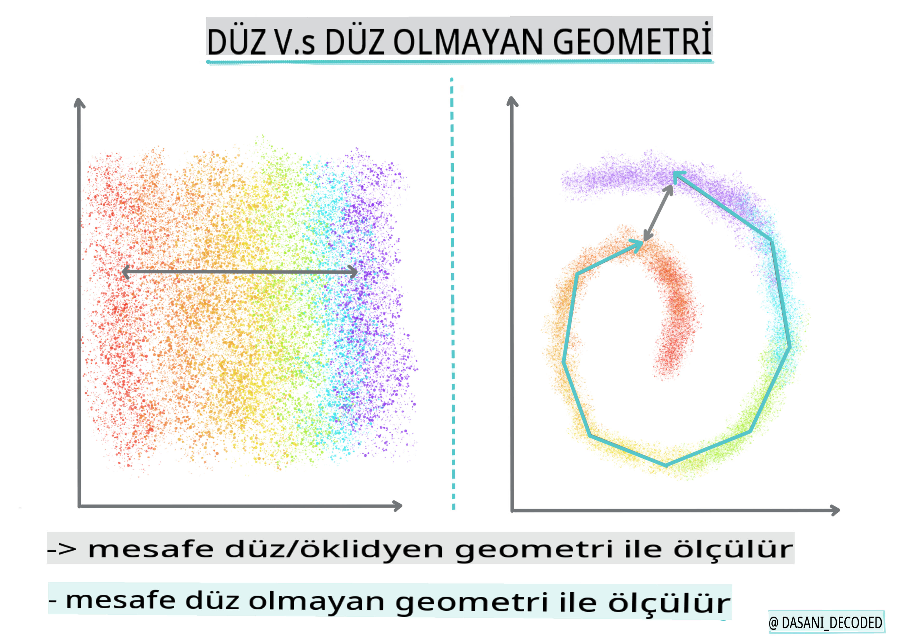
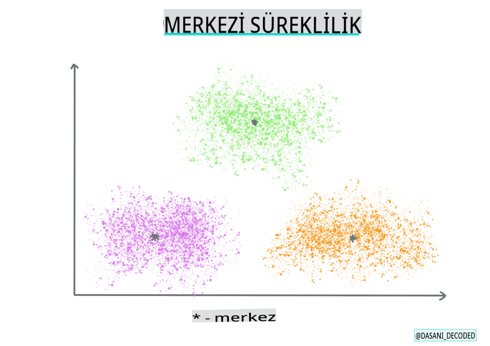

# Kümeleme Giriş

Kümeleme, bir veri kümesinin etiketlenmediğini veya girdilerin önceden tanımlanmış çıktılarla eşleşmediğini varsayan bir tür [Gözetimsiz Öğrenme](https://wikipedia.org/wiki/Unsupervised_learning)'dir. Etiketlenmemiş verileri sıralamak ve veride algıladığı desenlere göre gruplamalar sağlamak için çeşitli algoritmalar kullanır.

[](https://youtu.be/ty2advRiWJM "PSquare tarafından No One Like You")

> 🎥 Yukarıdaki resme tıklayarak bir video izleyebilirsiniz. Kümeleme ile makine öğrenimi çalışırken, bazı Nijeryalı Dance Hall şarkılarının tadını çıkarın - bu, PSquare tarafından 2014 yılında yayımlanmış yüksek puanlı bir şarkıdır.

## [Ön Ders Testi](https://gray-sand-07a10f403.1.azurestaticapps.net/quiz/27/)

### Giriş

[Clustering](https://link.springer.com/referenceworkentry/10.1007%2F978-0-387-30164-8_124) veri keşfi için çok kullanışlıdır. Nijeryalı dinleyicilerin müzik tüketiminde eğilimleri ve desenleri keşfetmeye yardımcı olup olmadığını görelim.

✅ Kümeleme kullanım alanlarını düşünmek için bir dakika ayırın. Gerçek hayatta, çamaşır yığınınız olduğunda ve aile üyelerinizin kıyafetlerini ayırmanız gerektiğinde kümeleme olur 🧦👕👖🩲. Veri biliminde, kullanıcı tercihlerinin analiz edilmesi veya etiketlenmemiş herhangi bir veri kümesinin özelliklerinin belirlenmesi gerektiğinde kümeleme olur. Kümeleme, bir anlamda, kaosu anlamlandırmaya yardımcı olur, tıpkı bir çorap çekmecesi gibi.

[](https://youtu.be/esmzYhuFnds "Kümelemeye Giriş")

> 🎥 Yukarıdaki resme tıklayarak bir video izleyebilirsiniz: MIT'den John Guttag kümelemeyi tanıtıyor.

Profesyonel bir ortamda, kümeleme pazar segmentasyonu gibi şeyleri belirlemek için kullanılabilir, örneğin hangi yaş gruplarının hangi ürünleri satın aldığını belirlemek için. Bir başka kullanım alanı, kredi kartı işlemlerinden oluşan bir veri kümesinde dolandırıcılığı tespit etmek olabilir. Ya da tıbbi taramalardan oluşan bir veri kümesinde tümörleri belirlemek için kümeleme kullanabilirsiniz.

✅ Bir bankacılık, e-ticaret veya iş ortamında 'vahşi doğada' kümelemeyle nasıl karşılaşmış olabileceğinizi bir dakika düşünün.

> 🎓 İlginç bir şekilde, kümeleme analizi 1930'larda Antropoloji ve Psikoloji alanlarında ortaya çıktı. O zamanlar nasıl kullanıldığını hayal edebilir misiniz?

Alternatif olarak, arama sonuçlarını gruplamak için kullanabilirsiniz - örneğin alışveriş bağlantıları, resimler veya incelemeler. Kümeleme, büyük bir veri kümesini azaltmak ve üzerinde daha ayrıntılı analiz yapmak istediğinizde kullanışlıdır, bu nedenle teknik, diğer modeller oluşturulmadan önce veri hakkında bilgi edinmek için kullanılabilir.

✅ Verileriniz kümeler halinde düzenlendikten sonra, ona bir küme kimliği atarsınız ve bu teknik, bir veri kümesinin gizliliğini korurken yararlı olabilir; daha belirgin tanımlanabilir veriler yerine bir veri noktasına küme kimliği ile atıfta bulunabilirsiniz. Bir küme kimliğine başvurmanın, kümeyi tanımlamak için diğer öğeler yerine başka nedenler düşünebilir misiniz?

Kümeleme teknikleri hakkındaki bilginizi bu [Öğrenme modülünde](https://docs.microsoft.com/learn/modules/train-evaluate-cluster-models?WT.mc_id=academic-77952-leestott) derinleştirin.

## Kümelemeye Başlarken

[Scikit-learn geniş bir yelpazede](https://scikit-learn.org/stable/modules/clustering.html) kümeleme yöntemleri sunar. Seçtiğiniz tür, kullanım durumunuza bağlı olacaktır. Dokümana göre, her yöntemin çeşitli faydaları vardır. İşte Scikit-learn tarafından desteklenen yöntemlerin ve uygun kullanım durumlarının basitleştirilmiş bir tablosu:

| Yöntem Adı                   | Kullanım Durumu                                                        |
| :--------------------------- | :--------------------------------------------------------------------- |
| K-Means                      | genel amaçlı, tümevarımsal                                              |
| Affinity propagation         | çok, düzensiz kümeler, tümevarımsal                                      |
| Mean-shift                   | çok, düzensiz kümeler, tümevarımsal                                      |
| Spectral clustering          | az, düzenli kümeler, tümdengelimsel                                      |
| Ward hierarchical clustering | çok, kısıtlı kümeler, tümdengelimsel                                    |
| Agglomerative clustering     | çok, kısıtlı, Öklidyen olmayan mesafeler, tümdengelimsel                |
| DBSCAN                       | düz olmayan geometri, düzensiz kümeler, tümdengelimsel                  |
| OPTICS                       | düz olmayan geometri, değişken yoğunluklu düzensiz kümeler, tümdengelimsel |
| Gaussian mixtures            | düz geometri, tümevarımsal                                              |
| BIRCH                        | büyük veri kümesi, aykırı değerlerle, tümevarımsal                       |

> 🎓 Kümeleri nasıl oluşturduğumuz, veri noktalarını gruplara nasıl topladığımızla çok ilgilidir. Bazı terimleri açalım:
>
> 🎓 ['Tümdengelimsel' vs. 'Tümevarımsal'](https://wikipedia.org/wiki/Transduction_(machine_learning))
> 
> Tümdengelimsel çıkarım, belirli test durumlarına eşlenen gözlemlenmiş eğitim vakalarından türetilir. Tümevarımsal çıkarım ise eğitim vakalarından türetilir ve yalnızca daha sonra test durumlarına uygulanır.
> 
> Bir örnek: Kısmen etiketlenmiş bir veri kümeniz olduğunu hayal edin. Bazı şeyler 'kayıt', bazıları 'cd' ve bazıları boştur. Göreviniz, boşlara etiket vermektir. Tümevarımsal bir yaklaşım seçerseniz, 'kayıtlar' ve 'cd'ler arayan bir model eğitirsiniz ve bu etiketleri etiketlenmemiş verinize uygularsınız. Bu yaklaşım, aslında 'kaset' olan şeyleri sınıflandırmakta zorlanır. Tümdengelimsel bir yaklaşım ise bu bilinmeyen veriyi daha etkili bir şekilde ele alır çünkü benzer öğeleri bir araya getirir ve ardından bir gruba etiket uygular. Bu durumda, kümeler 'yuvarlak müzik şeyleri' ve 'kare müzik şeyleri' gibi olabilir.
> 
> 🎓 ['Düz olmayan' vs. 'düz' geometri](https://datascience.stackexchange.com/questions/52260/terminology-flat-geometry-in-the-context-of-clustering)
> 
> Matematiksel terminolojiden türetilen düz olmayan ve düz geometri, noktalar arasındaki mesafelerin 'düz' ([Öklidyen](https://wikipedia.org/wiki/Euclidean_geometry)) veya 'düz olmayan' (Öklidyen olmayan) geometrik yöntemlerle ölçülmesini ifade eder.
>
>'Düz' bu bağlamda Öklidyen geometriyi ifade eder (bir kısmı 'düzlem' geometri olarak öğretilir) ve düz olmayan, Öklidyen olmayan geometriyi ifade eder. Geometri, makine öğrenimi ile ne ilgisi var? Matematik kökenli iki alan olarak, kümelerdeki noktalar arasındaki mesafeleri ölçmenin ortak bir yolu olmalıdır ve bu, verinin doğasına bağlı olarak 'düz' veya 'düz olmayan' bir şekilde yapılabilir. [Öklidyen mesafeler](https://wikipedia.org/wiki/Euclidean_distance) iki nokta arasındaki bir doğru parçasının uzunluğu olarak ölçülür. [Öklidyen olmayan mesafeler](https://wikipedia.org/wiki/Non-Euclidean_geometry) bir eğri boyunca ölçülür. Veriniz, görselleştirildiğinde, bir düzlemde var olmuyormuş gibi görünüyorsa, bunu ele almak için özel bir algoritma kullanmanız gerekebilir.
>

> Bilgilendirme Grafiği [Dasani Madipalli](https://twitter.com/dasani_decoded) tarafından
> 
> 🎓 ['Mesafeler'](https://web.stanford.edu/class/cs345a/slides/12-clustering.pdf)
> 
> Kümeler, noktalar arasındaki mesafelerle tanımlanır. Bu mesafe birkaç şekilde ölçülebilir. Öklidyen kümeler, nokta değerlerinin ortalaması ile tanımlanır ve bir 'merkez nokta' içerir. Mesafeler, bu merkez noktaya olan mesafeyle ölçülür. Öklidyen olmayan mesafeler, diğer noktalara en yakın nokta olan 'clustroid'ler referans alınarak ölçülür. Clustroid'ler de çeşitli şekillerde tanımlanabilir.
> 
> 🎓 ['Kısıtlı'](https://wikipedia.org/wiki/Constrained_clustering)
> 
> [Kısıtlı Kümeleme](https://web.cs.ucdavis.edu/~davidson/Publications/ICDMTutorial.pdf), bu gözetimsiz yönteme 'yarı gözetimli' öğrenmeyi tanıtır. Noktalar arasındaki ilişkiler 'bağlanamaz' veya 'bağlanması gerekir' olarak işaretlenir, böylece veri kümesine bazı kurallar uygulanır.
>
>Bir örnek: Bir algoritma, etiketlenmemiş veya yarı etiketlenmiş bir veri kümesine serbest bırakıldığında, oluşturduğu kümeler kalitesiz olabilir. Yukarıdaki örnekte, kümeler 'yuvarlak müzik şeyleri', 'kare müzik şeyleri', 'üçgen şeyler' ve 'kurabiyeler' olarak gruplandırılabilir. Bazı kısıtlamalar veya kurallar verilirse ("öğe plastikten yapılmış olmalı", "öğe müzik üretebilmeli"), bu algoritmanın daha iyi seçimler yapmasına yardımcı olabilir.
> 
> 🎓 'Yoğunluk'
> 
> 'Gürültülü' veri 'yoğun' olarak kabul edilir. Her bir kümedeki noktalar arasındaki mesafeler, incelendiğinde daha veya az yoğun, yani 'kalabalık' olabilir ve bu nedenle bu veri, uygun kümeleme yöntemiyle analiz edilmelidir. [Bu makale](https://www.kdnuggets.com/2020/02/understanding-density-based-clustering.html), düzensiz küme yoğunluğuna sahip gürültülü bir veri kümesini keşfetmek için K-Means kümeleme ile HDBSCAN algoritmalarını kullanmanın farkını göstermektedir.

## Kümeleme Algoritmaları

100'den fazla kümeleme algoritması vardır ve kullanımları eldeki verinin doğasına bağlıdır. Bazı ana algoritmaları tartışalım:

- **Hiyerarşik kümeleme**. Bir nesne, yakın bir nesneye olan yakınlığına göre sınıflandırıldığında, kümeler üyelerinin diğer nesnelere olan mesafelerine göre oluşturulur. Scikit-learn'ün agglomeratif kümelemesi hiyerarşiktir.

   
   > Bilgilendirme Grafiği [Dasani Madipalli](https://twitter.com/dasani_decoded) tarafından

- **Merkez noktası kümeleme**. Bu popüler algoritma, oluşturulacak küme sayısını belirledikten sonra, bir kümenin merkez noktasını belirler ve bu nokta etrafında veri toplar. [K-means kümeleme](https://wikipedia.org/wiki/K-means_clustering), merkez noktası kümelemesinin popüler bir versiyonudur. Merkez, en yakın ortalama ile belirlenir, bu nedenle adı. Kümeden olan kare mesafesi minimize edilir.

   
   > Bilgilendirme Grafiği [Dasani Madipalli](https://twitter.com/dasani_decoded) tarafından

- **Dağılım tabanlı kümeleme**. İstatistiksel modellemeye dayalı olan dağılım tabanlı kümeleme, bir veri noktasının bir kümeye ait olma olasılığını belirlemeye ve buna göre atamaya odaklanır. Gaussian karışım yöntemleri bu türe aittir.

- **Yoğunluk tabanlı kümeleme**. Veri noktaları, yoğunluklarına veya birbirleri etrafında gruplandırılmalarına göre kümelere atanır. Grup dışındaki veri noktaları, aykırı değerler veya gürültü olarak kabul edilir. DBSCAN, Mean-shift ve OPTICS bu tür kümelemeye aittir.

- **Izgara tabanlı kümeleme**. Çok boyutlu veri kümeleri için bir ızgara oluşturulur ve veri ızgaranın hücrelerine bölünerek kümeler oluşturulur.

## Alıştırma - Verinizi Kümeleyin

Kümeleme tekniği, doğru görselleştirme ile büyük ölçüde desteklenir, bu yüzden müzik verilerimizi görselleştirmeye başlayalım. Bu alıştırma, bu verinin doğası için en etkili hangi kümeleme yöntemlerini kullanmamız gerektiğine karar vermemize yardımcı olacaktır.

1. Bu klasördeki [_notebook.ipynb_](https://github.com/microsoft/ML-For-Beginners/blob/main/5-Clustering/1-Visualize/notebook.ipynb) dosyasını açın.

1. İyi veri görselleştirme için `Seaborn` paketini içe aktarın.

    ```python
    !pip install seaborn
    ```

1. [_nigerian-songs.csv_](https://github.com/microsoft/ML-For-Beginners/blob/main/5-Clustering/data/nigerian-songs.csv) dosyasından şarkı verilerini ekleyin. Şarkılar hakkında bazı verilerle bir dataframe yükleyin. Kütüphaneleri içe aktararak ve verileri dökerek bu veriyi keşfetmeye hazırlanın:

    ```python
    import matplotlib.pyplot as plt
    import pandas as pd
    
    df = pd.read_csv("../data/nigerian-songs.csv")
    df.head()
    ```

    İlk birkaç satırı kontrol edin:

    |     | name                     | album                        | artist              | artist_top_genre | release_date | length | popularity | danceability | acousticness | energy | instrumentalness | liveness | loudness | speechiness | tempo   | time_signature |
    | --- | ------------------------ | ---------------------------- | ------------------- | ---------------- | ------------ | ------ | ---------- | ------------ | ------------ | ------ | ---------------- | -------- | -------- | ----------- | ------- | -------------- |
    | 0   | Sparky                   | Mandy & The Jungle           | Cruel Santino       | alternative r&b  | 2019         | 144000 | 48         | 0.666        | 0.851        | 0.42   | 0.534            | 0.11     | -6.699   | 0.0829      | 133.015 | 5              |
    | 1   | shuga rush               | EVERYTHING YOU HEARD IS TRUE | Odunsi (The Engine) | afropop          | 2020         | 89488  | 30         | 0.71         | 0.0822       | 0.683  | 0.000169         | 0.101    | -5.64    | 0.36        | 129.993 | 3              |
    | 2   | LITT!                    | LITT!                        | AYLØ                | indie r&b        | 2018         | 207758 | 40         | 0.836        | 0.272        | 0.564  | 0.000537         | 0.11     | -7.127   | 0.0424      | 130.005 | 4              |
    | 3   | Confident / Feeling Cool | Enjoy Your Life              | Lady Donli          | nigerian pop     | 2019         | 175135 | 14         | 0.894        | 0.798        | 0.611  | 0.000187         | 0.0964   | -4.961   | 0.113       | 111.087 | 4              |
    | 4   | wanted you               | rare.                        | Odunsi (The Engine) | afropop          | 2018         | 152049 | 25         | 0.702        | 0.116        | 0.833  | 0.91             | 0.348    | -6.044   | 0.0447      | 105.115 | 4              |

1. `info()` çağırarak dataframe hakkında bazı bilgiler edinin:

    ```python
    df.info()
    ```

   Çıktı şöyle görünecek:

    ```output
    <class 'pandas.core.frame.DataFrame'>
    RangeIndex: 530 entries, 0 to 529
    Data columns (total 16 columns):
     #   Column            Non-Null Count  Dtype  
    ---  ------            --------------  -----  
     0   name              530 non-null    object 
     1   album             530 non-null    object 
     2   artist            530 non-null    object 
     3   artist_top_genre  530 non-null    object 
     4   release_date      530 non-null    int64  
     5   length            530 non-null    int64  
     6   popularity        530 non-null    int64  
     7   danceability      530 non-null    float64
     8   acousticness      530 non-null    float64
     9   energy            530 non-null    float64
     10  instrumentalness  530 non-null    float64
     11  liveness          530 non-null    float64
     12  loudness          530 non-null    float64
     13  speechiness       530 non-null    float64
     14  tempo             530 non-null    float64
     15  time_signature    530 non-null    int64  
    dtypes: float64(8), int64(4), object(4)
    memory usage: 66.4+ KB
    ```

1. `isnull()` çağırarak ve toplamın 0 olduğunu doğrulayarak null değerleri iki kez kontrol edin:

    ```python
    df.isnull().sum()
    ```

    İyi görünüyor:

    ```output
    name                0
    album               0
    artist              0
    artist_top_genre    0
    release_date        0
    length              0
    popularity          0
    danceability        0
    acousticness        0
    energy              0
    instrumentalness    0
    liveness            0
    loudness            0
    speechiness         0
    tempo               0
    time_signature      0
    dtype: int64
    ```

1. Verileri tanımlayın:

    ```python
    df.describe()
    ```

    |       | release_date | length      | popularity | danceability | acousticness | energy   | instrumentalness | liveness | loudness  | speechiness | tempo      | time_signature |
    | ----- | ------------ | ----------- | ---------- | ------------ | ------------ | -------- | ---------------- | -------- | --------- | ----------- | ---------- | -------------- |
    | count | 530          | 530         | 530        | 530          |
## [Ders Sonrası Quiz](https://gray-sand-07a10f403.1.azurestaticapps.net/quiz/28/)

## Gözden Geçirme ve Kendi Kendine Çalışma

Kümeleme algoritmalarını uygulamadan önce, öğrendiğimiz gibi, veri setinizin doğasını anlamak iyi bir fikirdir. Bu konu hakkında daha fazla bilgi edinmek için [buraya](https://www.kdnuggets.com/2019/10/right-clustering-algorithm.html) tıklayın.

[Faydalı bu makale](https://www.freecodecamp.org/news/8-clustering-algorithms-in-machine-learning-that-all-data-scientists-should-know/), farklı veri şekilleri göz önüne alındığında çeşitli kümeleme algoritmalarının nasıl davrandığını açıklar.

## Ödev

[Kümeleme için diğer görselleştirmeleri araştırın](assignment.md)

**Feragatname**:
Bu belge, makine tabanlı AI çeviri hizmetleri kullanılarak çevrilmiştir. Doğruluk için çaba göstersek de, otomatik çevirilerin hata veya yanlışlıklar içerebileceğini lütfen unutmayın. Orijinal belgenin kendi dilindeki hali yetkili kaynak olarak kabul edilmelidir. Kritik bilgiler için profesyonel insan çevirisi önerilir. Bu çevirinin kullanımından kaynaklanan herhangi bir yanlış anlama veya yanlış yorumlamadan sorumlu değiliz.