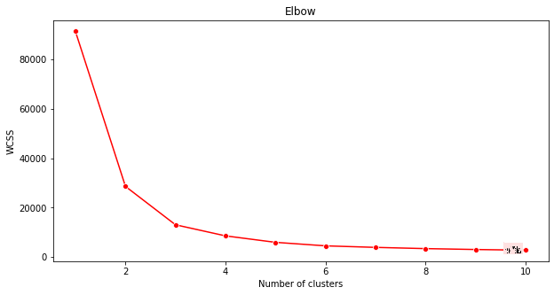
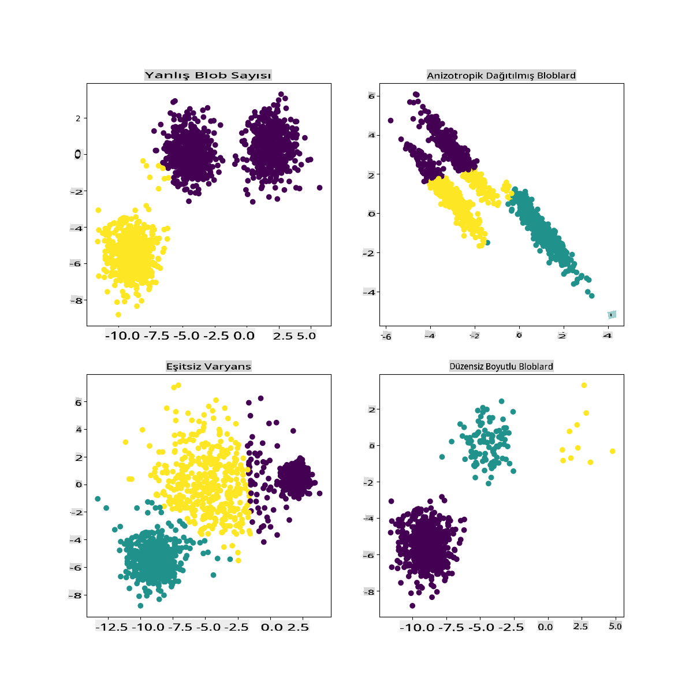

# K-Means kümeleme

## [Ders Öncesi Test](https://gray-sand-07a10f403.1.azurestaticapps.net/quiz/29/)

Bu derste, daha önce içe aktardığınız Nijerya müzik veri kümesini kullanarak Scikit-learn ile nasıl kümeler oluşturacağınızı öğreneceksiniz. K-Means ile Kümeleme'nin temellerini ele alacağız. Daha önceki derste öğrendiğiniz gibi, kümelerle çalışmanın birçok yolu vardır ve kullandığınız yöntem verilerinize bağlıdır. En yaygın kümeleme tekniği olduğu için K-Means'ı deneyeceğiz. Hadi başlayalım!

Öğreneceğiniz terimler:

- Siluet skoru
- Dirsek yöntemi
- Eylemsizlik
- Varyans

## Giriş

[K-Means Kümeleme](https://wikipedia.org/wiki/K-means_clustering), sinyal işleme alanından türetilmiş bir yöntemdir. Bir dizi gözlem kullanarak veri gruplarını 'k' kümelere bölmek ve ayırmak için kullanılır. Her gözlem, verilen bir veri noktasını en yakın 'ortalama'ya veya bir kümenin merkez noktasına en yakın olacak şekilde gruplar.

Kümeler, bir nokta (veya 'tohum') ve karşılık gelen bölgesini içeren [Voronoi diyagramları](https://wikipedia.org/wiki/Voronoi_diagram) olarak görselleştirilebilir.


> infographic by [Jen Looper](https://twitter.com/jenlooper)

K-Means kümeleme süreci [üç adımlı bir süreçte çalışır](https://scikit-learn.org/stable/modules/clustering.html#k-means):

1. Algoritma, veri kümesinden örnekleme yaparak k sayıda merkez noktası seçer. Bundan sonra, döngüye girer:
    1. Her örneği en yakın merkez noktaya atar.
    2. Önceki merkez noktalara atanan tüm örneklerin ortalama değerini alarak yeni merkez noktalar oluşturur.
    3. Ardından, yeni ve eski merkez noktalar arasındaki farkı hesaplar ve merkez noktalar stabilize olana kadar tekrarlar.

K-Means kullanmanın bir dezavantajı, 'k' yani merkez noktalarının sayısını belirlemeniz gerektiğidir. Neyse ki, 'dirsek yöntemi' 'k' için iyi bir başlangıç değeri tahmin etmenize yardımcı olur. Birazdan deneyeceksiniz.

## Önkoşul

Bu dersin [_notebook.ipynb_](https://github.com/microsoft/ML-For-Beginners/blob/main/5-Clustering/2-K-Means/notebook.ipynb) dosyasında çalışacaksınız, bu dosya önceki derste yaptığınız veri içe aktarma ve ön temizleme işlemlerini içerir.

## Alıştırma - hazırlık

Şarkı verilerine tekrar bir göz atarak başlayın.

1. Her sütun için `boxplot()` çağırarak bir kutu grafiği oluşturun:

    ```python
    plt.figure(figsize=(20,20), dpi=200)
    
    plt.subplot(4,3,1)
    sns.boxplot(x = 'popularity', data = df)
    
    plt.subplot(4,3,2)
    sns.boxplot(x = 'acousticness', data = df)
    
    plt.subplot(4,3,3)
    sns.boxplot(x = 'energy', data = df)
    
    plt.subplot(4,3,4)
    sns.boxplot(x = 'instrumentalness', data = df)
    
    plt.subplot(4,3,5)
    sns.boxplot(x = 'liveness', data = df)
    
    plt.subplot(4,3,6)
    sns.boxplot(x = 'loudness', data = df)
    
    plt.subplot(4,3,7)
    sns.boxplot(x = 'speechiness', data = df)
    
    plt.subplot(4,3,8)
    sns.boxplot(x = 'tempo', data = df)
    
    plt.subplot(4,3,9)
    sns.boxplot(x = 'time_signature', data = df)
    
    plt.subplot(4,3,10)
    sns.boxplot(x = 'danceability', data = df)
    
    plt.subplot(4,3,11)
    sns.boxplot(x = 'length', data = df)
    
    plt.subplot(4,3,12)
    sns.boxplot(x = 'release_date', data = df)
    ```

    Bu veri biraz gürültülü: her sütunu kutu grafiği olarak gözlemleyerek aykırı değerleri görebilirsiniz.

    

Veri kümesinden bu aykırı değerleri çıkarabilirsiniz, ancak bu veriyi oldukça minimal hale getirir.

1. Şimdi, kümeleme egzersiziniz için hangi sütunları kullanacağınıza karar verin. Benzer aralıklara sahip olanları seçin ve `artist_top_genre` sütununu sayısal veriler olarak kodlayın:

    ```python
    from sklearn.preprocessing import LabelEncoder
    le = LabelEncoder()
    
    X = df.loc[:, ('artist_top_genre','popularity','danceability','acousticness','loudness','energy')]
    
    y = df['artist_top_genre']
    
    X['artist_top_genre'] = le.fit_transform(X['artist_top_genre'])
    
    y = le.transform(y)
    ```

1. Şimdi kaç küme hedefleyeceğinizi seçmeniz gerekiyor. Veri kümesinden 3 şarkı türü çıkardığınızı biliyorsunuz, bu yüzden 3'ü deneyelim:

    ```python
    from sklearn.cluster import KMeans
    
    nclusters = 3 
    seed = 0
    
    km = KMeans(n_clusters=nclusters, random_state=seed)
    km.fit(X)
    
    # Predict the cluster for each data point
    
    y_cluster_kmeans = km.predict(X)
    y_cluster_kmeans
    ```

Dataframe'in her satırı için tahmin edilen kümeler (0, 1 veya 2) ile basılmış bir dizi görüyorsunuz.

1. Bu diziyi kullanarak bir 'siluet skoru' hesaplayın:

    ```python
    from sklearn import metrics
    score = metrics.silhouette_score(X, y_cluster_kmeans)
    score
    ```

## Siluet skoru

1'e yakın bir siluet skoru arayın. Bu skor -1 ile 1 arasında değişir ve eğer skor 1 ise, küme yoğundur ve diğer kümelerden iyi ayrılmıştır. 0'a yakın bir değer, örneklerin komşu kümelerin karar sınırına çok yakın olduğu örtüşen kümeleri temsil eder. [(Kaynak)](https://dzone.com/articles/kmeans-silhouette-score-explained-with-python-exam)

Bizim skor **.53**, yani ortada. Bu, verilerimizin bu tür bir kümeleme için pek uygun olmadığını gösteriyor, ancak devam edelim.

### Alıştırma - bir model oluşturma

1. `KMeans`'i içe aktarın ve kümeleme sürecine başlayın.

    ```python
    from sklearn.cluster import KMeans
    wcss = []
    
    for i in range(1, 11):
        kmeans = KMeans(n_clusters = i, init = 'k-means++', random_state = 42)
        kmeans.fit(X)
        wcss.append(kmeans.inertia_)
    
    ```

    Burada açıklamaya değer birkaç bölüm var.

    > 🎓 range: Bunlar kümeleme sürecinin iterasyonlarıdır

    > 🎓 random_state: "Merkez noktası başlatma için rastgele sayı üretimini belirler." [Kaynak](https://scikit-learn.org/stable/modules/generated/sklearn.cluster.KMeans.html#sklearn.cluster.KMeans)

    > 🎓 WCSS: "küme içi kareler toplamı" bir küme içindeki tüm noktaların küme merkezine olan kareli ortalama mesafesini ölçer. [Kaynak](https://medium.com/@ODSC/unsupervised-learning-evaluating-clusters-bd47eed175ce). 

    > 🎓 Inertia: K-Means algoritmaları, 'inertia'yı minimize edecek merkez noktaları seçmeye çalışır, "kümelerin ne kadar içsel olarak tutarlı olduğunu ölçen bir ölçüttür." [Kaynak](https://scikit-learn.org/stable/modules/clustering.html). Değer her iterasyonda wcss değişkenine eklenir.

    > 🎓 k-means++: [Scikit-learn](https://scikit-learn.org/stable/modules/clustering.html#k-means)'de 'k-means++' optimizasyonunu kullanabilirsiniz, bu "merkez noktalarını genellikle birbirinden uzak olacak şekilde başlatır, bu da rastgele başlatmadan muhtemelen daha iyi sonuçlar verir.

### Dirsek yöntemi

Daha önce, 3 şarkı türünü hedeflediğiniz için 3 küme seçmeniz gerektiğini varsaymıştınız. Ama gerçekten öyle mi?

1. Emin olmak için 'dirsek yöntemini' kullanın.

    ```python
    plt.figure(figsize=(10,5))
    sns.lineplot(x=range(1, 11), y=wcss, marker='o', color='red')
    plt.title('Elbow')
    plt.xlabel('Number of clusters')
    plt.ylabel('WCSS')
    plt.show()
    ```

    Önceki adımda oluşturduğunuz `wcss` değişkenini kullanarak 'dirsek' bükümünün nerede olduğunu gösteren bir grafik oluşturun, bu optimum küme sayısını gösterir. Belki gerçekten **3**!

    

## Alıştırma - kümeleri gösterme

1. Süreci tekrar deneyin, bu sefer üç küme ayarlayın ve kümeleri bir dağılım grafiği olarak gösterin:

    ```python
    from sklearn.cluster import KMeans
    kmeans = KMeans(n_clusters = 3)
    kmeans.fit(X)
    labels = kmeans.predict(X)
    plt.scatter(df['popularity'],df['danceability'],c = labels)
    plt.xlabel('popularity')
    plt.ylabel('danceability')
    plt.show()
    ```

1. Modelin doğruluğunu kontrol edin:

    ```python
    labels = kmeans.labels_
    
    correct_labels = sum(y == labels)
    
    print("Result: %d out of %d samples were correctly labeled." % (correct_labels, y.size))
    
    print('Accuracy score: {0:0.2f}'. format(correct_labels/float(y.size)))
    ```

    Bu modelin doğruluğu pek iyi değil ve kümelerin şekli nedenini size ipucu veriyor.

    

    Bu veri çok dengesiz, çok az korelasyonlu ve sütun değerleri arasında çok fazla varyans var, bu yüzden iyi kümelenmiyor. Aslında, oluşan kümeler muhtemelen yukarıda tanımladığımız üç tür kategorisinden büyük ölçüde etkileniyor veya eğiliyor. Bu bir öğrenme süreciydi!

    Scikit-learn belgelerinde, bu model gibi, iyi belirlenmemiş kümeleri olan bir modelin 'varyans' problemi olduğunu görebilirsiniz:

    
    > Infographic from Scikit-learn

## Varyans

Varyans, "Ortalamanın kareli farklarının ortalaması" olarak tanımlanır [(Kaynak)](https://www.mathsisfun.com/data/standard-deviation.html). Bu kümeleme problemi bağlamında, veri kümesindeki sayıların ortalamadan biraz fazla sapma eğiliminde olduğunu ifade eder. 

✅ Bu, bu sorunu düzeltmenin tüm yollarını düşünmek için harika bir an. Verileri biraz daha düzenlemek mi? Farklı sütunlar kullanmak mı? Farklı bir algoritma kullanmak mı? İpucu: Verilerinizi normalleştirmek için [ölçeklendirmeyi deneyin](https://www.mygreatlearning.com/blog/learning-data-science-with-k-means-clustering/) ve diğer sütunları test edin.

> Bu '[varyans hesaplayıcısı](https://www.calculatorsoup.com/calculators/statistics/variance-calculator.php)'nı deneyerek kavramı biraz daha iyi anlayın.

---

## 🚀Meydan Okuma

Bu notebook ile biraz zaman geçirin, parametreleri ayarlayın. Verileri daha fazla temizleyerek (örneğin aykırı değerleri çıkararak) modelin doğruluğunu artırabilir misiniz? Belirli veri örneklerine daha fazla ağırlık vermek için ağırlıklar kullanabilirsiniz. Daha iyi kümeler oluşturmak için başka ne yapabilirsiniz?

İpucu: Verilerinizi ölçeklendirmeyi deneyin. Notebook'ta, veri sütunlarını aralık açısından daha benzer hale getirmek için standart ölçeklendirme ekleyen yorumlanmış kod bulacaksınız. Siluet skoru düşse de, dirsek grafiğindeki 'büküm' yumuşar. Bunun nedeni, verileri ölçeklendirilmemiş bırakmanın, daha az varyansa sahip verilerin daha fazla ağırlık taşımasına izin vermesidir. Bu sorun hakkında biraz daha okuyun [burada](https://stats.stackexchange.com/questions/21222/are-mean-normalization-and-feature-scaling-needed-for-k-means-clustering/21226#21226).

## [Ders Sonrası Test](https://gray-sand-07a10f403.1.azurestaticapps.net/quiz/30/)

## Gözden Geçirme ve Kendi Kendine Çalışma

Bir K-Means Simülatörüne [bu gibi](https://user.ceng.metu.edu.tr/~akifakkus/courses/ceng574/k-means/) göz atın. Bu aracı kullanarak örnek veri noktalarını görselleştirebilir ve merkez noktalarını belirleyebilirsiniz. Verilerin rastgeleliğini, küme sayılarını ve merkez noktalarını düzenleyebilirsiniz. Bu, verilerin nasıl gruplanabileceği hakkında bir fikir edinmenize yardımcı olur mu?

Ayrıca Stanford'dan [bu K-Means el kitabına](https://stanford.edu/~cpiech/cs221/handouts/kmeans.html) göz atın.

## Ödev

[Farklı kümeleme yöntemlerini deneyin](assignment.md)

**Feragatname**:
Bu belge, makine tabanlı yapay zeka çeviri hizmetleri kullanılarak çevrilmiştir. Doğruluk için çaba sarf etsek de, otomatik çevirilerin hata veya yanlışlıklar içerebileceğini lütfen unutmayın. Belgenin orijinal dili, yetkili kaynak olarak kabul edilmelidir. Kritik bilgiler için profesyonel insan çevirisi önerilir. Bu çevirinin kullanımından kaynaklanan herhangi bir yanlış anlama veya yanlış yorumlamadan sorumlu değiliz.