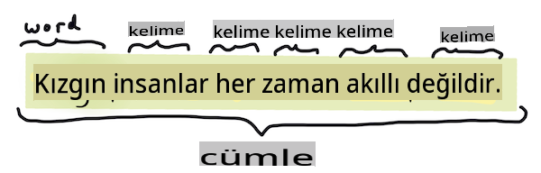
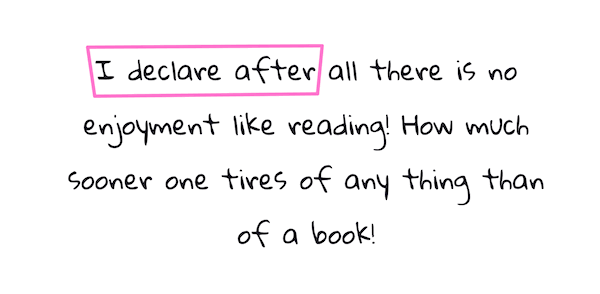

# Doğal Dil İşleme Görevleri ve Teknikleri

Çoğu *doğal dil işleme* görevi için işlenecek metin parçalanmalı, incelenmeli ve sonuçlar kurallar ve veri setleri ile çapraz referanslanarak saklanmalıdır. Bu görevler, programcının bir metindeki terimlerin ve kelimelerin _anlamını_ veya _amacını_ ya da sadece _frekansını_ çıkarmasına olanak tanır.

## [Ders Öncesi Quiz](https://gray-sand-07a10f403.1.azurestaticapps.net/quiz/33/)

Metin işleme sırasında kullanılan yaygın teknikleri keşfedelim. Bu teknikler, makine öğrenimi ile birleştirildiğinde, büyük miktarda metni verimli bir şekilde analiz etmenize yardımcı olur. Ancak, bu görevlerde ML uygulamadan önce, bir NLP uzmanının karşılaştığı sorunları anlamak önemlidir.

## NLP'ye Ortak Görevler

Üzerinde çalıştığınız bir metni analiz etmenin farklı yolları vardır. Bu görevleri gerçekleştirebilir ve bu görevler aracılığıyla metni anlayabilir ve sonuçlar çıkarabilirsiniz. Genellikle bu görevleri bir sırayla yaparsınız.

### Tokenizasyon

Muhtemelen çoğu NLP algoritmasının yapması gereken ilk şey, metni tokenlere veya kelimelere ayırmaktır. Bu basit gibi görünse de, noktalama işaretlerini ve farklı dillerin kelime ve cümle ayırıcılarını hesaba katmak işleri zorlaştırabilir. Sınırları belirlemek için çeşitli yöntemler kullanmanız gerekebilir.


> **Pride and Prejudice**'den bir cümleyi tokenizasyon. Infografik: [Jen Looper](https://twitter.com/jenlooper)

### Gömme Teknikleri

[Kelime gömmeleri](https://wikipedia.org/wiki/Word_embedding), metin verilerinizi sayısal olarak dönüştürmenin bir yoludur. Gömme işlemleri, benzer anlamlara sahip kelimeler veya birlikte kullanılan kelimeler bir araya gelecek şekilde yapılır.


> "Sinirlerinize en yüksek saygıyı duyuyorum, onlar benim eski arkadaşlarım." - **Pride and Prejudice**'den bir cümle için kelime gömmeleri. Infografik: [Jen Looper](https://twitter.com/jenlooper)

✅ Kelime gömmeleriyle denemeler yapmak için [bu ilginç aracı](https://projector.tensorflow.org/) deneyin. Bir kelimeye tıklamak, benzer kelimelerin kümelerini gösterir: 'toy' 'disney', 'lego', 'playstation' ve 'console' ile kümelenir.

### Ayrıştırma ve Sözcük Türü Etiketleme

Tokenize edilen her kelime, bir isim, fiil veya sıfat gibi bir sözcük türü olarak etiketlenebilir. `the quick red fox jumped over the lazy brown dog` cümlesi POS etiketlemesiyle şu şekilde olabilir: fox = isim, jumped = fiil.


> **Pride and Prejudice**'den bir cümleyi ayrıştırma. Infografik: [Jen Looper](https://twitter.com/jenlooper)

Ayrıştırma, bir cümlede hangi kelimelerin birbiriyle ilişkili olduğunu tanımaktır - örneğin `the quick red fox jumped` sıfat-isim-fiil dizisi, `lazy brown dog` dizisinden ayrıdır.

### Kelime ve İfade Frekansları

Büyük bir metin kümesini analiz ederken yararlı bir prosedür, ilgilenilen her kelime veya ifadenin ve ne sıklıkta göründüğünün bir sözlüğünü oluşturmaktır. `the quick red fox jumped over the lazy brown dog` ifadesi için 'the' kelimesinin frekansı 2'dir.

Kelime frekanslarını saydığımız bir örnek metne bakalım. Rudyard Kipling'in The Winners şiiri şu dizeyi içerir:

```output
What the moral? Who rides may read.
When the night is thick and the tracks are blind
A friend at a pinch is a friend, indeed,
But a fool to wait for the laggard behind.
Down to Gehenna or up to the Throne,
He travels the fastest who travels alone.
```

İfade frekansları gerektiği gibi büyük/küçük harf duyarlı veya duyarsız olabilir, `a friend` has a frequency of 2 and `the` has a frequency of 6, and `travels` ifadesi 2'dir.

### N-gramlar

Bir metin, belirli bir uzunluktaki kelime dizilerine bölünebilir: tek kelime (unigram), iki kelime (bigram), üç kelime (trigram) veya herhangi bir sayıda kelime (n-gram).

Örneğin `the quick red fox jumped over the lazy brown dog` ifadesi, 2 n-gram skoru ile şu n-gramları üretir:

1. the quick 
2. quick red 
3. red fox
4. fox jumped 
5. jumped over 
6. over the 
7. the lazy 
8. lazy brown 
9. brown dog

Bunu bir cümlenin üzerinde kayan bir kutu olarak görselleştirmek daha kolay olabilir. İşte 3 kelimelik n-gramlar için örnek, her cümlede n-gram kalın olarak belirtilmiştir:

1.   <u>**the quick red**</u> fox jumped over the lazy brown dog
2.   the **<u>quick red fox</u>** jumped over the lazy brown dog
3.   the quick **<u>red fox jumped</u>** over the lazy brown dog
4.   the quick red **<u>fox jumped over</u>** the lazy brown dog
5.   the quick red fox **<u>jumped over the</u>** lazy brown dog
6.   the quick red fox jumped **<u>over the lazy</u>** brown dog
7.   the quick red fox jumped over <u>**the lazy brown**</u> dog
8.   the quick red fox jumped over the **<u>lazy brown dog</u>**



> 3 n-gram değeri: Infografik: [Jen Looper](https://twitter.com/jenlooper)

### İsim İfadesi Çıkarma

Çoğu cümlede, cümlenin öznesi veya nesnesi olan bir isim vardır. İngilizcede, genellikle 'a', 'an' veya 'the' ile tanımlanabilir. Bir cümlenin öznesini veya nesnesini 'isim ifadesini çıkararak' tanımlamak, cümlenin anlamını anlamaya çalışırken NLP'de yaygın bir görevdir.

✅ "Saat, yer, görünüş veya kelimeler, temeli atan şeyler üzerine karar veremem. Çok uzun zaman oldu. Başladığımı bilmeden önce ortasındaydım." cümlesinde isim ifadelerini tanımlayabilir misiniz?

`the quick red fox jumped over the lazy brown dog` cümlesinde 2 isim ifadesi vardır: **quick red fox** ve **lazy brown dog**.

### Duygu Analizi

Bir cümle veya metin, ne kadar *pozitif* veya *negatif* olduğuna göre analiz edilebilir. Duygu, *kutupluluk* ve *nesnellik/öznellik* olarak ölçülür. Kutupluluk, -1.0'dan 1.0'a (negatiften pozitife) ve 0.0'dan 1.0'a (en nesnelden en öznel) ölçülür.

✅ Daha sonra makine öğrenimi kullanarak duyguyu belirlemenin farklı yollarını öğreneceksiniz, ancak bir yol, insan uzman tarafından pozitif veya negatif olarak kategorize edilen kelime ve ifadelerden oluşan bir listeye sahip olmak ve bu modeli metne uygulayarak bir kutupluluk skoru hesaplamaktır. Bunun bazı durumlarda nasıl işe yarayacağını ve diğerlerinde daha az işe yarayacağını görebilir misiniz?

### Çekim

Çekim, bir kelimeyi almanızı ve kelimenin tekil veya çoğul halini elde etmenizi sağlar.

### Lematizasyon

Bir *lemma*, bir kelime kümesi için kök veya baş kelimedir, örneğin *flew*, *flies*, *flying* kelimelerinin lemması *fly* fiilidir.

NLP araştırmacısı için kullanışlı veritabanları da mevcuttur, özellikle:

### WordNet

[WordNet](https://wordnet.princeton.edu/), birçok farklı dildeki her kelime için kelimeler, eşanlamlılar, zıt anlamlılar ve birçok diğer detayların yer aldığı bir veritabanıdır. Çeviri, yazım denetleyicileri veya herhangi bir türde dil araçları oluştururken inanılmaz derecede faydalıdır.

## NLP Kütüphaneleri

Neyse ki, tüm bu teknikleri kendiniz oluşturmanız gerekmiyor, çünkü doğal dil işleme veya makine öğrenimi konusunda uzman olmayan geliştiriciler için çok daha erişilebilir hale getiren mükemmel Python kütüphaneleri mevcut. Bir sonraki derslerde bunların daha fazla örneğini göreceksiniz, ancak burada bir sonraki görevinizde size yardımcı olacak bazı faydalı örnekler öğreneceksiniz.

### Egzersiz - `TextBlob` library

Let's use a library called TextBlob as it contains helpful APIs for tackling these types of tasks. TextBlob "stands on the giant shoulders of [NLTK](https://nltk.org) and [pattern](https://github.com/clips/pattern), and plays nicely with both." It has a considerable amount of ML embedded in its API.

> Note: A useful [Quick Start](https://textblob.readthedocs.io/en/dev/quickstart.html#quickstart) guide is available for TextBlob that is recommended for experienced Python developers 

When attempting to identify *noun phrases*, TextBlob offers several options of extractors to find noun phrases. 

1. Take a look at `ConllExtractor` kullanımı

    ```python
    from textblob import TextBlob
    from textblob.np_extractors import ConllExtractor
    # import and create a Conll extractor to use later 
    extractor = ConllExtractor()
    
    # later when you need a noun phrase extractor:
    user_input = input("> ")
    user_input_blob = TextBlob(user_input, np_extractor=extractor)  # note non-default extractor specified
    np = user_input_blob.noun_phrases                                    
    ```

    > Burada ne oluyor? [ConllExtractor](https://textblob.readthedocs.io/en/dev/api_reference.html?highlight=Conll#textblob.en.np_extractors.ConllExtractor), "ConLL-2000 eğitim korpusu ile eğitilmiş chunk ayrıştırma kullanan bir isim ifadesi çıkarıcısıdır." ConLL-2000, 2000 Yılı Hesaplamalı Doğal Dil Öğrenme Konferansı'na atıfta bulunur. Her yıl konferans, zorlu bir NLP sorununu ele almak için bir atölye çalışması düzenler ve 2000 yılında bu isim chunking idi. Bir model Wall Street Journal'da eğitildi, "15-18. bölümler eğitim verisi olarak (211727 token) ve 20. bölüm test verisi olarak (47377 token) kullanıldı". Kullanılan prosedürlere [buradan](https://www.clips.uantwerpen.be/conll2000/chunking/) ve [sonuçlara](https://ifarm.nl/erikt/research/np-chunking.html) bakabilirsiniz.

### Meydan Okuma - Botunuzu NLP ile geliştirmek

Önceki derste çok basit bir Soru-Cevap botu oluşturmuştunuz. Şimdi, Marvin'i biraz daha sempatik hale getirerek girdiğiniz metni analiz edip duyguya uygun bir yanıt vererek geliştireceksiniz. Ayrıca bir `noun_phrase` tanımlayıp onun hakkında daha fazla bilgi isteyeceksiniz.

Daha iyi bir konuşma botu oluştururken adımlarınız:

1. Kullanıcıya botla nasıl etkileşime geçeceğini açıklayan talimatları yazdırın
2. Döngüye başlayın
   1. Kullanıcı girdiğini kabul edin
   2. Kullanıcı çıkmak isterse çıkın
   3. Kullanıcı girdisini işleyin ve uygun duygu yanıtını belirleyin
   4. Duyguda bir isim ifadesi tespit edilirse, onu çoğullaştırın ve bu konu hakkında daha fazla bilgi isteyin
   5. Yanıtı yazdırın
3. 2. adıma geri dönün

Duyguyu belirlemek için TextBlob kullanarak kod parçası burada. Not: sadece dört *duygu derecesi* vardır (daha fazla ekleyebilirsiniz):

```python
if user_input_blob.polarity <= -0.5:
  response = "Oh dear, that sounds bad. "
elif user_input_blob.polarity <= 0:
  response = "Hmm, that's not great. "
elif user_input_blob.polarity <= 0.5:
  response = "Well, that sounds positive. "
elif user_input_blob.polarity <= 1:
  response = "Wow, that sounds great. "
```

İşte bazı örnek çıktı (kullanıcı girdiği > ile başlayan satırlardadır):

```output
Hello, I am Marvin, the friendly robot.
You can end this conversation at any time by typing 'bye'
After typing each answer, press 'enter'
How are you today?
> I am ok
Well, that sounds positive. Can you tell me more?
> I went for a walk and saw a lovely cat
Well, that sounds positive. Can you tell me more about lovely cats?
> cats are the best. But I also have a cool dog
Wow, that sounds great. Can you tell me more about cool dogs?
> I have an old hounddog but he is sick
Hmm, that's not great. Can you tell me more about old hounddogs?
> bye
It was nice talking to you, goodbye!
```

Görevin bir olası çözümü [burada](https://github.com/microsoft/ML-For-Beginners/blob/main/6-NLP/2-Tasks/solution/bot.py)

✅ Bilgi Kontrolü

1. Sempatik yanıtların birini botun gerçekten anladığını düşündürebileceğini düşünüyor musunuz?
2. İsim ifadesini belirlemek botu daha inandırıcı kılar mı?
3. Bir cümleden 'isim ifadesi' çıkarmak neden faydalı olabilir?

---

Önceki bilgi kontrolünde botu uygulayın ve bir arkadaşınız üzerinde test edin. Onları kandırabilir mi? Botunuzu daha inandırıcı yapabilir misiniz?

## 🚀Meydan Okuma

Önceki bilgi kontrolündeki bir görevi alın ve uygulamaya çalışın. Botu bir arkadaşınız üzerinde test edin. Onları kandırabilir mi? Botunuzu daha inandırıcı yapabilir misiniz?

## [Ders Sonrası Quiz](https://gray-sand-07a10f403.1.azurestaticapps.net/quiz/34/)

## İnceleme ve Kendi Kendine Çalışma

Sonraki birkaç derste duygu analizini daha fazla öğreneceksiniz. [KDNuggets](https://www.kdnuggets.com/tag/nlp) gibi makalelerde bu ilginç tekniği araştırın.

## Ödev 

[Bir botu konuştur](assignment.md)

**Feragatname**: 
Bu belge, makine tabanlı yapay zeka çeviri hizmetleri kullanılarak çevrilmiştir. Doğruluk için çaba göstersek de, otomatik çevirilerin hata veya yanlışlıklar içerebileceğini lütfen unutmayın. Orijinal belgenin kendi dilindeki hali, yetkili kaynak olarak kabul edilmelidir. Kritik bilgiler için profesyonel insan çevirisi önerilir. Bu çevirinin kullanımından doğabilecek herhangi bir yanlış anlama veya yanlış yorumlamadan sorumlu değiliz.