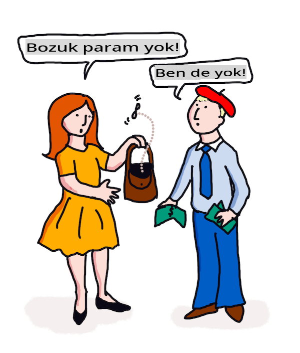

# ML ile Çeviri ve Duygu Analizi

Önceki derslerde, temel NLP görevlerini gerçekleştirmek için sahne arkasında ML'yi kullanan `TextBlob` kütüphanesini kullanarak temel bir bot nasıl oluşturulacağını öğrendiniz. Hesaplamalı dilbilimdeki bir diğer önemli zorluk, bir cümlenin bir konuşulan veya yazılan dilden diğerine doğru bir şekilde _çevirisi_ dir.

## [Ders Öncesi Quiz](https://gray-sand-07a10f403.1.azurestaticapps.net/quiz/35/)

Çeviri, binlerce dilin bulunması ve her birinin çok farklı dilbilgisi kurallarına sahip olabilmesi nedeniyle çok zor bir problemdir. Bir yaklaşım, İngilizce gibi bir dilin resmi dilbilgisi kurallarını dil bağımsız bir yapıya dönüştürmek ve ardından bunu başka bir dile çevirerek geri dönüştürmektir. Bu yaklaşım şu adımları içerir:

1. **Tanımlama**. Giriş dilindeki kelimeleri isimler, fiiller vb. olarak tanımlayın veya etiketleyin.
2. **Çeviri Oluşturma**. Hedef dil formatında her kelimenin doğrudan çevirisini üretin.

### Örnek cümle, İngilizceden İrlandacaya

'İngilizce'de, _I feel happy_ cümlesi üç kelimedir ve sırası:

- **özne** (I)
- **fiil** (feel)
- **sıfat** (happy)

Ancak, 'İrlandaca' dilinde, aynı cümlenin çok farklı bir dilbilgisi yapısı vardır - "*happy*" veya "*sad*" gibi duygular *üzerinde* olarak ifade edilir.

İngilizce ifadesi `I feel happy` İrlandacada `Tá athas orm` olur. Kelimesi kelimesine çeviri `Happy is upon me` olurdu.

Bir İrlandaca konuşan kişi İngilizceye çeviri yaparken `I feel happy` derdi, `Happy is upon me` değil, çünkü cümlenin anlamını anlarlar, kelimeler ve cümle yapısı farklı olsa bile.

İrlandaca cümle için resmi sıra:

- **fiil** (Tá veya is)
- **sıfat** (athas, veya happy)
- **özne** (orm, veya upon me)

## Çeviri

Naif bir çeviri programı, cümle yapısını göz ardı ederek yalnızca kelimeleri çevirebilir.

✅ İkinci (veya üçüncü veya daha fazla) bir dili yetişkin olarak öğrendiyseniz, ana dilinizde düşünerek, bir kavramı kelime kelime ikinci dile çevirerek ve ardından çevirinizi konuşarak başlamış olabilirsiniz. Bu, naif çeviri bilgisayar programlarının yaptığına benzer. Akıcılık kazanmak için bu aşamayı geçmek önemlidir!

Naif çeviri kötü (ve bazen komik) yanlış çevirilere yol açar: `I feel happy` İrlandacada kelimesi kelimesine `Mise bhraitheann athas` olarak çevrilir. Bu (kelimesi kelimesine) `me feel happy` anlamına gelir ve geçerli bir İrlandaca cümle değildir. İngilizce ve İrlandaca, iki yakın komşu adada konuşulan diller olmasına rağmen, çok farklı dilbilgisi yapıları olan farklı dillerdir.

> İrlandaca dil gelenekleri hakkında bazı videolar izleyebilirsiniz, örneğin [bu video](https://www.youtube.com/watch?v=mRIaLSdRMMs)

### Makine öğrenimi yaklaşımları

Şimdiye kadar, doğal dil işleme için resmi kurallar yaklaşımını öğrendiniz. Başka bir yaklaşım, kelimelerin anlamını göz ardı etmek ve _yerine desenleri tespit etmek için makine öğrenimini kullanmaktır_. Bu, hem kaynak hem de hedef dillerde çok fazla metin (bir *corpus*) veya metinler (*corpora*) varsa çeviride işe yarayabilir.

Örneğin, Jane Austen tarafından 1813'te yazılan ünlü İngiliz romanı *Pride and Prejudice* örneğini ele alalım. Kitabı İngilizce ve kitabın *Fransızca* bir insan çevirisini incelediğinizde, birinin diğerine _deyimsel_ olarak çevrildiği ifadeleri tespit edebilirsiniz. Bunu birazdan yapacaksınız.

Örneğin, İngilizce `I have no money` ifadesi Fransızcaya kelimesi kelimesine çevrildiğinde `Je n'ai pas de monnaie` olabilir. "Monnaie", Fransızca'da 'false cognate' (yanıltıcı benzerlik) olarak 'money' ve 'monnaie' eşanlamlı değildir. İnsan tarafından yapılmış daha iyi bir çeviri `Je n'ai pas d'argent` olacaktır, çünkü bu, paranızın olmadığını (değişiklik anlamında değil) daha iyi ifade eder.



> Görsel [Jen Looper](https://twitter.com/jenlooper) tarafından

Bir ML modeli, her iki dilde de uzman insan konuşmacılar tarafından daha önce çevrilmiş metinlerdeki ortak desenleri belirleyerek çevirilerin doğruluğunu artırabilir.

### Egzersiz - çeviri

`TextBlob` kullanarak cümleleri çevirebilirsiniz. **Pride and Prejudice**'in ünlü ilk cümlesini deneyin:

```python
from textblob import TextBlob

blob = TextBlob(
    "It is a truth universally acknowledged, that a single man in possession of a good fortune, must be in want of a wife!"
)
print(blob.translate(to="fr"))

```

`TextBlob` çeviride oldukça iyi bir iş çıkarır: "C'est une vérité universellement reconnue, qu'un homme célibataire en possession d'une bonne fortune doit avoir besoin d'une femme!".

TextBlob'un çevirisinin, aslında, V. Leconte ve Ch. Pressoir tarafından 1932'de yapılan Fransızca çevirisinden çok daha kesin olduğu söylenebilir:

"C'est une vérité universelle qu'un célibataire pourvu d'une belle fortune doit avoir envie de se marier, et, si peu que l'on sache de son sentiment à cet égard, lorsqu'il arrive dans une nouvelle résidence, cette idée est si bien fixée dans l'esprit de ses voisins qu'ils le considèrent sur-le-champ comme la propriété légitime de l'une ou l'autre de leurs filles."

Bu durumda, ML tarafından bilgilendirilen çeviri, orijinal yazarın ağzına gereksiz yere kelimeler koyan insan çevirmeninden daha iyi bir iş çıkarır.

> Burada neler oluyor? ve TextBlob neden çeviride bu kadar iyi? Aslında, arka planda Google translate kullanıyor, milyonlarca ifadeyi analiz edebilen ve görev için en iyi dizeleri tahmin edebilen sofistike bir AI. Burada manuel hiçbir şey yok ve `blob.translate` kullanmak için bir internet bağlantısına ihtiyacınız var.

---

## Duygu Analizi

Duygu analizi, bir metnin olumlu, olumsuz veya tarafsız olup olmadığını belirlemek için kullanılır. Bu, kullanıcı geri bildirimleri, sosyal medya gönderileri veya müşteri incelemeleri gibi metinlerin genel tonunu anlamak için çok yararlıdır.

> Örneğin, "Harika, bu karanlık yolda kaybolduğumuza sevindim" ifadesi, alaycı, olumsuz bir duygu cümlesidir, ancak basit algoritma 'harika', 'muhteşem', 'sevindim' gibi olumlu ve 'israf', 'kayboldu', 'karanlık' gibi olumsuz kelimeleri tespit eder. Genel duygu, bu çelişkili kelimelerle etkilenir.

✅ Bir saniye durun ve insan konuşmacılar olarak alaycılığı nasıl ifade ettiğimizi düşünün. Tonlama büyük bir rol oynar. "Peki, o film harikaydı" ifadesini farklı şekillerde söylemeye çalışın ve sesinizin anlamı nasıl ilettiğini keşfedin.

### ML yaklaşımları

ML yaklaşımı, olumsuz ve olumlu metinleri - tweetler, film incelemeleri veya bir insanın bir puan *ve* yazılı bir görüş verdiği herhangi bir şey - manuel olarak toplamaktır. Daha sonra, NLP teknikleri görüşlere ve puanlara uygulanabilir, böylece desenler ortaya çıkar (örneğin, olumlu film incelemeleri 'Oscar'a değer' ifadesini olumsuz film incelemelerinden daha fazla içerir veya olumlu restoran incelemeleri 'gurme' kelimesini 'iğrenç'ten daha fazla içerir).

> ⚖️ **Örnek**: Bir politikacının ofisinde çalıştığınızı ve tartışılan yeni bir yasa olduğunu varsayalım, seçmenler ofise bu yeni yasayı destekleyen veya karşı çıkan e-postalar yazabilirler. Diyelim ki e-postaları okuyup iki yığın halinde ayırmakla görevlisiniz, *destekleyen* ve *karşı çıkan*. Çok fazla e-posta varsa, hepsini okumaya çalışmak sizi bunaltabilir. Bir botun hepsini sizin için okuyup, anlayıp, her e-postanın hangi yığına ait olduğunu söylemesi güzel olmaz mıydı?
> 
> Bunu başarmanın bir yolu Makine Öğrenimi kullanmaktır. Modeli, *karşı çıkan* e-postaların bir kısmı ve *destekleyen* e-postaların bir kısmı ile eğitirdiniz. Model, belirli ifadeleri ve kelimeleri karşı çıkan veya destekleyen e-postalarla ilişkilendirme eğiliminde olur, *ancak içeriğin hiçbirini anlamaz*, yalnızca belirli kelimelerin ve desenlerin bir *karşı çıkan* veya *destekleyen* e-postada daha olası olduğunu bilir. Modeli, eğitmek için kullanmadığınız bazı e-postalarla test edebilir ve aynı sonuca varıp varmadığını görebilirsiniz. Daha sonra, modelin doğruluğundan memnun olduğunuzda, gelecekteki e-postaları okumadan işleyebilirsiniz.

✅ Bu süreç, önceki derslerde kullandığınız süreçlere benziyor mu?

## Egzersiz - duygusal cümleler

Duygu, -1 ile 1 arasında bir *kutuplaşma* ile ölçülür, bu da -1'in en olumsuz duygu olduğunu ve 1'in en olumlu olduğunu gösterir. Duygu ayrıca nesnellik (0) ve öznellik (1) için 0 - 1 arası bir puanla ölçülür.

Jane Austen'ın *Pride and Prejudice* eserine tekrar bir göz atın. Metin [Project Gutenberg](https://www.gutenberg.org/files/1342/1342-h/1342-h.htm) sitesinde mevcuttur. Aşağıdaki örnek, kitabın ilk ve son cümlelerinin duygusunu analiz eden ve duygusal kutuplaşma ve nesnellik/öznellik puanını gösteren kısa bir programı göstermektedir.

Bu görevde `sentiment` belirlemek için (kendi duygu hesaplayıcınızı yazmanız gerekmez) `TextBlob` kütüphanesini (yukarıda açıklanmıştır) kullanmalısınız.

```python
from textblob import TextBlob

quote1 = """It is a truth universally acknowledged, that a single man in possession of a good fortune, must be in want of a wife."""

quote2 = """Darcy, as well as Elizabeth, really loved them; and they were both ever sensible of the warmest gratitude towards the persons who, by bringing her into Derbyshire, had been the means of uniting them."""

sentiment1 = TextBlob(quote1).sentiment
sentiment2 = TextBlob(quote2).sentiment

print(quote1 + " has a sentiment of " + str(sentiment1))
print(quote2 + " has a sentiment of " + str(sentiment2))
```

Aşağıdaki çıktıyı görüyorsunuz:

```output
It is a truth universally acknowledged, that a single man in possession of a good fortune, must be in want # of a wife. has a sentiment of Sentiment(polarity=0.20952380952380953, subjectivity=0.27142857142857146)

Darcy, as well as Elizabeth, really loved them; and they were
     both ever sensible of the warmest gratitude towards the persons
      who, by bringing her into Derbyshire, had been the means of
      uniting them. has a sentiment of Sentiment(polarity=0.7, subjectivity=0.8)
```

## Zorluk - duygu kutuplaşmasını kontrol etme

Göreviniz, *Pride and Prejudice*'in kesinlikle olumlu cümlelerinin kesinlikle olumsuz cümlelerinden daha fazla olup olmadığını duygu kutuplaşmasını kullanarak belirlemektir. Bu görev için, 1 veya -1'lik bir kutuplaşma puanının kesinlikle olumlu veya olumsuz olduğunu varsayabilirsiniz.

**Adımlar:**

1. [Pride and Prejudice](https://www.gutenberg.org/files/1342/1342-h/1342-h.htm) kopyasını Project Gutenberg'den .txt dosyası olarak indirin. Dosyanın başındaki ve sonundaki meta verileri kaldırın, yalnızca orijinal metni bırakın.
2. Dosyayı Python'da açın ve içeriğini bir dize olarak çıkarın.
3. Kitap dizisi kullanarak bir TextBlob oluşturun.
4. Kitaptaki her cümleyi bir döngüde analiz edin.
   1. Kutuplaşma 1 veya -1 ise cümleyi olumlu veya olumsuz mesajlar listesine kaydedin.
5. Sonunda, tüm olumlu ve olumsuz cümleleri (ayrı ayrı) ve her birinin sayısını yazdırın.

İşte bir örnek [çözüm](https://github.com/microsoft/ML-For-Beginners/blob/main/6-NLP/3-Translation-Sentiment/solution/notebook.ipynb).

✅ Bilgi Kontrolü

1. Duygu, cümlede kullanılan kelimelere dayanır, ancak kod kelimeleri *anlar* mı?
2. Duygu kutuplaşmasının doğru olduğunu düşünüyor musunuz, başka bir deyişle, puanlarla *aynı fikirde misiniz*?
   1. Özellikle, aşağıdaki cümlelerin mutlak **olumlu** kutuplaşması ile aynı fikirde misiniz veya farklı mısınız?
      * “Ne mükemmel bir babanız var, kızlar!” dedi kapı kapandığında.
      * “Bay Darcy'nin incelemesi sona erdi sanırım,” dedi Bayan Bingley; “ve sonucu nedir?” “Bundan tamamen eminim ki Bay Darcy'nin hiçbir kusuru yok.
      * Bu tür şeylerin nasıl harika bir şekilde gerçekleştiği!
      * Bu tür şeylerden dünyada en büyük hoşnutsuzluğa sahibim.
      * Charlotte mükemmel bir yöneticidir, sanırım.
      * “Bu gerçekten harika!
      * Çok mutluyum!
      * Midilliler hakkındaki fikriniz harika.
   2. Aşağıdaki 3 cümle mutlak olumlu bir duygu ile puanlandı, ancak dikkatlice okunduğunda, olumlu cümleler değiller. Duygu analizi neden olumlu cümleler olduğunu düşündü?
      * Netherfield'deki kalışı bittiğinde mutlu olacağım!” “Sizi rahatlatacak bir şey söyleyebilmek isterdim,” diye yanıtladı Elizabeth; “ama bu tamamen benim gücümün dışında.
      * Sizi mutlu görebilseydim!
      * Sevgili Lizzy, sıkıntımız çok büyük.
   3. Aşağıdaki cümlelerin mutlak **olumsuz** kutuplaşması ile aynı fikirde misiniz veya farklı mısınız?
      - Herkes onun gururundan iğreniyor.
      - “Yabancılar arasında nasıl davrandığını bilmek isterdim.” “O zaman duyacaksın ama kendini çok korkunç bir şeye hazırlamalısın.
      - Duraklama Elizabeth'in hislerine korkunçtu.
      - Bu korkunç olurdu!

✅ Jane Austen'ın herhangi bir hayranı, kitaplarını İngiliz Regency toplumunun daha gülünç yönlerini eleştirmek için sıklıkla kullandığını anlayacaktır. *Pride and Prejudice*'in ana karakteri Elizabeth Bennett, keskin bir sosyal gözlemcidir (yazar gibi) ve dili sık sık ağır bir şekilde nüanslıdır. Hikayedeki aşk ilgisi olan Bay Darcy bile Elizabeth'in dilini alaycı ve şakacı kullanmasını fark eder: "Sizinle tanışmanın verdiği zevk, ara sıra kendi görüşlerinizi ifade etmekten büyük keyif aldığınızı bilmem için yeterli oldu."

---

## 🚀Zorluk

Marvin'i kullanıcı girdisinden diğer özellikleri çıkararak daha da geliştirebilir misiniz?

## [Ders Sonrası Quiz](https://gray-sand-07a10f403.1.azurestaticapps.net/quiz/36/)

## Gözden Geçirme ve Kendi Kendine Çalışma

Metinden duygu çıkarmanın birçok yolu vardır. Bu tekniği kullanabilecek iş uygulamalarını düşünün. Yanlış gidebileceği yolları düşünün. Duyguyu analiz eden sofistike kurumsal sistemler hakkında daha fazla bilgi edinin, örneğin [Azure Text Analysis](https://docs.microsoft.com/azure/cognitive-services/Text-Analytics/how-tos/text-analytics-how-to-sentiment-analysis?tabs=version-3-1?WT.mc_id=academic-77952-leestott). Yukarıdaki Pride and Prejudice cümlelerinin bazılarını test edin ve nüansı algılayıp algılayamayacağını görün.

## Ödev 

[Şiirsel lisans](assignment.md)

**Feragatname**:
Bu belge, makine tabanlı AI çeviri hizmetleri kullanılarak çevrilmiştir. Doğruluk için çaba göstersek de, otomatik çevirilerin hata veya yanlışlıklar içerebileceğini lütfen unutmayın. Belgenin orijinal dili, yetkili kaynak olarak kabul edilmelidir. Kritik bilgiler için profesyonel insan çevirisi önerilir. Bu çevirinin kullanımından kaynaklanan herhangi bir yanlış anlama veya yanlış yorumlama durumunda sorumluluk kabul etmiyoruz.