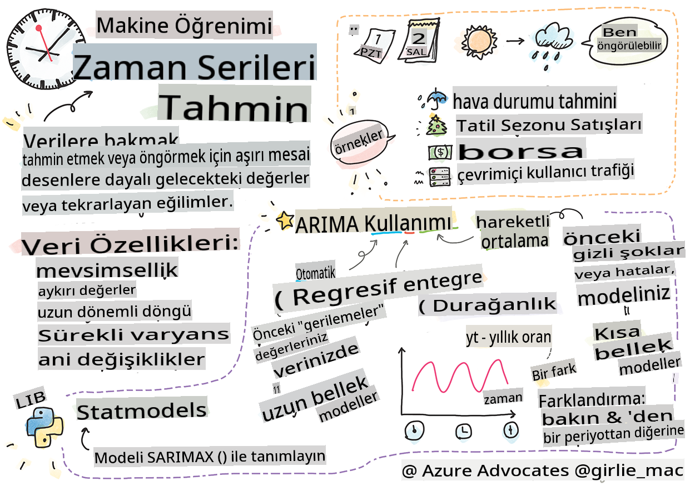
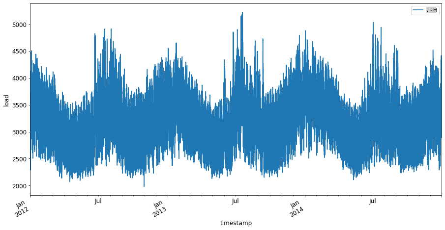
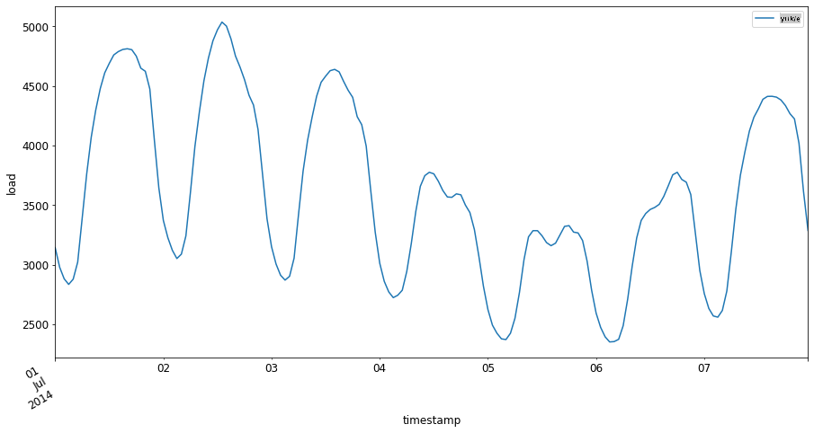

# Zaman Serisi Tahminine Giriş



> Çizim [Tomomi Imura](https://www.twitter.com/girlie_mac) tarafından

Bu derste ve bir sonraki derste, zaman serisi tahmini hakkında biraz bilgi edineceksiniz. Bu, bir ML bilim insanının repertuarının ilginç ve değerli bir parçasıdır, ancak diğer konular kadar bilinmemektedir. Zaman serisi tahmini, bir tür 'kristal küre' gibidir: fiyat gibi bir değişkenin geçmiş performansına dayanarak, gelecekteki potansiyel değerini tahmin edebilirsiniz.

[](https://youtu.be/cBojo1hsHiI "Zaman serisi tahminine giriş")

> 🎥 Zaman serisi tahmini hakkında bir video için yukarıdaki resme tıklayın

## [Ders Öncesi Quiz](https://gray-sand-07a10f403.1.azurestaticapps.net/quiz/41/)

Fiyatlandırma, envanter ve tedarik zinciri sorunlarına doğrudan uygulanabilirliği göz önüne alındığında, iş dünyası için gerçek değeri olan faydalı ve ilginç bir alandır. Derin öğrenme teknikleri, gelecekteki performansı daha iyi tahmin etmek için daha fazla içgörü elde etmek amacıyla kullanılmaya başlanmış olsa da, zaman serisi tahmini, büyük ölçüde klasik ML teknikleri tarafından bilgilendirilen bir alandır.

> Penn State'in faydalı zaman serisi müfredatına [buradan](https://online.stat.psu.edu/stat510/lesson/1) ulaşabilirsiniz.

## Giriş

Diyelim ki, zamanla ne kadar sıklıkla kullanıldıkları ve ne kadar süreyle kullanıldıkları hakkında veri sağlayan bir dizi akıllı otopark sayacını yönetiyorsunuz.

> Geçmiş performansına dayanarak, arz ve talep yasalarına göre gelecekteki değerini tahmin edebileceğinizi düşünün?

Hedefinize ulaşmak için ne zaman harekete geçmeniz gerektiğini doğru bir şekilde tahmin etmek, zaman serisi tahmini ile ele alınabilecek bir zorluktur. İnsanlar park yeri ararken yoğun zamanlarda daha fazla ücret alınmasından hoşlanmayabilirler, ancak bu, sokakları temizlemek için gelir elde etmenin kesin bir yolu olacaktır!

Bazı zaman serisi algoritmalarını inceleyelim ve bazı verileri temizlemek ve hazırlamak için bir defter başlatalım. Analiz edeceğiniz veriler, GEFCom2014 tahmin yarışmasından alınmıştır. 2012 ve 2014 yılları arasında 3 yıllık saatlik elektrik yükü ve sıcaklık değerlerinden oluşmaktadır. Elektrik yükü ve sıcaklıklarının geçmiş desenlerine bakarak, gelecekteki elektrik yükü değerlerini tahmin edebilirsiniz.

Bu örnekte, yalnızca geçmiş yük verilerini kullanarak bir zaman adımını ileriye tahmin etmeyi öğreneceksiniz. Ancak başlamadan önce, perde arkasında neler olduğunu anlamak faydalı olacaktır.

## Bazı Tanımlar

'Zaman serisi' terimiyle karşılaştığınızda, onun farklı bağlamlarda nasıl kullanıldığını anlamanız gerekir.

🎓 **Zaman serisi**

Matematikte, "bir zaman serisi, zaman sırasına göre dizinlenmiş (veya listelenmiş veya grafiğe dökülmüş) bir veri noktaları serisidir. En yaygın olarak, bir zaman serisi, ardışık eşit aralıklı zaman noktalarında alınan bir dizidir." Bir zaman serisi örneği, [Dow Jones Sanayi Ortalaması](https://wikipedia.org/wiki/Time_series)'nın günlük kapanış değeridir. Zaman serisi grafikleri ve istatistiksel modellemenin kullanımı, sinyal işleme, hava durumu tahmini, deprem tahmini ve olayların meydana geldiği ve veri noktalarının zamanla çizilebileceği diğer alanlarda sıkça karşılaşılır.

🎓 **Zaman serisi analizi**

Zaman serisi analizi, yukarıda bahsedilen zaman serisi verilerinin analizidir. Zaman serisi verileri, bir kesinti olayından önce ve sonra bir zaman serisinin evrimindeki desenleri tespit eden 'kesintili zaman serileri' de dahil olmak üzere farklı biçimler alabilir. Zaman serisi için gereken analiz türü, verilerin doğasına bağlıdır. Zaman serisi verileri, sayı veya karakter serileri biçiminde olabilir.

Yapılacak analiz, frekans alanı ve zaman alanı, doğrusal ve doğrusal olmayan ve daha fazlası dahil olmak üzere çeşitli yöntemler kullanır. Bu tür verileri analiz etmenin birçok yolu hakkında [daha fazla bilgi edinin](https://www.itl.nist.gov/div898/handbook/pmc/section4/pmc4.htm).

🎓 **Zaman serisi tahmini**

Zaman serisi tahmini, geçmişte meydana gelen veriler tarafından gösterilen desenlere dayanarak gelecekteki değerleri tahmin etmek için bir modelin kullanılmasıdır. Zaman serisi verilerini keşfetmek için regresyon modelleri kullanmak mümkün olsa da, zaman dizinlerinin bir grafikte x değişkenleri olarak kullanılmasıyla, bu tür veriler özel model türleri kullanılarak en iyi şekilde analiz edilir.

Zaman serisi verileri, doğrusal regresyonla analiz edilebilecek verilerden farklı olarak, sıralı gözlemler listesidir. En yaygın olanı ARIMA'dır, bu, "Oto-Regresif Entegre Hareketli Ortalama" anlamına gelir.

[ARIMA modelleri](https://online.stat.psu.edu/stat510/lesson/1/1.1) "bir serinin mevcut değerini geçmiş değerler ve geçmiş tahmin hatalarıyla ilişkilendirir." Zamanla sıralanan verilerin analiz edilmesi için en uygun olanıdır.

> ARIMA modellerinin birkaç türü vardır, bunlar hakkında [buradan](https://people.duke.edu/~rnau/411arim.htm) bilgi edinebilir ve bir sonraki derste bu konulara değineceksiniz.

Bir sonraki derste, zamanla değişen bir değişkene odaklanan [Tek Değişkenli Zaman Serisi](https://itl.nist.gov/div898/handbook/pmc/section4/pmc44.htm) kullanarak bir ARIMA modeli oluşturacaksınız. Bu tür verilere bir örnek, Mauna Loa Gözlemevi'nde aylık CO2 konsantrasyonunu kaydeden [bu veri setidir](https://itl.nist.gov/div898/handbook/pmc/section4/pmc4411.htm):

|  CO2   | YearMonth | Year  | Month |
| :----: | :-------: | :---: | :---: |
| 330.62 |  1975.04  | 1975  |   1   |
| 331.40 |  1975.13  | 1975  |   2   |
| 331.87 |  1975.21  | 1975  |   3   |
| 333.18 |  1975.29  | 1975  |   4   |
| 333.92 |  1975.38  | 1975  |   5   |
| 333.43 |  1975.46  | 1975  |   6   |
| 331.85 |  1975.54  | 1975  |   7   |
| 330.01 |  1975.63  | 1975  |   8   |
| 328.51 |  1975.71  | 1975  |   9   |
| 328.41 |  1975.79  | 1975  |  10   |
| 329.25 |  1975.88  | 1975  |  11   |
| 330.97 |  1975.96  | 1975  |  12   |

✅ Bu veri setinde zamanla değişen değişkeni belirleyin

## Dikkate Alınması Gereken Zaman Serisi Veri Özellikleri

Zaman serisi verilerine baktığınızda, daha iyi anlamak için dikkate almanız ve azaltmanız gereken [belirli özelliklere](https://online.stat.psu.edu/stat510/lesson/1/1.1) sahip olduğunu fark edebilirsiniz. Zaman serisi verilerini analiz etmek istediğiniz bir 'sinyal' olarak düşünürseniz, bu özellikler 'gürültü' olarak düşünülebilir. Bu 'gürültüyü' azaltmak için bazı istatistiksel teknikler kullanarak bu özelliklerden bazılarını dengelemeniz gerekecektir.

Zaman serisi ile çalışabilmek için bilmeniz gereken bazı kavramlar şunlardır:

🎓 **Trendler**

Trendler, zamanla ölçülebilir artışlar ve azalmalar olarak tanımlanır. [Daha fazla okuyun](https://machinelearningmastery.com/time-series-trends-in-python). Zaman serisi bağlamında, zaman serinizden trendleri nasıl kullanacağınız ve gerekirse nasıl kaldıracağınız ile ilgilidir.

🎓 **[Mevsimsellik](https://machinelearningmastery.com/time-series-seasonality-with-python/)**

Mevsimsellik, örneğin satışları etkileyebilecek tatil yoğunluğu gibi periyodik dalgalanmalar olarak tanımlanır. Verilerde mevsimselliği gösteren farklı türde grafiklerin nasıl göründüğüne [bir göz atın](https://itl.nist.gov/div898/handbook/pmc/section4/pmc443.htm).

🎓 **Aykırı Değerler**

Aykırı değerler, standart veri varyansından uzak olan verilerdir.

🎓 **Uzun Vadeli Döngü**

Mevsimsellikten bağımsız olarak, veriler bir yıldan uzun süren bir ekonomik durgunluk gibi uzun vadeli bir döngü gösterebilir.

🎓 **Sabit Varyans**

Zamanla, bazı veriler günlük ve gece enerji kullanımı gibi sabit dalgalanmalar gösterir.

🎓 **Ani Değişiklikler**

Veriler, daha fazla analiz gerektirebilecek ani bir değişiklik gösterebilir. Örneğin, COVID nedeniyle iş yerlerinin ani kapanması, verilerde değişikliklere neden oldu.

✅ İşte birkaç yıl boyunca günlük oyun içi para harcamasını gösteren [örnek bir zaman serisi grafiği](https://www.kaggle.com/kashnitsky/topic-9-part-1-time-series-analysis-in-python). Bu verilerde yukarıda listelenen özelliklerden herhangi birini belirleyebilir misiniz?


## Egzersiz - Güç Kullanım Verileri ile Başlamak

Geçmiş kullanıma dayanarak gelecekteki güç kullanımını tahmin etmek için bir zaman serisi modeli oluşturmaya başlayalım.

> Bu örnekteki veriler, GEFCom2014 tahmin yarışmasından alınmıştır. 2012 ve 2014 yılları arasında 3 yıllık saatlik elektrik yükü ve sıcaklık değerlerinden oluşmaktadır.
>
> Tao Hong, Pierre Pinson, Shu Fan, Hamidreza Zareipour, Alberto Troccoli ve Rob J. Hyndman, "Olasılıksal enerji tahmini: Global Energy Forecasting Competition 2014 ve ötesi", International Journal of Forecasting, cilt 32, no.3, ss 896-913, Temmuz-Eylül, 2016.

1. Bu dersin `working` klasöründe, _notebook.ipynb_ dosyasını açın. Verileri yüklemenize ve görselleştirmenize yardımcı olacak kütüphaneleri ekleyerek başlayın

    ```python
    import os
    import matplotlib.pyplot as plt
    from common.utils import load_data
    %matplotlib inline
    ```

    Not, dahil edilen `common` folder which set up your environment and handle downloading the data.

2. Next, examine the data as a dataframe calling `load_data()` and `head()` dosyalarını kullanıyorsunuz:

    ```python
    data_dir = './data'
    energy = load_data(data_dir)[['load']]
    energy.head()
    ```

    Tarih ve yükü temsil eden iki sütun olduğunu görebilirsiniz:

    |                     |  load  |
    | :-----------------: | :----: |
    | 2012-01-01 00:00:00 | 2698.0 |
    | 2012-01-01 01:00:00 | 2558.0 |
    | 2012-01-01 02:00:00 | 2444.0 |
    | 2012-01-01 03:00:00 | 2402.0 |
    | 2012-01-01 04:00:00 | 2403.0 |

3. Şimdi, `plot()` çağrısı yaparak verileri grafiğe dökün:

    ```python
    energy.plot(y='load', subplots=True, figsize=(15, 8), fontsize=12)
    plt.xlabel('timestamp', fontsize=12)
    plt.ylabel('load', fontsize=12)
    plt.show()
    ```

    

4. Şimdi, 2014 Temmuz'unun ilk haftasını `energy` in `[from date]: [to date]` modelini kullanarak grafiğe dökün:

    ```python
    energy['2014-07-01':'2014-07-07'].plot(y='load', subplots=True, figsize=(15, 8), fontsize=12)
    plt.xlabel('timestamp', fontsize=12)
    plt.ylabel('load', fontsize=12)
    plt.show()
    ```

    

    Güzel bir grafik! Bu grafiklere bakın ve yukarıda listelenen özelliklerden herhangi birini belirleyip belirleyemeyeceğinizi görün. Verileri görselleştirerek ne çıkarımlar yapabiliriz?

Bir sonraki derste, bazı tahminler oluşturmak için bir ARIMA modeli oluşturacaksınız.

---

## 🚀Meydan Okuma

Zaman serisi tahmininden fayda sağlayabilecek tüm endüstrileri ve araştırma alanlarını listeleyin. Bu tekniklerin sanatlarda bir uygulamasını düşünebilir misiniz? Ekonometrikte? Ekolojide? Perakendede? Endüstride? Finans? Başka nerede?

## [Ders Sonrası Quiz](https://gray-sand-07a10f403.1.azurestaticapps.net/quiz/42/)

## Gözden Geçirme ve Kendi Kendine Çalışma

Burada ele almayacak olsak da, zaman serisi tahmininin klasik yöntemlerini geliştirmek için bazen sinir ağları kullanılır. Bu konuda daha fazla bilgi edinmek için [bu makaleyi](https://medium.com/microsoftazure/neural-networks-for-forecasting-financial-and-economic-time-series-6aca370ff412) okuyun.

## Ödev

[Daha fazla zaman serisi görselleştirin](assignment.md)

**Feragatname**:
Bu belge, makine tabanlı yapay zeka çeviri hizmetleri kullanılarak çevrilmiştir. Doğruluk için çaba göstersek de, otomatik çevirilerin hata veya yanlışlıklar içerebileceğini lütfen unutmayın. Belgenin orijinal diliyle yazılmış hali yetkili kaynak olarak kabul edilmelidir. Kritik bilgiler için profesyonel insan çevirisi önerilir. Bu çevirinin kullanımından doğabilecek yanlış anlaşılma veya yanlış yorumlamalardan sorumlu değiliz.