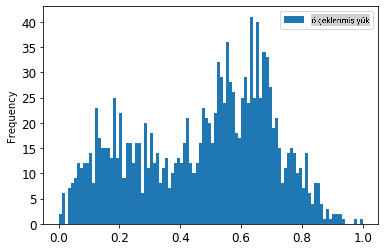
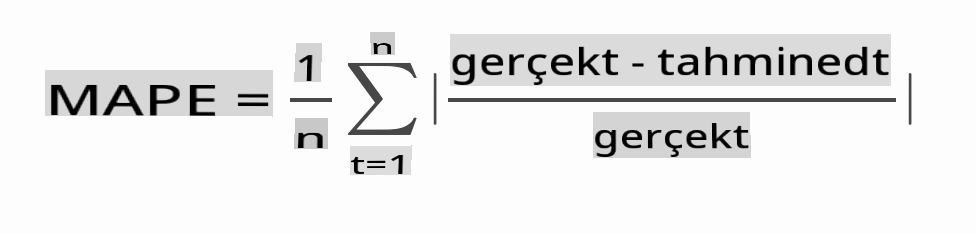

# ARIMA ile Zaman Serisi Tahmini

Önceki derste, zaman serisi tahmini hakkında biraz bilgi edindiniz ve bir zaman dilimi boyunca elektrik yükünün dalgalanmalarını gösteren bir veri kümesini yüklediniz.

[](https://youtu.be/IUSk-YDau10 "Introduction to ARIMA")

> 🎥 Yukarıdaki görüntüye tıklayarak bir video izleyin: ARIMA modellerine kısa bir giriş. Örnek R dilinde yapılmıştır, ancak kavramlar evrenseldir.

## [Ders Öncesi Test](https://gray-sand-07a10f403.1.azurestaticapps.net/quiz/43/)

## Giriş

Bu derste, [ARIMA: *A*uto*R*egressive *I*ntegrated *M*oving *A*verage](https://wikipedia.org/wiki/Autoregressive_integrated_moving_average) ile model oluşturmanın belirli bir yolunu keşfedeceksiniz. ARIMA modelleri, özellikle [durağan olmayan](https://wikipedia.org/wiki/Stationary_process) verileri uyarlamak için uygundur.

## Genel Kavramlar

ARIMA ile çalışabilmek için bilmeniz gereken bazı kavramlar vardır:

- 🎓 **Durağanlık**. İstatistiksel bağlamda, durağanlık, zaman içinde kaydırıldığında dağılımı değişmeyen verilere atıfta bulunur. Durağan olmayan veriler ise analiz edilmek üzere dönüştürülmesi gereken eğilimlerden kaynaklanan dalgalanmalar gösterir. Örneğin, mevsimsellik verilerde dalgalanmalara neden olabilir ve 'mevsimsel fark alma' süreci ile ortadan kaldırılabilir.

- 🎓 **[Fark Alma](https://wikipedia.org/wiki/Autoregressive_integrated_moving_average#Differencing)**. İstatistiksel bağlamda, fark alma, durağan olmayan verileri durağan hale getirmek için değişken eğilimlerini ortadan kaldırma sürecine atıfta bulunur. "Fark alma, bir zaman serisinin seviyesindeki değişiklikleri ortadan kaldırarak eğilim ve mevsimselliği ortadan kaldırır ve böylece zaman serisinin ortalamasını stabilize eder." [Shixiong ve diğerlerinin makalesi](https://arxiv.org/abs/1904.07632)

## Zaman Serisi Bağlamında ARIMA

ARIMA'nın bölümlerini açarak, zaman serilerini nasıl modellediğini ve tahmin yapmamıza nasıl yardımcı olduğunu daha iyi anlayalım.

- **AR - Otoregresif**. Otoregresif modeller, adından da anlaşılacağı gibi, verilerinizdeki önceki değerlere bakarak onları analiz eder ve varsayımlar yapar. Bu önceki değerlere 'gecikmeler' denir. Örneğin, aylık kalem satışlarını gösteren veriler. Her ayın satış toplamı, veri kümesinde 'gelişen değişken' olarak kabul edilir. Bu model, "ilgilenen gelişen değişkenin kendi gecikmiş (yani, önceki) değerlerine göre regresyona tabi tutulduğu" şeklinde oluşturulur. [wikipedia](https://wikipedia.org/wiki/Autoregressive_integrated_moving_average)

- **I - Entegre**. Benzer 'ARMA' modellerinden farklı olarak, ARIMA'daki 'I', *[entegre](https://wikipedia.org/wiki/Order_of_integration)* yönünü ifade eder. Veriler, durağanlığı ortadan kaldırmak için fark alma adımları uygulandığında 'entegre' olur.

- **MA - Hareketli Ortalama**. Bu modelin [hareketli ortalama](https://wikipedia.org/wiki/Moving-average_model) yönü, çıkış değişkeninin, mevcut ve geçmiş gecikme değerlerini gözlemleyerek belirlendiğini ifade eder.

Sonuç: ARIMA, zaman serisi verilerinin özel formuna mümkün olduğunca yakın bir model oluşturmak için kullanılır.

## Alıştırma - Bir ARIMA Modeli Oluşturun

Bu dersteki [_/working_](https://github.com/microsoft/ML-For-Beginners/tree/main/7-TimeSeries/2-ARIMA/working) klasörünü açın ve [_notebook.ipynb_](https://github.com/microsoft/ML-For-Beginners/blob/main/7-TimeSeries/2-ARIMA/working/notebook.ipynb) dosyasını bulun.

1. ARIMA modelleri için ihtiyacınız olan `statsmodels` Python kütüphanesini yüklemek için notebook'u çalıştırın.

1. Gerekli kütüphaneleri yükleyin.

1. Şimdi, verileri çizmek için faydalı olan birkaç kütüphaneyi daha yükleyin:

    ```python
    import os
    import warnings
    import matplotlib.pyplot as plt
    import numpy as np
    import pandas as pd
    import datetime as dt
    import math

    from pandas.plotting import autocorrelation_plot
    from statsmodels.tsa.statespace.sarimax import SARIMAX
    from sklearn.preprocessing import MinMaxScaler
    from common.utils import load_data, mape
    from IPython.display import Image

    %matplotlib inline
    pd.options.display.float_format = '{:,.2f}'.format
    np.set_printoptions(precision=2)
    warnings.filterwarnings("ignore") # specify to ignore warning messages
    ```

1. Verileri `/data/energy.csv` dosyasından bir Pandas dataframe'ine yükleyin ve bir göz atın:

    ```python
    energy = load_data('./data')[['load']]
    energy.head(10)
    ```

1. Ocak 2012'den Aralık 2014'e kadar mevcut tüm enerji verilerini çizin. Bu verileri önceki derste gördüğümüz için sürpriz olmamalı:

    ```python
    energy.plot(y='load', subplots=True, figsize=(15, 8), fontsize=12)
    plt.xlabel('timestamp', fontsize=12)
    plt.ylabel('load', fontsize=12)
    plt.show()
    ```

    Şimdi, bir model oluşturalım!

### Eğitim ve Test Veri Setleri Oluşturun

Verileriniz yüklendi, bu yüzden onları eğitim ve test setlerine ayırabilirsiniz. Modelinizi eğitim setinde eğiteceksiniz. Her zamanki gibi, model eğitimi tamamlandıktan sonra, doğruluğunu test setini kullanarak değerlendireceksiniz. Modelin gelecekteki zaman dilimlerinden bilgi almamasını sağlamak için test setinin eğitim setinden sonraki bir dönemi kapsadığından emin olmanız gerekir.

1. 1 Eylül - 31 Ekim 2014 tarihlerini eğitim setine ayırın. Test seti, 1 Kasım - 31 Aralık 2014 dönemini kapsayacaktır:

    ```python
    train_start_dt = '2014-11-01 00:00:00'
    test_start_dt = '2014-12-30 00:00:00'
    ```

    Bu veriler günlük enerji tüketimini yansıttığı için güçlü bir mevsimsel desen vardır, ancak tüketim en son günlerdeki tüketime en benzer.

1. Farklılıkları görselleştirin:

    ```python
    energy[(energy.index < test_start_dt) & (energy.index >= train_start_dt)][['load']].rename(columns={'load':'train'}) \
        .join(energy[test_start_dt:][['load']].rename(columns={'load':'test'}), how='outer') \
        .plot(y=['train', 'test'], figsize=(15, 8), fontsize=12)
    plt.xlabel('timestamp', fontsize=12)
    plt.ylabel('load', fontsize=12)
    plt.show()
    ```

    

    Bu nedenle, verileri eğitmek için nispeten küçük bir zaman penceresi kullanmak yeterli olmalıdır.

    > Not: ARIMA modelini uyarlamak için kullandığımız fonksiyon, uyarlama sırasında örnek içi doğrulama kullandığından, doğrulama verilerini göz ardı edeceğiz.

### Verileri Eğitime Hazırlayın

Şimdi, verileri filtreleme ve ölçeklendirme yaparak eğitime hazırlamanız gerekiyor. Veri kümenizi yalnızca ihtiyaç duyduğunuz zaman dilimlerini ve sütunları içerecek şekilde filtreleyin ve verilerin 0,1 aralığında projeksiyonunu sağlamak için ölçeklendirin.

1. Orijinal veri kümesini, set başına yalnızca belirtilen zaman dilimlerini ve yalnızca gerekli olan 'load' sütunu ile tarih sütununu içerecek şekilde filtreleyin:

    ```python
    train = energy.copy()[(energy.index >= train_start_dt) & (energy.index < test_start_dt)][['load']]
    test = energy.copy()[energy.index >= test_start_dt][['load']]

    print('Training data shape: ', train.shape)
    print('Test data shape: ', test.shape)
    ```

    Verinin şeklini görebilirsiniz:

    ```output
    Training data shape:  (1416, 1)
    Test data shape:  (48, 1)
    ```

1. Verileri (0, 1) aralığında ölçeklendirin.

    ```python
    scaler = MinMaxScaler()
    train['load'] = scaler.fit_transform(train)
    train.head(10)
    ```

1. Orijinal ve ölçeklendirilmiş verileri görselleştirin:

    ```python
    energy[(energy.index >= train_start_dt) & (energy.index < test_start_dt)][['load']].rename(columns={'load':'original load'}).plot.hist(bins=100, fontsize=12)
    train.rename(columns={'load':'scaled load'}).plot.hist(bins=100, fontsize=12)
    plt.show()
    ```

    

    > Orijinal veri

    

    > Ölçeklendirilmiş veri

1. Şimdi ölçeklendirilmiş verileri kalibre ettiğinize göre, test verilerini de ölçeklendirebilirsiniz:

    ```python
    test['load'] = scaler.transform(test)
    test.head()
    ```

### ARIMA'yı Uygulayın

ARIMA'yı uygulama zamanı geldi! Daha önce yüklediğiniz `statsmodels` kütüphanesini kullanacaksınız.

Şimdi birkaç adımı takip etmeniz gerekiyor

   1. Modeli `SARIMAX()` and passing in the model parameters: p, d, and q parameters, and P, D, and Q parameters.
   2. Prepare the model for the training data by calling the fit() function.
   3. Make predictions calling the `forecast()` function and specifying the number of steps (the `horizon`) to forecast.

> 🎓 What are all these parameters for? In an ARIMA model there are 3 parameters that are used to help model the major aspects of a time series: seasonality, trend, and noise. These parameters are:

`p`: the parameter associated with the auto-regressive aspect of the model, which incorporates *past* values.
`d`: the parameter associated with the integrated part of the model, which affects the amount of *differencing* (🎓 remember differencing 👆?) to apply to a time series.
`q`: the parameter associated with the moving-average part of the model.

> Note: If your data has a seasonal aspect - which this one does - , we use a seasonal ARIMA model (SARIMA). In that case you need to use another set of parameters: `P`, `D`, and `Q` which describe the same associations as `p`, `d`, and `q` fonksiyonunu çağırarak tanımlayın, ancak modelin mevsimsel bileşenlerine karşılık gelir.

1. Tercih ettiğiniz ufuk değerini ayarlayarak başlayın. 3 saat deneyelim:

    ```python
    # Specify the number of steps to forecast ahead
    HORIZON = 3
    print('Forecasting horizon:', HORIZON, 'hours')
    ```

    Bir ARIMA modelinin parametreleri için en iyi değerleri seçmek zordur çünkü bu biraz öznel ve zaman alıcıdır. `auto_arima()` function from the [`pyramid` kütüphanesini kullanmayı düşünebilirsiniz.](https://alkaline-ml.com/pmdarima/0.9.0/modules/generated/pyramid.arima.auto_arima.html),

1. Şimdilik iyi bir model bulmak için bazı manuel seçimler deneyin.

    ```python
    order = (4, 1, 0)
    seasonal_order = (1, 1, 0, 24)

    model = SARIMAX(endog=train, order=order, seasonal_order=seasonal_order)
    results = model.fit()

    print(results.summary())
    ```

    Bir sonuç tablosu yazdırılır.

İlk modelinizi oluşturdunuz! Şimdi onu değerlendirmek için bir yol bulmamız gerekiyor.

### Modelinizi Değerlendirin

Modelinizi değerlendirmek için, sözde `yürüyen ileri` doğrulama gerçekleştirebilirsiniz. Pratikte, zaman serisi modelleri her yeni veri geldiğinde yeniden eğitilir. Bu, modelin her zaman adımında en iyi tahmini yapmasına olanak tanır.

Bu tekniği kullanarak zaman serisinin başından başlayarak, modeli eğitim veri setinde eğitin. Ardından bir sonraki zaman adımında tahmin yapın. Tahmin, bilinen değere karşı değerlendirilir. Eğitim seti daha sonra bilinen değeri içerecek şekilde genişletilir ve işlem tekrarlanır.

> Not: Eğitimi daha verimli hale getirmek için eğitim seti penceresini sabit tutmalısınız, böylece her yeni gözlemi eğitim setine eklediğinizde, setin başından gözlemi kaldırırsınız.

Bu süreç, modelin pratikte nasıl performans göstereceğine dair daha sağlam bir tahmin sağlar. Ancak, bu kadar çok model oluşturmanın hesaplama maliyeti vardır. Veri küçükse veya model basitse kabul edilebilir, ancak ölçek büyüdüğünde sorun olabilir.

Yürüyen ileri doğrulama, zaman serisi modeli değerlendirmesinin altın standardıdır ve kendi projelerinizde tavsiye edilir.

1. İlk olarak, her HORIZON adımı için bir test veri noktası oluşturun.

    ```python
    test_shifted = test.copy()

    for t in range(1, HORIZON+1):
        test_shifted['load+'+str(t)] = test_shifted['load'].shift(-t, freq='H')

    test_shifted = test_shifted.dropna(how='any')
    test_shifted.head(5)
    ```

    |            |          | load | load+1 | load+2 |
    | ---------- | -------- | ---- | ------ | ------ |
    | 2014-12-30 | 00:00:00 | 0.33 | 0.29   | 0.27   |
    | 2014-12-30 | 01:00:00 | 0.29 | 0.27   | 0.27   |
    | 2014-12-30 | 02:00:00 | 0.27 | 0.27   | 0.30   |
    | 2014-12-30 | 03:00:00 | 0.27 | 0.30   | 0.41   |
    | 2014-12-30 | 04:00:00 | 0.30 | 0.41   | 0.57   |

    Veriler ufuk noktasına göre yatay olarak kaydırılmıştır.

1. Test verilerinizde bu kayan pencere yaklaşımını kullanarak bir döngü içinde tahminler yapın:

    ```python
    %%time
    training_window = 720 # dedicate 30 days (720 hours) for training

    train_ts = train['load']
    test_ts = test_shifted

    history = [x for x in train_ts]
    history = history[(-training_window):]

    predictions = list()

    order = (2, 1, 0)
    seasonal_order = (1, 1, 0, 24)

    for t in range(test_ts.shape[0]):
        model = SARIMAX(endog=history, order=order, seasonal_order=seasonal_order)
        model_fit = model.fit()
        yhat = model_fit.forecast(steps = HORIZON)
        predictions.append(yhat)
        obs = list(test_ts.iloc[t])
        # move the training window
        history.append(obs[0])
        history.pop(0)
        print(test_ts.index[t])
        print(t+1, ': predicted =', yhat, 'expected =', obs)
    ```

    Eğitimin gerçekleştiğini izleyebilirsiniz:

    ```output
    2014-12-30 00:00:00
    1 : predicted = [0.32 0.29 0.28] expected = [0.32945389435989236, 0.2900626678603402, 0.2739480752014323]

    2014-12-30 01:00:00
    2 : predicted = [0.3  0.29 0.3 ] expected = [0.2900626678603402, 0.2739480752014323, 0.26812891674127126]

    2014-12-30 02:00:00
    3 : predicted = [0.27 0.28 0.32] expected = [0.2739480752014323, 0.26812891674127126, 0.3025962399283795]
    ```

1. Tahminleri gerçek yükle karşılaştırın:

    ```python
    eval_df = pd.DataFrame(predictions, columns=['t+'+str(t) for t in range(1, HORIZON+1)])
    eval_df['timestamp'] = test.index[0:len(test.index)-HORIZON+1]
    eval_df = pd.melt(eval_df, id_vars='timestamp', value_name='prediction', var_name='h')
    eval_df['actual'] = np.array(np.transpose(test_ts)).ravel()
    eval_df[['prediction', 'actual']] = scaler.inverse_transform(eval_df[['prediction', 'actual']])
    eval_df.head()
    ```

    Çıktı
    |     |            | timestamp | h   | prediction | actual   |
    | --- | ---------- | --------- | --- | ---------- | -------- |
    | 0   | 2014-12-30 | 00:00:00  | t+1 | 3,008.74   | 3,023.00 |
    | 1   | 2014-12-30 | 01:00:00  | t+1 | 2,955.53   | 2,935.00 |
    | 2   | 2014-12-30 | 02:00:00  | t+1 | 2,900.17   | 2,899.00 |
    | 3   | 2014-12-30 | 03:00:00  | t+1 | 2,917.69   | 2,886.00 |
    | 4   | 2014-12-30 | 04:00:00  | t+1 | 2,946.99   | 2,963.00 |


    Saatlik verilerin tahminini, gerçek yükle karşılaştırın. Ne kadar doğru?

### Model Doğruluğunu Kontrol Edin

Modelinizin doğruluğunu, tüm tahminler üzerindeki ortalama mutlak yüzde hatasını (MAPE) test ederek kontrol edin.

> **🧮 Matematiği Göster**
>
> 
>
>  [MAPE](https://www.linkedin.com/pulse/what-mape-mad-msd-time-series-allameh-statistics/) tahmin doğruluğunu yukarıdaki formülle tanımlanan bir oran olarak göstermek için kullanılır. Gerçek<sub>t</sub> ve tahmin<sub>t</sub> arasındaki fark, gerçek<sub>t</sub> ile bölünür. "Bu hesaplamadaki mutlak değer her tahmin edilen zaman noktasında toplanır ve uydurulan noktaların sayısına n bölünür." [wikipedia](https://wikipedia.org/wiki/Mean_absolute_percentage_error)

1. Denklemi kodda ifade edin:

    ```python
    if(HORIZON > 1):
        eval_df['APE'] = (eval_df['prediction'] - eval_df['actual']).abs() / eval_df['actual']
        print(eval_df.groupby('h')['APE'].mean())
    ```

1. Bir adımın MAPE'sini hesaplayın:

    ```python
    print('One step forecast MAPE: ', (mape(eval_df[eval_df['h'] == 't+1']['prediction'], eval_df[eval_df['h'] == 't+1']['actual']))*100, '%')
    ```

    Bir adım tahmin MAPE'si:  0.5570581332313952 %

1. Çok adımlı tahmin MAPE'sini yazdırın:

    ```python
    print('Multi-step forecast MAPE: ', mape(eval_df['prediction'], eval_df['actual'])*100, '%')
    ```

    ```output
    Multi-step forecast MAPE:  1.1460048657704118 %
    ```

    Güzel bir düşük sayı en iyisidir: MAPE'si 10 olan bir tahminin %10 hata payı olduğunu düşünün.

1. Ancak her zaman olduğu gibi, bu tür doğruluk ölçümünü görsel olarak görmek daha kolaydır, bu yüzden bunu çizelim:

    ```python
     if(HORIZON == 1):
        ## Plotting single step forecast
        eval_df.plot(x='timestamp', y=['actual', 'prediction'], style=['r', 'b'], figsize=(15, 8))

    else:
        ## Plotting multi step forecast
        plot_df = eval_df[(eval_df.h=='t+1')][['timestamp', 'actual']]
        for t in range(1, HORIZON+1):
            plot_df['t+'+str(t)] = eval_df[(eval_df.h=='t+'+str(t))]['prediction'].values

        fig = plt.figure(figsize=(15, 8))
        ax = plt.plot(plot_df['timestamp'], plot_df['actual'], color='red', linewidth=4.0)
        ax = fig.add_subplot(111)
        for t in range(1, HORIZON+1):
            x = plot_df['timestamp'][(t-1):]
            y = plot_df['t+'+str(t)][0:len(x)]
            ax.plot(x, y, color='blue', linewidth=4*math.pow(.9,t), alpha=math.pow(0.8,t))

        ax.legend(loc='best')

    plt.xlabel('timestamp', fontsize=12)
    plt.ylabel('load', fontsize=12)
    plt.show()
    ```

    

🏆 Çok güzel bir grafik, iyi doğruluğa sahip bir modeli gösteriyor. Aferin!

---

## 🚀Meydan Okuma

Bir Zaman Serisi Modelinin doğruluğunu test etmenin yollarını inceleyin. Bu derste MAPE'ye değiniyoruz, ancak kullanabileceğiniz başka yöntemler var mı? Onları araştırın ve not edin. Yardımcı bir belgeyi [burada](https://otexts.com/fpp2/accuracy.html) bulabilirsiniz.

## [Ders Sonrası Test](https://gray-sand-07a10f403.1.azurestaticapps.net/quiz/44/)

## Gözden Geçirme ve Kendi Kendine Çalışma

Bu ders, ARIMA ile Zaman Serisi Tahmininin yalnızca temel konularına değinmektedir. [Bu depo](https://microsoft.github.io/forecasting/) ve çeşitli model türlerine göz atarak Zaman Serisi modelleri oluşturmanın diğer yollarını öğrenmek için bilginizi derinleştirin.

## Ödev

[Yeni bir ARIMA modeli](assignment.md)

**Feragatname**:
Bu belge, makine tabanlı yapay zeka çeviri hizmetleri kullanılarak çevrilmiştir. Doğruluk için çaba göstersek de, otomatik çevirilerin hata veya yanlışlıklar içerebileceğini lütfen unutmayın. Orijinal belgenin kendi dilindeki hali yetkili kaynak olarak kabul edilmelidir. Kritik bilgiler için profesyonel insan çevirisi önerilmektedir. Bu çevirinin kullanımından kaynaklanan herhangi bir yanlış anlama veya yanlış yorumlamadan sorumlu değiliz.