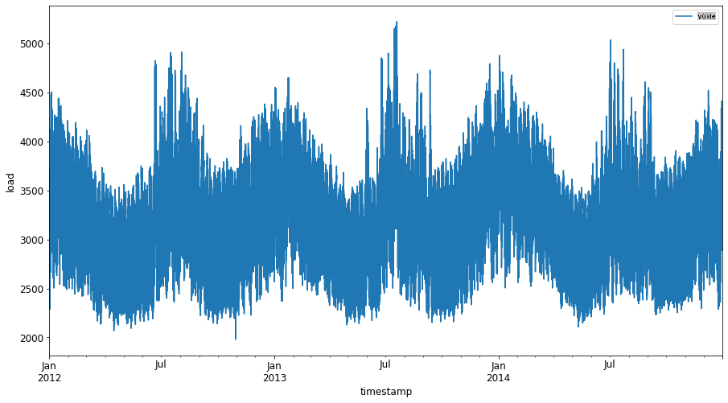
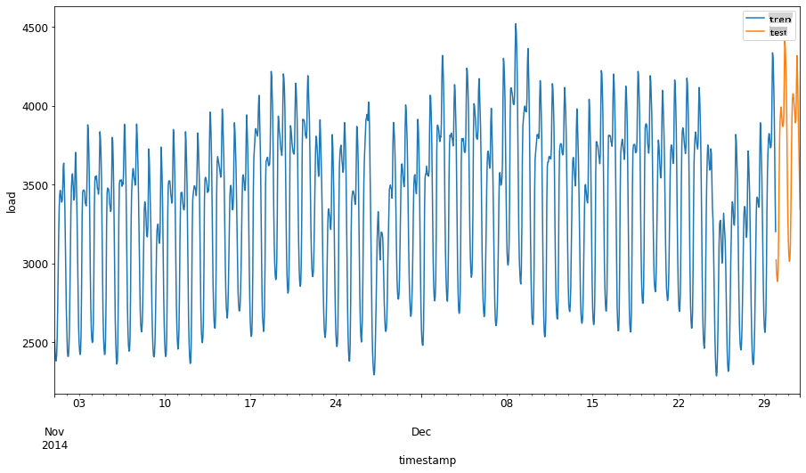
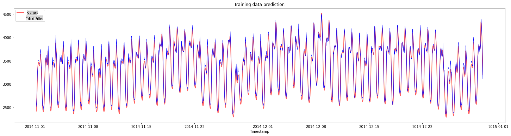
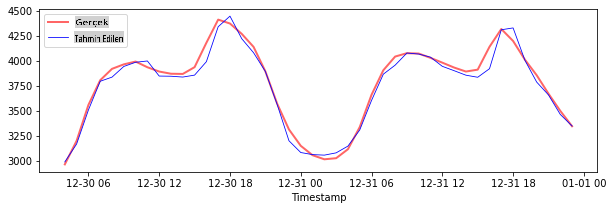
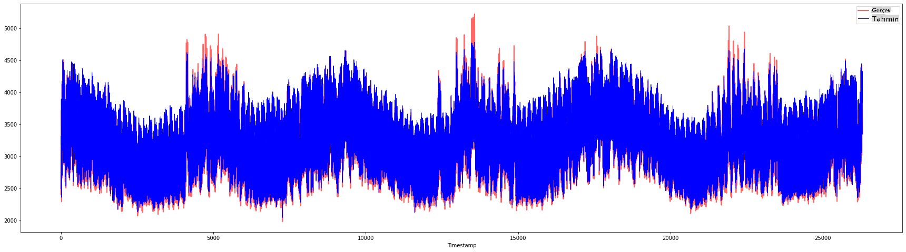

# Destek Vektör Regresörü ile Zaman Serisi Tahmini

Önceki derste, ARIMA modelini kullanarak zaman serisi tahminleri yapmayı öğrendiniz. Şimdi sürekli verileri tahmin etmek için kullanılan bir regresör modeli olan Destek Vektör Regresörü modeline bakacağız.

## [Ders Öncesi Test](https://gray-sand-07a10f403.1.azurestaticapps.net/quiz/51/) 

## Giriş

Bu derste, regresyon için [**SVM**: **D**estek **V**ektör **M**akinesi](https://en.wikipedia.org/wiki/Support-vector_machine) veya **SVR: Destek Vektör Regresörü** ile model oluşturmanın belirli bir yolunu keşfedeceksiniz.

### Zaman serisi bağlamında SVR [^1]

Zaman serisi tahmininde SVR'nin önemini anlamadan önce bilmeniz gereken bazı önemli kavramlar şunlardır:

- **Regresyon:** Verilen bir dizi girdiden sürekli değerleri tahmin etmek için kullanılan denetimli öğrenme tekniği. Amaç, özellik alanında maksimum veri noktası sayısına sahip bir eğri (veya çizgi) uyarlamaktır. Daha fazla bilgi için [buraya tıklayın](https://en.wikipedia.org/wiki/Regression_analysis).
- **Destek Vektör Makinesi (SVM):** Sınıflandırma, regresyon ve aykırı değer tespiti için kullanılan bir tür denetimli makine öğrenme modeli. Model, sınıflandırma durumunda sınır olarak, regresyon durumunda ise en iyi uyum çizgisi olarak işlev gören özellik alanında bir hiper düzlemdir. SVM'de, genellikle veri kümesini daha yüksek boyut sayısına sahip bir alana dönüştürmek için bir Çekirdek fonksiyonu kullanılır, böylece kolayca ayrılabilir hale gelirler. SVM'ler hakkında daha fazla bilgi için [buraya tıklayın](https://en.wikipedia.org/wiki/Support-vector_machine).
- **Destek Vektör Regresörü (SVR):** En fazla veri noktasına sahip en iyi uyum çizgisini (SVM durumunda bu bir hiper düzlemdir) bulmak için kullanılan bir SVM türü.

### Neden SVR? [^1]

Son derste, zaman serisi verilerini tahmin etmek için çok başarılı bir istatistiksel doğrusal yöntem olan ARIMA hakkında bilgi edindiniz. Ancak birçok durumda, zaman serisi verileri doğrusal olmayan özelliklere sahiptir ve bu doğrusal modellerle haritalanamaz. Bu gibi durumlarda, SVR'nin doğrusal olmayan verileri regresyon görevleri için dikkate alma yeteneği, SVR'yi zaman serisi tahmininde başarılı kılar.

## Egzersiz - bir SVR modeli oluşturun

Veri hazırlama için ilk birkaç adım, [ARIMA](https://github.com/microsoft/ML-For-Beginners/tree/main/7-TimeSeries/2-ARIMA) hakkındaki önceki dersteki adımlarla aynıdır.

Bu dersteki [_/working_](https://github.com/microsoft/ML-For-Beginners/tree/main/7-TimeSeries/3-SVR/working) klasörünü açın ve [_notebook.ipynb_](https://github.com/microsoft/ML-For-Beginners/blob/main/7-TimeSeries/3-SVR/working/notebook.ipynb) dosyasını bulun.[^2]

1. Not defterini çalıştırın ve gerekli kütüphaneleri içe aktarın:  [^2]

   ```python
   import sys
   sys.path.append('../../')
   ```

   ```python
   import os
   import warnings
   import matplotlib.pyplot as plt
   import numpy as np
   import pandas as pd
   import datetime as dt
   import math
   
   from sklearn.svm import SVR
   from sklearn.preprocessing import MinMaxScaler
   from common.utils import load_data, mape
   ```

2. Verileri `/data/energy.csv` dosyasından bir Pandas veri çerçevesine yükleyin ve bir göz atın:  [^2]

   ```python
   energy = load_data('../../data')[['load']]
   ```

3. Ocak 2012'den Aralık 2014'e kadar mevcut tüm enerji verilerini görselleştirin: [^2]

   ```python
   energy.plot(y='load', subplots=True, figsize=(15, 8), fontsize=12)
   plt.xlabel('timestamp', fontsize=12)
   plt.ylabel('load', fontsize=12)
   plt.show()
   ```

   

   Şimdi, SVR modelimizi oluşturalım.

### Eğitim ve test veri setleri oluşturun

Artık verileriniz yüklendiğine göre, onları eğitim ve test setlerine ayırabilirsiniz. Daha sonra, SVR için gerekli olan zaman adımı tabanlı bir veri seti oluşturmak için verileri yeniden şekillendireceksiniz. Modelinizi eğitim setinde eğiteceksiniz. Model eğitimi tamamlandıktan sonra, doğruluğunu eğitim setinde, test setinde ve ardından genel performansı görmek için tüm veri setinde değerlendireceksiniz. Test setinin, modelin gelecekteki zaman dilimlerinden bilgi edinmesini engellemek için eğitim setinden daha sonraki bir dönemi kapsadığından emin olmanız gerekir [^2] (bu duruma *Aşırı Uyum* denir).

1. Eğitim setine 1 Eylül - 31 Ekim 2014 tarihleri arasındaki iki aylık dönemi ayırın. Test seti ise 1 Kasım - 31 Aralık 2014 tarihleri arasındaki iki aylık dönemi içerecektir: [^2]

   ```python
   train_start_dt = '2014-11-01 00:00:00'
   test_start_dt = '2014-12-30 00:00:00'
   ```

2. Farklılıkları görselleştirin: [^2]

   ```python
   energy[(energy.index < test_start_dt) & (energy.index >= train_start_dt)][['load']].rename(columns={'load':'train'}) \
       .join(energy[test_start_dt:][['load']].rename(columns={'load':'test'}), how='outer') \
       .plot(y=['train', 'test'], figsize=(15, 8), fontsize=12)
   plt.xlabel('timestamp', fontsize=12)
   plt.ylabel('load', fontsize=12)
   plt.show()
   ```

   


### Verileri eğitime hazırlayın

Şimdi, verilerinizi filtreleme ve ölçeklendirme işlemlerini gerçekleştirerek eğitime hazırlamanız gerekiyor. Veri setinizi yalnızca gerekli zaman dilimlerini ve sütunları içerecek şekilde filtreleyin ve verilerin 0,1 aralığında projeksiyon yapılmasını sağlamak için ölçeklendirin.

1. Orijinal veri setini yalnızca yukarıda belirtilen zaman dilimlerini içerecek şekilde filtreleyin ve yalnızca gerekli 'load' sütununu ve tarihi dahil edin: [^2]

   ```python
   train = energy.copy()[(energy.index >= train_start_dt) & (energy.index < test_start_dt)][['load']]
   test = energy.copy()[energy.index >= test_start_dt][['load']]
   
   print('Training data shape: ', train.shape)
   print('Test data shape: ', test.shape)
   ```

   ```output
   Training data shape:  (1416, 1)
   Test data shape:  (48, 1)
   ```
   
2. Eğitim verilerini (0, 1) aralığında ölçeklendirin: [^2]

   ```python
   scaler = MinMaxScaler()
   train['load'] = scaler.fit_transform(train)
   ```
   
4. Şimdi, test verilerini ölçeklendirin: [^2]

   ```python
   test['load'] = scaler.transform(test)
   ```

### Zaman adımları ile veri oluşturun [^1]

SVR için, giriş verilerini `[batch, timesteps]`. So, you reshape the existing `train_data` and `test_data` formunda dönüştürüyorsunuz, böylece zaman adımlarını ifade eden yeni bir boyut eklenmiş oluyor.

```python
# Converting to numpy arrays
train_data = train.values
test_data = test.values
```

Bu örnek için, `timesteps = 5` alıyoruz. Yani, modele girdi olarak ilk 4 zaman adımının verilerini veriyoruz ve çıktı 5. zaman adımının verileri olacak.

```python
timesteps=5
```

İç içe liste kavramını kullanarak eğitim verilerini 2D tensöre dönüştürme:

```python
train_data_timesteps=np.array([[j for j in train_data[i:i+timesteps]] for i in range(0,len(train_data)-timesteps+1)])[:,:,0]
train_data_timesteps.shape
```

```output
(1412, 5)
```

Test verilerini 2D tensöre dönüştürme:

```python
test_data_timesteps=np.array([[j for j in test_data[i:i+timesteps]] for i in range(0,len(test_data)-timesteps+1)])[:,:,0]
test_data_timesteps.shape
```

```output
(44, 5)
```

 Eğitim ve test verilerinden giriş ve çıkışları seçme:

```python
x_train, y_train = train_data_timesteps[:,:timesteps-1],train_data_timesteps[:,[timesteps-1]]
x_test, y_test = test_data_timesteps[:,:timesteps-1],test_data_timesteps[:,[timesteps-1]]

print(x_train.shape, y_train.shape)
print(x_test.shape, y_test.shape)
```

```output
(1412, 4) (1412, 1)
(44, 4) (44, 1)
```

### SVR'yi uygulayın [^1]

Şimdi, SVR'yi uygulama zamanı. Bu uygulama hakkında daha fazla bilgi edinmek için [bu belgeleri](https://scikit-learn.org/stable/modules/generated/sklearn.svm.SVR.html) inceleyebilirsiniz. Bizim uygulamamız için şu adımları takip ediyoruz:

  1. `SVR()` and passing in the model hyperparameters: kernel, gamma, c and epsilon
  2. Prepare the model for the training data by calling the `fit()` function
  3. Make predictions calling the `predict()` fonksiyonlarını çağırarak modeli tanımlayın.

Şimdi bir SVR modeli oluşturuyoruz. Burada [RBF çekirdeğini](https://scikit-learn.org/stable/modules/svm.html#parameters-of-the-rbf-kernel) kullanıyoruz ve hiperparametreleri gamma, C ve epsilon olarak sırasıyla 0.5, 10 ve 0.05 olarak ayarlıyoruz.

```python
model = SVR(kernel='rbf',gamma=0.5, C=10, epsilon = 0.05)
```

#### Modeli eğitim verileri üzerinde eğitin [^1]

```python
model.fit(x_train, y_train[:,0])
```

```output
SVR(C=10, cache_size=200, coef0=0.0, degree=3, epsilon=0.05, gamma=0.5,
    kernel='rbf', max_iter=-1, shrinking=True, tol=0.001, verbose=False)
```

#### Model tahminleri yapın [^1]

```python
y_train_pred = model.predict(x_train).reshape(-1,1)
y_test_pred = model.predict(x_test).reshape(-1,1)

print(y_train_pred.shape, y_test_pred.shape)
```

```output
(1412, 1) (44, 1)
```

SVR'nizi oluşturdunuz! Şimdi bunu değerlendirmemiz gerekiyor.

### Modelinizi değerlendirin [^1]

Değerlendirme için, önce verileri orijinal ölçeğimize geri ölçeklendireceğiz. Daha sonra performansı kontrol etmek için orijinal ve tahmin edilen zaman serisi grafiğini çizeceğiz ve MAPE sonucunu yazdıracağız.

Tahmin edilen ve orijinal çıktıyı ölçeklendirin:

```python
# Scaling the predictions
y_train_pred = scaler.inverse_transform(y_train_pred)
y_test_pred = scaler.inverse_transform(y_test_pred)

print(len(y_train_pred), len(y_test_pred))
```

```python
# Scaling the original values
y_train = scaler.inverse_transform(y_train)
y_test = scaler.inverse_transform(y_test)

print(len(y_train), len(y_test))
```

#### Eğitim ve test verileri üzerinde model performansını kontrol edin [^1]

Grafiğimizin x ekseninde göstermek için veri setinden zaman damgalarını çıkarıyoruz. İlk ```timesteps-1``` değerlerini ilk çıktı için giriş olarak kullandığımızı unutmayın, bu nedenle çıktının zaman damgaları bundan sonra başlayacak.

```python
train_timestamps = energy[(energy.index < test_start_dt) & (energy.index >= train_start_dt)].index[timesteps-1:]
test_timestamps = energy[test_start_dt:].index[timesteps-1:]

print(len(train_timestamps), len(test_timestamps))
```

```output
1412 44
```

Eğitim verileri için tahminleri çizin:

```python
plt.figure(figsize=(25,6))
plt.plot(train_timestamps, y_train, color = 'red', linewidth=2.0, alpha = 0.6)
plt.plot(train_timestamps, y_train_pred, color = 'blue', linewidth=0.8)
plt.legend(['Actual','Predicted'])
plt.xlabel('Timestamp')
plt.title("Training data prediction")
plt.show()
```



Eğitim verileri için MAPE'yi yazdırın

```python
print('MAPE for training data: ', mape(y_train_pred, y_train)*100, '%')
```

```output
MAPE for training data: 1.7195710200875551 %
```

Test verileri için tahminleri çizin

```python
plt.figure(figsize=(10,3))
plt.plot(test_timestamps, y_test, color = 'red', linewidth=2.0, alpha = 0.6)
plt.plot(test_timestamps, y_test_pred, color = 'blue', linewidth=0.8)
plt.legend(['Actual','Predicted'])
plt.xlabel('Timestamp')
plt.show()
```



Test verileri için MAPE'yi yazdırın

```python
print('MAPE for testing data: ', mape(y_test_pred, y_test)*100, '%')
```

```output
MAPE for testing data:  1.2623790187854018 %
```

🏆 Test veri setinde çok iyi bir sonuç elde ettiniz!

### Tüm veri seti üzerinde model performansını kontrol edin [^1]

```python
# Extracting load values as numpy array
data = energy.copy().values

# Scaling
data = scaler.transform(data)

# Transforming to 2D tensor as per model input requirement
data_timesteps=np.array([[j for j in data[i:i+timesteps]] for i in range(0,len(data)-timesteps+1)])[:,:,0]
print("Tensor shape: ", data_timesteps.shape)

# Selecting inputs and outputs from data
X, Y = data_timesteps[:,:timesteps-1],data_timesteps[:,[timesteps-1]]
print("X shape: ", X.shape,"\nY shape: ", Y.shape)
```

```output
Tensor shape:  (26300, 5)
X shape:  (26300, 4) 
Y shape:  (26300, 1)
```

```python
# Make model predictions
Y_pred = model.predict(X).reshape(-1,1)

# Inverse scale and reshape
Y_pred = scaler.inverse_transform(Y_pred)
Y = scaler.inverse_transform(Y)
```

```python
plt.figure(figsize=(30,8))
plt.plot(Y, color = 'red', linewidth=2.0, alpha = 0.6)
plt.plot(Y_pred, color = 'blue', linewidth=0.8)
plt.legend(['Actual','Predicted'])
plt.xlabel('Timestamp')
plt.show()
```



```python
print('MAPE: ', mape(Y_pred, Y)*100, '%')
```

```output
MAPE:  2.0572089029888656 %
```

🏆 Çok güzel grafikler, iyi bir doğruluğa sahip bir modeli gösteriyor. Aferin!

---

## 🚀Meydan Okuma

- Modeli oluştururken hiperparametreleri (gamma, C, epsilon) değiştirmeyi deneyin ve test verileri üzerinde hangi hiperparametre setinin en iyi sonuçları verdiğini görmek için değerlendirin. Bu hiperparametreler hakkında daha fazla bilgi edinmek için [buradaki belgeye](https://scikit-learn.org/stable/modules/svm.html#parameters-of-the-rbf-kernel) bakabilirsiniz.
- Model için farklı çekirdek fonksiyonları kullanmayı deneyin ve veri seti üzerindeki performanslarını analiz edin. Yardımcı bir belgeye [buradan](https://scikit-learn.org/stable/modules/svm.html#kernel-functions) ulaşabilirsiniz.
- Modelin tahmin yapması için geriye dönüp bakma adımı olan `timesteps` için farklı değerler kullanmayı deneyin.

## [Ders Sonrası Test](https://gray-sand-07a10f403.1.azurestaticapps.net/quiz/52/)

## Gözden Geçirme ve Kendi Kendine Çalışma

Bu ders, Zaman Serisi Tahmini için SVR'nin uygulanmasını tanıtmak içindi. SVR hakkında daha fazla bilgi edinmek için [bu bloga](https://www.analyticsvidhya.com/blog/2020/03/support-vector-regression-tutorial-for-machine-learning/) başvurabilirsiniz. Bu [scikit-learn belgesi](https://scikit-learn.org/stable/modules/svm.html), genel olarak SVM'ler, [SVR'ler](https://scikit-learn.org/stable/modules/svm.html#regression) ve ayrıca kullanılabilecek farklı [çekirdek fonksiyonları](https://scikit-learn.org/stable/modules/svm.html#kernel-functions) ve bunların parametreleri gibi diğer uygulama detayları hakkında daha kapsamlı bir açıklama sunar.

## Ödev

[Yeni bir SVR modeli](assignment.md)


## Katkıda Bulunanlar

[^1]: Bu bölümdeki metin, kod ve çıktı [@AnirbanMukherjeeXD](https://github.com/AnirbanMukherjeeXD) tarafından katkıda bulunulmuştur.
[^2]: Bu bölümdeki metin, kod ve çıktı [ARIMA](https://github.com/microsoft/ML-For-Beginners/tree/main/7-TimeSeries/2-ARIMA) alınmıştır.

**Feragatname**:
Bu belge, makine tabanlı yapay zeka çeviri hizmetleri kullanılarak çevrilmiştir. Doğruluk için çaba göstersek de, otomatik çevirilerin hata veya yanlışlıklar içerebileceğini lütfen unutmayın. Belgenin orijinal dili, yetkili kaynak olarak kabul edilmelidir. Kritik bilgiler için profesyonel insan çevirisi tavsiye edilir. Bu çevirinin kullanımından kaynaklanan herhangi bir yanlış anlama veya yanlış yorumlamadan sorumlu değiliz.