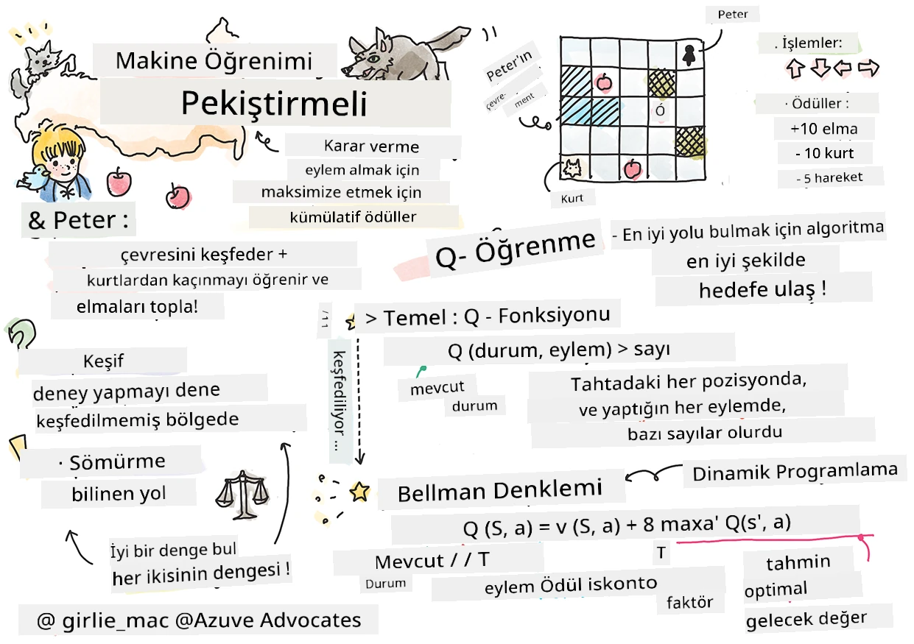

# Takviye Öğrenmeye ve Q-Öğrenmeye Giriş


> Çizim notu [Tomomi Imura](https://www.twitter.com/girlie_mac) tarafından yapıldı

Takviye öğrenme üç önemli kavramı içerir: ajan, bazı durumlar ve durum başına bir eylem kümesi. Belirli bir durumda bir eylem gerçekleştirildiğinde, ajana bir ödül verilir. Tekrar düşünün, bilgisayar oyunu Super Mario. Siz Mario'sunuz, bir oyun seviyesindesiniz ve bir uçurumun kenarında duruyorsunuz. Üstünüzde bir madeni para var. Siz Mario olarak, bir oyun seviyesinde, belirli bir pozisyondasınız ... bu sizin durumunuzdur. Bir adım sağa hareket etmek (bir eylem) sizi uçurumdan aşağı düşürecek ve bu size düşük sayısal bir puan verecektir. Ancak, zıplama düğmesine basmak size bir puan kazandıracak ve hayatta kalmanızı sağlayacaktır. Bu olumlu bir sonuçtur ve size pozitif sayısal bir puan vermelidir.

Takviye öğrenmeyi ve bir simülatörü (oyunu) kullanarak, hayatta kalmak ve mümkün olduğunca çok puan kazanmak için nasıl oynanacağını öğrenebilirsiniz.

[](https://www.youtube.com/watch?v=lDq_en8RNOo)

> 🎥 Dmitry'nin Takviye Öğrenme konusunu tartışmasını dinlemek için yukarıdaki resme tıklayın

## [Ders Öncesi Quiz](https://ff-quizzes.netlify.app/en/ml/)

## Önkoşullar ve Kurulum

Bu derste Python'da bazı kodlar ile deney yapacağız. Bu dersteki Jupyter Notebook kodlarını ya kendi bilgisayarınızda ya da bulutta bir yerde çalıştırabilmelisiniz.

[ders not defterini](https://github.com/microsoft/ML-For-Beginners/blob/main/8-Reinforcement/1-QLearning/notebook.ipynb) açabilir ve bu dersi takip ederek kodları oluşturabilirsiniz.

> **Not:** Bu kodu buluttan açıyorsanız, ayrıca not defteri kodunda kullanılan [`rlboard.py`](https://github.com/microsoft/ML-For-Beginners/blob/main/8-Reinforcement/1-QLearning/rlboard.py) dosyasını da indirmeniz gerekir. Not defteri ile aynı dizine ekleyin.

## Giriş

Bu derste, Rus besteci [Sergei Prokofiev](https://en.wikipedia.org/wiki/Sergei_Prokofiev)'in müzikal masalından esinlenerek, **[Peter ve Kurt](https://en.wikipedia.org/wiki/Peter_and_the_Wolf)** dünyasını keşfedeceğiz. Peter'ın çevresini keşfetmesi, lezzetli elmalar toplaması ve kurttan kaçınması için **Takviye Öğrenme** kullanacağız.

**Takviye Öğrenme** (RL), birçok deney yaparak bir **ajanın** bir **çevrede** en iyi davranışı öğrenmesini sağlayan bir öğrenme tekniğidir. Bu çevredeki ajanın bir **hedefi** olmalı, bu hedef bir **ödül fonksiyonu** ile tanımlanır.

## Çevre

Basitlik için, Peter’ın dünyasını `genişlik` x `yükseklik` boyutlarında kare bir tahta gibi düşünelim:


Bu tahtadaki her hücre:

* Peter ve diğer canlıların yürüyebileceği **yeryüzü**
* Elbette yürüyemeyeceğiniz **su**
* Dinlenebileceğiniz bir yer olan **ağaç** veya **ot**
* Peter'ın kendini beslemek için bulmayı çok isteyeceği bir **elma**
* Tehlikeli olan ve kaçınılması gereken bir **kurt**

Bu çevre ile çalışmak için kod içeren ayrı bir Python modülü vardır, [`rlboard.py`](https://github.com/microsoft/ML-For-Beginners/blob/main/8-Reinforcement/1-QLearning/rlboard.py). Bu kod konuyu anlamak için önemli olmadığından modülü içe aktaracağız ve örnek tahtayı oluşturmak için kullanacağız (kod bloğu 1):

```python
from rlboard import *

width, height = 8,8
m = Board(width,height)
m.randomize(seed=13)
m.plot()
```

Bu kod, yukarıdaki çevre resmine benzer bir çıktı vermelidir.

## Eylemler ve politika

Örneğimizde, Peter’ın hedefi elmayı bulabilmek, kurt ve diğer engellerden kaçınmak olacaktır. Bunu yapmak için, aslında etrafta yürüyerek elmayı bulmalıdır.

Bu nedenle, herhangi bir konumda aşağıdaki eylemlerden birini seçebilir: yukarı, aşağı, sola ve sağa.

Bu eylemleri bir sözlük olarak tanımlayacağız ve bunları karşılık gelen koordinat değişim çiftlerine eşleyeceğiz. Örneğin, sağa hareket (`R`) `(1,0)` çiftine karşılık gelir. (kod bloğu 2):

```python
actions = { "U" : (0,-1), "D" : (0,1), "L" : (-1,0), "R" : (1,0) }
action_idx = { a : i for i,a in enumerate(actions.keys()) }
```

Özetle, bu senaryonun stratejisi ve hedefi şunlardır:

- Ajanımızın (Peter) **stratejisi**, **politikası** olarak adlandırılan bir fonksiyonla tanımlanır. Politika, verilen bir durumda hangi eylemin seçileceğini döndürür. Bizim durumumuzda, problemin durumu, oyuncunun mevcut pozisyonu da dahil olmak üzere tahtayla temsil edilir.

- Takviye öğrenmenin **hedefi** ise problemi verimli şekilde çözmemizi sağlayacak iyi bir politika öğrenmektir. Ancak başlangıç olarak en basit politika olan **rastgele yürüyüş**ü ele alalım.

## Rastgele yürüyüş

İlk olarak, rastgele yürüyüş stratejisini uygulayarak problemimizi çözelim. Rastgele yürüyüşte, izin verilen eylemler arasından rastgele bir sonraki eylemi seçeriz, ta ki elmaya ulaşana kadar (kod bloğu 3).

1. Aşağıdaki kod ile rastgele yürüyüşü uygulayın:

    ```python
    def random_policy(m):
        return random.choice(list(actions))
    
    def walk(m,policy,start_position=None):
        n = 0 # adım sayısı
        # başlangıç konumunu ayarla
        if start_position:
            m.human = start_position 
        else:
            m.random_start()
        while True:
            if m.at() == Board.Cell.apple:
                return n # başarı!
            if m.at() in [Board.Cell.wolf, Board.Cell.water]:
                return -1 # kurt tarafından yenildi veya boğuldu
            while True:
                a = actions[policy(m)]
                new_pos = m.move_pos(m.human,a)
                if m.is_valid(new_pos) and m.at(new_pos)!=Board.Cell.water:
                    m.move(a) # gerçek hareketi yap
                    break
            n+=1
    
    walk(m,random_policy)
    ```

    `walk` çağrısı, her çalıştırmada farklı olabilir, karşılık gelen yol uzunluğunu döndürmelidir.

1. Yürüyüş deneyini belirli sayıda (örneğin 100) tekrarlayın ve elde edilen istatistikleri yazdırın (kod bloğu 4):

    ```python
    def print_statistics(policy):
        s,w,n = 0,0,0
        for _ in range(100):
            z = walk(m,policy)
            if z<0:
                w+=1
            else:
                s += z
                n += 1
        print(f"Average path length = {s/n}, eaten by wolf: {w} times")
    
    print_statistics(random_policy)
    ```

    Yolun ortalama uzunluğu yaklaşık 30-40 adım civarındadır ki bu oldukça fazladır. En yakın elmaya ortalama mesafe yaklaşık 5-6 adımdır.

    Peter’ın rastgele yürüyüş sırasında hareketi şöyle görünür:

    

## Ödül fonksiyonu

Politikamızı daha akıllı yapmak için hangi hareketlerin diğerlerinden "daha iyi" olduğunu anlamamız gerekir. Bunun için amacımızı tanımlamalıyız.

Amaç, her durum için bir puan değeri döndürecek bir **ödül fonksiyonu** olarak tanımlanabilir. Sayı ne kadar büyükse, ödül fonksiyonu o kadar iyidir. (kod bloğu 5)

```python
move_reward = -0.1
goal_reward = 10
end_reward = -10

def reward(m,pos=None):
    pos = pos or m.human
    if not m.is_valid(pos):
        return end_reward
    x = m.at(pos)
    if x==Board.Cell.water or x == Board.Cell.wolf:
        return end_reward
    if x==Board.Cell.apple:
        return goal_reward
    return move_reward
```

Ödül fonksiyonları ile ilgili ilginç olan şey, çoğu durumda *önemli ödülün oyunun sonunda verilmesidir*. Bu, algoritmamızın sonunda pozitif ödüle götüren "iyi" adımları hatırlaması ve önemini artırması gerekir anlamına gelir. Benzer şekilde, kötü sonuçlara götüren tüm hareketler caydırılmalıdır.

## Q-Öğrenme

Burada tartışacağımız algoritmanın adı **Q-Öğrenme**dir. Bu algoritmada politika, **Q-Tablosu** adı verilen bir fonksiyon (veya veri yapısı) ile tanımlanır. Bu tablo, verilen bir durumdaki her eylemin "iyiliğini" kaydeder.

Q-Tablosu denmesinin nedeni, genellikle bir tablo veya çok boyutlu dizi olarak temsil edilmesinin uygun olmasıdır. Tahtamız `genişlik` x `yükseklik` boyutunda olduğundan, Q-Tablosunu `genişlik` x `yükseklik` x `len(actions)` şekline sahip bir numpy dizisi olarak temsil edebiliriz: (kod bloğu 6)

```python
Q = np.ones((width,height,len(actions)),dtype=np.float)*1.0/len(actions)
```

Q-Tablosundaki tüm değerleri eşit bir değerle, bizim durumumuzda 0.25 ile başlatıyoruz. Bu, her durumda tüm hareketlerin eşit iyi olduğu "rastgele yürüyüş" politikasına karşılık gelir. Q-Tablosunu tahtada görselleştirmek için `plot` fonksiyonuna geçebiliriz: `m.plot(Q)`.


Her hücrenin merkezinde, tercih edilen hareket yönünü gösteren bir "ok" vardır. Tüm yönler eşit olduğundan bir nokta görüntülenir.

Şimdi simülasyonu çalıştırıp çevremizi keşfetmeli ve Q-Tablosu değerlerinin daha iyi dağılımını öğrenmeliyiz; bu da elmaya giden yolu çok daha hızlı bulmamızı sağlar.

## Q-Öğrenmenin Özeti: Bellman Denklemi

Hareket etmeye başladığımızda, her eylemin karşılık geldiği bir ödül olur, yani teorik olarak bir sonraki eylemi en yüksek anlık ödüle göre seçebiliriz. Ancak, çoğu durumda bu hareket elmaya ulaşmamızı sağlamaz, bu nedenle hemen hangi yönün daha iyi olduğunu belirleyemeyiz.

> Unutmayın ki önemli olan anlık sonuç değil, simülasyonun sonunda elde edeceğimiz nihai sonuçtur.

Bu gecikmeli ödülü hesaba katmak için **[dinamik programlama](https://en.wikipedia.org/wiki/Dynamic_programming)** prensiplerini kullanmamız gerekir, böylece problemimizi özyinelemeli olarak düşünebiliriz.

Diyelim şimdi *s* durumundayız ve bir sonraki durumda *s'* gitmek istiyoruz. Böyle yaparak ödül fonksiyonuyla tanımlanan anlık ödül *r(s,a)* ve bazı gelecekteki ödüller alacağız. Q-Tablomuz her eylemin "çekiciliğini" doğru yansıtıyorsa, *s'* durumunda *Q(s',a')* değerinin maksimum olduğu eylemi *a* olarak seçeceğiz. Böylece, *s* durumunda alabileceğimiz en iyi gelecekteki ödül `max`<sub>a'</sub>*Q(s',a')* olarak tanımlanır (maksimum burada *s'* durumundaki tüm olası *a'* eylemleri üzerinden hesaplanır).

Bu, durum *s* ve eylem *a* için Q-Tablosu değerini hesaplayan **Bellman formülünü** verir:


Burada γ, şu anlama gelen **indirim faktörü**dür: mevcut ödülü gelecekteki ödüle kıyasla ne ölçüde tercih edeceğinizi belirler.

## Öğrenme Algoritması

Yukarıdaki denklemi kullanarak öğrenme algoritmamızın sözde kodunu yazabiliriz:

* Q-Tablosu Q'yu tüm durumlar ve eylemler için eşit sayılar ile başlat
* Öğrenme oranı α ← 1 olarak ayarla
* Simülasyonu birçok kez tekrarla
   1. Rastgele konumda başla
   1. Tekrarla
        1. *s* durumunda bir eylem *a* seç
        2. Yeni bir durum *s'* hareket ederek eylemi gerçekleştir
        3. Oyun sonu koşulu varsa veya toplam ödül çok düşükse - simülasyondan çık  
        4. Yeni durumda ödül *r* hesapla
        5. Bellman denklemine göre Q-Fonksiyonunu güncelle: *Q(s,a)* ← *(1-α)Q(s,a)+α(r+γ max<sub>a'</sub>Q(s',a'))*
        6. *s* ← *s'*
        7. Toplam ödülü güncelle ve α’yı azalt.

## Sömürme vs. keşif

Yukarıdaki algoritmada, 2.1 adımında eylemin nasıl seçileceğini belirtmedik. Eğer eylemi rastgele seçersek, rastgele **keşif** yapacağız ve büyük olasılıkla sık öleceğiz ve normalde gitmeyeceğimiz yerleri keşfedeceğiz. Alternatif olarak, zaten bildiğimiz Q-Tablosu değerlerini **sömürerek** (en yüksek Q değeri ile) en iyi eylemi seçebiliriz. Ancak bu, diğer durumları keşfetmemizi engeller ve optimal çözümü bulamayabiliriz.

Bu nedenle, en iyi yaklaşım keşif ile sömürme arasında denge kurmaktır. Bu, *s* durumunda eylemi Q-Tablosundaki değerlere oranla seçerek yapılabilir. Başlangıçta, Q-Tablosu değerleri eşit olduğunda seçim rastgele olur, ancak çevreyi öğrendikçe ajan zaman zaman keşfedilmemiş yola gitmesine izin vererek optimal rotayı takip eder.

## Python uygulaması

Şimdi öğrenme algoritmasını uygulamaya hazırız. Bunu yapmadan önce Q-Tablosundaki keyfi sayıları uygun eylemlerin olasılık vektörüne dönüştürecek bir fonksiyona ihtiyacımız var.

1. `probs()` fonksiyonunu oluşturun:

    ```python
    def probs(v,eps=1e-4):
        v = v-v.min()+eps
        v = v/v.sum()
        return v
    ```

    Başlangıçta vektörün tüm bileşenleri aynı olduğunda 0’a bölmeyi önlemek için orijinal vektöre birkaç `eps` ekliyoruz.

Öğrenme algoritmasını 5000 deney, yani **epoch** boyunca çalıştırın: (kod bloğu 8)
```python
    for epoch in range(5000):
    
        # Başlangıç noktasını seç
        m.random_start()
        
        # Seyahate başla
        n=0
        cum_reward = 0
        while True:
            x,y = m.human
            v = probs(Q[x,y])
            a = random.choices(list(actions),weights=v)[0]
            dpos = actions[a]
            m.move(dpos,check_correctness=False) # Oyuncunun tahtanın dışına çıkmasına izin veriyoruz, bu bölümün sonlanmasına neden olur
            r = reward(m)
            cum_reward += r
            if r==end_reward or cum_reward < -1000:
                lpath.append(n)
                break
            alpha = np.exp(-n / 10e5)
            gamma = 0.5
            ai = action_idx[a]
            Q[x,y,ai] = (1 - alpha) * Q[x,y,ai] + alpha * (r + gamma * Q[x+dpos[0], y+dpos[1]].max())
            n+=1
```

Bu algoritmayı çalıştırdıktan sonra Q-Tablosu, her adımdaki farklı eylemlerin çekiciliğini define eden değerlerle güncellenmiş olmalıdır. Q-Tablosunu görselleştirerek, her hücreye hareket yönünü gösterecek bir vektör çizebiliriz. Basitlik için ok yerine küçük bir daire çizeriz.


## Politikayı kontrol etme

Q-Tablosu her durumdaki eylemin "çekiciliğini" listelediği için, bunu dünyamızda etkin navigasyon tanımlamak için kullanmak oldukça kolaydır. En basit durumda, en yüksek Q-Tablosu değerine karşılık gelen eylemi seçebiliriz: (kod bloğu 9)

```python
def qpolicy_strict(m):
        x,y = m.human
        v = probs(Q[x,y])
        a = list(actions)[np.argmax(v)]
        return a

walk(m,qpolicy_strict)
```


> Yukarıdaki kodu birkaç kez denerseniz, bazen "takıldığını" fark edebilirsiniz ve durdurmak için defterdeki STOP düğmesine basmanız gerekebilir. Bu, iki durumun optimal Q-Değeri açısından birbirine "işaret ettiği" durumlar olabileceği için olur ve bu durumda ajanlar bu durumlar arasında sonsuza kadar gezinir.

## 🚀Meydan Okuma

> **Görev 1:** `walk` fonksiyonunu, yolun maksimum uzunluğunu belirli bir adım sayısıyla (örneğin 100) sınırlayacak şekilde değiştirin ve yukarıdaki kodun zaman zaman bu değeri döndürdüğünü gözlemleyin.

> **Görev 2:** `walk` fonksiyonunu, daha önce bulunduğu yerlere geri gitmemesi için değiştirin. Bu, `walk`'un döngüye girmesini önleyecektir, ancak ajan yine de kaçamayacağı bir konumda "tuzaklanabilir".

## Navigasyon

Daha iyi bir navigasyon politikası, eğitim sırasında kullandığımız, sömürü ve keşfi birleştiren politika olurdu. Bu politikada, Q-Tablosundaki değerlere orantılı olarak her eylemi belirli bir olasılıkla seçeriz. Bu strateji, ajanın zaten keşfettiği bir konuma geri dönmesine neden olabilir, ancak aşağıdaki koddaki gibi, istenen konuma çok kısa ortalama yol ile ulaşmayı sağlar (unutmayın, `print_statistics` simülasyonu 100 kez çalıştırır): (kod bloğu 10)

```python
def qpolicy(m):
        x,y = m.human
        v = probs(Q[x,y])
        a = random.choices(list(actions),weights=v)[0]
        return a

print_statistics(qpolicy)
```

Bu kodu çalıştırdıktan sonra, öncekine kıyasla çok daha küçük bir ortalama yol uzunluğu elde etmelisiniz, yaklaşık 3-6 arasında.

## Öğrenme sürecini incelemek

Belirttiğimiz gibi, öğrenme süreci, keşif ve problem alanının yapısı hakkındaki kazanılmış bilgiyi kullanma arasında bir dengedir. Öğrenmenin sonuçlarının (ajanın hedefe kısa yol bulmasına yardımcı olma yeteneği) geliştiğini gördük, ancak ortalama yol uzunluğunun öğrenme sürecinde nasıl davrandığını gözlemlemek de ilginçtir:


Öğrenmeler şu şekilde özetlenebilir:

- **Ortalama yol uzunluğu artar**. Burada gördüğümüz, başlangıçta ortalama yol uzunluğunun arttığıdır. Bu muhtemelen çevre hakkında hiçbir şey bilmediğimizde, kötü durumlara, suya veya kurda takılma ihtimalimizin yüksek olmasından kaynaklanır. Daha çok şey öğrendikçe ve bu bilgiyi kullanmaya başladıkça, çevreyi daha uzun süre keşfedebiliriz, ancak hala elmaların nerede olduğunu çok iyi bilmiyoruz.

- **Öğrendikçe yol uzunluğu azalır**. Yeterince öğrendiğimizde, ajanın hedefe ulaşması kolaylaşır ve yol uzunluğu azalmaya başlar. Ancak hala keşfe açığız, bu yüzden genellikle en iyi yoldan sapar ve yeni seçenekleri keşfederiz, bu da yolu optimalden daha uzun yapar.

- **Uzunluk ani artış gösterir**. Bu grafikte ayrıca şu anlaşılıyor ki, belirli bir zamanda uzunluk ani şekilde artmıştır. Bu, sürecin stokastik doğasını ve Q-Tablosu katsayılarının yeni değerlerle üzerine yazılarak "bozulabileceğini" gösterir. Bu ideal olarak öğrenme oranını azaltarak en aza indirilmelidir (örneğin, eğitim sonunda Q-Tablo değerlerini sadece küçük bir değerle güncelleriz).

Genel olarak, öğrenme sürecinin başarısı ve kalitesi, öğrenme oranı, öğrenme oranı azalışı ve indirim faktörü gibi parametrelere önemli ölçüde bağlıdır. Bunlar genellikle **hiperparametreler** olarak adlandırılır ve eğitim sırasında optimize ettiğimiz **parametre**lerden (örneğin Q-Tablosu katsayıları) ayrılır. En iyi hiperparametre değerlerini bulma sürecine **hiperparametre optimizasyonu** denir ve ayrı bir konudur.

## [Ders sonrası sınav](https://ff-quizzes.netlify.app/en/ml/)

## Ödev 
[Daha Gerçekçi Bir Dünya](assignment.md)

---

<!-- CO-OP TRANSLATOR DISCLAIMER START -->
**Feragatname**:
Bu belge, AI çeviri hizmeti [Co-op Translator](https://github.com/Azure/co-op-translator) kullanılarak çevrilmiştir. Doğruluk için çaba sarf etsek de, otomatik çevirilerin hata veya yanlışlık içerebileceğini lütfen unutmayınız. Orijinal belge, kendi dilinde yetkili kaynak olarak kabul edilmelidir. Kritik bilgiler için profesyonel insan çevirisi önerilir. Bu çevirinin kullanımı sonucu ortaya çıkabilecek yanlış anlamalardan veya yanlış yorumlamalardan sorumlu değiliz.
<!-- CO-OP TRANSLATOR DISCLAIMER END -->