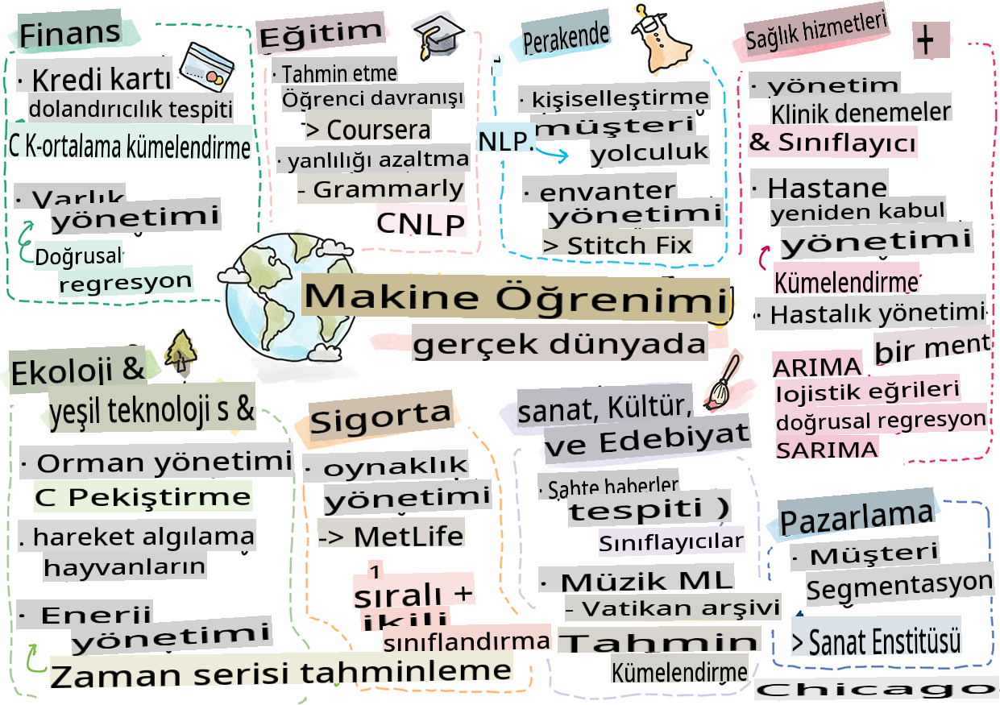

# Sonsöz: Gerçek Dünyada Makine Öğrenimi

> Sketchnote by [Tomomi Imura](https://www.twitter.com/girlie_mac)

Bu müfredatta, verileri eğitim için hazırlamanın ve makine öğrenimi modelleri oluşturmanın birçok yolunu öğrendiniz. Klasik regresyon, kümeleme, sınıflandırma, doğal dil işleme ve zaman serisi modellerinden oluşan bir dizi model oluşturdunuz. Tebrikler! Şimdi, tüm bunların ne için olduğunu merak ediyor olabilirsiniz... Bu modellerin gerçek dünya uygulamaları nelerdir?

Endüstride genellikle derin öğrenmeyi kullanan yapay zeka büyük ilgi görse de, klasik makine öğrenimi modellerinin hala değerli uygulamaları vardır. Bugün bile bu uygulamalardan bazılarını kullanıyor olabilirsiniz! Bu derste, sekiz farklı endüstri ve konu alanının bu tür modelleri nasıl daha performanslı, güvenilir, akıllı ve kullanıcılar için değerli hale getirdiğini keşfedeceksiniz.

## [Ders Öncesi Quiz](https://gray-sand-07a10f403.1.azurestaticapps.net/quiz/49/)

## 💰 Finans

Finans sektörü, makine öğrenimi için birçok fırsat sunar. Bu alandaki birçok problem, ML kullanılarak modellenip çözülebilir.

### Kredi Kartı Dolandırıcılığı Tespiti

Kursun başlarında [k-means kümeleme](../../5-Clustering/2-K-Means/README.md) hakkında öğrendik, ancak bu teknik kredi kartı dolandırıcılığıyla ilgili sorunları nasıl çözebilir?

K-means kümeleme, **aykırı değer tespiti** olarak adlandırılan bir kredi kartı dolandırıcılığı tespit tekniğinde kullanışlıdır. Bir veri seti hakkındaki gözlemler arasında aykırı değerler veya sapmalar, bir kredi kartının normal kapasitede mi kullanıldığını yoksa olağandışı bir şey mi olduğunu bize söyleyebilir. Aşağıdaki bağlantıda verilen makalede gösterildiği gibi, k-means kümeleme algoritmasını kullanarak kredi kartı verilerini sıralayabilir ve her işlemi ne kadar aykırı göründüğüne göre bir kümeye atayabilirsiniz. Ardından, dolandırıcılık ve meşru işlemler için en riskli kümeleri değerlendirebilirsiniz.
[Referans](https://citeseerx.ist.psu.edu/viewdoc/download?doi=10.1.1.680.1195&rep=rep1&type=pdf)

### Varlık Yönetimi

Varlık yönetiminde, bir birey veya firma müşterileri adına yatırımları yönetir. Uzun vadede serveti sürdürmek ve büyütmek onların işidir, bu yüzden iyi performans gösteren yatırımları seçmek çok önemlidir.

Belirli bir yatırımın nasıl performans gösterdiğini değerlendirmek için istatistiksel regresyon kullanılabilir. [Lineer regresyon](../../2-Regression/1-Tools/README.md), bir fonun belirli bir benchmarka göre nasıl performans gösterdiğini anlamak için değerli bir araçtır. Ayrıca, regresyon sonuçlarının istatistiksel olarak anlamlı olup olmadığını veya bir müşterinin yatırımlarını ne kadar etkileyeceğini de çıkarabiliriz. Analizinizi daha da genişleterek, ek risk faktörlerini hesaba katabileceğiniz çoklu regresyon kullanabilirsiniz. Bu işlemin belirli bir fon için nasıl çalışacağına dair bir örnek için, aşağıdaki makaleye göz atabilirsiniz.
[Referans](http://www.brightwoodventures.com/evaluating-fund-performance-using-regression/)

## 🎓 Eğitim

Eğitim sektörü de ML'nin uygulanabileceği çok ilginç bir alandır. Sınavlarda veya makalelerde hile yapmayı tespit etmek veya düzeltme sürecindeki önyargıyı, istemsiz ya da değil, yönetmek gibi ilginç sorunlar ele alınabilir.

### Öğrenci Davranışını Tahmin Etme

Açık çevrimiçi kurs sağlayıcısı [Coursera](https://coursera.com), birçok mühendislik kararını tartıştığı harika bir teknoloji bloguna sahiptir. Bu vaka çalışmasında, düşük NPS (Net Promoter Score) puanı ile kursa devam veya bırakma arasında bir korelasyon olup olmadığını keşfetmek için bir regresyon çizgisi çizdiler.
[Referans](https://medium.com/coursera-engineering/controlled-regression-quantifying-the-impact-of-course-quality-on-learner-retention-31f956bd592a)

### Önyargıyı Azaltma

Yazım asistanı [Grammarly](https://grammarly.com), ürünlerinde yazım ve dilbilgisi hatalarını kontrol eden sofistike [doğal dil işleme sistemleri](../../6-NLP/README.md) kullanır. Teknoloji bloglarında, makine öğreniminde cinsiyet önyargısını nasıl ele aldıklarını anlatan ilginç bir vaka çalışması yayınladılar, bu da [giriş niteliğindeki adalet dersimizde](../../1-Introduction/3-fairness/README.md) öğrendiğiniz bir konudur.
[Referans](https://www.grammarly.com/blog/engineering/mitigating-gender-bias-in-autocorrect/)

## 👜 Perakende

Perakende sektörü, müşteri yolculuğunu daha iyi hale getirmekten envanteri optimal bir şekilde stoklamaya kadar ML'den kesinlikle faydalanabilir.

### Müşteri Yolculuğunu Kişiselleştirme

Ev eşyaları satan Wayfair'de, müşterilerin zevk ve ihtiyaçlarına uygun ürünleri bulmalarına yardımcı olmak çok önemlidir. Bu makalede, şirketin mühendisleri, ML ve NLP'yi müşteriler için doğru sonuçları nasıl ortaya çıkardıklarını anlatıyorlar. Özellikle, Sorgu Niyet Motorları, varlık çıkarımı, sınıflandırıcı eğitimi, varlık ve görüş çıkarımı ve müşteri yorumlarında duygu etiketleme kullanılarak oluşturulmuştur. Bu, çevrimiçi perakendede NLP'nin nasıl çalıştığının klasik bir kullanım örneğidir.
[Referans](https://www.aboutwayfair.com/tech-innovation/how-we-use-machine-learning-and-natural-language-processing-to-empower-search)

### Envanter Yönetimi

[StitchFix](https://stitchfix.com) gibi yenilikçi ve çevik şirketler, tüketicilere kıyafet gönderen bir kutu hizmeti, öneriler ve envanter yönetimi için büyük ölçüde ML'ye dayanır. Stil ekipleri, ticaret ekipleriyle birlikte çalışır, aslında: "veri bilimcilerimizden biri, genetik bir algoritma ile uğraştı ve bugüne kadar var olmayan başarılı bir giysi parçasını tahmin etmek için bunu giyime uyguladı. Bunu ticaret ekibine sunduk ve şimdi bunu bir araç olarak kullanabiliyorlar."
[Referans](https://www.zdnet.com/article/how-stitch-fix-uses-machine-learning-to-master-the-science-of-styling/)

## 🏥 Sağlık Hizmetleri

Sağlık hizmetleri sektörü, araştırma görevlerini ve hastaların yeniden hastaneye yatması veya hastalıkların yayılmasını durdurma gibi lojistik sorunları optimize etmek için ML'yi kullanabilir.

### Klinik Denemeleri Yönetme

Klinik denemelerdeki toksisite, ilaç üreticileri için büyük bir endişe kaynağıdır. Ne kadar toksisite tolere edilebilir? Bu çalışmada, çeşitli klinik deneme yöntemlerini analiz etmek, klinik deneme sonuçlarının olasılıklarını tahmin etmek için yeni bir yaklaşımın geliştirilmesine yol açtı. Özellikle, gruplar arasında ayrım yapabilen bir [sınıflandırıcı](../../4-Classification/README.md) üretmek için rastgele orman kullanabildiler.
[Referans](https://www.sciencedirect.com/science/article/pii/S2451945616302914)

### Hastane Yeniden Yatış Yönetimi

Hastane bakımı maliyetlidir, özellikle de hastalar yeniden hastaneye yatırılmak zorunda kaldığında. Bu makale, [kümeleme](../../5-Clustering/README.md) algoritmaları kullanarak yeniden yatış potansiyelini tahmin etmek için ML kullanan bir şirketi tartışıyor. Bu kümeler, analistlerin "ortak bir nedeni paylaşabilecek yeniden yatış gruplarını keşfetmesine" yardımcı olur.
[Referans](https://healthmanagement.org/c/healthmanagement/issuearticle/hospital-readmissions-and-machine-learning)

### Hastalık Yönetimi

Son pandemi, makine öğreniminin hastalık yayılmasını durdurmaya nasıl yardımcı olabileceğine dair parlak bir ışık tuttu. Bu makalede, ARIMA, lojistik eğriler, lineer regresyon ve SARIMA'nın kullanıldığını göreceksiniz. "Bu çalışma, bu virüsün yayılma hızını hesaplamak ve böylece ölümleri, iyileşmeleri ve doğrulanmış vakaları tahmin etmek için bir girişimdir, böylece daha iyi hazırlanabilir ve hayatta kalabiliriz."
[Referans](https://www.ncbi.nlm.nih.gov/pmc/articles/PMC7979218/)

## 🌲 Ekoloji ve Yeşil Teknoloji

Doğa ve ekoloji, hayvanlar ve doğa arasındaki etkileşimin odak noktası olduğu birçok hassas sistemden oluşur. Bu sistemleri doğru bir şekilde ölçmek ve bir şeyler olduğunda uygun şekilde hareket etmek önemlidir, örneğin bir orman yangını veya hayvan popülasyonundaki bir düşüş gibi.

### Orman Yönetimi

Önceki derslerde [Takviyeli Öğrenme](../../8-Reinforcement/README.md) hakkında öğrendiniz. Doğadaki kalıpları tahmin etmeye çalışırken çok faydalı olabilir. Özellikle, orman yangınları ve istilacı türlerin yayılması gibi ekolojik sorunları izlemek için kullanılabilir. Kanada'da, bir grup araştırmacı, uydu görüntülerinden orman yangını dinamik modelleri oluşturmak için Takviyeli Öğrenme kullandı. Yenilikçi bir "mekansal yayılma süreci (SSP)" kullanarak, bir orman yangınını "manzaradaki herhangi bir hücredeki ajan" olarak düşündüler. "Yangının herhangi bir noktada bir konumdan alabileceği eylemler kümesi, kuzeye, güneye, doğuya veya batıya yayılmayı veya yayılmamayı içerir.

Bu yaklaşım, ilgili Markov Karar Sürecinin (MDP) dinamiklerinin bilinen bir fonksiyon olduğu için, normal RL kurulumunu tersine çevirir." Aşağıdaki bağlantıda bu grubun kullandığı klasik algoritmalar hakkında daha fazla bilgi edinin.
[Referans](https://www.frontiersin.org/articles/10.3389/fict.2018.00006/full)

### Hayvanların Hareket Algılaması

Derin öğrenme, hayvan hareketlerini görsel olarak izleme konusunda bir devrim yaratmışken (kendi [kutup ayısı izleyicinizi](https://docs.microsoft.com/learn/modules/build-ml-model-with-azure-stream-analytics/?WT.mc_id=academic-77952-leestott) burada oluşturabilirsiniz), klasik ML bu görevde hala yerini koruyor.

Çiftlik hayvanlarının hareketlerini izlemek için sensörler ve IoT, bu tür görsel işlemeyi kullanır, ancak daha temel ML teknikleri veri ön işleme için kullanışlıdır. Örneğin, bu makalede, koyun duruşları çeşitli sınıflandırıcı algoritmalar kullanılarak izlenmiş ve analiz edilmiştir. Sayfa 335'te ROC eğrisini tanıyabilirsiniz.
[Referans](https://druckhaus-hofmann.de/gallery/31-wj-feb-2020.pdf)

### ⚡️ Enerji Yönetimi

[Zaman serisi tahmini](../../7-TimeSeries/README.md) derslerimizde, bir kasaba için arz ve talebi anlamaya dayalı olarak gelir elde etmek için akıllı park sayaçları kavramını ele aldık. Bu makale, İrlanda'da akıllı ölçüm temelinde gelecekteki enerji kullanımını tahmin etmeye yardımcı olmak için kümeleme, regresyon ve zaman serisi tahmininin nasıl birleştirildiğini ayrıntılı olarak tartışıyor.
[Referans](https://www-cdn.knime.com/sites/default/files/inline-images/knime_bigdata_energy_timeseries_whitepaper.pdf)

## 💼 Sigorta

Sigorta sektörü, yaşanabilir finansal ve aktüeryal modeller oluşturmak ve optimize etmek için ML'yi kullanan bir başka sektördür.

### Volatilite Yönetimi

MetLife, bir hayat sigortası sağlayıcısı, finansal modellerindeki volatiliteyi analiz etme ve hafifletme yöntemlerini açıkça paylaşmaktadır. Bu makalede, ikili ve sıralı sınıflandırma görselleştirmeleri dikkat çekecek. Ayrıca tahmin görselleştirmeleri de bulacaksınız.
[Referans](https://investments.metlife.com/content/dam/metlifecom/us/investments/insights/research-topics/macro-strategy/pdf/MetLifeInvestmentManagement_MachineLearnedRanking_070920.pdf)

## 🎨 Sanat, Kültür ve Edebiyat

Sanat alanında, örneğin gazetecilikte, birçok ilginç sorun vardır. Sahte haber tespiti büyük bir sorundur çünkü insanların görüşlerini etkilediği ve hatta demokrasileri devirdiği kanıtlanmıştır. Müzeler de, eserler arasındaki bağlantıları bulmaktan kaynak planlamasına kadar her şeyde ML kullanmaktan faydalanabilir.

### Sahte Haber Tespiti

Günümüz medyasında sahte haber tespiti kedi fare oyununa dönüşmüştür. Bu makalede, araştırmacılar, çalıştığımız çeşitli ML tekniklerini birleştiren bir sistemin test edilebileceğini ve en iyi modelin uygulanabileceğini öneriyorlar: "Bu sistem, verilerden özellikler çıkarmak için doğal dil işleme temellidir ve ardından bu özellikler, Naive Bayes, Support Vector Machine (SVM), Random Forest (RF), Stochastic Gradient Descent (SGD) ve Logistic Regression (LR) gibi makine öğrenimi sınıflandırıcılarının eğitimi için kullanılır."
[Referans](https://www.irjet.net/archives/V7/i6/IRJET-V7I6688.pdf)

Bu makale, farklı ML alanlarını birleştirmenin, sahte haberlerin yayılmasını durdurmaya ve gerçek zararlar yaratmasını önlemeye yardımcı olabilecek ilginç sonuçlar üretebileceğini gösteriyor; bu durumda, COVID tedavileri hakkında yayılan söylentilerin şiddet olaylarını kışkırtması etkili olmuştur.

### Müze ML

Müzeler, koleksiyonları kataloglama ve dijitalleştirme ve eserler arasındaki bağlantıları bulmayı teknoloji ilerledikçe daha kolay hale getiren bir AI devriminin eşiğindedir. [In Codice Ratio](https://www.sciencedirect.com/science/article/abs/pii/S0306457321001035#:~:text=1.,studies%20over%20large%20historical%20sources.) gibi projeler, Vatikan Arşivleri gibi erişilemeyen koleksiyonların gizemlerini çözmeye yardımcı oluyor. Ancak, müzelerin iş yönü de ML modellerinden faydalanır.

Örneğin, Chicago Sanat Enstitüsü, izleyicilerin neyle ilgilendiğini ve sergileri ne zaman ziyaret edeceklerini tahmin etmek için modeller oluşturdu. Amaç, kullanıcı müzeyi her ziyaret ettiğinde bireyselleştirilmiş ve optimize edilmiş ziyaretçi deneyimleri yaratmaktır. "2017 mali yılı boyunca, model, katılım ve kabulü yüzde 1 doğrulukla tahmin etti," diyor Chicago Sanat Enstitüsü kıdemli başkan yardımcısı Andrew Simnick.
[Referans](https://www.chicagobusiness.com/article/20180518/ISSUE01/180519840/art-institute-of-chicago-uses-data-to-make-exhibit-choices)

## 🏷 Pazarlama

### Müşteri segmentasyonu

En etkili pazarlama stratejileri, müşterileri farklı gruplandırmalar temelinde farklı şekillerde hedefler. Bu makalede, farklılaştırılmış pazarlamayı desteklemek için Kümeleme algoritmalarının kullanımları tartışılmaktadır. Farklılaştırılmış pazarlama, şirketlerin marka bilinirliğini artırmalarına, daha fazla müşteriye ulaşmalarına ve daha fazla para kazanmalarına yardımcı olur.
[Referans](https://ai.inqline.com/machine-learning-for-marketing-customer-segmentation/)

## 🚀 Meydan Okuma

Bu müfredatta öğrendiğiniz bazı tekniklerden faydalanan başka bir sektörü belirleyin ve ML'i nasıl kullandığını keşfedin.

## [Ders sonrası sınav](https://gray-sand-07a10f403.1.azurestaticapps.net/quiz/50/)

## Gözden Geçirme ve Kendi Kendine Çalışma

Wayfair veri bilimi ekibinin, şirketlerinde ML'i nasıl kullandıklarına dair birkaç ilginç videosu var. [Göz atmaya değer](https://www.youtube.com/channel/UCe2PjkQXqOuwkW1gw6Ameuw/videos)!

## Ödev

[Bir ML hazine avı](assignment.md)

**Feragatname**:
Bu belge, makine tabanlı AI çeviri hizmetleri kullanılarak çevrilmiştir. Doğruluğu sağlamak için çaba göstersek de, otomatik çevirilerin hata veya yanlışlıklar içerebileceğini lütfen unutmayın. Orijinal belgenin kendi dilindeki hali yetkili kaynak olarak kabul edilmelidir. Kritik bilgiler için profesyonel insan çevirisi önerilir. Bu çevirinin kullanımından doğabilecek herhangi bir yanlış anlama veya yanlış yorumlamadan sorumlu değiliz.