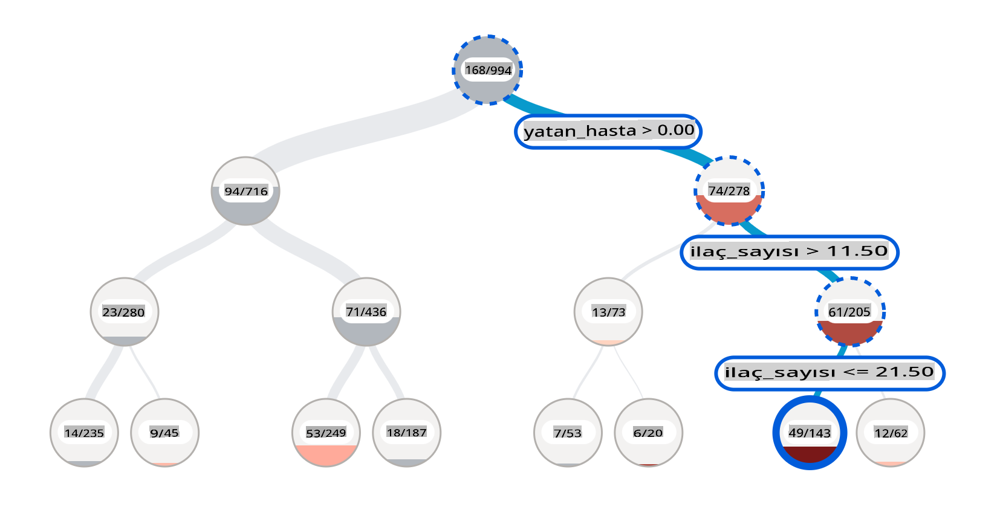
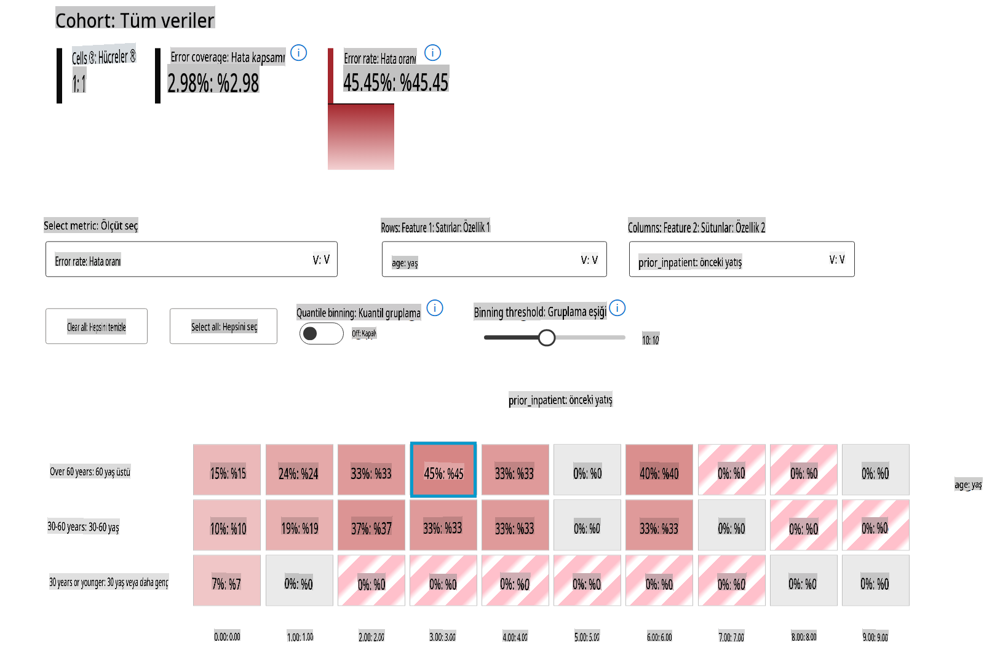
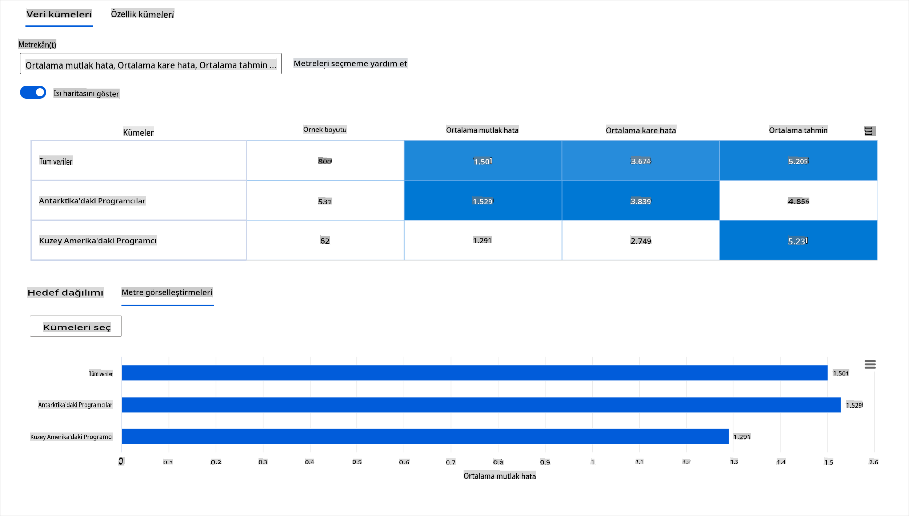
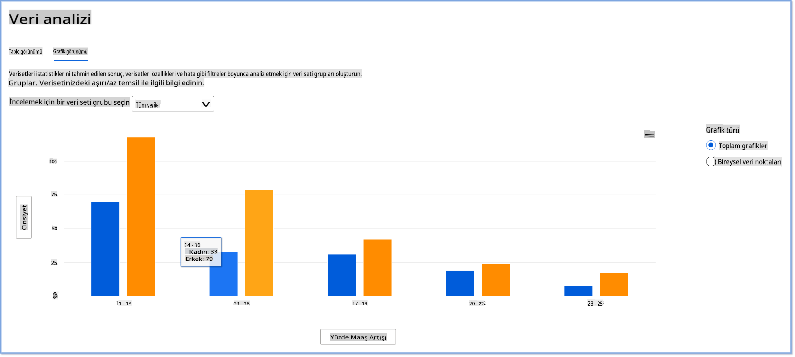
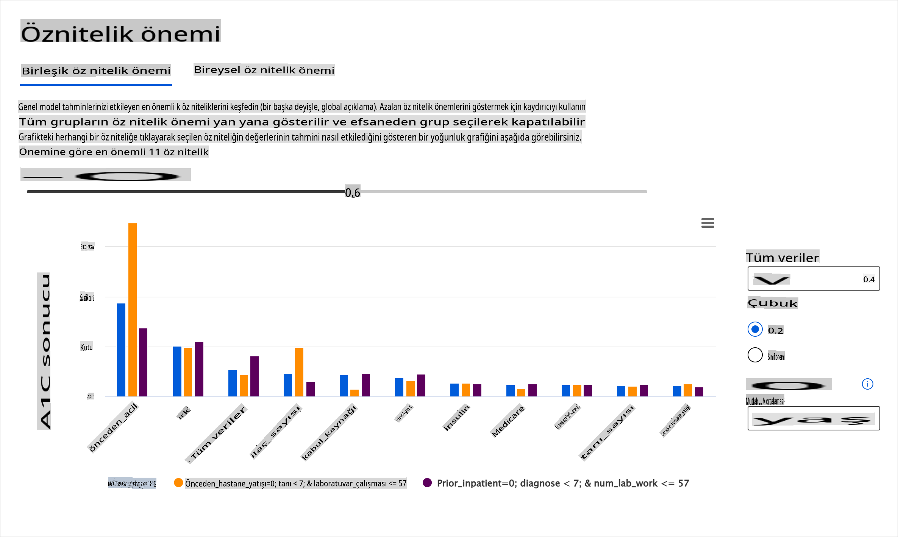
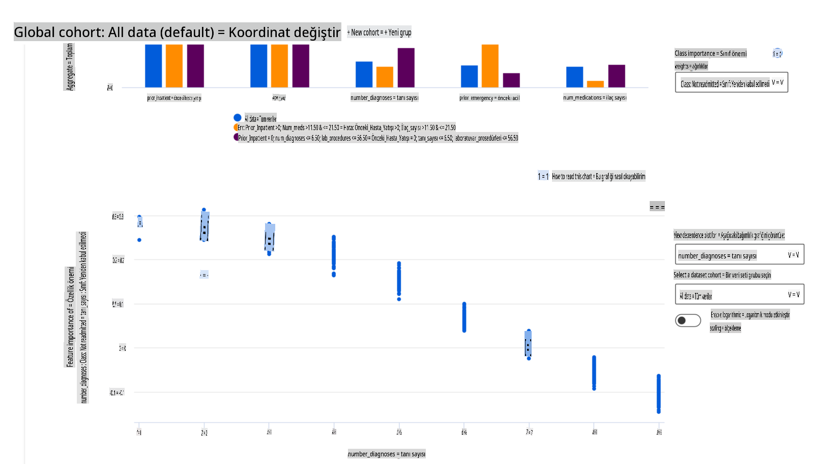

# Sonsöz: Sorumlu AI panosu bileşenleri kullanarak Makine Öğreniminde Model Hatalarını Ayıklama

## [Ders Öncesi Testi](https://gray-sand-07a10f403.1.azurestaticapps.net/quiz/5/)

## Giriş

Makine öğrenimi günlük hayatımızı etkiliyor. AI, sağlık, finans, eğitim ve istihdam gibi bireyler ve toplum olarak bizi etkileyen en önemli sistemlere giriyor. Örneğin, sistemler ve modeller sağlık teşhisleri veya dolandırıcılığı tespit etme gibi günlük karar verme görevlerinde yer alır. Sonuç olarak, AI'daki ilerlemeler ve hızlandırılmış benimseme, gelişen toplumsal beklentiler ve artan düzenlemelerle karşılanmaktadır. AI sistemlerinin beklentileri karşılamadığı, yeni zorluklar ortaya çıkardığı ve hükümetlerin AI çözümlerini düzenlemeye başladığı alanları sürekli olarak görüyoruz. Bu nedenle, bu modellerin herkes için adil, güvenilir, kapsayıcı, şeffaf ve hesap verebilir sonuçlar sağlamak amacıyla analiz edilmesi önemlidir.

Bu müfredatta, bir modelin sorumlu AI sorunları olup olmadığını değerlendirmek için kullanılabilecek pratik araçlara bakacağız. Geleneksel makine öğrenimi hata ayıklama teknikleri, genellikle toplanmış doğruluk veya ortalama hata kaybı gibi nicel hesaplamalara dayanır. Bu modelleri oluşturmak için kullandığınız verilerde ırk, cinsiyet, politik görüş, din gibi demografik bilgiler eksik olduğunda ne olabileceğini hayal edin. Modelin çıktısı belirli bir demografiyi tercih edecek şekilde yorumlandığında ne olur? Bu, bu hassas özellik gruplarının aşırı veya yetersiz temsil edilmesine neden olarak modelden adalet, kapsayıcılık veya güvenilirlik sorunlarına yol açabilir. Bir diğer faktör ise, makine öğrenimi modellerinin kara kutular olarak kabul edilmesidir, bu da bir modelin tahminini neyin yönlendirdiğini anlamayı ve açıklamayı zorlaştırır. Tüm bunlar, bir modelin adaletini veya güvenilirliğini değerlendirmek ve hata ayıklamak için yeterli araçlara sahip olmadıklarında veri bilimciler ve AI geliştiricilerin karşılaştığı zorluklardır.

Bu derste, modellerinizi hata ayıklama konusunda şunları öğreneceksiniz:

- **Hata Analizi**: Modelin yüksek hata oranlarına sahip olduğu veri dağılımındaki yerleri belirleyin.
- **Model Genel Bakış**: Model performans metriklerindeki farklılıkları keşfetmek için farklı veri kohortları arasında karşılaştırmalı analiz yapın.
- **Veri Analizi**: Modelinizin bir veri demografisini diğerine tercih etmesine neden olabilecek veri fazlalığı veya eksikliği olup olmadığını araştırın.
- **Özellik Önemi**: Modelinizin tahminlerini küresel veya yerel düzeyde hangi özelliklerin yönlendirdiğini anlayın.

## Önkoşul

Bir önkoşul olarak, lütfen [Geliştiriciler için Sorumlu AI araçlarını](https://www.microsoft.com/ai/ai-lab-responsible-ai-dashboard) inceleyin.

> 

## Hata Analizi

Doğruluğu ölçmek için kullanılan geleneksel model performans metrikleri genellikle doğru ve yanlış tahminlere dayalı hesaplamalardır. Örneğin, bir modelin %89 doğruluk oranına sahip olduğunu ve hata kaybının 0.001 olduğunu belirlemek iyi bir performans olarak kabul edilebilir. Hatalar genellikle temel veri kümenizde eşit dağılmamıştır. %89 doğruluk puanı alabilirsiniz, ancak modelin verinizin farklı bölgelerinde %42 oranında başarısız olduğunu keşfedebilirsiniz. Belirli veri gruplarındaki bu başarısızlık modellerinin sonucu adalet veya güvenilirlik sorunlarına yol açabilir. Modelin iyi veya kötü performans gösterdiği alanları anlamak önemlidir. Modelinizde yüksek sayıda yanlışlıkların olduğu veri bölgeleri önemli bir veri demografisi olabilir.

RAI panosundaki Hata Analizi bileşeni, model hatasının çeşitli kohortlar arasında nasıl dağıldığını ağaç görselleştirmesi ile gösterir. Bu, veri kümenizde yüksek hata oranına sahip özellikleri veya alanları belirlemede yararlıdır. Modelin yanlışlıklarının çoğunun nereden geldiğini görerek, sorunun kök nedenini araştırmaya başlayabilirsiniz. Ayrıca, analiz yapmak için veri kohortları oluşturabilirsiniz. Bu veri kohortları, model performansının bir kohortta neden iyi olduğunu, ancak başka bir kohortta neden hatalı olduğunu belirlemek için hata ayıklama sürecinde yardımcı olur.

Ağaç haritasındaki görsel göstergeler, sorun alanlarını daha hızlı bulmanıza yardımcı olur. Örneğin, bir ağaç düğümünün daha koyu kırmızı tonu, hata oranının daha yüksek olduğunu gösterir.

Isı haritası, kullanıcıların tüm veri kümesi veya kohortlar genelinde model hatalarına katkıda bulunan bir veya iki özelliği araştırmak için hata oranını incelemelerinde kullanabilecekleri başka bir görselleştirme işlevselliğidir.

Hata analizini şu durumlarda kullanın:

* Model hatalarının bir veri kümesi ve çeşitli giriş ve özellik boyutları genelinde nasıl dağıldığını derinlemesine anlamak için.
* Hata ayıklama adımlarınızı bilgilendirmek için hatalı kohortları otomatik olarak keşfetmek amacıyla toplam performans metriklerini parçalamak için.

## Model Genel Bakış

Bir makine öğrenimi modelinin performansını değerlendirmek, davranışını bütünsel olarak anlamayı gerektirir. Bu, performans metrikleri arasında farklılıkları bulmak için hata oranı, doğruluk, geri çağırma, kesinlik veya MAE (Ortalama Mutlak Hata) gibi birden fazla metriği gözden geçirerek elde edilebilir. Bir performans metriği harika görünebilir, ancak başka bir metrikte yanlışlıklar ortaya çıkabilir. Ayrıca, tüm veri kümesi veya kohortlar arasında metrikleri karşılaştırmak, modelin iyi veya kötü performans gösterdiği yerleri aydınlatmaya yardımcı olur. Bu, özellikle modelin hassas ve hassas olmayan özellikler (örneğin, hasta ırkı, cinsiyet veya yaşı) arasında performansını görerek modelin potansiyel adaletsizliğini ortaya çıkarmak için önemlidir. Örneğin, modelin hassas özelliklere sahip bir kohortta daha hatalı olduğunu keşfetmek, modelin potansiyel adaletsizliğini ortaya çıkarabilir.

RAI panosundaki Model Genel Bakış bileşeni, sadece bir kohortta veri temsilinin performans metriklerini analiz etmekle kalmaz, aynı zamanda kullanıcıların modelin davranışını farklı kohortlar arasında karşılaştırma yeteneği sağlar.

Bileşenin özellik tabanlı analiz işlevselliği, kullanıcıların belirli bir özellik içinde veri alt gruplarını daraltarak anormallikleri daha ayrıntılı düzeyde belirlemelerini sağlar. Örneğin, pano, kullanıcı tarafından seçilen bir özellik için otomatik olarak kohortlar oluşturma yeteneğine sahiptir (örneğin, *"time_in_hospital < 3"* veya *"time_in_hospital >= 7"*). Bu, kullanıcının daha büyük bir veri grubundan belirli bir özelliği izole etmesine ve bu özelliğin modelin hatalı sonuçlarını yönlendiren önemli bir etken olup olmadığını görmesine olanak tanır.

Model Genel Bakış bileşeni iki tür farklılık metriğini destekler:

**Model performansındaki farklılık**: Bu metrikler, veri alt grupları arasında seçilen performans metriğinin değerlerindeki farklılığı hesaplar. İşte birkaç örnek:

* Doğruluk oranındaki farklılık
* Hata oranındaki farklılık
* Kesinlikteki farklılık
* Geri çağırmadaki farklılık
* Ortalama mutlak hatadaki (MAE) farklılık

**Seçim oranındaki farklılık**: Bu metrik, veri alt grupları arasında seçim oranındaki (olumlu tahmin) farkı içerir. Bunun bir örneği, kredi onay oranlarındaki farklılıktır. Seçim oranı, her sınıfta 1 olarak sınıflandırılan veri noktalarının oranını (ikili sınıflandırmada) veya tahmin değerlerinin dağılımını (regresyonda) ifade eder.

## Veri Analizi

> "Verileri yeterince uzun süre işkence ederseniz, her şeyi itiraf eder" - Ronald Coase

Bu ifade aşırı gibi görünebilir, ancak verilerin herhangi bir sonucu desteklemek için manipüle edilebileceği doğrudur. Böyle bir manipülasyon bazen istemeden de olabilir. İnsan olarak hepimizin önyargıları vardır ve veriye önyargı eklediğinizde bunu bilinçli olarak fark etmek genellikle zordur. AI ve makine öğreniminde adaleti sağlamak karmaşık bir zorluk olmaya devam etmektedir.

Veri, geleneksel model performans metrikleri için büyük bir kör noktadır. Yüksek doğruluk puanlarına sahip olabilirsiniz, ancak bu her zaman veri kümenizde olabilecek temel veri önyargısını yansıtmaz. Örneğin, bir şirketin yönetici pozisyonlarındaki kadın çalışanların %27'si ve aynı seviyedeki erkeklerin %73'ü olan bir veri kümesi, bu verilere dayalı olarak eğitilmiş bir iş ilanı AI modelinin çoğunlukla üst düzey iş pozisyonları için erkek hedef kitleye yönelik olmasına neden olabilir. Veride bu dengesizlik, modelin tahminini bir cinsiyeti diğerine tercih edecek şekilde eğmiştir. Bu, AI modelinde bir cinsiyet önyargısı olan bir adalet sorunu ortaya çıkarır.

RAI panosundaki Veri Analizi bileşeni, veri kümesinde aşırı ve yetersiz temsili olan alanları belirlemeye yardımcı olur. Kullanıcılara, veri dengesizliklerinden veya belirli bir veri grubunun temsil eksikliğinden kaynaklanan hata ve adalet sorunlarının kök nedenini teşhis etme yeteneği sağlar. Bu, kullanıcıların tahmin edilen ve gerçek sonuçlar, hata grupları ve belirli özelliklere dayalı veri kümelerini görselleştirmelerine olanak tanır. Bazen az temsil edilen bir veri grubunu keşfetmek, modelin iyi öğrenmediğini de ortaya çıkarabilir, bu da yüksek yanlışlıkların nedenidir. Veride önyargı olan bir modelin sadece bir adalet sorunu değil, aynı zamanda kapsayıcı veya güvenilir olmadığını da gösterir.

Veri analizini şu durumlarda kullanın:

* Farklı filtreler seçerek veri kümenizi farklı boyutlara (kohortlar olarak da bilinir) dilimleyerek veri kümesi istatistiklerinizi keşfedin.
* Veri kümenizin farklı kohortlar ve özellik grupları genelinde dağılımını anlayın.
* Adalet, hata analizi ve nedensellik ile ilgili bulgularınızın (diğer pano bileşenlerinden türetilmiş) veri kümenizin dağılımının bir sonucu olup olmadığını belirleyin.
* Temsil sorunlarından, etiket gürültüsünden, özellik gürültüsünden, etiket önyargısından ve benzeri faktörlerden kaynaklanan hataları hafifletmek için hangi alanlarda daha fazla veri toplayacağınıza karar verin.

## Model Yorumlanabilirliği

Makine öğrenimi modelleri kara kutular olma eğilimindedir. Bir modelin tahminini yönlendiren anahtar veri özelliklerini anlamak zor olabilir. Bir modelin belirli bir tahminde bulunmasının nedenini açıklamak önemlidir. Örneğin, bir AI sistemi, bir diyabet hastasının 30 gün içinde tekrar hastaneye yatma riski taşıdığını tahmin ederse, bu tahminine yol açan destekleyici verileri sağlayabilmelidir. Destekleyici veri göstergelerine sahip olmak, klinisyenlerin veya hastanelerin iyi bilgilendirilmiş kararlar almasına yardımcı olmak için şeffaflık sağlar. Ayrıca, bir modelin bir birey için neden bir tahminde bulunduğunu açıklayabilmek, sağlık düzenlemeleriyle hesap verebilirlik sağlar. İnsanların hayatlarını etkileyen makine öğrenimi modelleri kullanırken, bir modelin davranışını neyin etkilediğini anlamak ve açıklamak çok önemlidir. Model açıklanabilirliği ve yorumlanabilirliği, aşağıdaki senaryolarda soruları yanıtlamaya yardımcı olur:

* Model hata ayıklama: Modelim neden bu hatayı yaptı? Modelimi nasıl geliştirebilirim?
* İnsan-AI işbirliği: Modelin kararlarını nasıl anlayabilir ve güvenebilirim?
* Düzenleyici uyumluluk: Modelim yasal gereklilikleri karşılıyor mu?

RAI panosundaki Özellik Önemi bileşeni, bir modelin tahminlerini nasıl yaptığını anlamak ve hata ayıklamak için kapsamlı bir anlayış sağlar. Ayrıca, makine öğrenimi profesyonelleri ve karar vericiler için modelin davranışını etkileyen özelliklerin kanıtlarını açıklamak ve göstermek için düzenleyici uyumluluk açısından faydalı bir araçtır. Kullanıcılar, hem küresel hem de yerel açıklamaları keşfederek hangi özelliklerin modelin tahminlerini yönlendirdiğini doğrulayabilir. Küresel açıklamalar, modelin genel tahminini etkileyen en önemli özellikleri listeler. Yerel açıklamalar, bir modelin belirli bir vaka için yaptığı tahmini hangi özelliklerin yönlendirdiğini gösterir. Yerel açıklamaları değerlendirme yeteneği, belirli bir vakayı hata ayıklama veya denetleme açısından modelin neden doğru veya yanlış bir tahminde bulunduğunu daha iyi anlamak ve yorumlamak için de faydalıdır.

* Küresel açıklamalar: Örneğin, bir diyabet hastanesi tekrar yatış modelinin genel davranışını hangi özellikler etkiliyor?
* Yerel açıklamalar: Örneğin, neden 60 yaş üstü ve önceki hastane yatışları olan bir diyabet hastası, 30 gün içinde tekrar hastaneye yatacağı veya yatmayacağı tahmin edildi?

Modelin performansını farklı kohortlar genelinde inceleme sürecinde, Özellik Önemi, bir özelliğin kohortlar genelinde ne düzeyde etki ettiğini gösterir. Modelin hatalı tahminlerini yönlendiren bir özelliğin etki düzeyini karşılaştırırken anormallikleri ortaya çıkarmaya yardımcı olur. Özellik Önemi bileşeni, bir özelliğin değerlerinin modelin sonucunu olumlu veya olumsuz etkilediğini gösterebilir. Örneğin, bir model yanlış bir tahminde bulunduğunda, bileşen, tahmini yönlendiren özellikleri veya özellik değerlerini belirleme ve inceleme yeteneği sağlar. Bu düzeydeki ayrıntı, sadece hata ayıklamada değil, aynı zamanda denetim durumlarında şeffaflık ve hesap verebilirlik sağlamada da yardımcı olur. Son olarak, bileşen adalet sorunlarını belirlemenize yardımcı olabilir. Örneğin, etnik köken veya cinsiyet gibi hassas bir özellik modelin tahminini yönlendirmede yüksek derecede etkiliyse, bu modelde ırk veya cinsiyet önyargısı olduğunu gösterebilir.

Yorumlanabilirliği şu durumlarda kullanın:

* AI sisteminizin tahminlerinin ne kadar güvenilir olduğunu, tahminler için hangi özelliklerin en önemli olduğunu anlayarak belirleyin.
* Modelinizi anlamak ve sağlıklı özellikler kullanıp kullanmadığını veya sadece yanlış korelasyonları mı kullandığını belirlemek için modelin hata ayıklamasına yaklaşın.
* Modelin tahminlerini hassas özelliklere veya onlarla yüksek derecede ilişkili özelliklere dayandırıp dayandırmadığını anlayarak potansiyel adaletsizlik kaynaklarını ortaya çıkarın.
* Yerel açıklamalar oluşturarak modelin kararlarını kullanıcılara açıklamak ve güven oluşturmak.
* AI sisteminin düzenleyici bir denetimini tamamlayarak modelleri doğrulamak ve model kararlarının insanlar üzerindeki etkisini izlemek.

## Sonuç

Tüm RAI pano bileşenleri, topluma daha az zarar veren ve daha güvenilir makine öğrenimi modelleri oluşturmanıza yardımcı olan pratik araçlardır. İnsan haklarına yönelik tehditlerin önlenmesini, belirli grupları yaşam fırsatlarından dışlamayı veya fiziksel veya psikolojik yaralanma riskini artırır. Ayrıca, modelinizin kararlarına yerel açıklamalar oluşturarak güven oluşturmanıza yardımcı olur. Potansiyel zararlar şu şekilde sınıflandırılabilir:

- **Tahsis**, örneğin bir cinsiyet veya etnik kökenin diğerine tercih edilmesi.
- **Hizmet kalitesi**. Veriyi belirli bir senaryo için eğitiyorsanız, ancak gerçeklik çok daha karmaşıksa, bu kötü performans gösteren bir hizmete yol açar.
- **Kalıp**. Belirli bir grubu önceden atanmış özelliklerle ilişkilendirme.
- **Aşağılama**. Bir şeyi veya birini haksızca eleştirmek ve etiketlemek.
- **Aşırı veya yetersiz temsil**. Belirli bir grubun belirli bir meslekte görülmediği fikri ve bu durumu teşvik eden herhangi bir hizmet veya işlev zarara katkıda bulunur.

### Azure RAI panosu

[Azure RAI panosu](https://learn.microsoft.com

**Feragatname**: 
Bu belge, makine tabanlı yapay zeka çeviri hizmetleri kullanılarak çevrilmiştir. Doğruluk için çaba göstersek de, otomatik çevirilerin hata veya yanlışlıklar içerebileceğini lütfen unutmayın. Orijinal belgenin kendi dilindeki hali yetkili kaynak olarak kabul edilmelidir. Kritik bilgiler için profesyonel insan çevirisi tavsiye edilir. Bu çevirinin kullanılması sonucu oluşabilecek yanlış anlaşılmalar veya yanlış yorumlamalardan sorumlu değiliz.