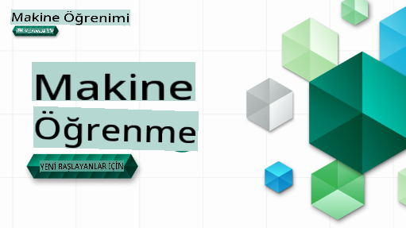

# Başlangıç Seviyesi İçin Makine Öğrenimi - Bir Müfredat

> 🌍 Dünya kültürleri aracılığıyla Makine Öğrenimini keşfederken dünyayı dolaşın 🌍

Microsoft'taki Bulut Savunucuları olarak, tamamen **Makine Öğrenimi** üzerine 12 haftalık, 26 derslik bir müfredat sunmaktan mutluluk duyuyoruz. Bu müfredatta, genellikle **klasik makine öğrenimi** olarak adlandırılan konuları öğreneceksiniz, ağırlıklı olarak Scikit-learn kütüphanesini kullanarak ve derin öğrenmeyi atlayarak, ki bu konu [Başlangıç Seviyesi İçin AI Müfredatımızda](https://aka.ms/ai4beginners) ele alınmaktadır. Bu dersleri, ['Başlangıç Seviyesi İçin Veri Bilimi' müfredatımızla](https://aka.ms/ds4beginners) birleştirin!

Klasik teknikleri dünyanın farklı bölgelerinden veriler üzerinde uygularken bizimle birlikte dünyayı dolaşın. Her ders, ders öncesi ve sonrası sınavları, dersi tamamlama talimatlarını, bir çözümü, bir ödevi ve daha fazlasını içerir. Proje tabanlı pedagojimiz, yeni becerilerin 'kalıcı' olmasını sağlayan, öğrenirken inşa etmenizi sağlayan kanıtlanmış bir yoldur.

**✍️ Yazarlarımıza içten teşekkürler** Jen Looper, Stephen Howell, Francesca Lazzeri, Tomomi Imura, Cassie Breviu, Dmitry Soshnikov, Chris Noring, Anirban Mukherjee, Ornella Altunyan, Ruth Yakubu ve Amy Boyd

**🎨 İllüstratörlerimize teşekkürler** Tomomi Imura, Dasani Madipalli ve Jen Looper

**🙏 Microsoft Öğrenci Elçileri yazarlarımıza, gözden geçirenlerimize ve içerik katkıda bulunanlarımıza özel teşekkürler**, özellikle Rishit Dagli, Muhammad Sakib Khan Inan, Rohan Raj, Alexandru Petrescu, Abhishek Jaiswal, Nawrin Tabassum, Ioan Samuila ve Snigdha Agarwal

**🤩 R derslerimiz için Microsoft Öğrenci Elçileri Eric Wanjau, Jasleen Sondhi ve Vidushi Gupta'ya ekstra teşekkürler!**

# Başlarken

Aşağıdaki adımları izleyin:
1. **Depoyu Çatallayın**: Bu sayfanın sağ üst köşesindeki "Fork" düğmesine tıklayın.
2. **Depoyu Klonlayın**: `git clone https://github.com/microsoft/ML-For-Beginners.git`

> [Bu kurs için ek kaynakların tümünü Microsoft Learn koleksiyonumuzda bulun](https://learn.microsoft.com/en-us/collections/qrqzamz1nn2wx3?WT.mc_id=academic-77952-bethanycheum)

**[Öğrenciler](https://aka.ms/student-page)**, bu müfredatı kullanmak için, tüm repo'yu kendi GitHub hesabınıza çatallayın ve alıştırmaları kendi başınıza veya bir grup ile tamamlayın:

- Ders öncesi sınavla başlayın.
- Dersi okuyun ve her bilgi kontrolünde durup düşünerek etkinlikleri tamamlayın.
- Çözüm kodunu çalıştırmak yerine dersleri anlayarak projeleri oluşturmaya çalışın; ancak bu kod her proje odaklı derste `/solution` klasörlerinde mevcuttur.
- Ders sonrası sınavı yapın.
- Meydan okumayı tamamlayın.
- Ödevi tamamlayın.
- Bir ders grubunu tamamladıktan sonra, [Tartışma Panosu](https://github.com/microsoft/ML-For-Beginners/discussions) ziyaret edin ve uygun PAT rubriğini doldurarak "yüksek sesle öğrenin". Bir 'PAT', öğrenmenizi daha da ilerletmek için doldurduğunuz bir rubriktir. Ayrıca diğer PAT'lere de tepki verebilirsiniz, böylece birlikte öğrenebiliriz.

> Daha fazla çalışma için, bu [Microsoft Learn](https://docs.microsoft.com/en-us/users/jenlooper-2911/collections/k7o7tg1gp306q4?WT.mc_id=academic-77952-leestott) modüllerini ve öğrenme yollarını takip etmenizi öneririz.

**Öğretmenler**, bu müfredatı nasıl kullanacağınıza dair [bazı öneriler ekledik](for-teachers.md).

---

## Video Yürüyüşleri

Bazı dersler kısa video formatında mevcuttur. Tüm bu videoları derslerin içinde veya [Microsoft Developer YouTube kanalındaki Başlangıç Seviyesi İçin ML oynatma listesinde](https://aka.ms/ml-beginners-videos) bulabilirsiniz, aşağıdaki resme tıklayarak.

---

## Ekibi Tanıyın

**Gif by** [Mohit Jaisal](https://linkedin.com/in/mohitjaisal)

> 🎥 Proje ve projeyi oluşturan kişiler hakkında bir video için yukarıdaki resme tıklayın!

---

## Pedagoji

Bu müfredatı oluştururken iki pedagojik ilkeyi seçtik: elverişli ve **proje tabanlı** olmasını ve **sık sınavlar** içermesini sağlamak. Ayrıca, bu müfredatın uyumlu bir **temaya** sahip olmasını sağladık.

İçeriğin projelerle uyumlu olmasını sağlayarak, süreç öğrenciler için daha ilgi çekici hale gelir ve kavramların kalıcılığı artırılır. Ayrıca, bir ders öncesinde düşük riskli bir sınav, öğrencinin bir konuyu öğrenmeye yönelik niyetini belirlerken, ders sonrası ikinci bir sınav daha fazla kalıcılığı sağlar. Bu müfredat esnek ve eğlenceli olacak şekilde tasarlanmıştır ve tamamı veya kısmen alınabilir. Projeler küçük başlar ve 12 haftalık döngünün sonunda giderek daha karmaşık hale gelir. Bu müfredat ayrıca, ekstra kredi veya tartışma temeli olarak kullanılabilecek ML'nin gerçek dünya uygulamaları üzerine bir ek içerir.

> [Davranış Kuralları](CODE_OF_CONDUCT.md), [Katkıda Bulunma](CONTRIBUTING.md) ve [Çeviri](TRANSLATIONS.md) yönergelerimizi bulun. Yapıcı geri bildiriminizi bekliyoruz!

## Her Ders İçerir

- isteğe bağlı sketchnote
- isteğe bağlı ek video
- video yürüyüşü (bazı derslerde)
- ders öncesi ısınma sınavı
- yazılı ders
- proje tabanlı dersler için, projeyi nasıl oluşturacağınızla ilgili adım adım kılavuzlar
- bilgi kontrolleri
- bir meydan okuma
- ek okuma
- ödev
- ders sonrası sınav

> **Diller hakkında bir not**: Bu dersler öncelikle Python ile yazılmıştır, ancak birçoğu R dilinde de mevcuttur. Bir R dersini tamamlamak için `/solution` klasörüne gidin ve R derslerini arayın. Bu dersler, bir **R Markdown** dosyasını temsil eden .rmd uzantısına sahiptir ve bu dosya, `code chunks` (R veya diğer dillerin) ve `YAML header` (PDF gibi çıktıları nasıl biçimlendireceğinizi yönlendiren) bir `Markdown document` içinde yerleştirilmiş bir şekilde basitçe tanımlanabilir. Bu nedenle, veri bilimi için örnek bir yazım çerçevesi olarak hizmet eder, çünkü kodunuzu, çıktısını ve düşüncelerinizi birleştirmenize olanak tanır ve bunları Markdown ile yazmanıza olanak tanır. Ayrıca, R Markdown belgeleri PDF, HTML veya Word gibi çıktı formatlarına dönüştürülebilir.

> **Sınavlar hakkında bir not**: Tüm sınavlar [Quiz App klasöründe](../../quiz-app) yer alır, her biri üç sorudan oluşan toplam 52 sınav. Derslerden bağlantılıdır, ancak quiz uygulaması yerel olarak çalıştırılabilir; yerel olarak barındırmak veya Azure'a dağıtmak için `quiz-app` klasöründeki talimatları izleyin.

| Ders Numarası |                             Konu                              |                   Ders Grubu                   | Öğrenme Hedefleri                                                                                                             |                                                              Bağlantılı Ders                                                               |                        Yazar                        |
| :-----------: | :------------------------------------------------------------: | :-------------------------------------------------: | ------------------------------------------------------------------------------------------------------------------------------- | :--------------------------------------------------------------------------------------------------------------------------------------: | :--------------------------------------------------: |
|      01       |                Makine öğrenimine giriş                |      [Giriş](1-Introduction/README.md)       | Makine öğrenimi ile ilgili temel kavramları öğrenin                                                                                |                                             [Ders](1-Introduction/1-intro-to-ML/README.md)                                             |                       Muhammad                       |
|      02       |                Makine öğreniminin tarihi                 |      [Giriş](1-Introduction/README.md)       | Bu alanın altındaki tarihi öğrenin                                                                                         |                                            [Ders](1-Introduction/2-history-of-ML/README.md)                                            |                     Jen ve Amy                      |
|      03       |                 Adalet ve makine öğrenimi                  |      [Giriş](1-Introduction/README.md)       | Öğrencilerin ML modellerini oluştururken ve uygularken dikkate alması gereken önemli felsefi konular nelerdir? |                                              [Ders](1-Introduction/3-fairness/README.md)                                               |                        Tomomi                        |
|      04       |                Makine öğrenimi teknikleri                      |      [Introduction](1-Introduction/README.md)       | ML araştırmacıları ML modelleri oluşturmak için hangi teknikleri kullanıyor?                                                    |                                          [Lesson](1-Introduction/4-techniques-of-ML/README.md)                                           |                    Chris ve Jen                     |
|      05       |                   Regresyona giriş                             |        [Regression](2-Regression/README.md)         | Regresyon modelleri için Python ve Scikit-learn ile başlayın                                                                  |         <ul><li>[Python](2-Regression/1-Tools/README.md)</li><li>[R](../../2-Regression/1-Tools/solution/R/lesson_1.html)</li></ul>         |      <ul><li>Jen</li><li>Eric Wanjau</li></ul>       |
|      06       |                Kuzey Amerika kabak fiyatları 🎃                |        [Regression](2-Regression/README.md)         | ML için hazırlık olarak verileri görselleştirin ve temizleyin                                                                 |          <ul><li>[Python](2-Regression/2-Data/README.md)</li><li>[R](../../2-Regression/2-Data/solution/R/lesson_2.html)</li></ul>          |      <ul><li>Jen</li><li>Eric Wanjau</li></ul>       |
|      07       |                Kuzey Amerika kabak fiyatları 🎃                |        [Regression](2-Regression/README.md)         | Doğrusal ve polinom regresyon modelleri oluşturun                                                                              |        <ul><li>[Python](2-Regression/3-Linear/README.md)</li><li>[R](../../2-Regression/3-Linear/solution/R/lesson_3.html)</li></ul>        |      <ul><li>Jen ve Dmitry</li><li>Eric Wanjau</li></ul>       |
|      08       |                Kuzey Amerika kabak fiyatları 🎃                |        [Regression](2-Regression/README.md)         | Lojistik regresyon modeli oluşturun                                                                                           |     <ul><li>[Python](2-Regression/4-Logistic/README.md) </li><li>[R](../../2-Regression/4-Logistic/solution/R/lesson_4.html)</li></ul>      |      <ul><li>Jen</li><li>Eric Wanjau</li></ul>       |
|      09       |                          Bir Web Uygulaması 🔌                 |           [Web App](3-Web-App/README.md)            | Eğittiğiniz modeli kullanmak için bir web uygulaması oluşturun                                                                 |                                                 [Python](3-Web-App/1-Web-App/README.md)                                                  |                         Jen                          |
|      10       |                 Sınıflandırmaya giriş                          |    [Classification](4-Classification/README.md)     | Verilerinizi temizleyin, hazırlayın ve görselleştirin; sınıflandırmaya giriş                                                  | <ul><li> [Python](4-Classification/1-Introduction/README.md) </li><li>[R](../../4-Classification/1-Introduction/solution/R/lesson_10.html)  | <ul><li>Jen ve Cassie</li><li>Eric Wanjau</li></ul> |
|      11       |             Lezzetli Asya ve Hint mutfakları 🍜                |    [Classification](4-Classification/README.md)     | Sınıflandırıcılarla tanışın                                                                                                   | <ul><li> [Python](4-Classification/2-Classifiers-1/README.md)</li><li>[R](../../4-Classification/2-Classifiers-1/solution/R/lesson_11.html) | <ul><li>Jen ve Cassie</li><li>Eric Wanjau</li></ul> |
|      12       |             Lezzetli Asya ve Hint mutfakları 🍜                |    [Classification](4-Classification/README.md)     | Daha fazla sınıflandırıcı                                                                                                      | <ul><li> [Python](4-Classification/3-Classifiers-2/README.md)</li><li>[R](../../4-Classification/3-Classifiers-2/solution/R/lesson_12.html) | <ul><li>Jen ve Cassie</li><li>Eric Wanjau</li></ul> |
|      13       |             Lezzetli Asya ve Hint mutfakları 🍜                |    [Classification](4-Classification/README.md)     | Modelinizi kullanarak bir öneri web uygulaması oluşturun                                                                      |                                              [Python](4-Classification/4-Applied/README.md)                                              |                         Jen                          |
|      14       |                   Kümelemeye giriş                             |        [Clustering](5-Clustering/README.md)         | Verilerinizi temizleyin, hazırlayın ve görselleştirin; kümelemeye giriş                                                      |         <ul><li> [Python](5-Clustering/1-Visualize/README.md)</li><li>[R](../../5-Clustering/1-Visualize/solution/R/lesson_14.html)         |      <ul><li>Jen</li><li>Eric Wanjau</li></ul>       |
|      15       |              Nijeryalı Müzik Zevklerini Keşfetmek 🎧              |        [Clustering](5-Clustering/README.md)         | K-Means kümeleme yöntemini keşfedin                                                                                           |           <ul><li> [Python](5-Clustering/2-K-Means/README.md)</li><li>[R](../../5-Clustering/2-K-Means/solution/R/lesson_15.html)           |      <ul><li>Jen</li><li>Eric Wanjau</li></ul>       |
|      16       |        Doğal Dil İşlemeye Giriş ☕️         |   [Natural language processing](6-NLP/README.md)    | Basit bir bot oluşturarak NLP hakkında temel bilgileri öğrenin                                                                             |                                             [Python](6-NLP/1-Introduction-to-NLP/README.md)                                              |                       Stephen                        |
|      17       |                      Yaygın NLP Görevleri ☕️                      |   [Natural language processing](6-NLP/README.md)    | Dil yapılarıyla uğraşırken gerekli olan yaygın görevleri anlayarak NLP bilginizi derinleştirin                          |                                                    [Python](6-NLP/2-Tasks/README.md)                                                     |                       Stephen                        |
|      18       |             Çeviri ve Duygu Analizi ♥️              |   [Natural language processing](6-NLP/README.md)    | Jane Austen ile çeviri ve duygu analizi                                                                             |                                            [Python](6-NLP/3-Translation-Sentiment/README.md)                                             |                       Stephen                        |
|      19       |                  Avrupa'nın Romantik Otelleri ♥️                  |   [Natural language processing](6-NLP/README.md)    | Otel yorumlarıyla duygu analizi 1                                                                                         |                                               [Python](6-NLP/4-Hotel-Reviews-1/README.md)                                                |                       Stephen                        |
|      20       |                  Avrupa'nın Romantik Otelleri ♥️                  |   [Natural language processing](6-NLP/README.md)    | Otel yorumlarıyla duygu analizi 2                                                                                         |                                               [Python](6-NLP/5-Hotel-Reviews-2/README.md)                                                |                       Stephen                        |
|      21       |            Zaman Serisi Tahminine Giriş             |        [Time series](7-TimeSeries/README.md)        | Zaman serisi tahminine giriş                                                                                         |                                             [Python](7-TimeSeries/1-Introduction/README.md)                                              |                      Francesca                       |
|      22       | ⚡️ Dünya Güç Kullanımı ⚡️ - ARIMA ile zaman serisi tahmini |        [Time series](7-TimeSeries/README.md)        | ARIMA ile zaman serisi tahmini                                                                                              |                                                 [Python](7-TimeSeries/2-ARIMA/README.md)                                                 |                      Francesca                       |
|      23       |  ⚡️ Dünya Güç Kullanımı ⚡️ - SVR ile zaman serisi tahmini  |        [Time series](7-TimeSeries/README.md)        | Destek Vektör Regresörü ile zaman serisi tahmini                                                                           |                                                  [Python](7-TimeSeries/3-SVR/README.md)                                                  |                       Anirban                        |
|      24       |             Pekiştirmeli Öğrenmeye Giriş             | [Reinforcement learning](8-Reinforcement/README.md) | Q-Learning ile pekiştirmeli öğrenmeye giriş                                                                          |                                             [Python](8-Reinforcement/1-QLearning/README.md)                                              |                        Dmitry                        |
|      25       |                 Peter'ın kurttan kaçmasına yardım edin! 🐺                  | [Reinforcement learning](8-Reinforcement/README.md) | Pekiştirmeli öğrenme Gym                                                                                                      |                                                [Python](8-Reinforcement/2-Gym/README.md)                                                 |                        Dmitry                        |
|  Postscript   |            Gerçek Dünya ML Senaryoları ve Uygulamaları            |      [ML in the Wild](9-Real-World/README.md)       | Klasik ML'nin ilginç ve açıklayıcı gerçek dünya uygulamaları                                                               |                                             [Lesson](9-Real-World/1-Applications/README.md)                                              |                         Team                         |
|  Postscript   |            RAI gösterge tablosunu kullanarak ML'de Model Hatalarını Ayıklama          |      [ML in the Wild](9-Real-World/README.md)       | Sorumlu AI gösterge tablosu bileşenlerini kullanarak Makine Öğreniminde Model Hatalarını Ayıklama                                                              |                                             [Lesson](9-Real-World/2-Debugging-ML-Models/README.md)                                              |                         Ruth Yakubu                       |

> [bu kurs için tüm ek kaynakları Microsoft Learn koleksiyonumuzda bulun](https://learn.microsoft.com/en-us/collections/qrqzamz1nn2wx3?WT.mc_id=academic-77952-bethanycheum)

## Çevrimdışı erişim

Bu dokümantasyonu [Docsify](https://docsify.js.org/#/) kullanarak çevrimdışı çalıştırabilirsiniz. Bu repoyu fork'layın, [Docsify'i yükleyin](https://docsify.js.org/#/quickstart) yerel makinenize ve ardından bu reponun kök klasöründe `docsify serve` yazın. Web sitesi localhost'unuzda 3000 portunda sunulacaktır: `localhost:3000`.

## PDF'ler
Müfredatın PDF dosyasını bağlantılarla [buradan](https://microsoft.github.io/ML-For-Beginners/pdf/readme.pdf) bulabilirsiniz.

## Yardım İstendi

Bir çeviri katkısında bulunmak ister misiniz? Lütfen [çeviri yönergelerimizi](TRANSLATIONS.md) okuyun ve iş yükünü yönetmek için şablonlu bir sorun ekleyin [buradan](https://github.com/microsoft/ML-For-Beginners/issues).

## Diğer Müfredatlar

Ekibimiz başka müfredatlar da üretiyor! Göz atın:

- [AI for Beginners](https://aka.ms/ai4beginners)
- [Data Science for Beginners](https://aka.ms/datascience-beginners)
- [**Yeni Sürüm 2.0** - Generative AI for Beginners](https://aka.ms/genai-beginners)
- [**YENİ** Cybersecurity for Beginners](https://github.com/microsoft/Security-101??WT.mc_id=academic-96948-sayoung)
- [Web Dev for Beginners](https://aka.ms/webdev-beginners)
- [IoT for Beginners](https://aka.ms/iot-beginners)
- [Machine Learning for Beginners](https://aka.ms/ml4beginners)
- [XR Development for Beginners](https://aka.ms/xr-dev-for-beginners)
- [Mastering GitHub Copilot for AI Paired Programming](https://aka.ms/GitHubCopilotAI)

**Feragatname**:
Bu belge, makine tabanlı yapay zeka çeviri hizmetleri kullanılarak çevrilmiştir. Doğruluğu sağlamak için çaba göstersek de, otomatik çevirilerin hata veya yanlışlıklar içerebileceğini lütfen unutmayın. Orijinal belgenin kendi dilindeki hali, yetkili kaynak olarak kabul edilmelidir. Kritik bilgiler için profesyonel insan çevirisi önerilmektedir. Bu çevirinin kullanımından kaynaklanan yanlış anlama veya yanlış yorumlamalardan sorumlu değiliz.