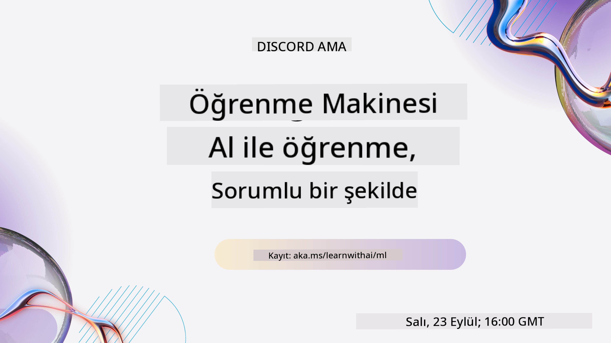
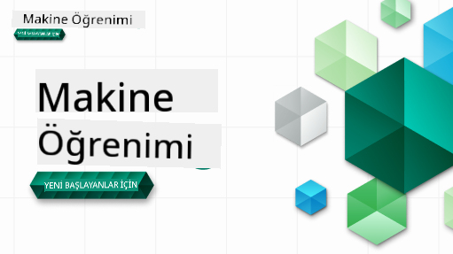

<!--
CO_OP_TRANSLATOR_METADATA:
{
  "original_hash": "7a13afb3674838f557d61f8d67e4d5f8",
  "translation_date": "2025-10-24T09:08:10+00:00",
  "source_file": "README.md",
  "language_code": "tr"
}
-->

### 🌐 Çok Dilli Destek

#### GitHub Action ile Destekleniyor (Otomatik ve Her Zaman Güncel)

<!-- CO-OP TRANSLATOR LANGUAGES TABLE START -->
[Arabic](../ar/README.md) | [Bengali](../bn/README.md) | [Bulgarian](../bg/README.md) | [Burmese (Myanmar)](../my/README.md) | [Chinese (Simplified)](../zh/README.md) | [Chinese (Traditional, Hong Kong)](../hk/README.md) | [Chinese (Traditional, Macau)](../mo/README.md) | [Chinese (Traditional, Taiwan)](../tw/README.md) | [Croatian](../hr/README.md) | [Czech](../cs/README.md) | [Danish](../da/README.md) | [Dutch](../nl/README.md) | [Estonian](../et/README.md) | [Finnish](../fi/README.md) | [French](../fr/README.md) | [German](../de/README.md) | [Greek](../el/README.md) | [Hebrew](../he/README.md) | [Hindi](../hi/README.md) | [Hungarian](../hu/README.md) | [Indonesian](../id/README.md) | [Italian](../it/README.md) | [Japanese](../ja/README.md) | [Korean](../ko/README.md) | [Lithuanian](../lt/README.md) | [Malay](../ms/README.md) | [Marathi](../mr/README.md) | [Nepali](../ne/README.md) | [Norwegian](../no/README.md) | [Persian (Farsi)](../fa/README.md) | [Polish](../pl/README.md) | [Portuguese (Brazil)](../br/README.md) | [Portuguese (Portugal)](../pt/README.md) | [Punjabi (Gurmukhi)](../pa/README.md) | [Romanian](../ro/README.md) | [Russian](../ru/README.md) | [Serbian (Cyrillic)](../sr/README.md) | [Slovak](../sk/README.md) | [Slovenian](../sl/README.md) | [Spanish](../es/README.md) | [Swahili](../sw/README.md) | [Swedish](../sv/README.md) | [Tagalog (Filipino)](../tl/README.md) | [Tamil](../ta/README.md) | [Thai](../th/README.md) | [Turkish](./README.md) | [Ukrainian](../uk/README.md) | [Urdu](../ur/README.md) | [Vietnamese](../vi/README.md)
<!-- CO-OP TRANSLATOR LANGUAGES TABLE END -->

#### Topluluğumuza Katılın

AI ile öğrenme serimiz Discord'da devam ediyor. Daha fazla bilgi edinin ve bize [AI ile Öğrenme Serisi](https://aka.ms/learnwithai/discord) adresinden 18 - 30 Eylül 2025 tarihleri arasında katılın. GitHub Copilot'ı Veri Bilimi için kullanma ipuçları ve püf noktalarını öğreneceksiniz.

# Yeni Başlayanlar için Makine Öğrenimi - Bir Müfredat

> 🌍 Dünya kültürleri aracılığıyla Makine Öğrenimini keşfederken dünyayı dolaşın 🌍

Microsoft'taki Cloud Advocates ekibi, **Makine Öğrenimi** hakkında 12 haftalık, 26 derslik bir müfredat sunmaktan mutluluk duyuyor. Bu müfredatta, genellikle **klasik makine öğrenimi** olarak adlandırılan konuları öğreneceksiniz. Temel olarak Scikit-learn kütüphanesini kullanarak derin öğrenimden kaçınıyoruz; bu konu [Yeni Başlayanlar için AI müfredatımızda](https://aka.ms/ai4beginners) ele alınıyor. Bu dersleri ['Yeni Başlayanlar için Veri Bilimi' müfredatımızla](https://aka.ms/ds4beginners) birleştirin!

Klasik teknikleri dünyanın farklı bölgelerinden alınan verilere uygularken bizimle birlikte dünyayı dolaşın. Her ders, ders öncesi ve sonrası sınavlar, dersin tamamlanması için yazılı talimatlar, bir çözüm, bir ödev ve daha fazlasını içerir. Proje tabanlı pedagojimiz, yeni becerilerin kalıcı olmasını sağlayan kanıtlanmış bir öğrenme yöntemi sunar.

**✍️ Yazarlarımıza içten teşekkürler** Jen Looper, Stephen Howell, Francesca Lazzeri, Tomomi Imura, Cassie Breviu, Dmitry Soshnikov, Chris Noring, Anirban Mukherjee, Ornella Altunyan, Ruth Yakubu ve Amy Boyd

**🎨 İllüstratörlerimize teşekkürler** Tomomi Imura, Dasani Madipalli ve Jen Looper

**🙏 Microsoft Öğrenci Elçilerine özel teşekkürler 🙏**, özellikle Rishit Dagli, Muhammad Sakib Khan Inan, Rohan Raj, Alexandru Petrescu, Abhishek Jaiswal, Nawrin Tabassum, Ioan Samuila ve Snigdha Agarwal

**🤩 Microsoft Öğrenci Elçileri Eric Wanjau, Jasleen Sondhi ve Vidushi Gupta'ya R derslerimiz için ekstra teşekkürler!**

# Başlarken

Şu adımları izleyin:
1. **Depoyu Çatallayın**: Bu sayfanın sağ üst köşesindeki "Fork" düğmesine tıklayın.
2. **Depoyu Klonlayın**:   `git clone https://github.com/microsoft/ML-For-Beginners.git`

> [Bu kurs için ek kaynakların tamamını Microsoft Learn koleksiyonumuzda bulun](https://learn.microsoft.com/en-us/collections/qrqzamz1nn2wx3?WT.mc_id=academic-77952-bethanycheum)

> 🔧 **Yardıma mı ihtiyacınız var?** Kurulum, yapılandırma ve derslerin çalıştırılmasıyla ilgili yaygın sorunlara çözüm bulmak için [Sorun Giderme Kılavuzumuza](TROUBLESHOOTING.md) göz atın.

**[Öğrenciler](https://aka.ms/student-page)**, bu müfredatı kullanmak için tüm depoyu kendi GitHub hesabınıza çatallayın ve alıştırmaları bireysel olarak veya bir grup ile tamamlayın:

- Ders öncesi sınavla başlayın.
- Dersi okuyun ve her bilgi kontrolünde durarak ve düşünerek etkinlikleri tamamlayın.
- Dersleri anlamaya çalışarak projeleri oluşturmayı deneyin; ancak çözüm kodu her proje odaklı dersin `/solution` klasörlerinde mevcuttur.
- Ders sonrası sınavı yapın.
- Zorluğu tamamlayın.
- Ödevi tamamlayın.
- Bir ders grubunu tamamladıktan sonra [Tartışma Panosunu](https://github.com/microsoft/ML-For-Beginners/discussions) ziyaret edin ve uygun PAT rubriğini doldurarak "yüksek sesle öğrenin". 'PAT', öğreniminizi ilerletmek için doldurduğunuz bir rubrik olan İlerleme Değerlendirme Aracıdır. Ayrıca diğer PAT'lere tepki verebiliriz, böylece birlikte öğrenebiliriz.

> Daha fazla çalışma için bu [Microsoft Learn](https://docs.microsoft.com/en-us/users/jenlooper-2911/collections/k7o7tg1gp306q4?WT.mc_id=academic-77952-leestott) modüllerini ve öğrenme yollarını takip etmenizi öneririz.

**Eğitmenler**, bu müfredatı nasıl kullanacağınızla ilgili [bazı öneriler ekledik](for-teachers.md).

---

## Video rehberler

Bazı dersler kısa video formatında mevcuttur. Tüm bu videoları derslerin içinde veya [Microsoft Developer YouTube kanalındaki Yeni Başlayanlar için ML oynatma listesinde](https://aka.ms/ml-beginners-videos) bulabilirsiniz. Aşağıdaki görsele tıklayın.

---

## Ekibi Tanıyın

**Gif tasarımı** [Mohit Jaisal](https://linkedin.com/in/mohitjaisal)

> 🎥 Proje ve onu oluşturan kişiler hakkında bir video için yukarıdaki görsele tıklayın!

---

## Pedagoji

Bu müfredatı oluştururken iki pedagojik ilke seçtik: içeriğin **proje tabanlı** olmasını ve **sık sınavlar** içermesini sağlamak. Ayrıca, bu müfredatın bir **tema** içermesi, ona bütünlük kazandırır.

İçeriğin projelerle uyumlu olmasını sağlayarak, süreç öğrenciler için daha ilgi çekici hale gelir ve kavramların kalıcılığı artırılır. Ayrıca, bir sınıftan önce yapılan düşük riskli bir sınav, öğrencinin bir konuyu öğrenmeye yönelik niyetini belirlerken, sınıf sonrası yapılan ikinci bir sınav, daha fazla öğrenmeyi sağlar. Bu müfredat esnek ve eğlenceli olacak şekilde tasarlandı ve tamamı veya bir kısmı alınabilir. Projeler küçük başlar ve 12 haftalık döngünün sonunda giderek daha karmaşık hale gelir. Bu müfredat ayrıca ML'nin gerçek dünya uygulamaları hakkında bir ek içerir, bu ek ekstra kredi olarak veya tartışma temeli olarak kullanılabilir.

> [Davranış Kurallarımızı](CODE_OF_CONDUCT.md), [Katkıda Bulunma](CONTRIBUTING.md), [Çeviri](TRANSLATIONS.md) ve [Sorun Giderme](TROUBLESHOOTING.md) yönergelerimizi bulun. Yapıcı geri bildirimlerinizi memnuniyetle karşılıyoruz!

## Her ders şunları içerir

- isteğe bağlı çizim notları
- isteğe bağlı ek video
- video rehberi (sadece bazı derslerde)
- [ders öncesi ısınma sınavı](https://ff-quizzes.netlify.app/en/ml/)
- yazılı ders
- proje tabanlı dersler için, projeyi nasıl oluşturacağınızla ilgili adım adım kılavuzlar
- bilgi kontrolleri
- bir zorluk
- ek okuma
- ödev
- [ders sonrası sınav](https://ff-quizzes.netlify.app/en/ml/)

> **Diller hakkında bir not**: Bu dersler ağırlıklı olarak Python ile yazılmıştır, ancak birçoğu R dilinde de mevcuttur. Bir R dersini tamamlamak için `/solution` klasörüne gidin ve R derslerini arayın. Bu dersler, bir **R Markdown** dosyasını temsil eden .rmd uzantısını içerir. Bu dosya, `Markdown belgesinde` `kod parçacıkları` (R veya diğer dillerde) ve `YAML başlığı` (PDF gibi çıktıları nasıl biçimlendireceğini yönlendiren) birleştirilmiş olarak tanımlanabilir. Bu nedenle, veri bilimi için örnek bir yazım çerçevesi olarak hizmet eder çünkü kodunuzu, çıktısını ve düşüncelerinizi Markdown'da yazmanıza olanak tanır. Ayrıca, R Markdown belgeleri PDF, HTML veya Word gibi çıktı formatlarına dönüştürülebilir.

> **Sınavlar hakkında bir not**: Tüm sınavlar [Quiz App klasöründe](../../quiz-app) yer almaktadır ve toplamda 52 sınav, her biri üç sorudan oluşmaktadır. Derslerin içinde bağlantılıdır, ancak sınav uygulaması yerel olarak çalıştırılabilir; sınav uygulamasını yerel olarak barındırmak veya Azure'a dağıtmak için `quiz-app` klasöründeki talimatları takip edin.

| Ders Numarası |                             Konu                              |                   Ders Grubu                   | Öğrenme Hedefleri                                                                                                             |                                                              Bağlantılı Ders                                                               |                        Yazar                        |
| :-----------: | :------------------------------------------------------------: | :-------------------------------------------------: | ------------------------------------------------------------------------------------------------------------------------------- | :--------------------------------------------------------------------------------------------------------------------------------------: | :--------------------------------------------------: |
|      01       |                Makine öğrenimine giriş                        |      [Giriş](1-Introduction/README.md)              | Makine öğreniminin temel kavramlarını öğrenin                                                                                   |                                             [Ders](1-Introduction/1-intro-to-ML/README.md)                                              |                       Muhammad                       |
|      02       |                Makine öğreniminin tarihi                      |      [Giriş](1-Introduction/README.md)              | Bu alanın temelindeki tarihi öğrenin                                                                                            |                                            [Ders](1-Introduction/2-history-of-ML/README.md)                                             |                     Jen ve Amy                      |
|      03       |                 Adalet ve makine öğrenimi                     |      [Giriş](1-Introduction/README.md)              | Öğrencilerin ML modelleri oluştururken ve uygularken dikkate alması gereken önemli felsefi konular nelerdir?                   |                                              [Ders](1-Introduction/3-fairness/README.md)                                                |                        Tomomi                        |
|      04       |                Makine öğrenimi teknikleri                     |      [Giriş](1-Introduction/README.md)              | ML araştırmacıları ML modelleri oluşturmak için hangi teknikleri kullanır?                                                     |                                          [Ders](1-Introduction/4-techniques-of-ML/README.md)                                           |                    Chris ve Jen                     |
|      05       |                   Regresyona giriş                            |        [Regresyon](2-Regression/README.md)          | Regresyon modelleri için Python ve Scikit-learn ile başlayın                                                                    |         [Python](2-Regression/1-Tools/README.md) • [R](../../2-Regression/1-Tools/solution/R/lesson_1.html)         |      Jen • Eric Wanjau       |
|      06       |                Kuzey Amerika kabak fiyatları 🎃               |        [Regresyon](2-Regression/README.md)          | ML için veri görselleştirin ve temizleyin                                                                                       |          [Python](2-Regression/2-Data/README.md) • [R](../../2-Regression/2-Data/solution/R/lesson_2.html)          |      Jen • Eric Wanjau       |
|      07       |                Kuzey Amerika kabak fiyatları 🎃               |        [Regresyon](2-Regression/README.md)          | Doğrusal ve polinomial regresyon modelleri oluşturun                                                                            |        [Python](2-Regression/3-Linear/README.md) • [R](../../2-Regression/3-Linear/solution/R/lesson_3.html)        |      Jen ve Dmitry • Eric Wanjau       |
|      08       |                Kuzey Amerika kabak fiyatları 🎃               |        [Regresyon](2-Regression/README.md)          | Lojistik regresyon modeli oluşturun                                                                                            |     [Python](2-Regression/4-Logistic/README.md) • [R](../../2-Regression/4-Logistic/solution/R/lesson_4.html)      |      Jen • Eric Wanjau       |
|      09       |                          Bir Web Uygulaması 🔌                |           [Web Uygulaması](3-Web-App/README.md)     | Eğitilmiş modelinizi kullanmak için bir web uygulaması oluşturun                                                                |                                                 [Python](3-Web-App/1-Web-App/README.md)                                                  |                         Jen                          |
|      10       |                 Sınıflandırmaya giriş                         |    [Sınıflandırma](4-Classification/README.md)      | Verilerinizi temizleyin, hazırlayın ve görselleştirin; sınıflandırmaya giriş                                                    | [Python](4-Classification/1-Introduction/README.md) • [R](../../4-Classification/1-Introduction/solution/R/lesson_10.html)  | Jen ve Cassie • Eric Wanjau |
|      11       |             Lezzetli Asya ve Hint mutfağı 🍜                  |    [Sınıflandırma](4-Classification/README.md)      | Sınıflandırıcılarla tanışın                                                                                                     | [Python](4-Classification/2-Classifiers-1/README.md) • [R](../../4-Classification/2-Classifiers-1/solution/R/lesson_11.html) | Jen ve Cassie • Eric Wanjau |
|      12       |             Lezzetli Asya ve Hint mutfağı 🍜                  |    [Sınıflandırma](4-Classification/README.md)      | Daha fazla sınıflandırıcı                                                                                                       | [Python](4-Classification/3-Classifiers-2/README.md) • [R](../../4-Classification/3-Classifiers-2/solution/R/lesson_12.html) | Jen ve Cassie • Eric Wanjau |
|      13       |             Lezzetli Asya ve Hint mutfağı 🍜                  |    [Sınıflandırma](4-Classification/README.md)      | Modelinizi kullanarak bir öneri web uygulaması oluşturun                                                                        |                                              [Python](4-Classification/4-Applied/README.md)                                              |                         Jen                          |
|      14       |                   Kümelemeye giriş                            |        [Kümeleme](5-Clustering/README.md)           | Verilerinizi temizleyin, hazırlayın ve görselleştirin; kümelemeye giriş                                                         |         [Python](5-Clustering/1-Visualize/README.md) • [R](../../5-Clustering/1-Visualize/solution/R/lesson_14.html)         |      Jen • Eric Wanjau       |
|      15       |              Nijerya müzik zevklerini keşfetmek 🎧            |        [Kümeleme](5-Clustering/README.md)           | K-Means kümeleme yöntemini keşfedin                                                                                             |           [Python](5-Clustering/2-K-Means/README.md) • [R](../../5-Clustering/2-K-Means/solution/R/lesson_15.html)           |      Jen • Eric Wanjau       |
|      16       |        Doğal dil işleme giriş ☕️                              |   [Doğal dil işleme](6-NLP/README.md)               | Basit bir bot oluşturarak NLP hakkında temel bilgileri öğrenin                                                                  |                                             [Python](6-NLP/1-Introduction-to-NLP/README.md)                                              |                       Stephen                        |
|      17       |                      Yaygın NLP Görevleri ☕️                  |   [Doğal dil işleme](6-NLP/README.md)               | Dil yapılarıyla çalışırken gereken yaygın görevleri anlayarak NLP bilginizi derinleştirin                                       |                                                    [Python](6-NLP/2-Tasks/README.md)                                                     |                       Stephen                        |
|      18       |             Çeviri ve duygu analizi ♥️                        |   [Doğal dil işleme](6-NLP/README.md)               | Jane Austen ile çeviri ve duygu analizi                                                                                         |                                            [Python](6-NLP/3-Translation-Sentiment/README.md)                                             |                       Stephen                        |
|      19       |                  Avrupa'nın romantik otelleri ♥️              |   [Doğal dil işleme](6-NLP/README.md)               | Otel yorumlarıyla duygu analizi 1                                                                                               |                                               [Python](6-NLP/4-Hotel-Reviews-1/README.md)                                                |                       Stephen                        |
|      20       |                  Avrupa'nın romantik otelleri ♥️              |   [Doğal dil işleme](6-NLP/README.md)               | Otel yorumlarıyla duygu analizi 2                                                                                               |                                               [Python](6-NLP/5-Hotel-Reviews-2/README.md)                                                |                       Stephen                        |
|      21       |            Zaman serisi tahminine giriş                       |        [Zaman serisi](7-TimeSeries/README.md)       | Zaman serisi tahminine giriş                                                                                                    |                                             [Python](7-TimeSeries/1-Introduction/README.md)                                              |                      Francesca                       |
|      22       | ⚡️ Dünya Güç Kullanımı ⚡️ - ARIMA ile zaman serisi tahmini   |        [Zaman serisi](7-TimeSeries/README.md)       | ARIMA ile zaman serisi tahmini                                                                                                  |                                                 [Python](7-TimeSeries/2-ARIMA/README.md)                                                 |                      Francesca                       |
|      23       |  ⚡️ Dünya Güç Kullanımı ⚡️ - SVR ile zaman serisi tahmini    |        [Zaman serisi](7-TimeSeries/README.md)       | Destek Vektör Regresörü ile zaman serisi tahmini                                                                                |                                                  [Python](7-TimeSeries/3-SVR/README.md)                                                  |                       Anirban                        |
|      24       |             Pekiştirmeli öğrenmeye giriş                      | [Pekiştirmeli öğrenme](8-Reinforcement/README.md)   | Q-Learning ile pekiştirmeli öğrenmeye giriş                                                                                     |                                             [Python](8-Reinforcement/1-QLearning/README.md)                                              |                        Dmitry                        |
|      25       |                 Peter'ı kurttan koruyun! 🐺                   | [Pekiştirmeli öğrenme](8-Reinforcement/README.md)   | Pekiştirmeli öğrenme Gym                                                                                                        |                                                [Python](8-Reinforcement/2-Gym/README.md)                                                 |                        Dmitry                        |
|  Postscript   |            Gerçek dünya ML senaryoları ve uygulamaları        |      [Vahşi ML](9-Real-World/README.md)             | Klasik ML'nin ilginç ve açıklayıcı gerçek dünya uygulamaları                                                                    |                                             [Ders](9-Real-World/1-Applications/README.md)                                               |                         Ekip                         |
|  Postscript   |            RAI panosu kullanarak ML model hata ayıklama       |      [Vahşi ML](9-Real-World/README.md)             | Sorumlu AI panosu bileşenlerini kullanarak Makine Öğrenimi model hata ayıklama                                                 |                                             [Ders](9-Real-World/2-Debugging-ML-Models/README.md)                                         |                         Ruth Yakubu                  |

> [Bu kurs için tüm ek kaynakları Microsoft Learn koleksiyonumuzda bulun](https://learn.microsoft.com/en-us/collections/qrqzamz1nn2wx3?WT.mc_id=academic-77952-bethanycheum)

## Çevrimdışı erişim

Bu dokümantasyonu [Docsify](https://docsify.js.org/#/) kullanarak çevrimdışı çalıştırabilirsiniz. Bu repo'yu fork edin, [Docsify'i yükleyin](https://docsify.js.org/#/quickstart) yerel makinenize ve ardından bu repo'nun kök klasöründe `docsify serve` yazın. Web sitesi localhost'unuzda 3000 portunda çalıştırılacaktır: `localhost:3000`.

## PDF'ler

Bağlantılarla müfredatın PDF'sini [burada](https://microsoft.github.io/ML-For-Beginners/pdf/readme.pdf) bulun.

## 🎒 Diğer Kurslar 

Ekibimiz başka kurslar da üretiyor! Şunlara göz atın:

### Azure / Edge / MCP / Ajanlar

---

### Üretken AI Serisi

[-9333EA?style=for-the-badge&labelColor=E5E7EB&color=9333EA)](https://github.com/microsoft/Generative-AI-for-beginners-dotnet?WT.mc_id=academic-105485-koreyst)
[-C084FC?style=for-the-badge&labelColor=E5E7EB&color=C084FC)](https://github.com/microsoft/generative-ai-for-beginners-java?WT.mc_id=academic-105485-koreyst)
[-E879F9?style=for-the-badge&labelColor=E5E7EB&color=E879F9)](https://github.com/microsoft/generative-ai-with-javascript?WT.mc_id=academic-105485-koreyst)

---

### Temel Öğrenme
  
  
  
  
  
  
  

---

### Copilot Serisi  
  
  
  

## Yardım Alma  

Eğer takılırsanız veya yapay zeka uygulamaları oluşturma konusunda sorularınız olursa, şu topluluğa katılabilirsiniz:  

  

Eğer ürünle ilgili geri bildirimde bulunmak veya hata raporlamak isterseniz, şu adresi ziyaret edin:  

  

---

**Feragatname**:  
Bu belge, AI çeviri hizmeti [Co-op Translator](https://github.com/Azure/co-op-translator) kullanılarak çevrilmiştir. Doğruluk için çaba göstersek de, otomatik çevirilerin hata veya yanlışlıklar içerebileceğini lütfen unutmayın. Belgenin orijinal dili, yetkili kaynak olarak kabul edilmelidir. Kritik bilgiler için profesyonel insan çevirisi önerilir. Bu çevirinin kullanımından kaynaklanan yanlış anlamalar veya yanlış yorumlamalar için sorumluluk kabul etmiyoruz.