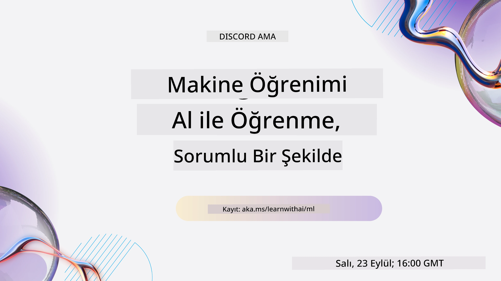
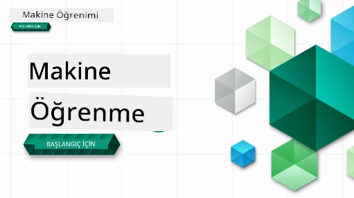

[](https://github.com/microsoft/ML-For-Beginners/blob/master/LICENSE)
[](https://GitHub.com/microsoft/ML-For-Beginners/graphs/contributors/)
[](https://GitHub.com/microsoft/ML-For-Beginners/issues/)
[](https://GitHub.com/microsoft/ML-For-Beginners/pulls/)
[](http://makeapullrequest.com)

[](https://GitHub.com/microsoft/ML-For-Beginners/watchers/)
[](https://GitHub.com/microsoft/ML-For-Beginners/network/)
[](https://GitHub.com/microsoft/ML-For-Beginners/stargazers/)

### 🌐 Çok Dilli Destek

#### GitHub Action ile Desteklenmektedir (Otomatik ve Her Zaman Güncel)

<!-- CO-OP TRANSLATOR LANGUAGES TABLE START -->
[Arapça](../ar/README.md) | [Bengalce](../bn/README.md) | [Bulgarca](../bg/README.md) | [Birmanca (Myanmar)](../my/README.md) | [Çince (Basitleştirilmiş)](../zh-CN/README.md) | [Çince (Geleneksel, Hong Kong)](../zh-HK/README.md) | [Çince (Geleneksel, Makao)](../zh-MO/README.md) | [Çince (Geleneksel, Tayvan)](../zh-TW/README.md) | [Hırvatça](../hr/README.md) | [Çekçe](../cs/README.md) | [Danca](../da/README.md) | [Flemenkçe](../nl/README.md) | [Estonca](../et/README.md) | [Fince](../fi/README.md) | [Fransızca](../fr/README.md) | [Almanca](../de/README.md) | [Yunanca](../el/README.md) | [İbranice](../he/README.md) | [Hintçe](../hi/README.md) | [Macarca](../hu/README.md) | [Endonezce](../id/README.md) | [İtalyanca](../it/README.md) | [Japonca](../ja/README.md) | [Kannada](../kn/README.md) | [Khmer](../km/README.md) | [Korece](../ko/README.md) | [Litvanca](../lt/README.md) | [Malayca](../ms/README.md) | [Malayalamca](../ml/README.md) | [Marathi](../mr/README.md) | [Nepalce](../ne/README.md) | [Nijerya Pidgin](../pcm/README.md) | [Norveççe](../no/README.md) | [Farsça (Persçe)](../fa/README.md) | [Lehçe](../pl/README.md) | [Portekizce (Brezilya)](../pt-BR/README.md) | [Portekizce (Portekiz)](../pt-PT/README.md) | [Pencapça (Gurmukhi)](../pa/README.md) | [Romence](../ro/README.md) | [Rusça](../ru/README.md) | [Sırpça (Kiril)](../sr/README.md) | [Slovakça](../sk/README.md) | [Slovence](../sl/README.md) | [İspanyolca](../es/README.md) | [Svahili](../sw/README.md) | [İsveççe](../sv/README.md) | [Tagalog (Filipince)](../tl/README.md) | [Tamilce](../ta/README.md) | [Telugu](../te/README.md) | [Tayca](../th/README.md) | [Türkçe](./README.md) | [Ukraynaca](../uk/README.md) | [Urduca](../ur/README.md) | [Vietnamca](../vi/README.md)

> **Yerel olarak klonlamayı mı tercih edersiniz?**
>
> Bu depo, indirme boyutunu önemli ölçüde artıran 50'den fazla dil çevirisi içerir. Çeviriler olmadan klonlamak için seyrek checkout kullanın:
>
> **Bash / macOS / Linux:**
> ```bash
> git clone --filter=blob:none --sparse https://github.com/microsoft/ML-For-Beginners.git
> cd ML-For-Beginners
> git sparse-checkout set --no-cone '/*' '!translations' '!translated_images'
> ```
>
> **CMD (Windows):**
> ```cmd
> git clone --filter=blob:none --sparse https://github.com/microsoft/ML-For-Beginners.git
> cd ML-For-Beginners
> git sparse-checkout set --no-cone "/*" "!translations" "!translated_images"
> ```
>
> Bu, kursu çok daha hızlı bir indirme ile tamamlamanız için ihtiyacınız olan her şeyi sağlar.
<!-- CO-OP TRANSLATOR LANGUAGES TABLE END -->

#### Topluluğumuza Katılın

[](https://discord.gg/nTYy5BXMWG)

Eylül 18 - 30, 2025 tarihleri arasında süren AI ile öğrenme serimiz var. Daha fazla bilgi edinip bize [AI ile Öğrenme Serisi](https://aka.ms/learnwithai/discord)'nden katılabilirsiniz. Veri Bilimi için GitHub Copilot kullanımı hakkında ipuçları ve püf noktaları alacaksınız.



# Yeni Başlayanlar İçin Makine Öğrenmesi - Bir Müfredat

> 🌍 Dünyanın kültürleri aracılığıyla Makine Öğrenmesini keşfederken dünyayı gezin 🌍

Microsoft'taki Cloud Advocates, **Makine Öğrenmesi** hakkında 12 haftalık, 26 derslik bir müfredat sunmaktan mutluluk duyar. Bu müfredatta, esas olarak Scikit-learn kütüphanesini kullanarak bazen **klasik makine öğrenmesi** denilen şeyi öğreneceksiniz ve derin öğrenmeyi, [Yeni Başlayanlar için AI müfredatımızda](https://aka.ms/ai4beginners) ele alacağız. Bu dersleri ['Yeni Başlayanlar için Veri Bilimi müfredatıyla'](https://aka.ms/ds4beginners) da eşleştirmeniz önerilir.

Dünyanın birçok bölgesinden verilere bu klasik teknikleri uygularken bizimle seyahat edin. Her ders, ders öncesi ve sonrası quizler, dersi tamamlamak için yazılı talimatlar, bir çözüm, bir görev ve daha fazlasını içerir. Proje tabanlı öğretim metodolojimiz, öğrenirken yaratmanızı sağlar, yeni becerilerin kalıcı olmasının kanıtlanmış bir yoludur.

**✍️ Yazarlara içten teşekkürlerimiz** Jen Looper, Stephen Howell, Francesca Lazzeri, Tomomi Imura, Cassie Breviu, Dmitry Soshnikov, Chris Noring, Anirban Mukherjee, Ornella Altunyan, Ruth Yakubu ve Amy Boyd

**🎨 İllüstratörlere teşekkürlerimiz** Tomomi Imura, Dasani Madipalli ve Jen Looper

**🙏 Microsoft Öğrenci Elçisi yazarlarımıza, gözden geçirenlerimize ve içerik katkıcılarımıza özel teşekkürlerimiz**, özellikle Rishit Dagli, Muhammad Sakib Khan Inan, Rohan Raj, Alexandru Petrescu, Abhishek Jaiswal, Nawrin Tabassum, Ioan Samuila ve Snigdha Agarwal

**🤩 R derslerimiz için Microsoft Öğrenci Elçileri Eric Wanjau, Jasleen Sondhi ve Vidushi Gupta'ya ekstra teşekkürler!**

# Başlarken

Bu adımları izleyin:
1. **Depoyu çatalla**: Bu sayfanın sağ üst köşesindeki "Fork" butonuna tıklayın.
2. **Depoyu klonla**:   `git clone https://github.com/microsoft/ML-For-Beginners.git`

> 💡 **Hızlı Başlangıç İpucu:** Python'u yerel olarak kurmadan tarayıcıda başlamak ister misiniz? Çatallanmış deponuz için bir bulut geliştirme ortamı oluşturmak amacıyla [GitHub Codespaces](https://github.com/features/codespaces) kullanın. Yeşil **Code** menüsünü açın, **Codespaces**'i seçin ve bir codespace oluşturun; gerektiğinde her dersin gereken bağımlılıklarını içinde kurun.

> [Bu kurs için tüm ek kaynakları Microsoft Learn koleksiyonumuzda bulun](https://learn.microsoft.com/en-us/collections/qrqzamz1nn2wx3?WT.mc_id=academic-77952-bethanycheum)

> 🔧 **Yardıma mı ihtiyacınız var?** Yaygın kurulum, ayar ve ders çalıştırma sorunlarına çözümler için [Sorun Giderme Kılavuzumuza](TROUBLESHOOTING.md) bakın.


**[Öğrenciler](https://aka.ms/student-page)**, bu müfredatı kullanmak için tüm depoyu GitHub hesabınıza çatallayın ve alıştırmaları kendi başınıza veya bir grupla tamamlayın:

- Ders öncesi sınavla başlayın.
- Dersi okuyun ve faaliyetleri tamamlayın, her bilgi kontrolünde durup düşünün.
- Çözümlerin kodunu çalıştırmak yerine dersleri anlayarak projeleri oluşturmaya çalışın; ancak bu kodlar her proje odaklı dersin `/solution` klasöründe mevcuttur.
- Ders sonrası sınavı yapın.
- Meydan okumayı tamamlayın.
- Ödevi tamamlayın.
- Bir ders grubunu tamamladıktan sonra, [Tartışma Panelini](https://github.com/microsoft/ML-For-Beginners/discussions) ziyaret edin ve uygun PAT rubriğini doldurarak "açıkça öğrenin". Bir 'PAT', öğreniminizi ilerletmek için doldurduğunuz bir Değerlendirme Aracı rubriğidir. Ayrıca diğer PAT'lere tepki vererek birlikte öğrenebiliriz.

> Daha ileri çalışmalar için bu [Microsoft Learn](https://docs.microsoft.com/en-us/users/jenlooper-2911/collections/k7o7tg1gp306q4?WT.mc_id=academic-77952-leestott) modüllerini ve öğrenme yollarını takip etmenizi öneririz.

**Öğretmenler**, bu müfredatı nasıl kullanacağınızla ilgili [bazı öneriler ekledik](for-teachers.md).

---

## Video anlatımları

Bazı dersler kısa biçimli video olarak mevcuttur. Tüm bunları derslerin içinde ya da aşağıdaki görsele tıklayarak [Microsoft Developer YouTube kanalındaki ML for Beginners oynatma listesinde](https://aka.ms/ml-beginners-videos) bulabilirsiniz.

[](https://aka.ms/ml-beginners-videos)

---

## Takımla Tanışın

[](https://youtu.be/Tj1XWrDSYJU)

**Gif oluşturucu** [Mohit Jaisal](https://linkedin.com/in/mohitjaisal)

> 🎥 Proje ve yaratan kişiler hakkında bir video için yukarıdaki görsele tıklayın!

---

## Pedagoji

Bu müfredatı oluştururken iki pedagoji ilkesi seçtik: uygulamalı ve **proje tabanlı** olması ve **sık quizler** içermesi. Ayrıca, bu müfredatın tutarlılık sağlaması için ortak bir **tema** içermesi.

İçeriğin projelerle uyumlu olmasını sağlayarak süreç öğrenciler için daha ilgi çekici hale getirilir ve kavramların kalıcılığı artırılır. Ayrıca, dersten önceki düşük riskli bir quiz öğrencinin öğrenme niyetini belirlerken, dersten sonra yapılan ikinci bir quiz daha fazla kalıcılığı sağlar. Bu müfredat esnek ve eğlenceli olacak şekilde tasarlandı ve tamamen veya kısmen alınabilir. Projeler küçük başlar ve 12 haftalık döngünün sonunda giderek daha karmaşık hale gelir. Bu müfredat ayrıca, ek kredi olarak veya tartışma temeli olarak kullanılabilecek gerçek dünya ML uygulamaları hakkında bir epilog içerir.

> [Davranış Kuralları](CODE_OF_CONDUCT.md), [Katkı Sağlama](CONTRIBUTING.md), [Çeviriler](..) ve [Sorun Giderme](TROUBLESHOOTING.md) yönergelerimizi bulun. Yapıcı geri bildirimlerinizi bekliyoruz!

## Her ders şunları içerir

- isteğe bağlı çizim notu
- isteğe bağlı destekleyici video
- video anlatımı (yalnızca bazı dersler)
- [ders öncesi ısınma quizi](https://ff-quizzes.netlify.app/en/ml/)
- yazılı ders
- proje tabanlı derslerde, projeyi adım adım nasıl inşa edeceğinize dair rehberler
- bilgi kontrolleri
- meydan okuma
- destekleyici okuma
- ödev
- [ders sonrası quiz](https://ff-quizzes.netlify.app/en/ml/)

> **Diller hakkında bir not**: Bu dersler öncelikle Python ile yazılmıştır, ancak birçok ders R dilinde de mevcuttur. Bir R dersini tamamlamak için `/solution` klasörüne gidin ve R derslerini arayın. Bunlar, `kod parçacıkları` (R veya diğer diller) ile `Çıktıların nasıl biçimlendirileceğini yönlendiren YAML başlığı` içeren **R Markdown** dosyası anlamına gelen .rmd uzantılıdır. Bu nedenle, kodunuzu, çıktısını ve düşüncelerinizi Markdown içinde yazmanıza olanak tanıyarak veri bilimi için örnek bir yazar frameworkü işlevi görür. Ayrıca, R Markdown belgeleri PDF, HTML veya Word gibi çıktı formatlarına dönüştürülebilir.

> **Quizler hakkında bir not**: Tüm quizler, her biri üç sorudan oluşan toplam 52 quiz için [Quiz Uygulaması klasöründe](../../quiz-app) bulunur. Dersler içinde bağlantılıdırlar ancak quiz uygulaması yerel olarak çalıştırılabilir; yerel olarak barındırmak veya Azure'a dağıtmak için `quiz-app` klasöründeki talimatları izleyin.

| Ders Numarası |                             Konu                               |                   Ders Grubu                   | Öğrenme Hedefleri                                                                                                                |                                                              Bağlı Ders                                                                |                        Yazar                        |
| :-----------: | :------------------------------------------------------------: | :-------------------------------------------------: | ------------------------------------------------------------------------------------------------------------------------------- | :--------------------------------------------------------------------------------------------------------------------------------------: | :--------------------------------------------------: |
|      01       |                Makine öğrenimine giriş                |      [Introduction](1-Introduction/README.md)       | Makine öğrenmesinin temel kavramlarını öğrenin                                                                                |                                             [Lesson](1-Introduction/1-intro-to-ML/README.md)                                             |                       Muhammad                       |
|      02       |                Makine öğrenmesinin tarihi                 |      [Introduction](1-Introduction/README.md)       | Bu alanın temel tarihini öğrenin                                                                                         |                                            [Lesson](1-Introduction/2-history-of-ML/README.md)                                            |                     Jen ve Amy                      |
|      03       |                 Adalet ve makine öğrenmesi                  |      [Introduction](1-Introduction/README.md)       | Öğrencilerin ML modellerini oluştururken ve uygularken göz önünde bulundurması gereken adaletle ilgili önemli felsefi meseleler nelerdir? |                                              [Lesson](1-Introduction/3-fairness/README.md)                                               |                        Tomomi                        |
|      04       |                Makine öğrenmesi teknikleri                 |      [Introduction](1-Introduction/README.md)       | ML araştırmacılarının ML modelleri oluşturmak için kullandığı teknikler nelerdir?                                                                       |                                          [Lesson](1-Introduction/4-techniques-of-ML/README.md)                                           |                    Chris ve Jen                     |
|      05       |                   Regresyona giriş                   |        [Regression](2-Regression/README.md)         | Regresyon modelleri için Python ve Scikit-learn ile başlayın                                                                  |         [Python](2-Regression/1-Tools/README.md) • [R](../../2-Regression/1-Tools/solution/R/lesson_1.html)         |      Jen • Eric Wanjau       |
|      06       |                Kuzey Amerika kabak fiyatları 🎃                |        [Regression](2-Regression/README.md)         | ML hazırlığı için verileri görselleştirin ve temizleyin                                                                                  |          [Python](2-Regression/2-Data/README.md) • [R](../../2-Regression/2-Data/solution/R/lesson_2.html)          |      Jen • Eric Wanjau       |
|      07       |                Kuzey Amerika kabak fiyatları 🎃                |        [Regression](2-Regression/README.md)         | Doğrusal ve polinom regresyon modelleri oluşturun                                                                                   |        [Python](2-Regression/3-Linear/README.md) • [R](../../2-Regression/3-Linear/solution/R/lesson_3.html)        |      Jen ve Dmitry • Eric Wanjau       |
|      08       |                Kuzey Amerika kabak fiyatları 🎃                |        [Regression](2-Regression/README.md)         | Lojistik regresyon modeli oluşturun                                                                                               |     [Python](2-Regression/4-Logistic/README.md) • [R](../../2-Regression/4-Logistic/solution/R/lesson_4.html)      |      Jen • Eric Wanjau       |
|      09       |                          Bir Web Uygulaması 🔌                          |           [Web App](3-Web-App/README.md)            | Eğittiğiniz modeli kullanmak için bir web uygulaması oluşturun                                                                                       |                                                 [Python](3-Web-App/1-Web-App/README.md)                                                  |                         Jen                          |
|      10       |                 Sınıflandırmaya giriş                 |    [Classification](4-Classification/README.md)     | Verilerinizi temizleyin, hazırlayın ve görselleştirin; sınıflandırmaya giriş                                                            | [Python](4-Classification/1-Introduction/README.md) • [R](../../4-Classification/1-Introduction/solution/R/lesson_10.html)  | Jen ve Cassie • Eric Wanjau |
|      11       |             Lezzetli Asya ve Hint mutfakları 🍜             |    [Classification](4-Classification/README.md)     | Sınıflandırıcılara giriş                                                                                                     | [Python](4-Classification/2-Classifiers-1/README.md) • [R](../../4-Classification/2-Classifiers-1/solution/R/lesson_11.html) | Jen ve Cassie • Eric Wanjau |
|      12       |             Lezzetli Asya ve Hint mutfakları 🍜             |    [Classification](4-Classification/README.md)     | Daha fazla sınıflandırıcı                                                                                                                | [Python](4-Classification/3-Classifiers-2/README.md) • [R](../../4-Classification/3-Classifiers-2/solution/R/lesson_12.html) | Jen ve Cassie • Eric Wanjau |
|      13       |             Lezzetli Asya ve Hint mutfakları 🍜             |    [Classification](4-Classification/README.md)     | Modelinizi kullanarak tavsiye eden bir web uygulaması oluşturun                                                                                    |                                              [Python](4-Classification/4-Applied/README.md)                                              |                         Jen                          |
|      14       |                   Kümelenmeye giriş                   |        [Clustering](5-Clustering/README.md)         | Verilerinizi temizleyin, hazırlayın ve görselleştirin; kümelenmeye giriş                                                                |         [Python](5-Clustering/1-Visualize/README.md) • [R](../../5-Clustering/1-Visualize/solution/R/lesson_14.html)         |      Jen • Eric Wanjau       |
|      15       |              Nijerya Müzik Zevklerini Keşfetmek 🎧              |        [Clustering](5-Clustering/README.md)         | K-Means kümeleme yöntemini keşfedin                                                                                           |           [Python](5-Clustering/2-K-Means/README.md) • [R](../../5-Clustering/2-K-Means/solution/R/lesson_15.html)           |      Jen • Eric Wanjau       |
|      16       |        Doğal dil işleme giriş ☕️         |   [Natural language processing](6-NLP/README.md)    | Basit bir bot oluşturarak NLP temel bilgilerini öğrenin                                                                             |                                             [Python](6-NLP/1-Introduction-to-NLP/README.md)                                              |                       Stephen                        |
|      17       |                      Yaygın NLP Görevleri ☕️                      |   [Natural language processing](6-NLP/README.md)    | Dil yapılarıyla uğraşırken gereken yaygın görevleri anlayarak NLP bilginizi derinleştirin                          |                                                    [Python](6-NLP/2-Tasks/README.md)                                                     |                       Stephen                        |
|      18       |             Çeviri ve duygu analizi ♥️              |   [Natural language processing](6-NLP/README.md)    | Jane Austen ile çeviri ve duygu analizi                                                                             |                                            [Python](6-NLP/3-Translation-Sentiment/README.md)                                             |                       Stephen                        |
|      19       |                  Avrupa'nın romantik otelleri ♥️                  |   [Natural language processing](6-NLP/README.md)    | Otel yorumlarıyla duygu analizi 1                                                                                         |                                               [Python](6-NLP/4-Hotel-Reviews-1/README.md)                                                |                       Stephen                        |
|      20       |                  Avrupa'nın romantik otelleri ♥️                  |   [Natural language processing](6-NLP/README.md)    | Otel yorumlarıyla duygu analizi 2                                                                                         |                                               [Python](6-NLP/5-Hotel-Reviews-2/README.md)                                                |                       Stephen                        |
|      21       |            Zaman serisi tahminine giriş             |        [Time series](7-TimeSeries/README.md)        | Zaman serisi tahminine giriş                                                                                         |                                             [Python](7-TimeSeries/1-Introduction/README.md)                                              |                      Francesca                       |
|      22       | ⚡️ Dünya Enerji Kullanımı ⚡️ - ARIMA ile zaman serisi tahmini |        [Time series](7-TimeSeries/README.md)        | ARIMA ile zaman serisi tahmini                                                                                              |                                                 [Python](7-TimeSeries/2-ARIMA/README.md)                                                 |                      Francesca                       |
|      23       |  ⚡️ Dünya Enerji Kullanımı ⚡️ - SVR ile zaman serisi tahmini  |        [Time series](7-TimeSeries/README.md)        | Destek Vektör Regresörü ile zaman serisi tahmini                                                                           |                                                  [Python](7-TimeSeries/3-SVR/README.md)                                                  |                       Anirban                        |
|      24       |             Takviyeli öğrenmeye giriş             | [Reinforcement learning](8-Reinforcement/README.md) | Q-Öğrenmesi ile takviyeli öğrenmeye giriş                                                                          |                                             [Python](8-Reinforcement/1-QLearning/README.md)                                              |                        Dmitry                        |
|      25       |                 Peter'ın kurttan kaçmasına yardım et! 🐺                  | [Reinforcement learning](8-Reinforcement/README.md) | Takviyeli öğrenme Gym                                                                                                      |                                                [Python](8-Reinforcement/2-Gym/README.md)                                                 |                        Dmitry                        |
|  Son Söz   |            Gerçek dünyada ML senaryoları ve uygulamaları            |      [ML in the Wild](9-Real-World/README.md)       | Klasik ML'nin ilginç ve aydınlatıcı gerçek dünya uygulamaları                                                               |                                             [Lesson](9-Real-World/1-Applications/README.md)                                              |                         Takım                         |
|  Son Söz   |            RAI gösterge paneli kullanarak ML model hata ayıklama            |      [ML in the Wild](9-Real-World/README.md)       | Sorumlu AI gösterge paneli bileşenleri kullanarak Makine Öğrenmesinde Model Hata Ayıklama                                                              |                                             [Lesson](9-Real-World/2-Debugging-ML-Models/README.md)                                              |                     Ruth Yakubu                      |

> [bu kurs için tüm ek kaynakları Microsoft Learn koleksiyonumuzda bulun](https://learn.microsoft.com/en-us/collections/qrqzamz1nn2wx3?WT.mc_id=academic-77952-bethanycheum)

## Çevrimdışı erişim

Bu dökümantasyonu [Docsify](https://docsify.js.org/#/) kullanarak çevrimdışı çalıştırabilirsiniz. Bu depoyu çatallayın, kendi makinenize [Docsify yükleyin](https://docsify.js.org/#/quickstart) ve sonra bu deponun kök klasöründe `docsify serve` yazın. Web sitesi localhost:3000 portunda sunulacaktır: `localhost:3000`.

## PDF'ler

Kaynak bağlantılarıyla müfredatın pdf'sine [buradan](https://microsoft.github.io/ML-For-Beginners/pdf/readme.pdf) ulaşabilirsiniz.


## 🎒 Diğer Kurslar 

Ekibimiz başka kurslar da üretiyor! Göz atın:

<!-- CO-OP TRANSLATOR OTHER COURSES START -->
### LangChain
[](https://aka.ms/langchain4j-for-beginners)
[](https://aka.ms/langchainjs-for-beginners?WT.mc_id=m365-94501-dwahlin)
[](https://github.com/microsoft/langchain-for-beginners?WT.mc_id=m365-94501-dwahlin)
---

### Azure / Edge / MCP / Ajanlar
[](https://github.com/microsoft/AZD-for-beginners?WT.mc_id=academic-105485-koreyst)
[](https://github.com/microsoft/edgeai-for-beginners?WT.mc_id=academic-105485-koreyst)
[](https://github.com/microsoft/mcp-for-beginners?WT.mc_id=academic-105485-koreyst)
[](https://github.com/microsoft/ai-agents-for-beginners?WT.mc_id=academic-105485-koreyst)

---
 
### Üretken AI Serisi
[](https://github.com/microsoft/generative-ai-for-beginners?WT.mc_id=academic-105485-koreyst)
[-9333EA?style=for-the-badge&labelColor=E5E7EB&color=9333EA)](https://github.com/microsoft/Generative-AI-for-beginners-dotnet?WT.mc_id=academic-105485-koreyst)
[-C084FC?style=for-the-badge&labelColor=E5E7EB&color=C084FC)](https://github.com/microsoft/generative-ai-for-beginners-java?WT.mc_id=academic-105485-koreyst)
[-E879F9?style=for-the-badge&labelColor=E5E7EB&color=E879F9)](https://github.com/microsoft/generative-ai-with-javascript?WT.mc_id=academic-105485-koreyst)

---
 
### Temel Öğrenme
[](https://aka.ms/ml-beginners?WT.mc_id=academic-105485-koreyst)
[](https://aka.ms/datascience-beginners?WT.mc_id=academic-105485-koreyst)
[](https://aka.ms/ai-beginners?WT.mc_id=academic-105485-koreyst)
[](https://github.com/microsoft/Security-101?WT.mc_id=academic-96948-sayoung)
[](https://aka.ms/webdev-beginners?WT.mc_id=academic-105485-koreyst)
[](https://aka.ms/iot-beginners?WT.mc_id=academic-105485-koreyst)
[](https://github.com/microsoft/xr-development-for-beginners?WT.mc_id=academic-105485-koreyst)

---
 
### Copilot Serisi
[](https://aka.ms/GitHubCopilotAI?WT.mc_id=academic-105485-koreyst)
[](https://github.com/microsoft/mastering-github-copilot-for-dotnet-csharp-developers?WT.mc_id=academic-105485-koreyst)
[](https://github.com/microsoft/CopilotAdventures?WT.mc_id=academic-105485-koreyst)
<!-- CO-OP TRANSLATOR OTHER COURSES END -->

## Yardım Alma

Makine Öğrenmesi öğrenirken ya da AI uygulamaları oluştururken takılırsanız veya sorularınız olursa endişelenmeyin — yardım mevcut.

Diğer öğrenenler ve geliştiricilerle tartışmalara katılabilir, sorular sorabilir ve toplulukla fikirlerinizi paylaşabilirsiniz.

- Sorular sormak ve diğerleriyle öğrenmek için topluluğa katılın
- Makine Öğrenmesi kavramlarını ve proje fikirlerini tartışın
- Deneyimli geliştiricilerden rehberlik alın

Destekleyici bir topluluk becerilerinizi geliştirmek ve sorunları daha hızlı çözmek için harika bir yoldur.

[Microsoft Foundry Discord Topluluğu](https://discord.gg/nTYy5BXMWG)

Eğer hatalar, sorunlar yaşarsanız veya geliştirme önerileriniz olursa, bu depoda problemi bildirmek için bir **Issue** açabilirsiniz.

Ürün geri bildirimi için veya mevcut topluluk gönderilerini aramak için Geliştirici Forumu’nu ziyaret edin:

[](https://aka.ms/foundry/forum)

## Ek Öğrenme İpuçları

- Daha iyi anlamak için her dersten sonra not defterlerini gözden geçirin.
- Algoritmaları kendiniz uygulayarak pratik yapın.
- Öğrenilen kavramları kullanarak gerçek dünya veri setlerini keşfedin.

---

<!-- CO-OP TRANSLATOR DISCLAIMER START -->
**Feragatname**:
Bu belge, AI çeviri hizmeti [Co-op Translator](https://github.com/Azure/co-op-translator) kullanılarak çevrilmiştir. Doğruluk için çaba sarf etsek de, otomatik çevirilerin hata veya yanlışlık içerebileceğini lütfen unutmayınız. Orijinal belge, kendi dilinde yetkili kaynak olarak kabul edilmelidir. Kritik bilgiler için profesyonel insan çevirisi önerilir. Bu çevirinin kullanımı sonucu ortaya çıkabilecek yanlış anlamalardan veya yanlış yorumlamalardan sorumlu değiliz.
<!-- CO-OP TRANSLATOR DISCLAIMER END -->