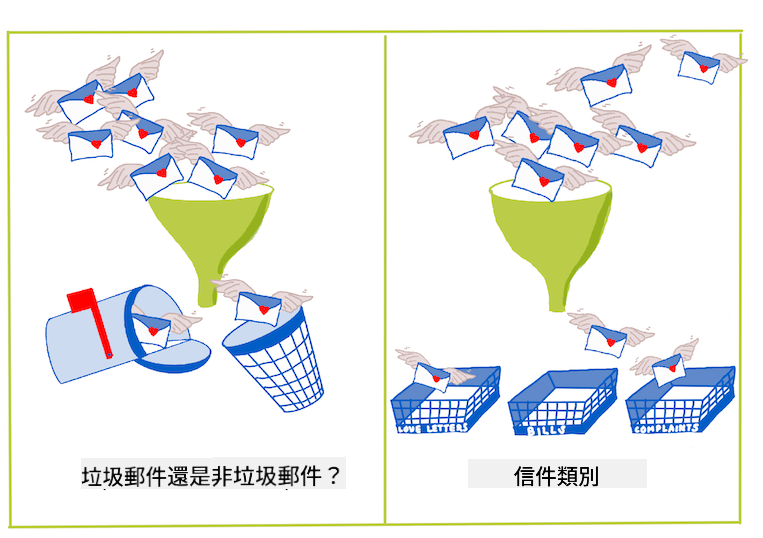
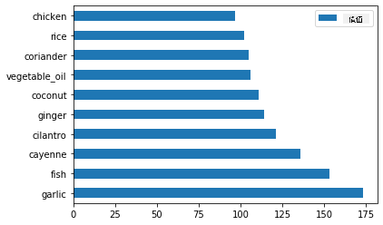
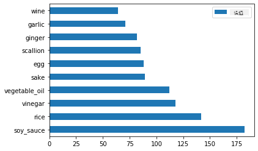
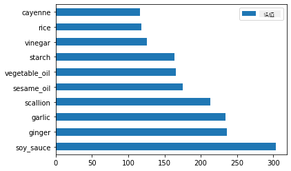
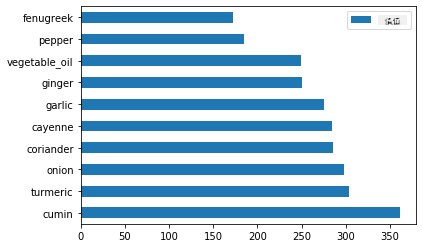
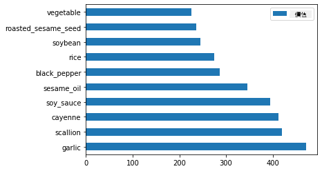

<!--
CO_OP_TRANSLATOR_METADATA:
{
  "original_hash": "76438ce4e5d48982d48f1b55c981caac",
  "translation_date": "2025-09-03T18:15:01+00:00",
  "source_file": "4-Classification/1-Introduction/README.md",
  "language_code": "tw"
}
-->
# 分類簡介

在這四節課中，你將探索經典機器學習的一個核心主題——_分類_。我們將使用一個關於亞洲和印度美食的數據集，逐步學習如何使用各種分類算法。希望你已經準備好大快朵頤了！


> 在這些課程中一起慶祝泛亞洲美食吧！圖片來源：[Jen Looper](https://twitter.com/jenlooper)

分類是一種[監督式學習](https://wikipedia.org/wiki/Supervised_learning)，與回歸技術有許多相似之處。如果機器學習的核心是通過數據集來預測值或名稱，那麼分類通常分為兩類：_二元分類_和_多類分類_。

[](https://youtu.be/eg8DJYwdMyg "分類簡介")

> 🎥 點擊上方圖片觀看影片：麻省理工學院的 John Guttag 介紹分類

請記住：

- **線性回歸** 幫助你預測變量之間的關係，並準確預測新數據點在該線上的位置。例如，你可以預測 _南瓜在九月和十二月的價格_。
- **邏輯回歸** 幫助你發現「二元類別」：在這個價格點上，_這個南瓜是橙色還是不是橙色_？

分類使用各種算法來確定數據點的標籤或類別。讓我們使用這個美食數據集，看看是否可以通過觀察一組食材來確定其來源的美食類型。

## [課前測驗](https://gray-sand-07a10f403.1.azurestaticapps.net/quiz/19/)

> ### [本課程提供 R 語言版本！](../../../../4-Classification/1-Introduction/solution/R/lesson_10.html)

### 簡介

分類是機器學習研究者和數據科學家的一項基本活動。從基本的二元值分類（「這封郵件是垃圾郵件還是不是？」）到使用計算機視覺進行的複雜圖像分類和分割，能夠將數據分成類別並對其進行分析總是很有用。

用更科學的方式來描述，分類方法創建了一個預測模型，使你能夠將輸入變量與輸出變量之間的關係映射起來。



> 二元分類與多類分類問題的處理方式。信息圖來源：[Jen Looper](https://twitter.com/jenlooper)

在開始清理數據、可視化數據並為機器學習任務做準備之前，讓我們先了解一下機器學習如何用於分類數據。

分類源於[統計學](https://wikipedia.org/wiki/Statistical_classification)，使用經典機器學習進行分類時，會利用特徵（例如 `smoker`、`weight` 和 `age`）來確定_患某種疾病的可能性_。作為一種與之前進行的回歸練習類似的監督式學習技術，你的數據是帶標籤的，機器學習算法使用這些標籤來分類和預測數據集的類別（或「特徵」），並將其分配到某個組或結果中。

✅ 花點時間想像一個關於美食的數據集。一個多類模型能回答什麼問題？一個二元模型能回答什麼問題？如果你想確定某種美食是否可能使用葫蘆巴（fenugreek）呢？如果你想知道，當你收到一袋裝滿八角、大洋薊、花椰菜和辣根的雜貨時，是否可以用它們做出一道典型的印度菜呢？

[](https://youtu.be/GuTeDbaNoEU "神秘食材籃")

> 🎥 點擊上方圖片觀看影片。節目《Chopped》的整個主題就是「神秘食材籃」，廚師們必須用隨機選擇的食材做出一道菜。機器學習模型肯定能幫上忙！

## Hello '分類器'

我們想要從這個美食數據集中提出的問題實際上是一個**多類問題**，因為我們有多個潛在的國家美食類別可供選擇。給定一批食材，這些數據會屬於哪一類？

Scikit-learn 提供了多種算法來分類數據，具體取決於你想解決的問題類型。在接下來的兩節課中，你將學習其中幾種算法。

## 練習 - 清理並平衡數據

在開始這個項目之前，第一個任務是清理並**平衡**數據，以獲得更好的結果。從此文件夾根目錄中的空白 _notebook.ipynb_ 文件開始。

首先需要安裝 [imblearn](https://imbalanced-learn.org/stable/)。這是一個 Scikit-learn 的擴展包，可以幫助你更好地平衡數據（稍後你會學到更多關於這項任務的內容）。

1. 要安裝 `imblearn`，運行以下命令：

    ```python
    pip install imblearn
    ```

1. 導入需要的包以導入數據並進行可視化，還需要從 `imblearn` 導入 `SMOTE`。

    ```python
    import pandas as pd
    import matplotlib.pyplot as plt
    import matplotlib as mpl
    import numpy as np
    from imblearn.over_sampling import SMOTE
    ```

    現在你已經準備好導入數據了。

1. 下一步是導入數據：

    ```python
    df  = pd.read_csv('../data/cuisines.csv')
    ```

   使用 `read_csv()` 讀取 _cusines.csv_ 文件的內容，並將其存儲在變量 `df` 中。

1. 檢查數據的形狀：

    ```python
    df.head()
    ```

   前五行看起來像這樣：

    ```output
    |     | Unnamed: 0 | cuisine | almond | angelica | anise | anise_seed | apple | apple_brandy | apricot | armagnac | ... | whiskey | white_bread | white_wine | whole_grain_wheat_flour | wine | wood | yam | yeast | yogurt | zucchini |
    | --- | ---------- | ------- | ------ | -------- | ----- | ---------- | ----- | ------------ | ------- | -------- | --- | ------- | ----------- | ---------- | ----------------------- | ---- | ---- | --- | ----- | ------ | -------- |
    | 0   | 65         | indian  | 0      | 0        | 0     | 0          | 0     | 0            | 0       | 0        | ... | 0       | 0           | 0          | 0                       | 0    | 0    | 0   | 0     | 0      | 0        |
    | 1   | 66         | indian  | 1      | 0        | 0     | 0          | 0     | 0            | 0       | 0        | ... | 0       | 0           | 0          | 0                       | 0    | 0    | 0   | 0     | 0      | 0        |
    | 2   | 67         | indian  | 0      | 0        | 0     | 0          | 0     | 0            | 0       | 0        | ... | 0       | 0           | 0          | 0                       | 0    | 0    | 0   | 0     | 0      | 0        |
    | 3   | 68         | indian  | 0      | 0        | 0     | 0          | 0     | 0            | 0       | 0        | ... | 0       | 0           | 0          | 0                       | 0    | 0    | 0   | 0     | 0      | 0        |
    | 4   | 69         | indian  | 0      | 0        | 0     | 0          | 0     | 0            | 0       | 0        | ... | 0       | 0           | 0          | 0                       | 0    | 0    | 0   | 0     | 1      | 0        |
    ```

1. 通過調用 `info()` 獲取關於數據的信息：

    ```python
    df.info()
    ```

    輸出類似於：

    ```output
    <class 'pandas.core.frame.DataFrame'>
    RangeIndex: 2448 entries, 0 to 2447
    Columns: 385 entries, Unnamed: 0 to zucchini
    dtypes: int64(384), object(1)
    memory usage: 7.2+ MB
    ```

## 練習 - 探索美食數據

現在開始進入更有趣的部分。讓我們發現每種美食的數據分佈情況。

1. 調用 `barh()` 以條形圖形式繪製數據：

    ```python
    df.cuisine.value_counts().plot.barh()
    ```

    

    雖然美食的種類是有限的，但數據分佈並不均勻。你可以解決這個問題！在此之前，先進一步探索。

1. 找出每種美食的數據量並打印出來：

    ```python
    thai_df = df[(df.cuisine == "thai")]
    japanese_df = df[(df.cuisine == "japanese")]
    chinese_df = df[(df.cuisine == "chinese")]
    indian_df = df[(df.cuisine == "indian")]
    korean_df = df[(df.cuisine == "korean")]
    
    print(f'thai df: {thai_df.shape}')
    print(f'japanese df: {japanese_df.shape}')
    print(f'chinese df: {chinese_df.shape}')
    print(f'indian df: {indian_df.shape}')
    print(f'korean df: {korean_df.shape}')
    ```

    輸出如下所示：

    ```output
    thai df: (289, 385)
    japanese df: (320, 385)
    chinese df: (442, 385)
    indian df: (598, 385)
    korean df: (799, 385)
    ```

## 發現食材

現在你可以更深入地挖掘數據，了解每種美食的典型食材。你應該清理掉那些在不同美食之間造成混淆的重複數據，讓我們來了解這個問題。

1. 在 Python 中創建一個函數 `create_ingredient()`，用於創建一個食材數據框。該函數將首先刪除一個無用的列，然後按食材的數量進行排序：

    ```python
    def create_ingredient_df(df):
        ingredient_df = df.T.drop(['cuisine','Unnamed: 0']).sum(axis=1).to_frame('value')
        ingredient_df = ingredient_df[(ingredient_df.T != 0).any()]
        ingredient_df = ingredient_df.sort_values(by='value', ascending=False,
        inplace=False)
        return ingredient_df
    ```

   現在你可以使用該函數來了解每種美食中最受歡迎的前十種食材。

1. 調用 `create_ingredient()` 並使用 `barh()` 繪製圖表：

    ```python
    thai_ingredient_df = create_ingredient_df(thai_df)
    thai_ingredient_df.head(10).plot.barh()
    ```

    

1. 對日本美食數據執行相同操作：

    ```python
    japanese_ingredient_df = create_ingredient_df(japanese_df)
    japanese_ingredient_df.head(10).plot.barh()
    ```

    

1. 接下來是中國美食的食材：

    ```python
    chinese_ingredient_df = create_ingredient_df(chinese_df)
    chinese_ingredient_df.head(10).plot.barh()
    ```

    

1. 繪製印度美食的食材：

    ```python
    indian_ingredient_df = create_ingredient_df(indian_df)
    indian_ingredient_df.head(10).plot.barh()
    ```

    

1. 最後，繪製韓國美食的食材：

    ```python
    korean_ingredient_df = create_ingredient_df(korean_df)
    korean_ingredient_df.head(10).plot.barh()
    ```

    

1. 現在，通過調用 `drop()` 刪除那些在不同美食之間造成混淆的最常見食材：

   每個人都喜歡米飯、大蒜和薑！

    ```python
    feature_df= df.drop(['cuisine','Unnamed: 0','rice','garlic','ginger'], axis=1)
    labels_df = df.cuisine #.unique()
    feature_df.head()
    ```

## 平衡數據集

現在你已經清理了數據，使用 [SMOTE](https://imbalanced-learn.org/dev/references/generated/imblearn.over_sampling.SMOTE.html)（合成少數類別過採樣技術）來平衡數據。

1. 調用 `fit_resample()`，這種策略通過插值生成新樣本。

    ```python
    oversample = SMOTE()
    transformed_feature_df, transformed_label_df = oversample.fit_resample(feature_df, labels_df)
    ```

    通過平衡數據，你在分類時會獲得更好的結果。想像一下二元分類。如果你的大部分數據屬於一個類別，那麼機器學習模型會更頻繁地預測該類別，僅僅因為該類別的數據更多。平衡數據可以消除這種不平衡。

1. 現在你可以檢查每種食材的標籤數量：

    ```python
    print(f'new label count: {transformed_label_df.value_counts()}')
    print(f'old label count: {df.cuisine.value_counts()}')
    ```

    輸出如下所示：

    ```output
    new label count: korean      799
    chinese     799
    indian      799
    japanese    799
    thai        799
    Name: cuisine, dtype: int64
    old label count: korean      799
    indian      598
    chinese     442
    japanese    320
    thai        289
    Name: cuisine, dtype: int64
    ```

    數據現在乾淨、平衡，而且非常誘人！

1. 最後一步是將平衡後的數據（包括標籤和特徵）保存到一個新的數據框中，並導出到文件中：

    ```python
    transformed_df = pd.concat([transformed_label_df,transformed_feature_df],axis=1, join='outer')
    ```

1. 你可以使用 `transformed_df.head()` 和 `transformed_df.info()` 再次查看數據。保存這份數據以便在未來的課程中使用：

    ```python
    transformed_df.head()
    transformed_df.info()
    transformed_df.to_csv("../data/cleaned_cuisines.csv")
    ```

    這份新的 CSV 文件現在可以在根數據文件夾中找到。

---

## 🚀挑戰

本課程包含多個有趣的數據集。瀏覽 `data` 文件夾，看看是否有適合二元或多類分類的數據集？你會對這些數據集提出什麼問題？

## [課後測驗](https://gray-sand-07a10f403.1.azurestaticapps.net/quiz/20/)

## 回顧與自學

探索 SMOTE 的 API。它最適合用於哪些場景？它解決了哪些問題？

## 作業 

[探索分類方法](assignment.md)

---

**免責聲明**：  
本文件已使用 AI 翻譯服務 [Co-op Translator](https://github.com/Azure/co-op-translator) 進行翻譯。我們致力於提供準確的翻譯，但請注意，自動翻譯可能包含錯誤或不準確之處。原始語言的文件應被視為權威來源。對於重要資訊，建議使用專業人工翻譯。我們對因使用此翻譯而產生的任何誤解或錯誤解釋不承擔責任。