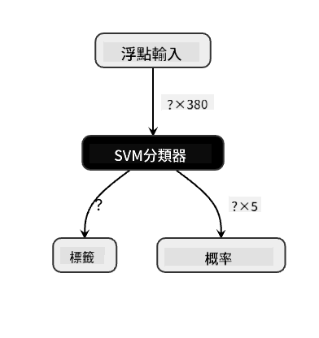
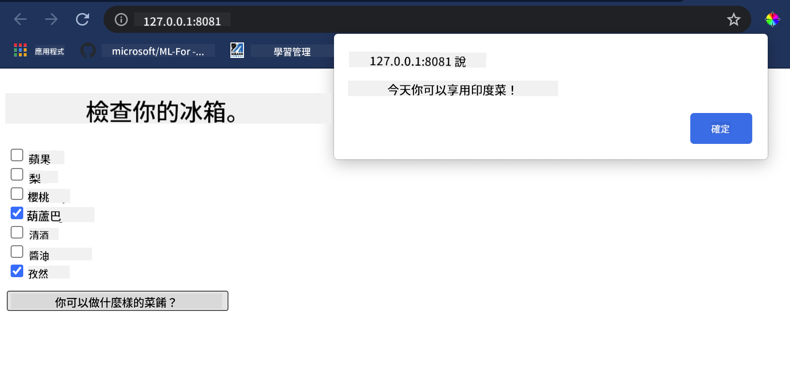

<!--
CO_OP_TRANSLATOR_METADATA:
{
  "original_hash": "ad2cf19d7490247558d20a6a59650d13",
  "translation_date": "2025-09-03T18:08:15+00:00",
  "source_file": "4-Classification/4-Applied/README.md",
  "language_code": "tw"
}
-->
# 建立美食推薦網頁應用程式

在本課程中，您將使用之前課程中學到的一些技術，並利用整個系列中使用的美食數據集，建立一個分類模型。此外，您還將建立一個小型網頁應用程式，使用已保存的模型並利用 Onnx 的網頁執行環境。

機器學習的一個最實用的用途是建立推薦系統，而今天您可以邁出這個方向的第一步！

[](https://youtu.be/17wdM9AHMfg "Applied ML")

> 🎥 點擊上方圖片觀看影片：Jen Looper 使用分類美食數據建立網頁應用程式

## [課前測驗](https://gray-sand-07a10f403.1.azurestaticapps.net/quiz/25/)

在本課程中，您將學到：

- 如何建立模型並將其保存為 Onnx 模型
- 如何使用 Netron 檢查模型
- 如何在網頁應用程式中使用您的模型進行推論

## 建立您的模型

建立應用型機器學習系統是將這些技術應用於業務系統的重要部分。您可以在網頁應用程式中使用模型（因此在需要時也可以在離線環境中使用），方法是使用 Onnx。

在[之前的課程](../../3-Web-App/1-Web-App/README.md)中，您建立了一個關於 UFO 目擊事件的回歸模型，並使用 Flask 應用程式保存了它。雖然這種架構非常有用，但它是一個完整的 Python 應用程式，而您的需求可能包括使用 JavaScript 應用程式。

在本課程中，您可以建立一個基於 JavaScript 的基本推論系統。但首先，您需要訓練一個模型並將其轉換為可與 Onnx 一起使用。

## 練習 - 訓練分類模型

首先，使用我們之前清理過的美食數據集訓練一個分類模型。

1. 首先導入有用的庫：

    ```python
    !pip install skl2onnx
    import pandas as pd 
    ```

    您需要使用 '[skl2onnx](https://onnx.ai/sklearn-onnx/)' 來幫助將 Scikit-learn 模型轉換為 Onnx 格式。

1. 然後，像之前課程中一樣，使用 `read_csv()` 讀取 CSV 文件來處理數據：

    ```python
    data = pd.read_csv('../data/cleaned_cuisines.csv')
    data.head()
    ```

1. 移除前兩列不必要的數據，並將剩餘數據保存為 'X'：

    ```python
    X = data.iloc[:,2:]
    X.head()
    ```

1. 將標籤保存為 'y'：

    ```python
    y = data[['cuisine']]
    y.head()
    
    ```

### 開始訓練流程

我們將使用具有良好準確性的 'SVC' 庫。

1. 從 Scikit-learn 導入適當的庫：

    ```python
    from sklearn.model_selection import train_test_split
    from sklearn.svm import SVC
    from sklearn.model_selection import cross_val_score
    from sklearn.metrics import accuracy_score,precision_score,confusion_matrix,classification_report
    ```

1. 分離訓練集和測試集：

    ```python
    X_train, X_test, y_train, y_test = train_test_split(X,y,test_size=0.3)
    ```

1. 像之前課程中一樣建立一個 SVC 分類模型：

    ```python
    model = SVC(kernel='linear', C=10, probability=True,random_state=0)
    model.fit(X_train,y_train.values.ravel())
    ```

1. 現在，測試您的模型，調用 `predict()`：

    ```python
    y_pred = model.predict(X_test)
    ```

1. 打印分類報告以檢查模型的質量：

    ```python
    print(classification_report(y_test,y_pred))
    ```

    如我們之前所見，準確性很好：

    ```output
                    precision    recall  f1-score   support
    
         chinese       0.72      0.69      0.70       257
          indian       0.91      0.87      0.89       243
        japanese       0.79      0.77      0.78       239
          korean       0.83      0.79      0.81       236
            thai       0.72      0.84      0.78       224
    
        accuracy                           0.79      1199
       macro avg       0.79      0.79      0.79      1199
    weighted avg       0.79      0.79      0.79      1199
    ```

### 將模型轉換為 Onnx

確保使用正確的 Tensor 數進行轉換。此數據集列出了 380 種食材，因此您需要在 `FloatTensorType` 中註明該數字：

1. 使用 380 的 Tensor 數進行轉換。

    ```python
    from skl2onnx import convert_sklearn
    from skl2onnx.common.data_types import FloatTensorType
    
    initial_type = [('float_input', FloatTensorType([None, 380]))]
    options = {id(model): {'nocl': True, 'zipmap': False}}
    ```

1. 創建 onx 並保存為文件 **model.onnx**：

    ```python
    onx = convert_sklearn(model, initial_types=initial_type, options=options)
    with open("./model.onnx", "wb") as f:
        f.write(onx.SerializeToString())
    ```

    > 注意，您可以在轉換腳本中傳入[選項](https://onnx.ai/sklearn-onnx/parameterized.html)。在此案例中，我們將 'nocl' 設為 True，'zipmap' 設為 False。由於這是一個分類模型，您可以選擇移除 ZipMap（它會生成一個字典列表，非必要）。`nocl` 指的是模型中是否包含類別信息。通過將 `nocl` 設為 'True'，可以減少模型的大小。

運行整個筆記本後，將建立一個 Onnx 模型並保存到此文件夾中。

## 查看您的模型

Onnx 模型在 Visual Studio Code 中不太容易查看，但有一個非常好的免費軟體，許多研究人員用來可視化模型以確保其正確構建。下載 [Netron](https://github.com/lutzroeder/Netron) 並打開您的 model.onnx 文件。您可以看到您的簡單模型被可視化，列出了其 380 個輸入和分類器：



Netron 是查看模型的有用工具。

現在您已準備好在網頁應用程式中使用這個簡單的模型。讓我們建立一個應用程式，當您查看冰箱並嘗試找出可以用剩餘食材烹飪的美食時，這個應用程式將非常有用。

## 建立推薦網頁應用程式

您可以直接在網頁應用程式中使用您的模型。此架構還允許您在本地甚至離線運行它。首先，在保存 `model.onnx` 文件的同一文件夾中創建一個 `index.html` 文件。

1. 在此文件 _index.html_ 中，添加以下標記：

    ```html
    <!DOCTYPE html>
    <html>
        <header>
            <title>Cuisine Matcher</title>
        </header>
        <body>
            ...
        </body>
    </html>
    ```

1. 現在，在 `body` 標籤內，添加一些標記以顯示一些食材的複選框列表：

    ```html
    <h1>Check your refrigerator. What can you create?</h1>
            <div id="wrapper">
                <div class="boxCont">
                    <input type="checkbox" value="4" class="checkbox">
                    <label>apple</label>
                </div>
            
                <div class="boxCont">
                    <input type="checkbox" value="247" class="checkbox">
                    <label>pear</label>
                </div>
            
                <div class="boxCont">
                    <input type="checkbox" value="77" class="checkbox">
                    <label>cherry</label>
                </div>
    
                <div class="boxCont">
                    <input type="checkbox" value="126" class="checkbox">
                    <label>fenugreek</label>
                </div>
    
                <div class="boxCont">
                    <input type="checkbox" value="302" class="checkbox">
                    <label>sake</label>
                </div>
    
                <div class="boxCont">
                    <input type="checkbox" value="327" class="checkbox">
                    <label>soy sauce</label>
                </div>
    
                <div class="boxCont">
                    <input type="checkbox" value="112" class="checkbox">
                    <label>cumin</label>
                </div>
            </div>
            <div style="padding-top:10px">
                <button onClick="startInference()">What kind of cuisine can you make?</button>
            </div> 
    ```

    注意，每個複選框都被賦予了一個值。這反映了食材在數據集中所在的索引。例如，蘋果在這個按字母順序排列的列表中佔據第五列，因此其值為 '4'（因為我們從 0 開始計數）。您可以查閱 [ingredients spreadsheet](../../../../4-Classification/data/ingredient_indexes.csv) 來找到某個食材的索引。

    繼續在 index.html 文件中工作，在最後的 `</div>` 標籤後添加一個腳本塊，調用模型。

1. 首先，導入 [Onnx Runtime](https://www.onnxruntime.ai/)：

    ```html
    <script src="https://cdn.jsdelivr.net/npm/onnxruntime-web@1.9.0/dist/ort.min.js"></script> 
    ```

    > Onnx Runtime 用於支持在廣泛的硬體平台上運行您的 Onnx 模型，包括優化和使用的 API。

1. 一旦 Runtime 就緒，您可以調用它：

    ```html
    <script>
        const ingredients = Array(380).fill(0);
        
        const checks = [...document.querySelectorAll('.checkbox')];
        
        checks.forEach(check => {
            check.addEventListener('change', function() {
                // toggle the state of the ingredient
                // based on the checkbox's value (1 or 0)
                ingredients[check.value] = check.checked ? 1 : 0;
            });
        });

        function testCheckboxes() {
            // validate if at least one checkbox is checked
            return checks.some(check => check.checked);
        }

        async function startInference() {

            let atLeastOneChecked = testCheckboxes()

            if (!atLeastOneChecked) {
                alert('Please select at least one ingredient.');
                return;
            }
            try {
                // create a new session and load the model.
                
                const session = await ort.InferenceSession.create('./model.onnx');

                const input = new ort.Tensor(new Float32Array(ingredients), [1, 380]);
                const feeds = { float_input: input };

                // feed inputs and run
                const results = await session.run(feeds);

                // read from results
                alert('You can enjoy ' + results.label.data[0] + ' cuisine today!')

            } catch (e) {
                console.log(`failed to inference ONNX model`);
                console.error(e);
            }
        }
               
    </script>
    ```

在此代碼中，發生了以下幾件事：

1. 您創建了一個包含 380 個可能值（1 或 0）的數組，根據食材複選框是否被選中來設置並發送到模型進行推論。
2. 您創建了一個複選框數組以及一種在應用程式啟動時確定它們是否被選中的方法。在複選框被選中時，`ingredients` 數組會被修改以反映所選食材。
3. 您創建了一個 `testCheckboxes` 函數來檢查是否有任何複選框被選中。
4. 當按下按鈕時，您使用 `startInference` 函數，如果有任何複選框被選中，則開始推論。
5. 推論流程包括：
   1. 設置模型的異步加載
   2. 創建一個 Tensor 結構以發送到模型
   3. 創建 'feeds'，反映您在訓練模型時創建的 `float_input` 輸入（您可以使用 Netron 驗證該名稱）
   4. 將這些 'feeds' 發送到模型並等待響應

## 測試您的應用程式

在 Visual Studio Code 中的終端會話中打開保存 index.html 文件的文件夾。確保您已全局安裝 [http-server](https://www.npmjs.com/package/http-server)，並在提示符下輸入 `http-server`。應會打開一個 localhost，您可以查看您的網頁應用程式。檢查根據各種食材推薦的美食：



恭喜，您已建立了一個具有少量字段的“推薦”網頁應用程式。花些時間擴展此系統！

## 🚀挑戰

您的網頁應用程式非常簡單，因此請繼續使用 [ingredient_indexes](../../../../4-Classification/data/ingredient_indexes.csv) 數據中的食材及其索引來擴展它。哪些口味組合可以創造出特定的國家菜餚？

## [課後測驗](https://gray-sand-07a10f403.1.azurestaticapps.net/quiz/26/)

## 回顧與自學

雖然本課程僅簡單介紹了建立食材推薦系統的實用性，但這一機器學習應用領域有非常豐富的例子。閱讀更多關於這些系統如何建立的內容：

- https://www.sciencedirect.com/topics/computer-science/recommendation-engine
- https://www.technologyreview.com/2014/08/25/171547/the-ultimate-challenge-for-recommendation-engines/
- https://www.technologyreview.com/2015/03/23/168831/everything-is-a-recommendation/

## 作業

[建立一個新的推薦系統](assignment.md)

---

**免責聲明**：  
本文件已使用 AI 翻譯服務 [Co-op Translator](https://github.com/Azure/co-op-translator) 進行翻譯。雖然我們致力於提供準確的翻譯，但請注意，自動翻譯可能包含錯誤或不準確之處。原始文件的母語版本應被視為權威來源。對於關鍵資訊，建議尋求專業人工翻譯。我們對因使用此翻譯而引起的任何誤解或錯誤解釋不承擔責任。