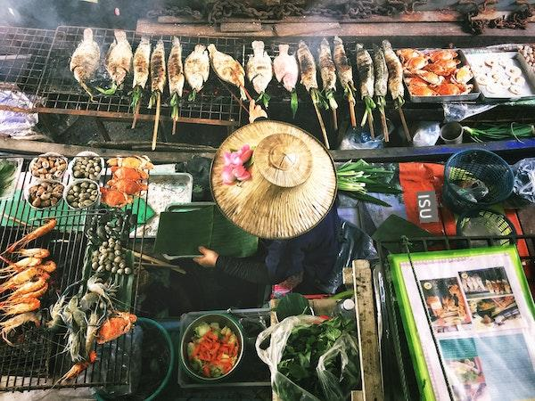

<!--
CO_OP_TRANSLATOR_METADATA:
{
  "original_hash": "74e809ffd1e613a1058bbc3e9600859e",
  "translation_date": "2025-09-03T18:00:07+00:00",
  "source_file": "4-Classification/README.md",
  "language_code": "tw"
}
-->
# 開始學習分類

## 地區主題：美味的亞洲和印度料理 🍜

在亞洲和印度，飲食文化非常多樣化，而且非常美味！讓我們來看看有關地區料理的數據，試著了解它們的食材。

> 照片由 <a href="https://unsplash.com/@changlisheng?utm_source=unsplash&utm_medium=referral&utm_content=creditCopyText">Lisheng Chang</a> 提供，來自 <a href="https://unsplash.com/s/photos/asian-food?utm_source=unsplash&utm_medium=referral&utm_content=creditCopyText">Unsplash</a>
  
## 你將學到什麼

在本章節中，你將基於之前對回歸的學習，進一步了解其他分類器，幫助你更好地理解數據。

> 有一些低代碼工具可以幫助你學習如何使用分類模型。試試 [Azure ML 完成這項任務](https://docs.microsoft.com/learn/modules/create-classification-model-azure-machine-learning-designer/?WT.mc_id=academic-77952-leestott)

## 課程

1. [分類介紹](1-Introduction/README.md)
2. [更多分類器](2-Classifiers-1/README.md)
3. [其他分類器](3-Classifiers-2/README.md)
4. [應用機器學習：建立網頁應用](4-Applied/README.md)

## 致謝

"開始學習分類" 由 [Cassie Breviu](https://www.twitter.com/cassiebreviu) 和 [Jen Looper](https://www.twitter.com/jenlooper) 用 ♥️ 撰寫。

美味料理數據集來源於 [Kaggle](https://www.kaggle.com/hoandan/asian-and-indian-cuisines)。

---

**免責聲明**：  
本文件已使用 AI 翻譯服務 [Co-op Translator](https://github.com/Azure/co-op-translator) 進行翻譯。儘管我們致力於提供準確的翻譯，請注意自動翻譯可能包含錯誤或不準確之處。原始文件的母語版本應被視為權威來源。對於關鍵資訊，建議使用專業人工翻譯。我們對因使用此翻譯而引起的任何誤解或錯誤解釋不承擔責任。