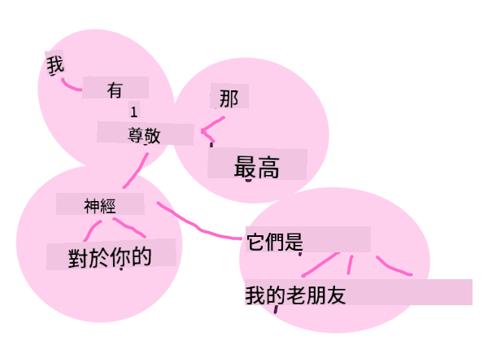

<!--
CO_OP_TRANSLATOR_METADATA:
{
  "original_hash": "6534e145d52a3890590d27be75386e5d",
  "translation_date": "2025-09-03T18:49:14+00:00",
  "source_file": "6-NLP/2-Tasks/README.md",
  "language_code": "tw"
}
-->
# 常見的自然語言處理任務與技術

對於大多數*自然語言處理*任務，待處理的文本必須被分解、檢查，並將結果存儲或與規則和數據集交叉參照。這些任務使程序員能夠推導出文本中的_含義_、_意圖_或僅僅是_詞語的頻率_。

## [課前測驗](https://gray-sand-07a10f403.1.azurestaticapps.net/quiz/33/)

讓我們來探索處理文本時常用的技術。結合機器學習，這些技術可以幫助您高效地分析大量文本。然而，在將機器學習應用於這些任務之前，我們先來了解自然語言處理專家可能遇到的問題。

## 自然語言處理中的常見任務

分析文本的方法有很多種。您可以執行一些任務，通過這些任務來理解文本並得出結論。通常，這些任務是按順序執行的。

### 分詞（Tokenization）

大多數自然語言處理算法的第一步可能是將文本分割成詞元（tokens）或單詞。雖然這聽起來很簡單，但考慮到標點符號以及不同語言的單詞和句子分隔符，這可能會變得很棘手。您可能需要使用多種方法來確定分界點。


> 將**《傲慢與偏見》**中的一句話進行分詞。圖表由 [Jen Looper](https://twitter.com/jenlooper) 製作

### 嵌入（Embeddings）

[詞嵌入](https://wikipedia.org/wiki/Word_embedding) 是將文本數據轉換為數值的一種方式。嵌入的方式使得具有相似含義或經常一起使用的詞語聚集在一起。


> "我對你的神經充滿了最高的敬意，它們是我的老朋友。" - **《傲慢與偏見》**中的一句話的詞嵌入。圖表由 [Jen Looper](https://twitter.com/jenlooper) 製作

✅ 試試[這個有趣的工具](https://projector.tensorflow.org/)，用來實驗詞嵌入。點擊一個詞可以顯示與之相似的詞的聚類，例如：'toy' 與 'disney'、'lego'、'playstation' 和 'console' 聚類在一起。

### 句法分析與詞性標註（Parsing & Part-of-speech Tagging）

每個被分詞的單詞都可以被標註為詞性，例如名詞、動詞或形容詞。句子 `the quick red fox jumped over the lazy brown dog` 的詞性標註可能是：fox = 名詞，jumped = 動詞。


> 對**《傲慢與偏見》**中的一句話進行句法分析。圖表由 [Jen Looper](https://twitter.com/jenlooper) 製作

句法分析是識別句子中哪些詞語彼此相關，例如 `the quick red fox jumped` 是一個形容詞-名詞-動詞序列，與 `lazy brown dog` 序列是分開的。

### 詞語和短語頻率

在分析大量文本時，一個有用的步驟是建立一個字典，記錄每個感興趣的詞語或短語及其出現的頻率。例如，短語 `the quick red fox jumped over the lazy brown dog` 中，詞語 `the` 的頻率為 2。

讓我們看一段文本，計算其中詞語的頻率。魯德亞德·吉卜林的詩《The Winners》中有以下詩句：

```output
What the moral? Who rides may read.
When the night is thick and the tracks are blind
A friend at a pinch is a friend, indeed,
But a fool to wait for the laggard behind.
Down to Gehenna or up to the Throne,
He travels the fastest who travels alone.
```

由於短語頻率可以根據需要設置為區分大小寫或不區分大小寫，短語 `a friend` 的頻率為 2，`the` 的頻率為 6，而 `travels` 的頻率為 2。

### N-grams

文本可以被分割成固定長度的詞語序列，例如單個詞（unigram）、兩個詞（bigram）、三個詞（trigram）或任意數量的詞（n-grams）。

例如，對於 `the quick red fox jumped over the lazy brown dog`，當 n-gram 的值為 2 時，生成的 n-grams 如下：

1. the quick  
2. quick red  
3. red fox  
4. fox jumped  
5. jumped over  
6. over the  
7. the lazy  
8. lazy brown  
9. brown dog  

可以將其視為一個滑動窗口在句子上移動。以下是 n-gram 值為 3 的情況，每個句子中的 n-gram 用粗體表示：

1.   <u>**the quick red**</u> fox jumped over the lazy brown dog  
2.   the **<u>quick red fox</u>** jumped over the lazy brown dog  
3.   the quick **<u>red fox jumped</u>** over the lazy brown dog  
4.   the quick red **<u>fox jumped over</u>** the lazy brown dog  
5.   the quick red fox **<u>jumped over the</u>** lazy brown dog  
6.   the quick red fox jumped **<u>over the lazy</u>** brown dog  
7.   the quick red fox jumped over <u>**the lazy brown**</u> dog  
8.   the quick red fox jumped over the **<u>lazy brown dog</u>**  


> N-gram 值為 3：圖表由 [Jen Looper](https://twitter.com/jenlooper) 製作

### 名詞短語提取

在大多數句子中，存在一個名詞作為句子的主語或賓語。在英語中，通常可以通過其前面的 'a'、'an' 或 'the' 來識別。通過提取名詞短語來識別句子的主語或賓語，是自然語言處理中試圖理解句子含義時的一項常見任務。

✅ 在句子 "I cannot fix on the hour, or the spot, or the look or the words, which laid the foundation. It is too long ago. I was in the middle before I knew that I had begun." 中，您能識別出名詞短語嗎？

在句子 `the quick red fox jumped over the lazy brown dog` 中，有兩個名詞短語：**quick red fox** 和 **lazy brown dog**。

### 情感分析

句子或文本可以被分析其情感，即它是*正面*還是*負面*的。情感通過*極性*和*客觀性/主觀性*來衡量。極性範圍從 -1.0 到 1.0（負面到正面），客觀性範圍從 0.0 到 1.0（最客觀到最主觀）。

✅ 稍後您將學到不同的方法來使用機器學習進行情感分析，但其中一種方法是擁有一個由人類專家分類為正面或負面的詞語和短語列表，並將該模型應用於文本以計算極性分數。您能看到這種方法在某些情況下有效，而在其他情況下效果不佳嗎？

### 詞形變化（Inflection）

詞形變化使您能夠將一個詞轉換為其單數或複數形式。

### 詞形還原（Lemmatization）

*詞形還原*是指一組詞的詞根或基本形式，例如 *flew*、*flies*、*flying* 的詞形還原為動詞 *fly*。

以下是一些對自然語言處理研究人員非常有用的數據庫：

### WordNet

[WordNet](https://wordnet.princeton.edu/) 是一個包含單詞、同義詞、反義詞以及許多其他細節的數據庫，涵蓋多種語言。它在構建翻譯工具、拼寫檢查器或任何類型的語言工具時非常有用。

## 自然語言處理庫

幸運的是，您不需要自己構建所有這些技術，因為有一些出色的 Python 庫使得自然語言處理或機器學習對於非專業開發者來說更加易於使用。在接下來的課程中，您將學到更多這些庫的示例，但這裡會介紹一些有用的例子來幫助您完成下一個任務。

### 練習 - 使用 `TextBlob` 庫

讓我們使用一個名為 TextBlob 的庫，因為它包含了處理這些任務的有用 API。TextBlob "建立在 [NLTK](https://nltk.org) 和 [pattern](https://github.com/clips/pattern) 的基礎上，並與它們很好地協作。" 它的 API 中嵌入了大量的機器學習功能。

> 注意：TextBlob 的[快速入門指南](https://textblob.readthedocs.io/en/dev/quickstart.html#quickstart)對於有經驗的 Python 開發者來說非常推薦。

在試圖識別*名詞短語*時，TextBlob 提供了幾種提取器選項來找到名詞短語。

1. 查看 `ConllExtractor`。

    ```python
    from textblob import TextBlob
    from textblob.np_extractors import ConllExtractor
    # import and create a Conll extractor to use later 
    extractor = ConllExtractor()
    
    # later when you need a noun phrase extractor:
    user_input = input("> ")
    user_input_blob = TextBlob(user_input, np_extractor=extractor)  # note non-default extractor specified
    np = user_input_blob.noun_phrases                                    
    ```

    > 這裡發生了什麼？[ConllExtractor](https://textblob.readthedocs.io/en/dev/api_reference.html?highlight=Conll#textblob.en.np_extractors.ConllExtractor) 是 "一個使用基於 ConLL-2000 訓練語料庫的塊解析進行名詞短語提取的工具。" ConLL-2000 指的是 2000 年的計算自然語言學習會議。每年該會議都會舉辦一個研討會來解決一個棘手的自然語言處理問題，而在 2000 年的主題是名詞短語分塊。該模型基於《華爾街日報》的數據進行訓練，"使用第 15-18 節作為訓練數據（211727 個詞元），第 20 節作為測試數據（47377 個詞元）"。您可以查看[這裡](https://www.clips.uantwerpen.be/conll2000/chunking/)的過程以及[結果](https://ifarm.nl/erikt/research/np-chunking.html)。

### 挑戰 - 使用自然語言處理改進您的機器人

在上一課中，您構建了一個非常簡單的問答機器人。現在，您將通過分析輸入的情感並打印出與情感相匹配的回應，使 Marvin 更加富有同情心。您還需要識別一個 `noun_phrase` 並詢問有關該主題的更多信息。

構建更好的對話機器人的步驟：

1. 打印指導用戶如何與機器人交互的說明  
2. 開始循環  
   1. 接受用戶輸入  
   2. 如果用戶要求退出，則退出  
   3. 處理用戶輸入並確定適當的情感回應  
   4. 如果在情感中檢測到名詞短語，將其變為複數並詢問有關該主題的更多信息  
   5. 打印回應  
3. 返回步驟 2  

以下是使用 TextBlob 確定情感的代碼片段。注意，這裡只有四種*情感回應梯度*（您可以根據需要添加更多）：

```python
if user_input_blob.polarity <= -0.5:
  response = "Oh dear, that sounds bad. "
elif user_input_blob.polarity <= 0:
  response = "Hmm, that's not great. "
elif user_input_blob.polarity <= 0.5:
  response = "Well, that sounds positive. "
elif user_input_blob.polarity <= 1:
  response = "Wow, that sounds great. "
```

以下是一些示例輸出以供參考（用戶輸入以 > 開頭的行）：

```output
Hello, I am Marvin, the friendly robot.
You can end this conversation at any time by typing 'bye'
After typing each answer, press 'enter'
How are you today?
> I am ok
Well, that sounds positive. Can you tell me more?
> I went for a walk and saw a lovely cat
Well, that sounds positive. Can you tell me more about lovely cats?
> cats are the best. But I also have a cool dog
Wow, that sounds great. Can you tell me more about cool dogs?
> I have an old hounddog but he is sick
Hmm, that's not great. Can you tell me more about old hounddogs?
> bye
It was nice talking to you, goodbye!
```

任務的一種可能解決方案在[這裡](https://github.com/microsoft/ML-For-Beginners/blob/main/6-NLP/2-Tasks/solution/bot.py)

✅ 知識檢查

1. 您認為這些富有同情心的回應能否“欺騙”某人讓他們以為機器人真的理解了他們？  
2. 識別名詞短語是否讓機器人更“可信”？  
3. 為什麼從句子中提取“名詞短語”是一件有用的事情？

---

實現上述知識檢查中的機器人，並在朋友身上測試它。它能欺騙他們嗎？您能讓您的機器人更“可信”嗎？

## 🚀挑戰

嘗試實現知識檢查中的一個任務。測試機器人在朋友身上的效果。它能欺騙他們嗎？您能讓您的機器人更“可信”嗎？

## [課後測驗](https://gray-sand-07a10f403.1.azurestaticapps.net/quiz/34/)

## 回顧與自學

在接下來的幾節課中，您將學到更多關於情感分析的內容。請通過閱讀例如 [KDNuggets](https://www.kdnuggets.com/tag/nlp) 上的文章來研究這種有趣的技術。

## 作業

[讓機器人回應對話](assignment.md)

---

**免責聲明**：  
本文件使用 AI 翻譯服務 [Co-op Translator](https://github.com/Azure/co-op-translator) 進行翻譯。我們致力於提供準確的翻譯，但請注意，自動翻譯可能包含錯誤或不準確之處。應以原始語言的文件作為權威來源。對於關鍵資訊，建議尋求專業人工翻譯。我們對因使用此翻譯而產生的任何誤解或錯誤解讀概不負責。