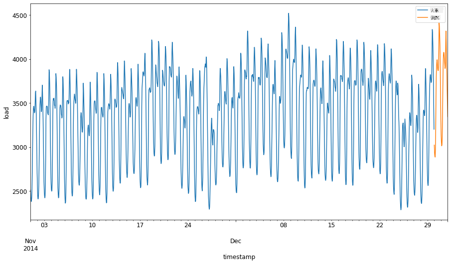
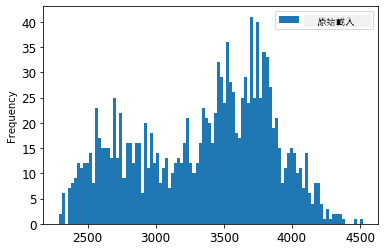
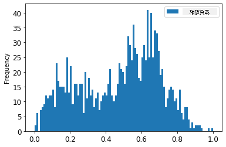
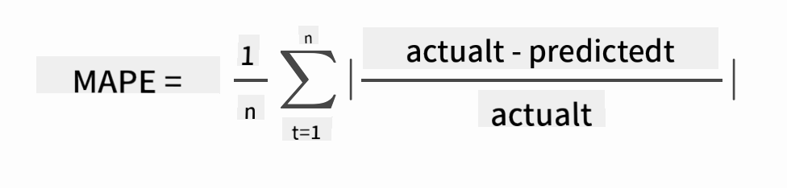

<!--
CO_OP_TRANSLATOR_METADATA:
{
  "original_hash": "2f400075e003e749fdb0d6b3b4787a99",
  "translation_date": "2025-09-03T16:50:42+00:00",
  "source_file": "7-TimeSeries/2-ARIMA/README.md",
  "language_code": "tw"
}
-->
# 使用 ARIMA 進行時間序列預測

在上一課中，您已經了解了一些關於時間序列預測的知識，並載入了一個顯示電力負載在一段時間內波動的數據集。

[](https://youtu.be/IUSk-YDau10 "ARIMA 簡介")

> 🎥 點擊上方圖片觀看影片：ARIMA 模型的簡要介紹。範例使用 R 語言，但概念具有普遍性。

## [課前測驗](https://gray-sand-07a10f403.1.azurestaticapps.net/quiz/43/)

## 簡介

在本課中，您將學習如何使用 [ARIMA: *A*uto*R*egressive *I*ntegrated *M*oving *A*verage](https://wikipedia.org/wiki/Autoregressive_integrated_moving_average) 建立模型。ARIMA 模型特別適合用於分析具有 [非平穩性](https://wikipedia.org/wiki/Stationary_process) 的數據。

## 基本概念

在使用 ARIMA 之前，您需要了解一些基本概念：

- 🎓 **平穩性**。在統計學中，平穩性指的是數據的分佈在時間移動時不會改變。非平穩數據則會因趨勢而波動，必須進行轉換才能進行分析。例如，季節性可能會引入數據波動，可以通過“季節性差分”過程來消除。

- 🎓 **[差分](https://wikipedia.org/wiki/Autoregressive_integrated_moving_average#Differencing)**。差分是指將非平穩數據轉換為平穩數據的過程，通過移除其非恆定趨勢來實現。“差分消除了時間序列中的水平變化，消除了趨勢和季節性，從而穩定了時間序列的均值。” [Shixiong 等人的論文](https://arxiv.org/abs/1904.07632)

## ARIMA 在時間序列中的應用

讓我們拆解 ARIMA 的各個部分，以更好地理解它如何幫助我們建模時間序列並進行預測。

- **AR - 自回歸**。自回歸模型顧名思義，會“回顧”過去的數據值並對其進行分析，從而做出假設。這些過去的數據值被稱為“滯後”。例如，顯示每月鉛筆銷售數據的數據集。每月的銷售總額被視為數據集中的“演變變量”。該模型的構建方式是“演變變量與其自身的滯後（即之前的）值進行回歸。” [維基百科](https://wikipedia.org/wiki/Autoregressive_integrated_moving_average)

- **I - 積分**。與類似的 'ARMA' 模型不同，ARIMA 中的 'I' 指的是其 *[積分](https://wikipedia.org/wiki/Order_of_integration)* 特性。通過應用差分步驟來消除非平穩性，數據被“積分”。

- **MA - 移動平均**。該模型的 [移動平均](https://wikipedia.org/wiki/Moving-average_model) 部分指的是通過觀察滯後的當前和過去值來確定輸出變量。

總結：ARIMA 用於使模型盡可能貼合時間序列數據的特殊形式。

## 練習 - 建立 ARIMA 模型

打開本課中的 [_/working_](https://github.com/microsoft/ML-For-Beginners/tree/main/7-TimeSeries/2-ARIMA/working) 資料夾，找到 [_notebook.ipynb_](https://github.com/microsoft/ML-For-Beginners/blob/main/7-TimeSeries/2-ARIMA/working/notebook.ipynb) 文件。

1. 運行 notebook 以載入 `statsmodels` Python 庫；您將需要它來建立 ARIMA 模型。

1. 載入必要的庫。

1. 接下來，載入幾個有助於繪製數據的庫：

    ```python
    import os
    import warnings
    import matplotlib.pyplot as plt
    import numpy as np
    import pandas as pd
    import datetime as dt
    import math

    from pandas.plotting import autocorrelation_plot
    from statsmodels.tsa.statespace.sarimax import SARIMAX
    from sklearn.preprocessing import MinMaxScaler
    from common.utils import load_data, mape
    from IPython.display import Image

    %matplotlib inline
    pd.options.display.float_format = '{:,.2f}'.format
    np.set_printoptions(precision=2)
    warnings.filterwarnings("ignore") # specify to ignore warning messages
    ```

1. 從 `/data/energy.csv` 文件中載入數據到 Pandas dataframe，並查看數據：

    ```python
    energy = load_data('./data')[['load']]
    energy.head(10)
    ```

1. 繪製 2012 年 1 月至 2014 年 12 月的所有可用能源數據。這些數據應該不會有驚喜，因為我們在上一課中已經看過：

    ```python
    energy.plot(y='load', subplots=True, figsize=(15, 8), fontsize=12)
    plt.xlabel('timestamp', fontsize=12)
    plt.ylabel('load', fontsize=12)
    plt.show()
    ```

    現在，讓我們建立一個模型！

### 創建訓練和測試數據集

現在數據已載入，您可以將其分為訓練集和測試集。您將在訓練集上訓練模型。與往常一樣，模型訓練完成後，您將使用測試集評估其準確性。您需要確保測試集涵蓋訓練集之後的時間段，以確保模型不會從未來的時間段中獲取信息。

1. 將 2014 年 9 月 1 日至 10 月 31 日的兩個月期間分配給訓練集。測試集將包括 2014 年 11 月 1 日至 12 月 31 日的兩個月期間：

    ```python
    train_start_dt = '2014-11-01 00:00:00'
    test_start_dt = '2014-12-30 00:00:00'
    ```

    由於此數據反映了每日能源消耗，因此存在強烈的季節性模式，但消耗量與最近幾天的消耗量最為相似。

1. 可視化差異：

    ```python
    energy[(energy.index < test_start_dt) & (energy.index >= train_start_dt)][['load']].rename(columns={'load':'train'}) \
        .join(energy[test_start_dt:][['load']].rename(columns={'load':'test'}), how='outer') \
        .plot(y=['train', 'test'], figsize=(15, 8), fontsize=12)
    plt.xlabel('timestamp', fontsize=12)
    plt.ylabel('load', fontsize=12)
    plt.show()
    ```

    

    因此，使用相對較小的時間窗口來訓練數據應該足夠。

    > 注意：由於我們用於擬合 ARIMA 模型的函數在擬合過程中使用了樣本內驗證，因此我們將省略驗證數據。

### 為訓練準備數據

現在，您需要通過過濾和縮放數據來準備訓練數據。過濾數據集以僅包含所需的時間段和列，並縮放以確保數據投影在 0 到 1 的區間內。

1. 過濾原始數據集以僅包含每個集合中上述的時間段，並僅包括所需的“load”列和日期：

    ```python
    train = energy.copy()[(energy.index >= train_start_dt) & (energy.index < test_start_dt)][['load']]
    test = energy.copy()[energy.index >= test_start_dt][['load']]

    print('Training data shape: ', train.shape)
    print('Test data shape: ', test.shape)
    ```

    您可以查看數據的形狀：

    ```output
    Training data shape:  (1416, 1)
    Test data shape:  (48, 1)
    ```

1. 將數據縮放到範圍 (0, 1)。

    ```python
    scaler = MinMaxScaler()
    train['load'] = scaler.fit_transform(train)
    train.head(10)
    ```

1. 可視化原始數據與縮放後的數據：

    ```python
    energy[(energy.index >= train_start_dt) & (energy.index < test_start_dt)][['load']].rename(columns={'load':'original load'}).plot.hist(bins=100, fontsize=12)
    train.rename(columns={'load':'scaled load'}).plot.hist(bins=100, fontsize=12)
    plt.show()
    ```

    

    > 原始數據

    

    > 縮放後數據

1. 現在您已校準縮放後的數據，可以縮放測試數據：

    ```python
    test['load'] = scaler.transform(test)
    test.head()
    ```

### 實現 ARIMA

現在是時候實現 ARIMA 了！您將使用之前安裝的 `statsmodels` 庫。

接下來需要遵循幾個步驟：

   1. 通過調用 `SARIMAX()` 並傳入模型參數：p、d 和 q 參數，以及 P、D 和 Q 參數來定義模型。
   2. 通過調用 `fit()` 函數為訓練數據準備模型。
   3. 通過調用 `forecast()` 函數並指定要預測的步數（即“預測範圍”）來進行預測。

> 🎓 這些參數是什麼意思？在 ARIMA 模型中，有 3 個參數用於幫助建模時間序列的主要方面：季節性、趨勢和噪聲。這些參數是：

`p`: 與模型的自回歸部分相關的參數，包含*過去*的值。
`d`: 與模型的積分部分相關的參數，影響應用於時間序列的*差分*次數（🎓 還記得差分嗎 👆？）。
`q`: 與模型的移動平均部分相關的參數。

> 注意：如果您的數據具有季節性特徵（此數據確實如此），我們使用季節性 ARIMA 模型（SARIMA）。在這種情況下，您需要使用另一組參數：`P`、`D` 和 `Q`，它們與 `p`、`d` 和 `q` 的關聯相同，但對應於模型的季節性部分。

1. 首先設置您偏好的預測範圍值。讓我們嘗試 3 小時：

    ```python
    # Specify the number of steps to forecast ahead
    HORIZON = 3
    print('Forecasting horizon:', HORIZON, 'hours')
    ```

    為 ARIMA 模型選擇最佳參數值可能具有挑戰性，因為它有些主觀且耗時。您可以考慮使用 [`pyramid` 庫](https://alkaline-ml.com/pmdarima/0.9.0/modules/generated/pyramid.arima.auto_arima.html) 中的 `auto_arima()` 函數。

1. 現在嘗試一些手動選擇以找到一個好的模型。

    ```python
    order = (4, 1, 0)
    seasonal_order = (1, 1, 0, 24)

    model = SARIMAX(endog=train, order=order, seasonal_order=seasonal_order)
    results = model.fit()

    print(results.summary())
    ```

    打印出結果表。

您已建立了第一個模型！現在我們需要找到評估它的方法。

### 評估您的模型

要評估您的模型，您可以執行所謂的 `逐步前進` 驗證。在實際操作中，每次有新數據可用時，時間序列模型都會重新訓練。這使得模型能夠在每個時間步驟上做出最佳預測。

使用此技術從時間序列的開頭開始，對訓練數據集進行模型訓練。然後對下一個時間步驟進行預測。預測結果與已知值進行比較。然後擴展訓練集以包含已知值，並重複該過程。

> 注意：您應該保持訓練集窗口固定以提高訓練效率，因此每次向訓練集添加新觀測值時，您需要從集合的開頭移除觀測值。

此過程提供了模型在實際操作中的更穩健估計。然而，這需要付出計算成本來創建大量模型。如果數據量小或模型簡單，這是可以接受的，但在大規模情況下可能會成為問題。

逐步前進驗證是時間序列模型評估的黃金標準，建議在您的項目中使用。

1. 首先，為每個預測範圍步驟創建測試數據點。

    ```python
    test_shifted = test.copy()

    for t in range(1, HORIZON+1):
        test_shifted['load+'+str(t)] = test_shifted['load'].shift(-t, freq='H')

    test_shifted = test_shifted.dropna(how='any')
    test_shifted.head(5)
    ```

    |            |          | load | load+1 | load+2 |
    | ---------- | -------- | ---- | ------ | ------ |
    | 2014-12-30 | 00:00:00 | 0.33 | 0.29   | 0.27   |
    | 2014-12-30 | 01:00:00 | 0.29 | 0.27   | 0.27   |
    | 2014-12-30 | 02:00:00 | 0.27 | 0.27   | 0.30   |
    | 2014-12-30 | 03:00:00 | 0.27 | 0.30   | 0.41   |
    | 2014-12-30 | 04:00:00 | 0.30 | 0.41   | 0.57   |

    數據根據其預測範圍點水平移動。

1. 使用此滑動窗口方法對測試數據進行預測，循環大小為測試數據的長度：

    ```python
    %%time
    training_window = 720 # dedicate 30 days (720 hours) for training

    train_ts = train['load']
    test_ts = test_shifted

    history = [x for x in train_ts]
    history = history[(-training_window):]

    predictions = list()

    order = (2, 1, 0)
    seasonal_order = (1, 1, 0, 24)

    for t in range(test_ts.shape[0]):
        model = SARIMAX(endog=history, order=order, seasonal_order=seasonal_order)
        model_fit = model.fit()
        yhat = model_fit.forecast(steps = HORIZON)
        predictions.append(yhat)
        obs = list(test_ts.iloc[t])
        # move the training window
        history.append(obs[0])
        history.pop(0)
        print(test_ts.index[t])
        print(t+1, ': predicted =', yhat, 'expected =', obs)
    ```

    您可以觀察到訓練過程：

    ```output
    2014-12-30 00:00:00
    1 : predicted = [0.32 0.29 0.28] expected = [0.32945389435989236, 0.2900626678603402, 0.2739480752014323]

    2014-12-30 01:00:00
    2 : predicted = [0.3  0.29 0.3 ] expected = [0.2900626678603402, 0.2739480752014323, 0.26812891674127126]

    2014-12-30 02:00:00
    3 : predicted = [0.27 0.28 0.32] expected = [0.2739480752014323, 0.26812891674127126, 0.3025962399283795]
    ```

1. 將預測結果與實際負載進行比較：

    ```python
    eval_df = pd.DataFrame(predictions, columns=['t+'+str(t) for t in range(1, HORIZON+1)])
    eval_df['timestamp'] = test.index[0:len(test.index)-HORIZON+1]
    eval_df = pd.melt(eval_df, id_vars='timestamp', value_name='prediction', var_name='h')
    eval_df['actual'] = np.array(np.transpose(test_ts)).ravel()
    eval_df[['prediction', 'actual']] = scaler.inverse_transform(eval_df[['prediction', 'actual']])
    eval_df.head()
    ```

    輸出
    |     |            | timestamp | h   | prediction | actual   |
    | --- | ---------- | --------- | --- | ---------- | -------- |
    | 0   | 2014-12-30 | 00:00:00  | t+1 | 3,008.74   | 3,023.00 |
    | 1   | 2014-12-30 | 01:00:00  | t+1 | 2,955.53   | 2,935.00 |
    | 2   | 2014-12-30 | 02:00:00  | t+1 | 2,900.17   | 2,899.00 |
    | 3   | 2014-12-30 | 03:00:00  | t+1 | 2,917.69   | 2,886.00 |
    | 4   | 2014-12-30 | 04:00:00  | t+1 | 2,946.99   | 2,963.00 |

    觀察每小時數據的預測結果，與實際負載相比。準確度如何？

### 檢查模型準確性

通過測試所有預測的平均絕對百分比誤差 (MAPE) 來檢查模型的準確性。
> **🧮 展示數學公式**
>
> 
>
> [MAPE](https://www.linkedin.com/pulse/what-mape-mad-msd-time-series-allameh-statistics/) 用於顯示預測準確度，公式如上所示。實際值與預測值之間的差異除以實際值。
>
> 「在這個計算中，每個預測點的絕對值之和會被計算，然後再除以擬合點的數量 n。」[維基百科](https://wikipedia.org/wiki/Mean_absolute_percentage_error)
1. 在程式碼中表達公式：

    ```python
    if(HORIZON > 1):
        eval_df['APE'] = (eval_df['prediction'] - eval_df['actual']).abs() / eval_df['actual']
        print(eval_df.groupby('h')['APE'].mean())
    ```

1. 計算單步的 MAPE：

    ```python
    print('One step forecast MAPE: ', (mape(eval_df[eval_df['h'] == 't+1']['prediction'], eval_df[eval_df['h'] == 't+1']['actual']))*100, '%')
    ```

    單步預測的 MAPE：0.5570581332313952 %

1. 輸出多步預測的 MAPE：

    ```python
    print('Multi-step forecast MAPE: ', mape(eval_df['prediction'], eval_df['actual'])*100, '%')
    ```

    ```output
    Multi-step forecast MAPE:  1.1460048657704118 %
    ```

    一個較低的數值是最好的：請考慮，如果預測的 MAPE 為 10，則表示偏差為 10%。

1. 但如同往常，視覺化這類準確性測量會更容易理解，因此讓我們繪製圖表：

    ```python
     if(HORIZON == 1):
        ## Plotting single step forecast
        eval_df.plot(x='timestamp', y=['actual', 'prediction'], style=['r', 'b'], figsize=(15, 8))

    else:
        ## Plotting multi step forecast
        plot_df = eval_df[(eval_df.h=='t+1')][['timestamp', 'actual']]
        for t in range(1, HORIZON+1):
            plot_df['t+'+str(t)] = eval_df[(eval_df.h=='t+'+str(t))]['prediction'].values

        fig = plt.figure(figsize=(15, 8))
        ax = plt.plot(plot_df['timestamp'], plot_df['actual'], color='red', linewidth=4.0)
        ax = fig.add_subplot(111)
        for t in range(1, HORIZON+1):
            x = plot_df['timestamp'][(t-1):]
            y = plot_df['t+'+str(t)][0:len(x)]
            ax.plot(x, y, color='blue', linewidth=4*math.pow(.9,t), alpha=math.pow(0.8,t))

        ax.legend(loc='best')

    plt.xlabel('timestamp', fontsize=12)
    plt.ylabel('load', fontsize=12)
    plt.show()
    ```

    

🏆 非常棒的圖表，顯示了一個具有良好準確性的模型。做得好！

---

## 🚀挑戰

深入研究測試時間序列模型準確性的方法。本課程中我們提到了 MAPE，但是否還有其他方法可以使用？研究它們並加以註解。一份有用的文件可以在[這裡](https://otexts.com/fpp2/accuracy.html)找到。

## [課後測驗](https://gray-sand-07a10f403.1.azurestaticapps.net/quiz/44/)

## 回顧與自學

本課程僅涉及 ARIMA 時間序列預測的基礎知識。花些時間深入了解[這個倉庫](https://microsoft.github.io/forecasting/)及其各種模型類型，學習其他構建時間序列模型的方法。

## 作業

[一個新的 ARIMA 模型](assignment.md)

---

**免責聲明**：  
本文件已使用 AI 翻譯服務 [Co-op Translator](https://github.com/Azure/co-op-translator) 進行翻譯。儘管我們致力於提供準確的翻譯，請注意自動翻譯可能包含錯誤或不準確之處。原始文件的母語版本應被視為權威來源。對於重要資訊，建議尋求專業人工翻譯。我們對因使用此翻譯而引起的任何誤解或錯誤解釋不承擔責任。