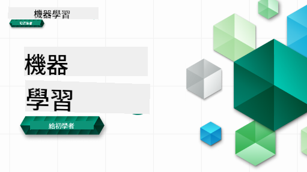

<!--
CO_OP_TRANSLATOR_METADATA:
{
  "original_hash": "a54f98da7bbee99ddc62a9e490eef7dc",
  "translation_date": "2025-09-29T21:45:50+00:00",
  "source_file": "README.md",
  "language_code": "tw"
}
-->
  
  
  
  
  

  
  
  

### 🌐 多語言支援  

#### 透過 GitHub Action 支援（自動化且保持最新）  

[法文](../fr/README.md) | [西班牙文](../es/README.md) | [德文](../de/README.md) | [俄文](../ru/README.md) | [阿拉伯文](../ar/README.md) | [波斯文（法爾西）](../fa/README.md) | [烏爾都文](../ur/README.md) | [中文（簡體）](../zh/README.md) | [中文（繁體，澳門）](../mo/README.md) | [中文（繁體，香港）](../hk/README.md) | [中文（繁體，台灣）](./README.md) | [日文](../ja/README.md) | [韓文](../ko/README.md) | [印地文](../hi/README.md) | [孟加拉文](../bn/README.md) | [馬拉地文](../mr/README.md) | [尼泊爾文](../ne/README.md) | [旁遮普文（古木基文）](../pa/README.md) | [葡萄牙文（葡萄牙）](../pt/README.md) | [葡萄牙文（巴西）](../br/README.md) | [義大利文](../it/README.md) | [波蘭文](../pl/README.md) | [土耳其文](../tr/README.md) | [希臘文](../el/README.md) | [泰文](../th/README.md) | [瑞典文](../sv/README.md) | [丹麥文](../da/README.md) | [挪威文](../no/README.md) | [芬蘭文](../fi/README.md) | [荷蘭文](../nl/README.md) | [希伯來文](../he/README.md) | [越南文](../vi/README.md) | [印尼文](../id/README.md) | [馬來文](../ms/README.md) | [塔加洛文（菲律賓）](../tl/README.md) | [斯瓦希里文](../sw/README.md) | [匈牙利文](../hu/README.md) | [捷克文](../cs/README.md) | [斯洛伐克文](../sk/README.md) | [羅馬尼亞文](../ro/README.md) | [保加利亞文](../bg/README.md) | [塞爾維亞文（西里爾文）](../sr/README.md) | [克羅埃西亞文](../hr/README.md) | [斯洛維尼亞文](../sl/README.md) | [烏克蘭文](../uk/README.md) | [緬甸文（緬甸）](../my/README.md)  

#### 加入我們的社群  

  

我們正在進行一個 Discord 的 AI 學習系列，了解更多並加入我們的 [AI 學習系列](https://aka.ms/learnwithai/discord)，活動時間為 2025 年 9 月 18 日至 30 日。您將學到使用 GitHub Copilot 進行數據科學的技巧和秘訣。  

  

# 初學者的機器學習課程  

> 🌍 跟隨我們的腳步，透過世界文化探索機器學習 🌍  

Microsoft 的雲端倡導者很高興提供一個為期 12 週、共 26 節課的課程，內容涵蓋 **機器學習**。在這個課程中，您將學習有時被稱為 **經典機器學習** 的技術，主要使用 Scikit-learn 作為庫，並避免深度學習（深度學習內容可參考我們的 [AI 初學者課程](https://aka.ms/ai4beginners)）。此外，您也可以搭配我們的 ['數據科學初學者課程'](https://aka.ms/ds4beginners) 一起學習！  

跟隨我們的腳步，探索世界各地的數據，並應用這些經典技術。每節課都包含課前和課後測驗、完成課程的書面指導、解決方案、作業等。我們的專案導向教學法讓您在建構中學習，這是一種能讓新技能更牢固掌握的有效方法。  

**✍️ 衷心感謝我們的作者** Jen Looper、Stephen Howell、Francesca Lazzeri、Tomomi Imura、Cassie Breviu、Dmitry Soshnikov、Chris Noring、Anirban Mukherjee、Ornella Altunyan、Ruth Yakubu 和 Amy Boyd  

**🎨 同時感謝我們的插畫家** Tomomi Imura、Dasani Madipalli 和 Jen Looper  

**🙏 特別感謝 🙏 我們的 Microsoft 學生大使作者、審稿人和內容貢獻者**，尤其是 Rishit Dagli、Muhammad Sakib Khan Inan、Rohan Raj、Alexandru Petrescu、Abhishek Jaiswal、Nawrin Tabassum、Ioan Samuila 和 Snigdha Agarwal  

**🤩 額外感謝 Microsoft 學生大使 Eric Wanjau、Jasleen Sondhi 和 Vidushi Gupta 為我們的 R 課程提供支持！**  

# 開始使用  

請按照以下步驟：  
1. **Fork 此儲存庫**：點擊此頁面右上角的 "Fork" 按鈕。  
2. **Clone 此儲存庫**：`git clone https://github.com/microsoft/ML-For-Beginners.git`  

> [在 Microsoft Learn 集合中找到本課程的所有額外資源](https://learn.microsoft.com/en-us/collections/qrqzamz1nn2wx3?WT.mc_id=academic-77952-bethanycheum)  

**[學生](https://aka.ms/student-page)**，要使用此課程，請將整個儲存庫 fork 到您的 GitHub 帳戶，並自行或與小組一起完成練習：  

- 從課前測驗開始。  
- 閱讀課程並完成活動，在每次知識檢查時停下來反思。  
- 嘗試通過理解課程內容來創建專案，而不是直接運行解決方案代碼；不過，解決方案代碼可在每個專案導向課程的 `/solution` 資料夾中找到。  
- 完成課後測驗。  
- 完成挑戰。  
- 完成作業。  
- 完成一組課程後，訪問 [討論板](https://github.com/microsoft/ML-For-Beginners/discussions)，並透過填寫適當的 PAT 評估表來 "大聲學習"。PAT 是一種進度評估工具，您可以填寫該表來進一步學習。您也可以對其他 PAT 進行回應，讓我們一起學習。  

> 若需進一步學習，我們建議您參考這些 [Microsoft Learn](https://docs.microsoft.com/en-us/users/jenlooper-2911/collections/k7o7tg1gp306q4?WT.mc_id=academic-77952-leestott) 模組和學習路徑。  

**教師們**，我們提供了一些 [建議](for-teachers.md) 供您使用此課程。  

---

## 影片導覽  

部分課程提供短片形式的影片。您可以在課程中找到這些影片，或點擊下方圖片前往 [Microsoft Developer YouTube 頻道的 ML 初學者播放清單](https://aka.ms/ml-beginners-videos)。  

  

---

## 認識團隊  

  

**Gif 作者** [Mohit Jaisal](https://linkedin.com/in/mohitjaisal)  

> 🎥 點擊上方圖片觀看關於此專案及創作者的影片！  

---

## 教學法  

我們在設計此課程時選擇了兩個教學原則：確保課程是 **專案導向** 且包含 **頻繁測驗**。此外，此課程還有一個共同的 **主題**，以增強其連貫性。  

透過確保內容與專案相符，學習過程對學生來說更具吸引力，並能增強概念的記憶。此外，課前的低壓測驗能讓學生專注於學習主題，而課後的第二次測驗則能進一步加強記憶。此課程設計靈活有趣，可完整或部分學習。專案從簡單開始，並在 12 週的周期結束時逐漸變得複雜。此課程還包括一個關於機器學習實際應用的附錄，可作為額外學分或討論的基礎。  

> 查看我們的 [行為準則](CODE_OF_CONDUCT.md)、[貢獻指南](CONTRIBUTING.md) 和 [翻譯指南](TRANSLATIONS.md)。我們歡迎您的建設性反饋！  

## 每節課包含  

- 可選的手繪筆記  
- 可選的補充影片  
- 影片導覽（僅部分課程）  
- [課前暖身測驗](https://ff-quizzes.netlify.app/en/ml/)  
- 書面課程  
- 專案導向課程的逐步指導  
- 知識檢查  
- 挑戰  
- 補充閱讀  
- 作業  
- [課後測驗](https://ff-quizzes.netlify.app/en/ml/)  

> **關於語言的說明**：這些課程主要使用 Python，但許多課程也提供 R。要完成 R 課程，請前往 `/solution` 資料夾並尋找 R 課程。這些課程包含 `.rmd` 擴展名，代表 **R Markdown** 文件，可簡單定義為在 `Markdown 文件` 中嵌入 `代碼塊`（R 或其他語言）和 `YAML 標頭`（指導如何格式化輸出，例如 PDF）。因此，它是一個出色的數據科學創作框架，因為它允許您將代碼、輸出和想法結合在一起，並以 Markdown 的形式記錄下來。此外，R Markdown 文件可以渲染為 PDF、HTML 或 Word 等輸出格式。  

> **關於測驗的說明**：所有測驗都包含在 [測驗應用資料夾](../../quiz-app) 中，共有 52 個測驗，每個測驗包含三個問題。測驗在課程中有連結，但測驗應用可以在本地運行；請按照 `quiz-app` 資料夾中的指示在本地主機或部署到 Azure。  

| 課程編號 |                             主題                              |                   課程分組                   | 學習目標                                                                                                             |                                                              課程連結                                                               |                        作者                        |
| :-----------: | :------------------------------------------------------------: | :-------------------------------------------------: | ------------------------------------------------------------------------------------------------------------------------------- | :--------------------------------------------------------------------------------------------------------------------------------------: | :--------------------------------------------------: |
|      01       |                機器學習簡介                |      [簡介](1-Introduction/README.md)       | 學習機器學習的基本概念                                                                                |                                             [課程](1-Introduction/1-intro-to-ML/README.md)                                             |                       Muhammad                       |
|      02       |                機器學習的歷史                 |      [簡介](1-Introduction/README.md)       | 學習此領域的歷史背景                                                                                         |                                            [課程](1-Introduction/2-history-of-ML/README.md)                                            |                     Jen 和 Amy                      |  
|      03       |                 公平性與機器學習                  |      [簡介](1-Introduction/README.md)       | 學生在建立和應用機器學習模型時，應考慮哪些重要的哲學問題與公平性相關？ |                                              [課程](1-Introduction/3-fairness/README.md)                                               |                        Tomomi                        |
|      04       |                機器學習技術                 |      [簡介](1-Introduction/README.md)       | 機器學習研究人員使用哪些技術來建立機器學習模型？                                                                       |                                          [課程](1-Introduction/4-techniques-of-ML/README.md)                                           |                    Chris 和 Jen                     |
|      05       |                   回歸簡介                   |        [回歸](2-Regression/README.md)         | 使用 Python 和 Scikit-learn 開始學習回歸模型                                                                  |         [Python](2-Regression/1-Tools/README.md) • [R](../../2-Regression/1-Tools/solution/R/lesson_1.html)         |      Jen • Eric Wanjau       |
|      06       |                北美南瓜價格 🎃                |        [回歸](2-Regression/README.md)         | 視覺化並清理數據以準備機器學習                                                                                  |          [Python](2-Regression/2-Data/README.md) • [R](../../2-Regression/2-Data/solution/R/lesson_2.html)          |      Jen • Eric Wanjau       |
|      07       |                北美南瓜價格 🎃                |        [回歸](2-Regression/README.md)         | 建立線性和多項式回歸模型                                                                                   |        [Python](2-Regression/3-Linear/README.md) • [R](../../2-Regression/3-Linear/solution/R/lesson_3.html)        |      Jen 和 Dmitry • Eric Wanjau       |
|      08       |                北美南瓜價格 🎃                |        [回歸](2-Regression/README.md)         | 建立邏輯回歸模型                                                                                               |     [Python](2-Regression/4-Logistic/README.md) • [R](../../2-Regression/4-Logistic/solution/R/lesson_4.html)      |      Jen • Eric Wanjau       |
|      09       |                          網頁應用程式 🔌                          |           [網頁應用程式](3-Web-App/README.md)            | 建立一個網頁應用程式以使用您訓練的模型                                                                                       |                                                 [Python](3-Web-App/1-Web-App/README.md)                                                  |                         Jen                          |
|      10       |                 分類簡介                 |    [分類](4-Classification/README.md)     | 清理、準備並視覺化您的數據；分類簡介                                                            | [Python](4-Classification/1-Introduction/README.md) • [R](../../4-Classification/1-Introduction/solution/R/lesson_10.html)  | Jen 和 Cassie • Eric Wanjau |
|      11       |             美味的亞洲和印度料理 🍜             |    [分類](4-Classification/README.md)     | 分類器簡介                                                                                                     | [Python](4-Classification/2-Classifiers-1/README.md) • [R](../../4-Classification/2-Classifiers-1/solution/R/lesson_11.html) | Jen 和 Cassie • Eric Wanjau |
|      12       |             美味的亞洲和印度料理 🍜             |    [分類](4-Classification/README.md)     | 更多分類器                                                                                                                | [Python](4-Classification/3-Classifiers-2/README.md) • [R](../../4-Classification/3-Classifiers-2/solution/R/lesson_12.html) | Jen 和 Cassie • Eric Wanjau |
|      13       |             美味的亞洲和印度料理 🍜             |    [分類](4-Classification/README.md)     | 使用您的模型建立推薦系統網頁應用程式                                                                                    |                                              [Python](4-Classification/4-Applied/README.md)                                              |                         Jen                          |
|      14       |                   聚類簡介                   |        [聚類](5-Clustering/README.md)         | 清理、準備並視覺化您的數據；聚類簡介                                                                |         [Python](5-Clustering/1-Visualize/README.md) • [R](../../5-Clustering/1-Visualize/solution/R/lesson_14.html)         |      Jen • Eric Wanjau       |
|      15       |              探索尼日利亞的音樂喜好 🎧              |        [聚類](5-Clustering/README.md)         | 探索 K-Means 聚類方法                                                                                           |           [Python](5-Clustering/2-K-Means/README.md) • [R](../../5-Clustering/2-K-Means/solution/R/lesson_15.html)           |      Jen • Eric Wanjau       |
|      16       |        自然語言處理簡介 ☕️         |   [自然語言處理](6-NLP/README.md)    | 通過建立簡單的機器人學習 NLP 的基礎知識                                                                             |                                             [Python](6-NLP/1-Introduction-to-NLP/README.md)                                              |                       Stephen                        |
|      17       |                      常見的 NLP 任務 ☕️                      |   [自然語言處理](6-NLP/README.md)    | 通過理解處理語言結構時所需的常見任務來加深您的 NLP 知識                          |                                                    [Python](6-NLP/2-Tasks/README.md)                                                     |                       Stephen                        |
|      18       |             翻譯與情感分析 ♥️              |   [自然語言處理](6-NLP/README.md)    | 使用 Jane Austen 的作品進行翻譯與情感分析                                                                             |                                            [Python](6-NLP/3-Translation-Sentiment/README.md)                                             |                       Stephen                        |
|      19       |                  歐洲浪漫酒店 ♥️                  |   [自然語言處理](6-NLP/README.md)    | 酒店評論的情感分析 1                                                                                         |                                               [Python](6-NLP/4-Hotel-Reviews-1/README.md)                                                |                       Stephen                        |
|      20       |                  歐洲浪漫酒店 ♥️                  |   [自然語言處理](6-NLP/README.md)    | 酒店評論的情感分析 2                                                                                         |                                               [Python](6-NLP/5-Hotel-Reviews-2/README.md)                                                |                       Stephen                        |
|      21       |            時間序列預測簡介             |        [時間序列](7-TimeSeries/README.md)        | 時間序列預測簡介                                                                                         |                                             [Python](7-TimeSeries/1-Introduction/README.md)                                              |                      Francesca                       |
|      22       | ⚡️ 世界電力使用 ⚡️ - 使用 ARIMA 進行時間序列預測 |        [時間序列](7-TimeSeries/README.md)        | 使用 ARIMA 進行時間序列預測                                                                                              |                                                 [Python](7-TimeSeries/2-ARIMA/README.md)                                                 |                      Francesca                       |
|      23       |  ⚡️ 世界電力使用 ⚡️ - 使用 SVR 進行時間序列預測  |        [時間序列](7-TimeSeries/README.md)        | 使用支持向量回歸進行時間序列預測                                                                           |                                                  [Python](7-TimeSeries/3-SVR/README.md)                                                  |                       Anirban                        |
|      24       |             強化學習簡介             | [強化學習](8-Reinforcement/README.md) | 使用 Q-Learning 進行強化學習簡介                                                                          |                                             [Python](8-Reinforcement/1-QLearning/README.md)                                              |                        Dmitry                        |
|      25       |                 幫助 Peter 避開狼！ 🐺                  | [強化學習](8-Reinforcement/README.md) | 強化學習 Gym                                                                                                      |                                                [Python](8-Reinforcement/2-Gym/README.md)                                                 |                        Dmitry                        |
|  後記   |            真實世界的機器學習場景與應用            |      [真實世界的機器學習](9-Real-World/README.md)       | 有趣且揭示性的經典機器學習真實世界應用                                                               |                                             [課程](9-Real-World/1-Applications/README.md)                                              |                         團隊                         |
|  後記   |            使用 RAI 儀表板進行機器學習模型調試          |      [真實世界的機器學習](9-Real-World/README.md)       | 使用負責任 AI 儀表板元件進行機器學習模型調試                                                              |                                             [課程](9-Real-World/2-Debugging-ML-Models/README.md)                                              |                         Ruth Yakubu                       |

> [在 Microsoft Learn 集合中找到本課程的所有額外資源](https://learn.microsoft.com/en-us/collections/qrqzamz1nn2wx3?WT.mc_id=academic-77952-bethanycheum)

## 離線訪問

您可以使用 [Docsify](https://docsify.js.org/#/) 離線運行此文檔。Fork 此 repo，並在您的本地機器上 [安裝 Docsify](https://docsify.js.org/#/quickstart)，然後在此 repo 的根文件夾中輸入 `docsify serve`。網站將在您的本地主機的 3000 端口上提供服務：`localhost:3000`。

## PDF

在 [這裡](https://microsoft.github.io/ML-For-Beginners/pdf/readme.pdf) 找到包含鏈接的課程 PDF。

## 🎒 其他課程 

我們的團隊還製作了其他課程！查看以下內容：

- [Edge AI for Beginners](https://aka.ms/edgeai-for-beginners)
- [AI Agents for Beginners](https://aka.ms/ai-agents-beginners)
- [Generative AI for Beginners](https://aka.ms/genai-beginners)
- [Generative AI for Beginners .NET](https://github.com/microsoft/Generative-AI-for-beginners-dotnet)
- [Generative AI with JavaScript](https://github.com/microsoft/generative-ai-with-javascript)
- [Generative AI with Java](https://github.com/microsoft/Generative-AI-for-beginners-java)
- [AI for Beginners](https://aka.ms/ai-beginners)
- [Data Science for Beginners](https://aka.ms/datascience-beginners)
- [ML for Beginners](https://aka.ms/ml-beginners)
- [Cybersecurity for Beginners](https://github.com/microsoft/Security-101) 
- [Web Dev for Beginners](https://aka.ms/webdev-beginners)
- [IoT for Beginners](https://aka.ms/iot-beginners)
- [XR Development for Beginners](https://github.com/microsoft/xr-development-for-beginners)
- [Mastering GitHub Copilot for Paired Programming](https://github.com/microsoft/Mastering-GitHub-Copilot-for-Paired-Programming)
- [Mastering GitHub Copilot for C#/.NET Developers](https://github.com/microsoft/mastering-github-copilot-for-dotnet-csharp-developers)
- [Choose Your Own Copilot Adventure](https://github.com/microsoft/CopilotAdventures)

---

**免責聲明**：  
本文件已使用 AI 翻譯服務 [Co-op Translator](https://github.com/Azure/co-op-translator) 進行翻譯。儘管我們努力確保翻譯的準確性，但請注意，自動翻譯可能包含錯誤或不精確之處。原始文件的母語版本應被視為權威來源。對於關鍵信息，建議使用專業人工翻譯。我們對因使用此翻譯而引起的任何誤解或誤釋不承擔責任。