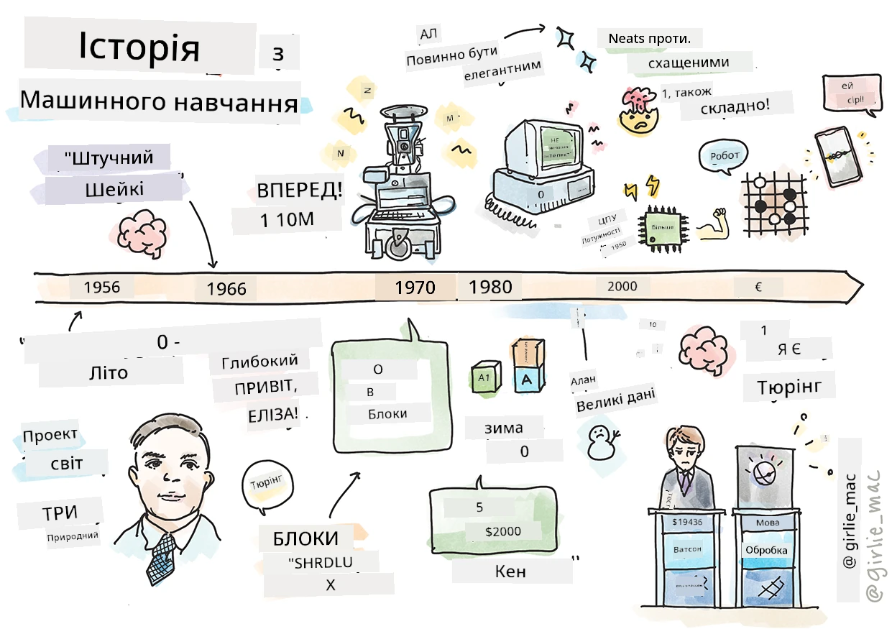
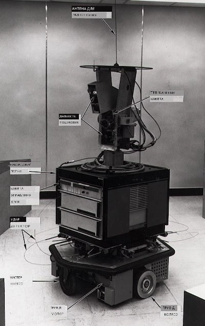
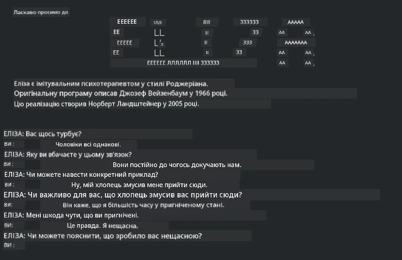

# Історія машинного навчання

> Скетчноут від [Tomomi Imura](https://www.twitter.com/girlie_mac)

## [Попередній квіз](https://ff-quizzes.netlify.app/en/ml/)

---

> 🎥 Натисніть на зображення вище, щоб переглянути коротке відео з цього уроку.

У цьому уроці ми пройдемося основними віхами в історії машинного навчання та штучного інтелекту.

Історія штучного інтелекту (ШІ) як галузі тісно переплітається з історією машинного навчання, оскільки алгоритми й обчислювальні досягнення, що лежать в основі МН, сприяли розвитку ШІ. Корисно пам’ятати, що хоча ці галузі як окремі напрямки досліджень почали формуватися в 1950-х, важливі [алгоритмічні, статистичні, математичні, обчислювальні та технічні відкриття](https://wikipedia.org/wiki/Timeline_of_machine_learning) передували й перекривалися з цією епохою. Насправді люди думали про ці питання протягом [сотень років](https://wikipedia.org/wiki/History_of_artificial_intelligence): ця стаття розглядає історичні інтелектуальні основи ідеї «машини, що мислить».

---
## Визначні відкриття

- 1763, 1812 [Теорема Баєса](https://wikipedia.org/wiki/Bayes%27_theorem) та її попередники. Ця теорема та її застосування лежать в основі висновків, описуючи ймовірність події на основі попередніх знань.
- 1805 [Теорія найменших квадратів](https://wikipedia.org/wiki/Least_squares), розроблена французьким математиком Адрієн-Марі Лежандром. Цю теорію, з якою ви ознайомитесь у модулі регресії, використовують для апроксимації даних.
- 1913 [Марковські ланцюги](https://wikipedia.org/wiki/Markov_chain), названі на честь російського математика Андрія Маркова, використовуються для опису послідовності можливих подій на основі попереднього стану.
- 1957 [Перцептрон](https://wikipedia.org/wiki/Perceptron) — тип лінійного класифікатора, винайдений американським психологом Френком Розенблаттом, який лежить в основі досягнень у глибокому навчанні.

---

- 1967 [Найближчий сусід](https://wikipedia.org/wiki/Nearest_neighbor) — алгоритм, спершу створений для побудови маршрутів. В контексті МН його використовують для виявлення патернів.
- 1970 [Зворотне поширення помилки](https://wikipedia.org/wiki/Backpropagation) використовується для навчання [прямопрохідних нейронних мереж](https://wikipedia.org/wiki/Feedforward_neural_network).
- 1982 [Рекурентні нейронні мережі](https://wikipedia.org/wiki/Recurrent_neural_network) — це штучні нейронні мережі, походженням від прямопрохідних мереж, які створюють часові графи.

✅ Здійсніть невелике дослідження. Які ще дати ви вважаєте ключовими в історії МН та ШІ?

---
## 1950: Машини, що думають

Алан Тьюрінг, надзвичайна особистість, яку [громадськість у 2019 році](https://wikipedia.org/wiki/Icons:_The_Greatest_Person_of_the_20th_Century) визнала найбільшим науковцем ХХ століття, вважається одним із засновників ідеї «машини, що може думати». Він боровся з скептиками та власною потребою в емпіричних доказах цієї концепції частково шляхом створення [Тесту Тьюрінга](https://www.bbc.com/news/technology-18475646), який ви вивчатимете у наших уроках з обробки природної мови.

---
## 1956: Літній дослідницький проєкт у Дартмасі

«Літній дослідницький проєкт у Дартмасі з штучного інтелекту був визначною подією для цієї сфери», і саме тут вперше було введено термін «штучний інтелект» ([джерело](https://250.dartmouth.edu/highlights/artificial-intelligence-ai-coined-dartmouth)).

> Кожний аспект навчання або інша особливість інтелекту можуть бути настільки точно описані, що машину можна змусити імітувати їх.

---

Провідний дослідник, професор математики Джон Маккарті, сподівався «продовжувати з припущенням, що кожний аспект навчання або інша особливість інтелекту можуть бути настільки точно описані, що машину можна змусити імітувати їх». Учасниками були і інші відомі особистості, як-от Марвін Мінський.

Робота семінару вважається початком і поштовхом до декількох дискусій, включаючи «появу символічних методів, систем, сфокусованих на обмежених доменах (ранні експертні системи), та дедуктивних систем проти індуктивних» ([джерело](https://wikipedia.org/wiki/Dartmouth_workshop)).

---
## 1956 - 1974: «Золоті роки»

Від 1950-х до середини 70-х років оптимізм був високим через сподівання, що ШІ зможе вирішити багато проблем. У 1967 році Марвін Мінський впевнено заявив: «Протягом одного покоління… проблема створення 'штучного інтелекту' буде суттєво розв’язана.» (Minsky, Marvin (1967), Computation: Finite and Infinite Machines, Englewood Cliffs, N.J.: Prentice-Hall)

Дослідження обробки природної мови процвітали, пошук вдосконалювався і ставав потужнішим, і виникла концепція «мікросвітів», де прості завдання виконувалися за допомогою інструкцій звичайною мовою.

---

Дослідження фінансувалися урядовими організаціями, відбувалися прориви в обчисленнні та алгоритмах, а прототипи інтелектуальних машин були побудовані. Декілька таких машин:

* [Робот Шейкі](https://wikipedia.org/wiki/Shakey_the_robot), який міг маневрувати і розв’язувати завдання «інтелігентно».

    
    > Шейкі у 1972 році

---

* Еліза, ранній чат-бот, могла спілкуватися з людьми і виконувати роль примітивного «терапевта». Ви дізнаєтесь більше про Елізу в уроках NLP.

    
    > Версія чат-бота Елізи

---

* «Світ блоків» був прикладом мікросвіту, де блоки можна було складати та сортувати, і тут можна було експериментувати з навчанням машин приймати рішення. Досягнення, створені з використанням бібліотек, таких як [SHRDLU](https://wikipedia.org/wiki/SHRDLU), допомогли просунутися в обробці мови.

    

    > 🎥 Натисніть на зображення вище для відео: Світ блоків з SHRDLU

---
## 1974 - 1980: «Зимовий період ШІ»

До середини 70-х стало очевидно, що складність створення «інтелектуальних машин» була недооцінена, а обіцянки, з урахуванням доступної обчислювальної потужності, були перебільшені. Фінансування спало, а довіра до галузі знизилась. Серед проблем, які підривали впевненість:
---
- **Обмеження**. Обчислювальна потужність була надто обмеженою.
- **Комбінаторний вибух**. Кількість параметрів, які потрібно було навчати, зростала експоненційно, коли від комп’ютерів вимагалося більше, але обчислювальна потужність і можливості не розвивалися паралельно.
- **Нестача даних**. Брак даних заважав процесу тестування, розробки та вдосконалення алгоритмів.
- **Чи ставимо ми правильні питання?** Самі питання почали піддаватися сумніву. Дослідники стикалися з критикою своїх підходів:
  - Тести Тьюрінга ставали під сумнів, серед іншого, через ідею «теорії китайської кімнати», яка припускала, що «програмування цифрового комп’ютера може створювати враження розуміння мови, але не дає справжнього розуміння.» ([джерело](https://plato.stanford.edu/entries/chinese-room/))
  - Критика була спрямована на етику впровадження штучних інтелектів, як-от «терапевт» ЕЛІЗА, у суспільство.

---

Водночас почали формуватися різні школи мислення в ШІ. Виникла дихотомія між практиками ["неохайного" та "акуратного ШІ"](https://wikipedia.org/wiki/Neats_and_scruffies). _Неохайні_ лабораторії годинами налаштовували програми, поки не отримували потрібні результати. _Акуратні_ лабораторії «зосереджувалися на логіці та формальному розв’язанні задач». ЕЛІЗА та SHRDLU були відомими _неохайними_ системами. У 1980-х, з появою потреби робити системи МН відтворюваними, підхід _акуратних_ лабораторій поступово вийшов на передній план, оскільки їх результати краще пояснюються.

---
## Експертні системи 1980-х

З розвитком галузі ставало ясніше, яку користь вона приносить бізнесу, і у 1980-х почалося поширення «експертних систем». «Експертні системи були одними з перших по-справжньому успішних форм програмного забезпечення штучного інтелекту (ШІ).» ([джерело](https://wikipedia.org/wiki/Expert_system)).

Цей тип системи насправді є _гібридним_, частково складається з системи правил, що визначають бізнес-вимоги, і інференційного двигуна, який використовує систему правил для виведення нових фактів.

У цю епоху також збільшилася увага до нейронних мереж.

---
## 1987 - 1993: Застій ШІ

Поширення спеціалізованого апаратного забезпечення для експертних систем стало занадто вузькоспеціалізованим. Поява персональних комп’ютерів також конкурувала з цими великими, спеціалізованими, централізованими системами. Демократизація обчислень почалася і згодом відкрила шлях до сучасного вибуху великих даних.

---
## 1993 - 2011

Ця епоха ознаменувала нову добу для МН та ШІ, які змогли розв’язати деякі проблеми, спричинені раніше дефіцитом даних і обчислювальної потужності. Кількість даних почала швидко зростати і стала більш доступною, на краще і на гірше, особливо з появою смартфонів близько 2007 року. Обчислювальна потужність зросла експоненційно, а алгоритми розвивалися паралельно. Галузь почала набирати зрілості, адже вільні часи минули і вона почала оформлятися як справжня дисципліна.

---
## Сьогодні

Сьогодні машинне навчання і ШІ торкаються майже кожного аспекту нашого життя. Ця епоха вимагає уважного розуміння ризиків і потенційних впливів цих алгоритмів на людське життя. Як зазначив Бред Сміт з Microsoft, «Інформаційні технології піднімають питання, що стосуються фундаментальних прав людини, таких як право на приватність та свободу вираження думок. Ці питання підвищують відповідальність технологічних компаній, які створюють ці продукти. З нашої точки зору, вони також потребують вдумливого регулювання з боку уряду й формування норм навколо прийнятного використання» ([джерело](https://www.technologyreview.com/2019/12/18/102365/the-future-of-ais-impact-on-society/)).

---

Майбутнє покаже, що воно принесе, але важливо розуміти ці комп’ютерні системи та програмне забезпечення і алгоритми, які на них працюють. Сподіваємось, ця навчальна програма допоможе вам краще зрозуміти їх, щоб ви могли зробити власні висновки.

> 🎥 Натисніть на зображення вище, щоб переглянути відео: Янн Лекун розповідає про історію глибокого навчання в цій лекції

---
## 🚀Виклик

Розкопайте один із цих історичних моментів і дізнайтесь більше про людей, які стояли за ними. Цікавих персонажів тут багато, і жодне наукове відкриття не було зроблене в культурному вакуумі. Що ви відкриваєте?

## [Квіз після лекції](https://ff-quizzes.netlify.app/en/ml/)

---
## Повторення та самостійне вивчення

Ось що можна подивитися і послухати:

[Подкаст, у якому Емі Бойд обговорює еволюцію ШІ](http://runasradio.com/Shows/Show/739)

---

## Завдання

[Створіть хронологію](assignment.md)

---

<!-- CO-OP TRANSLATOR DISCLAIMER START -->
**Відмова від відповідальності**:
Цей документ було перекладено за допомогою сервісу штучного інтелекту для перекладу [Co-op Translator](https://github.com/Azure/co-op-translator). Хоча ми прагнемо до точності, будь ласка, майте на увазі, що автоматичні переклади можуть містити помилки або неточності. Оригінальний документ рідною мовою слід вважати авторитетним джерелом. Для критично важливої інформації рекомендується професійний людський переклад. Ми не несемо відповідальності за будь-які непорозуміння або неправильні тлумачення, що виникли внаслідок використання цього перекладу.
<!-- CO-OP TRANSLATOR DISCLAIMER END -->