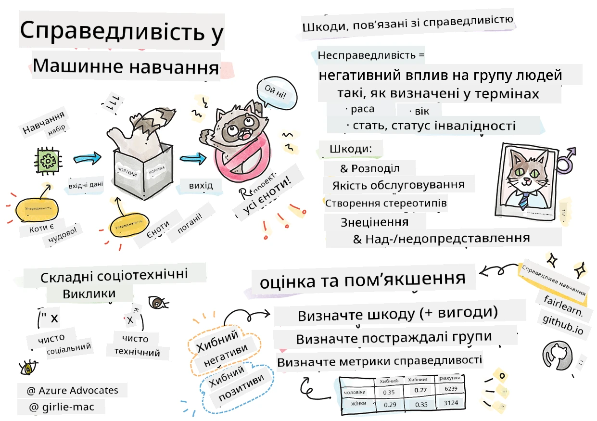
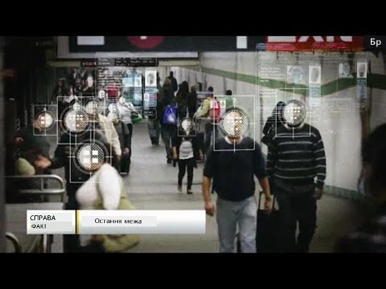

# Створення рішень машинного навчання з відповідальним ШІ
 

> Скетчноут від [Tomomi Imura](https://www.twitter.com/girlie_mac)

## [Тест перед лекцією](https://ff-quizzes.netlify.app/en/ml/)
 
## Вступ

У цій навчальній програмі ви почнете відкривати, як машинне навчання може впливати і вже впливає на наше повсякденне життя. Навіть зараз системи та моделі залучені до щоденних процесів прийняття рішень, таких як діагностика в охороні здоров’я, схвалення кредитів чи виявлення шахрайства. Тому важливо, щоб ці моделі працювали коректно, забезпечуючи надійні результати. Як і будь-який програмний додаток, системи штучного інтелекту можуть не виправдати очікувань або призвести до небажаних результатів. Ось чому важливо бути здатним розуміти та пояснювати поведінку моделі ШІ.

Уявіть, що станеться, коли дані, які ви використовуєте для створення цих моделей, не містять певних демографічних груп, таких як раса, стать, політичні погляди, релігія, або ж непропорційно представляють такі групи. А що, якщо результат моделі інтерпретують так, що вона надає перевагу певній демографічній категорії? Які наслідки це матиме для застосунку? Крім того, що відбувається, якщо модель дає несприятливий результат і шкодить людям? Хто несе відповідальність за поведінку системи ШІ? Ось деякі питання, які ми розглянемо в цій програмі.

У цьому уроці ви:

- Підвищите свою обізнаність щодо важливості справедливості в машинному навчанні та шкоди, пов’язаної з несправедливістю.
- Ознайомитеся з практикою вивчення аномалій та незвичних сценаріїв, щоб забезпечити надійність і безпеку.
- Отримаєте розуміння необхідності надання повноважень усім шляхом проектування інклюзивних систем.
- Дослідите, наскільки важливо захищати приватність і безпеку даних і людей.
- Побачите важливість підходу "прозорої скриньки" для пояснення поведінки моделей ШІ.
- Будете усвідомлювати, наскільки відповідальність є суттєвою для створення довіри до систем ШІ.

## Вимоги до підготовки

Як вимогу підготуйтеся, пройшовши навчальний шлях "Принципи відповідального ШІ" і перегляньте відео нижче на цю тему:

Дізнайтеся більше про відповідальний ШІ, дотримуючись цього [Навчального шляху](https://docs.microsoft.com/learn/modules/responsible-ai-principles/?WT.mc_id=academic-77952-leestott)

> 🎥 Натисніть на зображення вище для перегляду відео: Підхід Microsoft до відповідального ШІ

## Справедливість

Системи ШІ повинні ставитися до всіх справедливо і уникати різного ставлення до подібних груп людей. Наприклад, коли системи ШІ надають поради щодо медичного лікування, заявки на кредит або працевлаштування, вони повинні робити однакові рекомендації всім з подібними симптомами, фінансовими обставинами чи професійними кваліфікаціями. Кожен із нас має упередження, які впливають на наші рішення та дії. Ці упередження можуть бути помітними в даних, що використовуються для навчання систем ШІ. Іноді такі викривлення відбуваються ненавмисно. Часто важко свідомо усвідомити, коли ви вводите упередженість у дані.

**«Несправедливість»** охоплює негативні наслідки, або «шкоду», для групи людей, таких як визначені за расою, статтю, віком чи станом інвалідності. Основні типи шкоди, пов’язаної зі справедливістю, можна класифікувати як:

- **Розподіл**, якщо, наприклад, одна стать чи етнічна група мають перевагу над іншою.
- **Якість послуг.** Якщо ви тренуєте модель на одному конкретному сценарії, але реальність значно складніша, це призводить до поганої якості послуг. Наприклад, диспенсер для мила не розпізнавав людей з темною шкірою. [Посилання](https://gizmodo.com/why-cant-this-soap-dispenser-identify-dark-skin-1797931773)
- **Приниження.** Несправедливе критикування чи маркування чогось або когось. Наприклад, технологія маркування зображень сумно помилково позначила темношкірих людей як горил.
- **Надмірна або недостатня представленість.** Ідея полягає в тому, що певна група не представлена у певній професії, і будь-який сервіс чи функція, які сприяють цьому стану, спричиняють шкоду.
- **Стереотипізація.** Пов’язання певної групи з визначеними заздалегідь характеристиками. Наприклад, система перекладу між англійською та турецькою може мати помилки через слова з гендерними стереотипами.

> переклад турецькою

> переклад назад англійською

При проєктуванні та тестуванні систем ШІ слід забезпечити справедливість і уникнути програмування упереджених або дискримінаційних рішень, які також заборонені людині. Забезпечення справедливості в ШІ та машинному навчанні залишається складним соціотехнічним викликом.

### Надійність та безпека

Для здобуття довіри системи ШІ повинні бути надійними, безпечними та послідовними в нормальних і непередбачуваних умовах. Важливо знати, як системи ШІ поводитимуться у різних ситуаціях, особливо коли це вийняткові випадки. При створенні рішень ШІ потрібно приділяти значну увагу опрацюванню різних обставин, із якими система може зіштовхнутися. Наприклад, автомобіль з автопілотом повинен ставити безпеку людей на перше місце. Тому ШІ, що керує автомобілем, повинен враховувати всі можливі сценарії, з якими він може зіткнутися, такі як ніч, грози чи заметілі, діти, що раптово вибігають на дорогу, домашні тварини, дорожні роботи тощо. Наскільки добре система ШІ може ефективно і безпечно працювати в таких різних умовах, відображає рівень передбачення, який враховував дата-сайєнтист чи розробник ШІ при проєктуванні та тестуванні системи.

> [🎥 Натисніть тут для відео: ](https://www.microsoft.com/videoplayer/embed/RE4vvIl)

### Інклюзивність

Системи ШІ повинні бути спроектовані так, щоб залучати та надавати повноваження кожному. Під час розробки та впровадження систем дані науковці та розробники ШІ ідентифікують і усувають потенційні бар’єри в системі, які могли б ненавмисно виключати людей. Наприклад, у світі приблизно 1 мільярд людей з інвалідністю. Завдяки розвитку ШІ вони можуть легше отримувати широкий доступ до інформації та можливостей у своєму повсякденному житті. Усунення бар’єрів створює можливості для інновацій та розробки продуктів ШІ з кращим досвідом, що вигідний для всіх.

> [🎥 Натисніть тут для відео: інклюзивність у ШІ](https://www.microsoft.com/videoplayer/embed/RE4vl9v)

### Безпека та приватність

Системи ШІ повинні бути безпечними та поважати приватність людей. Люди менше довіряють системам, які ставлять під загрозу їхню приватність, інформацію чи життя. При навчанні моделей машинного навчання ми покладаємося на дані для отримання найкращих результатів. Тому важливо враховувати походження та цілісність даних. Наприклад, чи були дані надані користувачами або доступні публічно? Далі, під час роботи з даними, необхідно розробляти системи ШІ, які можуть захищати конфіденційну інформацію та протистояти атакам. З поширенням ШІ захист приватності і безпека важливої особистої та комерційної інформації стають дедалі більш критичними і складними. Питання приватності і безпеки даних потребують особливої уваги для ШІ, оскільки доступ до даних є необхідним для систем ШІ, щоб робити точні та обґрунтовані прогнози і прийняття рішень щодо людей.

> [🎥 Натисніть тут для перегляду відео: безпека в ШІ](https://www.microsoft.com/videoplayer/embed/RE4voJF)

- Як галузь ми зробили значні кроки у сфері приватності та безпеки, багато в чому завдяки регуляціям, таким як GDPR (Загальний регламент захисту даних).
- Але в системах ШІ необхідно враховувати напругу між потребою у більшій кількості персональних даних для підвищення персоналізації та ефективності – і приватністю.
- Подібно до народження підключених комп'ютерів з інтернетом, ми також спостерігаємо значне зростання кількості проблем з безпекою, що пов’язані із ШІ.
- Водночас ми бачимо, що ШІ використовується для покращення безпеки. Наприклад, більшість сучасних антивірусних сканерів працюють на основі евристики ШІ.
- Потрібно забезпечити, щоб наші процеси Data Science гармонійно поєднувалися з найсучаснішими практиками приватності та безпеки.

### Прозорість
Системи ШІ повинні бути зрозумілими. Важливою складовою прозорості є пояснення поведінки систем ШІ та їх компонентів. Покращення розуміння систем ШІ потребує, щоб зацікавлені сторони усвідомлювали, як і чому вони працюють, щоб мати змогу виявляти потенційні проблеми з продуктивністю, питання безпеки та приватності, упередження, виключення чи небажані результати. Також ми вважаємо, що ті, хто використовує системи ШІ, повинні бути чесними і відкритими про те, коли, чому та як вони обирають їх застосовувати. А також про обмеження систем, які вони використовують. Наприклад, якщо банк використовує систему ШІ для підтримки рішень щодо споживчих кредитів, важливо перевірити результати та зрозуміти, які дані впливають на рекомендації системи. Уряди починають регулювати ШІ у різних галузях, тому дата-сайентісти та організації мають пояснювати, чи відповідає система ШІ нормативним вимогам, особливо коли виникає небажаний результат.

> [🎥 Натисніть тут для відео: прозорість у ШІ](https://www.microsoft.com/videoplayer/embed/RE4voJF)

- Через складність систем ШІ важко зрозуміти їх роботу і інтерпретувати результати.
- Такий брак розуміння впливає на управління, експлуатацію і документацію цих систем.
- Ще важливіше, що брак розуміння впливає на рішення, прийняті на основі результатів, які продукують ці системи.

### Відповідальність
 
Особи, які проєктують і впроваджують системи ШІ, повинні нести відповідальність за те, як працюють їхні системи. Потреба у відповідальності особливо важлива для чутливих технологій, таких як розпізнавання облич. Останнім часом зростає попит на технологію розпізнавання облич, особливо від правоохоронних органів, які бачать її потенціал у використанні для пошуку зниклих дітей. Проте ці технології потенційно можуть застосовуватися урядом для порушення фундаментальних свобод громадян, наприклад, через постійне спостереження за конкретними особами. Тому дата-сайентісти і організації повинні відповідально ставитися до того, як їхня система ШІ впливає на окремих людей чи суспільство.

> 🎥 Натисніть на зображення вище для відео: Попередження про масове спостереження за допомогою розпізнавання облич

Зрештою, одне з найбільших питань для нашого покоління, як першого покоління, що впроваджує ШІ у суспільство, полягає в тому, як забезпечити, щоб комп’ютери залишалися підзвітними людям і як гарантувати, що ті, хто проєктує комп’ютери, залишаються відповідальними перед усіма.

## Оцінка впливу

Перед навчанням моделі машинного навчання важливо провести оцінку впливу, щоб зрозуміти призначення системи ШІ; її очікуване використання; де вона буде застосовуватися; і хто буде взаємодіяти із системою. Це допомагає рецензентам або тестувальникам системи знати, які фактори слід враховувати при виявленні потенційних ризиків і очікуваних наслідків.

Наступні сфери є предметом уваги під час проведення оцінки впливу:

* **Негативний вплив на окремих осіб.** Необхідно враховувати будь-які обмеження чи вимоги, нерекомендоване використання або будь-які відомі обмеження, що можуть перешкоджати роботі системи, щоб забезпечити, що система не використовується таким чином, що може зашкодити людям.
* **Вимоги до даних.** Розуміння того, як і де система використовуватиме дані, дозволяє рецензентам вивчити всі вимоги до даних (наприклад, регулювання GDPR чи HIPAA). Крім того, слід оцінити, чи є джерело або обсяг даних достатніми для навчання.
* **Підсумок впливу.** Зібрати список потенційних шкод, які можуть виникнути при використанні системи. Протягом життєвого циклу машинного навчання перевірте, чи вирішуються або пом’якшуються виявлені проблеми.
* **Застосовні цілі** для кожного з шести основних принципів. Оцініть, чи досягаються цілі кожного з принципів і чи є прогалини.

## Налагодження з відповідальним ШІ

Подібно до налагодження програмного додатку, налагодження системи ШІ є необхідним процесом виявлення та усунення проблем у системі. Існує багато факторів, що можуть вплинути на те, що модель не працює як очікувалося або відповідально. Більшість традиційних метрик продуктивності моделі є кількісними агрегатами, які недостатні для аналізу того, як модель порушує принципи відповідального ШІ. Крім того, модель машинного навчання є «чорною скринькою», що ускладнює розуміння причин її результатів або пояснення помилок. Пізніше в цьому курсі ми навчимося використовувати панель інструментів Responsible AI для допомоги у налагодженні систем ШІ. Ця панель надає цілісний інструмент для дата-сайентістів та розробників ШІ для виконання:

* **Аналізу помилок.** Для виявлення розподілу помилок моделі, що можуть впливати на справедливість або надійність системи.
* **Огляду моделі.** Щоб виявити, де існують розбіжності у продуктивності моделі між різними когортами даних.
* **Аналізу даних.** Щоб зрозуміти розподіл даних і виявити потенційну упередженість, що може призвести до проблем зі справедливістю, інклюзивністю та надійністю.
* **Інтерпретованості моделі.** Щоб зрозуміти, що впливає чи визначає прогнози моделі. Це допомагає пояснити поведінку моделі, що важливо для прозорості та відповідальності.

## 🚀 Виклик
 
Щоб запобігти запровадженню шкоди спочатку, ми повинні:

- мати різноманітність фонів і поглядів серед людей, що працюють над системами
- інвестувати у набори даних, які відображають різноманіття нашого суспільства
- розробляти кращі методи протягом життєвого циклу машинного навчання для виявлення та виправлення відповідального ШІ, коли він виникає

Подумайте про реальні сценарії, коли недовіра до моделі є очевидною в процесі створення та використання моделі. Що ще слід врахувати?

## [Тест після лекції](https://ff-quizzes.netlify.app/en/ml/)

## Підсумок і самостійне вивчення
 

У цьому уроці ви ознайомилися з основами концепцій справедливості та несправедливості в машинному навчанні.  
 
Перегляньте цей семінар, щоб поглибити знання з цих тем: 

- У прагненні до відповідального ШІ: впровадження принципів у практику від Бесміри Нуші, Мехрнуш Самекі та Аміта Шарми

> 🎥 Натисніть на зображення вище, щоб переглянути відео: RAI Toolbox: An open-source framework for building responsible AI від Бесміри Нуші, Мехрнуш Самекі та Аміта Шарми

Також читайте: 

- Центр ресурсів Microsoft з RAI: [Responsible AI Resources – Microsoft AI](https://www.microsoft.com/ai/responsible-ai-resources?activetab=pivot1%3aprimaryr4) 

- Дослідницька група FATE від Microsoft: [FATE: Fairness, Accountability, Transparency, and Ethics in AI - Microsoft Research](https://www.microsoft.com/research/theme/fate/) 

RAI Toolbox: 

- [Репозиторій Responsible AI Toolbox на GitHub](https://github.com/microsoft/responsible-ai-toolbox)

Читайте про інструменти Azure Machine Learning для забезпечення справедливості:

- [Azure Machine Learning](https://docs.microsoft.com/azure/machine-learning/concept-fairness-ml?WT.mc_id=academic-77952-leestott) 

## Завдання

[Вивчіть RAI Toolbox](assignment.md)

---

<!-- CO-OP TRANSLATOR DISCLAIMER START -->
**Відмова від відповідальності**:
Цей документ було перекладено за допомогою сервісу штучного інтелекту для перекладу [Co-op Translator](https://github.com/Azure/co-op-translator). Хоча ми прагнемо до точності, будь ласка, майте на увазі, що автоматичні переклади можуть містити помилки або неточності. Оригінальний документ рідною мовою слід вважати авторитетним джерелом. Для критично важливої інформації рекомендується професійний людський переклад. Ми не несемо відповідальності за будь-які непорозуміння або неправильні тлумачення, що виникли внаслідок використання цього перекладу.
<!-- CO-OP TRANSLATOR DISCLAIMER END -->