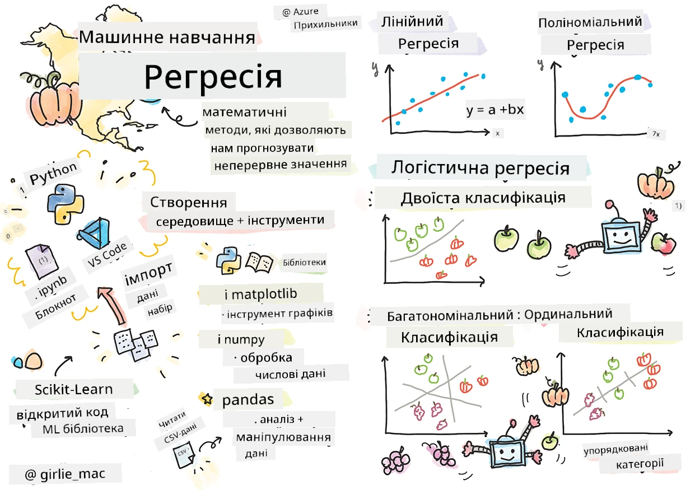
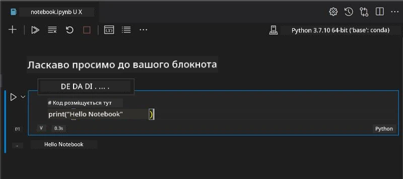
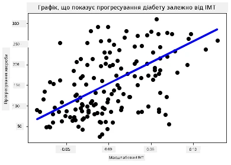

# Початок роботи з Python та Scikit-learn для регресійних моделей



> Скетчнот від [Tomomi Imura](https://www.twitter.com/girlie_mac)

## [Квіз перед лекцією](https://ff-quizzes.netlify.app/en/ml/)

> ### [Цей урок доступний на R!](../../../../2-Regression/1-Tools/solution/R/lesson_1.html)

## Вступ

У цих чотирьох уроках ви дізнаєтесь, як створювати регресійні моделі. Ми скоро розглянемо, для чого вони потрібні. Але перш ніж почати, переконайтеся, що у вас є всі необхідні інструменти для початку роботи!

У цьому уроці ви навчитеся:

- Налаштовувати свій комп’ютер для локальних завдань машинного навчання.
- Працювати з Jupyter Notebook.
- Використовувати Scikit-learn, у тому числі встановлення.
- Вивчати лінійну регресію на практичному прикладі.

## Встановлення та налаштування

[](https://youtu.be/-DfeD2k2Kj0 "ML для початківців - Налаштуйте свої інструменти для створення моделей машинного навчання")

> 🎥 Натисніть на зображення вище, щоб переглянути коротке відео про налаштування комп’ютера для ML.

1. **Встановіть Python**. Переконайтеся, що на вашому комп’ютері встановлено [Python](https://www.python.org/downloads/). Ви будете використовувати Python для багатьох завдань у сфері науки про дані та машинного навчання. Більшість комп’ютерних систем вже мають встановлений Python. Також є корисні [Python Coding Packs](https://code.visualstudio.com/learn/educators/installers?WT.mc_id=academic-77952-leestott), щоб полегшити налаштування для деяких користувачів.

   Однак деякі випадки використання Python вимагають однієї версії програмного забезпечення, тоді як інші – іншої. Тому корисно працювати у [віртуальному середовищі](https://docs.python.org/3/library/venv.html).

2. **Встановіть Visual Studio Code**. Переконайтеся, що у вас встановлено Visual Studio Code. Виконайте ці інструкції, щоб [встановити Visual Studio Code](https://code.visualstudio.com/) для базового встановлення. Ви будете використовувати Python у Visual Studio Code на цьому курсі, тому варто ознайомитися, як [налаштувати Visual Studio Code](https://docs.microsoft.com/learn/modules/python-install-vscode?WT.mc_id=academic-77952-leestott) для розробки на Python.

   > Ознайомтеся з Python, пройшовши цей набір [навчальних модулів](https://docs.microsoft.com/users/jenlooper-2911/collections/mp1pagggd5qrq7?WT.mc_id=academic-77952-leestott)
   >
   > [](https://youtu.be/yyQM70vi7V8 "Налаштування Python з Visual Studio Code")
   >
   > 🎥 Натисніть зображення вище, щоб переглянути відео про використання Python у VS Code.

3. **Встановіть Scikit-learn**, дотримуючись [інструкцій](https://scikit-learn.org/stable/install.html). Оскільки потрібно переконатися, що використовується Python 3, рекомендується використовувати віртуальне середовище. Зверніть увагу, що якщо ви встановлюєте цю бібліотеку на M1 Mac, на сторінці за посиланням є особливі інструкції.

1. **Встановіть Jupyter Notebook**. Вам потрібно буде [встановити пакет Jupyter](https://pypi.org/project/jupyter/).

## Ваше середовище для розробки ML

Ви будете використовувати **ноутбуки** для розробки коду на Python і створення моделей машинного навчання. Цей тип файлів є популярним інструментом для науковців-дослідників даних, їх можна впізнати за розширенням `.ipynb`.

Ноутбуки являють собою інтерактивне середовище, яке дозволяє розробнику і кодувати, і додавати нотатки, писати документацію навколо коду — це дуже корисно для експериментальних або дослідницьких проектів.

[](https://youtu.be/7E-jC8FLA2E "ML для початківців - Налаштуйте Jupyter Notebook для початку побудови регресійних моделей")

> 🎥 Натисніть зображення вище, щоб переглянути коротке відео з цього вправи.

### Вправа — робота з ноутбуком

У цій папці ви знайдете файл _notebook.ipynb_.

1. Відкрийте _notebook.ipynb_ у Visual Studio Code.

   Запуститься сервер Jupyter з Python 3+. Ви побачите частини ноутбука, які можна `запустити`, це блоки коду. Ви можете запустити блок коду, вибравши значок, що нагадує кнопку «play».

1. Виберіть значок `md` і додайте трохи markdown із наступним текстом **# Welcome to your notebook**.

   Далі додайте трохи коду на Python.

1. Введіть **print('hello notebook')** у блоці коду.
1. Виберіть стрілку, щоб виконати код.

   Ви маєте побачити надрукований рядок:

    ```output
    hello notebook
    ```



Ви можете переплітати свій код з коментарями для самодокументування ноутбука.

✅ Подумайте на хвилину, наскільки відрізняється робоче середовище веб-розробника від середовища дослідника даних.

## Запуск Scikit-learn

Тепер, коли Python налаштований у вашому локальному середовищі, і ви почуваєтеся комфортно з Jupyter Notebook, давайте так само освоїмо Scikit-learn (вимовляється `sci`, як у слові `science`). Scikit-learn надає [розгорнутий API](https://scikit-learn.org/stable/modules/classes.html#api-ref), який допомагає виконувати завдання ML.

За їхнім [вебсайтом](https://scikit-learn.org/stable/getting_started.html), "Scikit-learn — це бібліотека машинного навчання з відкритим кодом, що підтримує навчання з вчителем та без вчителя. Вона також надає різні інструменти для підгонки моделей, попередньої обробки даних, вибору та оцінки моделей, а також багато інших корисних утиліт."

На цьому курсі ви будете використовувати Scikit-learn і інші інструменти для створення моделей машинного навчання, які виконують те, що ми називаємо «традиційними завданнями машинного навчання». Ми свідомо не розглядали нейронні мережі і глибинне навчання, тому що вони краще висвітлені в майбутньому курсі «AI для початківців».

Scikit-learn робить побудову моделей і їх оцінку досить простою. Вона орієнтована насамперед на числові дані і містить кілька готових наборів даних для навчання. Також у ній є вбудовані моделі для студентів. Давайте спершу розглянемо процес завантаження попередньо упакованих даних і використання вбудованого оцінювача — першої ML-моделі у Scikit-learn з базовими даними.

## Вправа — ваш перший ноутбук з Scikit-learn

> Цей підручник натхненний [прикладом лінійної регресії](https://scikit-learn.org/stable/auto_examples/linear_model/plot_ols.html#sphx-glr-auto-examples-linear-model-plot-ols-py) на сайті Scikit-learn.


[](https://youtu.be/2xkXL5EUpS0 "ML для початківців — Ваш перший проект лінійної регресії на Python")

> 🎥 Натисніть зображення вище, щоб переглянути коротке відео з цієї вправи.

У файлі _notebook.ipynb_, що пов’язаний із цим уроком, очистіть усі клітинки, натиснувши значок «сміттєве відро».

У цьому розділі ви працюватимете з невеликим набором даних про діабет, який вбудований у Scikit-learn для навчальних цілей. Уявіть, що ви хочете перевірити лікування для пацієнтів з діабетом. Моделі машинного навчання можуть допомогти визначити, які пацієнти кращі кандидати для цього лікування, на основі комбінацій змінних. Навіть дуже базова регресійна модель, коли її візуалізувати, може показати інформацію про змінні, яка допоможе організувати ваші теоретичні клінічні випробування.

✅ Існує багато видів методів регресії, і який з них ви оберете, залежить від того, яке питання шукаєте. Якщо ви хочете передбачити ймовірний зріст людини певного віку, використовуйте лінійну регресію, тому що шукаєте **числове значення**. Якщо вам цікаво визначити, чи тип кухні слід вважати веганським чи ні, то вам потрібне **категорійне призначення**, тому використовуйте логістичну регресію. Ви дізнаєтесь більше про логістичну регресію пізніше. Подумайте, які запитання ви можете поставити до даних і які з методів будуть доцільнішими.

Давайте почнемо це завдання.

### Імпорт бібліотек

Для цього завдання імпортуємо такі бібліотеки:

- **matplotlib**. Це корисний [інструмент для графіків](https://matplotlib.org/), ми використаємо його для створення лінійного графіка.
- **numpy**. [numpy](https://numpy.org/doc/stable/user/whatisnumpy.html) — корисна бібліотека для роботи з числовими даними в Python.
- **sklearn**. Це бібліотека [Scikit-learn](https://scikit-learn.org/stable/user_guide.html).

Імпортуйте потрібні бібліотеки для ваших завдань.

1. Додайте імпорти, набравши наступний код:

   ```python
   import matplotlib.pyplot as plt
   import numpy as np
   from sklearn import datasets, linear_model, model_selection
   ```

   Ви імпортуєте `matplotlib`, `numpy` та імпортуєте `datasets`, `linear_model` і `model_selection` зі `sklearn`. `model_selection` використовується для розбиття даних на навчальні та тестові набори.

### Набір даних про діабет

Вбудований [набір даних про діабет](https://scikit-learn.org/stable/datasets/toy_dataset.html#diabetes-dataset) містить 442 зразки даних про діабет із 10 змінними-признаками, деякі з яких:

- age: вік у роках
- bmi: індекс маси тіла
- bp: середній кров’яний тиск
- s1 tc: Т-клітини (тип білих кров’яних клітин)

✅ Цей набір даних включає поняття 'стать' як важливу змінну-признак у дослідженнях діабету. Багато медичних наборів даних мають такого роду бінарну класифікацію. Подумайте, як такі категорії можуть виключати певні частини населення з лікувальних процедур.

Тепер завантажте дані X та y.

> 🎓 Пам’ятайте, що це навчання з учителем, і нам потрібна цільова змінна з ім'ям 'y'.

У новій клітинці коду завантажте набір даних про діабет, викликавши `load_diabetes()`. Параметр `return_X_y=True` означає, що `X` буде матрицею даних, а `y` — цільовою змінною регресії.

1. Додайте команди print, щоб показати форму матриці даних і її перший елемент:

    ```python
    X, y = datasets.load_diabetes(return_X_y=True)
    print(X.shape)
    print(X[0])
    ```

    Що ви отримуєте у відповідь — це кортеж. Ви присвоюєте перші два значення кортежу змінним `X` і `y` відповідно. Дізнайтеся більше [про кортежі](https://wikipedia.org/wiki/Tuple).

    Ви бачите, що дані містять 442 елементи, організовані в масиви по 10 елементів:

    ```text
    (442, 10)
    [ 0.03807591  0.05068012  0.06169621  0.02187235 -0.0442235  -0.03482076
    -0.04340085 -0.00259226  0.01990842 -0.01764613]
    ```

    ✅ Подумайте про залежність між даними і цільовою змінною регресії. Лінійна регресія передбачає зв’язки між характеристиками X і цільовою змінною y. Чи можете ви знайти [цільову змінну](https://scikit-learn.org/stable/datasets/toy_dataset.html#diabetes-dataset) у документації для набору даних про діабет? Що цей набір даних демонструє, враховуючи цю ціль?

2. Наступним кроком оберіть частину цього набору даних для побудови графіка, вибравши 3-й стовпець набору даних. Це можна зробити за допомогою оператора `:`, щоб вибрати всі рядки, а потім вибрати 3-й стовпець за індексом (2). Ви також можете змінити форму даних на 2D-масив — що потрібно для побудови графіків — за допомогою `reshape(n_rows, n_columns)`. Якщо один із параметрів — це -1, відповідний розмір обчислюється автоматично.

   ```python
   X = X[:, 2]
   X = X.reshape((-1,1))
   ```

   ✅ Любеочасно виводьте дані, щоб перевірити їх форму.

3. Тепер, коли у вас є дані для побудови графіків, можна перевірити, чи може машина допомогти визначити логічний розподіл для чисел у цьому наборі. Для цього потрібно розділити і дані (X), і ціль (y) на тестові та тренувальні набори. Scikit-learn має простий спосіб зробити це; ви можете розділити ваші тестові дані у вказаній точці.

   ```python
   X_train, X_test, y_train, y_test = model_selection.train_test_split(X, y, test_size=0.33)
   ```

4. Тепер ви готові навчити модель! Завантажте модель лінійної регресії та навчіть її на тренувальних наборах даних X і y, використовуючи `model.fit()`:

    ```python
    model = linear_model.LinearRegression()
    model.fit(X_train, y_train)
    ```

    ✅ `model.fit()` — це функція, яку ви побачите у багатьох бібліотеках ML на кшталт TensorFlow

5. Потім створіть передбачення, використовуючи тестові дані, через функцію `predict()`. Це буде використано для побудови лінії між групами даних.

    ```python
    y_pred = model.predict(X_test)
    ```

6. Тепер настав час показати дані на графіку. Matplotlib — дуже корисний інструмент для цього. Створіть розсіяний графік усіх тестових даних X і y, і використайте передбачення, щоб намалювати лінію в найбільш відповідному місці між групами даних моделі.

    ```python
    plt.scatter(X_test, y_test,  color='black')
    plt.plot(X_test, y_pred, color='blue', linewidth=3)
    plt.xlabel('Scaled BMIs')
    plt.ylabel('Disease Progression')
    plt.title('A Graph Plot Showing Diabetes Progression Against BMI')
    plt.show()
    ```

   


   ✅ Трохи подумайте про те, що тут відбувається. Пряма лінія проходить через багато маленьких точок даних, але що саме вона робить? Чи бачите ви, як можна використовувати цю лінію, щоб передбачити, де має розташовуватися нова, невідома точка даних відносно осі y графіка? Спробуйте висловити словами практичне застосування цієї моделі.

Вітаємо, ви побудували свою першу модель лінійної регресії, створили з її допомогою прогноз і відобразили це на графіку!

---
## 🚀Виклик

Відобразіть іншу змінну з цього набору даних. Підказка: відредагуйте цей рядок: `X = X[:,2]`. Враховуючи мету цього набору даних, що ви зможете дізнатися про прогресування діабету як хвороби?
## [Вікторина після лекції](https://ff-quizzes.netlify.app/en/ml/)

## Огляд та самостійне вивчення

У цьому підручнику ви працювали з простою лінійною регресією, а не з уніваріантною чи множинною лінійною регресією. Прочитайте трохи про відмінності між цими методами або перегляньте [це відео](https://www.coursera.org/lecture/quantifying-relationships-regression-models/linear-vs-nonlinear-categorical-variables-ai2Ef)

Дізнайтеся більше про концепцію регресії і подумайте, на які питання можна відповісти за допомогою цієї техніки. Пройдіть цей [підручник](https://docs.microsoft.com/learn/modules/train-evaluate-regression-models?WT.mc_id=academic-77952-leestott), щоб поглибити свої знання.

## Завдання

[Інший набір даних](assignment.md)

---

<!-- CO-OP TRANSLATOR DISCLAIMER START -->
**Відмова від відповідальності**:
Цей документ було перекладено за допомогою сервісу штучного інтелекту для перекладу [Co-op Translator](https://github.com/Azure/co-op-translator). Хоча ми прагнемо до точності, будь ласка, майте на увазі, що автоматичні переклади можуть містити помилки або неточності. Оригінальний документ рідною мовою слід вважати авторитетним джерелом. Для критично важливої інформації рекомендується професійний людський переклад. Ми не несемо відповідальності за будь-які непорозуміння або неправильні тлумачення, що виникли внаслідок використання цього перекладу.
<!-- CO-OP TRANSLATOR DISCLAIMER END -->