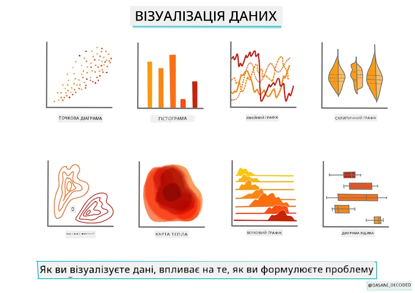
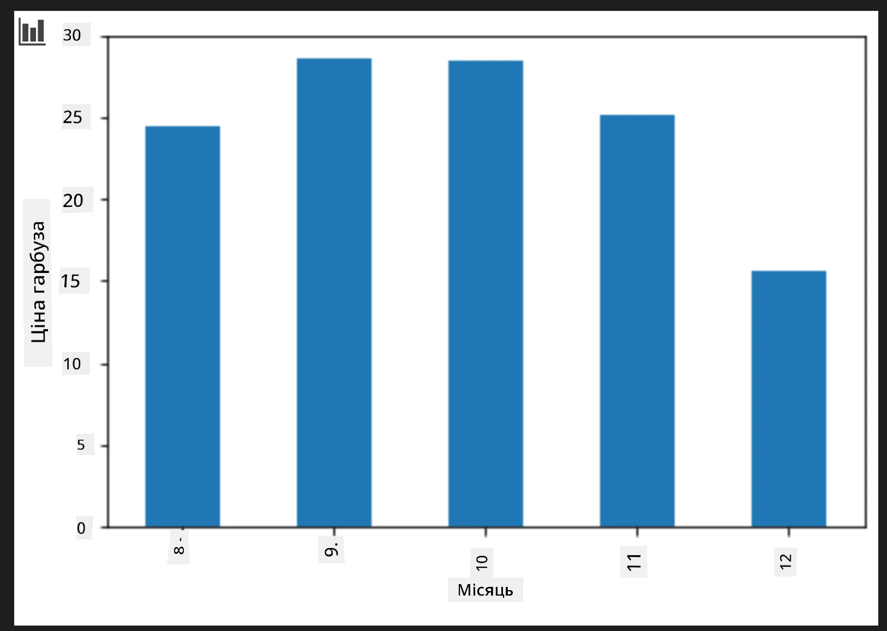
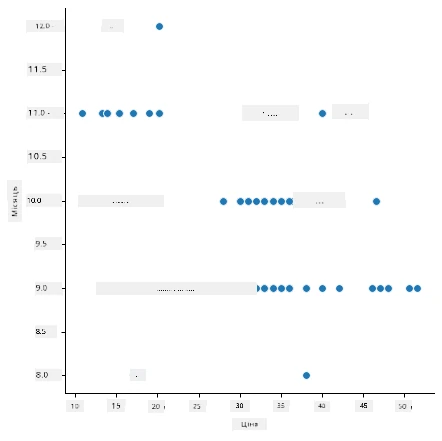
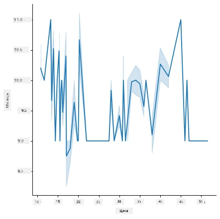
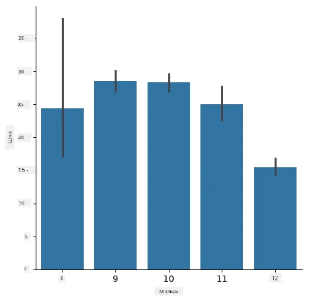
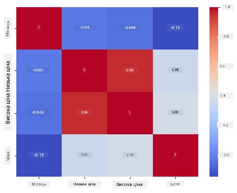

# Побудова регресійної моделі за допомогою Scikit-learn: підготовка та візуалізація даних



Інфографіка від [Dasani Madipalli](https://twitter.com/dasani_decoded)

## [Попередній квіз до лекції](https://ff-quizzes.netlify.app/en/ml/)

> ### [Цей урок доступний на R!](../../../../2-Regression/2-Data/solution/R/lesson_2.html)

## Вступ

Тепер, коли у вас є інструменти, необхідні для початку побудови моделей машинного навчання за допомогою Scikit-learn, ви готові почати ставити запитання до своїх даних. Працюючи з даними та застосовуючи рішення ML, дуже важливо розуміти, як поставити правильне запитання, щоб належним чином розкрити потенціал вашого набору даних.

У цьому уроці ви дізнаєтесь:

- Як підготувати дані до побудови моделі.
- Як використовувати Matplotlib для візуалізації даних.
- Як використовувати Seaborn для більш виразної візуалізації даних.

## Поставити правильне запитання до даних

Запитання, на яке ви хочете отримати відповідь, визначить, які типи алгоритмів машинного навчання ви будете використовувати. А якість отриманої відповіді значною мірою залежить від природи ваших даних.

Ознайомтесь із [даними](https://github.com/microsoft/ML-For-Beginners/blob/main/2-Regression/data/US-pumpkins.csv), наданими для цього уроку. Ви можете відкрити цей файл .csv у VS Code. Швидкий огляд одразу показує, що є пусті значення та суміш рядків і числових даних. Також є дивний стовпець під назвою 'Package', де дані є сумішшю 'сумок', 'ящиків' та інших значень. Дані, певно, трохи заплутані.

[](https://youtu.be/5qGjczWTrDQ "ML для початківців - Як аналізувати і чистити набір даних")

> 🎥 Натисніть на зображення вище для короткого відео про підготовку даних для цього уроку.

Насправді не дуже часто вам дають набір даних, який повністю готовий для побудови моделі ML прямо з коробки. У цьому уроці ви навчитеся готувати необроблений набір даних за допомогою стандартних бібліотек Python. Ви також дізнаєтесь різні техніки для візуалізації даних.

## Кейс: «ринок гарбузів»

У цій папці ви знайдете файл .csv у кореневій папці `data` під назвою [US-pumpkins.csv](https://github.com/microsoft/ML-For-Beginners/blob/main/2-Regression/data/US-pumpkins.csv), який містить 1757 рядків даних про ринок гарбузів, згрупованих за містами. Це необроблені дані, отримані з [Standard Reports Specialty Crops Terminal Markets](https://www.marketnews.usda.gov/mnp/fv-report-config-step1?type=termPrice), розповсюджуваних Міністерством сільського господарства США.

### Підготовка даних

Ці дані знаходяться у публічному доступі. Їх можна завантажити у багатьох окремих файлах по містах з сайту USDA. Щоб уникнути великої кількості окремих файлів, ми об’єднали всі міські дані в один електронний документ, тож ми вже трохи _підготували_ дані. Далі, давайте детальніше розглянемо ці дані.

### Дані про гарбузи — перші висновки

Що ви помітили у цих даних? Ви вже бачили, що є суміш рядків, чисел, пропусків і дивних значень, які потрібно зрозуміти.

Яке запитання ви можете поставити цим даним, використовуючи техніку регресії? Наприклад, «Прогнозуйте ціну гарбуза для продажу в певний місяць». Знову подивіться на дані — потрібно внести певні зміни, щоб створити структуру даних, необхідну для цієї задачі.
## Вправа – аналізуй дані про гарбузи

Давайте використаємо [Pandas](https://pandas.pydata.org/) (назва означає `Python Data Analysis`), дуже корисний інструмент для формування даних, щоб проаналізувати і підготувати ці дані про гарбузи.

### Спочатку, перевірте відсутні дати

Спершу треба зробити кроки, щоб перевірити відсутні дати:

1. Перетворіть дати у формат місяця (це дати США, формат `MM/DD/YYYY`).
2. Витягніть місяць у новий стовпець.

Відкрийте файл _notebook.ipynb_ у Visual Studio Code і імпортуйте електронну таблицю у новий dataframe Pandas.

1. Використайте функцію `head()` для перегляду перших п’яти рядків.

    ```python
    import pandas as pd
    pumpkins = pd.read_csv('../data/US-pumpkins.csv')
    pumpkins.head()
    ```

    ✅ Яку функцію використати для перегляду останніх п’яти рядків?

1. Перевірте, чи є відсутні дані у поточному dataframe:

    ```python
    pumpkins.isnull().sum()
    ```

    Є відсутні дані, але можливо це не має значення для поточного завдання.

1. Щоб працювати з dataframe було легше, виберіть лише потрібні стовпці за допомогою функції `loc`, яка вилучає з оригінального dataframe групу рядків (переданих першим параметром) і стовпців (переданих другим параметром). Вираз `:` в даному випадку означає «усі рядки».

    ```python
    columns_to_select = ['Package', 'Low Price', 'High Price', 'Date']
    pumpkins = pumpkins.loc[:, columns_to_select]
    ```

### По-друге, визначте середню ціну гарбуза

Подумайте, як визначити середню ціну гарбуза за певний місяць. Які стовпці вибрати для цього завдання? Підказка: вам потрібні 3 стовпці.

Розв’язок: візьміть середнє арифметичне від `Low Price` та `High Price`, щоб заповнити новий стовпець Price, а стовпець Date конвертуйте, щоб показувати лише місяць. На щастя, як показала перевірка, відсутніх даних за датами чи цінами немає.

1. Для обчислення середнього додайте такий код:

    ```python
    price = (pumpkins['Low Price'] + pumpkins['High Price']) / 2

    month = pd.DatetimeIndex(pumpkins['Date']).month

    ```

   ✅ За бажанням, можна вывести будь-які дані через `print(month)`.

2. Тепер скопіюйте конвертовані дані у новий Pandas dataframe:

    ```python
    new_pumpkins = pd.DataFrame({'Month': month, 'Package': pumpkins['Package'], 'Low Price': pumpkins['Low Price'],'High Price': pumpkins['High Price'], 'Price': price})
    ```

    Вивід вашого dataframe покаже чистий, акуратний набір даних, на якому можна будувати нову регресійну модель.

### Але почекайте! Тут є дещо дивне

Якщо подивитись на стовпець `Package`, гарбузи продаються у різних конфігураціях. Деякі продаються у мірі '1 1/9 бушеля', деякі — '1/2 бушеля', деякі — за штук, деякі — за фунт, а деякі у великих коробках різної ширини.

> Гарбуза здається дуже складно зважувати послідовно

Заглиблюючись в оригінальні дані, помітно, що все, що має `Unit of Sale`, рівне 'EACH' або 'PER BIN', також має тип `Package` "на дюйм", "на ящик" або 'кожен'. Гарбузи здаються дуже складними для послідовного зважування, тож давайте відфільтруємо їх, вибравши лише ті, у яких в стовпці `Package` є рядок 'bushel'.

1. Додайте фільтр на початку файлу, під початковим імпортом .csv:

    ```python
    pumpkins = pumpkins[pumpkins['Package'].str.contains('bushel', case=True, regex=True)]
    ```

    Якщо ви зараз виведете дані, побачите приблизно 415 рядків лише з гарбузами, проданими у бушелях.

### Але почекайте! Є ще одна справа

Ви помітили, що кількість бушелів варіюється по рядках? Потрібно нормалізувати цінування, щоб показувати ціну за один бушель, тож зробіть відповідні розрахунки для стандартизації.

1. Додайте такі рядки після блоку створення нового dataframe new_pumpkins:

    ```python
    new_pumpkins.loc[new_pumpkins['Package'].str.contains('1 1/9'), 'Price'] = price/(1 + 1/9)

    new_pumpkins.loc[new_pumpkins['Package'].str.contains('1/2'), 'Price'] = price/(1/2)
    ```

✅ За інформацією з [The Spruce Eats](https://www.thespruceeats.com/how-much-is-a-bushel-1389308), вага бушеля залежить від типу продукту, оскільки ця міра об’єму. «Наприклад, бушель томатів має важити 56 фунтів... Листя та зелень займають більше об’єму при меншій вазі, тому бушель шпинату важить лише 20 фунтів.» Це досить складно! Тож давайте не перейматимемось конвертацією бушель-фунт, а цінуватимемо за бушель. Вивчення бушелів гарбузів показує, наскільки важливо розуміти природу ваших даних!

Тепер ви можете аналізувати ціну за одиницю на основі їхнього значення у бушелях. Якщо вивести дані ще раз, побачите, як вони стандартизовані.

✅ Помітили, що гарбузи, що продаються по півбушеля, дуже дорогі? Чи можете зрозуміти чому? Підказка: маленькі гарбузи значно дорожчі за великі, ймовірно тому, що їх набагато більше на бушель, через невикористаний простір, зайнятий одним великим порожнистим гарбузом для пирога.

## Стратегії візуалізації

Частина ролі дата-сайентіста полягає у демонстрації якості та природи даних, з якими вони працюють. Для цього вони часто створюють цікаві візуалізації — діаграми, графіки, графіки, що демонструють різні аспекти даних. Таким чином вони можуть візуально показати взаємозв’язки та прогалини, які іншим чином важко виявити.

[](https://youtu.be/SbUkxH6IJo0 "ML для початківців - Як візуалізувати дані за допомогою Matplotlib")

> 🎥 Натисніть на зображення вище для короткого відео про візуалізацію даних для цього уроку.

Візуалізації також допомагають визначити найвдалішу техніку машинного навчання для даних. Наприклад, діаграма розсіювання, яка здається лінійною, вказує, що дані є хорошим кандидатом для лінійної регресії.

Однією з бібліотек для візуалізації даних, яка добре працює у Jupyter notebooks, є [Matplotlib](https://matplotlib.org/) (яку ви також бачили в попередньому уроці).

> Отримайте більше досвіду з візуалізації даних у [цих навчальних матеріалах](https://docs.microsoft.com/learn/modules/explore-analyze-data-with-python?WT.mc_id=academic-77952-leestott).

## Вправа – експериментуйте з Matplotlib

Спробуйте створити прості графіки, щоб відобразити новий dataframe, який ви щойно створили. Що покаже базовий лінійний графік?

1. Імпортуйте Matplotlib на початку файлу, під імпортом Pandas:

    ```python
    import matplotlib.pyplot as plt
    ```

1. Запустіть знову весь notebook, щоб оновити.
1. Додайте у кінці notebook клітинку для побудови графіка типу box:

    ```python
    price = new_pumpkins.Price
    month = new_pumpkins.Month
    plt.scatter(price, month)
    plt.show()
    ```

    

    Чи є цей графік корисним? Чи щось у ньому вас здивувало?

    Він не надто корисний, бо лише відображає ваші дані як розкидані точки у певному місяці.

### Зробіть його корисним

Щоб графіки показували корисні дані, зазвичай потрібно згрупувати їх якимось чином. Спробуємо створити графік, де вісь y показує місяці, а дані демонструють розподіл.

1. Додайте клітинку для створення групованої стовпчикової діаграми:

    ```python
    new_pumpkins.groupby(['Month'])['Price'].mean().plot(kind='bar')
    plt.ylabel("Pumpkin Price")
    ```

    

    Це більш корисна візуалізація даних! Вона здається свідченням того, що найвища ціна на гарбузи припадає на вересень та жовтень. Чи відповідає це вашим очікуванням? Чому так або ні?

## Вправа – експериментуйте з Seaborn

Matplotlib є потужним, але для створення відполірованих графіків може знадобитися багато коду. [Seaborn](https://seaborn.pydata.org/) — це бібліотека, побудована _на основі_ Matplotlib, розроблена для статистичної візуалізації даних. Вона працює напряму з dataframe Pandas, застосовує привабливі стилі за замовчуванням і дозволяє створювати інформативні графіки з набагато меншим кодом. Оскільки Seaborn повертає об'єкти Matplotlib, ви все одно можете використовувати все, що вже знаєте про Matplotlib, для тонкого налаштування результату.

> Якщо у вас ще немає Seaborn, встановіть її за допомогою `pip install seaborn`.

1. Імпортуйте Seaborn на початку ноутбуку під іншими імпортами. Зазвичай її імпортують як `sns`:

    ```python
    import seaborn as sns
    ```

### Діаграми розсіювання для показу взаємозв’язків

Велика частина дослідження даних перед побудовою моделі полягає у пошуку _взаємозв’язків_ між змінними. [Діаграма розсіювання](https://en.wikipedia.org/wiki/Scatter_plot) — один із найкращих інструментів для цього: якщо точки здаються розташованими вздовж прямої, дві змінні можуть бути пов’язані, що є хорошим знаком, що лінійна регресія може працювати.

1. Відтворіть діаграму розсіювання ціна-протягом місяця, цього разу використавши Seaborn [`relplot()`](https://seaborn.pydata.org/generated/seaborn.relplot.html) (реляційний графік), який безпосередньо працює зі стовпцями вашого dataframe:

    ```python
    sns.relplot(x="Price", y="Month", data=new_pumpkins)
    ```

    

    Зверніть увагу, що ви передаєте _імена стовпців_ та dataframe, а Seaborn сам опрацьовує підписи осей.

2. Ви можете переключитись на лінійний графік, передавши `kind="line"`. Seaborn також малює затінений діапазон, що показує довірчий інтервал навколо лінії:

    ```python
    sns.relplot(x="Price", y="Month", kind="line", data=new_pumpkins)
    ```

    

    Ці дані доволі шумні, тому лінійний графік тут не найчіткіший вибір — але він ілюструє, наскільки легко можна змінювати тип графіка в Seaborn.

### Стовпчикові діаграми для показу розподілів


Раніше ви вручну групували дані, щоб створити стовпчикову діаграму за допомогою Matplotlib. Seaborn's [`catplot()`](https://seaborn.pydata.org/generated/seaborn.catplot.html) (категоріальний графік) може виконати групування та агрегацію за вас. За замовчуванням `kind="bar"` показує середнє значення кожної категорії разом з чорною лінією, що позначає інтервал довіри.

1. Створіть стовпчикову діаграму середньої ціни за місяць:

    ```python
    sns.catplot(x="Month", y="Price", data=new_pumpkins, kind="bar")
    ```

    

    Це підтверджує те, що ви бачили з Matplotlib — ціни досягають піку приблизно у вересні та жовтні — але Seaborn також візуалізує, наскільки _варіюється_ ціна в кожному місяці.

### Теплові карти для показу кореляцій

Точкові діаграми порівнюють дві змінні одночасно. Коли у вас є декілька числових стовпців, [теплова карта](https://en.wikipedia.org/wiki/Heat_map) дозволяє побачити силу взаємозв’язку між _кожною_ парою стовпців одночасно. Це поширений спосіб визначити, які ознаки найкорельованіші перед вибором того, що вводити в модель (такий же вид діаграми пізніше використовується для відображення матриць плутанини в класифікації).

1. Побудуйте матрицю кореляцій за допомогою Pandas, а потім намалюйте її за допомогою Seaborn's [`heatmap()`](https://seaborn.pydata.org/generated/seaborn.heatmap.html). Опція `annot=True` виводить значення кореляції в кожній комірці:

    ```python
    correlations = new_pumpkins[['Month', 'Low Price', 'High Price', 'Price']].corr()
    sns.heatmap(correlations, annot=True, cmap="coolwarm")
    ```

    

    Значення, близькі до `1` (або `-1`), означають, що стовпці сильно _лінійно_ корельовані. Зверніть увагу, як `Low Price` та `High Price` майже ідеально корельовані. `Month`, натомість, показує лише слабку лінійну кореляцію з ціною — хоча стовпчикова діаграма вище виявила чіткий сезонний пік у вересні та жовтні. Це важливий урок: коефіцієнт кореляції вимірює лише _лінійні_ залежності, тож він може пропускати сезонні або інші нелінійні закономірності. ✅ Чому корисно дивитись і на теплову карту, *і* на діаграми на кшталт стовпчикової перед тим, як вирішувати, які стовпці використовувати?

### Matplotlib чи Seaborn?

Обидві бібліотеки варто знати:

- **Matplotlib** надає тонкий контроль над кожним елементом графіка і є основою, на якій побудовано майже всі інші бібліотеки для побудови графіків у Python.
- **Seaborn** надає функції вищого рівня і привабливі налаштування за замовчуванням для статистичних графіків, працює безпосередньо з датафреймами і часто швидший для дослідницького аналізу даних.

Поширений робочий процес — спочатку звертатись до Seaborn, щоб швидко дослідити дані, а потім переходити до Matplotlib для налаштування деталей.

---

## 🚀Виклик

Дослідіть різні типи візуалізації, які пропонують Matplotlib і Seaborn. Які типи найбільше підходять для задач регресії?

## [Післялекційний тест](https://ff-quizzes.netlify.app/en/ml/)

## Огляд і самоосвіта

Ознайомтеся з численними способами візуалізації даних. Складіть перелік різних бібліотек і відмітьте, які найкраще підходять для певних типів завдань, наприклад 2D візуалізації проти 3D-візуалізації. Що ви виявите?

## Завдання

[Дослідження візуалізації](assignment.md)

---

<!-- CO-OP TRANSLATOR DISCLAIMER START -->
**Відмова від відповідальності**:
Цей документ було перекладено за допомогою сервісу штучного інтелекту для перекладу [Co-op Translator](https://github.com/Azure/co-op-translator). Хоча ми прагнемо до точності, будь ласка, майте на увазі, що автоматичні переклади можуть містити помилки або неточності. Оригінальний документ рідною мовою слід вважати авторитетним джерелом. Для критично важливої інформації рекомендується професійний людський переклад. Ми не несемо відповідальності за будь-які непорозуміння або неправильні тлумачення, що виникли внаслідок використання цього перекладу.
<!-- CO-OP TRANSLATOR DISCLAIMER END -->