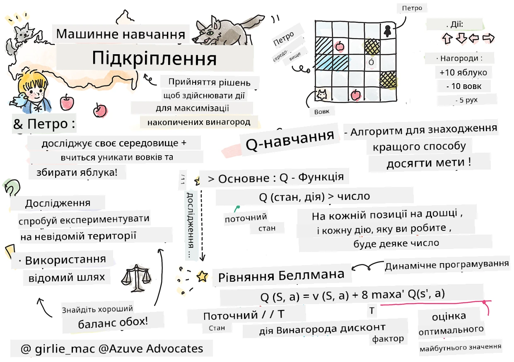

# Вступ до навчання з підкріпленням і Q-навчання


> Скетчноут від [Tomomi Imura](https://www.twitter.com/girlie_mac)

Навчання з підкріпленням включає три важливі поняття: агент, деякі стани та набір дій для кожного стану. Виконуючи дію в певному стані, агент отримує винагороду. Знову уявіть комп’ютерну гру Super Mario. Ви — Маріо, ви знаходитеся на рівні гри, стоїте біля краю обриву. Над вами висить монета. Ви, як Маріо, на рівні гри, в конкретній позиції ... це і є ваш стан. Рух на один крок вправо (дія) призведе до падіння з обриву, що дасть вам низький числовий бал. Однак натискання кнопки стрибка дозволить вам набрати очко і залишитися в живих. Це позитивний результат, і він має дати позитивний числовий бал.

Використовуючи навчання з підкріпленням і симулятор (гру), ви можете навчитися грати так, щоб максимізувати винагороду — виживання і набір якомога більшої кількості очок.

[](https://www.youtube.com/watch?v=lDq_en8RNOo)

> 🎥 Натисніть на зображення вище, щоб послухати Дмитра про навчання з підкріпленням

## [Попередній тест перед лекцією](https://ff-quizzes.netlify.app/en/ml/)

## Вимоги та налаштування

У цьому уроці ми експериментуватимемо з деяким кодом на Python. Ви повинні мати змогу запускати код Jupyter Notebook з цього уроку або на вашому комп’ютері, або десь у хмарі.

Ви можете відкрити [ноутбук уроку](https://github.com/microsoft/ML-For-Beginners/blob/main/8-Reinforcement/1-QLearning/notebook.ipynb) та пройти цей урок покроково.

> **Примітка:** Якщо ви відкриваєте цей код у хмарі, вам потрібно також отримати файл [`rlboard.py`](https://github.com/microsoft/ML-For-Beginners/blob/main/8-Reinforcement/1-QLearning/rlboard.py), який використовується в коді ноутбука. Додайте його в той самий каталог, що й ноутбук.

## Вступ

У цьому уроці ми дослідимо світ **[Петрика та вовка](https://uk.wikipedia.org/wiki/%D0%9F%D0%B5%D1%82%D1%80%D0%B8%D0%BA_%D1%82%D0%B0_%D0%B2%D0%BE%D0%B2%D0%BA)**, натхненний музичною казкою російського композитора [Сергія Прокоф’єва](https://uk.wikipedia.org/wiki/%D0%A1%D0%B5%D1%80%D0%B3%D1%96%D0%B9_%D0%9F%D1%80%D0%BE%D0%BA%D0%BE%D1%84%E2%80%99%D1%94%D0%B2). Ми використовуватимемо **Навчання з підкріпленням**, щоб дозволити Петрику досліджувати своє оточення, збирати смачні яблука й уникати зустрічі з вовком.

**Навчання з підкріпленням** (RL) — це метод навчання, який дозволяє нам навчатися оптимальній поведінці **агента** в певному **оточенні** шляхом проведення численних експериментів. Агент у цьому оточенні повинен мати якусь **мету**, визначену за допомогою **функції винагороди**.

## Оточення

Для спрощення розглянемо світ Петрика як квадратну дошку розміром `width` x `height`, як от так:


Кожна клітинка цієї дошки може бути:

* **ґрунтом**, по якому можуть ходити Петрик та інші істоти.
* **водою**, по якій, звичайно, ходити не можна.
* **деревом** або **травою**, місцем для відпочинку.
* **яблуком**, яке символізує щось, що Петрик із задоволенням знайшов би, щоб поїсти.
* **вовком**, який є небезпечним і якого слід уникати.

Є окремий модуль Python, [`rlboard.py`](https://github.com/microsoft/ML-For-Beginners/blob/main/8-Reinforcement/1-QLearning/rlboard.py), який містить код для роботи з цим оточенням. Оскільки цей код не є важливим для розуміння наших концепцій, ми імпортуємо модуль і використаємо його для створення прикладної дошки (код блок 1):

```python
from rlboard import *

width, height = 8,8
m = Board(width,height)
m.randomize(seed=13)
m.plot()
```

Цей код має вивести зображення оточення, подібне до наведеного вище.

## Дії та стратегія

У нашому прикладі метою Петрика буде знайти яблуко, уникаючи вовка та інших перешкод. Для цього він може ходити по світу, доки не знайде яблуко.

Тому в будь-якій позиції він може вибрати одну з наступних дій: вгору, вниз, вліво або вправо.

Ми визначимо ці дії у вигляді словника, зіставляючи їх із відповідними змінами координат. Наприклад, рух вправо (`R`) відповідатиме парі `(1,0)`. (код блок 2):

```python
actions = { "U" : (0,-1), "D" : (0,1), "L" : (-1,0), "R" : (1,0) }
action_idx = { a : i for i,a in enumerate(actions.keys()) }
```

Підсумовуючи, стратегія і мета цього сценарію такі:

- **Стратегія** нашого агента (Петрика) визначається так званою **політикою**. Політика — це функція, яка повертає дію для будь-якого стану. У нашому випадку стан проблеми представлений дошкою, включно з поточною позицією гравця.

- **Мета** навчання з підкріпленням полягає в тому, щоб зрештою навчитися хорошій політиці, яка дозволить ефективно розв’язувати задачу. Однак для початку розглянемо найпростіший варіант — політику, що називається **випадковим кроком**.

## Випадковий крок

Спочатку розв'яжемо нашу задачу, реалізувавши стратегію випадкового кроку. З випадковим кроком ми випадково вибиратимемо наступну дію з дозволених дій, доки не дійдемо до яблука (код блок 3).

1. Реалізуйте випадковий крок з наведеним нижче кодом:

    ```python
    def random_policy(m):
        return random.choice(list(actions))
    
    def walk(m,policy,start_position=None):
        n = 0 # кількість кроків
        # встановити початкову позицію
        if start_position:
            m.human = start_position 
        else:
            m.random_start()
        while True:
            if m.at() == Board.Cell.apple:
                return n # успіх!
            if m.at() in [Board.Cell.wolf, Board.Cell.water]:
                return -1 # з’їдений вовком або втопився
            while True:
                a = actions[policy(m)]
                new_pos = m.move_pos(m.human,a)
                if m.is_valid(new_pos) and m.at(new_pos)!=Board.Cell.water:
                    m.move(a) # зробити фактичний рух
                    break
            n+=1
    
    walk(m,random_policy)
    ```

    Виклик `walk` має повернути довжину відповідного шляху, яка може відрізнятися від запуску до запуску.

1. Запустіть експеримент з ходіння кілька разів (скажімо, 100) та виведіть статистику (код блок 4):

    ```python
    def print_statistics(policy):
        s,w,n = 0,0,0
        for _ in range(100):
            z = walk(m,policy)
            if z<0:
                w+=1
            else:
                s += z
                n += 1
        print(f"Average path length = {s/n}, eaten by wolf: {w} times")
    
    print_statistics(random_policy)
    ```

    Зверніть увагу, що середня довжина шляху приблизно 30-40 кроків, що досить багато, враховуючи, що середня відстань до найближчого яблука становить близько 5-6 кроків.

    Також ви можете побачити, як виглядає рух Петрика під час випадкового кроку:

    

## Функція винагороди

Щоб зробити нашу політику розумнішою, потрібно зрозуміти, які ходи "кращі" за інші. Для цього слід визначити нашу мету.

Мету можна визначити за допомогою **функції винагороди**, яка повертатиме значення балу для кожного стану. Чим більше число, тим краща функція винагороди. (код блок 5)

```python
move_reward = -0.1
goal_reward = 10
end_reward = -10

def reward(m,pos=None):
    pos = pos or m.human
    if not m.is_valid(pos):
        return end_reward
    x = m.at(pos)
    if x==Board.Cell.water or x == Board.Cell.wolf:
        return end_reward
    if x==Board.Cell.apple:
        return goal_reward
    return move_reward
```

Цікаво, що у більшості випадків *значуща винагорода з’являється лише в кінці гри*. Це означає, що наш алгоритм повинен якось запам'ятовувати "хороші" кроки, які призводять до позитивної винагороди в кінці, і збільшувати їх вагу. Аналогічно, усі ходи, що ведуть до поганих результатів, слід уникати.

## Q-навчання

Алгоритм, який ми розглянемо, називається **Q-навчанням**. У цьому алгоритмі політика визначається функцією (або структурую даних), яка називається **Q-таблицею**. Вона фіксує "корисність" кожної дії в певному стані.

Його назвали Q-таблицею, бо зазвичай її зручно представляти у вигляді таблиці або багатовимірного масиву. Оскільки наша дошка має розмір `width` x `height`, ми можемо представити Q-таблицю як numpy масив форми `width` x `height` x `len(actions)`: (код блок 6)

```python
Q = np.ones((width,height,len(actions)),dtype=np.float)*1.0/len(actions)
```

Зауважте, що ми ініціалізуємо всі значення Q-таблиці однаковим значенням — у нашому випадку 0.25. Це відповідає політиці "випадкового кроку", тому що всі ходи в кожному стані рівноцінні. Ми можемо передати Q-таблицю функції `plot`, щоб візуалізувати таблицю на дошці: `m.plot(Q)`.


У центрі кожної клітинки є "стрілка", яка вказує бажаний напрямок руху. Оскільки всі напрямки рівні, відображається крапка.

Тепер нам потрібно запустити симуляцію, дослідити наше оточення і навчитися кращому розподілу значень Q-таблиці, що дозволить швидше знаходити шлях до яблука.

## Суть Q-навчання: рівняння Беллмана

Щойно ми почнемо рух, кожна дія матиме відповідну винагороду, тобто ми теоретично можемо обирати наступну дію за максимальною негайною винагородою. Проте в більшості станів хід не приведе до нашої мети — досягнення яблука, і ми не можемо одразу визначити, який напрямок кращий.

> Пам’ятайте, важливий не негайний результат, а фінальний, який ми отримаємо в кінці симуляції.

Щоб врахувати цю відкладену винагороду, потрібно застосувати принципи **[динамічного програмування](https://uk.wikipedia.org/wiki/%D0%94%D0%B8%D0%BD%D0%B0%D0%BC%D1%96%D1%87%D0%BD%D0%B5_%D0%BF%D1%80%D0%BE%D0%B3%D1%80%D0%B0%D0%BC%D1%83%D0%B2%D0%B0%D0%BD%D0%BD%D1%8F)**, які дозволяють рекурсивно мислити над задачею.

Припустимо, ми зараз у стані *s* і хочемо перейти до наступного стану *s'*. Виконуючи це, ми отримаємо негайну винагороду *r(s,a)*, задану функцією винагороди, плюс деяку майбутню винагороду. Якщо припустити, що наша Q-таблиця правильно відображає "привабливість" кожної дії, то в стані *s'* ми оберемо дію *a*, яка відповідає максимальному значенню *Q(s',a')*. Тож найкраща можлива майбутня винагорода в стані *s* визначається як `max`<sub>a'</sub>*Q(s',a')* (максимум обчислюється серед усіх можливих дій *a'* у стані *s'*).

Це дає **формулу Беллмана** для обчислення значення Q-таблиці в стані *s*, виконуючи дію *a*:


Тут γ — так званий **коефіцієнт дисконтування**, який визначає, наскільки ви повинні віддавати перевагу поточній винагороді над майбутньою і навпаки.

## Алгоритм навчання

Враховуючи наведене рівняння, тепер можемо написати псевдокод для нашого алгоритму навчання:

* Ініціалізувати Q-таблицю Q однаковими числами для всіх станів і дій
* Встановити швидкість навчання α ← 1
* Повторювати симуляцію багато разів
   1. Починаємо з випадкової позиції
   1. Повторюємо
        1. Обрати дію *a* в стані *s*
        2. Виконати дію, перейшовши у новий стан *s'*
        3. Якщо досягнуто кінця гри або загальна винагорода надто мала — вийти з симуляції  
        4. Обчислити винагороду *r* у новому стані
        5. Оновити Q-функцію згідно з формулою Беллмана: *Q(s,a)* ← *(1-α)Q(s,a)+α(r+γ max<sub>a'</sub>Q(s',a'))*
        6. *s* ← *s'*
        7. Оновити загальну винагороду та зменшити α.

## Використання vs дослідження

У наведеному алгоритмі ми не вказали, як саме обирати дію на кроці 2.1. Якщо обирати дію випадково, ми будемо випадково **досліджувати** оточення, і, ймовірно, часто вмирати, а також досліджувати області, куди зазвичай не ходимо. Альтернативою є **використання** значень Q-таблиці, які ми вже знаємо, й обирати найкращу дію (з вищим значенням Q-таблиці) для стану *s*. Однак це завадить нам дослідити інші стани, і ми можемо не знайти оптимальне рішення.

Тож найкраще — знайти баланс між дослідженням і використанням. Це можна зробити, вибираючи дію в стані *s* з імовірностями, пропорційними значенням у Q-таблиці. На початку, коли значення Q-таблиці однакові, це відповідатиме випадковому вибору, але з набуттям досвіду ми частіше обиратимемо оптимальний маршрут, дозволяючи агенту іноді обирати ще не досліджений шлях.

## Реалізація на Python

Тепер ми готові реалізувати алгоритм навчання. Перед цим нам потрібна функція, яка перетворюватиме довільні числа у Q-таблиці в вектор ймовірностей дій.

1. Створіть функцію `probs()`:

    ```python
    def probs(v,eps=1e-4):
        v = v-v.min()+eps
        v = v/v.sum()
        return v
    ```

    Додаємо кілька `eps` до початкового вектора, щоб уникнути ділення на 0 у початковому випадку, коли всі компоненти вектора однакові.

Запустіть алгоритм навчання через 5000 експериментів, які також називаються **епохами**: (код блок 8)
```python
    for epoch in range(5000):
    
        # Виберіть початкову точку
        m.random_start()
        
        # Почати рух
        n=0
        cum_reward = 0
        while True:
            x,y = m.human
            v = probs(Q[x,y])
            a = random.choices(list(actions),weights=v)[0]
            dpos = actions[a]
            m.move(dpos,check_correctness=False) # ми дозволяємо гравцю виходити за межі дошки, що припиняє епізод
            r = reward(m)
            cum_reward += r
            if r==end_reward or cum_reward < -1000:
                lpath.append(n)
                break
            alpha = np.exp(-n / 10e5)
            gamma = 0.5
            ai = action_idx[a]
            Q[x,y,ai] = (1 - alpha) * Q[x,y,ai] + alpha * (r + gamma * Q[x+dpos[0], y+dpos[1]].max())
            n+=1
```

Після виконання цього алгоритму Q-таблиця має оновитися значеннями, які визначають привабливість різних дій на кожному кроці. Ми можемо спробувати візуалізувати Q-таблицю, намалювавши вектор у кожній клітинці, який показуватиме бажаний напрямок руху. Для простоти замість стрілки малюємо маленьке коло.


## Перевірка політики

Оскільки Q-таблиця містить "привабливість" кожної дії для кожного стану, за її допомогою досить легко визначити ефективну навігацію нашим світом. У найпростішому випадку ми можемо вибрати дію з максимальним значенням Q-таблиці: (код блок 9)

```python
def qpolicy_strict(m):
        x,y = m.human
        v = probs(Q[x,y])
        a = list(actions)[np.argmax(v)]
        return a

walk(m,qpolicy_strict)
```


> Якщо ви кілька разів спробуєте код вище, ви можете помітити, що іноді він "зависає", і вам потрібно натиснути кнопку СТОП у записнику, щоб перервати його. Це відбувається тому, що можуть бути ситуації, коли два стани "вказують" один на одного з точки зору оптимального Q-значення, у якому випадку агент зрештою рухається між цими станами безкінечно.

## 🚀Виклик

> **Завдання 1:** Змініть функцію `walk`, щоб обмежити максимальну довжину шляху певною кількістю кроків (скажімо, 100), і спостерігайте, як код вище час від часу повертає це значення.

> **Завдання 2:** Змініть функцію `walk` так, щоб вона не поверталась у ті місця, де вже була раніше. Це запобігатиме зацикленню `walk`, але агент все ще може опинитись "зачиненим" у локації, з якої не зможе вибратись.

## Навігація

Кращою навігаційною політикою буде та, яку ми використовували під час навчання, що поєднує експлуатацію і дослідження. У цій політиці ми вибиратимемо кожну дію з певною ймовірністю, пропорційною значенням у Q-таблиці. Ця стратегія все ще може призводити до того, що агент повертається у позицію, яку він вже дослідив, але, як ви бачите з коду нижче, це призводить до дуже короткого середнього шляху до бажаного місця (пам’ятайте, що `print_statistics` запускає симуляцію 100 разів): (код блоку 10)

```python
def qpolicy(m):
        x,y = m.human
        v = probs(Q[x,y])
        a = random.choices(list(actions),weights=v)[0]
        return a

print_statistics(qpolicy)
```

Після запуску цього коду ви повинні отримати значно меншу середню довжину шляху, ніж раніше, у діапазоні 3-6.

## Дослідження процесу навчання

Як ми вже згадували, процес навчання — це баланс між дослідженням і використанням набутого знання про структуру простору задачі. Ми бачили, що результати навчання (здатність допомогти агенту знайти короткий шлях до мети) покращились, але також цікаво спостерігати, як поведінка середньої довжини шляху змінюється під час навчання:


Навчання можна підсумувати так:

- **Середня довжина шляху зростає**. Ми бачимо, що спочатку середня довжина шляху зростає. Це, ймовірно, пов’язано з тим, що коли ми нічого не знаємо про середовище, ми, найімовірніше, потрапляємо у погані стани, воду або вовка. Коли ми вчимося більше і починаємо використовувати це знання, ми можемо довше досліджувати середовище, але все ще не дуже добре знаємо, де знаходяться яблука.

- **Довжина шляху зменшується, коли ми вчимося більше**. Як тільки ми вчимося достатньо, агенту стає легше досягти мети, і довжина шляху починає зменшуватись. Однак ми все ще відкриті для досліджень, тому часто відходимо від найкращого шляху й досліджуємо нові варіанти, що робить шлях довшим за оптимальний.

- **Раптове збільшення довжини**. Також на цьому графіку спостерігається раптове збільшення довжини. Це свідчить про стохастичний характер процесу і той факт, що ми в якийсь момент можемо "погіршити" коефіцієнти Q-таблиці, перезаписуючи їх новими значеннями. Це бажано мінімізувати, зменшуючи швидкість навчання (наприклад, до кінця навчання ми коригуємо значення Q-таблиці лише на невелике значення).

В цілому важливо пам’ятати, що успіх і якість процесу навчання значною мірою залежать від параметрів, таких як швидкість навчання, зменшення швидкості навчання та коефіцієнт дисконтування. Їх часто називають **гіперпараметрами**, щоб відрізнити від **параметрів**, які ми оптимізуємо під час навчання (наприклад, коефіцієнти Q-таблиці). Процес пошуку найкращих значень гіперпараметрів називається **оптимізацією гіперпараметрів** і заслуговує окремої теми.

## [Вікторина після лекції](https://ff-quizzes.netlify.app/en/ml/)

## Завдання 
[Більш реалістичний світ](assignment.md)

---

<!-- CO-OP TRANSLATOR DISCLAIMER START -->
**Відмова від відповідальності**:
Цей документ було перекладено за допомогою сервісу штучного інтелекту для перекладу [Co-op Translator](https://github.com/Azure/co-op-translator). Хоча ми прагнемо до точності, будь ласка, майте на увазі, що автоматичні переклади можуть містити помилки або неточності. Оригінальний документ рідною мовою слід вважати авторитетним джерелом. Для критично важливої інформації рекомендується професійний людський переклад. Ми не несемо відповідальності за будь-які непорозуміння або неправильні тлумачення, що виникли внаслідок використання цього перекладу.
<!-- CO-OP TRANSLATOR DISCLAIMER END -->