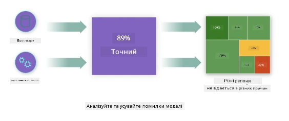
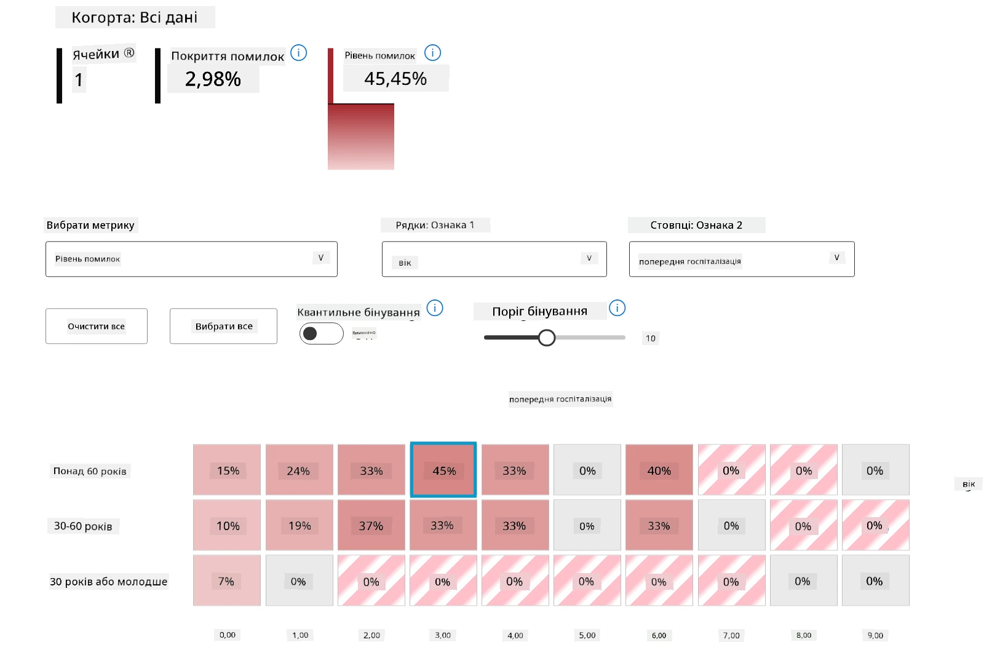
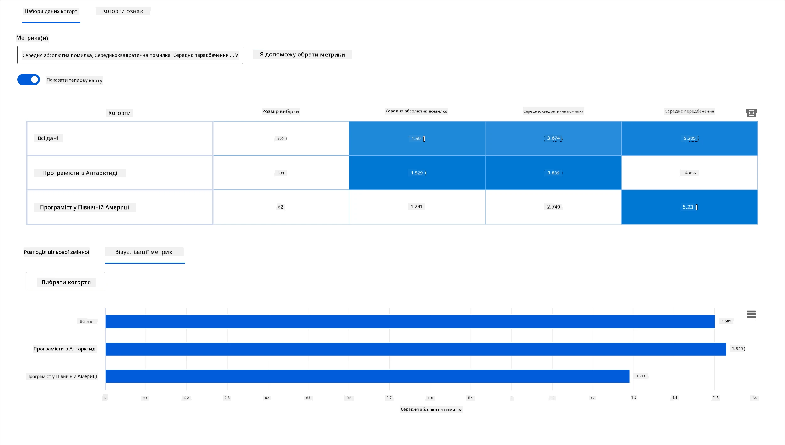
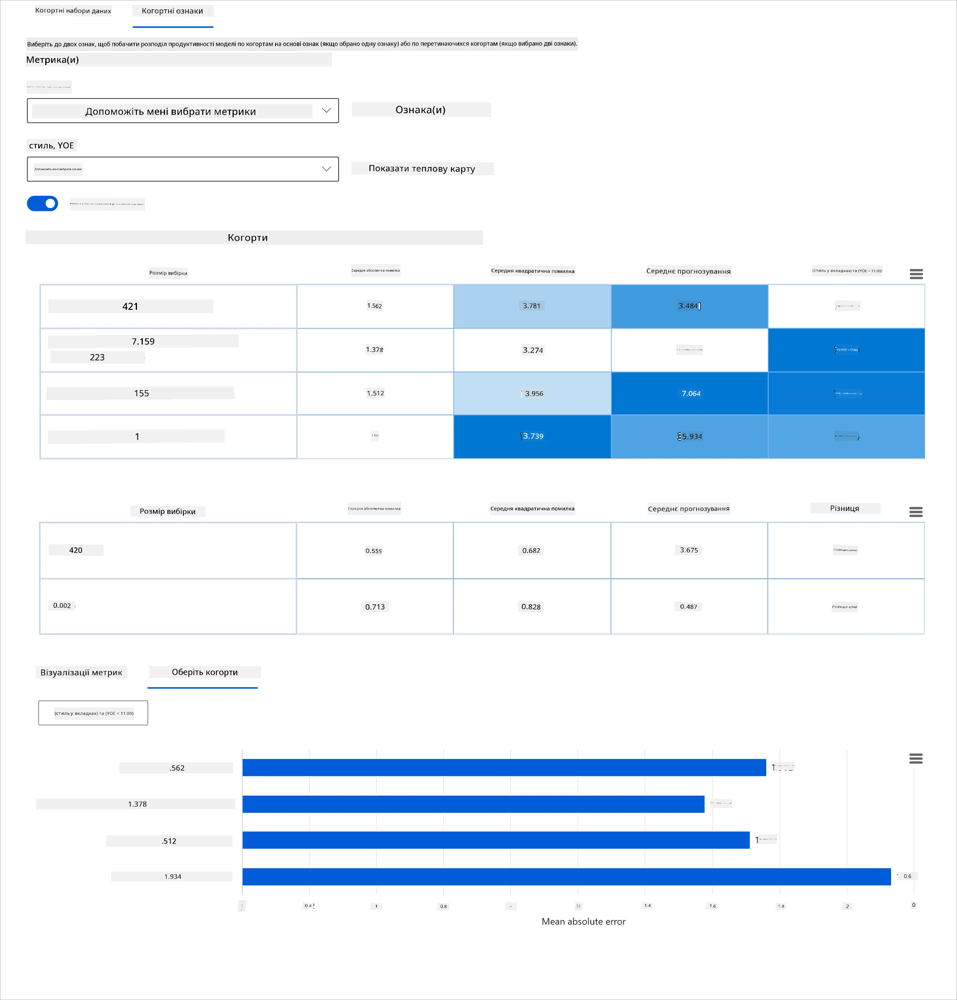
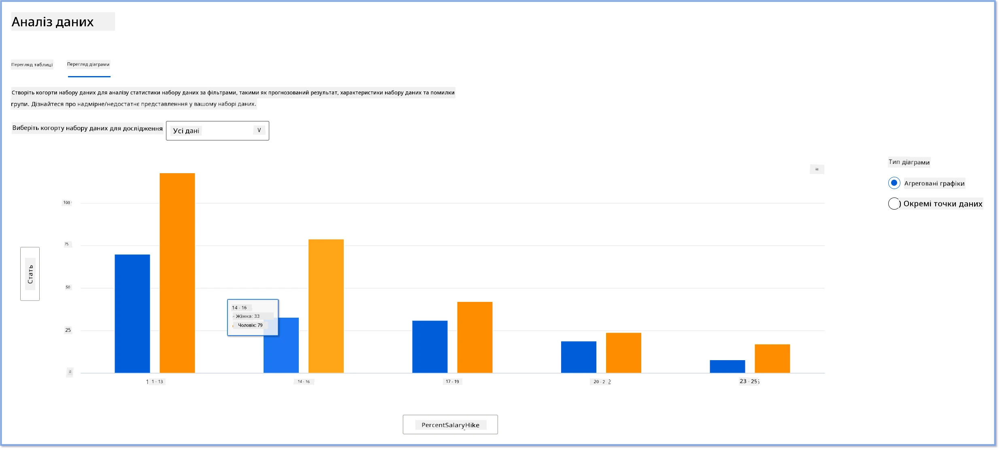
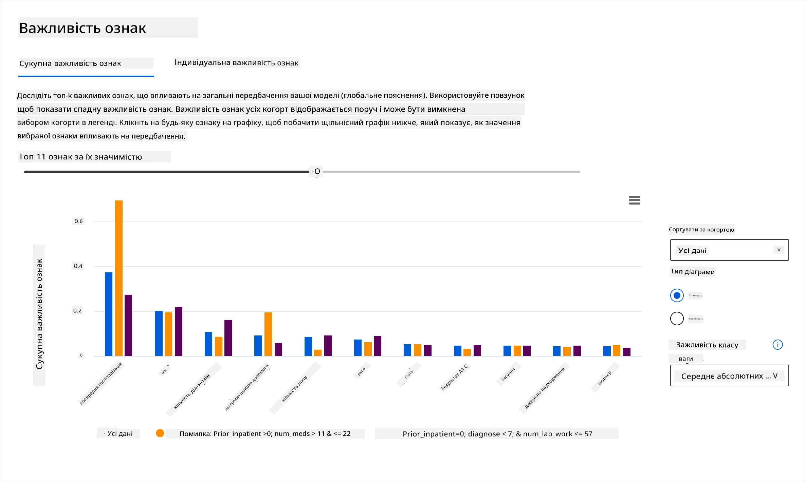
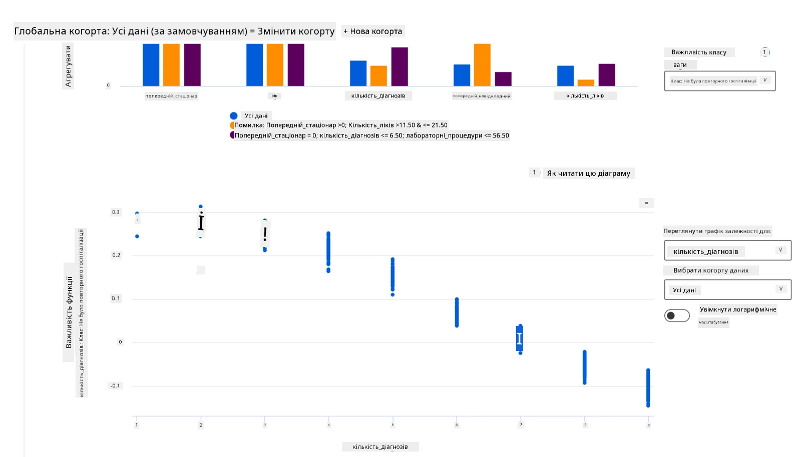

# Постскриптум: відладка моделей машинного навчання за допомогою компонентів інформаційної панелі Responsible AI
 

## [Попередній тест перед лекцією](https://ff-quizzes.netlify.app/en/ml/)
 
## Вступ

Машинне навчання впливає на наше повсякденне життя. ШІ знаходить застосування в одних із найважливіших систем, що впливають на нас як на окремих людей, так і на суспільство в цілому, від охорони здоров’я, фінансів, освіти до працевлаштування. Наприклад, системи та моделі залучені до щоденних завдань прийняття рішень, таких як діагностика здоров’я або виявлення шахрайства. Відповідно, досягнення в галузі ШІ разом із прискореним впровадженням супроводжуються зміною суспільних очікувань і зростаючим регулюванням. Ми постійно бачимо сфери, де системи ШІ не відповідають очікуванням; вони викривають нові виклики; і уряди починають регулювати рішення ШІ. Тож важливо, щоб ці моделі аналізувалися задля забезпечення справедливих, надійних, інклюзивних, прозорих і відповідальних результатів для всіх.

У цьому навчальному курсі ми розглянемо практичні інструменти, які можна використовувати для оцінки моделі на предмет проблем відповідального ШІ. Традиційні методи відладки моделей машинного навчання зазвичай базуються на кількісних обчисленнях, таких як агрегована точність або середня втрата помилки. Уявіть, що може статися, коли дані, які ви використовуєте для побудови цих моделей, не враховують певні демографічні групи, такі як раса, стать, політичні погляди, релігія, або ж істотно представляють їх непропорційно. А що, якщо інтерпретація результатів моделі віддає перевагу одній демографічній групі? Це може призвести до надто високого або недостатнього представлення цих чутливих груп ознак, викликаючи проблеми зі справедливістю, інклюзивністю або надійністю моделі. Іншим фактором є те, що моделі машинного навчання вважаються «чорними скриньками», що ускладнює розуміння і пояснення причин прогнозу моделі. Усі ці виклики виникають у дата-сайєнтистів та розробників ШІ тоді, коли у них немає достатніх інструментів для відладки та оцінки справедливості або надійності моделі.

У цьому уроці ви дізнаєтеся про відладку моделей за допомогою:

-	**Аналізу помилок**: визначення ділянок у вашому розподілі даних, де модель має високий рівень помилок.
-	**Огляду моделі**: виконання порівняльного аналізу між різними когортами даних для виявлення розбіжностей у показниках продуктивності моделі.
-	**Аналізу даних**: дослідження можливого над- або недопредставлення у ваших даних, що може спотворювати модель на користь однієї демографічної групи порівняно з іншою.
-	**Важливості ознак**: розуміння, які ознаки впливають на прогнозування моделі на глобальному або локальному рівні.

## Попередні знання

Перед початком рекомендовано ознайомитися з матеріалом [Інструменти відповідального ШІ для розробників](https://www.microsoft.com/ai/ai-lab-responsible-ai-dashboard)

> 

## Аналіз помилок

Традиційні метрики продуктивності моделі для вимірювання точності, як правило, базуються на обчисленнях правильних і неправильних прогнозів. Наприклад, визнати модель такою, що має точність 89% із втратою помилки 0,001, можна за добре працюючу. Проте помилки часто не розподілені рівномірно у підлягаючому наборі даних. Ви можете мати оцінку точності моделі 89%, але виявити, що в окремих регіонах ваших даних модель помиляється 42% часу. Наслідки таких зразків помилок у певних групах даних можуть призводити до проблем із справедливістю або надійністю. Важливо зрозуміти області, де модель працює добре, або ні. Регіони даних із великою кількістю неточностей у вашій моделі можуть виявитися важливою демографічною групою.

Компонент Аналізу помилок на інформаційній панелі RAI відображає, як неуспішність моделі розподіляється між різними когортами за допомогою візуалізації у вигляді дерева. Це корисно для визначення ознак або ділянок із високим рівнем помилок у вашому наборі даних. Спостерігаючи, звідки надходить більшість неточностей моделі, ви можете почати досліджувати корінь проблеми. Ви також можете створювати когорти даних для виконання аналізу. Ці когорти допомагають у процесі відладки визначити, чому модель показує кращі результати у одній когорті, але робить помилки в іншій.

Візуальні індикатори на карті дерева допомагають швидше знайти проблемні ділянки. Наприклад, чим темніший відтінок червоного кольору у вузлі дерева, тим вищий рівень помилок.

Теплова карта — ще один інструмент візуалізації, який можуть використовувати користувачі для дослідження рівня помилок за однією чи двома ознаками, щоб знайти причину помилок моделі по всьому набору даних або когортам.

Використовуйте аналіз помилок, коли потрібно:

* Отримати глибоке розуміння того, як розподіляються помилки моделей у наборі даних та за різними вхідними й ознаковими вимірами.
* Розкласти агреговані показники продуктивності, щоб автоматично виявляти когортні помилки та визначати цільові кроки усунення.

## Огляд моделі

Оцінка продуктивності моделі машинного навчання потребує цілісного розуміння її поведінки. Це можна досягти, переглянувши більше ніж один показник, як-от рівень помилок, точність, відзив, точність класифікації чи MAE (середня абсолютна помилка), щоб виявити розбіжності у показниках продуктивності. Один показник може виглядати добре, але інший може виявити неточності. Крім того, порівняння показників по всьому набору даних або когортам допомагає зрозуміти, де модель показує хороші результати, а де ні. Особливо це важливо для оцінки продуктивності моделі серед чутливих і нечутливих ознак (наприклад, раса, стать чи вік пацієнта), щоб виявити потенційну несправедливість моделі. Наприклад, якщо модель є більш помилковою у когорті із чутливими ознаками, це може свідчити про несправедливість моделі.

Компонент Огляду моделі на інформаційній панелі RAI допомагає не лише аналізувати показники продуктивності для групи даних у когорті, а й дає користувачам можливість порівнювати поведінку моделі між різними когортами.

Функціонал аналізу за ознаками дозволяє користувачам звужувати підгрупи даних у межах конкретної ознаки для виявлення аномалій на детальному рівні. Наприклад, інформаційна панель має вбудований інтелект для автоматичного створення когорт за обраною користувачем ознакою (наприклад, *"time_in_hospital < 3"* або *"time_in_hospital >= 7"*). Це дозволяє користувачу виділити певну ознаку з більшої групи даних і зрозуміти, чи є вона ключовим фактором помилкових результатів моделі.

Компонент Огляду моделі підтримує два класи метрик диспропорцій:

**Різниця у продуктивності моделі**: цей набір метрик обчислює різницю (диспропорцію) у значеннях вибраного показника продуктивності між підгрупами даних. Ось кілька прикладів:

* Різниця у рівні точності
* Різниця у рівні помилок
* Різниця у точності класифікації
* Різниця у відзиві
* Різниця у середній абсолютній помилці (MAE)

**Різниця в рівні вибору**: ця метрика містить різницю у рівні вибору (сприятливого прогнозу) серед підгруп. Прикладом є різниця у рівнях схвалення кредитів. Рівень вибору — це частка даних у кожному класі, які класифіковані як 1 (у бінарній класифікації) або розподіл прогнозованих значень (у регресії).

## Аналіз даних

> "Якщо довго мучити дані, вони зізнаються у чому завгодно" – Рональд Коуз

Це твердження звучить радикально, але воно правдиве: дані можна маніпулювати, щоб підтвердити будь-який висновок. Такі маніпуляції іноді відбуваються ненавмисно. Як люди, усі ми маємо упередження, і часто складно усвідомлено визначити, коли ви вводите упередження в дані. Забезпечення справедливості в ШІ та машинному навчанні залишається складним викликом.

Дані є великою сліпою зоною для традиційних метрик продуктивності моделі. Ви можете мати високі показники точності, але це не завжди відображає приховану упередженість у вашому наборі даних. Наприклад, якщо у наборі даних працівників жінки складають 27% на керівних посадах у компанії, а чоловіки — 73% на тому ж рівні, модель AI, навчена на цих даних для рекламування вакансій, може переважно орієнтуватися на чоловічу аудиторію для старших посад. Такий дисбаланс у даних збиває прогнози моделі, надаючи перевагу одній статі. Це виявляє проблему справедливості, пов’язану з гендерною упередженістю в моделі ШІ.

Компонент Аналізу даних на інформаційній панелі RAI допомагає виявити ділянки з надмірним або недостатнім представленням у наборі даних. Він допомагає користувачам діагностувати корінь помилок і проблем справедливості через дисбаланс даних або відсутність представлення окремої групи даних. Це дає змогу візуалізувати набори даних на основі прогнозованих і фактичних результатів, груп помилок і конкретних ознак. Іноді виявлення недостатньо представленої групи даних також дозволяє побачити, що модель погано навчається, тому має багато неточностей. Наявність упередження в даних моделі — це не лише проблема справедливості, а й доказ того, що модель не є інклюзивною або надійною.

Використовуйте аналіз даних, коли потрібно:

* Досліджувати статистику вашого набору даних, вибираючи різні фільтри для поділу даних на різні виміри (так звані когорти).
* Розуміти розподіл набору даних між різними когортами та групами ознак.
* Визначати, чи є ваші висновки щодо справедливості, аналізу помилок і причинності (отримані з інших компонентів панелі) результатом розподілу вашого набору даних.
* Приймати рішення, у яких галузях збирати більше даних, щоб усунути помилки, що виникають через проблеми представлення, шум у мітках, шум ознак, упередження міток та подібні фактори.

## Інтерпретованість моделі

Моделі машинного навчання, як правило, є «чорними скриньками». Зрозуміти, які ключові ознаки даних впливають на прогноз моделі, може бути складно. Важливо забезпечити прозорість у тому, чому модель робить певний прогноз. Наприклад, якщо система ШІ прогнозує, що діабетичний пацієнт має ризик бути повторно госпіталізованим менш ніж за 30 днів, вона повинна надати підтримуючі дані, що привели до такого прогнозу. Наявність індикаторів підтримки даних підвищує прозорість і допомагає клініцистам або лікарням приймати обґрунтовані рішення. Крім того, здатність пояснювати, чому модель дала прогноз для окремого пацієнта, забезпечує підзвітність відповідно до нормативних вимог охорони здоров’я. Коли ви використовуєте моделі машинного навчання у сферах, що впливають на життя людей, критично важливо розуміти та пояснювати, що впливає на поведінку моделі. Пояснюваність і інтерпретованість моделі допомагає відповісти на питання в таких сценаріях, як:

* Відладка моделі: Чому моя модель зробила цю помилку? Як я можу покращити модель?
* Співпраця людина-ШІ: Як мені розуміти і довіряти рішенням моделі?
* Відповідність регуляторним вимогам: Чи відповідає моя модель юридичним нормам?

Компонент Важливості ознак на панелі RAI допомагає відлагоджувати і отримувати комплексне розуміння того, як модель робить прогнози. Це також корисний інструмент для фахівців з машинного навчання та приймаючих рішення, щоб пояснювати і демонструвати докази впливу ознак на поведінку моделі для відповідності регуляторним вимогам. Далі користувачі можуть досліджувати як глобальні, так і локальні пояснення, щоб перевірити, які ознаки впливають на прогноз моделі. Глобальні пояснення перераховують головні ознаки, які вплинули на загальний прогноз моделі. Локальні пояснення показують, які ознаки вплинули на прогноз моделі для окремого випадку. Можливість оцінювати локальні пояснення також корисна для відладки або аудиту конкретного випадку, щоб краще зрозуміти і пояснити, чому модель зробила точний або неточний прогноз.

* Глобальні пояснення: наприклад, які ознаки впливають на загальну поведінку моделі прогнозування повторної госпіталізації діабетичних пацієнтів?
* Локальні пояснення: наприклад, чому діабетичний пацієнт віком понад 60 років із попередніми госпіталізаціями був чи не був прогнозований на повторну госпіталізацію протягом 30 днів?

У процесі відладки, аналізуючи продуктивність моделі в різних когортах, Важливість ознак показує рівень впливу ознаки у цих когорт. Це допомагає виявляти аномалії при порівнянні ступеня впливу ознаки на помилкові прогнози моделі. Компонент Важливості ознак може показати, які значення в ознаці позитивно чи негативно впливали на результат моделі. Наприклад, якщо модель зробила неточний прогноз, цей компонент дає змогу детально дослідити і встановити, які саме ознаки чи значення ознак вплинули на прогноз. Такий рівень деталізації допомагає не лише у відладці, але й забезпечує прозорість і підзвітність під час аудитів. Нарешті, компонент допомагає виявляти проблеми зі справедливістю. Наприклад, якщо чутлива ознака, як-от етнічність або стать, має великий вплив на прогноз моделі, це може свідчити про упередженість за расовою або гендерною ознакою в моделі.

Використовуйте інтерпретованість, коли потрібно:

* Визначати, наскільки надійними є прогнози вашої системи ШІ, розуміючи, які ознаки є найважливішими для прогнозів.
* Розпочати відладку моделі, спочатку розуміючи її та визначаючи, чи використовує модель здорові ознаки чи лише хибні кореляції.
* Виявляти потенційні джерела несправедливості, розуміючи, чи базує модель прогнози на чутливих ознаках або на ознаках, тісно з ними пов’язаних.
* Формувати довіру користувачів до рішень моделі, створюючи локальні пояснення для ілюстрації їхніх результатів.
* Провести регуляторний аудит системи ШІ для валідації моделей та моніторингу впливу рішень моделі на людей.

## Висновок

Усі компоненти інформаційної панелі RAI є практичними інструментами, що допомагають будувати моделі машинного навчання, які є менш шкідливими та більш надійними для суспільства. Це покращує запобігання порушенням прав людини; дискримінації чи виключенню певних груп із життєвих можливостей; а також ризик фізичних або психологічних ушкоджень. Компоненти також допомагають формувати довіру до рішень вашої моделі, створюючи локальні пояснення для ілюстрації їхніх результатів. Деякі потенційні шкоди можна класифікувати як:

- **Розподіл**, якщо, наприклад, надається перевага певній статі або етнічній групі над іншою.
- **Якість обслуговування**. Якщо ви тренуєте модель для одного конкретного сценарію, але реальність набагато складніша, це призводить до поганої якості послуг.
- **Стереотипізація**. Прив’язка певної групи до заздалегідь заданих атрибутів.

- **Обзивання**. Несправедливо критикувати та позначати щось або когось.
- **Пере- або недопредставлення**. Ідея полягає в тому, що певна група не представлена в певній професії, і будь-яка служба чи функція, що постійно це підтримує, приносить шкоду.

### Приладова панель Azure RAI
 
[Приладова панель Azure RAI](https://learn.microsoft.com/en-us/azure/machine-learning/concept-responsible-ai-dashboard?WT.mc_id=aiml-90525-ruyakubu) побудована на основі інструментів з відкритим кодом, розроблених провідними академічними установами та організаціями, включаючи Microsoft, які є незамінними для дата-сайентистів і розробників ШІ для кращого розуміння поведінки моделей, виявлення та усунення небажаних проблем у моделях штучного інтелекту.

- Дізнайтеся, як користуватися різними компонентами, переглянувши документацію до приладової панелі RAI [docs.](https://learn.microsoft.com/en-us/azure/machine-learning/how-to-responsible-ai-dashboard?WT.mc_id=aiml-90525-ruyakubu)

- Перегляньте кілька прикладів [записних книжок](https://github.com/Azure/RAI-vNext-Preview/tree/main/examples/notebooks) до приладової панелі RAI для налагодження більш відповідальних сценаріїв ШІ у Azure Machine Learning. 
  
---
## 🚀 Виклик 
 
Щоб запобігти внесенню статистичних чи даних упереджень з самого початку, ми повинні: 

- мати різноманітні бекграунди та погляди серед людей, які працюють над системами 
- інвестувати у набори даних, що відображають різноманітність нашого суспільства 
- розробляти кращі методи для виявлення й виправлення упереджень у разі їх появи 

Подумайте про реальні сценарії, де несправедливість очевидна при створенні моделей і їх використанні. Що ще слід врахувати? 

## [Вікторина після лекції](https://ff-quizzes.netlify.app/en/ml/)
## Підсумок і самонавчання 
 
У цьому уроці ви дізналися про деякі практичні інструменти впровадження відповідального ШІ у машинне навчання.  

Перегляньте цей воркшоп, щоб поглибити знання з теми: 

- Приладова панель Responsible AI: універсальне рішення для впровадження RAI на практиці від Бесміри Нуші та Мехрнуш Самекі

> 🎥 Клікніть на зображення вище, щоб подивитись відео: Приладова панель Responsible AI: універсальне рішення для впровадження RAI на практиці від Бесміри Нуші та Мехрнуш Самекі
 
Ознайомтеся з наступними матеріалами, щоб більше дізнатися про відповідальний ШІ та як будувати більш надійні моделі: 

- Інструменти панелі RAI від Microsoft для налагодження моделей машинного навчання: [Відповідальні інструменти ШІ](https://aka.ms/rai-dashboard)

- Вивчайте набір інструментів Responsible AI: [Github](https://github.com/microsoft/responsible-ai-toolbox)

- Центр ресурсів Responsible AI від Microsoft: [Відповідальні ресурси ШІ – Microsoft AI](https://www.microsoft.com/ai/responsible-ai-resources?activetab=pivot1%3aprimaryr4) 

- Дослідницька група FATE від Microsoft: [FATE: Справедливість, Відповідальність, Прозорість та Етика в ШІ - Microsoft Research](https://www.microsoft.com/research/theme/fate/) 

## Завдання

[Дослідити приладову панель RAI](assignment.md)

---

<!-- CO-OP TRANSLATOR DISCLAIMER START -->
**Відмова від відповідальності**:
Цей документ було перекладено за допомогою сервісу штучного інтелекту для перекладу [Co-op Translator](https://github.com/Azure/co-op-translator). Хоча ми прагнемо до точності, будь ласка, майте на увазі, що автоматичні переклади можуть містити помилки або неточності. Оригінальний документ рідною мовою слід вважати авторитетним джерелом. Для критично важливої інформації рекомендується професійний людський переклад. Ми не несемо відповідальності за будь-які непорозуміння або неправильні тлумачення, що виникли внаслідок використання цього перекладу.
<!-- CO-OP TRANSLATOR DISCLAIMER END -->