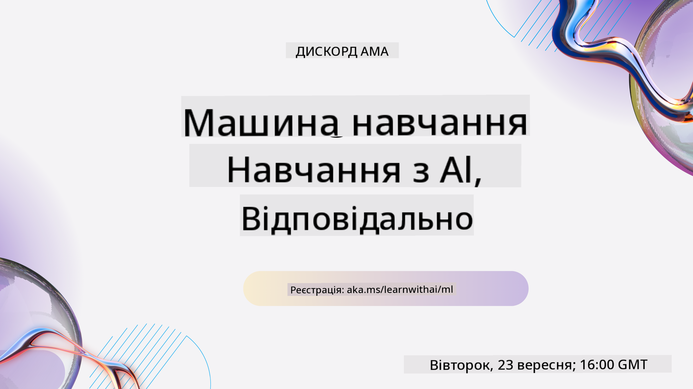
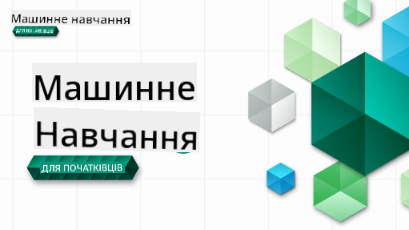

<!--
CO_OP_TRANSLATOR_METADATA:
{
  "original_hash": "7a13afb3674838f557d61f8d67e4d5f8",
  "translation_date": "2025-10-24T09:27:42+00:00",
  "source_file": "README.md",
  "language_code": "uk"
}
-->
  
  
  
  
  

  
  
  

### 🌐 Підтримка багатомовності  

#### Підтримується через GitHub Action (автоматично та завжди актуально)  

<!-- CO-OP TRANSLATOR LANGUAGES TABLE START -->  
[Арабська](../ar/README.md) | [Бенгальська](../bn/README.md) | [Болгарська](../bg/README.md) | [Бірманська (М'янма)](../my/README.md) | [Китайська (спрощена)](../zh/README.md) | [Китайська (традиційна, Гонконг)](../hk/README.md) | [Китайська (традиційна, Макао)](../mo/README.md) | [Китайська (традиційна, Тайвань)](../tw/README.md) | [Хорватська](../hr/README.md) | [Чеська](../cs/README.md) | [Данська](../da/README.md) | [Нідерландська](../nl/README.md) | [Естонська](../et/README.md) | [Фінська](../fi/README.md) | [Французька](../fr/README.md) | [Німецька](../de/README.md) | [Грецька](../el/README.md) | [Іврит](../he/README.md) | [Гінді](../hi/README.md) | [Угорська](../hu/README.md) | [Індонезійська](../id/README.md) | [Італійська](../it/README.md) | [Японська](../ja/README.md) | [Корейська](../ko/README.md) | [Литовська](../lt/README.md) | [Малайська](../ms/README.md) | [Маратхі](../mr/README.md) | [Непальська](../ne/README.md) | [Норвезька](../no/README.md) | [Перська (фарсі)](../fa/README.md) | [Польська](../pl/README.md) | [Португальська (Бразилія)](../br/README.md) | [Португальська (Португалія)](../pt/README.md) | [Панджабська (Гурмухі)](../pa/README.md) | [Румунська](../ro/README.md) | [Російська](../ru/README.md) | [Сербська (кирилиця)](../sr/README.md) | [Словацька](../sk/README.md) | [Словенська](../sl/README.md) | [Іспанська](../es/README.md) | [Суахілі](../sw/README.md) | [Шведська](../sv/README.md) | [Тагальська (Філіппіни)](../tl/README.md) | [Тамільська](../ta/README.md) | [Тайська](../th/README.md) | [Турецька](../tr/README.md) | [Українська](./README.md) | [Урду](../ur/README.md) | [В'єтнамська](../vi/README.md)  
<!-- CO-OP TRANSLATOR LANGUAGES TABLE END -->  

#### Приєднуйтесь до нашої спільноти  

  

У нас триває серія навчання з AI у Discord, дізнайтеся більше та приєднуйтесь до нас на [Learn with AI Series](https://aka.ms/learnwithai/discord) з 18 по 30 вересня 2025 року. Ви отримаєте поради та хитрощі використання GitHub Copilot для Data Science.  

  

# Машинне навчання для початківців - навчальна програма  

> 🌍 Подорожуйте світом, досліджуючи машинне навчання через культури світу 🌍  

Cloud Advocates у Microsoft раді запропонувати 12-тижневу навчальну програму з 26 уроків, присвячену **машинному навчанню**. У цій програмі ви дізнаєтеся про те, що іноді називають **класичним машинним навчанням**, використовуючи переважно бібліотеку Scikit-learn і уникаючи глибокого навчання, яке охоплюється в нашій [навчальній програмі "AI для початківців"](https://aka.ms/ai4beginners). Поєднуйте ці уроки з нашою [навчальною програмою "Data Science для початківців"](https://aka.ms/ds4beginners), також!  

Подорожуйте з нами світом, застосовуючи ці класичні техніки до даних з різних куточків світу. Кожен урок включає тести до і після уроку, письмові інструкції для виконання завдання, рішення, завдання та багато іншого. Наш підхід, заснований на проектах, дозволяє вам навчатися, створюючи, що є перевіреним способом закріплення нових навичок.  

**✍️ Щира подяка нашим авторам** Джен Лупер, Стівену Ховеллу, Франчесці Лаццері, Томомі Імурі, Кассі Бревіу, Дмитру Сошникову, Крісу Норінгу, Анірбану Мукерджі, Орнеллі Алтунян, Рут Якобу та Емі Бойд  

**🎨 Дякуємо також нашим ілюстраторам** Томомі Імурі, Дасані Мадіпаллі та Джен Лупер  

**🙏 Особлива подяка 🙏 нашим авторам, рецензентам та контриб'юторам з числа студентів-амбасадорів Microsoft**, зокрема Рішиту Даглі, Мухаммаду Сакібу Хану Інану, Рохану Раджу, Александру Петреску, Абхішеку Джайсвалу, Навріну Табассуму, Іоану Самуїлі та Снігдхі Агарвал  

**🤩 Особлива вдячність студентам-амбасадорам Microsoft Еріку Ванджау, Джаслін Сонді та Відуші Гупті за наші уроки з R!**  

# Початок роботи  

Виконайте наступні кроки:  
1. **Форкніть репозиторій**: Натисніть кнопку "Fork" у верхньому правому куті цієї сторінки.  
2. **Клонуйте репозиторій**:   `git clone https://github.com/microsoft/ML-For-Beginners.git`  

> [знайдіть усі додаткові ресурси для цього курсу в нашій колекції Microsoft Learn](https://learn.microsoft.com/en-us/collections/qrqzamz1nn2wx3?WT.mc_id=academic-77952-bethanycheum)  

> 🔧 **Потрібна допомога?** Перевірте наш [Посібник з усунення несправностей](TROUBLESHOOTING.md) для вирішення поширених проблем з установкою, налаштуванням та виконанням уроків.  

**[Студенти](https://aka.ms/student-page)**, щоб використовувати цю навчальну програму, форкніть весь репозиторій у свій GitHub-акаунт і виконуйте вправи самостійно або в групі:  

- Почніть з тесту перед лекцією.  
- Прочитайте лекцію та виконайте завдання, зупиняючись і розмірковуючи на кожному етапі перевірки знань.  
- Спробуйте створити проекти, розуміючи уроки, а не просто запускаючи код рішення; однак цей код доступний у папках `/solution` у кожному проектно-орієнтованому уроці.  
- Пройдіть тест після лекції.  
- Виконайте виклик.  
- Виконайте завдання.  
- Після завершення групи уроків відвідайте [Дошку обговорень](https://github.com/microsoft/ML-For-Beginners/discussions) і "навчайтеся вголос", заповнюючи відповідний рубрикатор PAT. 'PAT' - це інструмент оцінки прогресу, який є рубрикою, яку ви заповнюєте для подальшого навчання. Ви також можете реагувати на інші PAT, щоб ми могли навчатися разом.  

> Для подальшого навчання ми рекомендуємо слідувати цим [модулям та навчальним шляхам Microsoft Learn](https://docs.microsoft.com/en-us/users/jenlooper-2911/collections/k7o7tg1gp306q4?WT.mc_id=academic-77952-leestott).  

**Викладачі**, ми [включили деякі пропозиції](for-teachers.md) щодо використання цієї навчальної програми.  

---  

## Відео-огляди  

Деякі уроки доступні у вигляді коротких відео. Ви можете знайти їх у самих уроках або на [плейлисті ML для початківців на YouTube-каналі Microsoft Developer](https://aka.ms/ml-beginners-videos), натиснувши на зображення нижче.  

  

---  

## Знайомство з командою  

  

**Gif створено** [Мохітом Джайсалом](https://linkedin.com/in/mohitjaisal)  

> 🎥 Натисніть на зображення вище, щоб переглянути відео про проект та людей, які його створили!  

---  

## Педагогіка  

Ми обрали два педагогічні принципи при створенні цієї навчальної програми: забезпечення того, щоб вона була практичною **на основі проектів** і включала **часті тести**. Крім того, ця програма має спільну **тему**, яка надає їй цілісності.  

Забезпечуючи відповідність контенту проектам, процес стає більш захоплюючим для студентів, а засвоєння концепцій буде посилено. Крім того, тест перед заняттям з низькими ставками налаштовує студента на вивчення теми, а другий тест після заняття забезпечує подальше засвоєння. Ця навчальна програма була розроблена, щоб бути гнучкою та цікавою і може бути використана повністю або частково. Проекти починаються з простих і стають дедалі складнішими до кінця 12-тижневого циклу. Ця програма також включає постскриптум про реальні застосування ML, який може бути використаний як додатковий кредит або як основа для обговорення.  

> Знайдіть наші [Правила поведінки](CODE_OF_CONDUCT.md), [Рекомендації щодо внесення змін](CONTRIBUTING.md), [Переклад](TRANSLATIONS.md) та [Посібник з усунення несправностей](TROUBLESHOOTING.md). Ми вітаємо ваші конструктивні відгуки!  

## Кожен урок включає  

- необов'язковий скетчноут  
- необов'язкове додаткове відео  
- відео-огляд (лише деякі уроки)  
- [тест перед лекцією](https://ff-quizzes.netlify.app/en/ml/)  
- письмовий урок  
- для уроків на основі проектів, покрокові інструкції щодо створення проекту  
- перевірки знань  
- виклик  
- додаткове читання  
- завдання  
- [тест після лекції](https://ff-quizzes.netlify.app/en/ml/)  

> **Примітка про мови**: Ці уроки переважно написані на Python, але багато з них також доступні на R. Щоб виконати урок на R, перейдіть до папки `/solution` і знайдіть уроки на R. Вони включають розширення .rmd, яке представляє **R Markdown** файл, який можна просто визначити як вбудовування `кодових блоків` (R або інших мов) та `YAML заголовка` (який керує форматуванням вихідних даних, таких як PDF) у `Markdown документ`. Таким чином, це служить зразковою авторською платформою для науки про дані, оскільки дозволяє вам об'єднувати ваш код, його вихідні дані та ваші думки, дозволяючи записувати їх у Markdown. Крім того, документи R Markdown можуть бути відображені у вихідні формати, такі як PDF, HTML або Word.  

> **Примітка про тести**: Усі тести містяться в [папці Quiz App](../../quiz-app), всього 52 тести по три питання кожен. Вони пов'язані з уроками, але додаток для тестів можна запустити локально; дотримуйтесь інструкцій у папці `quiz-app`, щоб локально розмістити або розгорнути на Azure.  

| Номер уроку |                             Тема                              |                   Групування уроків                   | Навчальні цілі                                                                                                             |                                                              Пов'язаний урок                                                               |                        Автор                        |  
| :-----------: | :------------------------------------------------------------: | :-------------------------------------------------: | ------------------------------------------------------------------------------------------------------------------------------- | :--------------------------------------------------------------------------------------------------------------------------------------: | :--------------------------------------------------: |  
|      01       |                Вступ до машинного навчання                |      [Вступ](1-Introduction/README.md)       | Дізнайтеся основні концепції машинного навчання                                                                                |                                             [Урок](1-Introduction/1-intro-to-ML/README.md)                                             |                       Мухаммад                       |
|      02       |                Історія машинного навчання                 |      [Вступ](1-Introduction/README.md)       | Дізнайтеся історію цього напряму                                                                                         |                                            [Урок](1-Introduction/2-history-of-ML/README.md)                                            |                     Джен і Емі                      |
|      03       |                 Справедливість і машинне навчання                  |      [Вступ](1-Introduction/README.md)       | Які важливі філософські питання щодо справедливості студенти повинні враховувати при створенні та застосуванні моделей ML? |                                              [Урок](1-Introduction/3-fairness/README.md)                                               |                        Томомі                        |
|      04       |                Техніки машинного навчання                 |      [Вступ](1-Introduction/README.md)       | Які техніки використовують дослідники ML для створення моделей ML?                                                                       |                                          [Урок](1-Introduction/4-techniques-of-ML/README.md)                                           |                    Кріс і Джен                     |
|      05       |                   Вступ до регресії                   |        [Регресія](2-Regression/README.md)         | Почніть працювати з Python і Scikit-learn для моделей регресії                                                                  |         [Python](2-Regression/1-Tools/README.md) • [R](../../2-Regression/1-Tools/solution/R/lesson_1.html)         |      Джен • Ерік Ванджа       |
|      06       |                Ціни на гарбузи в Північній Америці 🎃                |        [Регресія](2-Regression/README.md)         | Візуалізуйте та очистіть дані для підготовки до ML                                                                                  |          [Python](2-Regression/2-Data/README.md) • [R](../../2-Regression/2-Data/solution/R/lesson_2.html)          |      Джен • Ерік Ванджа       |
|      07       |                Ціни на гарбузи в Північній Америці 🎃                |        [Регресія](2-Regression/README.md)         | Створіть моделі лінійної та поліноміальної регресії                                                                                   |        [Python](2-Regression/3-Linear/README.md) • [R](../../2-Regression/3-Linear/solution/R/lesson_3.html)        |      Джен і Дмитро • Ерік Ванджа       |
|      08       |                Ціни на гарбузи в Північній Америці 🎃                |        [Регресія](2-Regression/README.md)         | Створіть модель логістичної регресії                                                                                               |     [Python](2-Regression/4-Logistic/README.md) • [R](../../2-Regression/4-Logistic/solution/R/lesson_4.html)      |      Джен • Ерік Ванджа       |
|      09       |                          Веб-додаток 🔌                          |           [Веб-додаток](3-Web-App/README.md)            | Створіть веб-додаток для використання вашої навченої моделі                                                                                       |                                                 [Python](3-Web-App/1-Web-App/README.md)                                                  |                         Джен                          |
|      10       |                 Вступ до класифікації                 |    [Класифікація](4-Classification/README.md)     | Очистіть, підготуйте та візуалізуйте ваші дані; вступ до класифікації                                                            | [Python](4-Classification/1-Introduction/README.md) • [R](../../4-Classification/1-Introduction/solution/R/lesson_10.html)  | Джен і Кессі • Ерік Ванджа |
|      11       |             Смачні азійські та індійські кухні 🍜             |    [Класифікація](4-Classification/README.md)     | Вступ до класифікаторів                                                                                                     | [Python](4-Classification/2-Classifiers-1/README.md) • [R](../../4-Classification/2-Classifiers-1/solution/R/lesson_11.html) | Джен і Кессі • Ерік Ванджа |
|      12       |             Смачні азійські та індійські кухні 🍜             |    [Класифікація](4-Classification/README.md)     | Більше класифікаторів                                                                                                                | [Python](4-Classification/3-Classifiers-2/README.md) • [R](../../4-Classification/3-Classifiers-2/solution/R/lesson_12.html) | Джен і Кессі • Ерік Ванджа |
|      13       |             Смачні азійські та індійські кухні 🍜             |    [Класифікація](4-Classification/README.md)     | Створіть веб-додаток рекомендацій, використовуючи вашу модель                                                                                    |                                              [Python](4-Classification/4-Applied/README.md)                                              |                         Джен                          |
|      14       |                   Вступ до кластеризації                   |        [Кластеризація](5-Clustering/README.md)         | Очистіть, підготуйте та візуалізуйте ваші дані; вступ до кластеризації                                                                |         [Python](5-Clustering/1-Visualize/README.md) • [R](../../5-Clustering/1-Visualize/solution/R/lesson_14.html)         |      Джен • Ерік Ванджа       |
|      15       |              Дослідження музичних уподобань Нігерії 🎧              |        [Кластеризація](5-Clustering/README.md)         | Дослідження методу кластеризації K-Means                                                                                           |           [Python](5-Clustering/2-K-Means/README.md) • [R](../../5-Clustering/2-K-Means/solution/R/lesson_15.html)           |      Джен • Ерік Ванджа       |
|      16       |        Вступ до обробки природної мови ☕️         |   [Обробка природної мови](6-NLP/README.md)    | Дізнайтеся основи NLP, створюючи простого бота                                                                             |                                             [Python](6-NLP/1-Introduction-to-NLP/README.md)                                              |                       Стівен                        |
|      17       |                      Загальні завдання NLP ☕️                      |   [Обробка природної мови](6-NLP/README.md)    | Поглибте свої знання NLP, зрозумівши загальні завдання, необхідні для роботи зі структурами мови                          |                                                    [Python](6-NLP/2-Tasks/README.md)                                                     |                       Стівен                        |
|      18       |             Переклад і аналіз настроїв ♥️              |   [Обробка природної мови](6-NLP/README.md)    | Переклад і аналіз настроїв з Джейн Остін                                                                             |                                            [Python](6-NLP/3-Translation-Sentiment/README.md)                                             |                       Стівен                        |
|      19       |                  Романтичні готелі Європи ♥️                  |   [Обробка природної мови](6-NLP/README.md)    | Аналіз настроїв за відгуками про готелі 1                                                                                         |                                               [Python](6-NLP/4-Hotel-Reviews-1/README.md)                                                |                       Стівен                        |
|      20       |                  Романтичні готелі Європи ♥️                  |   [Обробка природної мови](6-NLP/README.md)    | Аналіз настроїв за відгуками про готелі 2                                                                                         |                                               [Python](6-NLP/5-Hotel-Reviews-2/README.md)                                                |                       Стівен                        |
|      21       |            Вступ до прогнозування часових рядів             |        [Часові ряди](7-TimeSeries/README.md)        | Вступ до прогнозування часових рядів                                                                                         |                                             [Python](7-TimeSeries/1-Introduction/README.md)                                              |                      Франческа                       |
|      22       | ⚡️ Використання енергії у світі ⚡️ - прогнозування часових рядів з ARIMA |        [Часові ряди](7-TimeSeries/README.md)        | Прогнозування часових рядів з ARIMA                                                                                              |                                                 [Python](7-TimeSeries/2-ARIMA/README.md)                                                 |                      Франческа                       |
|      23       |  ⚡️ Використання енергії у світі ⚡️ - прогнозування часових рядів з SVR  |        [Часові ряди](7-TimeSeries/README.md)        | Прогнозування часових рядів з регресором підтримки векторів                                                                           |                                                  [Python](7-TimeSeries/3-SVR/README.md)                                                  |                       Анірбан                        |
|      24       |             Вступ до навчання з підкріпленням             | [Навчання з підкріпленням](8-Reinforcement/README.md) | Вступ до навчання з підкріпленням з Q-Learning                                                                          |                                             [Python](8-Reinforcement/1-QLearning/README.md)                                              |                        Дмитро                        |
|      25       |                 Допоможіть Пітеру уникнути вовка! 🐺                  | [Навчання з підкріпленням](8-Reinforcement/README.md) | Навчання з підкріпленням у Gym                                                                                                      |                                                [Python](8-Reinforcement/2-Gym/README.md)                                                 |                        Дмитро                        |
|  Постскриптум   |            Реальні сценарії та застосування ML            |      [ML у реальному світі](9-Real-World/README.md)       | Цікаві та показові реальні застосування класичного ML                                                               |                                             [Урок](9-Real-World/1-Applications/README.md)                                              |                         Команда                         |
|  Постскриптум   |            Налагодження моделей ML за допомогою панелі RAI          |      [ML у реальному світі](9-Real-World/README.md)       | Налагодження моделей машинного навчання за допомогою компонентів панелі відповідального AI                                                              |                                             [Урок](9-Real-World/2-Debugging-ML-Models/README.md)                                              |                         Рут Якобу                       |

> [знайдіть усі додаткові ресурси для цього курсу в нашій колекції Microsoft Learn](https://learn.microsoft.com/en-us/collections/qrqzamz1nn2wx3?WT.mc_id=academic-77952-bethanycheum)

## Офлайн-доступ

Ви можете використовувати цю документацію офлайн за допомогою [Docsify](https://docsify.js.org/#/). Форкніть цей репозиторій, [встановіть Docsify](https://docsify.js.org/#/quickstart) на вашому локальному комп'ютері, а потім у кореневій папці цього репозиторію введіть `docsify serve`. Вебсайт буде доступний на порту 3000 вашого localhost: `localhost:3000`.

## PDF-файли

Знайдіть PDF-версію навчальної програми з посиланнями [тут](https://microsoft.github.io/ML-For-Beginners/pdf/readme.pdf).

## 🎒 Інші курси 

Наша команда створює інші курси! Ознайомтеся:

<!-- CO-OP TRANSLATOR OTHER COURSES START -->
### Azure / Edge / MCP / Agents

---
 
### Серія Generative AI

[-9333EA?style=for-the-badge&labelColor=E5E7EB&color=9333EA)](https://github.com/microsoft/Generative-AI-for-beginners-dotnet?WT.mc_id=academic-105485-koreyst)
[-C084FC?style=for-the-badge&labelColor=E5E7EB&color=C084FC)](https://github.com/microsoft/generative-ai-for-beginners-java?WT.mc_id=academic-105485-koreyst)
[-E879F9?style=for-the-badge&labelColor=E5E7EB&color=E879F9)](https://github.com/microsoft/generative-ai-with-javascript?WT.mc_id=academic-105485-koreyst)

---
 
### Основне навчання
  
  
  
  
  
  
  

---

### Серія Copilot  
  
  
  

## Отримання допомоги  

Якщо ви застрягли або маєте запитання щодо створення додатків зі штучним інтелектом, приєднуйтесь:  

  

Якщо у вас є відгуки про продукт або виникають помилки під час створення, відвідайте:  

  

---

**Відмова від відповідальності**:  
Цей документ був перекладений за допомогою сервісу автоматичного перекладу [Co-op Translator](https://github.com/Azure/co-op-translator). Хоча ми прагнемо до точності, будь ласка, майте на увазі, що автоматичні переклади можуть містити помилки або неточності. Оригінальний документ на його рідній мові слід вважати авторитетним джерелом. Для критичної інформації рекомендується професійний людський переклад. Ми не несемо відповідальності за будь-які непорозуміння або неправильні тлумачення, що виникають внаслідок використання цього перекладу.