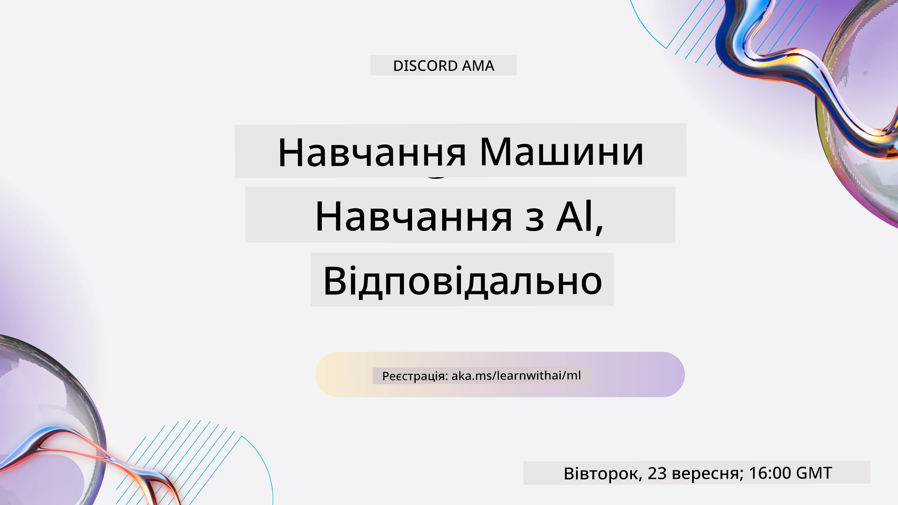
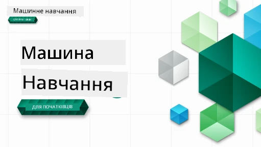

[](https://github.com/microsoft/ML-For-Beginners/blob/master/LICENSE)
[](https://GitHub.com/microsoft/ML-For-Beginners/graphs/contributors/)
[](https://GitHub.com/microsoft/ML-For-Beginners/issues/)
[](https://GitHub.com/microsoft/ML-For-Beginners/pulls/)
[](http://makeapullrequest.com)

[](https://GitHub.com/microsoft/ML-For-Beginners/watchers/)
[](https://GitHub.com/microsoft/ML-For-Beginners/network/)
[](https://GitHub.com/microsoft/ML-For-Beginners/stargazers/)

### 🌐 Підтримка багатьох мов

#### Підтримується через GitHub Action (автоматизовано та завжди актуально)

<!-- CO-OP TRANSLATOR LANGUAGES TABLE START -->
[Арабська](../ar/README.md) | [Бенгальська](../bn/README.md) | [Болгарська](../bg/README.md) | [Бірманська (М’янма)](../my/README.md) | [Китайська (спрощена)](../zh-CN/README.md) | [Китайська (традиційна, Гонконг)](../zh-HK/README.md) | [Китайська (традиційна, Макао)](../zh-MO/README.md) | [Китайська (традиційна, Тайвань)](../zh-TW/README.md) | [Хорватська](../hr/README.md) | [Чеська](../cs/README.md) | [Данська](../da/README.md) | [Голландська](../nl/README.md) | [Естонська](../et/README.md) | [Фінська](../fi/README.md) | [Французька](../fr/README.md) | [Німецька](../de/README.md) | [Грецька](../el/README.md) | [Іврит](../he/README.md) | [Гінді](../hi/README.md) | [Угорська](../hu/README.md) | [Індонезійська](../id/README.md) | [Італійська](../it/README.md) | [Японська](../ja/README.md) | [Каннада](../kn/README.md) | [Кхмерська](../km/README.md) | [Корейська](../ko/README.md) | [Литовська](../lt/README.md) | [Малайська](../ms/README.md) | [Малаялам](../ml/README.md) | [Маратхі](../mr/README.md) | [Непальська](../ne/README.md) | [Нігерійський пігін](../pcm/README.md) | [Норвезька](../no/README.md) | [Перська (фарсі)](../fa/README.md) | [Польська](../pl/README.md) | [Португальська (Бразилія)](../pt-BR/README.md) | [Португальська (Португалія)](../pt-PT/README.md) | [Пенджабі (гурмукхі)](../pa/README.md) | [Румунська](../ro/README.md) | [Російська](../ru/README.md) | [Сербська (кирилиця)](../sr/README.md) | [Словацька](../sk/README.md) | [Словенська](../sl/README.md) | [Іспанська](../es/README.md) | [Свахілі](../sw/README.md) | [Шведська](../sv/README.md) | [Тагальська (філіппінська)](../tl/README.md) | [Тамільська](../ta/README.md) | [Телугу](../te/README.md) | [Тайська](../th/README.md) | [Турецька](../tr/README.md) | [Українська](./README.md) | [Урду](../ur/README.md) | [В’єтнамська](../vi/README.md)

> **Віддаєте перевагу клонувати локально?**
>
> Цей репозиторій включає понад 50 перекладів мовами, що значно збільшує розмір завантаження. Щоб клонувати без перекладів, використовуйте sparse checkout:
>
> **Bash / macOS / Linux:**
> ```bash
> git clone --filter=blob:none --sparse https://github.com/microsoft/ML-For-Beginners.git
> cd ML-For-Beginners
> git sparse-checkout set --no-cone '/*' '!translations' '!translated_images'
> ```
>
> **CMD (Windows):**
> ```cmd
> git clone --filter=blob:none --sparse https://github.com/microsoft/ML-For-Beginners.git
> cd ML-For-Beginners
> git sparse-checkout set --no-cone "/*" "!translations" "!translated_images"
> ```
>
> Це дасть вам усе необхідне для проходження курсу з набагато швидшим завантаженням.
<!-- CO-OP TRANSLATOR LANGUAGES TABLE END -->

#### Приєднуйтесь до нашої спільноти

[](https://discord.gg/nTYy5BXMWG)

У нас триває серія Discord «Вчимося з AI», дізнайтеся більше та приєднуйтесь до нас на [серію «Вчимося з AI»](https://aka.ms/learnwithai/discord) з 18 по 30 вересня 2025 року. Ви отримаєте поради та трюки щодо використання GitHub Copilot для Data Science.



# Машинне навчання для початківців - навчальна програма

> 🌍 Подорожуйте світом, досліджуючи машинне навчання через культури світу 🌍

Представники Cloud Microsoft із задоволенням пропонують 12-тижневу навчальну програму з 26 уроків, присвячених **машинному навчанню**. У цій програмі ви дізнаєтесь про те, що іноді називають **класичним машинним навчанням**, переважно використовуючи бібліотеку Scikit-learn і уникаючи глибокого навчання, яке висвітлюється у нашій [навчальній програмі «AI для початківців»](https://aka.ms/ai4beginners). Поєднайте ці уроки також із нашою [навчальною програмою «Data Science для початківців»](https://aka.ms/ds4beginners)!

Подорожуйте з нами світом, застосовуючи ці класичні методи до даних з різних куточків світу. Кожен урок включає тести до та після уроку, письмові інструкції для виконання завдання, розв’язок, завдання та багато іншого. Наша проектно-орієнтована методика дозволяє вчитися, створюючи проекти, що є перевіреним способом ефективного засвоєння нових навичок.

**✍️ Щира подяка нашим авторам** Джен Лупер, Стівен Гауелл, Франческа Лаццері, Томомі Імура, Кессі Бревіу, Дмитро Сошніков, Кріс Норінг, Анірбан Мукерджі, Орнелла Альтунян, Рут Якобу та Емі Бойд

**🎨 Подяка також нашим ілюстраторам** Томомі Імура, Дасані Мадіпаллі та Джен Лупер

**🙏 Особлива подяка 🙏 нашим послам Microsoft Student Ambassador, авторам, рецензентам та контентним учасникам**, зокрема Рішиту Даглі, Мухаммаду Сакибу Хану Інан, Рогану Раджу, Александру Петреску, Абхішеку Джайсвалу, Наврін Табаcсум, Іоану Самуїлі та Снігдха Агарвал

**🤩 Особлива вдячність послам Microsoft Student Ambassadors Ерік Ванджау, Джаслін Сонді та Відуші Гупта за уроки з R!**

# Початок роботи

Виконайте ці кроки:
1. **Створіть форк репозиторію**: натисніть кнопку "Fork" у верхньому правому куті цієї сторінки.
2. **Клонуйте репозиторій**:   `git clone https://github.com/microsoft/ML-For-Beginners.git`

> 💡 **Порада для швидкого старту:** Хочете почати в браузері без налаштування Python локально? Використовуйте [GitHub Codespaces](https://github.com/features/codespaces), щоб створити хмарне середовище розробки для вашого форку. Відкрийте зелене меню **Code**, оберіть **Codespaces**, створіть Codespace, за потреби встановіть залежності для кожного уроку.

> [знайдіть всі додаткові ресурси для цього курсу у нашій збірці Microsoft Learn](https://learn.microsoft.com/en-us/collections/qrqzamz1nn2wx3?WT.mc_id=academic-77952-bethanycheum)

> 🔧 **Потрібна допомога?** Перегляньте наш [Посібник з усунення несправностей](TROUBLESHOOTING.md) для розв’язання типових проблем з установкою, налаштуванням і запуском уроків.


**[Студенти](https://aka.ms/student-page)**, щоб використовувати цю навчальну програму, зробіть форк всього репозиторію у свій обліковий запис GitHub і виконуйте вправи самостійно або в групі:

- Починайте з опитування перед лекцією.
- Читайте лекцію і виконуйте завдання, зупиняючись і обдумуючи кожну перевірку знань.
- Намагайтеся створити проекти, розуміючи урок, а не просто запускаючи код рішення; проте цей код доступний у папках `/solution` для кожного уроку з проектом.
- Пройдіть тест після лекції.
- Виконайте виклик.
- Виконайте завдання.
- Після завершення групи уроків відвідайте [Дошку обговорень](https://github.com/microsoft/ML-For-Beginners/discussions) і "вчіться вголос", заповнюючи відповідну рубрику PAT. «PAT» — це інструмент оцінювання прогресу, рубрика, яку ви заповнюєте для подальшого навчання. Ви також можете реагувати на інші PAT, щоб ми могли вчитися разом.

> Для подальшого вивчення радимо проходити ці [модулі та навчальні шляхи Microsoft Learn](https://docs.microsoft.com/en-us/users/jenlooper-2911/collections/k7o7tg1gp306q4?WT.mc_id=academic-77952-leestott).

**Вчителі**, ми додали [деякі рекомендації](for-teachers.md) щодо використання цієї навчальної програми.

---

## Відео-огляди

Деякі уроки доступні у форматі коротких відео. Ви можете знайти всі ці відео вбудованими у уроки або на [плейлисті ML for Beginners на каналі Microsoft Developer на YouTube](https://aka.ms/ml-beginners-videos), натиснувши на зображення нижче.

[](https://aka.ms/ml-beginners-videos)

---

## Знайомтесь з командою

[](https://youtu.be/Tj1XWrDSYJU)

**Гіфка від** [Mohit Jaisal](https://linkedin.com/in/mohitjaisal)

> 🎥 Натисніть на зображення вище, щоб переглянути відео про проєкт та людей, які його створили!

---

## Педагогіка

Під час створення цієї навчальної програми ми обрали два педагогічні принципи: вона повинна бути практичною, **проєктно-орієнтованою**, і містити **часті тести**. Крім того, програма має спільну **тему** для згуртування матеріалу.

Забезпечуючи відповідність контенту проєктам, процес стає більш захоплюючим для студентів, а засвоєння концептів — ефективнішим. Крім того, легкий тест перед заняттям налаштовує студента на вивчення теми, а другий тест після заняття забезпечує її кращу фіксацію у пам’яті. Цю навчальну програму розроблено гнучкою і цікавою — її можна пройти повністю або частинами. Проєкти починаються з простих і стають складнішими наприкінці 12-тижневого циклу. Програма також містить постскриптум про застосування ML у реальному світі, який можна використовувати як додаткові бали або для дискусії.

> Ознайомтесь з нашими [Правилами поведінки](CODE_OF_CONDUCT.md), [Правилами внеску](CONTRIBUTING.md), [Перекладами](..) та [Посібником з усунення несправностей](TROUBLESHOOTING.md). Ми вітаємо ваші конструктивні відгуки!

## Кожен урок включає

- необов’язкову робочу замальовку
- необов’язкове додаткове відео
- відео-огляд (тільки деякі уроки)
- [тест-розігрів перед лекцією](https://ff-quizzes.netlify.app/en/ml/)
- письмовий урок
- для проєктно-орієнтованих уроків — покрокові інструкції зі створення проєкту
- перевірки знань
- виклик
- додаткове читання
- завдання
- [тест після лекції](https://ff-quizzes.netlify.app/en/ml/)

> **Зауваження про мови програмування**: Основна мова уроків — Python, але багато уроків також доступні на R. Щоб пройти урок R, зайдіть у папку `/solution` і знайдіть уроки R. Вони мають розширення .rmd — це файл **R Markdown**, який можна визначити як документ Markdown, що містить впроваджені фрагменти коду (`code chunks`) (на R або інших мовах) та заголовок YAML, що керує форматуванням виводу, наприклад у PDF. Це чудовий інструмент для авторства, який дозволяє поєднувати код, його результат і власні коментарі, записані у Markdown. Документи R Markdown можна конвертувати у PDF, HTML або Word.

> **Зауваження про тести**: Всі тести зберігаються в [папці Quiz App](../../quiz-app); загалом 52 тести по три питання кожен. Вони зв’язані з уроками, але додаток для тестів можна запустити локально; дотримуйтесь інструкцій у папці `quiz-app` для локального хостингу або розгортання в Azure.

| Номер уроку |                             Тема                              |                   Групування уроків                   | Навчальні цілі                                                                                                             |                                                              Пов’язаний урок                                                               |                        Автор                        |
| :-----------: | :------------------------------------------------------------: | :-------------------------------------------------: | ------------------------------------------------------------------------------------------------------------------------------- | :--------------------------------------------------------------------------------------------------------------------------------------: | :--------------------------------------------------: |
|      01       |                Вступ до машинного навчання                    |      [Introduction](1-Introduction/README.md)       | Вивчіть основні концепції машинного навчання                                                                                   |                                             [Lesson](1-Introduction/1-intro-to-ML/README.md)                                             |                       Muhammad                       |
|      02       |                Історія машинного навчання                      |      [Introduction](1-Introduction/README.md)       | Дізнайтеся історію, що лежить в основі цієї галузі                                                                              |                                            [Lesson](1-Introduction/2-history-of-ML/README.md)                                            |                     Jen and Amy                      |
|      03       |                 Справедливість та машинне навчання             |      [Introduction](1-Introduction/README.md)       | Які важливі філософські питання щодо справедливості слід враховувати при створенні та застосуванні моделей МН?                |                                              [Lesson](1-Introduction/3-fairness/README.md)                                               |                        Tomomi                        |
|      04       |                Техніки машинного навчання                      |      [Introduction](1-Introduction/README.md)       | Які техніки використовують дослідники МН для побудови моделей МН?                                                              |                                          [Lesson](1-Introduction/4-techniques-of-ML/README.md)                                           |                    Chris and Jen                     |
|      05       |                   Вступ до регресії                            |        [Regression](2-Regression/README.md)         | Почніть роботу з Python та Scikit-learn для моделей регресії                                                                   |         [Python](2-Regression/1-Tools/README.md) • [R](../../2-Regression/1-Tools/solution/R/lesson_1.html)         |      Jen • Eric Wanjau       |
|      06       |                Ціни на гарбузи в Північній Америці 🎃           |        [Regression](2-Regression/README.md)         | Візуалізуйте та очистіть дані для підготовки до МН                                                                              |          [Python](2-Regression/2-Data/README.md) • [R](../../2-Regression/2-Data/solution/R/lesson_2.html)          |      Jen • Eric Wanjau       |
|      07       |                Ціни на гарбузи в Північній Америці 🎃           |        [Regression](2-Regression/README.md)         | Побудуйте лінійні та поліноміальні регресійні моделі                                                                            |        [Python](2-Regression/3-Linear/README.md) • [R](../../2-Regression/3-Linear/solution/R/lesson_3.html)        |      Jen and Dmitry • Eric Wanjau       |
|      08       |                Ціни на гарбузи в Північній Америці 🎃           |        [Regression](2-Regression/README.md)         | Побудуйте модель логістичної регресії                                                                                           |     [Python](2-Regression/4-Logistic/README.md) • [R](../../2-Regression/4-Logistic/solution/R/lesson_4.html)      |      Jen • Eric Wanjau       |
|      09       |                          Веб-застосунок 🔌                      |           [Web App](3-Web-App/README.md)            | Створіть веб-застосунок для використання своєї натренованої моделі                                                             |                                                 [Python](3-Web-App/1-Web-App/README.md)                                                  |                         Jen                          |
|      10       |                 Вступ до класифікації                          |    [Classification](4-Classification/README.md)     | Очистіть, підготуйте та візуалізуйте дані; вступ до класифікації                                                                | [Python](4-Classification/1-Introduction/README.md) • [R](../../4-Classification/1-Introduction/solution/R/lesson_10.html)  | Jen and Cassie • Eric Wanjau |
|      11       |             Смачні азійські та індійські кухні 🍜               |    [Classification](4-Classification/README.md)     | Вступ до класифікаторів                                                                                                        | [Python](4-Classification/2-Classifiers-1/README.md) • [R](../../4-Classification/2-Classifiers-1/solution/R/lesson_11.html) | Jen and Cassie • Eric Wanjau |
|      12       |             Смачні азійські та індійські кухні 🍜               |    [Classification](4-Classification/README.md)     | Більше класифікаторів                                                                                                          | [Python](4-Classification/3-Classifiers-2/README.md) • [R](../../4-Classification/3-Classifiers-2/solution/R/lesson_12.html) | Jen and Cassie • Eric Wanjau |
|      13       |             Смачні азійські та індійські кухні 🍜               |    [Classification](4-Classification/README.md)     | Створіть рекомендований веб-застосунок, використовуючи вашу модель                                                             |                                              [Python](4-Classification/4-Applied/README.md)                                              |                         Jen                          |
|      14       |                   Вступ до кластеризації                       |        [Clustering](5-Clustering/README.md)         | Очистіть, підготуйте та візуалізуйте свої дані; Вступ до кластеризації                                                          |         [Python](5-Clustering/1-Visualize/README.md) • [R](../../5-Clustering/1-Visualize/solution/R/lesson_14.html)         |      Jen • Eric Wanjau       |
|      15       |              Дослідження музичних уподобань Нігерії 🎧           |        [Clustering](5-Clustering/README.md)         | Ознайомтеся з методом кластеризації K-середніх                                                                               |           [Python](5-Clustering/2-K-Means/README.md) • [R](../../5-Clustering/2-K-Means/solution/R/lesson_15.html)           |      Jen • Eric Wanjau       |
|      16       |        Вступ до обробки природної мови ☕️                     |   [Natural language processing](6-NLP/README.md)    | Вивчіть основи обробки природної мови, створивши простого бота                                                                |                                             [Python](6-NLP/1-Introduction-to-NLP/README.md)                                              |                       Stephen                        |
|      17       |                      Загальні завдання NLP ☕️                   |   [Natural language processing](6-NLP/README.md)    | Поглибте свої знання NLP, розуміючи загальні завдання, необхідні при роботі з мовними структурами                             |                                                    [Python](6-NLP/2-Tasks/README.md)                                                     |                       Stephen                        |
|      18       |             Переклад та аналіз настроїв ♥️                      |   [Natural language processing](6-NLP/README.md)    | Переклад та аналіз настроїв з Джейн Остін                                                                                      |                                            [Python](6-NLP/3-Translation-Sentiment/README.md)                                             |                       Stephen                        |
|      19       |                  Романтичні готелі Європи ♥️                    |   [Natural language processing](6-NLP/README.md)    | Аналіз настроїв із відгуків про готелі 1                                                                                       |                                               [Python](6-NLP/4-Hotel-Reviews-1/README.md)                                                |                       Stephen                        |
|      20       |                  Романтичні готелі Європи ♥️                    |   [Natural language processing](6-NLP/README.md)    | Аналіз настроїв із відгуків про готелі 2                                                                                       |                                               [Python](6-NLP/5-Hotel-Reviews-2/README.md)                                                |                       Stephen                        |
|      21       |            Вступ до прогнозування часових рядів                |        [Time series](7-TimeSeries/README.md)        | Вступ до прогнозування часових рядів                                                                                           |                                             [Python](7-TimeSeries/1-Introduction/README.md)                                              |                      Francesca                       |
|      22       | ⚡️ Використання електроенергії у світі ⚡️ - прогнозування з ARIMA |        [Time series](7-TimeSeries/README.md)        | Прогнозування часових рядів за допомогою ARIMA                                                                                  |                                                 [Python](7-TimeSeries/2-ARIMA/README.md)                                                 |                      Francesca                       |
|      23       |  ⚡️ Використання електроенергії у світі ⚡️ - прогнозування з SVR  |        [Time series](7-TimeSeries/README.md)        | Прогнозування часових рядів за допомогою регресора опорних векторів                                                             |                                                  [Python](7-TimeSeries/3-SVR/README.md)                                                  |                       Anirban                        |
|      24       |             Вступ до навчання з підкріпленням                  | [Reinforcement learning](8-Reinforcement/README.md) | Вступ до навчання з підкріпленням із використанням Q-Learning                                                                  |                                             [Python](8-Reinforcement/1-QLearning/README.md)                                              |                        Dmitry                        |
|      25       |                 Допоможіть Пітеру уникнути вовка! 🐺             | [Reinforcement learning](8-Reinforcement/README.md) | Відкрийте Gym для навчання з підкріпленням                                                                                     |                                                [Python](8-Reinforcement/2-Gym/README.md)                                                 |                        Dmitry                        |
|  Постскрипт  |            Сценарії та застосування МН у реальному світі       |      [ML in the Wild](9-Real-World/README.md)       | Цікаві та розкриваючі реальні застосування класичного МН                                                                         |                                             [Lesson](9-Real-World/1-Applications/README.md)                                              |                         Team                         |
|  Постскрипт  |            Відлагодження моделей МН за допомогою панелі RAI     |      [ML in the Wild](9-Real-World/README.md)       | Відлагодження моделей машинного навчання за допомогою компонентів інформаційної панелі Responsible AI                           |                                             [Lesson](9-Real-World/2-Debugging-ML-Models/README.md)                                              |                     Ruth Yakubu                      |

> [знайдіть усі додаткові ресурси для цього курсу у нашій колекції Microsoft Learn](https://learn.microsoft.com/en-us/collections/qrqzamz1nn2wx3?WT.mc_id=academic-77952-bethanycheum)

## Офлайн-доступ

Ви можете запускати цю документацію офлайн за допомогою [Docsify](https://docsify.js.org/#/). Форкніть цей репозиторій, [встановіть Docsify](https://docsify.js.org/#/quickstart) на своєму локальному комп’ютері та в кореневій папці цього репозиторію введіть команду `docsify serve`. Вебсайт відкриється на порту 3000 на вашому localhost: `localhost:3000`.

## PDF-файли

Знайдіть pdf навчальної програми з посиланнями [тут](https://microsoft.github.io/ML-For-Beginners/pdf/readme.pdf).


## 🎒 Інші курси 

Наша команда створює інші курси! Перегляньте:

<!-- CO-OP TRANSLATOR OTHER COURSES START -->
### LangChain
[](https://aka.ms/langchain4j-for-beginners)
[](https://aka.ms/langchainjs-for-beginners?WT.mc_id=m365-94501-dwahlin)
[](https://github.com/microsoft/langchain-for-beginners?WT.mc_id=m365-94501-dwahlin)
---

### Azure / Edge / MCP / Агенти
[](https://github.com/microsoft/AZD-for-beginners?WT.mc_id=academic-105485-koreyst)
[](https://github.com/microsoft/edgeai-for-beginners?WT.mc_id=academic-105485-koreyst)
[](https://github.com/microsoft/mcp-for-beginners?WT.mc_id=academic-105485-koreyst)
[](https://github.com/microsoft/ai-agents-for-beginners?WT.mc_id=academic-105485-koreyst)

---
 
### Серія Generative AI
[](https://github.com/microsoft/generative-ai-for-beginners?WT.mc_id=academic-105485-koreyst)
[-9333EA?style=for-the-badge&labelColor=E5E7EB&color=9333EA)](https://github.com/microsoft/Generative-AI-for-beginners-dotnet?WT.mc_id=academic-105485-koreyst)
[-C084FC?style=for-the-badge&labelColor=E5E7EB&color=C084FC)](https://github.com/microsoft/generative-ai-for-beginners-java?WT.mc_id=academic-105485-koreyst)
[-E879F9?style=for-the-badge&labelColor=E5E7EB&color=E879F9)](https://github.com/microsoft/generative-ai-with-javascript?WT.mc_id=academic-105485-koreyst)

---
 
### Основне навчання
[](https://aka.ms/ml-beginners?WT.mc_id=academic-105485-koreyst)
[](https://aka.ms/datascience-beginners?WT.mc_id=academic-105485-koreyst)
[](https://aka.ms/ai-beginners?WT.mc_id=academic-105485-koreyst)
[](https://github.com/microsoft/Security-101?WT.mc_id=academic-96948-sayoung)
[](https://aka.ms/webdev-beginners?WT.mc_id=academic-105485-koreyst)
[](https://aka.ms/iot-beginners?WT.mc_id=academic-105485-koreyst)
[](https://github.com/microsoft/xr-development-for-beginners?WT.mc_id=academic-105485-koreyst)

---
 
### Серія Copilot
[](https://aka.ms/GitHubCopilotAI?WT.mc_id=academic-105485-koreyst)
[](https://github.com/microsoft/mastering-github-copilot-for-dotnet-csharp-developers?WT.mc_id=academic-105485-koreyst)
[](https://github.com/microsoft/CopilotAdventures?WT.mc_id=academic-105485-koreyst)
<!-- CO-OP TRANSLATOR OTHER COURSES END -->

## Отримання допомоги

Якщо ви застрягли або маєте питання під час вивчення машинного навчання чи створення AI-застосунків, не хвилюйтеся — допомога доступна.

Ви можете приєднатися до обговорень з іншими учнями та розробниками, ставити питання та ділитися своїми ідеями з спільнотою.

- Приєднуйтесь до спільноти, щоб ставити питання та вчитися з іншими
- Обговорюйте концепції машинного навчання та ідеї проектів
- Отримуйте поради від досвідчених розробників

Підтримуюча спільнота — чудовий спосіб розвивати свої навички та швидше вирішувати проблеми.

[Microsoft Foundry Discord Community](https://discord.gg/nTYy5BXMWG)

Якщо ви натрапите на баги, помилки або маєте пропозиції щодо покращень, також можете створити **Issue** у цьому репозиторії, щоб повідомити про проблему.

Для зворотного зв’язку щодо продукту або пошуку існуючих дописів у спільноті відвідайте Форум розробників:

[](https://aka.ms/foundry/forum)

## Додаткові поради для навчання

- Переглядайте нотатки після кожного уроку для кращого розуміння.
- Практикуйтеся у реалізації алгоритмів самостійно.
- Досліджуйте реальні набори даних, використовуючи вивчені концепції.

---

<!-- CO-OP TRANSLATOR DISCLAIMER START -->
**Відмова від відповідальності**:
Цей документ було перекладено за допомогою сервісу штучного інтелекту для перекладу [Co-op Translator](https://github.com/Azure/co-op-translator). Хоча ми прагнемо до точності, будь ласка, майте на увазі, що автоматичні переклади можуть містити помилки або неточності. Оригінальний документ рідною мовою слід вважати авторитетним джерелом. Для критично важливої інформації рекомендується професійний людський переклад. Ми не несемо відповідальності за будь-які непорозуміння або неправильні тлумачення, що виникли внаслідок використання цього перекладу.
<!-- CO-OP TRANSLATOR DISCLAIMER END -->