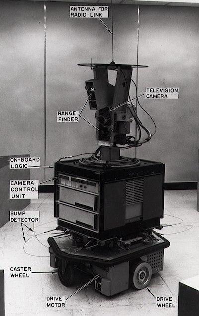

<!--
CO_OP_TRANSLATOR_METADATA:
{
  "original_hash": "b2d11df10030cacc41427a1fbc8bc8f1",
  "translation_date": "2025-08-29T13:45:31+00:00",
  "source_file": "1-Introduction/2-history-of-ML/README.md",
  "language_code": "ur"
}
-->
# مشین لرننگ کی تاریخ

  
> خاکہ: [ٹومومی ایمورا](https://www.twitter.com/girlie_mac)

## [لیکچر سے پہلے کا کوئز](https://gray-sand-07a10f403.1.azurestaticapps.net/quiz/3/)

---

> 🎥 اوپر دی گئی تصویر پر کلک کریں تاکہ اس سبق پر مبنی ایک مختصر ویڈیو دیکھ سکیں۔

اس سبق میں، ہم مشین لرننگ اور مصنوعی ذہانت کی تاریخ کے اہم مراحل کا جائزہ لیں گے۔

مصنوعی ذہانت (AI) کی تاریخ مشین لرننگ کی تاریخ سے جڑی ہوئی ہے، کیونکہ مشین لرننگ کے الگورتھمز اور کمپیوٹیشنل ترقیات نے AI کی ترقی میں مدد دی۔ یہ یاد رکھنا مفید ہے کہ اگرچہ یہ شعبے 1950 کی دہائی میں الگ الگ تحقیقی میدان کے طور پر ابھرے، لیکن اہم [الگورتھمک، شماریاتی، ریاضیاتی، کمپیوٹیشنل اور تکنیکی دریافتیں](https://wikipedia.org/wiki/Timeline_of_machine_learning) اس دور سے پہلے اور اس کے ساتھ ساتھ موجود تھیں۔ حقیقت میں، لوگ [صدیوں سے](https://wikipedia.org/wiki/History_of_artificial_intelligence) ان سوالات پر غور کر رہے ہیں: یہ مضمون 'سوچنے والی مشین' کے تصور کے تاریخی فکری بنیادوں پر روشنی ڈالتا ہے۔

---

## اہم دریافتیں

- 1763، 1812 [بیز تھیورم](https://wikipedia.org/wiki/Bayes%27_theorem) اور اس کے پیشرو۔ یہ تھیورم اور اس کی ایپلیکیشنز استدلال کے اصولوں پر مبنی ہیں، جو کسی واقعے کے ہونے کے امکان کو پچھلی معلومات کی بنیاد پر بیان کرتی ہیں۔
- 1805 [لیسٹ اسکوائر تھیوری](https://wikipedia.org/wiki/Least_squares) فرانسیسی ریاضی دان ایڈریان-ماری لیجنڈر کی دریافت۔ یہ تھیوری، جسے آپ ہمارے ریگریشن یونٹ میں سیکھیں گے، ڈیٹا فٹنگ میں مدد دیتی ہے۔
- 1913 [مارکوف چینز](https://wikipedia.org/wiki/Markov_chain)، جو روسی ریاضی دان آندرے مارکوف کے نام سے منسوب ہیں، ایک سابقہ حالت کی بنیاد پر ممکنہ واقعات کی ترتیب کو بیان کرنے کے لیے استعمال ہوتی ہیں۔
- 1957 [پرسپٹرون](https://wikipedia.org/wiki/Perceptron)، ایک قسم کا لکیری کلاسیفائر جو امریکی ماہر نفسیات فرینک روزن بلیٹ نے ایجاد کیا، جو ڈیپ لرننگ میں ترقیات کی بنیاد ہے۔

---

- 1967 [نیرسٹ نیبر](https://wikipedia.org/wiki/Nearest_neighbor)، ایک الگورتھم جو اصل میں راستے تلاش کرنے کے لیے ڈیزائن کیا گیا تھا۔ مشین لرننگ کے سیاق و سباق میں یہ پیٹرنز کا پتہ لگانے کے لیے استعمال ہوتا ہے۔
- 1970 [بیک پروپیگیشن](https://wikipedia.org/wiki/Backpropagation)، جو [فیڈ فارورڈ نیورل نیٹ ورکس](https://wikipedia.org/wiki/Feedforward_neural_network) کو تربیت دینے کے لیے استعمال ہوتا ہے۔
- 1982 [ریکَرَنٹ نیورل نیٹ ورکس](https://wikipedia.org/wiki/Recurrent_neural_network)، جو فیڈ فارورڈ نیورل نیٹ ورکس سے اخذ کیے گئے ہیں اور وقتی گراف بناتے ہیں۔

✅ تھوڑی تحقیق کریں۔ مشین لرننگ اور AI کی تاریخ میں اور کون سی تاریخیں اہم ہیں؟

---

## 1950: سوچنے والی مشینیں

ایلن ٹورنگ، ایک غیر معمولی شخصیت، جنہیں [2019 میں عوام نے](https://wikipedia.org/wiki/Icons:_The_Greatest_Person_of_the_20th_Century) 20ویں صدی کے سب سے عظیم سائنسدان کے طور پر منتخب کیا، کو 'سوچنے والی مشین' کے تصور کی بنیاد رکھنے میں مدد دینے کا سہرا دیا جاتا ہے۔ انہوں نے اس تصور کے لیے شواہد فراہم کرنے اور ناقدین کا سامنا کرنے کے لیے [ٹورنگ ٹیسٹ](https://www.bbc.com/news/technology-18475646) تخلیق کیا، جسے آپ ہمارے NLP اسباق میں دریافت کریں گے۔

---

## 1956: ڈارٹ ماؤتھ سمر ریسرچ پروجیکٹ

"ڈارٹ ماؤتھ سمر ریسرچ پروجیکٹ برائے مصنوعی ذہانت اس میدان کے لیے ایک اہم واقعہ تھا،" اور یہیں پر 'مصنوعی ذہانت' کی اصطلاح وضع کی گئی ([ماخذ](https://250.dartmouth.edu/highlights/artificial-intelligence-ai-coined-dartmouth))۔

> سیکھنے یا ذہانت کی کسی بھی خصوصیت کو اس قدر درستگی سے بیان کیا جا سکتا ہے کہ ایک مشین اسے نقل کر سکے۔

---

مرکزی محقق، ریاضی کے پروفیسر جان میکارتھی، نے امید ظاہر کی کہ "سیکھنے یا ذہانت کی کسی بھی خصوصیت کو اس قدر درستگی سے بیان کیا جا سکتا ہے کہ ایک مشین اسے نقل کر سکے۔" شرکاء میں اس میدان کی ایک اور ممتاز شخصیت، مارون منسکی، بھی شامل تھے۔

یہ ورکشاپ کئی مباحثوں کو شروع کرنے اور فروغ دینے کا سہرا رکھتی ہے، جن میں "علامتی طریقوں کا عروج، محدود ڈومینز پر مرکوز نظام (ابتدائی ماہر نظام)، اور استقرائی نظام کے مقابلے میں استدلالی نظام" شامل ہیں ([ماخذ](https://wikipedia.org/wiki/Dartmouth_workshop))۔

---

## 1956 - 1974: "سنہری دور"

1950 کی دہائی سے لے کر 1970 کی دہائی کے وسط تک، یہ امید عروج پر تھی کہ AI کئی مسائل کو حل کر سکتا ہے۔ 1967 میں، مارون منسکی نے پراعتماد انداز میں کہا کہ "ایک نسل کے اندر ... 'مصنوعی ذہانت' تخلیق کرنے کا مسئلہ بڑی حد تک حل ہو جائے گا۔" (منسکی، مارون (1967)، کمپیوٹیشن: فائنائٹ اینڈ انفینائٹ مشینز، اینگل ووڈ کلفس، این جے: پرینٹائس-ہال)

---

قدرتی زبان کی پروسیسنگ کی تحقیق میں ترقی ہوئی، تلاش کو بہتر اور زیادہ طاقتور بنایا گیا، اور 'مائیکرو ورلڈز' کا تصور تخلیق کیا گیا، جہاں سادہ کاموں کو عام زبان کی ہدایات کے ذریعے مکمل کیا جا سکتا تھا۔

---

تحقیق کو حکومتی ایجنسیوں سے اچھی مالی معاونت ملی، کمپیوٹیشن اور الگورتھمز میں ترقی ہوئی، اور ذہین مشینوں کے پروٹوٹائپ بنائے گئے۔ ان مشینوں میں شامل ہیں:

* [شیکی دی روبوٹ](https://wikipedia.org/wiki/Shakey_the_robot)، جو 'ذہانت سے' کام انجام دینے کے لیے حرکت کر سکتا تھا اور فیصلے کر سکتا تھا۔

      
    > شیکی 1972 میں

---

* ایلیزا، ایک ابتدائی 'چیٹربوٹ'، لوگوں سے بات چیت کر سکتی تھی اور ایک ابتدائی 'تھراپسٹ' کے طور پر کام کر سکتی تھی۔ آپ NLP اسباق میں ایلیزا کے بارے میں مزید سیکھیں گے۔

      
    > ایلیزا کا ایک ورژن، ایک چیٹ بوٹ

---

* "بلاکس ورلڈ" ایک مائیکرو ورلڈ کی مثال تھی، جہاں بلاکس کو ترتیب دیا جا سکتا تھا اور مشینوں کو فیصلے سکھانے کے تجربات کیے جا سکتے تھے۔ [SHRDLU](https://wikipedia.org/wiki/SHRDLU) جیسی لائبریریوں کے ساتھ بنائی گئی ترقیات نے زبان کی پروسیسنگ کو آگے بڑھایا۔

    

    > 🎥 اوپر دی گئی تصویر پر کلک کریں: بلاکس ورلڈ SHRDLU کے ساتھ

---

## 1974 - 1980: "AI کا سرد دور"

1970 کی دہائی کے وسط تک، یہ واضح ہو گیا کہ 'ذہین مشینیں' بنانے کی پیچیدگی کو کم سمجھا گیا تھا اور اس کے وعدے، دستیاب کمپیوٹ پاور کے پیش نظر، مبالغہ آمیز تھے۔ فنڈنگ ختم ہو گئی اور اس میدان میں اعتماد کم ہو گیا۔ کچھ مسائل جنہوں نے اعتماد کو متاثر کیا، شامل ہیں:

---

- **محدودیت**۔ کمپیوٹ پاور بہت محدود تھی۔
- **کمبینیشنی دھماکہ**۔ جیسے جیسے کمپیوٹرز سے مزید کام لیا گیا، تربیت کے لیے درکار پیرامیٹرز کی تعداد تیزی سے بڑھتی گئی، لیکن کمپیوٹ پاور اور صلاحیت میں متوازی ترقی نہیں ہوئی۔
- **ڈیٹا کی کمی**۔ ڈیٹا کی کمی نے الگورتھمز کی جانچ، ترقی، اور بہتری کے عمل کو روکا۔
- **کیا ہم صحیح سوالات پوچھ رہے ہیں؟**۔ وہی سوالات جو پوچھے جا رہے تھے، ان پر سوال اٹھنے لگے۔ محققین کو اپنے طریقوں پر تنقید کا سامنا کرنا پڑا:
  - ٹورنگ ٹیسٹ کو 'چینی کمرہ تھیوری' جیسے خیالات کے ذریعے سوالیہ نشان بنایا گیا، جس نے یہ دعویٰ کیا کہ "ایک ڈیجیٹل کمپیوٹر کو پروگرام کرنا اسے زبان کو سمجھنے کے قابل بنا سکتا ہے، لیکن حقیقی سمجھ پیدا نہیں کر سکتا۔" ([ماخذ](https://plato.stanford.edu/entries/chinese-room/))
  - مصنوعی ذہانت جیسے "تھراپسٹ" ایلیزا کو معاشرے میں متعارف کرانے کے اخلاقی پہلوؤں کو چیلنج کیا گیا۔

---

اسی وقت، AI کے مختلف اسکول آف تھاٹ بننے لگے۔ ایک تقسیم ["اسکریفی" بمقابلہ "نیٹ AI"](https://wikipedia.org/wiki/Neats_and_scruffies) طریقوں کے درمیان قائم ہوئی۔ _اسکریفی_ لیبز نے مطلوبہ نتائج حاصل کرنے کے لیے پروگراموں کو گھنٹوں تک ایڈجسٹ کیا۔ _نیٹ_ لیبز "منطق اور رسمی مسئلہ حل کرنے" پر مرکوز تھیں۔ ایلیزا اور SHRDLU مشہور _اسکریفی_ نظام تھے۔ 1980 کی دہائی میں، جیسے جیسے مشین لرننگ سسٹمز کو دوبارہ قابل عمل بنانے کی مانگ پیدا ہوئی، _نیٹ_ طریقہ کار آہستہ آہستہ غالب آ گیا کیونکہ اس کے نتائج زیادہ قابل وضاحت تھے۔

---

## 1980 کی دہائی: ماہر نظام

جیسے جیسے یہ میدان بڑھا، اس کے کاروباری فوائد واضح ہونے لگے، اور 1980 کی دہائی میں 'ماہر نظام' کی کثرت ہوئی۔ "ماہر نظام مصنوعی ذہانت (AI) سافٹ ویئر کی پہلی کامیاب اقسام میں شامل تھے۔" ([ماخذ](https://wikipedia.org/wiki/Expert_system))

یہ نظام دراصل _ہائبرڈ_ تھا، جس میں جزوی طور پر ایک قواعد انجن شامل تھا جو کاروباری ضروریات کی وضاحت کرتا تھا، اور ایک استدلالی انجن جو قواعد کے نظام کو استعمال کرتے ہوئے نئے حقائق اخذ کرتا تھا۔

اسی دور میں نیورل نیٹ ورکس پر بھی زیادہ توجہ دی گئی۔

---

## 1987 - 1993: AI کا 'ٹھنڈا دور'

ماہر نظام کے خصوصی ہارڈویئر کی کثرت کا بدقسمتی سے یہ اثر ہوا کہ وہ بہت زیادہ مخصوص ہو گئے۔ ذاتی کمپیوٹرز کے عروج نے ان بڑے، مخصوص، مرکزی نظاموں کے ساتھ مقابلہ کیا۔ کمپیوٹنگ کی جمہوریت کا آغاز ہو چکا تھا، اور اس نے بالآخر بڑے ڈیٹا کے جدید دھماکے کے لیے راہ ہموار کی۔

---

## 1993 - 2011

اس دور میں مشین لرننگ اور AI نے ان مسائل کو حل کرنے کے لیے ایک نیا دور دیکھا جو پہلے ڈیٹا اور کمپیوٹ پاور کی کمی کی وجہ سے پیدا ہوئے تھے۔ ڈیٹا کی مقدار تیزی سے بڑھنے لگی اور زیادہ دستیاب ہو گئی، اچھے اور برے دونوں پہلوؤں کے ساتھ، خاص طور پر 2007 کے آس پاس اسمارٹ فون کے آغاز کے ساتھ۔ کمپیوٹ پاور میں تیزی سے اضافہ ہوا، اور الگورتھمز کے ساتھ ساتھ ارتقاء ہوا۔ یہ میدان پختگی حاصل کرنے لگا کیونکہ ماضی کے آزادانہ دن ایک حقیقی ڈسپلن میں ڈھلنے لگے۔

---

## آج

آج مشین لرننگ اور AI ہماری زندگی کے تقریباً ہر حصے کو چھو رہے ہیں۔ یہ دور ان الگورتھمز کے انسانی زندگیوں پر اثرات اور خطرات کو سمجھنے کے لیے محتاط غور و فکر کا تقاضا کرتا ہے۔ جیسا کہ مائیکروسافٹ کے بریڈ اسمتھ نے کہا، "انفارمیشن ٹیکنالوجی ایسے مسائل کو جنم دیتی ہے جو بنیادی انسانی حقوق کے تحفظات جیسے پرائیویسی اور اظہار رائے کی آزادی کے دل میں جاتے ہیں۔ یہ مسائل ان ٹیک کمپنیوں کے لیے ذمہ داری کو بڑھاتے ہیں جو یہ مصنوعات بناتی ہیں۔ ہماری نظر میں، یہ سوچے سمجھے حکومتی ضوابط اور قابل قبول استعمال کے ارد گرد اصولوں کی ترقی کا بھی تقاضا کرتے ہیں۔" ([ماخذ](https://www.technologyreview.com/2019/12/18/102365/the-future-of-ais-impact-on-society/))

---

یہ دیکھنا باقی ہے کہ مستقبل کیا لاتا ہے، لیکن ان کمپیوٹر سسٹمز اور ان کے چلنے والے سافٹ ویئر اور الگورتھمز کو سمجھنا ضروری ہے۔ ہمیں امید ہے کہ یہ نصاب آپ کو بہتر سمجھنے میں مدد دے گا تاکہ آپ خود فیصلہ کر سکیں۔

> 🎥 اوپر دی گئی تصویر پر کلک کریں: یان لیکن اس لیکچر میں ڈیپ لرننگ کی تاریخ پر بات کرتے ہیں

---

## 🚀چیلنج

ان تاریخی لمحات میں سے کسی ایک پر تحقیق کریں اور ان کے پیچھے موجود لوگوں کے بارے میں مزید جانیں۔ یہ دلچسپ شخصیات ہیں، اور کوئی بھی سائنسی دریافت کبھی بھی ثقافتی خلا میں نہیں کی گئی۔ آپ کیا دریافت کرتے ہیں؟

## [لیکچر کے بعد کا کوئز](https://gray-sand-07a10f403.1.azurestaticapps.net/quiz/4/)

---

## جائزہ اور خود مطالعہ

یہاں دیکھنے اور سننے کے لیے کچھ مواد ہیں:

[یہ پوڈکاسٹ جہاں ایمی بوائیڈ AI کے ارتقاء پر بات کرتی ہیں](http://runasradio.com/Shows/Show/739)

---

## اسائنمنٹ

[ایک ٹائم لائن بنائیں](assignment.md)

---

**ڈسکلیمر**:  
یہ دستاویز AI ترجمہ سروس [Co-op Translator](https://github.com/Azure/co-op-translator) کا استعمال کرتے ہوئے ترجمہ کی گئی ہے۔ ہم درستگی کے لیے کوشش کرتے ہیں، لیکن براہ کرم آگاہ رہیں کہ خودکار ترجمے میں غلطیاں یا غیر درستیاں ہو سکتی ہیں۔ اصل دستاویز کو اس کی اصل زبان میں مستند ذریعہ سمجھا جانا چاہیے۔ اہم معلومات کے لیے، پیشہ ور انسانی ترجمہ کی سفارش کی جاتی ہے۔ ہم اس ترجمے کے استعمال سے پیدا ہونے والی کسی بھی غلط فہمی یا غلط تشریح کے ذمہ دار نہیں ہیں۔