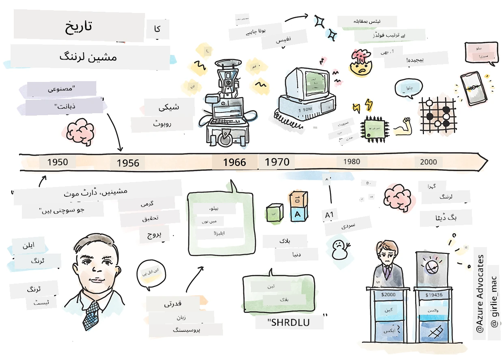
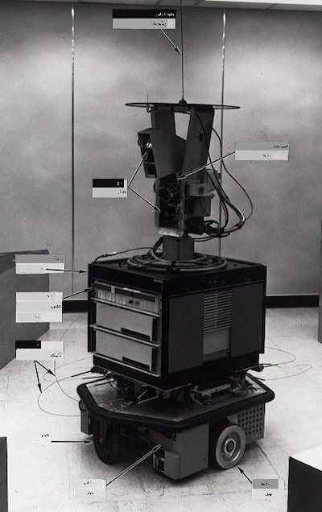
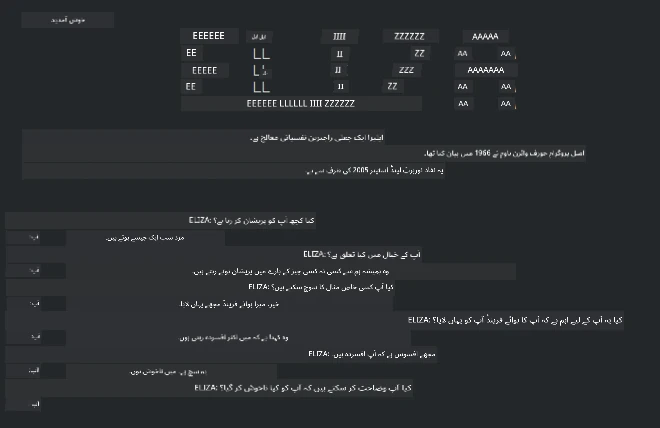

# مشین لرننگ کی تاریخ

> سکیچ نوٹ بذریعہ [Tomomi Imura](https://www.twitter.com/girlie_mac)

## [پری لیکچر کوئز](https://ff-quizzes.netlify.app/en/ml/)

---

> 🎥 اس سبق کو سمجھنے کے لیے اوپر تصویر پر کلک کریں۔

اس سبق میں، ہم مشین لرننگ اور مصنوعی ذہانت کی تاریخ کے بڑے milestones کا جائزہ لیں گے۔

مصنوعی ذہانت (AI) کی تاریخ مشین لرننگ کی تاریخ کے ساتھ جڑی ہوئی ہے، کیونکہ ML کو سہارا دینے والے الگوردمز اور کمپیوٹیشنل ترقیات AI کی ترقی میں مددگار ثابت ہوئے۔ یاد رکھنا مفید ہے کہ، اگرچہ یہ میدان 1950 کی دہائی میں الگ تحقیقی شعبوں کی صورت میں سامنے آئے، اہم [الگوردمک، شماریاتی، ریاضیاتی، کمپیوٹیشنل اور تکنیکی دریافتیں](https://wikipedia.org/wiki/Timeline_of_machine_learning) اس دور سے پہلے اور اس کے متوازی ہوئی تھیں۔ درحقیقت، لوگ [صدیوں سے](https://wikipedia.org/wiki/History_of_artificial_intelligence) ان سوالات پر غور کر رہے ہیں: یہ مضمون 'سوچنے والی مشین' کے نظریے کی تاریخی فکری بنیادوں پر بحث کرتا ہے۔

---
## قابل ذکر دریافتیں

- 1763، 1812 [بیز تھیورم](https://wikipedia.org/wiki/Bayes%27_theorem) اور اس کے پیش رو۔ یہ تھیورم اور اس کی ایپلیکیشنز انفرینس کی بنیاد ہیں، جو کسی واقعے کے ہونے کے امکانات کو سابقہ علم کی بنیاد پر بیان کرتی ہیں۔
- 1805 [لیسٹ اسکوائر تھیوری](https://wikipedia.org/wiki/Least_squares) فرانسیسی ریاضی دان ایڈریئن-میری لیجیڈر کے ذریعہ۔ یہ تھیوری، جس کے بارے میں آپ ہمارے ریگریشن یونٹ میں سیکھیں گے، ڈیٹا فٹنگ میں مدد دیتی ہے۔
- 1913 [مارکوف چینز](https://wikipedia.org/wiki/Markov_chain)، روسی ریاضی دان اینڈرے مارکوف کے نام پر، پچھلے سٹیٹ کی بنیاد پر ممکنہ واقعات کے سلسلے کی وضاحت کے لیے استعمال ہوتی ہے۔
- 1957 [پرسیپٹرون](https://wikipedia.org/wiki/Perceptron) امریکی ماہر نفسیات فرینک روزن بلیٹ کی ایجاد شدہ خطی کلاسیفائر ہے جو ڈیپ لرننگ میں ترقیات کی بنیاد ہے۔

---

- 1967 [نئیرسٹ نیبر](https://wikipedia.org/wiki/Nearest_neighbor) ایک الگوردم ہے جو اصل میں راستے بنانا سیکھایا گیا تھا۔ مشین لرننگ کے سیاق و سباق میں یہ پیٹرنز کا پتہ لگانے کے لیے استعمال ہوتا ہے۔
- 1970 [بیک پروپیگیشن](https://wikipedia.org/wiki/Backpropagation) [فیڈفاروڈ نیورل نیٹ ورکس](https://wikipedia.org/wiki/Feedforward_neural_network) کی تربیت کے لیے استعمال ہوتا ہے۔
- 1982 [ریکرنٹ نیورل نیٹ ورکس](https://wikipedia.org/wiki/Recurrent_neural_network) فیڈفاروڈ نیورل نیٹ ورکس سے ماخوذ مصنوعی نیورل نیٹ ورکس ہیں جو وقتی گرافز بناتے ہیں۔

✅ ذرا تحقیق کریں۔ مشین لرننگ اور مصنوعی ذہانت کی تاریخ میں اور کون سی تاریخیں اہم ہیں؟

---
## 1950: سوچنے والی مشینیں

ایلن ٹورنگ، ایک واقعی شان دار شخصیت جنہیں [2019 میں عوامی ووٹ](https://wikipedia.org/wiki/Icons:_The_Greatest_Person_of_the_20th_Century) سے 20ویں صدی کا سب سے عظیم سائنسدان قرار دیا گیا، کو 'سوچنے والی مشین' کے تصور کی بنیاد رکھنے کا کریڈٹ دیا جاتا ہے۔ انہوں نے نکتہ چینی کرنے والوں اور اپنے تصورات کے تجرباتی ثبوت کی ضرورت کے ساتھ جدوجہد کی، جزوی طور پر [ٹورنگ ٹیسٹ](https://www.bbc.com/news/technology-18475646) بنا کر، جسے آپ ہمارے NLP سبق میں دریافت کریں گے۔

---
## 1956: ڈارٹماؤتھ سمر ریسرچ پروجیکٹ

"ڈارٹماؤتھ سمر ریسرچ پروجیکٹ مصنوعی ذہانت کے میدان کے لیے ایک اہم واقعہ تھا," اور یہاں 'مصنوعی ذہانت' کی اصطلاح متعارف کرائی گئی ([ماخذ](https://250.dartmouth.edu/highlights/artificial-intelligence-ai-coined-dartmouth))۔

> سیکھنے یا ذہانت کی کسی بھی خصوصیت کو اتنی دقیق وضاحت کی جا سکتی ہے کہ ایک مشین اسے نقل کر سکے۔

---

سربراہ محقق، ریاضی کے پروفیسر جان میککارتی، نے امید ظاہر کی کہ "سیکھنے یا ذہانت کی ہر جز کو اتنی دقیق وضاحت کے قابل بنایا جا سکتا ہے کہ مشین اسے نقل کر سکے۔" شرکاء میں اس میدان کا ایک اور جانا پہچانا نام مارون منسکی بھی شامل تھا۔

ورکشاپ کو یہ کریڈٹ دیا جاتا ہے کہ اس نے کئی مباحثوں کی ابتدا کی، جن میں "علامتی طریقوں کا عروج، محدود دائرہ کار پر مبنی سسٹم (ابتدائی ماہر نظام)، اور استدلالی نظام بمقابلہ شعوری نظام" شامل تھے۔ ([ماخذ](https://wikipedia.org/wiki/Dartmouth_workshop))

---
## 1956 - 1974: "سنہری سال"

1950 کی دہائی سے لے کر وسطِ 70 کی دہائی تک، امیدیں اس بات پر تھیں کہ AI کئی مسائل حل کر سکے گا۔ 1967 میں مارون منسکی نے پراعتماد کہا کہ "ایک نسل کے اندر ... 'مصنوعی ذہانت' کے مسئلے کو بنیادی طور پر حل کر لیا جائے گا۔" (منسکی، مارون (1967)، کمپیوٹیشن: فنائٹ اینڈ انفنائٹ مشینز، انگلوڈ کلیفس، N.J.: پرینٹس-ہال)

قدرتی زبان کی پراسیسنگ تحقیق نے فروغ پایا، سرچ مضبوط اور طاقتور بنی، اور ’مائیکرو ورلڈز‘ کا تصور تخلیق کیا گیا، جہاں سادہ زبان کی ہدایات سے آسان کام مکمل کیے گئے۔

---

تحقیق کو حکومتی اداروں کی طرف سے اچھی فنڈنگ ملی، کمپیوٹیشن اور الگوردمز میں ترقی ہوئی، اور ذہین مشینوں کے پروٹوٹائپس بنائے گئے۔ ان مشینوں میں شامل ہیں:

* [شیکی دی روبوٹ](https://wikipedia.org/wiki/Shakey_the_robot)، جو ذہانت سے کام کرنے کے لیے خود کو منیور کر سکتا تھا اور فیصلہ کر سکتا تھا۔

    
    > شیکی 1972 میں

---

* ایلیزا، ایک ابتدائی 'چیٹ بوت'، لوگوں سے بات چیت کر سکتی تھی اور ایک ابتدائی ’تھراپسٹ‘ کے طور پر کام کر سکتی تھی۔ آپ NLP سبق میں ایلیزا کے بارے میں مزید جانیں گے۔

    
    > ایلیزا کا ایک ورژن، ایک چیٹ بوٹ

---

* "بلاکس ورلڈ" ایک مائیکرو ورلڈ کی مثال تھی جہاں بلاکس کو اسٹیک اور ترتیب دیا جا سکتا تھا، اور مشینوں کو فیصلے کرنے کی تربیت دینے کے تجربات کیے گئے۔ [SHRDLU](https://wikipedia.org/wiki/SHRDLU) جیسی لائبریریوں کے ذریعے کی گئی پیش رفت نے زبان کی پراسیسنگ کو آگے بڑھایا۔

    

    > 🎥 ویڈیو کے لیے اوپر تصویر پر کلک کریں: SHRDLU کے ساتھ بلاکس ورلڈ

---
## 1974 - 1980: "AI سردیوں کا موسم"

وسط 1970 کی دہائی تک یہ واضح ہو چکا تھا کہ ’ذہین مشینیں‘ بنانے کی پیچیدگی کو کم سمجھا گیا تھا اور دستیاب کمپیوٹ پاور کے ساتھ اس کا وعدہ زیادہ دکھایا گیا تھا۔ فنڈنگ ختم ہو گئی اور میدان میں اعتماد سست پڑ گیا۔ کچھ مسائل جنہوں نے اعتماد پر اثر ڈالا شامل ہیں:
---
- **حدود**۔ کمپیوٹ پاور بہت محدود تھی۔
- **کمبینیٹورئیل ایکسپلوژن**۔ جتنی زیادہ چیزیں کمپیوٹر سے طلب کی گئیں، تربیت کے لیے ضروری پیرامیٹرز کی تعداد بے تحاشا بڑھتی گئی، کمپیوٹ پاور اور صلاحیت کی متوازی ترقی کے بغیر۔
- **ڈیٹا کی کمی**۔ ڈیٹا کی کمی نے الگوردمز کی جانچ، ترقی، اور بہتر بنانے کے عمل میں رکاوٹ پیدا کی۔
- **کیا ہم صحیح سوالات پوچھ رہے ہیں؟**۔ پوچھے جانے والے سوالات ہی مشکوک ہو گئے۔ محققین کو اپنی طریقوں پر تنقید کا سامنا کرنا پڑا:
  - ٹورنگ ٹیسٹس کو 'چائنیز روم تھیوری' سمیت کئی خیالات کے ذریعے چیلنج کیا گیا، جس نے کہا، "ڈیجیٹل کمپیوٹر کو پروگرام کرنا اسے زبان سمجھنے کا دکھاوا کروا سکتا ہے لیکن حقیقی سمجھ بوجھ پیدا نہیں کر سکتا۔" ([ماخذ](https://plato.stanford.edu/entries/chinese-room/))
  - مصنوعی ذہانتیں جیسے "تھراپسٹ" ایلیزا کو معاشرے میں متعارف کرانے کی اخلاقیات پر سوال اٹھائے گئے۔

---

اسی دوران، مختلف AI کے نظریے وجود میں آئے۔ ایک تقسیم قائم ہوئی ["اسکریفی" بمقابلہ "نیٹ AI"](https://wikipedia.org/wiki/Neats_and_scruffies) پریکٹسز کے درمیان۔ _اسکریفی_ لیبارٹریاں پروگراموں میں گھنٹوں ترمیم کرتی رہیں یہاں تک کہ مطلوبہ نتائج حاصل ہو جائیں۔ _نیٹ_ لیبارٹریوں نے "منطق اور رسمی مسئلہ حل کرنے پر توجہ مرکوز کی۔" ایلیزا اور SHRDLU مشہور _اسکریفی_ سسٹمز تھے۔ 1980 کے عشروں میں، جب ML سسٹمز کو قابل تکرار بنانے کی ضرورت آئی، تو _نیٹ_ نقطہ نظر نے آہستہ آہستہ برتری حاصل کی کیونکہ اس کے نتائج زیادہ قابل وضاحت ہوتے ہیں۔

---
## 1980 کی دہائی کے ماہر نظام

جیسے جیسے یہ میدان بڑھا، کاروبار کو اس کا فائدہ واضح ہوا، اور 1980 کی دہائی میں 'ماہر نظام' کی کثرت بھی سامنے آئی۔ "ماہر نظام حقیقت میں مصنوعی ذہانت (AI) سافٹ ویئر کی پہلی کامیاب اشکال میں شامل تھے۔" ([ماخذ](https://wikipedia.org/wiki/Expert_system))

اس قسم کا نظام درحقیقت _ہائبرڈ_ تھا، جس میں جزوی طور پر کاروباری ضروریات کی وضاحت کرنے والا رولز انجن اور رولز سسٹم سے نئے حقائق اخذ کرنے والا انفرنس انجن شامل تھے۔

اس دور میں نیورل نیٹ ورکس پر بھی بڑھتی ہوئی توجہ دی گئی۔

---
## 1987 - 1993: AI ’ٹھنڈک‘

ماہر نظام کے خصوصی ہارڈویئر کی کثرت نے ناگوار اثرات ڈالا اور یہ بہت زیادہ مخصوص بن گئے۔ پرسنل کمپیوٹروں کے عروج نے بھی ان بڑے، مخصوص، مرکزی نظاموں سے مقابلہ کیا۔ کمپیوٹنگ کی جمہوریت شروع ہوئی، اور اس نے آخر کار بگ ڈیٹا کے جدید دھماکے کی راہ ہموار کی۔

---
## 1993 - 2011

اس دور میں مشین لرننگ اور مصنوعی ذہانت کے لیے ایک نیا دور شروع ہوا، جو ڈیٹا اور کمپیوٹ پاور کی کمی کی وجہ سے پیش آنے والے مسائل کو حل کرنے کے قابل ہوئے۔ ڈیٹا کی مقدار تیزی سے بڑھی اور زیادہ دستیاب ہو گئی، خصوصاً 2007 کے آس پاس اسمارٹ فون کے آنے کے ساتھ۔ کمپیوٹ پاور نے بے انتہا ترقی کی، اور الگوردمز بھی اس کے مطابق بہتر ہوئے۔ یہ میدان پختگی کی طرف بڑھا کیونکہ ماضی کے آزاد دن ایک حقیقی ڈسپلن کی شکل اختیار کرنے لگے۔

---
## آج

آج مشین لرننگ اور مصنوعی ذہانت ہماری زندگی کے تقریباً ہر حصے کو چھوتے ہیں۔ یہ دور ان الگوردمز کے انسانی زندگیوں پر ممکنہ اثرات اور خطرات کے محتاط سمجھنے کا متقاضی ہے۔ جیسا کہ مائیکروسافٹ کے براد سمتھ نے کہا ہے، "انفارمیشن ٹیکنالوجی ایسے مسائل اٹھاتی ہے جو بنیادی انسانی حقوق جیسے پرائیویسی اور اظہار کی آزادی کے دل سے جڑے ہوتے ہیں۔ یہ مسائل ٹیک کمپنیوں کی ذمہ داری بڑھاتے ہیں جو یہ مصنوعات بناتی ہیں۔ ہماری نظر میں، یہ غور و فکر والی حکومتی ضوابط اور قبول شدہ استعمال کے حوالے سے اصولوں کی ترقی کا مطالبہ بھی کرتے ہیں" ([ماخذ](https://www.technologyreview.com/2019/12/18/102365/the-future-of-ais-impact-on-society/))۔

---

مستقبل کیا لے کر آئے گا، یہ دیکھنا باقی ہے، لیکن یہ ضروری ہے کہ ان کمپیوٹر سسٹمز، سافٹ ویئر اور الگوردمز کو سمجھا جائے جو ان کو چلاتے ہیں۔ ہم امید کرتے ہیں کہ یہ نصاب آپ کو بہتر سمجھ حاصل کرنے میں مدد دے گا تاکہ آپ خود فیصلہ کر سکیں۔

> 🎥 اوپر تصویر پر کلک کریں: اس لیکچر میں یان لیکون ڈیپ لرننگ کی تاریخ پر گفتگو کرتے ہیں

---
## 🚀چیلنج

ان تاریخی لمحوں میں سے کسی ایک میں کھودائی کریں اور ان کے پیچھے کھڑے لوگوں کے بارے میں مزید جانیں۔ دلچسپ شخصیات ہیں، اور کوئی بھی سائنسی دریافت ثقافتی خلا میں کبھی پیدا نہیں ہوئی۔ آپ کیا دریافت کرتے ہیں؟

## [پوسٹ لیکچر کوئز](https://ff-quizzes.netlify.app/en/ml/)

---
## جائزہ اور خود مطالعہ

دیکھنے اور سننے کے لیے چند اشیاء:

[یہ پوڈکاسٹ جہاں ایمی بوئڈ AI کی ترقی پر بات کرتی ہیں](http://runasradio.com/Shows/Show/739)

---

## اسائنمنٹ

[ایک ٹائم لائن بنائیں](assignment.md)

---

<!-- CO-OP TRANSLATOR DISCLAIMER START -->
**ڈس کلیمر**:
یہ دستاویز AI ترجمہ سروس [Co-op Translator](https://github.com/Azure/co-op-translator) کے ذریعے ترجمہ کی گئی ہے۔ جبکہ ہم درستگی کے لیے کوشاں ہیں، براہ کرم اس بات سے آگاہ رہیں کہ خودکار ترجمے میں غلطیاں یا عدم درستیاں ہو سکتی ہیں۔ اصل دستاویز اپنے مادری زبان میں مستند ماخذ سمجھی جائے گی۔ حساس معلومات کے لیے پیشہ ور انسانی ترجمہ کی سفارش کی جاتی ہے۔ اس ترجمے کے استعمال سے پیدا ہونے والی کسی بھی غلط فہمی یا غلط تشریح کی ذمہ داری ہم قبول نہیں کرتے۔
<!-- CO-OP TRANSLATOR DISCLAIMER END -->