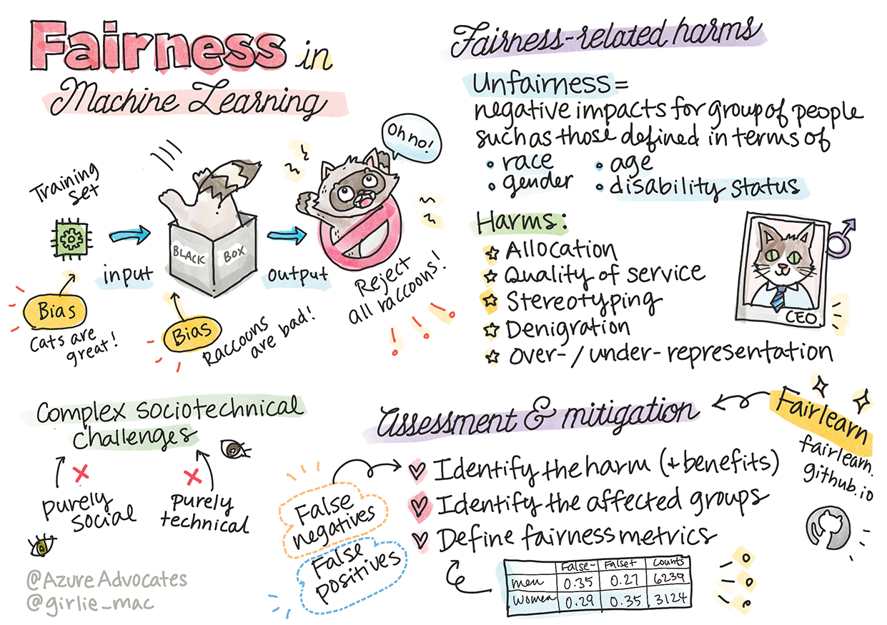

<!--
CO_OP_TRANSLATOR_METADATA:
{
  "original_hash": "8f819813b2ca08ec7b9f60a2c9336045",
  "translation_date": "2025-08-29T13:36:45+00:00",
  "source_file": "1-Introduction/3-fairness/README.md",
  "language_code": "ur"
}
-->
# مشین لرننگ کے حل کو ذمہ دار AI کے ساتھ بنانا

> خاکہ: [Tomomi Imura](https://www.twitter.com/girlie_mac)

## [لیکچر سے پہلے کا کوئز](https://gray-sand-07a10f403.1.azurestaticapps.net/quiz/5/)

## تعارف

اس نصاب میں، آپ یہ دریافت کرنا شروع کریں گے کہ مشین لرننگ کس طرح اور کس حد تک ہماری روزمرہ کی زندگیوں پر اثر ڈال رہی ہے۔ آج بھی، سسٹمز اور ماڈلز روزمرہ کے فیصلوں میں شامل ہیں، جیسے صحت کی تشخیص، قرض کی منظوری، یا دھوکہ دہی کا پتہ لگانا۔ اس لیے یہ ضروری ہے کہ یہ ماڈلز ایسے نتائج فراہم کریں جو قابل اعتماد ہوں۔ جیسے کسی بھی سافٹ ویئر ایپلیکیشن میں، AI سسٹمز بھی توقعات پر پورا نہ اتر سکتے ہیں یا ناپسندیدہ نتائج دے سکتے ہیں۔ یہی وجہ ہے کہ AI ماڈل کے رویے کو سمجھنا اور وضاحت کرنا ضروری ہے۔

سوچیں کہ کیا ہو سکتا ہے جب آپ کے ماڈلز بنانے کے لیے استعمال ہونے والے ڈیٹا میں کچھ مخصوص آبادیاتی گروپس، جیسے نسل، جنس، سیاسی نظریہ، مذہب، شامل نہ ہوں یا ان کی نمائندگی غیر متناسب ہو۔ اگر ماڈل کے نتائج کسی خاص گروپ کو ترجیح دیتے ہیں تو اس کا اطلاق پر کیا اثر ہوگا؟ مزید یہ کہ، اگر ماڈل کے نتائج نقصان دہ ہوں تو کیا ہوگا؟ AI سسٹمز کے رویے کے لیے کون ذمہ دار ہوگا؟ یہ وہ سوالات ہیں جنہیں ہم اس نصاب میں تلاش کریں گے۔

اس سبق میں، آپ:

- مشین لرننگ میں انصاف پسندی اور اس سے جڑے نقصانات کی اہمیت کے بارے میں آگاہی حاصل کریں گے۔
- غیر معمولی حالات اور آؤٹ لائرز کو دریافت کرنے کی مشق سے واقف ہوں گے تاکہ قابل اعتماد اور محفوظ نتائج کو یقینی بنایا جا سکے۔
- سب کو بااختیار بنانے کے لیے جامع نظاموں کے ڈیزائن کی ضرورت کو سمجھیں گے۔
- ڈیٹا اور لوگوں کی پرائیویسی اور سیکیورٹی کے تحفظ کی اہمیت کو دریافت کریں گے۔
- AI ماڈلز کے رویے کی وضاحت کے لیے شفافیت کے "گلاس باکس" نقطہ نظر کی اہمیت کو دیکھیں گے۔
- اس بات کا خیال رکھیں گے کہ AI سسٹمز میں اعتماد پیدا کرنے کے لیے جوابدہی کتنی ضروری ہے۔

## پیشگی شرط

پیشگی شرط کے طور پر، براہ کرم "ذمہ دار AI اصول" کا لرن پاتھ مکمل کریں اور نیچے دی گئی ویڈیو دیکھیں:

ذمہ دار AI کے بارے میں مزید جاننے کے لیے اس [لرننگ پاتھ](https://docs.microsoft.com/learn/modules/responsible-ai-principles/?WT.mc_id=academic-77952-leestott) کو فالو کریں۔

> 🎥 اوپر دی گئی تصویر پر کلک کریں: Microsoft کا ذمہ دار AI کے لیے نقطہ نظر

## انصاف پسندی

AI سسٹمز کو سب کے ساتھ منصفانہ سلوک کرنا چاہیے اور مختلف گروپس پر مختلف اثرات ڈالنے سے گریز کرنا چاہیے۔ مثال کے طور پر، جب AI سسٹمز طبی علاج، قرض کی درخواستوں، یا ملازمت کے بارے میں رہنمائی فراہم کرتے ہیں، تو انہیں ایک جیسے حالات، مالی حالات، یا پیشہ ورانہ قابلیت رکھنے والے سب کے لیے یکساں سفارشات دینی چاہئیں۔ ہم سب انسانوں میں وراثتی تعصبات ہوتے ہیں جو ہمارے فیصلوں اور اعمال کو متاثر کرتے ہیں۔ یہ تعصبات اس ڈیٹا میں ظاہر ہو سکتے ہیں جو ہم AI سسٹمز کو تربیت دینے کے لیے استعمال کرتے ہیں۔ یہ تعصبات بعض اوقات غیر ارادی طور پر بھی شامل ہو سکتے ہیں۔ اکثر یہ جاننا مشکل ہوتا ہے کہ آپ کب ڈیٹا میں تعصب شامل کر رہے ہیں۔

**"ناانصافی"** ان منفی اثرات یا "نقصانات" کو شامل کرتی ہے جو کسی گروپ پر پڑ سکتے ہیں، جیسے نسل، جنس، عمر، یا معذوری کی بنیاد پر۔ انصاف پسندی سے متعلق نقصانات کو درج ذیل اقسام میں تقسیم کیا جا سکتا ہے:

- **تقسیم**: اگر کسی جنس یا نسل کو دوسرے پر ترجیح دی جائے۔
- **سروس کا معیار**: اگر آپ نے ڈیٹا کو کسی خاص منظرنامے کے لیے تربیت دی ہو لیکن حقیقت زیادہ پیچیدہ ہو، تو یہ ناقص کارکردگی کا باعث بن سکتا ہے۔ مثال کے طور پر، ایک ہینڈ صابن ڈسپنسر جو گہرے رنگ کی جلد والے لوگوں کو پہچاننے میں ناکام رہا۔ [حوالہ](https://gizmodo.com/why-cant-this-soap-dispenser-identify-dark-skin-1797931773)
- **تنقید**: کسی چیز یا کسی کو غیر منصفانہ طور پر تنقید کا نشانہ بنانا۔ مثال کے طور پر، ایک امیج لیبلنگ ٹیکنالوجی نے بدنام زمانہ طور پر گہرے رنگ کی جلد والے لوگوں کی تصاویر کو گوریلا کے طور پر غلط لیبل کیا۔
- **زیادہ یا کم نمائندگی**: یہ تصور کہ کسی خاص گروپ کو کسی خاص پیشے میں نہیں دیکھا جاتا، اور کوئی بھی سروس یا فنکشن جو اس کو فروغ دیتا ہے، نقصان میں حصہ ڈال رہا ہے۔
- **اسٹیریو ٹائپنگ**: کسی گروپ کو پہلے سے تفویض کردہ خصوصیات کے ساتھ منسلک کرنا۔ مثال کے طور پر، انگریزی اور ترکی کے درمیان زبان کے ترجمے کا نظام الفاظ کے صنفی تعصبات کی وجہ سے غلطیاں کر سکتا ہے۔

> ترکی زبان میں ترجمہ

> واپس انگریزی میں ترجمہ

جب AI سسٹمز کو ڈیزائن اور ٹیسٹ کیا جا رہا ہو، تو یہ یقینی بنانا ضروری ہے کہ AI منصفانہ ہو اور اسے ایسے تعصبات یا امتیازی فیصلے کرنے کے لیے پروگرام نہ کیا جائے جو انسانوں کے لیے بھی ممنوع ہیں۔ AI اور مشین لرننگ میں انصاف کو یقینی بنانا ایک پیچیدہ سماجی-تکنیکی چیلنج ہے۔

### قابل اعتمادیت اور حفاظت

اعتماد پیدا کرنے کے لیے، AI سسٹمز کو قابل اعتماد، محفوظ، اور عام اور غیر متوقع حالات میں مستقل ہونا چاہیے۔ یہ جاننا ضروری ہے کہ AI سسٹمز مختلف حالات میں کیسے کام کریں گے، خاص طور پر جب وہ غیر معمولی ہوں۔ AI حل بناتے وقت، ان مختلف حالات پر توجہ مرکوز کرنا ضروری ہے جن کا سامنا AI حل کو ہو سکتا ہے۔ مثال کے طور پر، ایک خودکار گاڑی کو لوگوں کی حفاظت کو اولین ترجیح دینی چاہیے۔ اس کے نتیجے میں، گاڑی کو چلانے والے AI کو ان تمام ممکنہ منظرناموں پر غور کرنا چاہیے جن کا سامنا گاڑی کو ہو سکتا ہے، جیسے رات، طوفان، برف باری، سڑک پر دوڑتے بچے، پالتو جانور، سڑک کی تعمیرات وغیرہ۔ AI سسٹم مختلف حالات کو کتنی اچھی طرح سے قابل اعتماد اور محفوظ طریقے سے سنبھال سکتا ہے، یہ اس بات کی عکاسی کرتا ہے کہ ڈیٹا سائنسدان یا AI ڈویلپر نے ڈیزائن یا ٹیسٹنگ کے دوران کتنی پیش بینی کی۔

> [🎥 یہاں ویڈیو کے لیے کلک کریں: ](https://www.microsoft.com/videoplayer/embed/RE4vvIl)

### شمولیت

AI سسٹمز کو سب کو شامل کرنے اور بااختیار بنانے کے لیے ڈیزائن کیا جانا چاہیے۔ AI سسٹمز کو ڈیزائن اور نافذ کرتے وقت، ڈیٹا سائنسدان اور AI ڈویلپر ان ممکنہ رکاوٹوں کی نشاندہی کرتے ہیں اور ان کا حل نکالتے ہیں جو غیر ارادی طور پر لوگوں کو خارج کر سکتی ہیں۔ مثال کے طور پر، دنیا بھر میں 1 ارب افراد معذوری کے ساتھ رہتے ہیں۔ AI کی ترقی کے ساتھ، وہ اپنی روزمرہ کی زندگی میں معلومات اور مواقع تک زیادہ آسانی سے رسائی حاصل کر سکتے ہیں۔ ان رکاوٹوں کو دور کرنے سے، AI مصنوعات کو بہتر تجربات کے ساتھ اختراع کرنے اور تیار کرنے کے مواقع پیدا ہوتے ہیں جو سب کے لیے فائدہ مند ہیں۔

> [🎥 یہاں ویڈیو کے لیے کلک کریں: AI میں شمولیت](https://www.microsoft.com/videoplayer/embed/RE4vl9v)

### سیکیورٹی اور پرائیویسی

AI سسٹمز کو محفوظ ہونا چاہیے اور لوگوں کی پرائیویسی کا احترام کرنا چاہیے۔ لوگ ان سسٹمز پر کم اعتماد کرتے ہیں جو ان کی پرائیویسی، معلومات، یا زندگیوں کو خطرے میں ڈال دیتے ہیں۔ مشین لرننگ ماڈلز کو تربیت دیتے وقت، ہم بہترین نتائج حاصل کرنے کے لیے ڈیٹا پر انحصار کرتے ہیں۔ ایسا کرتے وقت، ڈیٹا کے ماخذ اور سالمیت پر غور کرنا ضروری ہے۔ مثال کے طور پر، کیا ڈیٹا صارف نے جمع کرایا تھا یا یہ عوامی طور پر دستیاب تھا؟ اس کے علاوہ، ڈیٹا کے ساتھ کام کرتے وقت، یہ ضروری ہے کہ AI سسٹمز کو اس طرح تیار کیا جائے جو خفیہ معلومات کی حفاظت کر سکے اور حملوں کے خلاف مزاحمت کر سکے۔ جیسے جیسے AI زیادہ عام ہو رہا ہے، پرائیویسی کی حفاظت اور اہم ذاتی اور کاروباری معلومات کو محفوظ بنانا زیادہ اہم اور پیچیدہ ہوتا جا رہا ہے۔ AI کے لیے پرائیویسی اور ڈیٹا سیکیورٹی کے مسائل پر خاص توجہ دینے کی ضرورت ہے کیونکہ ڈیٹا تک رسائی AI سسٹمز کے لیے درست اور باخبر پیش گوئیاں اور فیصلے کرنے کے لیے ضروری ہے۔

> [🎥 یہاں ویڈیو کے لیے کلک کریں: AI میں سیکیورٹی](https://www.microsoft.com/videoplayer/embed/RE4voJF)

- انڈسٹری میں ہم نے پرائیویسی اور سیکیورٹی میں نمایاں پیش رفت کی ہے، خاص طور پر GDPR (جنرل ڈیٹا پروٹیکشن ریگولیشن) جیسے ضوابط کی بدولت۔
- تاہم، AI سسٹمز کے ساتھ ہمیں اس تناؤ کو تسلیم کرنا ہوگا جو زیادہ ذاتی ڈیٹا کی ضرورت اور پرائیویسی کے درمیان موجود ہے۔
- جیسے انٹرنیٹ کے ساتھ جڑے کمپیوٹرز کے آغاز کے وقت ہوا، ہم AI سے متعلق سیکیورٹی مسائل کی تعداد میں بھی زبردست اضافہ دیکھ رہے ہیں۔
- اسی وقت، ہم نے دیکھا ہے کہ AI سیکیورٹی کو بہتر بنانے کے لیے استعمال ہو رہا ہے۔ مثال کے طور پر، آج کے زیادہ تر جدید اینٹی وائرس اسکینرز AI ہیورسٹکس کے ذریعے چلتے ہیں۔
- ہمیں یہ یقینی بنانا ہوگا کہ ہمارے ڈیٹا سائنس کے عمل جدید پرائیویسی اور سیکیورٹی کے طریقوں کے ساتھ ہم آہنگ ہوں۔

### شفافیت

AI سسٹمز کو سمجھنے کے قابل ہونا چاہیے۔ شفافیت کا ایک اہم حصہ AI سسٹمز اور ان کے اجزاء کے رویے کی وضاحت کرنا ہے۔ AI سسٹمز کی سمجھ کو بہتر بنانے کے لیے ضروری ہے کہ اسٹیک ہولڈرز یہ سمجھیں کہ وہ کیسے اور کیوں کام کرتے ہیں تاکہ وہ ممکنہ کارکردگی کے مسائل، سیکیورٹی اور پرائیویسی کے خدشات، تعصبات، اخراجی طریقوں، یا غیر ارادی نتائج کی نشاندہی کر سکیں۔ ہم یہ بھی مانتے ہیں کہ جو لوگ AI سسٹمز استعمال کرتے ہیں، انہیں ایماندار اور صاف گو ہونا چاہیے کہ وہ انہیں کب، کیوں، اور کیسے استعمال کرتے ہیں۔ نیز، ان سسٹمز کی حدود کے بارے میں بھی وضاحت ہونی چاہیے۔ مثال کے طور پر، اگر کوئی بینک اپنے صارفین کے قرض دینے کے فیصلوں میں مدد کے لیے AI سسٹم استعمال کرتا ہے، تو یہ ضروری ہے کہ نتائج کا جائزہ لیا جائے اور یہ سمجھا جائے کہ کون سا ڈیٹا سسٹم کی سفارشات کو متاثر کرتا ہے۔ حکومتیں مختلف صنعتوں میں AI کو ریگولیٹ کرنا شروع کر رہی ہیں، اس لیے ڈیٹا سائنسدانوں اور تنظیموں کو یہ وضاحت کرنی ہوگی کہ آیا AI سسٹم ریگولیٹری تقاضوں کو پورا کرتا ہے، خاص طور پر جب کوئی ناپسندیدہ نتیجہ نکلتا ہے۔

> [🎥 یہاں ویڈیو کے لیے کلک کریں: AI میں شفافیت](https://www.microsoft.com/videoplayer/embed/RE4voJF)

- چونکہ AI سسٹمز بہت پیچیدہ ہیں، اس لیے یہ سمجھنا مشکل ہے کہ وہ کیسے کام کرتے ہیں اور ان کے نتائج کی تشریح کیسے کی جائے۔
- اس سمجھ کی کمی ان سسٹمز کے انتظام، آپریشنلائزیشن، اور دستاویزات کو متاثر کرتی ہے۔
- یہ سمجھ کی کمی ان فیصلوں کو بھی متاثر کرتی ہے جو ان سسٹمز کے نتائج کو استعمال کرتے ہوئے کیے جاتے ہیں۔

### جوابدہی

جو لوگ AI سسٹمز کو ڈیزائن اور تعینات کرتے ہیں، انہیں اس بات کے لیے جوابدہ ہونا چاہیے کہ ان کے سسٹمز کیسے کام کرتے ہیں۔ جوابدہی کی ضرورت خاص طور پر حساس ٹیکنالوجیز جیسے چہرے کی شناخت کے لیے اہم ہے۔ حالیہ دنوں میں، چہرے کی شناخت کی ٹیکنالوجی کی مانگ میں اضافہ ہوا ہے، خاص طور پر قانون نافذ کرنے والے اداروں کی طرف سے جو اس ٹیکنالوجی کو گمشدہ بچوں کو تلاش کرنے جیسے استعمالات میں ممکنہ طور پر دیکھتے ہیں۔ تاہم، یہ ٹیکنالوجیز حکومت کے ذریعے شہریوں کی بنیادی آزادیوں کو خطرے میں ڈال سکتی ہیں، جیسے کہ مخصوص افراد کی مسلسل نگرانی کو فعال کرنا۔ اس لیے، ڈیٹا سائنسدانوں اور تنظیموں کو اس بات کے لیے ذمہ دار ہونا چاہیے کہ ان کے AI سسٹمز افراد یا معاشرے پر کیا اثر ڈالتے ہیں۔

> 🎥 اوپر دی گئی تصویر پر کلک کریں: چہرے کی شناخت کے ذریعے بڑے پیمانے پر نگرانی کے بارے میں وارننگ

آخر کار، ہماری نسل کے لیے سب سے بڑے سوالات میں سے ایک یہ ہے کہ، AI کو معاشرے میں لانے والی پہلی نسل کے طور پر، ہم یہ کیسے یقینی بنائیں گے کہ کمپیوٹرز لوگوں کے لیے جوابدہ رہیں گے اور یہ کہ کمپیوٹرز کو ڈیزائن کرنے والے لوگ سب کے لیے جوابدہ رہیں۔

## اثرات کی تشخیص

مشین لرننگ ماڈل کو تربیت دینے سے پہلے، یہ ضروری ہے کہ AI سسٹم کے مقصد کو سمجھنے کے لیے اثرات کی تشخیص کی جائے؛ اس کا ارادہ کیا ہے؛ یہ کہاں تعینات کیا جائے گا؛ اور کون اس سسٹم کے ساتھ تعامل کرے گا۔ یہ جائزہ لینے والوں یا ٹیسٹرز کے لیے مددگار ہیں تاکہ وہ جان سکیں کہ ممکنہ خطرات اور متوقع نتائج کی نشاندہی کرتے وقت کن عوامل پر غور کرنا ہے۔

اثرات کی تشخیص کرتے وقت درج ذیل شعبوں پر توجہ مرکوز کریں:

* **افراد پر منفی اثرات**: کسی بھی پابندی یا تقاضوں، غیر معاون استعمال، یا کسی معلوم حدود سے آگاہ ہونا جو سسٹم کی کارکردگی کو متاثر کر سکتی ہیں، یہ یقینی بنانے کے لیے اہم ہے کہ سسٹم کو اس طرح استعمال نہ کیا جائے جو افراد کو نقصان پہنچا سکے۔
* **ڈیٹا کی ضروریات**: یہ سمجھنا کہ سسٹم ڈیٹا کو کیسے اور کہاں استعمال کرے گا، جائزہ لینے والوں کو ان ڈیٹا کی ضروریات کو تلاش کرنے کے قابل بناتا ہے جن کا آپ کو خیال رکھنا ہوگا (مثلاً، GDPR یا HIPPA ڈیٹا کے ضوابط)۔ اس کے علاوہ، یہ جانچنا کہ آیا ڈیٹا کا ماخذ یا مقدار تربیت کے لیے کافی ہے۔
* **اثرات کا خلاصہ**: ان ممکنہ نقصانات کی فہرست جمع کریں جو سسٹم کے استعمال سے پیدا ہو سکتے ہیں۔ ML کے پورے لائف سائیکل کے دوران، یہ جائزہ لیں کہ آیا شناخت شدہ مسائل کو کم کیا گیا ہے یا ان کا حل نکالا گیا ہے۔
* **چھ بنیادی اصولوں کے لیے قابل اطلاق اہداف**: جائزہ لیں کہ آیا ہر اصول کے اہداف پورے کیے گئے ہیں اور کیا کوئی خلا موجود ہے۔

## ذمہ دار AI کے ساتھ ڈیبگنگ

جیسے کسی سافٹ ویئر ایپلیکیشن کو ڈیبگ کرنا ضروری ہوتا ہے، ویسے ہی AI سسٹم کو ڈیبگ کرنا بھی ضروری ہے تاکہ سسٹم میں موجود مسائل کی نشاندہی اور ان کا حل نکالا جا سکے۔ بہت سے عوامل ایسے ہو سکتے ہیں جو ماڈل کی کارکردگی کو متوقع یا ذمہ دارانہ نہ بننے پر اثر ڈال سکتے ہیں۔ زیادہ تر روایتی ماڈل کارکردگی کے میٹرکس ماڈل کی کارکردگی کے مقداری مجموعے ہوتے ہیں، جو یہ تجزیہ کرنے کے لیے کافی نہیں ہیں کہ ماڈل ذمہ دار AI اصولوں کی خلاف ورزی کیسے کرتا ہے۔ مزید برآں، مشین لرننگ ماڈل ایک "بلیک باکس" ہوتا ہے، جو یہ سمجھنا مشکل بنا دیتا ہے کہ اس کے نتائج کو کیا چیز متاثر کرتی ہے یا جب یہ غلطی کرتا ہے تو اس کی وضاحت فراہم کرنا۔ اس کورس کے بعد کے حصے میں، ہم سیکھیں گے کہ AI سسٹمز کو ڈیبگ کرنے میں مدد کے لیے ذمہ دار AI ڈیش بورڈ کا استعمال کیسے کریں۔ یہ ڈیش بورڈ ڈیٹا سائنسدانوں اور AI ڈویلپرز کے لیے ایک جامع ٹول فراہم کرتا ہے تاکہ وہ درج ذیل کام انجام دے سکیں:

* **غلطی کا تجزیہ**: ماڈل کی غلطی کی تقسیم کی نشاندہی کرنا جو سسٹم کی انصاف پسندی یا قابل اعتمادیت کو متاثر کر سکتی ہے۔
* **ماڈل کا جائزہ**: یہ دریافت کرنا کہ ماڈل کی کارکردگی میں ڈیٹا کے مختلف گروپس کے درمیان کہاں فرق موجود ہے۔
* **ڈیٹا کا تجزیہ**: ڈیٹا کی تقسیم کو
اس سبق میں، آپ نے مشین لرننگ میں انصاف اور ناانصافی کے تصورات کی بنیادی باتیں سیکھی ہیں۔

اس موضوع پر مزید گہرائی سے جاننے کے لیے یہ ورکشاپ دیکھیں:

- ذمہ دار AI کی تلاش: اصولوں کو عملی جامہ پہنانا، از بسمیرا نوشی، مہرنوش سمیکی اور امت شرما

> 🎥 اوپر دی گئی تصویر پر کلک کریں ویڈیو کے لیے: RAI Toolbox: ذمہ دار AI بنانے کے لیے ایک اوپن سورس فریم ورک، از بسمیرا نوشی، مہرنوش سمیکی، اور امت شرما

مزید پڑھیں:

- مائیکروسافٹ کا RAI ریسورس سینٹر: [ذمہ دار AI وسائل – Microsoft AI](https://www.microsoft.com/ai/responsible-ai-resources?activetab=pivot1%3aprimaryr4)

- مائیکروسافٹ کا FATE ریسرچ گروپ: [FATE: AI میں انصاف، جوابدہی، شفافیت، اور اخلاقیات - Microsoft Research](https://www.microsoft.com/research/theme/fate/)

RAI ٹول باکس:

- [ذمہ دار AI ٹول باکس GitHub ریپوزٹری](https://github.com/microsoft/responsible-ai-toolbox)

Azure Machine Learning کے ٹولز کے بارے میں پڑھیں جو انصاف کو یقینی بناتے ہیں:

- [Azure Machine Learning](https://docs.microsoft.com/azure/machine-learning/concept-fairness-ml?WT.mc_id=academic-77952-leestott)

## اسائنمنٹ

[RAI ٹول باکس کو دریافت کریں](assignment.md)

---

**ڈسکلیمر**:  
یہ دستاویز AI ترجمہ سروس [Co-op Translator](https://github.com/Azure/co-op-translator) کا استعمال کرتے ہوئے ترجمہ کی گئی ہے۔ ہم درستگی کے لیے کوشش کرتے ہیں، لیکن براہ کرم آگاہ رہیں کہ خودکار ترجمے میں غلطیاں یا عدم درستگی ہو سکتی ہیں۔ اصل دستاویز کو اس کی اصل زبان میں مستند ذریعہ سمجھا جانا چاہیے۔ اہم معلومات کے لیے، پیشہ ور انسانی ترجمہ کی سفارش کی جاتی ہے۔ اس ترجمے کے استعمال سے پیدا ہونے والی کسی بھی غلط فہمی یا غلط تشریح کے لیے ہم ذمہ دار نہیں ہیں۔