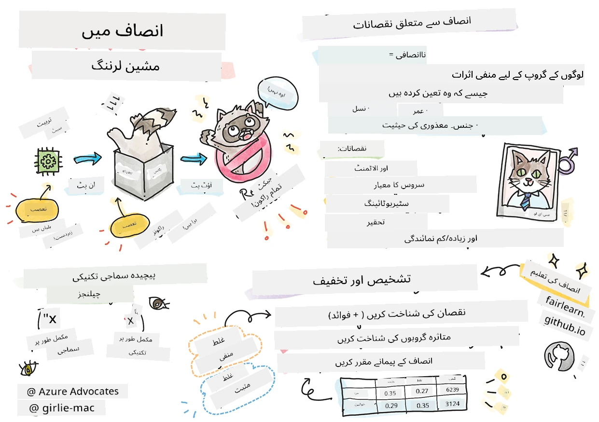
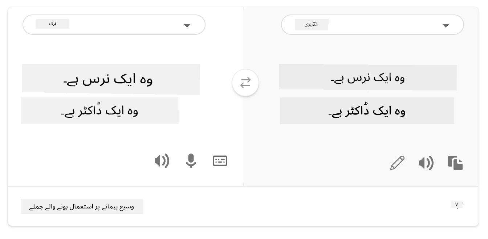

# ذمہ دار AI کے ساتھ مشین لرننگ حل تیار کرنا
 

> سکیچنوٹ از [Tomomi Imura](https://www.twitter.com/girlie_mac)

## [لیچرز سے پہلے کا کوئز](https://ff-quizzes.netlify.app/en/ml/)
 
## تعارف

اس نصاب میں، آپ یہ دریافت کرنا شروع کریں گے کہ کس طرح مشین لرننگ ہماری روزمرہ زندگی پر اثر انداز ہو رہی ہے اور ہو چکی ہے۔ یہاں تک کہ اب بھی، نظام اور ماڈلز روزمرہ کی فیصلہ سازی کے کاموں میں شامل ہیں، جیسے صحت کی تشخیص، قرض کی منظوری یا دھوکہ دہی کی شناخت۔ اس لیے یہ ضروری ہے کہ یہ ماڈل اچھے طریقے سے کام کریں تاکہ قابل اعتماد نتائج فراہم کریں۔ جیسے کسی بھی سافٹ ویئر اپلیکیشن کی طرح، AI سسٹمز توقعات پر پورا نہیں اترتے یا غیر مطلوبہ نتیجہ دے سکتے ہیں۔ اسی وجہ سے AI ماڈل کے رویے کو سمجھنا اور بیان کرنا ضروری ہے۔

تصور کریں کہ کیا ہو سکتا ہے جب آپ جو ڈیٹا استعمال کر رہے ہیں ان ماڈلز کو بنانے کے لیے ان میں کچھ مخصوص آبادیاتی تفصیلات، جیسے نسل، جنس، سیاسی نظریہ، مذہب، یا غیر متناسب طور پر ایسی آبادیاتی تفصیلات ہوں۔ جب ماڈل کے نتائج کو کسی مخصوص آبادی کو فائدہ پہنچانے کے لیے تشریح کیا جائے تو کیا ہوگا؟ اس کا درخواست پر کیا اثر ہوگا؟ مزید برآں، جب ماڈل کا نتیجہ منفی ہو اور لوگوں کے لیے نقصان دہ ہو تو کیا ہوگا؟ AI سسٹم کے رویے کی ذمہ داری کس پر ہے؟ یہ چند سوالات ہیں جن کا ہم اس نصاب میں جائزہ لیں گے۔

اس سبق میں، آپ:

- مشین لرننگ میں انصاف کی اہمیت اور انصاف سے متعلق نقصانات کے بارے میں اپنی آگاہی بڑھائیں گے۔
- انوکھے معاملات اور غیر معمولی حالات کو دریافت کرنے کی مشق سے واقف ہوں گے تاکہ بھروسے اور سلامتی کو یقینی بنایا جا سکے۔
- شامل نظام بنانے کی ضرورت کو سمجھیں گے تاکہ ہر فرد کو بااختیار بنایا جا سکے۔
- ڈیٹا اور لوگوں کی رازداری اور سیکورٹی کے تحفظ کی اہمیت کو دریافت کریں گے۔
- AI ماڈلز کے رویے کی وضاحت کے لیے شیشے کے ڈبے کے طریقہ کار کی اہمیت دیکھیں گے۔
- AI سسٹمز میں اعتماد قائم کرنے کے لیے احتساب کی اہمیت کا خیال رکھیں گے۔

## سابقہ علم

سابقہ علم کے طور پر، براہ کرم "ذمہ دار AI کے اصول" لرن پاتھ لیں اور نیچے دی گئی ویڈیو دیکھیں:

ذمہ دار AI کے بارے میں مزید جاننے کے لیے اس [لرننگ پاتھ](https://docs.microsoft.com/learn/modules/responsible-ai-principles/?WT.mc_id=academic-77952-leestott) کی پیروی کریں۔

> 🎥 ویڈیو کے لیے اوپر تصاویر پر کلک کریں: Microsoft کا ذمہ دار AI کیلئے طریقہ

## انصاف

AI سسٹمز کو سب کے ساتھ انصاف کرنا چاہیے اور ایک ہی طرح کے لوگوں کے گروہوں پر مختلف طریقے سے اثر انداز ہونے سے بچنا چاہیے۔ مثال کے طور پر، جب AI سسٹمز طبی علاج، قرض کی درخواستوں یا ملازمت پر رہنمائی فراہم کرتے ہیں تو انہیں ایک جیسے علامات، مالی حالات، یا پیشہ ورانہ قابلیت رکھنے والے ہر فرد کے لیے ایک جیسی سفارشات کرنی چاہئیں۔ ہم سب انسانوں کی حیثیت سے موروثی تعصبات رکھتے ہیں جو ہمارے فیصلوں اور اعمال کو متاثر کرتے ہیں۔ یہ تعصبات اس ڈیٹا میں نمایاں ہو سکتے ہیں جسے ہم AI سسٹمز کو تربیت دینے کے لیے استعمال کرتے ہیں۔ یہ تبدیلی بعض اوقات غیر جانبداری سے ہو سکتی ہے۔ شعوری طور پر یہ جاننا مشکل ہوتا ہے کہ آپ کب ڈیٹا میں تعصب شامل کر رہے ہیں۔

**"ناانصافی"** منفی اثرات یا "نقصانات" شامل ہیں، جو ایک گروپ کے لیے ہوتے ہیں، جیسے نسل، جنس، عمر، یا معذوری کی حیثیت کی بنیاد پر۔ اہم انصاف سے متعلق نقصانات کو درج ذیل طور پر درجہ بند کیا جا سکتا ہے:

- **تقسیم**، اگر جنس یا نسل کو دوسرے پر ترجیح دی جائے۔
- **سروس کا معیار**۔ اگر آپ مخصوص منظرنامے کے لیے ڈیٹا تربیت دیں لیکن حقیقت کہیں زیادہ پیچیدہ ہو تو اس کا نتیجہ ناقص کارکردگی والی سروس بنتا ہے۔ مثال کے طور پر، ایک ہاتھ دھونے والا صابن کا ڈسپنسر جو گہرے جلد والے لوگوں کو محسوس نہیں کر پاتا۔ [حوالہ](https://gizmodo.com/why-cant-this-soap-dispenser-identify-dark-skin-1797931773)
- **توہین آمیز رویہ**۔ کسی چیز یا کسی شخص پر ناجائز تنقید کرنا اور اسے غلط لیبل کرنا۔ مثال کے طور پر، ایک امیج لیبلنگ ٹیکنالوجی نے بدنامی سے گہرے جلد والے لوگوں کی تصاویر کو گوریل کے طور پر لیبل کیا تھا۔
- **زیادہ یا کم نمائندگی**۔ تصور یہ ہے کہ کسی مخصوص گروپ کو کسی مخصوص پیشے میں نہیں دیکھا جاتا، اور کوئی بھی سروس یا فنکشن جو اس کی ترویج کرتا ہے وہ نقصان میں حصہ ڈال رہا ہوتا ہے۔
- **سٹیریو ٹائپنگ**۔ کسی گروپ کو پہلے سے طے شدہ خصوصیات سے منسوب کرنا۔ مثال کے طور پر، انگریزی اور ترکی زبان کے ترجمے کے نظام میں جنس سے متعلق سٹیریو ٹائپیکل الفاظ کی وجہ سے غلطیاں ہو سکتی ہیں۔

> ترکی میں ترجمہ

> انگریزی میں واپس ترجمہ

AI سسٹمز کو منصفانہ بنایا جانا چاہیے اور انہیں جانبدار یا امتیازی فیصلے کرنے کے لیے پروگرام نہیں کیا جانا چاہیے، جو انسانوں کو بھی منع ہے۔ AI اور مشین لرننگ میں انصاف کو یقینی بنانا ایک پیچیدہ سماجی تکنیکی چیلنج ہے۔

### بھروسہ مندی اور سلامتی

اعتماد قائم کرنے کے لیے، AI سسٹمز کو معمول اور غیر متوقع حالات میں قابل اعتماد، محفوظ، اور مستقل ہونا چاہیے۔ یہ جاننا ضروری ہے کہ AI سسٹمز مختلف حالات میں، خاص طور پر غیر معمولی حالات میں، کس طرح ردعمل دیں گے۔ AI حل بنانے کے دوران، مختلف حالات کو سنبھالنے پر خاص توجہ دینی چاہیے جو AI حل کو پیش آ سکتے ہیں۔ مثال کے طور پر، خودکار ڈرائیونگ کار کو لوگوں کی سلامتی کو اعلی ترین ترجیح دینی چاہیے۔ اس کے نتیجے میں، AI کو تمام ممکنہ حالات کو مدنظر رکھنا ہوگا جیسے رات، طوفان، برف باری، بچے سڑک پار کر رہے ہوں، جانور، سڑک کی تعمیر وغیرہ۔ ایک AI سسٹم کی صلاحیت کہ وہ مختلف حالات کو قدرے قابل اعتماد اور محفوظ طریقے سے سنبھال سکے اس بات کی عکاسی کرتی ہے کہ ڈیٹا سائنسدان یا AI ڈیویلپر نے ڈیزائن یا جانچ کے دوران کتنی پیش بینی کی ہے۔

> [🎥 ویڈیو کے لیے یہاں کلک کریں: ](https://www.microsoft.com/videoplayer/embed/RE4vvIl)

### شمولیت

AI سسٹمز کو ایسا ڈیزائن کیا جانا چاہیے کہ وہ ہر شخص کو شامل کرے اور بااختیار بنائے۔ AI سسٹمز کے ڈیزائن اور نفاذ کے دوران، ڈیٹا سائنسدان اور AI ڈیویلپر ممکنہ رکاوٹوں کی نشاندہی اور حل کرتے ہیں جو افراد کو غیر ارادی طور پر خارج کر سکتی ہیں۔ مثال کے طور پر، دنیا بھر میں ایک بلین سے زائد معذور افراد ہیں۔ AI کی ترقی کے ساتھ، وہ اپنی روزانہ کی زندگی میں معلومات اور مواقع تک آسانی سے رسائی حاصل کر سکتے ہیں۔ رکاوٹوں کو دور کر کے، مواقع پیدا ہوتے ہیں تاکہ بہتر تجربات کے ساتھ AI مصنوعات تیار اور متعارف کرائی جا سکیں جو سب کے لیے فائدہ مند ہوں۔

> [🎥 ویڈیو کے لیے یہاں کلک کریں: AI میں شمولیت](https://www.microsoft.com/videoplayer/embed/RE4vl9v)

### سیکورٹی اور رازداری

AI سسٹمز کو محفوظ ہونا چاہیے اور لوگوں کی پرائیویسی کا احترام کرنا چاہیے۔ لوگ ایسے سسٹمز پر کم اعتماد کرتے ہیں جو ان کی رازداری، معلومات، یا زندگی کو خطرے میں ڈالیں۔ مشین لرننگ ماڈلز کو تربیت دیتے وقت، ہم بہترین نتائج کے لیے ڈیٹا پر انحصار کرتے ہیں۔ اس میں ڈیٹا کی اصل اور سالمیت کو مدنظر رکھنا ضروری ہے۔ مثال کے طور پر، کیا یہ ڈیٹا صارف نے جمع کروایا تھا یا یہ عوامی طور پر دستیاب تھا؟ اس کے بعد، ڈیٹا کے ساتھ کام کرتے ہوئے، AI سسٹمز کو ایسی طرح تیار کرنا ضروری ہے جو خفیہ معلومات کی حفاظت کر سکے اور حملوں کا مقابلہ کر سکے۔ جب AI زیادہ عام ہو رہا ہے، تو راز داری کا تحفظ اور اہم ذاتی و کاروباری معلومات کی سیکورٹی مزید اہم اور پیچیدہ ہو گئی ہے۔ پرائیویسی اور ڈیٹا کی سلامتی کے مسائل AI کے لیے خاص توجہ کے متقاضی ہیں کیونکہ AI سسٹمز کے لیے ڈیٹا تک رسائی درست اور باخبر پیش گوئیاں اور فیصلے کرنے کے لیے ضروری ہے۔

> [🎥 ویڈیو کے لیے یہاں کلک کریں: AI میں سیکورٹی](https://www.microsoft.com/videoplayer/embed/RE4voJF)

- صنعت کے طور پر، ہم نے رازداری اور سیکورٹی میں نمایاں ترقی کی ہے، جو خاص طور پر GDPR (جنرل ڈیٹا پروٹیکشن ریگولیشن) جیسے قواعد و ضوابط کی وجہ سے ہے۔
- پھر بھی، AI سسٹمز کے ساتھ ہمیں اس دباؤ کو تسلیم کرنا ہوگا کہ سسٹمز کو زیادہ ذاتی اور موثر بنانے کے لیے زیادہ ذاتی ڈیٹا کی ضرورت اور رازداری کے درمیان تناؤ ہے۔
- انٹرنیٹ کے ساتھ کمپیوٹرز کے جڑنے کے آغاز کی طرح، ہم AI سے متعلق سیکورٹی مسائل میں بھی بڑھوتری دیکھ رہے ہیں۔
- اس کے ساتھ ہی، ہم نے سیکورٹی کو بہتر بنانے کے لیے AI کے استعمال کو بھی دیکھا ہے۔ مثال کے طور پر، آج کل زیادہ تر جدید اینٹی وائرس اسکینرز AI ہیورسٹک پر چلتے ہیں۔
- ہمیں یقین دلانا ہوگا کہ ہمارے ڈیٹا سائنس کے عمل جدید رازداری اور سیکورٹی کے طریقوں کے ساتھ ہم آہنگ ہوں۔

### شفافیت  
AI سسٹمز کو سمجھنے کے قابل ہونا چاہیے۔ شفافیت کا ایک اہم حصہ AI سسٹمز اور ان کے اجزاء کے رویے کی وضاحت ہے۔ AI سسٹمز کی سمجھ کو بہتر بنانے کے لیے یہ ضروری ہے کہ تمام متعلقہ افراد کو معلوم ہو کہ وہ کس طرح اور کیوں کام کرتے ہیں تاکہ وہ ممکنہ کارکردگی کے مسائل، سلامتی اور پرائیویسی کے خدشات، تعصبات، اخراج کی پریکٹس، یا غیر ارادی نتائج کی نشاندہی کر سکیں۔ ہم یہ بھی مانتے ہیں کہ جو لوگ AI سسٹمز استعمال کرتے ہیں انہیں ایماندار اور کھلے دل سے بتانا چاہیے کہ کب، کیوں اور کیسے وہ انہیں استعمال کرتے ہیں اور ان سسٹمز کی حدود کیا ہیں۔ مثال کے طور پر، اگر کوئی بینک AI نظام کا استعمال اپنے صارف کے قرض کے فیصلوں کو سہارا دینے کے لیے کرتا ہے، تو نتائج کا جائزہ لینا اور سمجھنا ضروری ہے کہ کونسا ڈیٹا نظام کی سفارشات کو متاثر کرتا ہے۔ حکومتیں مختلف صنعتوں میں AI کو ریگولیٹ کرنے لگیں ہیں، لہٰذا ڈیٹا سائنسدانوں اور تنظیموں کو یہ وضاحت کرنا ہوگی کہ آیا AI نظام ریگولیٹری ضروریات پر پورا اترتا ہے، خاص طور پر جب کوئی غیر مطلوبہ نتیجہ نکلے۔

> [🎥 ویڈیو کے لیے یہاں کلک کریں: AI میں شفافیت](https://www.microsoft.com/videoplayer/embed/RE4voJF)

- چونکہ AI سسٹمز بہت پیچیدہ ہیں، ان کو سمجھنا اور نتائج کی تشریح کرنا مشکل ہوتا ہے۔
- اس کمی کی وجہ سے ان سسٹمز کا انتظام، آپریشن، اور دستاویزات متاثر ہوتی ہیں۔
- اور بھی اہم، اس کمی کی وجہ سے ان نتائج کی بنیاد پر کیے جانے والے فیصلے متاثر ہوتے ہیں جو یہ سسٹمز پیدا کرتے ہیں۔

### احتساب  
 
وہ لوگ جو AI سسٹمز ڈیزائن اور لگاتے ہیں انہیں اپنے سسٹمز کے کام کرنے کے طریقے کے لیے جوابدہ ہونا چاہیے۔ احتساب کی ضرورت حساس ٹیکنالوجیز جیسے چہرے کی پہچان کے ساتھ خاص طور پر اہم ہے۔ حال ہی میں، چہرے کی پہچان کی ٹیکنالوجی کی مانگ بڑھ رہی ہے، خاص طور پر قانون نافذ کرنے والے اداروں کی طرف سے جو اس ٹیکنالوجی کو لاپتہ بچوں کو تلاش کرنے جیسے استعمالات میں ممکنہ نظر آتی ہیں۔ تاہم، یہ ٹیکنالوجیز ممکنہ طور پر حکومت کی طرف سے اپنے شہریوں کی بنیادی آزادیوں کو خطرے میں ڈالنے کے لیے استعمال ہو سکتی ہیں، جیسے مخصوص افراد کی مسلسل نگرانی کو فعال کرنا۔ اس لیے ڈیٹا سائنسدانوں اور تنظیموں کو یہ ذمہ داری اٹھانی ہوگی کہ ان کا AI نظام افراد یا معاشرے پر کس طرح اثر انداز ہوتا ہے۔

> 🎥 ویڈیو کے لیے اوپر تصویر پر کلک کریں: چہرے کی پہچان کے ذریعے وسیع نگرانی کے انتبہات

آخرکار، ہماری نسل کے لیے سب سے بڑے سوالات میں سے ایک یہ ہے کہ چونکہ ہم پہلی نسل ہیں جو AI کو معاشرے میں لا رہی ہے، تو یہ کس طرح یقینی بنایا جائے کہ کمپیوٹر لوگو ں کے لیے جوابدہ رہیں گے اور جو لوگ کمپیوٹر ڈیزائن کرتے ہیں وہ باقی سب کے لیے جوابدہ رہیں۔

## اثرات کا جائزہ

مشین لرننگ ماڈل کی تربیت سے پہلے، ضروری ہے کہ ایک اثرات کا جائزہ لیا جائے تاکہ AI نظام کے مقصد کو سمجھا جا سکے؛ اس کا متوقع استعمال کیا ہے؛ یہ کہاں نافذ کیا جائے گا؛ اور کون اس نظام کے ساتھ تعامل کرے گا۔ یہ جائزہ کار(وں) یا ٹیسٹرز کو خود نظام کے جائزہ لینے میں مدد دیتا ہے تاکہ وہ ممکنہ خطرات اور متوقع نتائج کے عوامل کو مدنظر رکھ سکیں۔

اثرات کے جائزے کے دوران درج ذیل امور پر توجہ دی جاتی ہے:

* **افراد پر منفی اثر**۔ کسی بھی بندش یا ضروریات، غیر معاون استعمال یا کسی معلوم حدود سے آگاہ ہونا ضروری ہے تاکہ نظام کا استعمال ایسے طریقے سے نہ ہو جو افراد کو نقصان پہنچا سکے۔
* **ڈیٹا کی ضروریات**۔ یہ سمجھنا کہ نظام ڈیٹا کو کیسے اور کہاں استعمال کرے گا، جائزہ لینے والوں کو کسی بھی ڈیٹا کی ضروریات پر غور کرنے میں مدد دیتا ہے (مثلاً GDPR یا HIPAA ڈیٹا کے قوانین)۔ اس کے علاوہ، یہ دیکھنا کہ آیا ڈیٹا کا ماخذ یا مقدار تربیت کے لیے کافی ہے۔
* **اثرات کا خلاصہ**۔ نظام کے استعمال سے پیدا ہونے والے ممکنہ نقصانات کی فہرست جمع کریں۔ مشین لرننگ کے پورے لائف سائیکل کے دوران، طے شدہ مسائل کی جانچ کریں کہ آیا انہیں کم یا حل کیا گیا ہے۔
* **مطلوبہ اہداف** ہر چھ بنیادی اصولوں کے لیے۔ یہ اندازہ لگائیں کہ اصولوں سے وابستہ اہداف پورے ہوئے یا نہیں اور کہیں کہیں فرق تو نہیں۔

## ذمہ دار AI کے ساتھ ڈیبگنگ  

کسی سافٹ ویئر اپلیکیشن کی طرح ہی، AI سسٹم کی ڈیبگنگ نظام میں مسائل کی شناخت اور حل کرنے کا ضروری عمل ہے۔ ایسے کئی عوامل ہیں جو کسی ماڈل کی متوقع یا ذمہ دارانہ کارکردگی کو متاثر کر سکتے ہیں۔ روایتی ماڈل کارکردگی کے پیمانے ماڈل کی کارکردگی کے مقداری مجموعے ہوتے ہیں، جو ذمہ دار AI اصولوں کی خلاف ورزی کا تجزیہ کرنے کے لیے کافی نہیں ہوتے۔ مزید یہ کہ، مشین لرننگ ماڈل ایک بلیک باکس ہوتا ہے جو نتائج کے اسباب کو سمجھنا اور غلطی کی صورت میں وضاحت فراہم کرنا مشکل بناتا ہے۔ اس کورس میں آگے ہم ذمہ دار AI ڈیش بورڈ کو استعمال کرنا سیکھیں گے جو AI سسٹمز کی ڈیبگنگ میں مدد دیتا ہے۔ یہ ڈیش بورڈ ڈیٹا سائنسدانوں اور AI ڈیویلپرز کو ایک مکمل ٹول فراہم کرتا ہے تاکہ وہ:

* **خرابی کا تجزیہ**۔ ماڈل کی غلطی کی تقسیم کی شناخت کرنے کے لیے جو نظام کے انصاف یا بھروسے کو متاثر کر سکتی ہے۔
* **ماڈل کا جائزہ**۔ ماڈل کی کارکردگی میں ڈیٹا کے مختلف گروہوں میں فرق کی دریافت کے لیے۔
* **ڈیٹا کا تجزیہ**۔ ڈیٹا کی تقسیم کو سمجھنے اور ممکنہ تعصب کی نشاندہی کرنے کے لیے جو انصاف، شمولیت، اور بھروسے کے مسائل کو پیدا کر سکتا ہے۔
* **ماڈل کی تشریح**۔ سمجھنے کے لیے کہ ماڈل کی پیش گوئیوں پر کیا اثر انداز ہوتا ہے۔ یہ ماڈل کے رویے کی وضاحت میں مدد دیتا ہے، جو شفافیت اور احتساب کے لیے اہم ہے۔

## 🚀 چیلنج  
 
نقصانات کو پہلے ہی سے پیدا ہونے سے روکنے کے لیے، ہمیں چاہیے کہ:

- سسٹمز پر کام کرنے والے افراد میں مختلف پس منظر اور نقطہ نظر ہوں۔
- ایسے ڈیٹا سیٹس میں سرمایہ کاری کریں جو ہماری معاشرت کی تنوع کی عکاسی کریں۔
- مشین لرننگ کے پورے لائف سائیکل میں بہتر طریقے تیار کریں تاکہ ذمہ دار AI کی شناخت اور اصلاح ہو سکے۔

حقیقی زندگی کی مثالوں کے بارے میں سوچیں جہاں ایک ماڈل کی غیر قابل اعتماد صورتحال ماڈل کی تعمیر اور استعمال میں واضح ہو۔ اور ہم کیا باتیں غور میں لائیں؟

## [لیچر کے بعد کا کوئز](https://ff-quizzes.netlify.app/en/ml/)

## جائزہ اور خود مطالعہ  
 

اس سبق میں، آپ نے مشین لرننگ میں انصاف اور ناانصافی کے تصورات کی کچھ بنیادی باتیں سیکھی ہیں۔  
 
اس ورکشاپ کو دیکھیں تاکہ موضوعات میں مزید گہرائی میں جا سکیں: 

- ذمہ دار AI کی تلاش میں: اصولوں کو عملی جامہ پہنانا از بسمیرا نوشی، مهرنوش سامیکی اور امت شرما

> 🎥 ویڈیو کے لیے اوپر تصویر پر کلک کریں: RAI Toolbox: Besmira Nushi، Mehrnoosh Sameki، اور Amit Sharma کے ذریعہ ذمہ دار AI کی تعمیر کے لیے ایک اوپن سورس فریم ورک

مزید یہ بھی پڑھیں: 

- مائیکروسافٹ کا RAI وسیلہ مرکز: [Responsible AI Resources – Microsoft AI](https://www.microsoft.com/ai/responsible-ai-resources?activetab=pivot1%3aprimaryr4) 

- مائیکروسافٹ کا FATE تحقیقی گروپ: [FATE: Fairness, Accountability, Transparency, and Ethics in AI - Microsoft Research](https://www.microsoft.com/research/theme/fate/) 

RAI Toolbox: 

- [Responsible AI Toolbox GitHub repository](https://github.com/microsoft/responsible-ai-toolbox)

انصاف کو یقینی بنانے کے لیے Azure Machine Learning کے آلات کے بارے میں پڑھیں:

- [Azure Machine Learning](https://docs.microsoft.com/azure/machine-learning/concept-fairness-ml?WT.mc_id=academic-77952-leestott) 

## اسائنمنٹ

[RAI Toolbox کو دریافت کریں](assignment.md)

---

<!-- CO-OP TRANSLATOR DISCLAIMER START -->
**ڈس کلیمر**:
یہ دستاویز AI ترجمہ سروس [Co-op Translator](https://github.com/Azure/co-op-translator) کے ذریعے ترجمہ کی گئی ہے۔ جبکہ ہم درستگی کے لیے کوشاں ہیں، براہ کرم اس بات سے آگاہ رہیں کہ خودکار ترجمے میں غلطیاں یا عدم درستیاں ہو سکتی ہیں۔ اصل دستاویز اپنے مادری زبان میں مستند ماخذ سمجھی جائے گی۔ حساس معلومات کے لیے پیشہ ور انسانی ترجمہ کی سفارش کی جاتی ہے۔ اس ترجمے کے استعمال سے پیدا ہونے والی کسی بھی غلط فہمی یا غلط تشریح کی ذمہ داری ہم قبول نہیں کرتے۔
<!-- CO-OP TRANSLATOR DISCLAIMER END -->