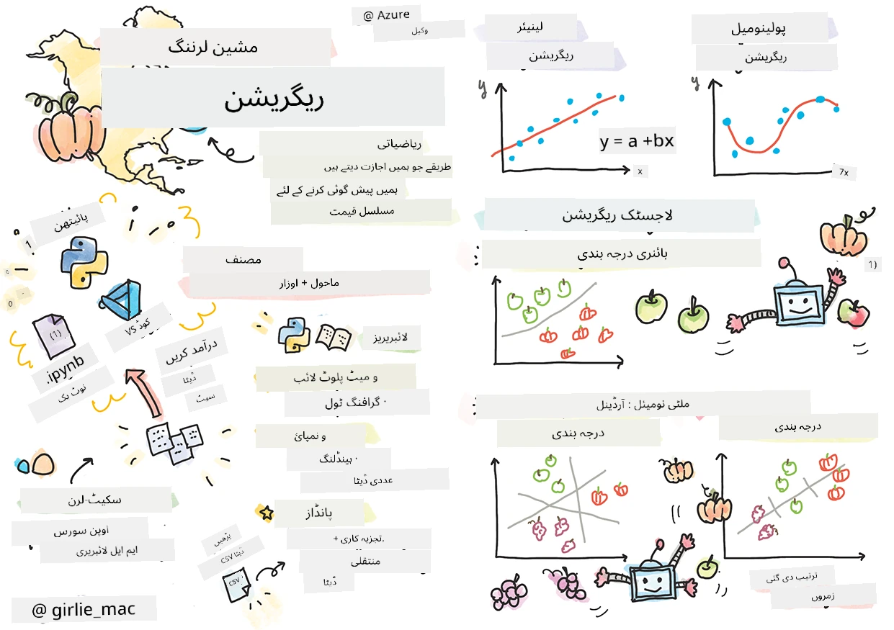
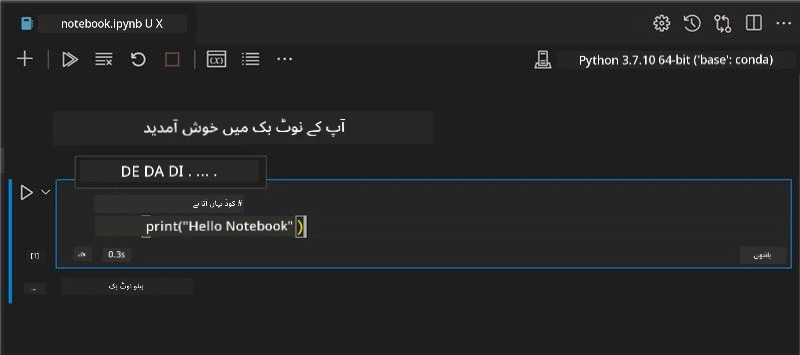
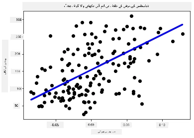

# Python اور Scikit-learn کے ساتھ ریگریشن ماڈلز کے لیے شروع کریں



> سکیتچنوٹ از [Tomomi Imura](https://www.twitter.com/girlie_mac)

## [پری لیکچر کوئز](https://ff-quizzes.netlify.app/en/ml/)

> ### [یہ سبق R میں دستیاب ہے!](../../../../2-Regression/1-Tools/solution/R/lesson_1.html)

## تعارف

ان چار اسباق میں، آپ ریگریشن ماڈلز بنانے کا طریقہ سیکھیں گے۔ ہم جلد ہی بات کریں گے کہ یہ کس کام آتے ہیں۔ لیکن کچھ بھی کرنے سے پہلے، یقینی بنائیں کہ آپ کے پاس اس عمل کو شروع کرنے کے لیے صحیح اوزار موجود ہیں!

اس سبق میں، آپ سیکھیں گے کہ:

- اپنے کمپیوٹر کو مقامی مشین لرننگ کے کاموں کے لیے ترتیب دیں۔
- Jupyter نوٹ بکس کے ساتھ کام کریں۔
- Scikit-learn استعمال کریں، بشمول تنصیب۔
- ایک عملی مشق کے ذریعے لینیئر ریگریشن کا جائزہ لیں۔

## تنصیبات اور ترتیبات

[](https://youtu.be/-DfeD2k2Kj0 "نئے آنے والوں کے لیے ML - اپنے اوزار تیار کریں تاکہ مشین لرننگ ماڈلز بنائیں")

> 🎥 اپنے کمپیوٹر کو ML کے لیے ترتیب دینے کے عمل سے گزرتے ہوئے ایک مختصر ویڈیو کے لیے اوپر والی تصویر پر کلک کریں۔

1. **Python انسٹال کریں**۔ اس بات کو یقینی بنائیں کہ آپ کے کمپیوٹر پر [Python](https://www.python.org/downloads/) انسٹال ہے۔ آپ بہت سے ڈیٹا سائنس اور مشین لرننگ کاموں کے لیے Python استعمال کریں گے۔ زیادہ تر کمپیوٹر سسٹمز میں پہلے سے Python انسٹال ہوتا ہے۔ کچھ صارفین کے لیے آسانی کے لیے مفید [Python Coding Packs](https://code.visualstudio.com/learn/educators/installers?WT.mc_id=academic-77952-leestott) بھی دستیاب ہیں۔

   تاہم Python کے بعض استعمالات کے لیے سافٹ ویئر کا ایک ورژن چاہیے ہوتا ہے، جبکہ دوسرے کے لیے مختلف ورژن۔ اسی وجہ سے، ایک [ورچوئل ماحول](https://docs.python.org/3/library/venv.html) کے اندر کام کرنا مفید ہوتا ہے۔

2. **Visual Studio Code انسٹال کریں**۔ یقینی بنائیں کہ آپ نے اپنے کمپیوٹر پر Visual Studio Code انسٹال کیا ہوا ہے۔ بنیادی تنصیب کے لیے ان ہدایات پر عمل کریں: [Visual Studio Code انسٹال کریں](https://code.visualstudio.com/)۔ آپ اس کورس میں Visual Studio Code میں Python استعمال کرنے جا رہے ہیں، لہٰذا آپ کو Python ترقی کے لیے [Visual Studio Code کو ترتیب دینا](https://docs.microsoft.com/learn/modules/python-install-vscode?WT.mc_id=academic-77952-leestott) آنا چاہیے۔

   > Python کے ساتھ آرام دہ ہونے کے لیے اس مجموعے کے [Learn modules](https://docs.microsoft.com/users/jenlooper-2911/collections/mp1pagggd5qrq7?WT.mc_id=academic-77952-leestott) سے گزر کر کام کریں۔
   >
   > [](https://youtu.be/yyQM70vi7V8 "Visual Studio Code کے ساتھ Python سیٹ اپ کریں")
   >
   > 🎥 اوپر تصویر پر کلک کریں ایک ویڈیو کے لیے: VS Code میں Python کا استعمال۔

3. **Scikit-learn انسٹال کریں**، ان [ہدایات](https://scikit-learn.org/stable/install.html) پر عمل کرتے ہوئے۔ چونکہ آپ کو یہ یقینی بنانا ہے کہ آپ Python 3 استعمال کر رہے ہیں، اس لیے ورچوئل ماحول استعمال کرنے کی سفارش کی جاتی ہے۔ اگر آپ M1 Mac پر یہ لائبریری انسٹال کر رہے ہیں، تو مخصوص ہدایات اوپر دی گئی صفحہ پر موجود ہیں۔

1. **Jupyter Notebook انسٹال کریں**۔ آپ کو [Jupyter پیکیج انسٹال کرنا](https://pypi.org/project/jupyter/) ہوگا۔

## آپ کا ML مصنف ماحول

آپ **نوٹ بکس** استعمال کریں گے اپنی Python کوڈنگ اور مشین لرننگ ماڈلز بنانے کے لیے۔ یہ قسم کا فائل ڈیٹا سائنسدانوں کے لیے ایک عام آلہ ہے، اور انہیں ان کے پسوند یا توسیع `.ipynb` سے پہچانا جا سکتا ہے۔

نوٹ بکس ایک تعاملی ماحول ہیں جو ڈویلپر کو نہ صرف کوڈ لکھنے بلکہ اس کے گرد نوٹس اور دستاویزات شامل کرنے کی اجازت دیتے ہیں، جو تحقیقی یا تجرباتی منصوبوں کے لیے مفید ہے۔

[](https://youtu.be/7E-jC8FLA2E "نئے آنے والوں کے لیے ML - ریگریشن ماڈلز بنانے کے لیے Jupyter نوٹ بکس تیار کریں")

> 🎥 اس مشق کو کرتے ہوئے ایک مختصر ویڈیو کے لیے اوپر تصویر پر کلک کریں۔

### مشق - ایک نوٹ بک کے ساتھ کام کریں

اس فولڈر میں، آپ کو فائل _notebook.ipynb_ ملے گی۔

1. Visual Studio Code میں _notebook.ipynb_ کھولیں۔

   Python 3+ کے ساتھ ایک Jupyter سرور شروع ہوگا۔ آپ نوٹ بک کے حصے دیکھیں گے جنہیں `run` کیا جا سکتا ہے، یعنی کوڈ کے ٹکڑے۔ آپ کوڈ بلاک کو اس کے پلے بٹن نما آئیکن کو منتخب کر کے چلا سکتے ہیں۔

1. `md` آئیکن منتخب کریں اور تھوڑا سا مارک ڈاؤن اور مندرجہ ذیل متن شامل کریں **# Welcome to your notebook**۔

   پھر، کچھ Python کوڈ شامل کریں۔

1. کوڈ بلاک میں ٹائپ کریں **print('hello notebook')**۔
1. کوڈ چلانے کے لیے تیر پر کلک کریں۔

   آپ کو یہ پرنٹ شدہ عبارت دکھنی چاہیے:

    ```output
    hello notebook
    ```



آپ اپنے کوڈ کے ساتھ تبصرے شامل کر کے نوٹ بک خود دستاویزی بنا سکتے ہیں۔

✅ ایک لمحہ سوچیں کہ ویب ڈویلپر کا کام کرنے کا ماحول ڈیٹا سائنسدان کے ماحول سے کتنا مختلف ہوتا ہے۔

## Scikit-learn کے ساتھ کام شروع کریں

اب جب Python آپ کے مقامی ماحول میں سیٹ اپ ہے، اور آپ Jupyter نوٹ بکس میں آرام دہ ہیں، تو آئیے Scikit-learn (جسے `sci` جیسا کہ `science` کہتے ہیں) کے ساتھ بھی اتنا ہی آرام دہ ہو جائیں۔ Scikit-learn ایک [وسیع API](https://scikit-learn.org/stable/modules/classes.html#api-ref) فراہم کرتا ہے جو آپ کو مشین لرننگ کے کام انجام دینے میں مدد دیتا ہے۔

ان کی [ویب سائٹ](https://scikit-learn.org/stable/getting_started.html) کے مطابق، "Scikit-learn ایک اوپن سورس مشین لرننگ لائبریری ہے جو سپروائزڈ اور انسپروائزڈ لرننگ کی حمایت کرتی ہے۔ یہ ماڈل فٹنگ، ڈیٹا پری پروسیسنگ، ماڈل سلیکشن اور ایوالویشن، اور بہت سے دیگر آلات بھی فراہم کرتی ہے۔"

اس کورس میں، آپ Scikit-learn اور دیگر اوزار استعمال کر کے مشین لرننگ ماڈلز بنائیں گے تاکہ جو کام ہم 'روایتی مشین لرننگ' کہتے ہیں انجام دے سکیں۔ ہم نے جان بوجھ کر نیورل نیٹ ورکس اور ڈیپ لرننگ سے گریز کیا ہے کیونکہ وہ ہمارے آنے والے 'AI for Beginners' نصاب میں بہتر طور پر شامل کیے جائیں گے۔

Scikit-learn ماڈلز بنانے اور ان کے استعمال کے لیے جائزہ لینے کو آسان بناتا ہے۔ یہ بنیادی طور پر عددی ڈیٹا استعمال کرتا ہے اور کئی تیار شدہ ڈیٹاسیٹس سیکھنے کے لیے فراہم کرتا ہے۔ اس میں طلباء کے لیے پر بنا ماڈلز بھی شامل ہیں جنہیں آزمایا جا سکتا ہے۔ آئیے پہلے پیک کیے ہوئے ڈیٹا کو لوڈ کرنے اور ایک بلٹ ان ایسٹی میٹر کے ساتھ Scikit-learn میں پہلا مشین لرننگ ماڈل بنانے کے عمل کو دریافت کریں۔

## مشق - آپ کی پہلی Scikit-learn نوٹ بک

> یہ ٹیوٹوریل Scikit-learn کی ویب سائٹ پر موجود [لینیئر ریگریشن کی مثال](https://scikit-learn.org/stable/auto_examples/linear_model/plot_ols.html#sphx-glr-auto-examples-linear-model-plot-ols-py) سے متاثر ہو کر بنایا گیا ہے۔


[](https://youtu.be/2xkXL5EUpS0 "نئے آنے والوں کے لیے ML - Python میں آپ کا پہلا لینیئر ریگریشن پروجیکٹ")

> 🎥 اس مشق کو کرتے ہوئے ایک مختصر ویڈیو کے لیے اوپر تصویر پر کلک کریں۔

_notebook.ipynb_ فائل جو اس سبق سے منسلک ہے، کی تمام سیلز کو 'ٹراش کین' آئیکن دباکر صاف کریں۔

اس سیکشن میں، آپ اس چھوٹے ڈیٹاسیٹ کے ساتھ کام کریں گے جو ڈایابیٹیز کے بارے میں ہے اور Scikit-learn میں سیکھنے کے لیے بنایا گیا ہے۔ تصور کریں کہ آپ ذیابیطس کے مریضوں کے علاج کی جانچ کرنا چاہتے ہیں۔ مشین لرننگ ماڈلز آپ کو مدد دے سکتے ہیں کہ کون سے مریض علاج کا بہتر جواب دیں گے، مختلف متغیرات کے امتزاج کی بنیاد پر۔ ایک بہت سادہ ریگریشن ماڈل بھی جب بصری شکل میں دکھایا جائے، تو ایسے متغیرات کی معلومات فراہم کر سکتا ہے جو آپ کے نظریاتی کلینیکل ٹرائلز کو بہتر منظم کرنے میں مددگار ہوں۔

✅ ریگریشن کے کئی طریقے ہیں، اور آپ کون سا منتخب کرتے ہیں یہ آپ کے مطلوبہ جواب پر منحصر ہے۔ اگر آپ کسی دیے گئے عمر کے شخص کی ممکنہ قد کی پیش گوئی کرنا چاہتے ہیں، تو آپ لینیئر ریگریشن استعمال کریں گے کیونکہ آپ ایک **عددی قدر** تلاش کر رہے ہیں۔ اگر آپ یہ جاننا چاہتے ہیں کہ کسی کھانے کی قسم ویگن کہلانی چاہیے یا نہیں، تو آپ ایک **زمرہ بندی** چاہتے ہیں، تو آپ لاجسٹک ریگریشن استعمال کریں گے۔ آپ لاجسٹک ریگریشن کے بارے میں بعد میں مزید سیکھیں گے۔ ڈیٹا سے پوچھے جانے والے کچھ سوالات کے بارے میں تھوڑا سوچیں، اور ان میں سے کون سا طریقہ زیادہ مناسب ہو گا۔

آئیے اس کام کو شروع کریں۔

### لائبریریاں درآمد کریں

اس کام کے لیے ہم کچھ لائبریریاں درآمد کریں گے:

- **matplotlib**۔ یہ ایک مفید [گراف بنانے والا آلہ](https://matplotlib.org/) ہے اور ہم اسے لائن پلاٹ بنانے کے لیے استعمال کریں گے۔
- **numpy**۔ [numpy](https://numpy.org/doc/stable/user/whatisnumpy.html) Python میں عددی ڈیٹا کے لیے ایک مفید لائبریری ہے۔
- **sklearn**۔ یہ [Scikit-learn](https://scikit-learn.org/stable/user_guide.html) لائبریری ہے۔

اپنے کام کے لیے کچھ لائبریریاں درآمد کریں۔

1. درج ذیل کوڈ ٹائپ کر کے امپورٹس شامل کریں:

   ```python
   import matplotlib.pyplot as plt
   import numpy as np
   from sklearn import datasets, linear_model, model_selection
   ```

   اوپر آپ `matplotlib`, `numpy` درآمد کر رہے ہیں اور `sklearn` سے `datasets`, `linear_model` اور `model_selection` درآمد کر رہے ہیں۔ `model_selection` ڈیٹا کو ٹریننگ اور ٹیسٹ سیٹ میں تقسیم کرنے کے لیے استعمال ہوتا ہے۔

### ذیابیطس کا ڈیٹاسیٹ

ان بلٹ [ذیابیطس ڈیٹاسیٹ](https://scikit-learn.org/stable/datasets/toy_dataset.html#diabetes-dataset) میں ذیابیطس کے بارے میں 442 نمونے شامل ہیں، جن میں 10 فیچر متغیرات ہیں، جن میں سے کچھ یہ ہیں:

- عمر: عمر سالوں میں
- bmi: جسمانی ماس انڈیکس
- bp: اوسط بلڈ پریشر
- s1 tc: ٹی سیلز (سفید خون کے خلیات کی ایک قسم)

✅ اس ڈیٹاسیٹ میں 'جنس' کا تصور بھی بطور فیچر متغیر شامل ہے جو ذیابیطس کی تحقیق کے لیے اہم ہے۔ بہت سے طبی ڈیٹاسیٹس میں اس قسم کی بائنری درجہ بندی شامل ہوتی ہے۔ تھوڑا سوچیں کہ اس طرح کی درجہ بندیاں کسی آبادی کے کچھ حصے کو علاج سے کیسے خارج کر سکتی ہیں۔

اب، X اور y ڈیٹا لوڈ کریں۔

> 🎓 یاد رکھیں، یہ سپروائزڈ لرننگ ہے، اور ہمیں ایک نامزد 'y' ہدف کی ضرورت ہے۔

ایک نئے کوڈ سیل میں، `load_diabetes()` کال کر کے ذیابیطس ڈیٹاسیٹ لوڈ کریں۔ ان پٹ `return_X_y=True` سے اشارہ ملتا ہے کہ `X` ایک ڈیٹا میٹرکس ہوگا، اور `y` ریگریشن کا ہدف ہوگا۔

1. ڈیٹا میٹرکس کی شکل اور اس کے پہلے عنصر کو دکھانے کے لیے کچھ پرنٹ کمانڈز شامل کریں:

    ```python
    X, y = datasets.load_diabetes(return_X_y=True)
    print(X.shape)
    print(X[0])
    ```

    جو جواب آپ کو مل رہا ہے وہ ایک ٹپل ہے۔ آپ ٹپل کی پہلی دو قدروں کو بالترتیب `X` اور `y` کو تفویض کر رہے ہیں۔ ٹپلز کے بارے میں مزید جانیں [یہاں](https://wikipedia.org/wiki/Tuple)۔

    آپ دیکھ سکتے ہیں کہ اس ڈیٹا میں 442 آئٹمز ہیں جو 10 عناصر کے ارے کی شکل میں ہیں:

    ```text
    (442, 10)
    [ 0.03807591  0.05068012  0.06169621  0.02187235 -0.0442235  -0.03482076
    -0.04340085 -0.00259226  0.01990842 -0.01764613]
    ```

    ✅ تھوڑا سوچیں کہ ڈیٹا اور ریگریشن ہدف کے درمیان کیا تعلق ہے۔ لینیئر ریگریشن خصوصیت X اور ہدف متغیر y کے درمیان تعلقات کی پیش گوئی کرتا ہے۔ کیا آپ دستاویزات میں ذیابیطس ڈیٹاسیٹ کے [ہدف](https://scikit-learn.org/stable/datasets/toy_dataset.html#diabetes-dataset) کو تلاش کر سکتے ہیں؟ یہ ڈیٹاسیٹ اس ہدف کے تناظر میں کیا مظاہرہ کر رہا ہے؟

2. اب، اس ڈیٹاسیٹ کے ایک حصے کو منتخب کریں تاکہ آپ اسے پلاٹ کر سکیں، اس کے لیے ڈیٹاسیٹ کا تیسرا کالم منتخب کریں۔ آپ `:` آپریٹر استعمال کر کے تمام قطاریں منتخب کر سکتے ہیں، اور پھر انڈیکس (2) سے تیسرا کالم منتخب کریں۔ آپ اسے 2D ارے میں بھی ری شیپ کر سکتے ہیں، جیسا کہ پلاٹنگ کے لیے درکار ہوتا ہے، `reshape(n_rows, n_columns)` کے ذریعے۔ اگر کسی پیرامیٹر کی قیمت -1 ہے، تو متعلقہ جہت خود بخود کیلکولیٹ ہو جاتی ہے۔

   ```python
   X = X[:, 2]
   X = X.reshape((-1,1))
   ```

   ✅ کسی بھی وقت، ڈیٹا کی شکل چیک کرنے کے لیے اسے پرنٹ کریں۔

3. اب جب کہ آپ کے پاس پلاٹ کرنے کے لیے ڈیٹا تیار ہے، دیکھیں کہ کیا کوئی مشین اس ڈیٹاسیٹ میں اعداد کے درمیان منطقی تقسیم کا تعین کرنے میں مدد کر سکتی ہے۔ ایسا کرنے کے لیے، آپ کو ڈیٹا (X) اور ہدف (y) دونوں کو ٹیسٹ اور ٹریننگ سیٹ میں تقسیم کرنا ہوگا۔ Scikit-learn اس کا ایک سادہ طریقہ فراہم کرتا ہے؛ آپ اپنے ٹیسٹ ڈیٹا کو ایک مخصوص نقطہ پر تقسیم کر سکتے ہیں۔

   ```python
   X_train, X_test, y_train, y_test = model_selection.train_test_split(X, y, test_size=0.33)
   ```

4. اب آپ اپنے ماڈل کو تربیت دینے کے لیے تیار ہیں! لینیئر ریگریشن ماڈل لوڈ کریں اور `model.fit()` استعمال کر کے اپنے X اور y کے ٹریننگ سیٹ پر اس کی تربیت کریں:

    ```python
    model = linear_model.LinearRegression()
    model.fit(X_train, y_train)
    ```

    ✅ `model.fit()` ایک فنکشن ہے جو آپ کئی ML لائبریریوں جیسے TensorFlow میں دیکھیں گے۔

5. پھر، ٹیسٹ ڈیٹا استعمال کر کے پیش گوئی کریں، `predict()` فنکشن استعمال کرتے ہوئے۔ یہ ماڈل کے ڈیٹا گروپس کے درمیان لائن کھینچنے کے لیے استعمال ہوگا۔

    ```python
    y_pred = model.predict(X_test)
    ```

6. اب وقت ہے کہ ڈیٹا کو پلاٹ میں دکھائیں۔ Matplotlib اس کام کے لیے بہت مفید آلہ ہے۔ تمام X اور y کے ٹیسٹ ڈیٹا کا اسکٹرپلاٹ بنائیں، اور پیش گوئی کا استعمال کر کے ماڈل کے ڈیٹا گروپس کے درمیان سب سے مناسب جگہ لائن کھینچیں۔

    ```python
    plt.scatter(X_test, y_test,  color='black')
    plt.plot(X_test, y_pred, color='blue', linewidth=3)
    plt.xlabel('Scaled BMIs')
    plt.ylabel('Disease Progression')
    plt.title('A Graph Plot Showing Diabetes Progression Against BMI')
    plt.show()
    ```

   


   ✅ یہاں جو کچھ ہو رہا ہے اس کے بارے میں تھوڑی سوچیں۔ ایک سیدھی لائن بہت سے چھوٹے ڈیٹا پوائنٹس کے ایک راستے سے گزر رہی ہے، لیکن یہ بالکل کیا کر رہی ہے؟ کیا آپ دیکھ سکتے ہیں کہ آپ کو اس لائن کو کیسے استعمال کرنا چاہیے تاکہ پیش گوئی کی جا سکے کہ ایک نیا، نا دیکھا ہوا ڈیٹا پوائنٹ پلاٹ کی y محور کے لحاظ سے کہاں فٹ ہوگا؟ اس ماڈل کے عملی استعمال کو الفاظ میں بیان کرنے کی کوشش کریں۔

مبارک ہو، آپ نے اپنا پہلا لینیئر ریگریشن ماڈل تیار کیا، اس کے ساتھ پیش گوئی کی، اور اسے ایک پلاٹ میں دکھایا!

---
## 🚀چیلنج

اس ڈیٹا سیٹ سے کوئی مختلف متغیر پلاٹ کریں۔ اشارہ: اس لائن کو ترمیم کریں: `X = X[:,2]`۔ اس ڈیٹا سیٹ کے ہدف کے پیش نظر، آپ ذیابیطس کو ایک بیماری کے طور پر کس طرح ترقی پذیر دیکھ سکتے ہیں؟
## [لیکچر کے بعد کوئز](https://ff-quizzes.netlify.app/en/ml/)

## جائزہ اور خود مطالعہ

اس ٹیوٹوریل میں، آپ نے سادہ لینیئر ریگریشن کے ساتھ کام کیا، نہ کہ یونی وریٹ یا ملٹی پل لینیئر ریگریشن کے ساتھ۔ ان طریقوں کے درمیان فرق کے بارے میں تھوڑا پڑھیں، یا [اس ویڈیو](https://www.coursera.org/lecture/quantifying-relationships-regression-models/linear-vs-nonlinear-categorical-variables-ai2Ef) کو دیکھیں۔

ریگریشن کے تصور کے بارے میں مزید پڑھیں اور سوچیں کہ اس تکنیک سے کس قسم کے سوالات کے جوابات دیے جا سکتے ہیں۔ اپنی سمجھ کو گہرا کرنے کے لیے [یہ ٹیوٹوریل](https://docs.microsoft.com/learn/modules/train-evaluate-regression-models?WT.mc_id=academic-77952-leestott) کریں۔

## اسائنمنٹ

[ایک مختلف ڈیٹا سیٹ](assignment.md)

---

<!-- CO-OP TRANSLATOR DISCLAIMER START -->
**ڈس کلیمر**:
یہ دستاویز AI ترجمہ سروس [Co-op Translator](https://github.com/Azure/co-op-translator) کے ذریعے ترجمہ کی گئی ہے۔ جبکہ ہم درستگی کے لیے کوشاں ہیں، براہ کرم اس بات سے آگاہ رہیں کہ خودکار ترجمے میں غلطیاں یا عدم درستیاں ہو سکتی ہیں۔ اصل دستاویز اپنے مادری زبان میں مستند ماخذ سمجھی جائے گی۔ حساس معلومات کے لیے پیشہ ور انسانی ترجمہ کی سفارش کی جاتی ہے۔ اس ترجمے کے استعمال سے پیدا ہونے والی کسی بھی غلط فہمی یا غلط تشریح کی ذمہ داری ہم قبول نہیں کرتے۔
<!-- CO-OP TRANSLATOR DISCLAIMER END -->