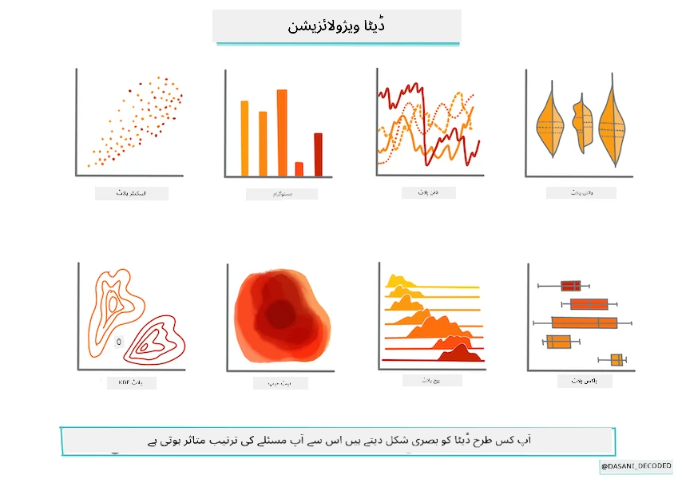
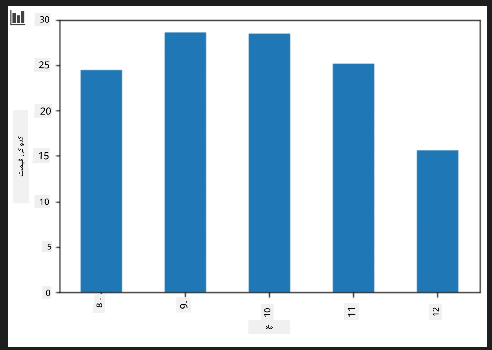
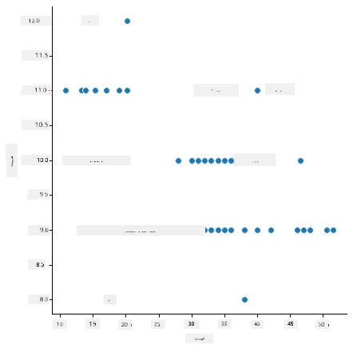
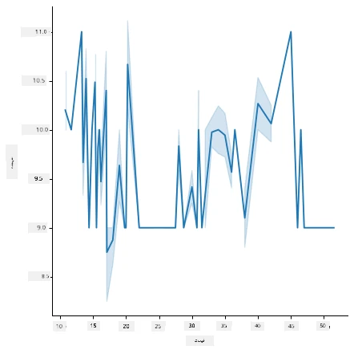
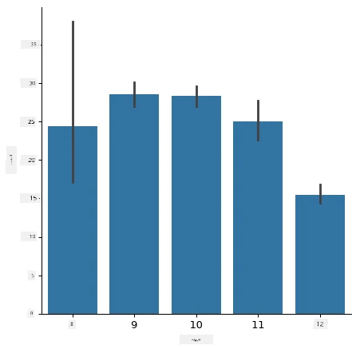
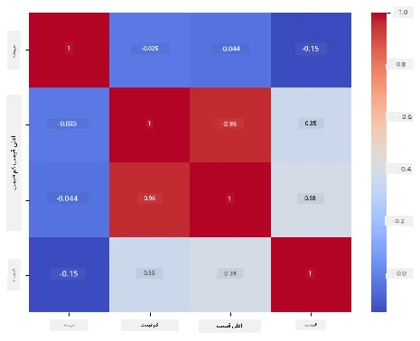

# Scikit-learn استعمال کرتے ہوئے ریگریشن ماڈل بنائیں: ڈیٹا کی تیاری اور بصری نمائندگی



انفوگرافک از [Dasani Madipalli](https://twitter.com/dasani_decoded)

## [پری لیکچر کوئز](https://ff-quizzes.netlify.app/en/ml/)

> ### [یہ سبق R میں دستیاب ہے!](../../../../2-Regression/2-Data/solution/R/lesson_2.html)

## تعارف

اب جب کہ آپ کے پاس Scikit-learn کے ساتھ مشین لرننگ ماڈل بنانے کے لیے درکار آلات موجود ہیں، آپ اپنے ڈیٹا سے سوالات کرنا شروع کرنے کے لیے تیار ہیں۔ جب آپ ڈیٹا کے ساتھ کام کرتے ہیں اور مشین لرننگ کے حل لاگو کرتے ہیں، تو یہ سمجھنا بہت ضروری ہے کہ صحیح سوال کیسے پوچھا جائے تاکہ آپ کے ڈیٹا سیٹ کی صلاحیتوں کو مناسب طریقے سے کھولا جا سکے۔

اس سبق میں، آپ سیکھیں گے:

- اپنے ماڈل بنانے کے لیے ڈیٹا کیسے تیار کریں۔
- ڈیٹا کی بصری نمائندگی کے لیے Matplotlib کا استعمال کیسے کریں۔
- زیادہ موثر ڈیٹا بصری نمائندگی کے لیے Seaborn کا استعمال کیسے کریں۔

## اپنے ڈیٹا سے صحیح سوال پوچھنا

جس سوال کا جواب آپ چاہتے ہیں وہ اس بات کا تعین کرے گا کہ آپ کون سے مشین لرننگ الگورتھمز استعمال کریں گے۔ اور جو جواب آپ کو ملے گا اس کی کیفیت آپ کے ڈیٹا کی نوعیت پر بہت زیادہ منحصر ہوگی۔

اس سبق کے لیے فراہم کردہ [ڈیٹا](https://github.com/microsoft/ML-For-Beginners/blob/main/2-Regression/data/US-pumpkins.csv) کو دیکھیں۔ آپ اس .csv فائل کو VS Code میں کھول سکتے ہیں۔ ایک فوری نظر سے ظاہر ہوتا ہے کہ خانے خالی ہیں اور ڈیٹا میں سٹرنگز اور عددی ڈیٹا دونوں موجود ہیں۔ ایک عجیب کالم 'Package' بھی ہے جہاں ڈیٹا 'sacks'، 'bins' اور دیگر اقدار کا مرکب ہے۔ حقیقت میں، یہ ڈیٹا کچھ حد تک بے ترتیبی ہے۔

[](https://youtu.be/5qGjczWTrDQ "بیگنرز کے لیے ML - ڈیٹا سیٹ کا تجزیہ اور صفائی کیسے کریں")

> 🎥 اس سبق کے لیے ڈیٹا کی تیاری کے طریقہ کار پر مختصر ویڈیو دیکھنے کے لیے اوپر دی گئی تصویر پر کلک کریں۔

حقیقت میں، یہ بہت عام نہیں کہ آپ کو ایسا ڈیٹا سیٹ ملے جو بالکل استعمال کے لیے تیار ہو اور اسے فوراً مشین لرننگ ماڈل بنانے کے لیے استعمال کیا جا سکے۔ اس سبق میں، آپ سیکھیں گے کہ کس طرح عام Python لائبریریوں کا استعمال کرتے ہوئے خام ڈیٹا سیٹ کو تیار کیا جائے۔ آپ مختلف تکنیکیں بھی سیکھیں گے جو ڈیٹا کی بصری نمائندگی کے لیے استعمال ہوتی ہیں۔

## کیس اسٹڈی: 'کدو کا بازار'

اس فولڈر میں آپ کو روٹ `data` فولڈر کے اندر [US-pumpkins.csv](https://github.com/microsoft/ML-For-Beginners/blob/main/2-Regression/data/US-pumpkins.csv) نامی ایک .csv فائل ملے گی جس میں کدو کے بازار کے بارے میں 1757 لائنیں ہیں، جو شہر کے لحاظ سے گروپ کی گئی ہیں۔ یہ خام ڈیٹا ہے جو امریکہ کی زرعی وزارت کے [اسپیشلٹی کروپس ٹرمینل مارکیٹس اسٹینڈرڈ رپورٹس](https://www.marketnews.usda.gov/mnp/fv-report-config-step1?type=termPrice) سے نکالا گیا ہے۔

### ڈیٹا کی تیاری

یہ ڈیٹا عوامی دسترس میں ہے۔ اسے USDA کی ویب سائٹ سے ہر شہر کے لیے الگ الگ فائلوں میں ڈاؤن لوڈ کیا جا سکتا ہے۔ بہت سی الگ فائلز سے بچنے کے لیے ہم نے تمام شہر کے ڈیٹا کو ایک اسپریڈشیٹ میں جوڑ دیا ہے، لہذا ہم نے کچھ حد تک ڈیٹا کو پہلے ہی _تیار_ کر لیا ہے۔ آئیں اب ڈیٹا کو قریب سے دیکھتے ہیں۔

### کدو کے ڈیٹا پر ابتدائی نتائج

آپ نے اس ڈیٹا میں کیا دیکھا؟ آپ نے پہلے ہی دیکھا تھا کہ یہاں سٹرنگز، نمبرز، خالی خانے اور عجیب و غریب اقدار کا مرکب ہے جنہیں آپ کو سمجھنا ہے۔

آپ اس ڈیٹا سے ریگریشن تکنیک استعمال کرتے ہوئے کیا سوال پوچھ سکتے ہیں؟ مثلا "کسی دیے گئے مہینے میں فروخت کے لیے کدو کی قیمت کی پیش گوئی۔" دوبارہ ڈیٹا کو دیکھتے ہوئے، آپ کو کام کے لیے مطلوبہ ڈیٹا سٹرکچر بنانے کے لیے کچھ تبدیلیاں کرنی ہوں گی۔
## مشق - کدو کے ڈیٹا کا تجزیہ کریں

چلیے [Pandas](https://pandas.pydata.org/) استعمال کرتے ہیں، (یہ نام `Python Data Analysis` کے لیے مختصر ہے) جو ڈیٹا کی تشکیل کے لیے بہت مفید آلہ ہے، تاکہ اس کدو کے ڈیٹا کا تجزیہ کریں اور اسے تیار کریں۔

### پہلے، گمشدہ تاریخوں کی جانچ کریں

آپ کو سب سے پہلے گمشدہ تاریخوں کی جانچ کرنے کے اقدامات کرنے ہوں گے:

1. تاریخوں کو مہینے کے فارمیٹ میں تبدیل کریں (یہ امریکی تاریخیں ہیں، لہٰذا فارمیٹ `MM/DD/YYYY` ہے)۔
2. مہینہ ایک نئے کالم میں نکالیں۔

Visual Studio Code میں _notebook.ipynb_ فائل کھولیں اور اسپریڈشیٹ کو Pandas کے نئے dataframe میں درآمد کریں۔

1. `head()` فنکشن کا استعمال کرتے ہوئے پہلے پانچ قطاریں دیکھیں۔

    ```python
    import pandas as pd
    pumpkins = pd.read_csv('../data/US-pumpkins.csv')
    pumpkins.head()
    ```

    ✅ آخری پانچ قطاریں دیکھنے کے لیے کونسا فنکشن استعمال کریں گے؟

1. چیک کریں کہ موجودہ dataframe میں کوئی گمشدہ ڈیٹا ہے یا نہیں:

    ```python
    pumpkins.isnull().sum()
    ```

    کچھ ڈیٹا غائب ہے، لیکن شاید یہ کام کے لیے مسئلہ نہ بنے۔

1. اپنے dataframe کو آسان بنانے کے لیے، صرف وہ کالم منتخب کریں جن کی آپ کو ضرورت ہے، `loc` فنکشن استعمال کریں جو اصل dataframe سے مخصوص قطاریں (پہلا پیرا میٹر) اور کالمز (دوسرا پیرا میٹر) نکالتا ہے۔ نیچے والے اظہار `:` کا مطلب ہے "تمام قطاریں"۔

    ```python
    columns_to_select = ['Package', 'Low Price', 'High Price', 'Date']
    pumpkins = pumpkins.loc[:, columns_to_select]
    ```

### دوسرا، کدو کی اوسط قیمت معلوم کریں

سوچیں کہ کسی مہینے میں کدو کی اوسط قیمت کیسے معلوم کی جائے۔ اس کام کے لیے کون سے کالم منتخب کریں گے؟ اشارہ: آپ کو 3 کالم چاہئیں۔

حل: `Low Price` اور `High Price` کالمز کی اوسط لے کر نئے `Price` کالم کو بھریں، اور `Date` کالم کو مہینے تک محدود کریں۔ خوش قسمتی سے، اوپر چیک کے مطابق تاریخوں یا قیمتوں کے لیے کوئی گمشدہ ڈیٹا نہیں ہے۔

1. اوسط نکالنے کے لیے، درج ذیل کوڈ شامل کریں:

    ```python
    price = (pumpkins['Low Price'] + pumpkins['High Price']) / 2

    month = pd.DatetimeIndex(pumpkins['Date']).month

    ```

   ✅ آپ چاہیں تو `print(month)` سے کسی بھی ڈیٹا کی پڑتال کر سکتے ہیں۔

2. اب اپنے تبدیل شدہ ڈیٹا کو ایک نئے Pandas dataframe میں کاپی کریں:

    ```python
    new_pumpkins = pd.DataFrame({'Month': month, 'Package': pumpkins['Package'], 'Low Price': pumpkins['Low Price'],'High Price': pumpkins['High Price'], 'Price': price})
    ```

    اپنے dataframe کو پرنٹ کرنے سے آپ ایک صاف اور منظم ڈیٹا سیٹ دیکھیں گے جس پر آپ اپنا نیا ریگریشن ماڈل بنا سکتے ہیں۔

### لیکن رُکیں! یہاں کچھ عجیب ہے

اگر آپ `Package` کالم دیکھیں تو کدو مختلف اقسام میں فروخت ہوتے ہیں۔ کچھ '1 1/9 بسہل' میں، کچھ '1/2 بسہل' میں، کچھ ہر کدو کے حساب سے، کچھ ہر پاؤنڈ کے حساب سے، اور کچھ مختلف چوڑائی والے بڑے ڈبے میں فروخت ہوتے ہیں۔

> کدو کو مسلسل وزن کرنا بہت مشکل لگتا ہے

اصل ڈیٹا میں دیکھیں تو، کوئی بھی جس کی `Unit of Sale` 'EACH' یا 'PER BIN' ہے، اس کا `Package` قسم انچ کے مطابق، بن کے حساب سے یا 'each' ہے۔ کدو کو مسلسل وزن کرنا بہت دشوار ہے، اس لیے ہم صرف ان کدوں کو فلٹر کریں گے جن کے `Package` کالم میں 'bushel' کے الفاظ شامل ہوں۔

1. فائل کے اوپر، ابتدائی .csv درآمد کے نیچے فلٹر شامل کریں:

    ```python
    pumpkins = pumpkins[pumpkins['Package'].str.contains('bushel', case=True, regex=True)]
    ```

    اگر اب آپ ڈیٹا پرنٹ کریں، تو آپ صرف تقریباً 415 قطاریں دیکھیں گے جو بسہل کے حساب سے کدوں کی ہیں۔

### لیکن رُکیں! ایک اور کام باقی ہے

کیا آپ نے محسوس کیا کہ ہر قطار میں بسہل کی مقدار مختلف ہے؟ آپ کو قیمتوں کو معیاری بنانے کی ضرورت ہے تاکہ قیمت فی بسہل ظاہر ہو، اس لیے کچھ ریاضی کریں۔

1. نئے `new_pumpkins` dataframe بنانے والے بلاک کے بعد یہ سطریں شامل کریں:

    ```python
    new_pumpkins.loc[new_pumpkins['Package'].str.contains('1 1/9'), 'Price'] = price/(1 + 1/9)

    new_pumpkins.loc[new_pumpkins['Package'].str.contains('1/2'), 'Price'] = price/(1/2)
    ```

✅ [The Spruce Eats](https://www.thespruceeats.com/how-much-is-a-bushel-1389308) کے مطابق، بسہل کا وزن فصل کی قسم پر منحصر ہے کیونکہ یہ حجم کی پیمائش ہے۔ "مثال کے طور پر ٹماٹر کا ایک بسہل 56 پاؤنڈ وزنی ہوتا ہے... پتے اور سبزیاں کم وزن کے ساتھ زیادہ جگہ لیتی ہیں، اس لیے پالک کا بسہل صرف 20 پاؤنڈ ہوتا ہے۔" یہ سب کافی پیچیدہ ہے! آئیے بسہل کو پاؤنڈ میں تبدیل کرنے کی فکر نہ کریں اور بسہل کی بنیاد پر قیمت لگائیں۔ کدوں کے بسہل کے اس مطالعے سے یہ ظاہر ہوتا ہے کہ اپنے ڈیٹا کی نوعیت کو سمجھنا کتنا ضروری ہے!

اب آپ بسہل کی پیمائش کی بنیاد پر قیمتوں کا تجزیہ کر سکتے ہیں۔ اگر آپ دوبارہ ڈیٹا پرنٹ کریں تو دیکھیں گے کہ یہ معیاری ہو چکا ہے۔

✅ کیا آپ نے محسوس کیا کہ آدھے بسہل کے حساب سے فروخت ہونے والے کدو بہت مہنگے ہیں؟ کیا آپ وجہ معلوم کر سکتے ہیں؟ اشارہ: چھوٹے کدو بڑے کدو کی نسبت بہت زیادہ مہنگے ہوتے ہیں، شاید اس لیے کہ ایک بسہل میں ان کی تعداد زیادہ ہوتی ہے، جبکہ بڑے گول کدو کے خالی حصے کی جگہ استعمال نہیں ہوتی۔

## بصری نمائندگی کی حکمت عملیاں

ڈیٹا سائنسدان کا ایک حصہ ہوتا ہے کہ وہ کام کے ڈیٹا کی نوعیت اور معیار کو ظاہر کرے۔ اس کے لیے وہ اکثر دلچسپ بصری نمائندگیاں یا پلاٹس، گرافز، اور چارٹس بناتے ہیں جو مختلف پہلوؤں کو دکھاتے ہیں۔ اس طرح وہ بصری طور پر ایسے تعلقات اور خلا دکھا پاتے ہیں جو بصورت دیگر چھپے ہوتے ہیں۔

[](https://youtu.be/SbUkxH6IJo0 "بیگنرز کے لیے ML - Matplotlib کے ساتھ ڈیٹا کی بصری نمائندگی")

> 🎥 اس سبق کے لیے ڈیٹا کی بصری نمائندگی پر مختصر ویڈیو دیکھنے کے لیے اوپر دی گئی تصویر پر کلک کریں۔

بصری نمائندگیاں اس بات کا تعین کرنے میں بھی مدد کرتی ہیں کہ ڈیٹا کے لیے سب سے مناسب مشین لرننگ تکنیک کونسی ہے۔ مثلاً اگر اسکیٹر پلاٹ ایک لائن کی پیروی کرتا نظر آئے، تو یہ ظاہر کرتا ہے کہ ڈیٹا لائنیر ریگریشن کے لیے ایک اچھا امیدوار ہے۔

Jupyter نوٹ بکس میں استعمال ہونے والی ایک ڈیٹا بصری نمائندگی کی لائبریری [Matplotlib](https://matplotlib.org/) ہے (جسے آپ نے پچھلے سبق میں بھی دیکھا تھا)۔

> ان [ٹیوٹوریلز](https://docs.microsoft.com/learn/modules/explore-analyze-data-with-python?WT.mc_id=academic-77952-leestott) میں ڈیٹا کی بصری نمائندگی کا مزید تجربہ حاصل کریں۔

## مشق - Matplotlib کے ساتھ تجربہ کریں

کوشش کریں کہ بنائے گئے نئے dataframe کو ظاہر کرنے کے لیے کچھ بنیادی پلاٹس بنائیں۔ ایک بنیادی لائن پلاٹ کیا دکھائے گا؟

1. فائل کے اوپر، Pandas درآمد کے نیچے Matplotlib درآمد کریں:

    ```python
    import matplotlib.pyplot as plt
    ```

1. پورا نوٹ بک دوبارہ چلائیں تاکہ تازہ کاری ہو جائے۔
1. نوٹ بک کے آخر میں ایک سیل شامل کریں جو ڈیٹا کو باکس کے طور پر پلاٹ کرے:

    ```python
    price = new_pumpkins.Price
    month = new_pumpkins.Month
    plt.scatter(price, month)
    plt.show()
    ```

    

    کیا یہ مفید پلاٹ ہے؟ کیا اس میں کوئی خاص بات آپ کو حیران کرتی ہے؟

    یہ خاص طور پر مفید نہیں ہے کیونکہ یہ صرف آپ کے ڈیٹا کو مہینے میں پھیلے ہوئے نقاط کے طور پر دکھاتا ہے۔

### اسے مفید بنائیں

مفید ڈیٹا دکھانے کے لیے، عام طور پر آپ کو ڈیٹا کو گروپ کرنا ہوتا ہے۔ آئیے ایک ایسا پلاٹ بناتے ہیں جہاں y محور مہینے دکھائے اور ڈیٹا تقسیم کو ظاہر کرے۔

1. ایک سیل شامل کریں جو گروپڈ بار چارٹ بنائے:

    ```python
    new_pumpkins.groupby(['Month'])['Price'].mean().plot(kind='bar')
    plt.ylabel("Pumpkin Price")
    ```

    

    یہ زیادہ مفید ڈیٹا بصری نمائندگی ہے! ایسا لگتا ہے کہ کدو کی سب سے زیادہ قیمت ستمبر اور اکتوبر میں ہوتی ہے۔ کیا یہ آپ کی توقع کے مطابق ہے؟ کیوں یا کیوں نہیں؟

## مشق - Seaborn کے ساتھ تجربہ کریں

Matplotlib طاقتور ہے، لیکن ایک نرم اور مکمل چارٹ بنانے کے لیے اس میں اکثر زیادہ کوڈ لگتا ہے۔ [Seaborn](https://seaborn.pydata.org/) ایسی لائبریری ہے جو Matplotlib کے اوپر بنی ہے اور یہ شماریاتی ڈیٹا کی بصری نمائندگی کے لیے بنائی گئی ہے۔ یہ براہ راست Pandas dataframe کے ساتھ کام کرتی ہے، دلکش ڈیفالٹ اسٹائلز اپلائی کرتی ہے، اور کم کوڈ کے ذریعے معلوماتی پلاٹس بناتی ہے۔ چونکہ Seaborn Matplotlib آبجیکٹس واپس دیتا ہے، آپ پھر بھی Matplotlib کے تمام امکانات کو استعمال کر سکتے ہیں۔

> اگر آپ کے پاس Seaborn انسٹال نہیں ہے، تو اسے `pip install seaborn` سے انسٹال کریں۔

1. دوسری درآمدات کے نیچے، نوٹ بک کے اوپر Seaborn درآمد کریں۔ اسے عام طور پر `sns` کے نام سے درآمد کیا جاتا ہے:

    ```python
    import seaborn as sns
    ```

### تعلقات دکھانے کے لیے اسکیٹر پلاٹس

ماڈل بنانے سے پہلے ڈیٹا کو جانچنے کا ایک بڑا حصہ یہ تلاش کرنا ہے کہ متغیرات کے درمیان کیا _تعلقات_ ہیں۔ [اسکیٹر پلاٹ](https://en.wikipedia.org/wiki/Scatter_plot) اس کا بہترین آلہ ہے: اگر نقاط ایک لائن کی پیروی کرتے ہیں تو دونوں متغیرات میں تعلق ہو سکتا ہے، جو کہ ایک اچھا اشارہ ہے کہ لائنیر ریگریشن ماڈل کام کر سکتا ہے۔

1. پہلے بنائے گئے مہینے کے حساب سے قیمت کے اسکیٹر پلاٹ کو دوبارہ بنائیں، لیکن اس بار Seaborn کے [`relplot()`](https://seaborn.pydata.org/generated/seaborn.relplot.html) (رشتہ دار پلاٹ) کا استعمال کریں، جو براہ راست آپ کے dataframe کے کالموں کے ساتھ کام کرتا ہے:

    ```python
    sns.relplot(x="Price", y="Month", data=new_pumpkins)
    ```

    

    دیکھیں کہ آپ _کالم کے نام_ اور dataframe کو کیسے پاس کرتے ہیں، اور Seaborn آپ کے لیے محور کی لیبلز خود سنبھال لیتا ہے۔

2. آپ لائن پلاٹ پر بھی جا سکتے ہیں `kind="line"` پاس کر کے۔ Seaborn ایک سایہ دار بینڈ بھی بناتا ہے جو لائن کے ارد گرد اعتماد کا وقفہ دکھاتا ہے:

    ```python
    sns.relplot(x="Price", y="Month", kind="line", data=new_pumpkins)
    ```

    

    یہ مخصوص ڈیٹا کافی شور والا ہے، اس لیے لائن پلاٹ سب سے واضح انتخاب نہیں ہے — لیکن یہ دکھاتا ہے کہ Seaborn میں چارٹ کی اقسام کو کتنی آسانی سے تبدیل کیا جا سکتا ہے۔

### تقسیمات دکھانے والے بار چارٹس


آپ نے پہلے ہاتھ سے ڈیٹا کو گروپ کر کے Matplotlib کے ساتھ ایک بار چارٹ بنایا تھا۔ Seaborn کا [`catplot()`](https://seaborn.pydata.org/generated/seaborn.catplot.html) (کٹیگوریکل پلاٹ) آپ کے لیے گروپنگ اور جمع کی جانب سے کام کر سکتا ہے۔ ڈیفالٹ کے طور پر `kind="bar"` ہر زمرے کی اوسط دکھاتا ہے اور ایک سیاہ لائن اعتماد کے وقفے کی نشاندہی کرتی ہے۔

1۔ ہر مہینے کی اوسط قیمت کا بار چارٹ بنائیں:

    ```python
    sns.catplot(x="Month", y="Price", data=new_pumpkins, kind="bar")
    ```

    

    یہ اس بات کی تصدیق کرتا ہے جو آپ نے Matplotlib کے ساتھ دیکھا تھا — قیمتیں ستمبر اور اکتوبر کے آس پاس چوٹی پر ہوتی ہیں — لیکن Seaborn یہ بھی ظاہر کرتا ہے کہ ہر مہینے کے اندر قیمت کتنی _متغیر_ ہوتی ہے۔

### تعلقات دکھانے کے لیے ہیٹ میپس

اسکیٹر پلاٹس ایک وقت میں دو متغیرات کا موازنہ کرتے ہیں۔ جب آپ کے پاس کئی عددی کالم ہوں، تو ایک [heatmap](https://en.wikipedia.org/wiki/Heat_map) آپ کو ہر جوڑے کے کالمز کے درمیان تعلق کی طاقت کو ایک ساتھ دیکھنے کی اجازت دیتا ہے۔ یہ عام طریقہ ہے یہ دیکھنے کا کہ کن خصوصیات کا زیادہ تعلق ہے ماڈل میں فیڈ کرنے سے پہلے (اور اسی طرح کا چارٹ بعد میں کلاسفیکیشن میں کنفیوزن میٹرکس دکھانے کے لیے استعمال ہوتا ہے)۔

1۔ Pandas کے ساتھ ایک تعلقاتی میٹرکس بنائیں، پھر اسے Seaborn کے [`heatmap()`](https://seaborn.pydata.org/generated/seaborn.heatmap.html) سے کھینچیں۔ `annot=True` آپشن ہر سیل پر تعلقاتی اقدار کو پرنٹ کرتا ہے:

    ```python
    correlations = new_pumpkins[['Month', 'Low Price', 'High Price', 'Price']].corr()
    sns.heatmap(correlations, annot=True, cmap="coolwarm")
    ```

    

    `1` (یا `-1`) کے قریب اقدار ظاہر کرتی ہیں کہ کالمز مضبوطی سے _خطی طور پر_ مربوط ہیں۔ دیکھیے `Low Price` اور `High Price` تقریباً مکمل طور پر مربوط ہیں۔ دوسری طرف، `Month` قیمت کے ساتھ ایک کمزور خطی تعلق ظاہر کرتا ہے — حالانکہ اوپر کے بار چارٹ نے ستمبر اور اکتوبر میں واضح موسمی چوٹی کو دکھایا تھا۔ یہ ایک اہم سبق ہے: تعلقاتی کوایفیشینٹ صرف _براہ راست-خط_ تعلقات کو ناپتا ہے، لہٰذا یہ موسمی یا غیر خطی پیٹرنز کو نظر انداز کر سکتا ہے۔ ✅ یہ دیکھنا کیوں مفید ہے کہ ساتھ ہی ہیٹ میپ *اور* بار چارٹ جیسے چارٹس کو دیکھیں اس سے پہلے کہ یہ فیصلہ کریں کہ کون سے کالم استعمال کرنے ہیں؟

### Matplotlib یا Seaborn؟

دونوں لائبریریاں جاننا فائدہ مند ہیں:

- **Matplotlib** آپ کو چارٹ کے ہر عنصر پر باریک کنٹرول دیتا ہے اور تقریباً ہر دوسرے Python پلاٹنگ لائبریری کی بنیاد ہے۔
- **Seaborn** شماریاتی چارٹس کے لیے اعلی سطحی فنکشنز اور دلکش ڈیفالٹس فراہم کرتا ہے، ڈیٹافریمز کے ساتھ براہ راست کام کرتا ہے، اور عموماً تیز ہوتا ہے استقصائی ڈیٹا تجزیے کے لیے۔

ایک عام ورک فلو یہ ہے کہ تیزی سے اپنے ڈیٹا کو جانچنے کے لیے Seaborn اٹھائیں، پھر جب تفصیلات کو تخصیص کرنا ہو تو Matplotlib کا استعمال کریں۔

---

## 🚀 چیلنج

Matplotlib اور Seaborn جو مختلف قسم کی بصریات پیش کرتے ہیں ان کو دریافت کریں۔ کون سی اقسام ریگریشن کے مسائل کے لیے سب سے زیادہ مناسب ہیں؟

## [لیکچر کے بعد کا کوئز](https://ff-quizzes.netlify.app/en/ml/)

## جائزہ اور خود مطالعہ

ڈیٹا کو دیکھنے کے بے شمار طریقے دیکھیں۔ مختلف دستیاب لائبریریوں کی فہرست بنائیں اور نوٹ کریں کہ کون سی دی گئی اقسام کے کاموں کے لیے سب سے بہتر ہیں، مثلاً 2D بصریات بمقابلہ 3D بصریات۔ آپ کیا دریافت کرتے ہیں؟

## اسائنمنٹ

[بصریات کی دریافت](assignment.md)

---

<!-- CO-OP TRANSLATOR DISCLAIMER START -->
**ڈس کلیمر**:
یہ دستاویز AI ترجمہ سروس [Co-op Translator](https://github.com/Azure/co-op-translator) کے ذریعے ترجمہ کی گئی ہے۔ جبکہ ہم درستگی کے لیے کوشاں ہیں، براہ کرم اس بات سے آگاہ رہیں کہ خودکار ترجمے میں غلطیاں یا عدم درستیاں ہو سکتی ہیں۔ اصل دستاویز اپنے مادری زبان میں مستند ماخذ سمجھی جائے گی۔ حساس معلومات کے لیے پیشہ ور انسانی ترجمہ کی سفارش کی جاتی ہے۔ اس ترجمے کے استعمال سے پیدا ہونے والی کسی بھی غلط فہمی یا غلط تشریح کی ذمہ داری ہم قبول نہیں کرتے۔
<!-- CO-OP TRANSLATOR DISCLAIMER END -->