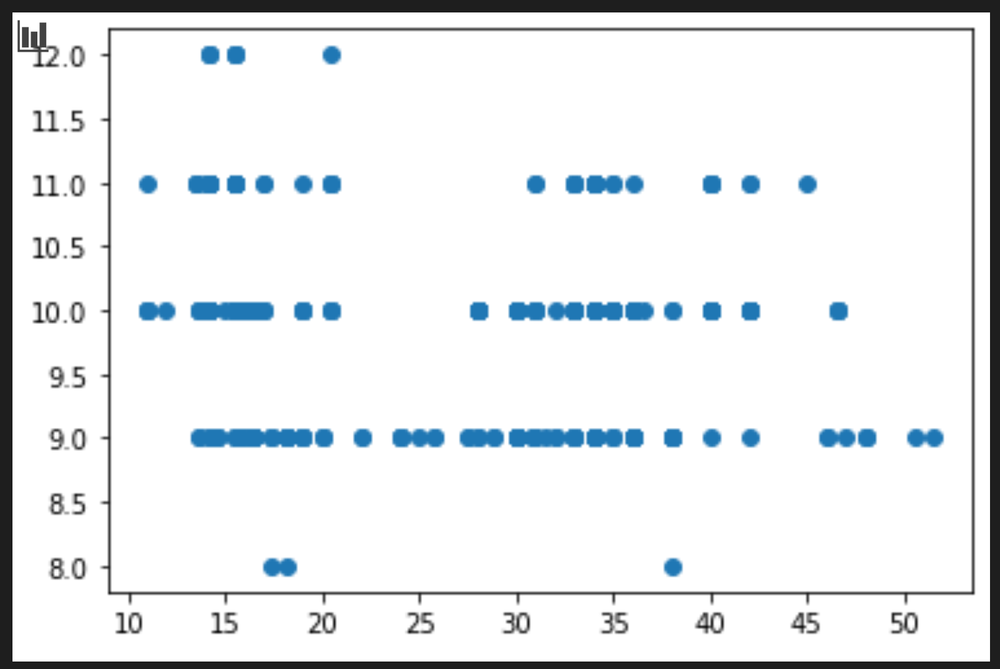

<!--
CO_OP_TRANSLATOR_METADATA:
{
  "original_hash": "a683e1fe430bb0d4a10b68f6ca15e0a6",
  "translation_date": "2025-08-29T13:06:07+00:00",
  "source_file": "2-Regression/2-Data/README.md",
  "language_code": "ur"
}
-->
# سکائٹ لرن کا استعمال کرتے ہوئے ریگریشن ماڈل بنائیں: ڈیٹا تیار کریں اور بصری بنائیں


انفوگرافک از [دسانی مڈیپالی](https://twitter.com/dasani_decoded)

## [لیکچر سے پہلے کا کوئز](https://gray-sand-07a10f403.1.azurestaticapps.net/quiz/11/)

> ### [یہ سبق R میں بھی دستیاب ہے!](../../../../2-Regression/2-Data/solution/R/lesson_2.html)

## تعارف

اب جب کہ آپ کے پاس وہ تمام ٹولز موجود ہیں جو سکائٹ لرن کے ساتھ مشین لرننگ ماڈل بنانے کے لیے ضروری ہیں، آپ اپنے ڈیٹا سے سوالات پوچھنے کے لیے تیار ہیں۔ جب آپ ڈیٹا کے ساتھ کام کرتے ہیں اور ایم ایل حل لاگو کرتے ہیں، تو یہ سمجھنا بہت ضروری ہے کہ صحیح سوال کیسے پوچھا جائے تاکہ آپ اپنے ڈیٹا سیٹ کی صلاحیتوں کو بہتر طریقے سے استعمال کر سکیں۔

اس سبق میں، آپ سیکھیں گے:

- ماڈل بنانے کے لیے اپنے ڈیٹا کو کیسے تیار کریں۔
- ڈیٹا ویژولائزیشن کے لیے Matplotlib کا استعمال کیسے کریں۔

## اپنے ڈیٹا سے صحیح سوال پوچھنا

آپ کے سوال کا جواب یہ طے کرے گا کہ آپ کس قسم کے ایم ایل الگورتھم استعمال کریں گے۔ اور جو جواب آپ کو ملے گا اس کا معیار آپ کے ڈیٹا کی نوعیت پر بہت زیادہ منحصر ہوگا۔

اس سبق کے لیے فراہم کردہ [ڈیٹا](https://github.com/microsoft/ML-For-Beginners/blob/main/2-Regression/data/US-pumpkins.csv) پر ایک نظر ڈالیں۔ آپ اس .csv فائل کو VS Code میں کھول سکتے ہیں۔ ایک سرسری نظر ڈالنے سے فوراً پتہ چلتا ہے کہ اس میں خالی جگہیں ہیں اور اس میں سٹرنگز اور عددی ڈیٹا کا امتزاج ہے۔ ایک عجیب کالم بھی ہے جسے 'Package' کہا جاتا ہے، جہاں ڈیٹا 'sacks'، 'bins' اور دیگر اقدار کے درمیان ملا ہوا ہے۔ حقیقت میں، یہ ڈیٹا تھوڑا سا گڑبڑ ہے۔

[](https://youtu.be/5qGjczWTrDQ "مشین لرننگ کے ابتدائی افراد کے لیے - ڈیٹا سیٹ کا تجزیہ اور صفائی کیسے کریں")

> 🎥 اوپر دی گئی تصویر پر کلک کریں تاکہ اس سبق کے لیے ڈیٹا تیار کرنے پر ایک مختصر ویڈیو دیکھ سکیں۔

حقیقت میں، یہ بہت عام نہیں ہے کہ آپ کو ایک ایسا ڈیٹا سیٹ ملے جو مکمل طور پر ایم ایل ماڈل بنانے کے لیے تیار ہو۔ اس سبق میں، آپ سیکھیں گے کہ معیاری Python لائبریریوں کا استعمال کرتے ہوئے ایک خام ڈیٹا سیٹ کو کیسے تیار کیا جائے۔ آپ ڈیٹا کو بصری بنانے کی مختلف تکنیکیں بھی سیکھیں گے۔

## کیس اسٹڈی: 'کدو کی مارکیٹ'

اس فولڈر میں آپ کو روٹ `data` فولڈر میں ایک .csv فائل ملے گی جس کا نام [US-pumpkins.csv](https://github.com/microsoft/ML-For-Beginners/blob/main/2-Regression/data/US-pumpkins.csv) ہے، جس میں کدو کی مارکیٹ کے بارے میں 1757 لائنز کا ڈیٹا شامل ہے، جو شہروں کے لحاظ سے گروپ کیا گیا ہے۔ یہ خام ڈیٹا [Specialty Crops Terminal Markets Standard Reports](https://www.marketnews.usda.gov/mnp/fv-report-config-step1?type=termPrice) سے نکالا گیا ہے، جو کہ امریکی محکمہ زراعت کے ذریعہ تقسیم کیا گیا ہے۔

### ڈیٹا تیار کرنا

یہ ڈیٹا عوامی ڈومین میں ہے۔ اسے USDA ویب سائٹ سے مختلف شہروں کے لیے الگ الگ فائلوں میں ڈاؤن لوڈ کیا جا سکتا ہے۔ بہت زیادہ الگ الگ فائلوں سے بچنے کے لیے، ہم نے تمام شہروں کے ڈیٹا کو ایک اسپریڈشیٹ میں یکجا کر دیا ہے، اس طرح ہم نے پہلے ہی ڈیٹا کو تھوڑا سا _تیار_ کر لیا ہے۔ اب، آئیے ڈیٹا کو قریب سے دیکھتے ہیں۔

### کدو کا ڈیٹا - ابتدائی نتائج

آپ اس ڈیٹا کے بارے میں کیا نوٹ کرتے ہیں؟ آپ نے پہلے ہی دیکھا کہ اس میں سٹرنگز، نمبرز، خالی جگہیں اور عجیب و غریب اقدار کا امتزاج ہے جنہیں آپ کو سمجھنا ہوگا۔

آپ اس ڈیٹا سے ریگریشن تکنیک کا استعمال کرتے ہوئے کون سا سوال پوچھ سکتے ہیں؟ کیا "کسی دیے گئے مہینے کے دوران فروخت کے لیے کدو کی قیمت کی پیش گوئی کریں" مناسب سوال ہو سکتا ہے؟ ڈیٹا کو دوبارہ دیکھتے ہوئے، آپ کو ڈیٹا اسٹرکچر بنانے کے لیے کچھ تبدیلیاں کرنی ہوں گی جو اس کام کے لیے ضروری ہے۔

## مشق - کدو کے ڈیٹا کا تجزیہ کریں

آئیے [Pandas](https://pandas.pydata.org/) کا استعمال کریں، (جس کا مطلب ہے `Python Data Analysis`) جو ڈیٹا کو شکل دینے کے لیے ایک بہت مفید ٹول ہے، تاکہ اس کدو کے ڈیٹا کا تجزیہ اور تیاری کی جا سکے۔

### سب سے پہلے، غائب تاریخوں کی جانچ کریں

آپ کو سب سے پہلے غائب تاریخوں کی جانچ کے لیے اقدامات کرنے ہوں گے:

1. تاریخوں کو مہینے کی شکل میں تبدیل کریں (یہ امریکی تاریخیں ہیں، لہذا فارمیٹ `MM/DD/YYYY` ہے)۔
2. مہینے کو ایک نئے کالم میں نکالیں۔

_`notebook.ipynb`_ فائل کو Visual Studio Code میں کھولیں اور اسپریڈشیٹ کو ایک نئے Pandas ڈیٹا فریم میں درآمد کریں۔

1. پہلے پانچ قطاروں کو دیکھنے کے لیے `head()` فنکشن کا استعمال کریں۔

    ```python
    import pandas as pd
    pumpkins = pd.read_csv('../data/US-pumpkins.csv')
    pumpkins.head()
    ```

    ✅ آخری پانچ قطاروں کو دیکھنے کے لیے آپ کون سا فنکشن استعمال کریں گے؟

1. موجودہ ڈیٹا فریم میں غائب ڈیٹا کی جانچ کریں:

    ```python
    pumpkins.isnull().sum()
    ```

    غائب ڈیٹا موجود ہے، لیکن شاید یہ موجودہ کام کے لیے اہم نہ ہو۔

1. اپنے ڈیٹا فریم کو کام کرنے کے لیے آسان بنانے کے لیے، صرف ان کالمز کو منتخب کریں جن کی آپ کو ضرورت ہے، `loc` فنکشن کا استعمال کرتے ہوئے جو اصل ڈیٹا فریم سے قطاروں (پہلا پیرامیٹر) اور کالمز (دوسرا پیرامیٹر) کا ایک گروپ نکالتا ہے۔ نیچے دیے گئے کیس میں `:` کا مطلب ہے "تمام قطاریں"۔

    ```python
    columns_to_select = ['Package', 'Low Price', 'High Price', 'Date']
    pumpkins = pumpkins.loc[:, columns_to_select]
    ```

### دوسرا، کدو کی اوسط قیمت کا تعین کریں

سوچیں کہ کسی دیے گئے مہینے میں کدو کی اوسط قیمت کا تعین کیسے کریں۔ اس کام کے لیے آپ کون سے کالمز منتخب کریں گے؟ اشارہ: آپ کو 3 کالمز کی ضرورت ہوگی۔

حل: `Low Price` اور `High Price` کالمز کی اوسط لے کر نئے Price کالم کو پُر کریں، اور Date کالم کو صرف مہینہ دکھانے کے لیے تبدیل کریں۔ خوش قسمتی سے، اوپر کی جانچ کے مطابق، تاریخوں یا قیمتوں کے لیے کوئی غائب ڈیٹا نہیں ہے۔

1. اوسط کا حساب لگانے کے لیے، درج ذیل کوڈ شامل کریں:

    ```python
    price = (pumpkins['Low Price'] + pumpkins['High Price']) / 2

    month = pd.DatetimeIndex(pumpkins['Date']).month

    ```

   ✅ کسی بھی ڈیٹا کو چیک کرنے کے لیے `print(month)` کا استعمال کرتے ہوئے پرنٹ کریں۔

2. اب، اپنے تبدیل شدہ ڈیٹا کو ایک نئے Pandas ڈیٹا فریم میں کاپی کریں:

    ```python
    new_pumpkins = pd.DataFrame({'Month': month, 'Package': pumpkins['Package'], 'Low Price': pumpkins['Low Price'],'High Price': pumpkins['High Price'], 'Price': price})
    ```

    اپنے ڈیٹا فریم کو پرنٹ کرنے سے آپ کو ایک صاف، منظم ڈیٹا سیٹ دکھائی دے گا جس پر آپ اپنا نیا ریگریشن ماڈل بنا سکتے ہیں۔

### لیکن رکیے! یہاں کچھ عجیب ہے

اگر آپ `Package` کالم کو دیکھیں، تو کدو مختلف کنفیگریشنز میں فروخت ہوتے ہیں۔ کچھ '1 1/9 bushel' پیمائش میں فروخت ہوتے ہیں، کچھ '1/2 bushel' پیمائش میں، کچھ فی کدو، کچھ فی پاؤنڈ، اور کچھ بڑے بکسوں میں مختلف چوڑائیوں کے ساتھ۔

> کدو کو مستقل طور پر وزن کرنا بہت مشکل لگتا ہے

اصل ڈیٹا میں کھودتے ہوئے، یہ دلچسپ ہے کہ جس بھی `Unit of Sale` کی قیمت 'EACH' یا 'PER BIN' ہے، ان کے `Package` کی قسم فی انچ، فی بن، یا 'each' بھی ہے۔ کدو کو مستقل طور پر وزن کرنا بہت مشکل لگتا ہے، لہذا آئیے ان کو فلٹر کریں اور صرف ان کدو کو منتخب کریں جن کے `Package` کالم میں 'bushel' کا سٹرنگ موجود ہو۔

1. فائل کے شروع میں، ابتدائی .csv درآمد کے نیچے ایک فلٹر شامل کریں:

    ```python
    pumpkins = pumpkins[pumpkins['Package'].str.contains('bushel', case=True, regex=True)]
    ```

    اگر آپ اب ڈیٹا پرنٹ کریں، تو آپ دیکھ سکتے ہیں کہ آپ کو صرف وہ 415 یا اس کے آس پاس کی قطاریں مل رہی ہیں جن میں کدو بسشل کے ذریعے ہیں۔

### لیکن رکیے! ایک اور کام کرنا باقی ہے

کیا آپ نے نوٹ کیا کہ بسشل کی مقدار ہر قطار میں مختلف ہے؟ آپ کو قیمتوں کو معیاری بنانا ہوگا تاکہ آپ بسشل کے حساب سے قیمت دکھا سکیں، لہذا کچھ حساب کتاب کریں تاکہ اسے معیاری بنایا جا سکے۔

1. ان لائنز کو نئے_pumpkins ڈیٹا فریم بنانے والے بلاک کے بعد شامل کریں:

    ```python
    new_pumpkins.loc[new_pumpkins['Package'].str.contains('1 1/9'), 'Price'] = price/(1 + 1/9)

    new_pumpkins.loc[new_pumpkins['Package'].str.contains('1/2'), 'Price'] = price/(1/2)
    ```

✅ [The Spruce Eats](https://www.thespruceeats.com/how-much-is-a-bushel-1389308) کے مطابق، بسشل کا وزن پیداوار کی قسم پر منحصر ہوتا ہے، کیونکہ یہ ایک حجم کی پیمائش ہے۔ "مثال کے طور پر، ٹماٹروں کا ایک بسشل 56 پاؤنڈ وزن کا ہونا چاہیے... پتے اور سبزیاں زیادہ جگہ لیتی ہیں اور کم وزن رکھتی ہیں، لہذا پالک کا ایک بسشل صرف 20 پاؤنڈ ہے۔" یہ سب کافی پیچیدہ ہے! آئیے بسشل سے پاؤنڈ میں تبدیلی کرنے کی زحمت نہ کریں، اور اس کے بجائے بسشل کے حساب سے قیمت لگائیں۔ تاہم، کدو کے بسشلز کا یہ مطالعہ ظاہر کرتا ہے کہ آپ کے ڈیٹا کی نوعیت کو سمجھنا کتنا اہم ہے!

اب، آپ بسشل کی پیمائش کے مطابق قیمتوں کا تجزیہ کر سکتے ہیں۔ اگر آپ ایک بار پھر ڈیٹا پرنٹ کریں، تو آپ دیکھ سکتے ہیں کہ یہ معیاری ہو گیا ہے۔

✅ کیا آپ نے نوٹ کیا کہ آدھے بسشل کے حساب سے فروخت ہونے والے کدو بہت مہنگے ہیں؟ کیا آپ اس کی وجہ معلوم کر سکتے ہیں؟ اشارہ: چھوٹے کدو بڑے کدو کے مقابلے میں زیادہ مہنگے ہوتے ہیں، شاید اس لیے کہ بسشل میں ان کی تعداد زیادہ ہوتی ہے، کیونکہ ایک بڑے کھوکھلے پائی کدو کی وجہ سے جگہ ضائع ہو جاتی ہے۔

## ویژولائزیشن کی حکمت عملی

ڈیٹا سائنسدان کا ایک کردار یہ ہے کہ وہ اس ڈیٹا کے معیار اور نوعیت کو ظاہر کرے جس پر وہ کام کر رہے ہیں۔ ایسا کرنے کے لیے، وہ اکثر دلچسپ ویژولائزیشنز، یا پلاٹس، گرافز، اور چارٹس بناتے ہیں، جو ڈیٹا کے مختلف پہلوؤں کو ظاہر کرتے ہیں۔ اس طرح، وہ بصری طور پر ان تعلقات اور خلا کو ظاہر کر سکتے ہیں جو بصورت دیگر دریافت کرنا مشکل ہیں۔

[](https://youtu.be/SbUkxH6IJo0 "مشین لرننگ کے ابتدائی افراد کے لیے - Matplotlib کے ساتھ ڈیٹا کو بصری بنانا")

> 🎥 اوپر دی گئی تصویر پر کلک کریں تاکہ اس سبق کے لیے ڈیٹا کو بصری بنانے پر ایک مختصر ویڈیو دیکھ سکیں۔

ویژولائزیشنز یہ بھی طے کرنے میں مدد کر سکتی ہیں کہ ڈیٹا کے لیے کون سی مشین لرننگ تکنیک سب سے زیادہ مناسب ہے۔ مثال کے طور پر، ایک اسکیٹر پلاٹ جو ایک لائن کی پیروی کرتا ہوا نظر آتا ہے، اس بات کی نشاندہی کرتا ہے کہ ڈیٹا ایک لکیری ریگریشن مشق کے لیے ایک اچھا امیدوار ہے۔

ایک ڈیٹا ویژولائزیشن لائبریری جو Jupyter نوٹ بکس میں اچھی طرح کام کرتی ہے وہ ہے [Matplotlib](https://matplotlib.org/) (جسے آپ نے پچھلے سبق میں بھی دیکھا تھا)۔

> ڈیٹا ویژولائزیشن کے ساتھ مزید تجربہ حاصل کریں [ان ٹیوٹوریلز](https://docs.microsoft.com/learn/modules/explore-analyze-data-with-python?WT.mc_id=academic-77952-leestott) میں۔

## مشق - Matplotlib کے ساتھ تجربہ کریں

کوشش کریں کہ آپ نے جو نیا ڈیٹا فریم بنایا ہے اس کو ظاہر کرنے کے لیے کچھ بنیادی پلاٹس بنائیں۔ ایک بنیادی لائن پلاٹ کیا دکھائے گا؟

1. فائل کے شروع میں، Pandas درآمد کے نیچے Matplotlib درآمد کریں:

    ```python
    import matplotlib.pyplot as plt
    ```

1. پورے نوٹ بک کو دوبارہ چلائیں تاکہ ریفریش ہو۔
1. نوٹ بک کے نیچے ایک سیل شامل کریں تاکہ ڈیٹا کو ایک باکس کے طور پر پلاٹ کریں:

    ```python
    price = new_pumpkins.Price
    month = new_pumpkins.Month
    plt.scatter(price, month)
    plt.show()
    ```

    

    کیا یہ ایک مفید پلاٹ ہے؟ کیا اس کے بارے میں کچھ آپ کو حیران کرتا ہے؟

    یہ خاص طور پر مفید نہیں ہے کیونکہ یہ صرف آپ کے ڈیٹا کو ایک دیے گئے مہینے میں پوائنٹس کے پھیلاؤ کے طور پر ظاہر کرتا ہے۔

### اسے مفید بنائیں

چارٹس کو مفید ڈیٹا ظاہر کرنے کے لیے، آپ کو عام طور پر کسی نہ کسی طرح ڈیٹا کو گروپ کرنا پڑتا ہے۔ آئیے ایک پلاٹ بناتے ہیں جہاں y محور مہینے دکھاتا ہے اور ڈیٹا ڈیٹا کی تقسیم کو ظاہر کرتا ہے۔

1. ایک گروپڈ بار چارٹ بنانے کے لیے ایک سیل شامل کریں:

    ```python
    new_pumpkins.groupby(['Month'])['Price'].mean().plot(kind='bar')
    plt.ylabel("Pumpkin Price")
    ```

    

    یہ ایک زیادہ مفید ڈیٹا ویژولائزیشن ہے! ایسا لگتا ہے کہ کدو کی سب سے زیادہ قیمت ستمبر اور اکتوبر میں ہوتی ہے۔ کیا یہ آپ کی توقعات پر پورا اترتا ہے؟ کیوں یا کیوں نہیں؟

---

## 🚀چیلنج

Matplotlib کے پیش کردہ مختلف قسم کے ویژولائزیشنز کو دریافت کریں۔ کون سی قسمیں ریگریشن کے مسائل کے لیے سب سے زیادہ مناسب ہیں؟

## [لیکچر کے بعد کا کوئز](https://gray-sand-07a10f403.1.azurestaticapps.net/quiz/12/)

## جائزہ اور خود مطالعہ

ڈیٹا کو بصری بنانے کے مختلف طریقوں پر ایک نظر ڈالیں۔ دستیاب مختلف لائبریریوں کی ایک فہرست بنائیں اور نوٹ کریں کہ کون سی مخصوص قسم کے کاموں کے لیے بہترین ہیں، مثال کے طور پر 2D ویژولائزیشنز بمقابلہ 3D ویژولائزیشنز۔ آپ کیا دریافت کرتے ہیں؟

## اسائنمنٹ

[ویژولائزیشن کو دریافت کرنا](assignment.md)

---

**ڈسکلیمر**:  
یہ دستاویز AI ترجمہ سروس [Co-op Translator](https://github.com/Azure/co-op-translator) کا استعمال کرتے ہوئے ترجمہ کی گئی ہے۔ ہم درستگی کے لیے پوری کوشش کرتے ہیں، لیکن براہ کرم آگاہ رہیں کہ خودکار ترجمے میں غلطیاں یا عدم درستگی ہو سکتی ہیں۔ اصل دستاویز کو اس کی اصل زبان میں مستند ذریعہ سمجھا جانا چاہیے۔ اہم معلومات کے لیے، پیشہ ور انسانی ترجمہ کی سفارش کی جاتی ہے۔ اس ترجمے کے استعمال سے پیدا ہونے والی کسی بھی غلط فہمی یا غلط تشریح کے لیے ہم ذمہ دار نہیں ہیں۔