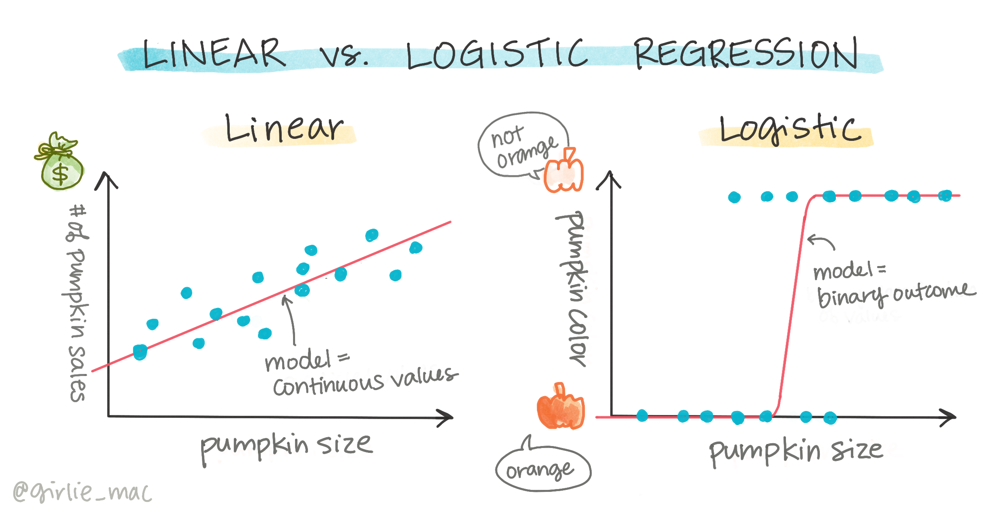
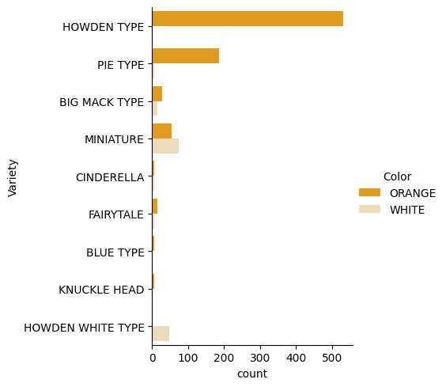
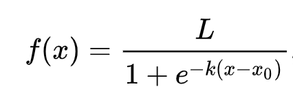
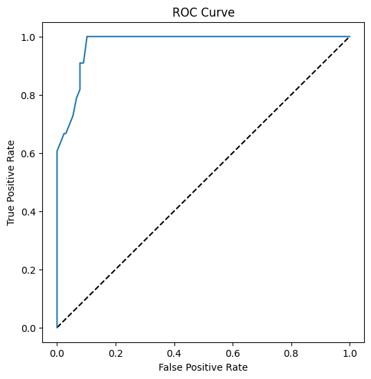

<!--
CO_OP_TRANSLATOR_METADATA:
{
  "original_hash": "72b5bae0879baddf6aafc82bb07b8776",
  "translation_date": "2025-08-29T12:58:20+00:00",
  "source_file": "2-Regression/4-Logistic/README.md",
  "language_code": "ur"
}
-->
# لاجسٹک ریگریشن کے ذریعے کیٹیگریز کی پیش گوئی



## [لیکچر سے پہلے کا کوئز](https://gray-sand-07a10f403.1.azurestaticapps.net/quiz/15/)

> ### [یہ سبق R میں دستیاب ہے!](../../../../2-Regression/4-Logistic/solution/R/lesson_4.html)

## تعارف

ریگریشن پر اس آخری سبق میں، جو کہ مشین لرننگ کی بنیادی _کلاسک_ تکنیکوں میں سے ایک ہے، ہم لاجسٹک ریگریشن پر نظر ڈالیں گے۔ آپ اس تکنیک کو بائنری کیٹیگریز کی پیش گوئی کے لیے پیٹرنز دریافت کرنے کے لیے استعمال کریں گے۔ کیا یہ کینڈی چاکلیٹ ہے یا نہیں؟ کیا یہ بیماری متعدی ہے یا نہیں؟ کیا یہ کسٹمر اس پروڈکٹ کو منتخب کرے گا یا نہیں؟

اس سبق میں آپ سیکھیں گے:

- ڈیٹا ویژولائزیشن کے لیے ایک نئی لائبریری
- لاجسٹک ریگریشن کے طریقے

✅ اس قسم کی ریگریشن کے ساتھ کام کرنے کی سمجھ کو گہرا کریں اس [Learn module](https://docs.microsoft.com/learn/modules/train-evaluate-classification-models?WT.mc_id=academic-77952-leestott) میں۔

## پیشگی شرط

کدو کے ڈیٹا کے ساتھ کام کرنے کے بعد، ہم اس سے کافی واقف ہو چکے ہیں کہ ایک بائنری کیٹیگری ہے جس کے ساتھ ہم کام کر سکتے ہیں: `Color`۔

آئیے ایک لاجسٹک ریگریشن ماڈل بنائیں تاکہ کچھ متغیرات کے ذریعے پیش گوئی کی جا سکے کہ _کسی دیے گئے کدو کا رنگ کیا ہو سکتا ہے_ (نارنجی 🎃 یا سفید 👻)۔

> ہم ریگریشن کے بارے میں سبق میں بائنری کلاسیفیکیشن کی بات کیوں کر رہے ہیں؟ صرف لسانی سہولت کے لیے، کیونکہ لاجسٹک ریگریشن [واقعی ایک کلاسیفیکیشن طریقہ](https://scikit-learn.org/stable/modules/linear_model.html#logistic-regression) ہے، اگرچہ یہ لینیئر پر مبنی ہے۔ ڈیٹا کو کلاسیفائی کرنے کے دوسرے طریقے اگلے سبق گروپ میں سیکھیں۔

## سوال کی وضاحت کریں

ہمارے مقصد کے لیے، ہم اسے بائنری کے طور پر ظاہر کریں گے: 'سفید' یا 'نہ سفید'۔ ہمارے ڈیٹا سیٹ میں ایک 'striped' کیٹیگری بھی ہے لیکن اس کے چند ہی مثالیں ہیں، اس لیے ہم اسے استعمال نہیں کریں گے۔ یہ ویسے بھی ڈیٹا سیٹ سے null ویلیوز کو ہٹانے کے بعد غائب ہو جاتی ہے۔

> 🎃 دلچسپ حقیقت، ہم کبھی کبھی سفید کدو کو 'ghost' کدو کہتے ہیں۔ انہیں تراشنا بہت آسان نہیں ہوتا، اس لیے وہ نارنجی کدو کی طرح مقبول نہیں ہیں لیکن وہ دیکھنے میں بہت اچھے لگتے ہیں! تو ہم اپنے سوال کو اس طرح بھی دوبارہ تشکیل دے سکتے ہیں: 'Ghost' یا 'Not Ghost'۔ 👻

## لاجسٹک ریگریشن کے بارے میں

لاجسٹک ریگریشن لینیئر ریگریشن سے مختلف ہے، جس کے بارے میں آپ نے پہلے سیکھا، چند اہم طریقوں سے۔

[](https://youtu.be/KpeCT6nEpBY "مشین لرننگ کے لیے ابتدائی - لاجسٹک ریگریشن کو سمجھنا")

> 🎥 لاجسٹک ریگریشن کا مختصر ویڈیو جائزہ دیکھنے کے لیے اوپر دی گئی تصویر پر کلک کریں۔

### بائنری کلاسیفیکیشن

لاجسٹک ریگریشن وہی خصوصیات پیش نہیں کرتا جو لینیئر ریگریشن کرتا ہے۔ پہلا بائنری کیٹیگری ("سفید یا نہ سفید") کے بارے میں پیش گوئی پیش کرتا ہے جبکہ دوسرا مسلسل ویلیوز کی پیش گوئی کرنے کے قابل ہے، مثال کے طور پر کدو کی اصل اور فصل کے وقت کو دیکھتے ہوئے، _اس کی قیمت کتنی بڑھے گی_۔


> انفوگرافک از [Dasani Madipalli](https://twitter.com/dasani_decoded)

### دیگر کلاسیفیکیشنز

لاجسٹک ریگریشن کی دیگر اقسام بھی ہیں، جن میں ملٹی نومیئل اور آرڈینل شامل ہیں:

- **ملٹی نومیئل**، جس میں ایک سے زیادہ کیٹیگریز شامل ہوتی ہیں - "نارنجی، سفید، اور دھاری دار"۔
- **آرڈینل**، جس میں ترتیب شدہ کیٹیگریز شامل ہوتی ہیں، مفید اگر ہم اپنے نتائج کو منطقی طور پر ترتیب دینا چاہتے ہیں، جیسے ہمارے کدو جو ایک محدود تعداد کے سائز (mini, sm, med, lg, xl, xxl) کے ذریعے ترتیب دیے گئے ہیں۔


### متغیرات کو ہم آہنگ ہونے کی ضرورت نہیں

یاد ہے کہ لینیئر ریگریشن زیادہ ہم آہنگ متغیرات کے ساتھ بہتر کام کرتا تھا؟ لاجسٹک ریگریشن اس کے برعکس ہے - متغیرات کو ہم آہنگ ہونے کی ضرورت نہیں۔ یہ اس ڈیٹا کے لیے کام کرتا ہے جس میں کچھ حد تک کمزور ہم آہنگی ہے۔

### آپ کو بہت زیادہ صاف ڈیٹا کی ضرورت ہے

لاجسٹک ریگریشن زیادہ درست نتائج دے گا اگر آپ زیادہ ڈیٹا استعمال کریں؛ ہمارا چھوٹا ڈیٹا سیٹ اس کام کے لیے موزوں نہیں ہے، لہذا اسے ذہن میں رکھیں۔

[](https://youtu.be/B2X4H9vcXTs "مشین لرننگ کے لیے ابتدائی - لاجسٹک ریگریشن کے لیے ڈیٹا تجزیہ اور تیاری")

> 🎥 لینیئر ریگریشن کے لیے ڈیٹا کی تیاری کا مختصر ویڈیو جائزہ دیکھنے کے لیے اوپر دی گئی تصویر پر کلک کریں۔

✅ ان ڈیٹا کی اقسام کے بارے میں سوچیں جو لاجسٹک ریگریشن کے لیے موزوں ہوں۔

## مشق - ڈیٹا کو صاف کریں

سب سے پہلے، ڈیٹا کو تھوڑا صاف کریں، null ویلیوز کو ہٹائیں اور صرف کچھ کالمز منتخب کریں:

1. درج ذیل کوڈ شامل کریں:

    ```python
  
    columns_to_select = ['City Name','Package','Variety', 'Origin','Item Size', 'Color']
    pumpkins = full_pumpkins.loc[:, columns_to_select]

    pumpkins.dropna(inplace=True)
    ```

    آپ ہمیشہ اپنے نئے ڈیٹا فریم پر ایک نظر ڈال سکتے ہیں:

    ```python
    pumpkins.info
    ```

### ویژولائزیشن - کیٹیگریکل پلاٹ

اب تک آپ نے [starter notebook](./notebook.ipynb) میں کدو کے ڈیٹا کو دوبارہ لوڈ کیا ہے اور اسے صاف کیا ہے تاکہ ایک ڈیٹا سیٹ محفوظ کیا جا سکے جس میں چند متغیرات شامل ہوں، جن میں `Color` بھی شامل ہے۔ آئیے نوٹ بک میں ڈیٹا فریم کو ایک مختلف لائبریری کا استعمال کرتے ہوئے ویژولائز کریں: [Seaborn](https://seaborn.pydata.org/index.html)، جو پہلے استعمال کی گئی Matplotlib پر مبنی ہے۔

Seaborn آپ کے ڈیٹا کو ویژولائز کرنے کے کچھ دلچسپ طریقے پیش کرتا ہے۔ مثال کے طور پر، آپ `Variety` اور `Color` کے لیے ڈیٹا کی تقسیم کا موازنہ کیٹیگریکل پلاٹ میں کر سکتے ہیں۔

1. کدو کے ڈیٹا `pumpkins` کا استعمال کرتے ہوئے اور ہر کٹیگری (نارنجی یا سفید) کے لیے رنگ کی میپنگ کی وضاحت کرتے ہوئے `catplot` فنکشن کا استعمال کرتے ہوئے ایسا پلاٹ بنائیں:

    ```python
    import seaborn as sns
    
    palette = {
    'ORANGE': 'orange',
    'WHITE': 'wheat',
    }

    sns.catplot(
    data=pumpkins, y="Variety", hue="Color", kind="count",
    palette=palette, 
    )
    ```

    

    ڈیٹا کا مشاہدہ کرتے ہوئے، آپ دیکھ سکتے ہیں کہ Color ڈیٹا Variety سے کیسے تعلق رکھتا ہے۔

    ✅ اس کیٹیگریکل پلاٹ کو دیکھتے ہوئے، آپ کون سے دلچسپ تجزیے کا تصور کر سکتے ہیں؟

### ڈیٹا پری پروسیسنگ: فیچر اور لیبل انکوڈنگ

ہمارے کدو کے ڈیٹا سیٹ میں تمام کالمز کے لیے اسٹرنگ ویلیوز ہیں۔ کیٹیگریکل ڈیٹا کے ساتھ کام کرنا انسانوں کے لیے آسان ہے لیکن مشینوں کے لیے نہیں۔ مشین لرننگ الگورتھمز نمبرز کے ساتھ بہتر کام کرتے ہیں۔ یہی وجہ ہے کہ انکوڈنگ ڈیٹا پری پروسیسنگ کے مرحلے میں ایک بہت اہم قدم ہے، کیونکہ یہ ہمیں کیٹیگریکل ڈیٹا کو عددی ڈیٹا میں تبدیل کرنے کے قابل بناتا ہے، بغیر کسی معلومات کو کھوئے۔ اچھی انکوڈنگ ایک اچھے ماڈل کی تعمیر کا باعث بنتی ہے۔

فیچر انکوڈنگ کے لیے دو اہم قسم کے انکوڈرز ہیں:

1. آرڈینل انکوڈر: یہ آرڈینل متغیرات کے لیے موزوں ہے، جو کیٹیگریکل متغیرات ہیں جہاں ان کا ڈیٹا منطقی ترتیب کی پیروی کرتا ہے، جیسے ہمارے ڈیٹا سیٹ میں `Item Size` کالم۔ یہ ایک میپنگ بناتا ہے تاکہ ہر کیٹیگری کو ایک نمبر کے ذریعے ظاہر کیا جا سکے، جو کالم میں کیٹیگری کی ترتیب ہے۔

    ```python
    from sklearn.preprocessing import OrdinalEncoder

    item_size_categories = [['sml', 'med', 'med-lge', 'lge', 'xlge', 'jbo', 'exjbo']]
    ordinal_features = ['Item Size']
    ordinal_encoder = OrdinalEncoder(categories=item_size_categories)
    ```

2. کیٹیگریکل انکوڈر: یہ نومینل متغیرات کے لیے موزوں ہے، جو کیٹیگریکل متغیرات ہیں جہاں ان کا ڈیٹا منطقی ترتیب کی پیروی نہیں کرتا، جیسے ہمارے ڈیٹا سیٹ میں `Item Size` کے علاوہ تمام فیچرز۔ یہ ایک ون-ہاٹ انکوڈنگ ہے، جس کا مطلب ہے کہ ہر کیٹیگری کو ایک بائنری کالم کے ذریعے ظاہر کیا جاتا ہے: انکوڈڈ متغیر 1 کے برابر ہے اگر کدو اس Variety سے تعلق رکھتا ہے اور 0 اگر نہیں۔

    ```python
    from sklearn.preprocessing import OneHotEncoder

    categorical_features = ['City Name', 'Package', 'Variety', 'Origin']
    categorical_encoder = OneHotEncoder(sparse_output=False)
    ```

پھر، `ColumnTransformer` کو متعدد انکوڈرز کو ایک ہی مرحلے میں یکجا کرنے اور انہیں مناسب کالمز پر لاگو کرنے کے لیے استعمال کیا جاتا ہے۔

```python
    from sklearn.compose import ColumnTransformer
    
    ct = ColumnTransformer(transformers=[
        ('ord', ordinal_encoder, ordinal_features),
        ('cat', categorical_encoder, categorical_features)
        ])
    
    ct.set_output(transform='pandas')
    encoded_features = ct.fit_transform(pumpkins)
```

دوسری طرف، لیبل کو انکوڈ کرنے کے لیے، ہم scikit-learn کی `LabelEncoder` کلاس استعمال کرتے ہیں، جو لیبلز کو نارملائز کرنے میں مدد کرنے کے لیے ایک یوٹیلیٹی کلاس ہے تاکہ وہ صرف 0 اور n_classes-1 (یہاں، 0 اور 1) کے درمیان ویلیوز پر مشتمل ہوں۔

```python
    from sklearn.preprocessing import LabelEncoder

    label_encoder = LabelEncoder()
    encoded_label = label_encoder.fit_transform(pumpkins['Color'])
```

ایک بار جب ہم فیچرز اور لیبل کو انکوڈ کر لیتے ہیں، تو ہم انہیں ایک نئے ڈیٹا فریم `encoded_pumpkins` میں ضم کر سکتے ہیں۔

```python
    encoded_pumpkins = encoded_features.assign(Color=encoded_label)
```

✅ `Item Size` کالم کے لیے آرڈینل انکوڈر استعمال کرنے کے فوائد کیا ہیں؟

### متغیرات کے درمیان تعلقات کا تجزیہ کریں

اب جب کہ ہم نے اپنے ڈیٹا کو پری پروسیس کر لیا ہے، ہم فیچرز اور لیبل کے درمیان تعلقات کا تجزیہ کر سکتے ہیں تاکہ یہ سمجھ سکیں کہ ماڈل فیچرز کو دیکھتے ہوئے لیبل کی پیش گوئی کرنے میں کتنا اچھا ہوگا۔

اس قسم کے تجزیے کو انجام دینے کا بہترین طریقہ ڈیٹا کو پلاٹ کرنا ہے۔ ہم دوبارہ Seaborn کے `catplot` فنکشن کا استعمال کریں گے، تاکہ `Item Size`, `Variety` اور `Color` کے تعلقات کو کیٹیگریکل پلاٹ میں ویژولائز کیا جا سکے۔ ڈیٹا کو بہتر طور پر پلاٹ کرنے کے لیے ہم انکوڈڈ `Item Size` کالم اور ان انکوڈڈ `Variety` کالم کا استعمال کریں گے۔

```python
    palette = {
    'ORANGE': 'orange',
    'WHITE': 'wheat',
    }
    pumpkins['Item Size'] = encoded_pumpkins['ord__Item Size']

    g = sns.catplot(
        data=pumpkins,
        x="Item Size", y="Color", row='Variety',
        kind="box", orient="h",
        sharex=False, margin_titles=True,
        height=1.8, aspect=4, palette=palette,
    )
    g.set(xlabel="Item Size", ylabel="").set(xlim=(0,6))
    g.set_titles(row_template="{row_name}")
```


### ایک swarm پلاٹ استعمال کریں

چونکہ Color ایک بائنری کیٹیگری ہے (سفید یا نہ سفید)، اسے ویژولائزیشن کے لیے 'ایک [خصوصی طریقہ](https://seaborn.pydata.org/tutorial/categorical.html?highlight=bar)' کی ضرورت ہے۔ اس کیٹیگری کے دیگر متغیرات کے ساتھ تعلق کو ویژولائز کرنے کے دوسرے طریقے بھی ہیں۔

آپ متغیرات کو Seaborn پلاٹس کے ساتھ ساتھ ویژولائز کر سکتے ہیں۔

1. ویلیوز کی تقسیم کو ظاہر کرنے کے لیے ایک 'swarm' پلاٹ آزمائیں:

    ```python
    palette = {
    0: 'orange',
    1: 'wheat'
    }
    sns.swarmplot(x="Color", y="ord__Item Size", data=encoded_pumpkins, palette=palette)
    ```

    

**دھیان دیں**: اوپر دیا گیا کوڈ ایک وارننگ پیدا کر سکتا ہے، کیونکہ Seaborn اتنے زیادہ ڈیٹا پوائنٹس کو swarm پلاٹ میں ظاہر کرنے میں ناکام ہو سکتا ہے۔ ایک ممکنہ حل مارکر کے سائز کو کم کرنا ہے، 'size' پیرامیٹر کا استعمال کرتے ہوئے۔ تاہم، اس بات سے آگاہ رہیں کہ یہ پلاٹ کی readability کو متاثر کرتا ہے۔

> **🧮 مجھے ریاضی دکھائیں**
>
> لاجسٹک ریگریشن 'زیادہ سے زیادہ امکان' کے تصور پر انحصار کرتا ہے، [sigmoid functions](https://wikipedia.org/wiki/Sigmoid_function) کا استعمال کرتے ہوئے۔ ایک 'Sigmoid Function' پلاٹ پر 'S' شکل کی طرح نظر آتی ہے۔ یہ ایک ویلیو لیتا ہے اور اسے 0 اور 1 کے درمیان کہیں میپ کرتا ہے۔ اس کے curve کو 'logistic curve' بھی کہا جاتا ہے۔ اس کا فارمولا اس طرح نظر آتا ہے:
>
> 
>
> جہاں sigmoid کا midpoint x کے 0 پوائنٹ پر پایا جاتا ہے، L curve کی زیادہ سے زیادہ ویلیو ہے، اور k curve کی steepness ہے۔ اگر فنکشن کا نتیجہ 0.5 سے زیادہ ہے، تو متعلقہ لیبل کو بائنری انتخاب کے '1' کلاس کے طور پر دیا جائے گا۔ اگر نہیں، تو اسے '0' کے طور پر کلاسیفائی کیا جائے گا۔

## اپنا ماڈل بنائیں

Scikit-learn میں ان بائنری کلاسیفیکیشنز کو تلاش کرنے کے لیے ماڈل بنانا حیرت انگیز طور پر سیدھا ہے۔

[](https://youtu.be/MmZS2otPrQ8 "مشین لرننگ کے لیے ابتدائی - ڈیٹا کی کلاسیفیکیشن کے لیے لاجسٹک ریگریشن")

> 🎥 لاجسٹک ریگریشن ماڈل بنانے کا مختصر ویڈیو جائزہ دیکھنے کے لیے اوپر دی گئی تصویر پر کلک کریں۔

1. ان متغیرات کو منتخب کریں جنہیں آپ اپنے کلاسیفیکیشن ماڈل میں استعمال کرنا چاہتے ہیں اور `train_test_split()` کو کال کرتے ہوئے ٹریننگ اور ٹیسٹ سیٹس کو تقسیم کریں:

    ```python
    from sklearn.model_selection import train_test_split
    
    X = encoded_pumpkins[encoded_pumpkins.columns.difference(['Color'])]
    y = encoded_pumpkins['Color']

    X_train, X_test, y_train, y_test = train_test_split(X, y, test_size=0.2, random_state=0)
    
    ```

2. اب آپ اپنے ماڈل کو ٹرین کر سکتے ہیں، اپنے ٹریننگ ڈیٹا کے ساتھ `fit()` کو کال کرتے ہوئے، اور اس کا نتیجہ پرنٹ کر سکتے ہیں:

    ```python
    from sklearn.metrics import f1_score, classification_report 
    from sklearn.linear_model import LogisticRegression

    model = LogisticRegression()
    model.fit(X_train, y_train)
    predictions = model.predict(X_test)

    print(classification_report(y_test, predictions))
    print('Predicted labels: ', predictions)
    print('F1-score: ', f1_score(y_test, predictions))
    ```

    اپنے ماڈل کے اسکور بورڈ پر ایک نظر ڈالیں۔ یہ برا نہیں ہے، اس بات کو مدنظر رکھتے ہوئے کہ آپ کے پاس صرف تقریباً 1000 قطاروں کا ڈیٹا ہے:

    ```output
                       precision    recall  f1-score   support
    
                    0       0.94      0.98      0.96       166
                    1       0.85      0.67      0.75        33
    
        accuracy                                0.92       199
        macro avg           0.89      0.82      0.85       199
        weighted avg        0.92      0.92      0.92       199
    
        Predicted labels:  [0 0 0 0 0 0 0 0 0 0 0 0 0 0 0 0 0 0 0 0 1 0 0 1 0 0 0 0 0 0 0 0 1 0 0 0 0
        0 0 0 0 0 1 0 1 0 0 1 0 0 0 0 0 1 0 1 0 1 0 1 0 0 0 0 0 0 0 0 0 0 0 0 0 0
        1 0 0 0 0 0 0 0 1 0 0 0 0 0 0 0 1 0 0 0 0 0 0 0 0 1 0 1 0 0 0 0 0 0 0 1 0
        0 0 0 0 0 0 0 0 0 0 0 0 0 0 0 0 0 0 0 0 0 1 0 0 0 0 0 0 0 0 1 0 0 0 1 1 0
        0 0 0 0 1 0 0 0 0 0 1 0 0 0 0 0 0 0 0 0 0 0 0 0 0 0 0 0 0 0 0 0 0 0 0 0 1
        0 0 0 1 0 0 0 0 0 0 0 0 1 1]
        F1-score:  0.7457627118644068
    ```

## کنفیوژن میٹرکس کے ذریعے بہتر سمجھ

جبکہ آپ اوپر دی گئی اشیاء کو پرنٹ کر کے [اصطلاحات](https://scikit-learn.org/stable/modules/generated/sklearn.metrics.classification_report.html?highlight=classification_report#sklearn.metrics.classification_report) کے ذریعے اسکور بورڈ رپورٹ حاصل کر سکتے ہیں، آپ اپنے ماڈل کو زیادہ آسانی سے سمجھ سکتے ہیں اگر آپ [confusion matrix](https://scikit-learn.org/stable/modules/model_evaluation.html#confusion-matrix) کا استعمال کریں تاکہ یہ سمجھ سکیں کہ ماڈل کی کارکردگی کیسی ہے۔

> 🎓 ایک '[confusion matrix](https://wikipedia.org/wiki/Confusion_matrix)' (یا 'error matrix') ایک جدول ہے جو آپ کے ماڈل کے true بمقابلہ false positives اور negatives کو ظاہر کرتا ہے، اس طرح پیش گوئیوں کی درستگی کو جانچتا ہے۔

1. کنفیوژن میٹرکس استعمال کرنے کے لیے، `confusion_matrix()` کو کال کریں:

    ```python
    from sklearn.metrics import confusion_matrix
    confusion_matrix(y_test, predictions)
    ```

    اپنے ماڈل کی کنفیوژن میٹرکس پر ایک نظر ڈالیں:

    ```output
    array([[162,   4],
           [ 11,  22]])
    ```

Scikit-learn میں، کنفیوژن میٹرکس کی قطاریں (axis 0) اصل لیبلز ہیں اور کالمز (axis 1) پیش گوئی شدہ لیبلز ہیں۔

|       |   0   |   1   |
| :---: | :---: | :---: |
|   0   |  TN   |  FP   |
|   1   |  FN   |  TP   |

یہاں کیا ہو رہا ہے؟ فرض کریں ہمارا ماڈل کدو کو دو بائنری کیٹیگریز کے درمیان کلاسیفائی کرنے کے لیے کہا جاتا ہے، کیٹیگری 'سفید' اور کیٹیگری 'نہ سفید'۔

- اگر آپ کا ماڈل کسی کدو کو نہ سفید پیش گوئی کرتا ہے اور یہ حقیقت میں کیٹیگری 'نہ سفید' سے تعلق رکھتا ہے تو ہم اسے true negative کہتے ہیں، جو اوپر بائیں نمبر سے ظاہر ہوتا ہے۔
- اگر آپ کا ماڈل کسی کدو کو سفید پیش گوئی کرتا ہے اور یہ حقیقت میں کیٹیگری 'نہ سفید'
کنفیوژن میٹرکس کا پریسیژن اور ریکال سے کیا تعلق ہے؟ یاد رکھیں، اوپر دی گئی کلاسفکیشن رپورٹ نے پریسیژن (0.85) اور ریکال (0.67) دکھایا تھا۔

پریسیژن = tp / (tp + fp) = 22 / (22 + 4) = 0.8461538461538461

ریکال = tp / (tp + fn) = 22 / (22 + 11) = 0.6666666666666666

✅ سوال: کنفیوژن میٹرکس کے مطابق، ماڈل نے کیسا کام کیا؟ جواب: برا نہیں؛ کافی تعداد میں ٹرو نیگیٹوز ہیں لیکن کچھ فالس نیگیٹوز بھی موجود ہیں۔

آئیے کنفیوژن میٹرکس کے TP/TN اور FP/FN کی میپنگ کی مدد سے پہلے دیکھے گئے اصطلاحات کو دوبارہ دیکھتے ہیں:

🎓 پریسیژن: TP/(TP + FP) بازیافت شدہ مثالوں میں سے متعلقہ مثالوں کا تناسب (مثال کے طور پر، کون سے لیبلز درست لیبل کیے گئے)

🎓 ریکال: TP/(TP + FN) متعلقہ مثالوں کا تناسب جو بازیافت کی گئیں، چاہے وہ درست لیبل کی گئی ہوں یا نہ ہوں

🎓 f1-اسکور: (2 * پریسیژن * ریکال)/(پریسیژن + ریکال) پریسیژن اور ریکال کا وزنی اوسط، بہترین 1 اور بدترین 0

🎓 سپورٹ: ہر لیبل کی بازیافت کی گئی تعداد

🎓 ایکیوریسی: (TP + TN)/(TP + TN + FP + FN) کسی سیمپل کے لیے درست پیش گوئی کیے گئے لیبلز کا فیصد

🎓 میکرو اوسط: ہر لیبل کے لیے غیر وزنی اوسط میٹرکس کا حساب، لیبل کے عدم توازن کو مدنظر نہ رکھتے ہوئے

🎓 ویٹڈ اوسط: ہر لیبل کے لیے اوسط میٹرکس کا حساب، لیبل کے عدم توازن کو ان کی سپورٹ (ہر لیبل کے لیے درست مثالوں کی تعداد) کے ذریعے وزن دے کر مدنظر رکھتے ہوئے

✅ کیا آپ سوچ سکتے ہیں کہ اگر آپ چاہتے ہیں کہ آپ کا ماڈل فالس نیگیٹوز کی تعداد کم کرے تو آپ کو کون سا میٹرک دیکھنا چاہیے؟

## اس ماڈل کے ROC کرف کو ویژولائز کریں

[](https://youtu.be/GApO575jTA0 "مشین لرننگ کے ابتدائی افراد کے لیے - ROC کرف کے ساتھ لاجسٹک ریگریشن پرفارمنس کا تجزیہ")

> 🎥 اوپر دی گئی تصویر پر کلک کریں ROC کرف کا مختصر جائزہ دیکھنے کے لیے

آئیے ایک اور ویژولائزیشن کریں تاکہ نام نہاد 'ROC' کرف کو دیکھ سکیں:

```python
from sklearn.metrics import roc_curve, roc_auc_score
import matplotlib
import matplotlib.pyplot as plt
%matplotlib inline

y_scores = model.predict_proba(X_test)
fpr, tpr, thresholds = roc_curve(y_test, y_scores[:,1])

fig = plt.figure(figsize=(6, 6))
plt.plot([0, 1], [0, 1], 'k--')
plt.plot(fpr, tpr)
plt.xlabel('False Positive Rate')
plt.ylabel('True Positive Rate')
plt.title('ROC Curve')
plt.show()
```

Matplotlib کا استعمال کرتے ہوئے، ماڈل کے [Receiving Operating Characteristic](https://scikit-learn.org/stable/auto_examples/model_selection/plot_roc.html?highlight=roc) یا ROC کو پلاٹ کریں۔ ROC کرف اکثر کسی کلاسیفائر کے آؤٹ پٹ کو اس کے ٹرو اور فالس پازیٹوز کے لحاظ سے دیکھنے کے لیے استعمال کیے جاتے ہیں۔ "ROC کرف عام طور پر Y محور پر ٹرو پازیٹو ریٹ اور X محور پر فالس پازیٹو ریٹ کو نمایاں کرتے ہیں۔" اس لیے کرف کی ڈھلوان اور درمیانی لائن اور کرف کے درمیان جگہ اہمیت رکھتی ہے: آپ ایک ایسا کرف چاہتے ہیں جو جلدی سے اوپر جائے اور لائن کے اوپر ہو۔ ہمارے کیس میں، شروع میں فالس پازیٹوز موجود ہیں، اور پھر لائن صحیح طریقے سے اوپر اور اوپر جاتی ہے:



آخر میں، Scikit-learn کے [`roc_auc_score` API](https://scikit-learn.org/stable/modules/generated/sklearn.metrics.roc_auc_score.html?highlight=roc_auc#sklearn.metrics.roc_auc_score) کا استعمال کریں تاکہ اصل 'ایریا انڈر دی کرف' (AUC) کا حساب لگایا جا سکے:

```python
auc = roc_auc_score(y_test,y_scores[:,1])
print(auc)
```
نتیجہ `0.9749908725812341` ہے۔ چونکہ AUC 0 سے 1 تک ہوتا ہے، آپ ایک بڑا اسکور چاہتے ہیں، کیونکہ ایک ماڈل جو اپنی پیش گوئیوں میں 100% درست ہے اس کا AUC 1 ہوگا؛ اس کیس میں، ماڈل _کافی اچھا_ ہے۔

آئندہ کلاسیفکیشن کے اسباق میں، آپ سیکھیں گے کہ اپنے ماڈل کے اسکورز کو بہتر بنانے کے لیے کیسے تکرار کریں۔ لیکن فی الحال، مبارک ہو! آپ نے یہ ریگریشن اسباق مکمل کر لیے ہیں!

---
## 🚀چیلنج

لاجسٹک ریگریشن کے بارے میں مزید جاننے کے لیے بہت کچھ ہے! لیکن سیکھنے کا بہترین طریقہ تجربہ کرنا ہے۔ ایسا ڈیٹاسیٹ تلاش کریں جو اس قسم کے تجزیے کے لیے موزوں ہو اور اس کے ساتھ ایک ماڈل بنائیں۔ آپ نے کیا سیکھا؟ مشورہ: [Kaggle](https://www.kaggle.com/search?q=logistic+regression+datasets) پر دلچسپ ڈیٹاسیٹس تلاش کریں۔

## [لیکچر کے بعد کا کوئز](https://gray-sand-07a10f403.1.azurestaticapps.net/quiz/16/)

## جائزہ اور خود مطالعہ

[اسٹینفورڈ کے اس مقالے](https://web.stanford.edu/~jurafsky/slp3/5.pdf) کے پہلے چند صفحات پڑھیں جو لاجسٹک ریگریشن کے عملی استعمالات پر ہے۔ ان کاموں کے بارے میں سوچیں جو اب تک مطالعہ کیے گئے ریگریشن کے مختلف اقسام کے لیے زیادہ موزوں ہیں۔ کون سا طریقہ بہتر کام کرے گا؟

## اسائنمنٹ 

[اس ریگریشن کو دوبارہ آزمائیں](assignment.md)

---

**ڈس کلیمر**:  
یہ دستاویز AI ترجمہ سروس [Co-op Translator](https://github.com/Azure/co-op-translator) کا استعمال کرتے ہوئے ترجمہ کی گئی ہے۔ ہم درستگی کے لیے پوری کوشش کرتے ہیں، لیکن براہ کرم آگاہ رہیں کہ خودکار ترجمے میں غلطیاں یا عدم درستگی ہو سکتی ہیں۔ اصل دستاویز کو اس کی اصل زبان میں مستند ذریعہ سمجھا جانا چاہیے۔ اہم معلومات کے لیے، پیشہ ور انسانی ترجمہ کی سفارش کی جاتی ہے۔ اس ترجمے کے استعمال سے پیدا ہونے والی کسی بھی غلط فہمی یا غلط تشریح کے لیے ہم ذمہ دار نہیں ہیں۔