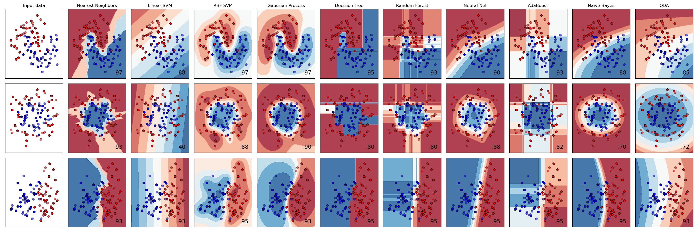
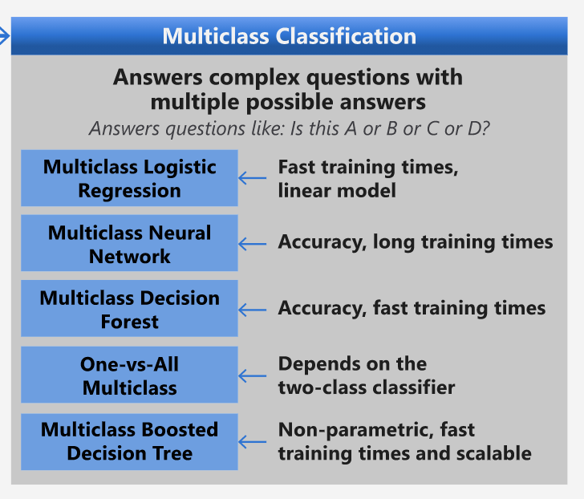
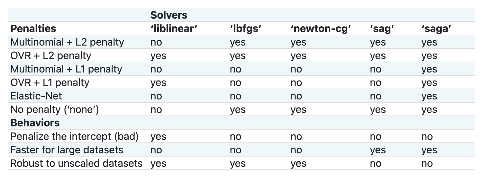

<!--
CO_OP_TRANSLATOR_METADATA:
{
  "original_hash": "9579f42e3ff5114c58379cc9e186a828",
  "translation_date": "2025-08-29T13:53:02+00:00",
  "source_file": "4-Classification/2-Classifiers-1/README.md",
  "language_code": "ur"
}
-->
# کھانوں کے اقسام کی درجہ بندی 1

اس سبق میں، آپ پچھلے سبق سے محفوظ کردہ ڈیٹا سیٹ استعمال کریں گے، جو کھانوں کے بارے میں متوازن اور صاف ڈیٹا پر مشتمل ہے۔

آپ اس ڈیٹا سیٹ کو مختلف درجہ بندی کرنے والے الگورتھمز کے ساتھ استعمال کریں گے تاکہ _اجزاء کے ایک گروپ کی بنیاد پر کسی قومی کھانے کی پیش گوئی کی جا سکے_۔ اس عمل کے دوران، آپ یہ سیکھیں گے کہ الگورتھمز کو درجہ بندی کے کاموں کے لیے کس طرح استعمال کیا جا سکتا ہے۔

## [سبق سے پہلے کا کوئز](https://gray-sand-07a10f403.1.azurestaticapps.net/quiz/21/)
# تیاری

یہ فرض کرتے ہوئے کہ آپ نے [سبق 1](../1-Introduction/README.md) مکمل کر لیا ہے، اس بات کو یقینی بنائیں کہ _cleaned_cuisines.csv_ فائل ان چار اسباق کے لیے روٹ `/data` فولڈر میں موجود ہو۔

## مشق - قومی کھانے کی پیش گوئی کریں

1. اس سبق کے _notebook.ipynb_ فولڈر میں کام کرتے ہوئے، اس فائل کو Pandas لائبریری کے ساتھ درآمد کریں:

    ```python
    import pandas as pd
    cuisines_df = pd.read_csv("../data/cleaned_cuisines.csv")
    cuisines_df.head()
    ```

    ڈیٹا کچھ اس طرح نظر آتا ہے:

|     | Unnamed: 0 | cuisine | almond | angelica | anise | anise_seed | apple | apple_brandy | apricot | armagnac | ... | whiskey | white_bread | white_wine | whole_grain_wheat_flour | wine | wood | yam | yeast | yogurt | zucchini |
| --- | ---------- | ------- | ------ | -------- | ----- | ---------- | ----- | ------------ | ------- | -------- | --- | ------- | ----------- | ---------- | ----------------------- | ---- | ---- | --- | ----- | ------ | -------- |
| 0   | 0          | indian  | 0      | 0        | 0     | 0          | 0     | 0            | 0       | 0        | ... | 0       | 0           | 0          | 0                       | 0    | 0    | 0   | 0     | 0      | 0        |
| 1   | 1          | indian  | 1      | 0        | 0     | 0          | 0     | 0            | 0       | 0        | ... | 0       | 0           | 0          | 0                       | 0    | 0    | 0   | 0     | 0      | 0        |
| 2   | 2          | indian  | 0      | 0        | 0     | 0          | 0     | 0            | 0       | 0        | ... | 0       | 0           | 0          | 0                       | 0    | 0    | 0   | 0     | 0      | 0        |
| 3   | 3          | indian  | 0      | 0        | 0     | 0          | 0     | 0            | 0       | 0        | ... | 0       | 0           | 0          | 0                       | 0    | 0    | 0   | 0     | 0      | 0        |
| 4   | 4          | indian  | 0      | 0        | 0     | 0          | 0     | 0            | 0       | 0        | ... | 0       | 0           | 0          | 0                       | 0    | 0    | 0   | 0     | 1      | 0        |
  

1. اب مزید لائبریریاں درآمد کریں:

    ```python
    from sklearn.linear_model import LogisticRegression
    from sklearn.model_selection import train_test_split, cross_val_score
    from sklearn.metrics import accuracy_score,precision_score,confusion_matrix,classification_report, precision_recall_curve
    from sklearn.svm import SVC
    import numpy as np
    ```

1. X اور y کوآرڈینیٹس کو دو ڈیٹا فریمز میں تقسیم کریں تاکہ تربیت کے لیے استعمال ہو سکیں۔ `cuisine` کو لیبلز ڈیٹا فریم کے طور پر استعمال کریں:

    ```python
    cuisines_label_df = cuisines_df['cuisine']
    cuisines_label_df.head()
    ```

    یہ کچھ اس طرح نظر آئے گا:

    ```output
    0    indian
    1    indian
    2    indian
    3    indian
    4    indian
    Name: cuisine, dtype: object
    ```

1. `Unnamed: 0` کالم اور `cuisine` کالم کو `drop()` کا استعمال کرتے ہوئے ہٹا دیں۔ باقی ڈیٹا کو تربیت کے قابل خصوصیات کے طور پر محفوظ کریں:

    ```python
    cuisines_feature_df = cuisines_df.drop(['Unnamed: 0', 'cuisine'], axis=1)
    cuisines_feature_df.head()
    ```

    آپ کی خصوصیات کچھ اس طرح نظر آئیں گی:

|      | almond | angelica | anise | anise_seed | apple | apple_brandy | apricot | armagnac | artemisia | artichoke |  ... | whiskey | white_bread | white_wine | whole_grain_wheat_flour | wine | wood |  yam | yeast | yogurt | zucchini |
| ---: | -----: | -------: | ----: | ---------: | ----: | -----------: | ------: | -------: | --------: | --------: | ---: | ------: | ----------: | ---------: | ----------------------: | ---: | ---: | ---: | ----: | -----: | -------: |
|    0 |      0 |        0 |     0 |          0 |     0 |            0 |       0 |        0 |         0 |         0 |  ... |       0 |           0 |          0 |                       0 |    0 |    0 |    0 |     0 |      0 |        0 | 0 |
|    1 |      1 |        0 |     0 |          0 |     0 |            0 |       0 |        0 |         0 |         0 |  ... |       0 |           0 |          0 |                       0 |    0 |    0 |    0 |     0 |      0 |        0 | 0 |
|    2 |      0 |        0 |     0 |          0 |     0 |            0 |       0 |        0 |         0 |         0 |  ... |       0 |           0 |          0 |                       0 |    0 |    0 |    0 |     0 |      0 |        0 | 0 |
|    3 |      0 |        0 |     0 |          0 |     0 |            0 |       0 |        0 |         0 |         0 |  ... |       0 |           0 |          0 |                       0 |    0 |    0 |    0 |     0 |      0 |        0 | 0 |
|    4 |      0 |        0 |     0 |          0 |     0 |            0 |       0 |        0 |         0 |         0 |  ... |       0 |           0 |          0 |                       0 |    0 |    0 |    0 |     0 |      1 |        0 | 0 |

اب آپ اپنے ماڈل کی تربیت کے لیے تیار ہیں!

## اپنے درجہ بندی کرنے والے کا انتخاب کریں

اب جب کہ آپ کا ڈیٹا صاف اور تربیت کے لیے تیار ہے، آپ کو یہ فیصلہ کرنا ہوگا کہ اس کام کے لیے کون سا الگورتھم استعمال کرنا ہے۔

Scikit-learn درجہ بندی کو سپروائزڈ لرننگ کے تحت گروپ کرتا ہے، اور اس زمرے میں آپ کو درجہ بندی کے کئی طریقے ملیں گے۔ [مختلف اقسام](https://scikit-learn.org/stable/supervised_learning.html) پہلی نظر میں کافی الجھن پیدا کر سکتی ہیں۔ درج ذیل طریقے درجہ بندی کی تکنیکوں کو شامل کرتے ہیں:

- لکیری ماڈلز
- سپورٹ ویکٹر مشینز
- سٹوچاسٹک گریڈینٹ ڈیسنٹ
- قریب ترین ہمسایہ
- گاؤسیئن پروسیسز
- فیصلہ کن درخت
- مجموعی طریقے (ووٹنگ درجہ بندی کرنے والا)
- ملٹی کلاس اور ملٹی آؤٹ پٹ الگورتھمز (ملٹی کلاس اور ملٹی لیبل درجہ بندی، ملٹی کلاس-ملٹی آؤٹ پٹ درجہ بندی)

> آپ [نیورل نیٹ ورکس کا استعمال کرتے ہوئے ڈیٹا کو درجہ بندی](https://scikit-learn.org/stable/modules/neural_networks_supervised.html#classification) بھی کر سکتے ہیں، لیکن یہ اس سبق کے دائرہ کار سے باہر ہے۔

### کون سا درجہ بندی کرنے والا منتخب کریں؟

تو، آپ کو کون سا درجہ بندی کرنے والا منتخب کرنا چاہیے؟ اکثر، کئی الگورتھمز کو آزمانا اور اچھے نتائج کی تلاش کرنا ایک طریقہ ہے۔ Scikit-learn ایک [سائیڈ بائی سائیڈ موازنہ](https://scikit-learn.org/stable/auto_examples/classification/plot_classifier_comparison.html) پیش کرتا ہے، جو مختلف درجہ بندی کرنے والوں کے نتائج کو بصری طور پر دکھاتا ہے:


> یہ گراف Scikit-learn کی دستاویزات سے تیار کیے گئے ہیں۔

> AutoML اس مسئلے کو آسانی سے حل کرتا ہے، یہ موازنہ کلاؤڈ میں چلاتا ہے اور آپ کو آپ کے ڈیٹا کے لیے بہترین الگورتھم منتخب کرنے دیتا ہے۔ اسے [یہاں آزمائیں](https://docs.microsoft.com/learn/modules/automate-model-selection-with-azure-automl/?WT.mc_id=academic-77952-leestott)

### ایک بہتر طریقہ

اندازے لگانے کے بجائے، ایک بہتر طریقہ یہ ہے کہ اس ڈاؤن لوڈ کے قابل [ML Cheat Sheet](https://docs.microsoft.com/azure/machine-learning/algorithm-cheat-sheet?WT.mc_id=academic-77952-leestott) کے خیالات پر عمل کریں۔ یہاں، ہم دریافت کرتے ہیں کہ ہمارے ملٹی کلاس مسئلے کے لیے ہمارے پاس کچھ اختیارات ہیں:


> مائیکروسافٹ کے الگورتھم چیٹ شیٹ کا ایک حصہ، جو ملٹی کلاس درجہ بندی کے اختیارات کو تفصیل سے بیان کرتا ہے۔

✅ اس چیٹ شیٹ کو ڈاؤن لوڈ کریں، پرنٹ کریں، اور اپنی دیوار پر لٹکا دیں!

### استدلال

آئیے دیکھتے ہیں کہ ہم مختلف طریقوں کے بارے میں کیا استدلال کر سکتے ہیں، دی گئی حدود کے پیش نظر:

- **نیورل نیٹ ورکس بہت بھاری ہیں**۔ ہمارے صاف لیکن کم سے کم ڈیٹا سیٹ کو دیکھتے ہوئے، اور یہ حقیقت کہ ہم نوٹ بکس کے ذریعے مقامی طور پر تربیت چلا رہے ہیں، نیورل نیٹ ورکس اس کام کے لیے بہت زیادہ ہیں۔
- **دو کلاس درجہ بندی کرنے والا نہیں**۔ ہم دو کلاس درجہ بندی کرنے والا استعمال نہیں کرتے، لہذا یہ one-vs-all کو خارج کر دیتا ہے۔
- **فیصلہ کن درخت یا لاجسٹک ریگریشن کام کر سکتے ہیں**۔ فیصلہ کن درخت یا ملٹی کلاس ڈیٹا کے لیے لاجسٹک ریگریشن کام کر سکتے ہیں۔
- **ملٹی کلاس بوسٹڈ فیصلہ کن درخت مختلف مسئلے کو حل کرتے ہیں**۔ ملٹی کلاس بوسٹڈ فیصلہ کن درخت غیر پیرامیٹرک کاموں کے لیے سب سے زیادہ موزوں ہیں، جیسے کہ درجہ بندی بنانے کے لیے ڈیزائن کیے گئے کام، لہذا یہ ہمارے لیے مفید نہیں ہیں۔

### Scikit-learn کا استعمال

ہم اپنے ڈیٹا کا تجزیہ کرنے کے لیے Scikit-learn کا استعمال کریں گے۔ تاہم، Scikit-learn میں لاجسٹک ریگریشن استعمال کرنے کے کئی طریقے ہیں۔ [پاس کرنے کے لیے پیرامیٹرز](https://scikit-learn.org/stable/modules/generated/sklearn.linear_model.LogisticRegression.html?highlight=logistic%20regressio#sklearn.linear_model.LogisticRegression) پر ایک نظر ڈالیں۔

بنیادی طور پر دو اہم پیرامیٹرز ہیں - `multi_class` اور `solver` - جنہیں ہمیں لاجسٹک ریگریشن انجام دینے کے لیے Scikit-learn کو بتانا ہوگا۔ `multi_class` کی قدر ایک خاص رویہ لاگو کرتی ہے۔ solver کی قدر اس الگورتھم کو ظاہر کرتی ہے جو استعمال کیا جائے گا۔ تمام solvers کو تمام `multi_class` اقدار کے ساتھ جوڑا نہیں جا سکتا۔

دستاویزات کے مطابق، ملٹی کلاس کیس میں، تربیتی الگورتھم:

- **one-vs-rest (OvR) اسکیم کا استعمال کرتا ہے**، اگر `multi_class` آپشن `ovr` پر سیٹ ہو۔
- **کراس-اینٹروپی نقصان کا استعمال کرتا ہے**، اگر `multi_class` آپشن `multinomial` پر سیٹ ہو۔ (فی الحال `multinomial` آپشن صرف ‘lbfgs’, ‘sag’, ‘saga’ اور ‘newton-cg’ solvers کے ذریعے سپورٹ کیا جاتا ہے۔)

> 🎓 یہاں 'اسکیم' یا تو 'ovr' (one-vs-rest) یا 'multinomial' ہو سکتی ہے۔ چونکہ لاجسٹک ریگریشن بنیادی طور پر بائنری درجہ بندی کی حمایت کے لیے ڈیزائن کی گئی ہے، یہ اسکیمیں اسے ملٹی کلاس درجہ بندی کے کاموں کو بہتر طریقے سے ہینڈل کرنے کی اجازت دیتی ہیں۔ [ماخذ](https://machinelearningmastery.com/one-vs-rest-and-one-vs-one-for-multi-class-classification/)

> 🎓 'solver' کو "اصلاحی مسئلے میں استعمال ہونے والے الگورتھم" کے طور پر بیان کیا گیا ہے۔ [ماخذ](https://scikit-learn.org/stable/modules/generated/sklearn.linear_model.LogisticRegression.html?highlight=logistic%20regressio#sklearn.linear_model.LogisticRegression)

Scikit-learn یہ جدول پیش کرتا ہے تاکہ یہ وضاحت کی جا سکے کہ مختلف solvers مختلف قسم کے ڈیٹا ڈھانچوں کے چیلنجز کو کیسے ہینڈل کرتے ہیں:



## مشق - ڈیٹا کو تقسیم کریں

ہم اپنی پہلی تربیتی کوشش کے لیے لاجسٹک ریگریشن پر توجہ مرکوز کر سکتے ہیں کیونکہ آپ نے حال ہی میں پچھلے سبق میں اس کے بارے میں سیکھا ہے۔
اپنے ڈیٹا کو تربیتی اور جانچنے والے گروپوں میں تقسیم کرنے کے لیے `train_test_split()` کو کال کریں:

```python
X_train, X_test, y_train, y_test = train_test_split(cuisines_feature_df, cuisines_label_df, test_size=0.3)
```

## مشق - لاجسٹک ریگریشن کا اطلاق کریں

چونکہ آپ ملٹی کلاس کیس استعمال کر رہے ہیں، آپ کو یہ منتخب کرنے کی ضرورت ہے کہ کون سی _اسکیم_ استعمال کرنی ہے اور کون سا _solver_ سیٹ کرنا ہے۔ لاجسٹک ریگریشن کو ملٹی کلاس سیٹنگ اور **liblinear** solver کے ساتھ تربیت دینے کے لیے استعمال کریں۔

1. ایک لاجسٹک ریگریشن بنائیں جس میں multi_class کو `ovr` پر سیٹ کریں اور solver کو `liblinear` پر سیٹ کریں:

    ```python
    lr = LogisticRegression(multi_class='ovr',solver='liblinear')
    model = lr.fit(X_train, np.ravel(y_train))
    
    accuracy = model.score(X_test, y_test)
    print ("Accuracy is {}".format(accuracy))
    ```

    ✅ ایک مختلف solver جیسے `lbfgs` کو آزمائیں، جو اکثر ڈیفالٹ کے طور پر سیٹ کیا جاتا ہے۔
> نوٹ، جب ضرورت ہو تو اپنے ڈیٹا کو فلیٹ کرنے کے لیے Pandas کی [`ravel`](https://pandas.pydata.org/pandas-docs/stable/reference/api/pandas.Series.ravel.html) فنکشن استعمال کریں۔
درستگی **80%** سے زیادہ اچھی ہے!

1. آپ اس ماڈل کو ایک ڈیٹا کی قطار (#50) پر ٹیسٹ کرکے عمل میں دیکھ سکتے ہیں:

    ```python
    print(f'ingredients: {X_test.iloc[50][X_test.iloc[50]!=0].keys()}')
    print(f'cuisine: {y_test.iloc[50]}')
    ```

    نتیجہ پرنٹ ہوتا ہے:

   ```output
   ingredients: Index(['cilantro', 'onion', 'pea', 'potato', 'tomato', 'vegetable_oil'], dtype='object')
   cuisine: indian
   ```

   ✅ ایک مختلف قطار نمبر آزمائیں اور نتائج چیک کریں

1. مزید گہرائی میں جا کر، آپ اس پیش گوئی کی درستگی چیک کر سکتے ہیں:

    ```python
    test= X_test.iloc[50].values.reshape(-1, 1).T
    proba = model.predict_proba(test)
    classes = model.classes_
    resultdf = pd.DataFrame(data=proba, columns=classes)
    
    topPrediction = resultdf.T.sort_values(by=[0], ascending = [False])
    topPrediction.head()
    ```

    نتیجہ پرنٹ ہوتا ہے - بھارتی کھانے کا اندازہ بہترین ہے، اچھی امکان کے ساتھ:

    |          |        0 |
    | -------: | -------: |
    |   indian | 0.715851 |
    |  chinese | 0.229475 |
    | japanese | 0.029763 |
    |   korean | 0.017277 |
    |     thai | 0.007634 |

    ✅ کیا آپ وضاحت کر سکتے ہیں کہ ماڈل کو کیوں یقین ہے کہ یہ بھارتی کھانا ہے؟

1. مزید تفصیل حاصل کریں ایک کلاسفیکیشن رپورٹ پرنٹ کرکے، جیسا کہ آپ نے ریگریشن کے اسباق میں کیا تھا:

    ```python
    y_pred = model.predict(X_test)
    print(classification_report(y_test,y_pred))
    ```

    |              | precision | recall | f1-score | support |
    | ------------ | --------- | ------ | -------- | ------- |
    | chinese      | 0.73      | 0.71   | 0.72     | 229     |
    | indian       | 0.91      | 0.93   | 0.92     | 254     |
    | japanese     | 0.70      | 0.75   | 0.72     | 220     |
    | korean       | 0.86      | 0.76   | 0.81     | 242     |
    | thai         | 0.79      | 0.85   | 0.82     | 254     |
    | accuracy     | 0.80      | 1199   |          |         |
    | macro avg    | 0.80      | 0.80   | 0.80     | 1199    |
    | weighted avg | 0.80      | 0.80   | 0.80     | 1199    |

## 🚀چیلنج

اس سبق میں، آپ نے اپنے صاف شدہ ڈیٹا کا استعمال کرتے ہوئے ایک مشین لرننگ ماڈل بنایا جو اجزاء کی ایک سیریز کی بنیاد پر قومی کھانے کی پیش گوئی کر سکتا ہے۔ کچھ وقت نکال کر Scikit-learn کے فراہم کردہ مختلف اختیارات کو پڑھیں تاکہ ڈیٹا کو کلاسفائی کیا جا سکے۔ 'solver' کے تصور میں مزید گہرائی میں جائیں تاکہ سمجھ سکیں کہ پردے کے پیچھے کیا ہوتا ہے۔

## [لیکچر کے بعد کا کوئز](https://gray-sand-07a10f403.1.azurestaticapps.net/quiz/22/)

## جائزہ اور خود مطالعہ

لاجسٹک ریگریشن کے پیچھے ریاضی کو [اس سبق](https://people.eecs.berkeley.edu/~russell/classes/cs194/f11/lectures/CS194%20Fall%202011%20Lecture%2006.pdf) میں مزید گہرائی سے پڑھیں۔
## اسائنمنٹ 

[solvers کا مطالعہ کریں](assignment.md)

---

**ڈس کلیمر**:  
یہ دستاویز AI ترجمہ سروس [Co-op Translator](https://github.com/Azure/co-op-translator) کا استعمال کرتے ہوئے ترجمہ کی گئی ہے۔ ہم درستگی کے لیے پوری کوشش کرتے ہیں، لیکن براہ کرم آگاہ رہیں کہ خودکار ترجمے میں غلطیاں یا عدم درستگی ہو سکتی ہیں۔ اصل دستاویز کو اس کی اصل زبان میں مستند ذریعہ سمجھا جانا چاہیے۔ اہم معلومات کے لیے، پیشہ ور انسانی ترجمہ کی سفارش کی جاتی ہے۔ اس ترجمے کے استعمال سے پیدا ہونے والی کسی بھی غلط فہمی یا غلط تشریح کے لیے ہم ذمہ دار نہیں ہیں۔