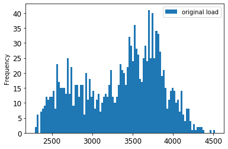

<!--
CO_OP_TRANSLATOR_METADATA:
{
  "original_hash": "2f400075e003e749fdb0d6b3b4787a99",
  "translation_date": "2025-08-29T13:09:53+00:00",
  "source_file": "7-TimeSeries/2-ARIMA/README.md",
  "language_code": "ur"
}
-->
# اے آر آئی ایم اے کے ساتھ وقت کی سیریز کی پیشن گوئی

پچھلے سبق میں، آپ نے وقت کی سیریز کی پیشن گوئی کے بارے میں تھوڑا سا سیکھا اور ایک ڈیٹا سیٹ لوڈ کیا جو ایک وقت کے عرصے میں بجلی کے لوڈ کے اتار چڑھاؤ کو ظاہر کرتا ہے۔

> 🎥 اوپر دی گئی تصویر پر کلک کریں: اے آر آئی ایم اے ماڈلز کا مختصر تعارف۔ مثال آر میں کی گئی ہے، لیکن تصورات عالمگیر ہیں۔

## [سبق سے پہلے کا کوئز](https://gray-sand-07a10f403.1.azurestaticapps.net/quiz/43/)

## تعارف

اس سبق میں، آپ ایک مخصوص طریقہ دریافت کریں گے جس کے ذریعے ماڈلز بنائے جا سکتے ہیں [اے آر آئی ایم اے: *آٹو*ریگریسیو *انٹیگریٹڈ* *موونگ* *ایوریج*](https://wikipedia.org/wiki/Autoregressive_integrated_moving_average)۔ اے آر آئی ایم اے ماڈلز خاص طور پر ایسے ڈیٹا کے لیے موزوں ہیں جو [غیر اسٹیشنری](https://wikipedia.org/wiki/Stationary_process) دکھاتا ہے۔

## عمومی تصورات

اے آر آئی ایم اے کے ساتھ کام کرنے کے لیے، کچھ تصورات کو سمجھنا ضروری ہے:

- 🎓 **اسٹیشنریٹی**۔ شماریاتی سیاق و سباق میں، اسٹیشنریٹی ایسے ڈیٹا کو ظاہر کرتی ہے جس کی تقسیم وقت کے ساتھ تبدیل نہیں ہوتی۔ غیر اسٹیشنری ڈیٹا، پھر، رجحانات کی وجہ سے اتار چڑھاؤ دکھاتا ہے جسے تجزیہ کرنے کے لیے تبدیل کرنا ضروری ہوتا ہے۔ مثال کے طور پر، موسمیاتی اثرات ڈیٹا میں اتار چڑھاؤ پیدا کر سکتے ہیں اور انہیں 'موسمیاتی فرق' کے عمل کے ذریعے ختم کیا جا سکتا ہے۔

- 🎓 **[فرق کرنا](https://wikipedia.org/wiki/Autoregressive_integrated_moving_average#Differencing)**۔ فرق کرنا، شماریاتی سیاق و سباق میں، غیر اسٹیشنری ڈیٹا کو اسٹیشنری بنانے کے عمل کو ظاہر کرتا ہے تاکہ اس کے غیر مستقل رجحان کو ختم کیا جا سکے۔ "فرق کرنا وقت کی سیریز کے سطح میں تبدیلیوں کو ختم کرتا ہے، رجحان اور موسمیاتی اثرات کو ختم کرتا ہے اور نتیجتاً وقت کی سیریز کے اوسط کو مستحکم کرتا ہے۔" [شیکسونگ وغیرہ کا مقالہ](https://arxiv.org/abs/1904.07632)

## وقت کی سیریز کے سیاق و سباق میں اے آر آئی ایم اے

آئیے اے آر آئی ایم اے کے حصوں کو کھولتے ہیں تاکہ بہتر سمجھ سکیں کہ یہ وقت کی سیریز کو ماڈل کرنے میں کیسے مدد کرتا ہے اور اس کے خلاف پیشن گوئی کرنے میں کیسے مدد کرتا ہے۔

- **اے آر - آٹو ریگریسیو کے لیے**۔ آٹو ریگریسیو ماڈلز، جیسا کہ نام ظاہر کرتا ہے، وقت میں 'پیچھے' دیکھتے ہیں تاکہ آپ کے ڈیٹا میں پچھلی قدروں کا تجزیہ کریں اور ان کے بارے میں مفروضے بنائیں۔ ان پچھلی قدروں کو 'لیگز' کہا جاتا ہے۔ ایک مثال وہ ڈیٹا ہو سکتا ہے جو پنسلوں کی ماہانہ فروخت کو ظاہر کرتا ہے۔ ہر مہینے کی فروخت کا کل ڈیٹا سیٹ میں ایک 'ارتقائی متغیر' سمجھا جائے گا۔ یہ ماڈل اس طرح بنایا جاتا ہے کہ "دلچسپی کا ارتقائی متغیر اپنی ہی لیگیڈ (یعنی، پچھلی) قدروں پر ریگریس کیا جاتا ہے۔" [ویکیپیڈیا](https://wikipedia.org/wiki/Autoregressive_integrated_moving_average)

- **آئی - انٹیگریٹڈ کے لیے**۔ اے آر ایم اے ماڈلز کے مشابہ، اے آر آئی ایم اے میں 'آئی' اس کے *[انٹیگریٹڈ](https://wikipedia.org/wiki/Order_of_integration)* پہلو کی طرف اشارہ کرتا ہے۔ ڈیٹا کو 'انٹیگریٹڈ' کیا جاتا ہے جب فرق کرنے کے مراحل کو غیر اسٹیشنری کو ختم کرنے کے لیے لاگو کیا جاتا ہے۔

- **ایم اے - موونگ ایوریج کے لیے**۔ اس ماڈل کا [موونگ ایوریج](https://wikipedia.org/wiki/Moving-average_model) پہلو اس آؤٹ پٹ متغیر کی طرف اشارہ کرتا ہے جو لیگز کی موجودہ اور پچھلی قدروں کو دیکھ کر طے کیا جاتا ہے۔

خلاصہ: اے آر آئی ایم اے وقت کی سیریز کے ڈیٹا کی خاص شکل کو جتنا ممکن ہو قریب سے فٹ کرنے کے لیے استعمال کیا جاتا ہے۔

## مشق - اے آر آئی ایم اے ماڈل بنائیں

اس سبق میں [_/working_](https://github.com/microsoft/ML-For-Beginners/tree/main/7-TimeSeries/2-ARIMA/working) فولڈر کھولیں اور [_notebook.ipynb_](https://github.com/microsoft/ML-For-Beginners/blob/main/7-TimeSeries/2-ARIMA/working/notebook.ipynb) فائل تلاش کریں۔

1. نوٹ بک چلائیں تاکہ `statsmodels` پائتھون لائبریری لوڈ ہو؛ آپ کو اے آر آئی ایم اے ماڈلز کے لیے اس کی ضرورت ہوگی۔

1. ضروری لائبریریاں لوڈ کریں۔

1. اب، ڈیٹا کو پلاٹ کرنے کے لیے مزید مفید لائبریریاں لوڈ کریں:

    ```python
    import os
    import warnings
    import matplotlib.pyplot as plt
    import numpy as np
    import pandas as pd
    import datetime as dt
    import math

    from pandas.plotting import autocorrelation_plot
    from statsmodels.tsa.statespace.sarimax import SARIMAX
    from sklearn.preprocessing import MinMaxScaler
    from common.utils import load_data, mape
    from IPython.display import Image

    %matplotlib inline
    pd.options.display.float_format = '{:,.2f}'.format
    np.set_printoptions(precision=2)
    warnings.filterwarnings("ignore") # specify to ignore warning messages
    ```

1. `/data/energy.csv` فائل سے ڈیٹا کو ایک پانڈاز ڈیٹا فریم میں لوڈ کریں اور دیکھیں:

    ```python
    energy = load_data('./data')[['load']]
    energy.head(10)
    ```

1. جنوری 2012 سے دسمبر 2014 تک دستیاب تمام توانائی کے ڈیٹا کو پلاٹ کریں۔ کوئی حیرت نہیں ہونی چاہیے کیونکہ ہم نے یہ ڈیٹا پچھلے سبق میں دیکھا تھا:

    ```python
    energy.plot(y='load', subplots=True, figsize=(15, 8), fontsize=12)
    plt.xlabel('timestamp', fontsize=12)
    plt.ylabel('load', fontsize=12)
    plt.show()
    ```

    اب، آئیے ایک ماڈل بناتے ہیں!

### تربیتی اور جانچ کے ڈیٹا سیٹس بنائیں

اب آپ کا ڈیٹا لوڈ ہو چکا ہے، لہذا آپ اسے تربیت اور جانچ کے سیٹس میں تقسیم کر سکتے ہیں۔ آپ اپنے ماڈل کو تربیتی سیٹ پر تربیت دیں گے۔ حسب معمول، ماڈل کی تربیت مکمل ہونے کے بعد، آپ اس کی درستگی کا اندازہ جانچ کے سیٹ کا استعمال کرتے ہوئے کریں گے۔ آپ کو یہ یقینی بنانا ہوگا کہ جانچ کا سیٹ تربیتی سیٹ کے بعد کے وقت کے عرصے کا احاطہ کرتا ہے تاکہ ماڈل مستقبل کے وقت کے عرصے سے معلومات حاصل نہ کرے۔

1. تربیتی سیٹ کے لیے 1 ستمبر سے 31 اکتوبر 2014 تک دو ماہ کا عرصہ مختص کریں۔ جانچ کا سیٹ 1 نومبر سے 31 دسمبر 2014 تک دو ماہ کے عرصے کو شامل کرے گا:

    ```python
    train_start_dt = '2014-11-01 00:00:00'
    test_start_dt = '2014-12-30 00:00:00'
    ```

    چونکہ یہ ڈیٹا توانائی کی روزانہ کی کھپت کو ظاہر کرتا ہے، اس میں ایک مضبوط موسمیاتی نمونہ ہے، لیکن کھپت حالیہ دنوں کی کھپت سے سب سے زیادہ مشابہت رکھتی ہے۔

1. فرق کو بصری طور پر دیکھیں:

    ```python
    energy[(energy.index < test_start_dt) & (energy.index >= train_start_dt)][['load']].rename(columns={'load':'train'}) \
        .join(energy[test_start_dt:][['load']].rename(columns={'load':'test'}), how='outer') \
        .plot(y=['train', 'test'], figsize=(15, 8), fontsize=12)
    plt.xlabel('timestamp', fontsize=12)
    plt.ylabel('load', fontsize=12)
    plt.show()
    ```

    

    لہذا، ڈیٹا کو تربیت دینے کے لیے وقت کی نسبتاً چھوٹی ونڈو کا استعمال کافی ہونا چاہیے۔

    > نوٹ: چونکہ ہم اے آر آئی ایم اے ماڈل کو فٹ کرنے کے لیے استعمال ہونے والے فنکشن میں فٹنگ کے دوران ان سیمپل ویلیڈیشن کا استعمال کرتے ہیں، ہم ویلیڈیشن ڈیٹا کو چھوڑ دیں گے۔

### تربیت کے لیے ڈیٹا تیار کریں

اب، آپ کو ڈیٹا کو تربیت کے لیے تیار کرنے کی ضرورت ہے، جس میں فلٹرنگ اور ڈیٹا کو اسکیل کرنا شامل ہے۔ اپنے ڈیٹا سیٹ کو صرف مطلوبہ وقت کے عرصے اور کالمز کو شامل کرنے کے لیے فلٹر کریں، اور اسکیلنگ تاکہ ڈیٹا کو 0,1 کے وقفے میں پیش کیا جا سکے۔

1. اصل ڈیٹا سیٹ کو فلٹر کریں تاکہ صرف مذکورہ وقت کے عرصے فی سیٹ اور صرف مطلوبہ کالم 'لوڈ' اور تاریخ شامل ہو:

    ```python
    train = energy.copy()[(energy.index >= train_start_dt) & (energy.index < test_start_dt)][['load']]
    test = energy.copy()[energy.index >= test_start_dt][['load']]

    print('Training data shape: ', train.shape)
    print('Test data shape: ', test.shape)
    ```

    آپ ڈیٹا کی شکل دیکھ سکتے ہیں:

    ```output
    Training data shape:  (1416, 1)
    Test data shape:  (48, 1)
    ```

1. ڈیٹا کو (0, 1) کی حد میں اسکیل کریں۔

    ```python
    scaler = MinMaxScaler()
    train['load'] = scaler.fit_transform(train)
    train.head(10)
    ```

1. اصل بمقابلہ اسکیلڈ ڈیٹا کو بصری طور پر دیکھیں:

    ```python
    energy[(energy.index >= train_start_dt) & (energy.index < test_start_dt)][['load']].rename(columns={'load':'original load'}).plot.hist(bins=100, fontsize=12)
    train.rename(columns={'load':'scaled load'}).plot.hist(bins=100, fontsize=12)
    plt.show()
    ```

    

    > اصل ڈیٹا

    

    > اسکیلڈ ڈیٹا

1. اب جب کہ آپ نے اسکیلڈ ڈیٹا کو کیلیبریٹ کر لیا ہے، آپ جانچ کے ڈیٹا کو اسکیل کر سکتے ہیں:

    ```python
    test['load'] = scaler.transform(test)
    test.head()
    ```

### اے آر آئی ایم اے نافذ کریں

اب وقت ہے کہ اے آر آئی ایم اے کو نافذ کریں! آپ اب `statsmodels` لائبریری کا استعمال کریں گے جو آپ نے پہلے انسٹال کی تھی۔

اب آپ کو کئی مراحل پر عمل کرنا ہوگا:

   1. ماڈل کو `SARIMAX()` کال کر کے اور ماڈل کے پیرامیٹرز: p، d، اور q پیرامیٹرز، اور P، D، اور Q پیرامیٹرز پاس کر کے ڈیفائن کریں۔
   2. تربیتی ڈیٹا کے لیے ماڈل کو تیار کریں `fit()` فنکشن کال کر کے۔
   3. پیشن گوئی کرنے کے لیے `forecast()` فنکشن کال کریں اور پیشن گوئی کے لیے قدموں کی تعداد (ہورائزن) کو مخصوص کریں۔

> 🎓 یہ تمام پیرامیٹرز کس لیے ہیں؟ اے آر آئی ایم اے ماڈل میں 3 پیرامیٹرز ہوتے ہیں جو وقت کی سیریز کے اہم پہلوؤں کو ماڈل کرنے میں مدد کرتے ہیں: موسمیاتی اثرات، رجحان، اور شور۔ یہ پیرامیٹرز ہیں:

`p`: ماڈل کے آٹو ریگریسیو پہلو سے وابستہ پیرامیٹر، جو *ماضی* کی قدروں کو شامل کرتا ہے۔
`d`: ماڈل کے انٹیگریٹڈ حصے سے وابستہ پیرامیٹر، جو وقت کی سیریز پر *فرق کرنے* کی مقدار کو متاثر کرتا ہے۔
`q`: ماڈل کے موونگ ایوریج حصے سے وابستہ پیرامیٹر۔

> نوٹ: اگر آپ کے ڈیٹا میں موسمیاتی پہلو ہے - جیسا کہ اس میں ہے - تو ہم موسمیاتی اے آر آئی ایم اے ماڈل (SARIMA) استعمال کرتے ہیں۔ اس صورت میں آپ کو پیرامیٹرز کا ایک اور سیٹ استعمال کرنے کی ضرورت ہے: `P`, `D`, اور `Q` جو `p`, `d`, اور `q` کے جیسے تعلقات کو بیان کرتے ہیں، لیکن ماڈل کے موسمیاتی اجزاء سے متعلق ہیں۔

1. اپنے پسندیدہ ہورائزن ویلیو کو سیٹ کریں۔ آئیے 3 گھنٹے آزمائیں:

    ```python
    # Specify the number of steps to forecast ahead
    HORIZON = 3
    print('Forecasting horizon:', HORIZON, 'hours')
    ```

    اے آر آئی ایم اے ماڈل کے پیرامیٹرز کے لیے بہترین قدروں کا انتخاب کرنا چیلنجنگ ہو سکتا ہے کیونکہ یہ کسی حد تک موضوعی اور وقت طلب ہے۔ آپ [`pyramid` لائبریری](https://alkaline-ml.com/pmdarima/0.9.0/modules/generated/pyramid.arima.auto_arima.html) سے `auto_arima()` فنکشن استعمال کرنے پر غور کر سکتے ہیں۔

1. فی الحال کچھ دستی انتخاب آزمائیں تاکہ ایک اچھا ماڈل تلاش کیا جا سکے۔

    ```python
    order = (4, 1, 0)
    seasonal_order = (1, 1, 0, 24)

    model = SARIMAX(endog=train, order=order, seasonal_order=seasonal_order)
    results = model.fit()

    print(results.summary())
    ```

    نتائج کی ایک جدول پرنٹ کی گئی ہے۔

آپ نے اپنا پہلا ماڈل بنا لیا ہے! اب ہمیں اسے جانچنے کا طریقہ تلاش کرنا ہوگا۔

### اپنے ماڈل کا جائزہ لیں

اپنے ماڈل کا جائزہ لینے کے لیے، آپ نام نہاد `walk forward` ویلیڈیشن انجام دے سکتے ہیں۔ عملی طور پر، وقت کی سیریز کے ماڈلز ہر بار جب نیا ڈیٹا دستیاب ہوتا ہے دوبارہ تربیت دیے جاتے ہیں۔ یہ ماڈل کو ہر وقت کے قدم پر بہترین پیشن گوئی کرنے کی اجازت دیتا ہے۔

اس تکنیک کا استعمال کرتے ہوئے وقت کی سیریز کے آغاز سے شروع کریں، تربیتی ڈیٹا سیٹ پر ماڈل کو تربیت دیں۔ پھر اگلے وقت کے قدم پر پیشن گوئی کریں۔ پیشن گوئی معلوم قدر کے خلاف جانچ کی جاتی ہے۔ تربیتی سیٹ کو معلوم قدر کو شامل کرنے کے لیے بڑھایا جاتا ہے اور عمل کو دہرایا جاتا ہے۔

> نوٹ: آپ کو تربیتی سیٹ ونڈو کو زیادہ موثر تربیت کے لیے مقررہ رکھنا چاہیے تاکہ ہر بار جب آپ تربیتی سیٹ میں ایک نیا مشاہدہ شامل کریں، آپ سیٹ کے آغاز سے مشاہدہ کو ہٹا دیں۔

یہ عمل اس بات کا زیادہ مضبوط تخمینہ فراہم کرتا ہے کہ ماڈل عملی طور پر کیسا کارکردگی دکھائے گا۔ تاہم، یہ اتنے زیادہ ماڈلز بنانے کی کمپیوٹیشن لاگت پر آتا ہے۔ اگر ڈیٹا چھوٹا ہو یا ماڈل سادہ ہو تو یہ قابل قبول ہے، لیکن بڑے پیمانے پر مسئلہ ہو سکتا ہے۔

واک فارورڈ ویلیڈیشن وقت کی سیریز کے ماڈل کے جائزے کا سنہری معیار ہے اور آپ کے اپنے منصوبوں کے لیے تجویز کیا جاتا ہے۔

1. پہلے، ہر ہورائزن قدم کے لیے ایک جانچ ڈیٹا پوائنٹ بنائیں۔

    ```python
    test_shifted = test.copy()

    for t in range(1, HORIZON+1):
        test_shifted['load+'+str(t)] = test_shifted['load'].shift(-t, freq='H')

    test_shifted = test_shifted.dropna(how='any')
    test_shifted.head(5)
    ```

    |            |          | لوڈ | لوڈ+1 | لوڈ+2 |
    | ---------- | -------- | ---- | ------ | ------ |
    | 2014-12-30 | 00:00:00 | 0.33 | 0.29   | 0.27   |
    | 2014-12-30 | 01:00:00 | 0.29 | 0.27   | 0.27   |
    | 2014-12-30 | 02:00:00 | 0.27 | 0.27   | 0.30   |
    | 2014-12-30 | 03:00:00 | 0.27 | 0.30   | 0.41   |
    | 2014-12-30 | 04:00:00 | 0.30 | 0.41   | 0.57   |

    ڈیٹا کو افقی طور پر اس کے ہورائزن پوائنٹ کے مطابق منتقل کیا جاتا ہے۔

1. اس سلائیڈنگ ونڈو اپروچ کا استعمال کرتے ہوئے اپنے جانچ ڈیٹا پر پیشن گوئی کریں، جانچ ڈیٹا کی لمبائی کے سائز میں ایک لوپ کے ذریعے:

    ```python
    %%time
    training_window = 720 # dedicate 30 days (720 hours) for training

    train_ts = train['load']
    test_ts = test_shifted

    history = [x for x in train_ts]
    history = history[(-training_window):]

    predictions = list()

    order = (2, 1, 0)
    seasonal_order = (1, 1, 0, 24)

    for t in range(test_ts.shape[0]):
        model = SARIMAX(endog=history, order=order, seasonal_order=seasonal_order)
        model_fit = model.fit()
        yhat = model_fit.forecast(steps = HORIZON)
        predictions.append(yhat)
        obs = list(test_ts.iloc[t])
        # move the training window
        history.append(obs[0])
        history.pop(0)
        print(test_ts.index[t])
        print(t+1, ': predicted =', yhat, 'expected =', obs)
    ```

    آپ تربیت کو دیکھ سکتے ہیں:

    ```output
    2014-12-30 00:00:00
    1 : predicted = [0.32 0.29 0.28] expected = [0.32945389435989236, 0.2900626678603402, 0.2739480752014323]

    2014-12-30 01:00:00
    2 : predicted = [0.3  0.29 0.3 ] expected = [0.2900626678603402, 0.2739480752014323, 0.26812891674127126]

    2014-12-30 02:00:00
    3 : predicted = [0.27 0.28 0.32] expected = [0.2739480752014323, 0.26812891674127126, 0.3025962399283795]
    ```

1. پیشن گوئی کو اصل لوڈ کے ساتھ موازنہ کریں:

    ```python
    eval_df = pd.DataFrame(predictions, columns=['t+'+str(t) for t in range(1, HORIZON+1)])
    eval_df['timestamp'] = test.index[0:len(test.index)-HORIZON+1]
    eval_df = pd.melt(eval_df, id_vars='timestamp', value_name='prediction', var_name='h')
    eval_df['actual'] = np.array(np.transpose(test_ts)).ravel()
    eval_df[['prediction', 'actual']] = scaler.inverse_transform(eval_df[['prediction', 'actual']])
    eval_df.head()
    ```

    آؤٹ پٹ
    |     |            | ٹائم اسٹیمپ | h   | پیشن گوئی | اصل   |
    | --- | ---------- | --------- | --- | ---------- | -------- |
    | 0   | 2014-12-30 | 00:00:00  | t+1 | 3,008.74   | 3,023.00 |
    | 1   | 2014-12-30 | 01:00:00  | t+1 | 2,955.53   | 2,935.00 |
    | 2   | 2014-12-30 | 02:00:00  | t+1 | 2,900.17   | 2,899.00 |
    | 3   | 2014-12-30 | 03:00:00  | t+1 | 2,917.69   | 2,886.00 |
    | 4   | 2014-12-30 | 04:00:00  | t+1 | 2,946.99   | 2,963.00 |

    گھنٹہ وار ڈیٹا کی پیشن گوئی کو اصل لوڈ کے ساتھ ملاحظہ کریں۔ یہ کتنا درست ہے؟

### ماڈل کی درستگی چیک کریں

اپنے ماڈل کی درستگی کو تمام پیشن گوئیوں پر اس کے اوسط مطلق فیصد غلطی (MAPE) کی جانچ کر کے چیک کریں۔
> **🧮 ریاضی دیکھیں**
>
> 
>
> [MAPE](https://www.linkedin.com/pulse/what-mape-mad-msd-time-series-allameh-statistics/) پیش گوئی کی درستگی کو ایک تناسب کے طور پر ظاہر کرنے کے لیے استعمال کیا جاتا ہے، جو اوپر دیے گئے فارمولے سے بیان کیا گیا ہے۔ اصل اور پیش گوئی کے درمیان فرق کو اصل سے تقسیم کیا جاتا ہے۔
>
> "اس حساب میں مطلق قدر کو وقت کے ہر پیش گوئی شدہ نقطے کے لیے جمع کیا جاتا ہے اور فٹ کیے گئے نقاط کی تعداد n سے تقسیم کیا جاتا ہے۔" [ویکیپیڈیا](https://wikipedia.org/wiki/Mean_absolute_percentage_error)
1. کوڈ میں مساوات لکھیں:

    ```python
    if(HORIZON > 1):
        eval_df['APE'] = (eval_df['prediction'] - eval_df['actual']).abs() / eval_df['actual']
        print(eval_df.groupby('h')['APE'].mean())
    ```

1. ایک قدم کے لیے MAPE کا حساب لگائیں:

    ```python
    print('One step forecast MAPE: ', (mape(eval_df[eval_df['h'] == 't+1']['prediction'], eval_df[eval_df['h'] == 't+1']['actual']))*100, '%')
    ```

    ایک قدم کی پیش گوئی کا MAPE:  0.5570581332313952 %

1. کثیر قدم کی پیش گوئی کا MAPE پرنٹ کریں:

    ```python
    print('Multi-step forecast MAPE: ', mape(eval_df['prediction'], eval_df['actual'])*100, '%')
    ```

    ```output
    Multi-step forecast MAPE:  1.1460048657704118 %
    ```

    ایک اچھا کم نمبر بہترین ہے: غور کریں کہ اگر کسی پیش گوئی کا MAPE 10 ہو تو اس کا مطلب ہے کہ یہ 10% تک غلط ہے۔

1. لیکن ہمیشہ کی طرح، اس قسم کی درستگی کی پیمائش کو بصری طور پر دیکھنا آسان ہے، تو آئیے اسے پلاٹ کریں:

    ```python
     if(HORIZON == 1):
        ## Plotting single step forecast
        eval_df.plot(x='timestamp', y=['actual', 'prediction'], style=['r', 'b'], figsize=(15, 8))

    else:
        ## Plotting multi step forecast
        plot_df = eval_df[(eval_df.h=='t+1')][['timestamp', 'actual']]
        for t in range(1, HORIZON+1):
            plot_df['t+'+str(t)] = eval_df[(eval_df.h=='t+'+str(t))]['prediction'].values

        fig = plt.figure(figsize=(15, 8))
        ax = plt.plot(plot_df['timestamp'], plot_df['actual'], color='red', linewidth=4.0)
        ax = fig.add_subplot(111)
        for t in range(1, HORIZON+1):
            x = plot_df['timestamp'][(t-1):]
            y = plot_df['t+'+str(t)][0:len(x)]
            ax.plot(x, y, color='blue', linewidth=4*math.pow(.9,t), alpha=math.pow(0.8,t))

        ax.legend(loc='best')

    plt.xlabel('timestamp', fontsize=12)
    plt.ylabel('load', fontsize=12)
    plt.show()
    ```

    

🏆 ایک بہت اچھا پلاٹ، جو ایک ماڈل کو اچھی درستگی کے ساتھ دکھاتا ہے۔ شاباش!

---

## 🚀چیلنج

وقت کی سیریز ماڈل کی درستگی کو جانچنے کے مختلف طریقوں پر غور کریں۔ ہم نے اس سبق میں MAPE پر بات کی ہے، لیکن کیا آپ دوسرے طریقے استعمال کر سکتے ہیں؟ ان پر تحقیق کریں اور ان کی وضاحت کریں۔ ایک مددگار دستاویز [یہاں](https://otexts.com/fpp2/accuracy.html) دستیاب ہے۔

## [لیکچر کے بعد کا کوئز](https://gray-sand-07a10f403.1.azurestaticapps.net/quiz/44/)

## جائزہ اور خود مطالعہ

یہ سبق ARIMA کے ساتھ وقت کی سیریز کی پیش گوئی کے صرف بنیادی اصولوں پر بات کرتا ہے۔ اپنے علم کو گہرا کرنے کے لیے وقت نکالیں اور [اس ریپوزٹری](https://microsoft.github.io/forecasting/) اور اس کے مختلف ماڈل اقسام کو دیکھیں تاکہ وقت کی سیریز کے ماڈلز بنانے کے دوسرے طریقے سیکھ سکیں۔

## اسائنمنٹ

[ایک نیا ARIMA ماڈل](assignment.md)

---

**ڈسکلیمر**:  
یہ دستاویز AI ترجمہ سروس [Co-op Translator](https://github.com/Azure/co-op-translator) کا استعمال کرتے ہوئے ترجمہ کی گئی ہے۔ ہم درستگی کے لیے کوشش کرتے ہیں، لیکن براہ کرم آگاہ رہیں کہ خودکار ترجمے میں غلطیاں یا عدم درستگی ہو سکتی ہیں۔ اصل دستاویز، جو اس کی مقامی زبان میں ہے، کو مستند ذریعہ سمجھا جانا چاہیے۔ اہم معلومات کے لیے، پیشہ ور انسانی ترجمہ کی سفارش کی جاتی ہے۔ اس ترجمے کے استعمال سے پیدا ہونے والی کسی بھی غلط فہمی یا غلط تشریح کے لیے ہم ذمہ دار نہیں ہیں۔