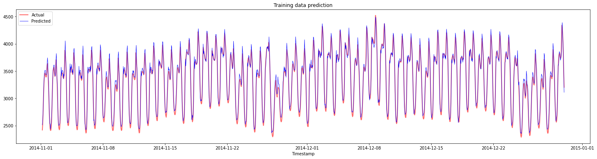
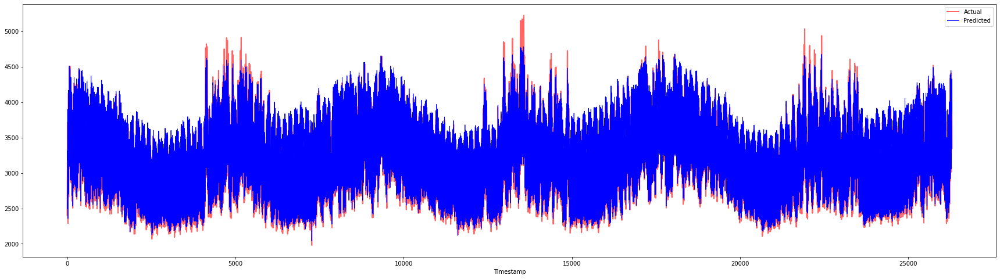

<!--
CO_OP_TRANSLATOR_METADATA:
{
  "original_hash": "f80e513b3279869e7661e3190cc83076",
  "translation_date": "2025-08-29T13:16:30+00:00",
  "source_file": "7-TimeSeries/3-SVR/README.md",
  "language_code": "ur"
}
-->
# وقت کی سیریز کی پیش گوئی سپورٹ ویکٹر ریگریسر کے ساتھ

پچھلے سبق میں، آپ نے ARIMA ماڈل کا استعمال کرتے ہوئے وقت کی سیریز کی پیش گوئی کرنا سیکھا۔ اب آپ سپورٹ ویکٹر ریگریسر ماڈل پر نظر ڈالیں گے، جو ایک ریگریسر ماڈل ہے جو مسلسل ڈیٹا کی پیش گوئی کے لیے استعمال ہوتا ہے۔

## [لیکچر سے پہلے کا کوئز](https://gray-sand-07a10f403.1.azurestaticapps.net/quiz/51/)

## تعارف

اس سبق میں، آپ سیکھیں گے کہ کس طرح [**SVM**: **S**upport **V**ector **M**achine](https://en.wikipedia.org/wiki/Support-vector_machine) کو ریگریشن کے لیے استعمال کیا جا سکتا ہے، جسے **SVR: Support Vector Regressor** بھی کہا جاتا ہے۔

### وقت کی سیریز کے تناظر میں SVR [^1]

SVR کی وقت کی سیریز کی پیش گوئی میں اہمیت کو سمجھنے سے پہلے، یہاں کچھ اہم تصورات ہیں جو آپ کو جاننے کی ضرورت ہے:

- **ریگریشن:** یہ ایک سپروائزڈ لرننگ تکنیک ہے جو دیے گئے ان پٹس سے مسلسل قدروں کی پیش گوئی کرتی ہے۔ اس کا مقصد فیچر اسپیس میں ایک ایسا خط یا منحنی فٹ کرنا ہے جس پر زیادہ سے زیادہ ڈیٹا پوائنٹس ہوں۔ مزید معلومات کے لیے [یہاں کلک کریں](https://en.wikipedia.org/wiki/Regression_analysis)۔
- **سپورٹ ویکٹر مشین (SVM):** یہ ایک قسم کا سپروائزڈ مشین لرننگ ماڈل ہے جو کلاسیفکیشن، ریگریشن اور آؤٹ لائرز کی شناخت کے لیے استعمال ہوتا ہے۔ یہ ماڈل فیچر اسپیس میں ایک ہائپرپلین ہوتا ہے، جو کلاسیفکیشن کے معاملے میں ایک حد کے طور پر کام کرتا ہے، اور ریگریشن کے معاملے میں بہترین فٹ لائن کے طور پر۔ SVM میں، عام طور پر ایک کرنل فنکشن استعمال کیا جاتا ہے تاکہ ڈیٹاسیٹ کو زیادہ ڈائمینشنز والے اسپیس میں تبدیل کیا جا سکے تاکہ وہ آسانی سے الگ ہو سکیں۔ مزید معلومات کے لیے [یہاں کلک کریں](https://en.wikipedia.org/wiki/Support-vector_machine)۔
- **سپورٹ ویکٹر ریگریسر (SVR):** یہ SVM کی ایک قسم ہے، جو بہترین فٹ لائن (جو SVM کے معاملے میں ایک ہائپرپلین ہے) تلاش کرتی ہے جس پر زیادہ سے زیادہ ڈیٹا پوائنٹس ہوں۔

### SVR کیوں؟ [^1]

پچھلے سبق میں آپ نے ARIMA کے بارے میں سیکھا، جو وقت کی سیریز کے ڈیٹا کی پیش گوئی کے لیے ایک بہت کامیاب شماریاتی لکیری طریقہ ہے۔ تاہم، بہت سے معاملات میں، وقت کی سیریز کے ڈیٹا میں *نان-لینیئرٹی* ہوتی ہے، جسے لکیری ماڈلز کے ذریعے نقشہ نہیں بنایا جا سکتا۔ ایسے معاملات میں، ڈیٹا میں نان-لینیئرٹی کو مدنظر رکھنے کی SVM کی صلاحیت SVR کو وقت کی سیریز کی پیش گوئی میں کامیاب بناتی ہے۔

## مشق - SVR ماڈل بنائیں

ڈیٹا کی تیاری کے ابتدائی چند مراحل پچھلے سبق [ARIMA](https://github.com/microsoft/ML-For-Beginners/tree/main/7-TimeSeries/2-ARIMA) کی طرح ہیں۔

اس سبق کے [_/working_](https://github.com/microsoft/ML-For-Beginners/tree/main/7-TimeSeries/3-SVR/working) فولڈر کو کھولیں اور [_notebook.ipynb_](https://github.com/microsoft/ML-For-Beginners/blob/main/7-TimeSeries/3-SVR/working/notebook.ipynb) فائل تلاش کریں۔[^2]

1. نوٹ بک چلائیں اور ضروری لائبریریاں درآمد کریں: [^2]

   ```python
   import sys
   sys.path.append('../../')
   ```

   ```python
   import os
   import warnings
   import matplotlib.pyplot as plt
   import numpy as np
   import pandas as pd
   import datetime as dt
   import math
   
   from sklearn.svm import SVR
   from sklearn.preprocessing import MinMaxScaler
   from common.utils import load_data, mape
   ```

2. `/data/energy.csv` فائل سے ڈیٹا کو ایک پانڈاز ڈیٹافریم میں لوڈ کریں اور دیکھیں: [^2]

   ```python
   energy = load_data('../../data')[['load']]
   ```

3. جنوری 2012 سے دسمبر 2014 تک دستیاب تمام توانائی کے ڈیٹا کو پلاٹ کریں: [^2]

   ```python
   energy.plot(y='load', subplots=True, figsize=(15, 8), fontsize=12)
   plt.xlabel('timestamp', fontsize=12)
   plt.ylabel('load', fontsize=12)
   plt.show()
   ```

   

   اب، آئیے اپنا SVR ماڈل بناتے ہیں۔

### تربیتی اور جانچ کے ڈیٹاسیٹس بنائیں

اب آپ کا ڈیٹا لوڈ ہو چکا ہے، لہذا آپ اسے تربیتی اور جانچ کے سیٹس میں تقسیم کر سکتے ہیں۔ پھر آپ ڈیٹا کو دوبارہ ترتیب دیں گے تاکہ ایک وقت کے مرحلے پر مبنی ڈیٹاسیٹ بنایا جا سکے، جو SVR کے لیے ضروری ہوگا۔ آپ اپنے ماڈل کو تربیتی سیٹ پر تربیت دیں گے۔ ماڈل کی تربیت مکمل ہونے کے بعد، آپ اس کی درستگی کو تربیتی سیٹ، جانچ کے سیٹ اور پھر مکمل ڈیٹاسیٹ پر جانچیں گے تاکہ مجموعی کارکردگی دیکھی جا سکے۔ آپ کو یہ یقینی بنانا ہوگا کہ جانچ کا سیٹ تربیتی سیٹ کے بعد کے وقت کی مدت کا احاطہ کرتا ہے تاکہ یہ یقینی بنایا جا سکے کہ ماڈل مستقبل کے وقت کی مدت سے معلومات حاصل نہ کرے [^2] (جسے *اوورفٹنگ* کہا جاتا ہے)۔

1. 1 ستمبر سے 31 اکتوبر 2014 تک کی دو ماہ کی مدت کو تربیتی سیٹ کے لیے مختص کریں۔ جانچ کا سیٹ 1 نومبر سے 31 دسمبر 2014 تک کی دو ماہ کی مدت پر مشتمل ہوگا: [^2]

   ```python
   train_start_dt = '2014-11-01 00:00:00'
   test_start_dt = '2014-12-30 00:00:00'
   ```

2. فرق کو بصری طور پر دیکھیں: [^2]

   ```python
   energy[(energy.index < test_start_dt) & (energy.index >= train_start_dt)][['load']].rename(columns={'load':'train'}) \
       .join(energy[test_start_dt:][['load']].rename(columns={'load':'test'}), how='outer') \
       .plot(y=['train', 'test'], figsize=(15, 8), fontsize=12)
   plt.xlabel('timestamp', fontsize=12)
   plt.ylabel('load', fontsize=12)
   plt.show()
   ```

   

### تربیت کے لیے ڈیٹا تیار کریں

اب، آپ کو تربیت کے لیے ڈیٹا تیار کرنے کی ضرورت ہے، جس میں ڈیٹا کو فلٹر کرنا اور اسکیل کرنا شامل ہے۔ اپنے ڈیٹاسیٹ کو صرف ان وقت کی مدتوں اور کالمز تک محدود کریں جن کی آپ کو ضرورت ہے، اور اسکیلنگ کریں تاکہ ڈیٹا کو 0 اور 1 کے وقفے میں پروجیکٹ کیا جا سکے۔

1. اصل ڈیٹاسیٹ کو فلٹر کریں تاکہ صرف مذکورہ وقت کی مدتیں اور صرف مطلوبہ کالم 'لوڈ' اور تاریخ شامل ہوں: [^2]

   ```python
   train = energy.copy()[(energy.index >= train_start_dt) & (energy.index < test_start_dt)][['load']]
   test = energy.copy()[energy.index >= test_start_dt][['load']]
   
   print('Training data shape: ', train.shape)
   print('Test data shape: ', test.shape)
   ```

   ```output
   Training data shape:  (1416, 1)
   Test data shape:  (48, 1)
   ```

2. تربیتی ڈیٹا کو (0, 1) کے وقفے میں اسکیل کریں: [^2]

   ```python
   scaler = MinMaxScaler()
   train['load'] = scaler.fit_transform(train)
   ```

4. اب، جانچ کے ڈیٹا کو اسکیل کریں: [^2]

   ```python
   test['load'] = scaler.transform(test)
   ```

### وقت کے مراحل کے ساتھ ڈیٹا بنائیں [^1]

SVR کے لیے، آپ ان پٹ ڈیٹا کو `[batch, timesteps]` کی شکل میں تبدیل کرتے ہیں۔ لہذا، آپ موجودہ `train_data` اور `test_data` کو دوبارہ ترتیب دیتے ہیں تاکہ ایک نیا ڈائمینشن شامل ہو جو وقت کے مراحل کی نمائندگی کرے۔

```python
# Converting to numpy arrays
train_data = train.values
test_data = test.values
```

اس مثال کے لیے، ہم `timesteps = 5` لیتے ہیں۔ لہذا، ماڈل کے ان پٹس پہلے 4 وقت کے مراحل کے ڈیٹا ہوں گے، اور آؤٹ پٹ 5ویں وقت کے مرحلے کا ڈیٹا ہوگا۔

```python
timesteps=5
```

تربیتی ڈیٹا کو 2D ٹینسر میں تبدیل کرنا:

```python
train_data_timesteps=np.array([[j for j in train_data[i:i+timesteps]] for i in range(0,len(train_data)-timesteps+1)])[:,:,0]
train_data_timesteps.shape
```

```output
(1412, 5)
```

جانچ کے ڈیٹا کو 2D ٹینسر میں تبدیل کرنا:

```python
test_data_timesteps=np.array([[j for j in test_data[i:i+timesteps]] for i in range(0,len(test_data)-timesteps+1)])[:,:,0]
test_data_timesteps.shape
```

```output
(44, 5)
```

تربیتی اور جانچ کے ڈیٹا سے ان پٹس اور آؤٹ پٹس کا انتخاب:

```python
x_train, y_train = train_data_timesteps[:,:timesteps-1],train_data_timesteps[:,[timesteps-1]]
x_test, y_test = test_data_timesteps[:,:timesteps-1],test_data_timesteps[:,[timesteps-1]]

print(x_train.shape, y_train.shape)
print(x_test.shape, y_test.shape)
```

```output
(1412, 4) (1412, 1)
(44, 4) (44, 1)
```

### SVR کو نافذ کریں [^1]

اب، SVR کو نافذ کرنے کا وقت ہے۔ اس نفاذ کے بارے میں مزید پڑھنے کے لیے، آپ [اس دستاویز](https://scikit-learn.org/stable/modules/generated/sklearn.svm.SVR.html) کا حوالہ دے سکتے ہیں۔ ہمارے نفاذ کے لیے، ہم یہ اقدامات کرتے ہیں:

1. ماڈل کو `SVR()` کال کرکے اور ماڈل کے ہائپرپیرامیٹرز: کرنل، گاما، سی اور ایپسیلون پاس کرکے ڈیفائن کریں۔
2. `fit()` فنکشن کال کرکے ماڈل کو تربیتی ڈیٹا کے لیے تیار کریں۔
3. `predict()` فنکشن کال کرکے پیش گوئیاں کریں۔

اب ہم ایک SVR ماڈل بناتے ہیں۔ یہاں ہم [RBF کرنل](https://scikit-learn.org/stable/modules/svm.html#parameters-of-the-rbf-kernel) استعمال کرتے ہیں، اور ہائپرپیرامیٹرز گاما، C اور ایپسیلون کو بالترتیب 0.5، 10 اور 0.05 پر سیٹ کرتے ہیں۔

```python
model = SVR(kernel='rbf',gamma=0.5, C=10, epsilon = 0.05)
```

#### تربیتی ڈیٹا پر ماڈل کو فٹ کریں [^1]

```python
model.fit(x_train, y_train[:,0])
```

```output
SVR(C=10, cache_size=200, coef0=0.0, degree=3, epsilon=0.05, gamma=0.5,
    kernel='rbf', max_iter=-1, shrinking=True, tol=0.001, verbose=False)
```

#### ماڈل کی پیش گوئیاں کریں [^1]

```python
y_train_pred = model.predict(x_train).reshape(-1,1)
y_test_pred = model.predict(x_test).reshape(-1,1)

print(y_train_pred.shape, y_test_pred.shape)
```

```output
(1412, 1) (44, 1)
```

آپ نے اپنا SVR بنایا! اب ہمیں اس کا جائزہ لینا ہوگا۔

### اپنے ماڈل کا جائزہ لیں [^1]

جائزے کے لیے، پہلے ہم ڈیٹا کو اپنے اصل اسکیل پر واپس اسکیل کریں گے۔ پھر، کارکردگی کو جانچنے کے لیے، ہم اصل اور پیش گوئی شدہ وقت کی سیریز کا پلاٹ بنائیں گے، اور MAPE کا نتیجہ بھی پرنٹ کریں گے۔

پیش گوئی شدہ اور اصل آؤٹ پٹ کو اسکیل کریں:

```python
# Scaling the predictions
y_train_pred = scaler.inverse_transform(y_train_pred)
y_test_pred = scaler.inverse_transform(y_test_pred)

print(len(y_train_pred), len(y_test_pred))
```

```python
# Scaling the original values
y_train = scaler.inverse_transform(y_train)
y_test = scaler.inverse_transform(y_test)

print(len(y_train), len(y_test))
```

#### تربیتی اور جانچ کے ڈیٹا پر ماڈل کی کارکردگی چیک کریں [^1]

ہم ڈیٹاسیٹ سے ٹائم اسٹیمپس نکالتے ہیں تاکہ اپنے پلاٹ کے x-axis میں دکھا سکیں۔ نوٹ کریں کہ ہم پہلے ```timesteps-1``` قدروں کو پہلے آؤٹ پٹ کے لیے ان پٹ کے طور پر استعمال کر رہے ہیں، لہذا آؤٹ پٹ کے لیے ٹائم اسٹیمپس اس کے بعد شروع ہوں گے۔

```python
train_timestamps = energy[(energy.index < test_start_dt) & (energy.index >= train_start_dt)].index[timesteps-1:]
test_timestamps = energy[test_start_dt:].index[timesteps-1:]

print(len(train_timestamps), len(test_timestamps))
```

```output
1412 44
```

تربیتی ڈیٹا کے لیے پیش گوئیوں کا پلاٹ بنائیں:

```python
plt.figure(figsize=(25,6))
plt.plot(train_timestamps, y_train, color = 'red', linewidth=2.0, alpha = 0.6)
plt.plot(train_timestamps, y_train_pred, color = 'blue', linewidth=0.8)
plt.legend(['Actual','Predicted'])
plt.xlabel('Timestamp')
plt.title("Training data prediction")
plt.show()
```



تربیتی ڈیٹا کے لیے MAPE پرنٹ کریں:

```python
print('MAPE for training data: ', mape(y_train_pred, y_train)*100, '%')
```

```output
MAPE for training data: 1.7195710200875551 %
```

جانچ کے ڈیٹا کے لیے پیش گوئیوں کا پلاٹ بنائیں:

```python
plt.figure(figsize=(10,3))
plt.plot(test_timestamps, y_test, color = 'red', linewidth=2.0, alpha = 0.6)
plt.plot(test_timestamps, y_test_pred, color = 'blue', linewidth=0.8)
plt.legend(['Actual','Predicted'])
plt.xlabel('Timestamp')
plt.show()
```


جانچ کے ڈیٹا کے لیے MAPE پرنٹ کریں:

```python
print('MAPE for testing data: ', mape(y_test_pred, y_test)*100, '%')
```

```output
MAPE for testing data:  1.2623790187854018 %
```

🏆 آپ کے پاس جانچ کے ڈیٹاسیٹ پر بہت اچھا نتیجہ ہے!

### مکمل ڈیٹاسیٹ پر ماڈل کی کارکردگی چیک کریں [^1]

```python
# Extracting load values as numpy array
data = energy.copy().values

# Scaling
data = scaler.transform(data)

# Transforming to 2D tensor as per model input requirement
data_timesteps=np.array([[j for j in data[i:i+timesteps]] for i in range(0,len(data)-timesteps+1)])[:,:,0]
print("Tensor shape: ", data_timesteps.shape)

# Selecting inputs and outputs from data
X, Y = data_timesteps[:,:timesteps-1],data_timesteps[:,[timesteps-1]]
print("X shape: ", X.shape,"\nY shape: ", Y.shape)
```

```output
Tensor shape:  (26300, 5)
X shape:  (26300, 4) 
Y shape:  (26300, 1)
```

```python
# Make model predictions
Y_pred = model.predict(X).reshape(-1,1)

# Inverse scale and reshape
Y_pred = scaler.inverse_transform(Y_pred)
Y = scaler.inverse_transform(Y)
```

```python
plt.figure(figsize=(30,8))
plt.plot(Y, color = 'red', linewidth=2.0, alpha = 0.6)
plt.plot(Y_pred, color = 'blue', linewidth=0.8)
plt.legend(['Actual','Predicted'])
plt.xlabel('Timestamp')
plt.show()
```



```python
print('MAPE: ', mape(Y_pred, Y)*100, '%')
```

```output
MAPE:  2.0572089029888656 %
```

🏆 بہت اچھے پلاٹس، جو ایک اچھے درستگی والے ماڈل کو ظاہر کرتے ہیں۔ شاباش!

---

## 🚀چیلنج

- ماڈل بناتے وقت ہائپرپیرامیٹرز (گاما، C، ایپسیلون) کو تبدیل کرنے کی کوشش کریں اور جانچ کے ڈیٹا پر ان کا جائزہ لیں تاکہ یہ دیکھ سکیں کہ کون سا ہائپرپیرامیٹرز کا سیٹ جانچ کے ڈیٹا پر بہترین نتائج دیتا ہے۔ ان ہائپرپیرامیٹرز کے بارے میں مزید جاننے کے لیے، آپ [یہاں](https://scikit-learn.org/stable/modules/svm.html#parameters-of-the-rbf-kernel) دستاویز کا حوالہ دے سکتے ہیں۔
- ماڈل کے لیے مختلف کرنل فنکشنز استعمال کرنے کی کوشش کریں اور ان کی کارکردگی کا تجزیہ کریں۔ ایک مددگار دستاویز [یہاں](https://scikit-learn.org/stable/modules/svm.html#kernel-functions) مل سکتی ہے۔
- ماڈل کے لیے پیش گوئی کرنے کے لیے `timesteps` کی مختلف قدروں کو آزمانے کی کوشش کریں۔

## [لیکچر کے بعد کا کوئز](https://gray-sand-07a10f403.1.azurestaticapps.net/quiz/52/)

## جائزہ اور خود مطالعہ

یہ سبق وقت کی سیریز کی پیش گوئی کے لیے SVR کے اطلاق کو متعارف کرانے کے لیے تھا۔ SVR کے بارے میں مزید پڑھنے کے لیے، آپ [اس بلاگ](https://www.analyticsvidhya.com/blog/2020/03/support-vector-regression-tutorial-for-machine-learning/) کا حوالہ دے سکتے ہیں۔ یہ [scikit-learn کی دستاویز](https://scikit-learn.org/stable/modules/svm.html) SVMs کے بارے میں ایک جامع وضاحت فراہم کرتی ہے، [SVRs](https://scikit-learn.org/stable/modules/svm.html#regression) اور دیگر نفاذ کی تفصیلات جیسے مختلف [کرنل فنکشنز](https://scikit-learn.org/stable/modules/svm.html#kernel-functions) جو استعمال کیے جا سکتے ہیں، اور ان کے پیرامیٹرز۔

## اسائنمنٹ

[ایک نیا SVR ماڈل](assignment.md)

## کریڈٹس

[^1]: اس سیکشن میں متن، کوڈ اور آؤٹ پٹ [@AnirbanMukherjeeXD](https://github.com/AnirbanMukherjeeXD) کے ذریعے فراہم کیا گیا۔
[^2]: اس سیکشن میں متن، کوڈ اور آؤٹ پٹ [ARIMA](https://github.com/microsoft/ML-For-Beginners/tree/main/7-TimeSeries/2-ARIMA) سے لیا گیا۔

---

**ڈسکلیمر**:  
یہ دستاویز AI ترجمہ سروس [Co-op Translator](https://github.com/Azure/co-op-translator) کا استعمال کرتے ہوئے ترجمہ کی گئی ہے۔ ہم درستگی کے لیے کوشش کرتے ہیں، لیکن براہ کرم آگاہ رہیں کہ خودکار ترجمے میں غلطیاں یا غیر درستیاں ہو سکتی ہیں۔ اصل دستاویز کو اس کی اصل زبان میں مستند ذریعہ سمجھا جانا چاہیے۔ اہم معلومات کے لیے، پیشہ ور انسانی ترجمہ کی سفارش کی جاتی ہے۔ ہم اس ترجمے کے استعمال سے پیدا ہونے والی کسی بھی غلط فہمی یا غلط تشریح کے ذمہ دار نہیں ہیں۔