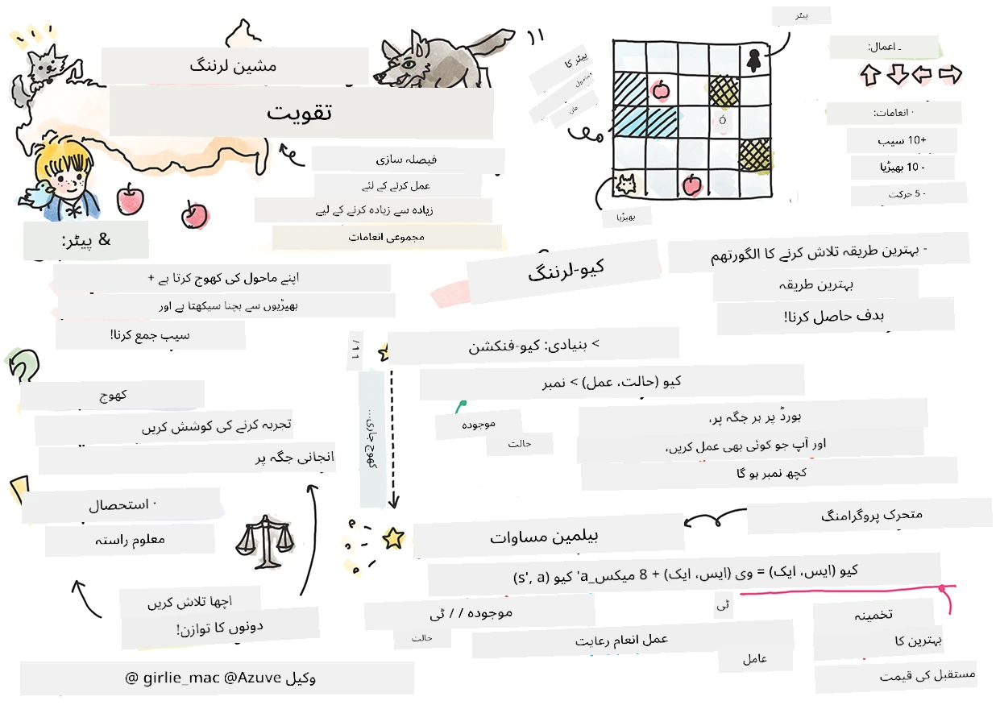
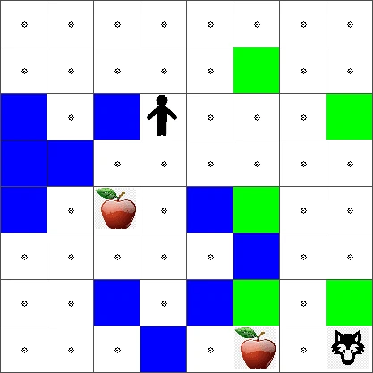
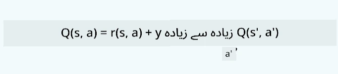

# ری انفورسمنٹ لرننگ اور کیو-لرننگ کا تعارف


> اسکیچ نوٹ بذریعہ [ٹومومی ایمورا](https://www.twitter.com/girlie_mac)

ری انفورسمنٹ لرننگ میں تین اہم تصورات شامل ہیں: ایجنٹ، کچھ اسٹیٹس، اور ہر اسٹیٹ کے لئے ایکشنز کا ایک مجموعہ۔ کسی مخصوص اسٹیٹ میں کسی ایکشن کو انجام دے کر، ایجنٹ کو انعام دیا جاتا ہے۔ دوبارہ کمپیوٹر گیم سپر ماریو کا تصور کریں۔ آپ ماریو ہیں، آپ ایک گیم لیول میں ہیں، ایک چٹان کے کنارے کھڑے ہیں۔ آپ کے اوپر ایک سکے ہیں۔ آپ، ماریو ہونے کے ناطے، گیم لیول میں، ایک مخصوص مقام پر ... یہ آپ کی حالت ہے۔ دائیں ایک قدم چلنا (ایکشن) آپ کو کنارے سے نیچے لے جائے گا، اور یہ آپ کو کم عددی سکور دے گا۔ لیکن اگر آپ جمپ بٹن دبائیں تو آپ ایک پوائنٹ حاصل کریں گے اور زندہ رہیں گے۔ یہ ایک مثبت نتیجہ ہے اور اس کو مثبت عددی سکور ملنا چاہئے۔

ری انفورسمنٹ لرننگ اور ایک سمولیٹر (گیم) استعمال کرکے، آپ سیکھ سکتے ہیں کہ گیم کیسے کھیلنا ہے تاکہ زیادہ سے زیادہ انعام حاصل کیا جا سکے جو زندہ رہنا اور زیادہ سے زیادہ پوائنٹس حاصل کرنا ہے۔

[](https://www.youtube.com/watch?v=lDq_en8RNOo)

> 🎥 اوپر تصویر پر کلک کریں تاکہ دمتری کو ری انفورسمنٹ لرننگ کے بارے میں بات کرتے سنا جا سکے

## [پری لیکچر کوئز](https://ff-quizzes.netlify.app/en/ml/)

## شرائط اور سیٹ اپ

اس سبق میں، ہم Python میں کچھ کوڈ کے ساتھ تجربہ کریں گے۔ آپ کو چاہئے کہ آپ اپنے کمپیوٹر یا کسی کلاؤڈ میں اس سبق کے Jupyter Notebook کوڈ کو چلا سکیں۔

آپ [سبق کا نوٹ بک](https://github.com/microsoft/ML-For-Beginners/blob/main/8-Reinforcement/1-QLearning/notebook.ipynb) کھول کر اس سبق کو فالو کر سکتے ہیں۔

> **نوٹ:** اگر آپ یہ کوڈ کلاؤڈ سے کھول رہے ہیں، تو آپ کو [`rlboard.py`](https://github.com/microsoft/ML-For-Beginners/blob/main/8-Reinforcement/1-QLearning/rlboard.py) فائل بھی حاصل کرنی ہوگی، جو نوٹ بک کوڈ میں استعمال ہوتی ہے۔ اسے نوٹ بک کے ساتھ اسی ڈائریکٹری میں رکھیں۔

## تعارف

اس سبق میں، ہم **[پیٹر اور بھیڑیا](https://en.wikipedia.org/wiki/Peter_and_the_Wolf)** کی دنیا کی تحقیق کریں گے، جو روسی موسیقار [سرگئی پروکوفیف](https://en.wikipedia.org/wiki/Sergei_Prokofiev) کی ایک موسیقی قصہ کہانی سے متاثر ہے۔ ہم **ری انفورسمنٹ لرننگ** استعمال کریں گے تاکہ پیٹر اپنے ماحول کو تلاش کرے، مزیدار سیب جمع کرے اور بھیڑیا سے بچ سکے۔

**ری انفورسمنٹ لرننگ** (RL) ایک ایسی تکنیک ہے جو ہمیں بہت سے تجربات کرکے ایک **ایجنٹ** کا ایک بہترین رویہ سیکھنے دیتی ہے ایک خاص **ماحول** میں۔ اس ماحول میں ایجنٹ کا کچھ **مقصد** ہونا چاہئے، جو ایک **ریوارڈ فنکشن** کے ذریعے بیان کیا جاتا ہے۔

## ماحول

آسانی کے لیے، آئیے پیٹر کی دنیا کو ایک مربع بورڈ سمجھیں جس کا سائز `width` x `height` ہو، جیسا کہ یہ:


اس بورڈ میں ہر خانہ درج ذیل ہو سکتا ہے:

* **زمین**، جس پر پیٹر اور دوسری مخلوق چل سکتے ہیں۔
* **پانی**، جس پر آپ واضح طور پر نہیں چل سکتے۔
* ایک **درخت** یا **گھاس**، جہاں آپ آرام کر سکتے ہیں۔
* ایک **سیب**، جو کچھ ایسا ہے جسے پیٹر خوشی خوشی تلاش کرے گا تاکہ خود کو کھلا سکے۔
* ایک **بھیڑیا**، جو خطرناک ہے اور اجتناب کرنا چاہئے۔

ایک علیحدہ Python ماڈیول، [`rlboard.py`](https://github.com/microsoft/ML-For-Beginners/blob/main/8-Reinforcement/1-QLearning/rlboard.py)، موجود ہے جو اس ماحول کے ساتھ کام کرنے کا کوڈ رکھتا ہے۔ چونکہ یہ کوڈ ہمارے تصورات کو سمجھنے کے لیے ضروری نہیں، ہم اسے امپورٹ کریں گے اور اس کا استعمال کرتے ہوئے نمونہ بورڈ بنائیں گے (کوڈ بلاک 1):

```python
from rlboard import *

width, height = 8,8
m = Board(width,height)
m.randomize(seed=13)
m.plot()
```

یہ کوڈ ماحول کی اس تصویر کو پرنٹ کرے گا جو اوپر دی گئی تصویر جیسی ہوگی۔

## ایکشنز اور پالیسی

ہمارے مثال میں، پیٹر کا مقصد سیب تلاش کرنا ہوگا، جبکہ بھیڑیا اور دوسری رکاوٹوں سے بچنا ہوگا۔ اس کے لیے، وہ بنیادی طور پر چل سکتا ہے یہاں تک کہ سیب مل جائے۔

اس لیے، کسی بھی مقام پر، وہ درج ذیل ایکشنز میں سے کوئی منتخب کر سکتا ہے: اوپر، نیچے، بائیں اور دائیں۔

ہم ان ایکشنز کو ایک ڈکشنری کی صورت میں بیان کریں گے، اور انہیں متعلقہ کوآرڈینیٹ تبدیلیوں کے جوڑوں سے میپ کریں گے۔ مثلاً، دائیں جانا (`R`) جوڑا `(1,0)` ہوگا۔ (کوڈ بلاک 2):

```python
actions = { "U" : (0,-1), "D" : (0,1), "L" : (-1,0), "R" : (1,0) }
action_idx = { a : i for i,a in enumerate(actions.keys()) }
```

خلاصہ کے طور پر، اس منظرنامے کی حکمت عملی اور مقصد درج ذیل ہیں:

- **حکمت عملی**, ہمارے ایجنٹ (پیٹر) کی وہ ہے جسے ایک **پالیسی** کہتے ہیں۔ پالیسی ایک فنکشن ہے جو کسی بھی حالت پر ایکشن واپس دیتی ہے۔ ہمارے معاملے میں، مسئلہ کی حالت بورڈ کی نمائندگی کرتی ہے، جس میں کھلاڑی کی موجودہ جگہ بھی شامل ہے۔

- **مقصد**, ری انفورسمنٹ لرننگ کا آخرکار ایک اچھی پالیسی سیکھنا ہے جو مسئلہ کو مؤثر طریقے سے حل کرے۔ تاہم، ابتدائی طور پر، ہم سب سے سادہ پالیسی یعنی **رینڈم واک** کو مد نظر رکھیں گے۔

## رینڈم واک

آئیے پہلے ہمارا مسئلہ رینڈم واک حکمت عملی سے حل کریں۔ رینڈم واک میں، ہم اجازت شدہ ایکشنز میں سے اگلا ایکشن اتفاقی طور پر منتخب کریں گے، یہاں تک کہ ہمیں سیب مل جائے (کوڈ بلاک 3)۔

1۔ ذیل میں کوڈ کے ساتھ رینڈم واک نافذ کریں:

    ```python
    def random_policy(m):
        return random.choice(list(actions))
    
    def walk(m,policy,start_position=None):
        n = 0 # قدموں کی تعداد
        # ابتدائی مقام مقرر کریں
        if start_position:
            m.human = start_position 
        else:
            m.random_start()
        while True:
            if m.at() == Board.Cell.apple:
                return n # کامیابی!
            if m.at() in [Board.Cell.wolf, Board.Cell.water]:
                return -1 # بھیڑیا نے کھا لیا یا ڈوب گئے
            while True:
                a = actions[policy(m)]
                new_pos = m.move_pos(m.human,a)
                if m.is_valid(new_pos) and m.at(new_pos)!=Board.Cell.water:
                    m.move(a) # اصل حرکت کریں
                    break
            n+=1
    
    walk(m,random_policy)
    ```

    `walk` کال کو اس مربوط راستے کی لمبائی واپس دینی چاہیے، جو ایک دوڑ سے دوسری دوڑ میں مختلف ہو سکتی ہے۔

1۔ واک تجربہ کئی بار (مثلاً 100 بار) چلائیں اور نتیجہ کے اعداد و شمار پرنٹ کریں (کوڈ بلاک 4):

    ```python
    def print_statistics(policy):
        s,w,n = 0,0,0
        for _ in range(100):
            z = walk(m,policy)
            if z<0:
                w+=1
            else:
                s += z
                n += 1
        print(f"Average path length = {s/n}, eaten by wolf: {w} times")
    
    print_statistics(random_policy)
    ```

    نوٹ کریں کہ وسطی راستے کی لمبائی تقریباً 30-40 قدم ہے، جو کہ کافی زیادہ ہے، جبکہ قریب ترین سیب کی اوسط دوری تقریباً 5-6 قدم ہے۔

    آپ پیٹر کی حرکت بھی دیکھ سکتے ہیں رینڈم واک کے دوران:

    

## ریوارڈ فنکشن

اپنی پالیسی کو زیادہ ذہین بنانے کے لیے، ہمیں یہ سمجھنا ہوگا کہ کون سی حرکت "بہتر" ہے۔ اس کے لیے ہمیں اپنا مقصد تعریف کرنا ہوگا۔

مقصد کو ایک **ریوارڈ فنکشن** کی صورت میں بیان کیا جا سکتا ہے، جو ہر حالت کے لیے کچھ اسکور کی قیمت واپس کرے گا۔ جتنا نمبر زیادہ ہوگا، ریوارڈ فنکشن اتنا ہی بہتر ہوگا۔ (کوڈ بلاک 5)

```python
move_reward = -0.1
goal_reward = 10
end_reward = -10

def reward(m,pos=None):
    pos = pos or m.human
    if not m.is_valid(pos):
        return end_reward
    x = m.at(pos)
    if x==Board.Cell.water or x == Board.Cell.wolf:
        return end_reward
    if x==Board.Cell.apple:
        return goal_reward
    return move_reward
```

ریوارڈ فنکشنز کی ایک دلچسپ بات یہ ہے کہ زیادہ تر صورتوں میں، *ہمیں صرف گیم کے آخر میں اہم انعام دیا جاتا ہے*۔ اس کا مطلب ہے کہ ہمارا الگورتھم "اچھے" قدم یاد رکھے جو کہ آخر میں مثبت انعام کی طرف لے جاتے ہیں، اور ان کی اہمیت بڑھائے۔ اسی طرح، تمام حرکتیں جو منفی نتائج کی طرف لے جائیں، انہیں مایوس کرنا چاہیے۔

## کیو-لرننگ

جو الگورتھم ہم یہاں بحث کریں گے اسے **کیو-لرننگ** کہا جاتا ہے۔ اس الگورتھم میں، پالیسی ایک فنکشن (یا ڈیٹا ڈھانچہ) کے ذریعے بیان کی جاتی ہے جسے **Q-Table** کہتے ہیں۔ یہ کسی دی گئی حالت میں ہر ایکشن کی "اچھی خاصیت" کو ریکارڈ کرتا ہے۔

اسے Q-Table اس لیے کہتے ہیں کیونکہ اسے عام طور پر ایک ٹیبل یا کثیر جہتی ارے کے طور پر ظاہر کرنا آسان ہوتا ہے۔ کیونکہ ہمارا بورڈ `width` x `height` کے ابعاد رکھتا ہے، ہم کیو ٹیبل کو numpy ارے کے ذریعے ظاہر کر سکتے ہیں جس کا سائز `width` x `height` x `len(actions)` ہو: (کوڈ بلاک 6)

```python
Q = np.ones((width,height,len(actions)),dtype=np.float)*1.0/len(actions)
```

نوٹ کریں کہ ہم کیو ٹیبل کی تمام قدریں ایک جیسی قیمت سے شروع کرتے ہیں، ہمارے معاملے میں 0.25۔ یہ "رینڈم واک" پالیسی کے مطابق ہے، کیونکہ ہر حالت میں تمام حرکتیں برابر اچھی ہیں۔ ہم Q-Table کو `plot` فنکشن میں دے سکتے ہیں تاکہ بورڈ پر ٹیبل کو بصری شکل میں دکھایا جا سکے: `m.plot(Q)`.



ہر سیل کے مرکز میں ایک "تیرأ" ہوتا ہے جو پسندیدہ سمت کی نشاندہی کرتا ہے۔ چونکہ تمام سمتیں برابر ہیں، ایک نقطہ دکھایا جاتا ہے۔

اب ہمیں سمولیشن چلانی ہے، اپنے ماحول کو دریافت کرنا ہے، اور کیو ٹیبل کی قدروں کی بہتر تقسیم سیکھنی ہے، جو ہمیں سیب تک پہنچنے کے راستے کو بہت تیز تر ڈھونڈنے میں مدد دے گی۔

## کیو-لرننگ کا جوہر: بیل مین مساوات

جب ہم حرکت شروع کرتے ہیں، ہر ایکشن کا ایک متعلقہ انعام ہوگا، یعنی ہم تھیوریٹیکل طور پر اگلے ایکشن کو فوری سب سے زیادہ انعام کی بنیاد پر منتخب کر سکتے ہیں۔ تاہم، زیادہ تر حالتوں میں، حرکت ہمارا سیب تک پہنچنے کا مقصد حاصل نہیں کرے گی، لہٰذا ہم فوراً فیصلہ نہیں کر سکتے کہ کون سی سمت بہتر ہے۔

> یاد رکھیں کہ فوری نتیجہ اہم نہیں، بلکہ حتمی نتیجہ ہے جو ہم سمولیشن کے آخر میں حاصل کریں گے۔

اس مؤخر انعام کو حساب میں لانے کے لیے، ہمیں **[ڈائنامک پروگرامنگ](https://en.wikipedia.org/wiki/Dynamic_programming)** کے اصولوں کا استعمال کرنا ہوگا، جو ہمیں مسئلہ کو واپس لچکیلے طریقے سے سوچنے دیتے ہیں۔

فرض کریں کہ ہم اب حالت *s* میں ہیں، اور اگلی حالت *s'* پر جانا چاہتے ہیں۔ ایسا کرنے پر، ہمیں فوری انعام *r(s,a)* ملے گا، جو ریوارڈ فنکشن سے متعین ہوتا ہے، نیز کچھ مستقبل کا انعام بھی۔ اگر ہم فرض کریں کہ ہمارا Q-Table ہر ایکشن کی "دلکشی" کو صحیح طریقے سے ظاہر کرتا ہے، تو حالت *s'* پر ہم ایکشن *a* منتخب کریں گے جو زیادہ سے زیادہ *Q(s',a')* کی قیمت دیتا ہے۔ یوں، حالت *s* پر ممکنہ بہترین مستقبل کا انعام `max`<sub>a'</sub>*Q(s',a')* ہوگا (یہاں زیادہ سے زیادہ تمام ممکنہ ایکشنز *a'* پر حساب کی جاتی ہے جو حالت *s'* میں ہوسکتے ہیں)۔

یہ Q-Table کی قیمت کو حالت *s* اور ایکشن *a* کے لیے حساب کرنے کا **بیل مین فارمولہ** دیتا ہے:



یہاں γ وہ **ڈسکاؤنٹ فیکٹر** ہے جو یہ طے کرتا ہے کہ آپ کو موجودہ انعام کو مستقبل کے انعام کے مقابلے میں کتنا اہمیت دینی چاہیے اور بالعکس۔

## لرننگ الگورتھم

مذکورہ مساوات کی بنیاد پر، ہم اب اپنے سیکھنے والے الگورتھم کے لیے جعلی کوڈ لکھ سکتے ہیں:

* Q-Table Q کو تمام حالتوں اور ایکشنز کے لیے برابر نمبروں سے شروع کریں
* لرننگ ریٹ α ← 1 مقرر کریں
* سمولیشن کو کئی بار دہرائیں
   1. تصادفی مقام سے شروع کریں
   1. دہرائیں
        1. حالت *s* پر ایکشن *a* منتخب کریں
        2. ایکشن کو انجام دیں اور نئی حالت *s'* پر جائیں
        3. اگر کھیل ختم ہو گیا ہو یا کل انعام بہت کم ہو تو سمولیشن سے باہر نکلیں  
        4. نئی حالت پر انعام *r* معلوم کریں
        5. Q-فنکشن کو بیل مین مساوات کے مطابق اپ ڈیٹ کریں: *Q(s,a)* ← *(1-α)Q(s,a)+α(r+γ max<sub>a'</sub>Q(s',a'))*
        6. *s* ← *s'*
        7. کل انعام کو اپ ڈیٹ کریں اور α کو کم کریں۔

## استحصال بمقابلہ تلاش

اوپر دیے گئے الگورتھم میں، ہم نے واضح نہیں کیا کہ قدم 2.1 میں ایکشن کیسے منتخب کرنا ہے۔ اگر ہم ایکشن اتفاقی طور پر منتخب کریں تو ہم ماحول کو اتفاقی طور پر **تلاش** کر رہے ہوں گے، اور بہت ممکن ہے کہ ہم اکثر مر جائیں اور ایسی جگہوں کی تلاش کریں جہاں عام طور پر نہیں جاتے۔ دوسرا طریقہ یہ ہوگا کہ ہم پہلے سے معلوم شدہ کیو ٹیبل کی قدروں کو **استحصال** کریں، اور اس طرح حال *s* پر سب سے بہترین ایکشن منتخب کریں (جو کیو ٹیبل کی زیادہ قدر رکھتا ہو)۔ لیکن یہ ہمیں دوسری ریاستوں کی تلاش سے روکے گا، اور ہمیں ممکنہ طور پر بہترین حل نہ مل سکے گا۔

اسی لیے، بہترین طریقہ دریافت اور استحصال کے درمیان توازن قائم کرنا ہے۔ یہ کیا جا سکتا ہے اس طرح کہ حالت *s* پر ایکشن کو Q-Table کی قدروں کی متناسب احتمال کے مطابق منتخب کیا جائے۔ شروع میں، جب Q-Table کی قدریں سب برابر ہوں گی، تو یہ ایک اتفاقی انتخاب ہوگا، لیکن جب ہم ماحول کے بارے میں زیادہ سیکھیں گے، تو ہم بہتر راستے پر زیادہ امکان رکھیں گے اور ایجنٹ کو کبھی کبھار تحقیق کا موقع دیں گے۔

## Python نفاذ

اب ہم لرننگ الگورتھم کو نافذ کرنے کے لیے تیار ہیں۔ اس سے پہلے، ہمیں ایک فنکشن کی ضرورت ہے جو Q-Table میں موجود عشوائی اعداد کو متعلقہ ایکشنز کے لیے احتمال کے ویکٹر میں تبدیل کرے۔

1۔ ایک فنکشن `probs()` بنائیں:

    ```python
    def probs(v,eps=1e-4):
        v = v-v.min()+eps
        v = v/v.sum()
        return v
    ```

    ہم اصل ویکٹر میں کچھ `eps` شامل کرتے ہیں تاکہ شروع میں صفر سے تقسیم سے بچا جا سکے، جب ویکٹر کے تمام اجزاء یکساں ہوں۔

اس الگورتھم کو 5000 تجربات، جنہیں **ایپاکس** بھی کہتے ہیں، کے ذریعے چلائیں: (کوڈ بلاک 8)
```python
    for epoch in range(5000):
    
        # ابتدائی نقطہ منتخب کریں
        m.random_start()
        
        # سفر شروع کریں
        n=0
        cum_reward = 0
        while True:
            x,y = m.human
            v = probs(Q[x,y])
            a = random.choices(list(actions),weights=v)[0]
            dpos = actions[a]
            m.move(dpos,check_correctness=False) # ہم کھلاڑی کو بورڈ کے باہر جانے کی اجازت دیتے ہیں، جو قسط کو ختم کر دیتا ہے
            r = reward(m)
            cum_reward += r
            if r==end_reward or cum_reward < -1000:
                lpath.append(n)
                break
            alpha = np.exp(-n / 10e5)
            gamma = 0.5
            ai = action_idx[a]
            Q[x,y,ai] = (1 - alpha) * Q[x,y,ai] + alpha * (r + gamma * Q[x+dpos[0], y+dpos[1]].max())
            n+=1
```

اس الگورتھم کو چلانے کے بعد، Q-Table ایسی قدروں کے ساتھ اپ ڈیٹ ہو جائے گی جو ہر قدم پر مختلف ایکشنز کی دلکشی کو بیان کریں گی۔ ہم Q-Table کو اس طرح بصری شکل دے سکتے ہیں کہ ہر سیل میں حرکت کی مطلوبہ سمت کی نشاندہی کرنے والا ویکٹر کھینچا جائے۔ آسانی کے لئے، ہم تیر کی جگہ ایک چھوٹا دائرہ ڈالتے ہیں۔


## پالیسی کی جانچ

چونکہ Q-Table ہر حالت میں ہر ایکشن کی "دلکشی" کو ظاہر کرتی ہے، اسے اپنے دنیا میں مؤثر نیویگیشن کے لیے استعمال کرنا آسان ہے۔ سب سے سادہ صورت میں، ہم سب سے زیادہ Q-Table قیمت والے ایکشن کو منتخب کر سکتے ہیں: (کوڈ بلاک 9)

```python
def qpolicy_strict(m):
        x,y = m.human
        v = probs(Q[x,y])
        a = list(actions)[np.argmax(v)]
        return a

walk(m,qpolicy_strict)
```


> اگر آپ اوپر دیا گیا کوڈ کئی بار آزمائیں تو آپ نوٹس کر سکتے ہیں کہ کبھی کبھار یہ "فریز" ہو جاتا ہے، اور آپ کو اسے روکنے کے لیے نوٹ بک میں STOP بٹن دبانا پڑتا ہے۔ ایسا اس لیے ہوتا ہے کیونکہ بعض اوقات دو ریاستیں آپس میں Q-Value کے اعتبار سے "ایک دوسرے کی طرف اشارہ" کر رہی ہوتی ہیں، جس صورت میں ایجنٹ ان ریاستوں کے درمیان لا محدود حرکت کرتا رہتا ہے۔

## 🚀چیلنج

> **ٹاسک 1:** `walk` فنکشن کو اس طرح تبدیل کریں کہ راستے کی زیادہ سے زیادہ لمبائی کو کسی مخصوص قدموں کی تعداد (مثلاً 100) تک محدود کرے، اور اوپر دیا گیا کوڈ وقتاً فوقتاً اس قدر کو واپس لوٹے۔

> **ٹاسک 2:** `walk` فنکشن کو اس طرح تبدیل کریں کہ یہ اُن جگہوں پر واپس نہ جائے جہاں یہ پہلے ہی جا چکا ہو۔ اس سے `walk` کے لوپ میں پھنسنے سے بچاؤ ہوگا، تاہم، ایجنٹ پھر بھی کسی ایسی جگہ پھنس سکتا ہے جہاں سے نکلنا ممکن نہ ہو۔

## نیویگیشن

ایک بہتر نیویگیشن پالیسی وہ ہوگی جو ہم نے تربیت کے دوران استعمال کی، جو exploitation اور exploration کو یکجا کرتی ہے۔ اس پالیسی میں، ہم ہر عمل کو مخصوص احتمال کے ساتھ منتخب کریں گے، جو Q-Table میں موجود قدروں کے متناسب ہو۔ اس حکمت عملی کے باوجود ایجنٹ اکثر اپنی پہلے کی دریافت کی ہوئی جگہوں پر واپس آ سکتا ہے، لیکن جیسا کہ نیچے کوڈ سے آپ دیکھ سکتے ہیں، یہ مطلوبہ مقام تک بہت کم اوسط راستہ فراہم کرتی ہے (یاد رہے کہ `print_statistics` 100 بار سمولیشن چلاتا ہے): (کوڈ بلاک 10)

```python
def qpolicy(m):
        x,y = m.human
        v = probs(Q[x,y])
        a = random.choices(list(actions),weights=v)[0]
        return a

print_statistics(qpolicy)
```

اس کوڈ کو چلانے کے بعد، آپ کو پہلے کے مقابلے میں کہیں کم اوسط راستہ ملے گا، تقریباً 3-6 قدموں کے درمیان۔

## سیکھنے کے عمل کی تحقیقات

جیسا کہ ہم نے ذکر کیا ہے، سیکھنے کا عمل exploration اور حاصل کردہ معلومات کی exploitation کے درمیان توازن ہے۔ ہم نے دیکھا ہے کہ سیکھنے کے نتائج (ایجنٹ کو مقصد تک مختصر راستہ تلاش کرنے کی صلاحیت) میں بہتری آئی ہے، لیکن یہ دیکھنا بھی دلچسپ ہے کہ سیکھنے کے دوران اوسط راستے کی لمبائی کیسے برتاؤ کرتی ہے:


سیکھنے کو یوں سمری کیا جا سکتا ہے:

- **اوسط راستے کی لمبائی بڑھتی ہے۔** یہاں ہم دیکھتے ہیں کہ ابتدا میں اوسط راستے کی لمبائی بڑھتی ہے۔ یہ اس لیے ہو سکتا ہے کیونکہ جب ہمیں ماحول کے بارے میں کچھ معلوم نہیں ہوتا، تو ہم اکثر خراب حالتوں، پانی یا بھیڑیا میں پھنس جاتے ہیں۔ جیسے جیسے ہم زیادہ سیکھتے ہیں اور اس معلومات کو استعمال کرنا شروع کرتے ہیں، ہم طویل وقت تک ماحول کی سیر کر سکتے ہیں، لیکن ہمیں اب بھی سیبوں کی جگہ کا مکمل علم نہیں ہوتا۔

- **جیسے جیسے ہم زیادہ سیکھتے ہیں، راستے کی لمبائی کم ہوتی ہے۔** جب ہم کافی سیکھ لیتے ہیں، تو ایجنٹ کے لیے مقصد حاصل کرنا آسان ہو جاتا ہے، اور راستے کی لمبائی گھٹنا شروع ہو جاتی ہے۔ البتہ، ہم اب بھی exploration کے لیے کھلے ہیں، اس لیے ہم اکثر بہترین راستے سے ہٹ کر نئی راہیں دریافت کرتے ہیں، جس سے راستہ مثالی سے لمبا ہو جاتا ہے۔

- **لمبائی اچانک بڑھ جاتی ہے۔** اس گراف میں ہم یہ بھی دیکھتے ہیں کہ ایک موقع پر لمبائی اچانک بڑھ گئی۔ یہ عمل کی تصادفی نوعیت کو ظاہر کرتا ہے، اور یہ کہ ہم کسی وقت Q-Table کے کوایفیشینٹس کو نئے قدروں سے اووررائٹ کر کے "خراب" کر سکتے ہیں۔ یہ مثالی طور پر لرننگ ریٹ کو کم کر کے کم کیا جانا چاہیے (مثلاً، تربیت کے آخر میں ہم Q-Table کی قدروں کو صرف معمولی مقدار سے ایڈجسٹ کرتے ہیں)۔

مجموعی طور پر، یہ یاد رکھنا ضروری ہے کہ سیکھنے کے عمل کی کامیابی اور معیار کا انحصار خاص طور پر ایسے پیرامیٹرز پر ہوتا ہے، جیسے لرننگ ریٹ، لرننگ ریٹ کی کمی، اور ڈسکاؤنٹ فیکٹر۔ انہیں اکثر **ہائپرپیرامیٹرز** کہا جاتا ہے، تاکہ انہیں **پیرامیٹرز** سے الگ کیا جا سکے جنہیں ہم تربیت کے دوران بہتر بناتے ہیں (جیسے، Q-Table کے کوایفیشینٹس)۔ بہترین ہائپرپیرامیٹر ویلیوز تلاش کرنے کے عمل کو **ہائپرپیرامیٹر آپٹیمائزیشن** کہا جاتا ہے، اور یہ ایک الگ موضوع کا مستحق ہے۔

## [لیکچر کے بعد کا کوئز](https://ff-quizzes.netlify.app/en/ml/)

## اسائنمنٹ
[ایک زیادہ حقیقت پسندانہ دنیا](assignment.md)

---

<!-- CO-OP TRANSLATOR DISCLAIMER START -->
**ڈس کلیمر**:
یہ دستاویز AI ترجمہ سروس [Co-op Translator](https://github.com/Azure/co-op-translator) کے ذریعے ترجمہ کی گئی ہے۔ جبکہ ہم درستگی کے لیے کوشاں ہیں، براہ کرم اس بات سے آگاہ رہیں کہ خودکار ترجمے میں غلطیاں یا عدم درستیاں ہو سکتی ہیں۔ اصل دستاویز اپنے مادری زبان میں مستند ماخذ سمجھی جائے گی۔ حساس معلومات کے لیے پیشہ ور انسانی ترجمہ کی سفارش کی جاتی ہے۔ اس ترجمے کے استعمال سے پیدا ہونے والی کسی بھی غلط فہمی یا غلط تشریح کی ذمہ داری ہم قبول نہیں کرتے۔
<!-- CO-OP TRANSLATOR DISCLAIMER END -->