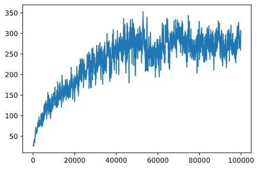

<!--
CO_OP_TRANSLATOR_METADATA:
{
  "original_hash": "9660fbd80845c59c15715cb418cd6e23",
  "translation_date": "2025-08-29T14:16:11+00:00",
  "source_file": "8-Reinforcement/2-Gym/README.md",
  "language_code": "ur"
}
-->
## ضروریات

اس سبق میں، ہم ایک لائبریری **OpenAI Gym** استعمال کریں گے تاکہ مختلف **ماحول** کی تخلیق کی جا سکے۔ آپ اس سبق کا کوڈ مقامی طور پر (جیسے Visual Studio Code سے) چلا سکتے ہیں، جس صورت میں سیمولیشن ایک نئی ونڈو میں کھلے گی۔ آن لائن کوڈ چلانے کی صورت میں، آپ کو کوڈ میں کچھ تبدیلیاں کرنی پڑ سکتی ہیں، جیسا کہ [یہاں](https://towardsdatascience.com/rendering-openai-gym-envs-on-binder-and-google-colab-536f99391cc7) بیان کیا گیا ہے۔

## OpenAI Gym

پچھلے سبق میں، کھیل کے قواعد اور حالت `Board` کلاس کے ذریعے دی گئی تھی، جسے ہم نے خود بنایا تھا۔ یہاں ہم ایک خاص **سیمولیشن ماحول** استعمال کریں گے، جو بیلنسنگ پول کے پیچھے فزکس کو سیمولیٹ کرے گا۔ ریئنفورسمنٹ لرننگ الگوریتھم کی تربیت کے لیے سب سے مشہور سیمولیشن ماحول کو [Gym](https://gym.openai.com/) کہا جاتا ہے، جو [OpenAI](https://openai.com/) کے ذریعے برقرار رکھا جاتا ہے۔ اس جم کا استعمال کرتے ہوئے ہم مختلف **ماحول** بنا سکتے ہیں، جیسے کہ کارٹ پول سیمولیشن یا اٹاری گیمز۔

> **نوٹ**: آپ OpenAI Gym کے دیگر دستیاب ماحول [یہاں](https://gym.openai.com/envs/#classic_control) دیکھ سکتے ہیں۔

سب سے پہلے، جم انسٹال کریں اور مطلوبہ لائبریریاں درآمد کریں (کوڈ بلاک 1):

```python
import sys
!{sys.executable} -m pip install gym 

import gym
import matplotlib.pyplot as plt
import numpy as np
import random
```

## مشق - کارٹ پول ماحول کو انیشیئلائز کریں

کارٹ پول بیلنسنگ مسئلے پر کام کرنے کے لیے، ہمیں متعلقہ ماحول کو انیشیئلائز کرنے کی ضرورت ہے۔ ہر ماحول کے ساتھ منسلک ہوتا ہے:

- **Observation space** جو اس معلومات کی ساخت کو بیان کرتا ہے جو ہمیں ماحول سے موصول ہوتی ہے۔ کارٹ پول مسئلے کے لیے، ہمیں پول کی پوزیشن، رفتار اور کچھ دیگر اقدار موصول ہوتی ہیں۔

- **Action space** جو ممکنہ اعمال کو بیان کرتا ہے۔ ہمارے معاملے میں ایکشن اسپیس ڈسکریٹ ہے، اور دو اعمال پر مشتمل ہے - **بائیں** اور **دائیں**۔ (کوڈ بلاک 2)

1. انیشیئلائز کرنے کے لیے، درج ذیل کوڈ لکھیں:

    ```python
    env = gym.make("CartPole-v1")
    print(env.action_space)
    print(env.observation_space)
    print(env.action_space.sample())
    ```

ماحول کیسے کام کرتا ہے یہ دیکھنے کے لیے، آئیے 100 قدموں کے لیے ایک مختصر سیمولیشن چلائیں۔ ہر قدم پر، ہم ایک عمل فراہم کرتے ہیں جو لیا جائے گا - اس سیمولیشن میں ہم صرف `action_space` سے ایک عمل کو بے ترتیب طور پر منتخب کرتے ہیں۔

1. نیچے دیے گئے کوڈ کو چلائیں اور دیکھیں کہ اس کا نتیجہ کیا نکلتا ہے۔

    ✅ یاد رکھیں کہ یہ کوڈ مقامی Python انسٹالیشن پر چلانا ترجیح دی جاتی ہے! (کوڈ بلاک 3)

    ```python
    env.reset()
    
    for i in range(100):
       env.render()
       env.step(env.action_space.sample())
    env.close()
    ```

    آپ کو کچھ اس طرح کی تصویر نظر آنی چاہیے:

    

1. سیمولیشن کے دوران، ہمیں مشاہدات حاصل کرنے کی ضرورت ہوتی ہے تاکہ فیصلہ کیا جا سکے کہ کیا عمل کرنا ہے۔ درحقیقت، `step` فنکشن موجودہ مشاہدات، ایک انعامی فنکشن، اور `done` فلیگ واپس کرتا ہے جو یہ ظاہر کرتا ہے کہ آیا سیمولیشن جاری رکھنا مناسب ہے یا نہیں: (کوڈ بلاک 4)

    ```python
    env.reset()
    
    done = False
    while not done:
       env.render()
       obs, rew, done, info = env.step(env.action_space.sample())
       print(f"{obs} -> {rew}")
    env.close()
    ```

    آپ کو نوٹ بک آؤٹ پٹ میں کچھ اس طرح نظر آئے گا:

    ```text
    [ 0.03403272 -0.24301182  0.02669811  0.2895829 ] -> 1.0
    [ 0.02917248 -0.04828055  0.03248977  0.00543839] -> 1.0
    [ 0.02820687  0.14636075  0.03259854 -0.27681916] -> 1.0
    [ 0.03113408  0.34100283  0.02706215 -0.55904489] -> 1.0
    [ 0.03795414  0.53573468  0.01588125 -0.84308041] -> 1.0
    ...
    [ 0.17299878  0.15868546 -0.20754175 -0.55975453] -> 1.0
    [ 0.17617249  0.35602306 -0.21873684 -0.90998894] -> 1.0
    ```

    سیمولیشن کے ہر قدم پر واپس آنے والا مشاہداتی ویکٹر درج ذیل اقدار پر مشتمل ہوتا ہے:
    - کارٹ کی پوزیشن
    - کارٹ کی رفتار
    - پول کا زاویہ
    - پول کی گردش کی شرح

1. ان نمبروں کی کم سے کم اور زیادہ سے زیادہ قدر حاصل کریں: (کوڈ بلاک 5)

    ```python
    print(env.observation_space.low)
    print(env.observation_space.high)
    ```

    آپ یہ بھی نوٹ کر سکتے ہیں کہ ہر سیمولیشن قدم پر انعام کی قدر ہمیشہ 1 ہوتی ہے۔ اس کی وجہ یہ ہے کہ ہمارا مقصد زیادہ سے زیادہ وقت تک زندہ رہنا ہے، یعنی پول کو ایک معقول عمودی پوزیشن میں زیادہ سے زیادہ وقت تک رکھنا۔

    ✅ درحقیقت، کارٹ پول سیمولیشن کو حل شدہ سمجھا جاتا ہے اگر ہم 100 مسلسل آزمائشوں میں اوسط انعام 195 حاصل کرنے میں کامیاب ہو جائیں۔

## حالت کی ڈسکریٹائزیشن

Q-Learning میں، ہمیں Q-Table بنانا ہوتا ہے جو ہر حالت میں کیا کرنا ہے اس کی وضاحت کرتا ہے۔ ایسا کرنے کے لیے، ہمیں حالت کو **ڈسکریٹ** بنانا ہوتا ہے، زیادہ درست طور پر، اس میں محدود تعداد میں ڈسکریٹ اقدار ہونی چاہئیں۔ لہذا، ہمیں کسی طرح اپنے مشاہدات کو **ڈسکریٹائز** کرنا ہوگا، انہیں محدود سیٹ آف اسٹیٹس میں میپ کرنا ہوگا۔

اس کے لیے چند طریقے ہیں:

- **Bins میں تقسیم کریں**۔ اگر ہمیں کسی خاص قدر کے وقفے کا علم ہو، تو ہم اس وقفے کو **bins** کی تعداد میں تقسیم کر سکتے ہیں، اور پھر قدر کو اس bin نمبر سے بدل سکتے ہیں جس سے یہ تعلق رکھتا ہے۔ یہ numpy کے [`digitize`](https://numpy.org/doc/stable/reference/generated/numpy.digitize.html) طریقہ استعمال کرتے ہوئے کیا جا سکتا ہے۔ اس صورت میں، ہم حالت کے سائز کو بالکل جان لیں گے، کیونکہ یہ ڈیجیٹلائزیشن کے لیے منتخب کردہ bins کی تعداد پر منحصر ہوگا۔

✅ ہم لکیری انٹرپولیشن استعمال کر سکتے ہیں تاکہ اقدار کو کسی محدود وقفے (مثلاً، -20 سے 20 تک) میں لایا جا سکے، اور پھر نمبروں کو گول کر کے انٹیجرز میں تبدیل کر سکتے ہیں۔ اس سے حالت کے سائز پر ہمارا کنٹرول کم ہو جاتا ہے، خاص طور پر اگر ہمیں ان پٹ اقدار کی بالکل حد معلوم نہ ہو۔ مثال کے طور پر، ہمارے معاملے میں 4 میں سے 2 اقدار کی اوپر/نیچے کی حد نہیں ہے، جو حالتوں کی لامحدود تعداد کا نتیجہ دے سکتی ہے۔

ہمارے مثال میں، ہم دوسرے طریقے کے ساتھ جائیں گے۔ جیسا کہ آپ بعد میں نوٹ کریں گے، غیر متعین اوپر/نیچے کی حدود کے باوجود، وہ اقدار شاذ و نادر ہی کچھ محدود وقفوں سے باہر لے جاتی ہیں، لہذا وہ حالتیں جن کی انتہائی اقدار ہوں گی بہت کم ہوں گی۔

1. یہاں وہ فنکشن ہے جو ہمارے ماڈل سے مشاہدہ لے گا اور 4 انٹیجر اقدار کے ایک tuple تیار کرے گا: (کوڈ بلاک 6)

    ```python
    def discretize(x):
        return tuple((x/np.array([0.25, 0.25, 0.01, 0.1])).astype(np.int))
    ```

1. آئیے bins استعمال کرتے ہوئے ایک اور ڈسکریٹائزیشن طریقہ بھی دریافت کریں: (کوڈ بلاک 7)

    ```python
    def create_bins(i,num):
        return np.arange(num+1)*(i[1]-i[0])/num+i[0]
    
    print("Sample bins for interval (-5,5) with 10 bins\n",create_bins((-5,5),10))
    
    ints = [(-5,5),(-2,2),(-0.5,0.5),(-2,2)] # intervals of values for each parameter
    nbins = [20,20,10,10] # number of bins for each parameter
    bins = [create_bins(ints[i],nbins[i]) for i in range(4)]
    
    def discretize_bins(x):
        return tuple(np.digitize(x[i],bins[i]) for i in range(4))
    ```

1. اب ایک مختصر سیمولیشن چلائیں اور ان ڈسکریٹ ماحول کی اقدار کا مشاہدہ کریں۔ دونوں `discretize` اور `discretize_bins` آزمانے کے لیے آزاد محسوس کریں اور دیکھیں کہ کیا فرق ہے۔

    ✅ `discretize_bins` bin نمبر واپس کرتا ہے، جو 0-based ہوتا ہے۔ لہذا ان پٹ متغیر کی اقدار کے ارد گرد 0 کے لیے یہ وقفے کے وسط سے نمبر واپس کرتا ہے (10)۔ `discretize` میں، ہم نے آؤٹ پٹ اقدار کی حد کے بارے میں پرواہ نہیں کی، انہیں منفی ہونے کی اجازت دی، لہذا حالت کی اقدار شفٹ نہیں ہوتی، اور 0 0 کے مطابق ہوتا ہے۔ (کوڈ بلاک 8)

    ```python
    env.reset()
    
    done = False
    while not done:
       #env.render()
       obs, rew, done, info = env.step(env.action_space.sample())
       #print(discretize_bins(obs))
       print(discretize(obs))
    env.close()
    ```

    ✅ اگر آپ ماحول کے عمل کو دیکھنا چاہتے ہیں تو env.render سے شروع ہونے والی لائن کو ان کمنٹ کریں۔ بصورت دیگر آپ اسے پس منظر میں چلا سکتے ہیں، جو تیز ہے۔ ہم اپنے Q-Learning عمل کے دوران اس "غیر مرئی" عمل کو استعمال کریں گے۔

## Q-Table کی ساخت

پچھلے سبق میں، حالت 0 سے 8 تک کے نمبروں کے ایک سادہ جوڑے تھی، اور اس لیے Q-Table کو numpy tensor کے ذریعے 8x8x2 کے شکل میں ظاہر کرنا آسان تھا۔ اگر ہم bins ڈسکریٹائزیشن استعمال کرتے ہیں، تو ہمارے حالت ویکٹر کا سائز بھی معلوم ہے، لہذا ہم وہی طریقہ استعمال کر سکتے ہیں اور حالت کو 20x20x10x10x2 کے شکل کے array کے ذریعے ظاہر کر سکتے ہیں (یہاں 2 ایکشن اسپیس کا dimension ہے، اور پہلی dimensions ان پیرامیٹرز کے لیے منتخب کردہ bins کی تعداد کے مطابق ہیں جو observation space میں ہیں)۔

تاہم، کبھی کبھی observation space کے درست dimensions معلوم نہیں ہوتے۔ `discretize` فنکشن کے معاملے میں، ہم کبھی بھی یقین سے نہیں کہہ سکتے کہ ہماری حالت کچھ حدود کے اندر رہتی ہے، کیونکہ کچھ اصل اقدار محدود نہیں ہیں۔ لہذا، ہم تھوڑا مختلف طریقہ استعمال کریں گے اور Q-Table کو ایک dictionary کے ذریعے ظاہر کریں گے۔

1. *(state,action)* جوڑے کو dictionary key کے طور پر استعمال کریں، اور قدر Q-Table انٹری ویلیو کے مطابق ہوگی۔ (کوڈ بلاک 9)

    ```python
    Q = {}
    actions = (0,1)
    
    def qvalues(state):
        return [Q.get((state,a),0) for a in actions]
    ```

    یہاں ہم ایک فنکشن `qvalues()` بھی بیان کرتے ہیں، جو دی گئی حالت کے لیے Q-Table کی اقدار کی فہرست واپس کرتا ہے جو تمام ممکنہ اعمال کے مطابق ہوتی ہے۔ اگر Q-Table میں انٹری موجود نہیں ہے، تو ہم ڈیفالٹ کے طور پر 0 واپس کریں گے۔

## آئیے Q-Learning شروع کریں

اب ہم پیٹر کو بیلنس سکھانے کے لیے تیار ہیں!

1. سب سے پہلے، کچھ hyperparameters سیٹ کریں: (کوڈ بلاک 10)

    ```python
    # hyperparameters
    alpha = 0.3
    gamma = 0.9
    epsilon = 0.90
    ```

    یہاں، `alpha` **learning rate** ہے جو یہ طے کرتا ہے کہ ہمیں Q-Table کی موجودہ اقدار کو ہر قدم پر کس حد تک ایڈجسٹ کرنا چاہیے۔ پچھلے سبق میں ہم نے 1 سے شروع کیا، اور پھر تربیت کے دوران `alpha` کو کم اقدار پر کم کیا۔ اس مثال میں ہم اسے سادگی کے لیے مستقل رکھیں گے، اور آپ بعد میں `alpha` اقدار کو ایڈجسٹ کرنے کے ساتھ تجربہ کر سکتے ہیں۔

    `gamma` **discount factor** ہے جو یہ ظاہر کرتا ہے کہ ہمیں موجودہ انعام کے مقابلے میں مستقبل کے انعام کو کس حد تک ترجیح دینی چاہیے۔

    `epsilon` **exploration/exploitation factor** ہے جو یہ طے کرتا ہے کہ ہمیں exploration کو exploitation پر ترجیح دینی چاہیے یا اس کے برعکس۔ ہمارے الگوریتھم میں، ہم `epsilon` فیصد معاملات میں اگلا عمل Q-Table اقدار کے مطابق منتخب کریں گے، اور باقی معاملات میں ہم ایک بے ترتیب عمل انجام دیں گے۔ یہ ہمیں تلاش کے اس علاقے کو دریافت کرنے کی اجازت دے گا جسے ہم نے پہلے کبھی نہیں دیکھا۔

    ✅ بیلنسنگ کے لحاظ سے - بے ترتیب عمل کا انتخاب (exploration) غلط سمت میں ایک بے ترتیب دھکا کے طور پر کام کرے گا، اور پول کو ان "غلطیوں" سے بیلنس بحال کرنا سیکھنا ہوگا۔

### الگوریتھم کو بہتر بنائیں

ہم اپنے الگوریتھم میں پچھلے سبق سے دو بہتریاں بھی کر سکتے ہیں:

- **اوسط مجموعی انعام کا حساب لگائیں**، متعدد سیمولیشنز پر۔ ہم ہر 5000 iterations پر پیش رفت پرنٹ کریں گے، اور ہم اس مدت کے دوران اپنے مجموعی انعام کو اوسط کریں گے۔ اس کا مطلب ہے کہ اگر ہم 195 پوائنٹس سے زیادہ حاصل کریں - ہم مسئلے کو حل شدہ سمجھ سکتے ہیں، مطلوبہ معیار سے بھی زیادہ۔

- **زیادہ سے زیادہ اوسط مجموعی نتیجہ کا حساب لگائیں**، `Qmax`، اور ہم اس نتیجے سے متعلق Q-Table کو محفوظ کریں گے۔ جب آپ تربیت چلائیں گے تو آپ دیکھیں گے کہ کبھی کبھی اوسط مجموعی نتیجہ کم ہونا شروع ہو جاتا ہے، اور ہم تربیت کے دوران مشاہدہ کیے گئے بہترین ماڈل سے متعلق Q-Table کی اقدار کو محفوظ رکھنا چاہتے ہیں۔

1. ہر سیمولیشن پر تمام مجموعی انعامات کو `rewards` ویکٹر میں جمع کریں تاکہ بعد میں plotting کے لیے استعمال کیا جا سکے۔ (کوڈ بلاک 11)

    ```python
    def probs(v,eps=1e-4):
        v = v-v.min()+eps
        v = v/v.sum()
        return v
    
    Qmax = 0
    cum_rewards = []
    rewards = []
    for epoch in range(100000):
        obs = env.reset()
        done = False
        cum_reward=0
        # == do the simulation ==
        while not done:
            s = discretize(obs)
            if random.random()<epsilon:
                # exploitation - chose the action according to Q-Table probabilities
                v = probs(np.array(qvalues(s)))
                a = random.choices(actions,weights=v)[0]
            else:
                # exploration - randomly chose the action
                a = np.random.randint(env.action_space.n)
    
            obs, rew, done, info = env.step(a)
            cum_reward+=rew
            ns = discretize(obs)
            Q[(s,a)] = (1 - alpha) * Q.get((s,a),0) + alpha * (rew + gamma * max(qvalues(ns)))
        cum_rewards.append(cum_reward)
        rewards.append(cum_reward)
        # == Periodically print results and calculate average reward ==
        if epoch%5000==0:
            print(f"{epoch}: {np.average(cum_rewards)}, alpha={alpha}, epsilon={epsilon}")
            if np.average(cum_rewards) > Qmax:
                Qmax = np.average(cum_rewards)
                Qbest = Q
            cum_rewards=[]
    ```

ان نتائج سے آپ کیا نوٹ کر سکتے ہیں:

- **ہمارے مقصد کے قریب**۔ ہم 100+ مسلسل سیمولیشنز کے دوران 195 مجموعی انعامات حاصل کرنے کے مقصد کے بہت قریب ہیں، یا ہم نے درحقیقت اسے حاصل کر لیا ہے! یہاں تک کہ اگر ہمیں چھوٹے نمبر ملتے ہیں، ہم پھر بھی نہیں جانتے، کیونکہ ہم 5000 رنز پر اوسط کرتے ہیں، اور رسمی معیار میں صرف 100 رنز کی ضرورت ہے۔

- **انعام کم ہونا شروع ہوتا ہے**۔ کبھی کبھی انعام کم ہونا شروع ہو جاتا ہے، جس کا مطلب ہے کہ ہم Q-Table میں پہلے سے سیکھے گئے اقدار کو ان اقدار کے ساتھ "تباہ" کر سکتے ہیں جو صورتحال کو خراب کرتے ہیں۔

یہ مشاہدہ زیادہ واضح طور پر نظر آتا ہے اگر ہم تربیت کی پیش رفت کو plot کریں۔

## تربیت کی پیش رفت کو plot کرنا

تربیت کے دوران، ہم نے ہر iteration پر مجموعی انعام کی قدر کو `rewards` ویکٹر میں جمع کیا۔ جب ہم اسے iteration نمبر کے خلاف plot کرتے ہیں تو یہ کچھ اس طرح نظر آتا ہے:

```python
plt.plot(rewards)
```


اس گراف سے کچھ بھی کہنا ممکن نہیں ہے، کیونکہ stochastic تربیتی عمل کی نوعیت کی وجہ سے تربیتی سیشنز کی لمبائی بہت زیادہ مختلف ہوتی ہے۔ اس گراف کو زیادہ معنی خیز بنانے کے لیے، ہم تجربات کی ایک سیریز پر **running average** کا حساب لگا سکتے ہیں، مثلاً 100۔ یہ `np.convolve` کا استعمال کرتے ہوئے آسانی سے کیا جا سکتا ہے: (کوڈ بلاک 12)

```python
def running_average(x,window):
    return np.convolve(x,np.ones(window)/window,mode='valid')

plt.plot(running_average(rewards,100))
```



## hyperparameters کو مختلف کرنا

تربیت کو زیادہ مستحکم بنانے کے لیے، تربیت کے دوران ہمارے کچھ hyperparameters کو ایڈجسٹ کرنا سمجھ میں آتا ہے۔ خاص طور پر:

- **learning rate** `alpha` کے لیے، ہم 1 کے قریب اقدار سے شروع کر سکتے ہیں، اور پھر پیرامیٹر کو کم کرتے رہ سکتے ہیں۔ وقت کے ساتھ، ہمیں Q-Table میں اچھے probability values ملیں گے، اور اس لیے ہمیں انہیں تھوڑا سا ایڈجسٹ کرنا چاہیے، اور نئی اقدار کے ساتھ مکمل طور پر اوور رائٹ نہیں کرنا چاہیے۔

- **epsilon کو بڑھائیں**۔ ہم `epsilon` کو آہستہ آہستہ بڑھانا چاہتے ہیں، تاکہ کم exploration اور زیادہ exploitation کریں۔ شاید کم `epsilon` قدر سے شروع کرنا اور تقریباً 1 تک بڑھانا سمجھ میں آتا ہے۔
> **کام 1**: ہائپرپیرامیٹر کی قدروں کے ساتھ تجربہ کریں اور دیکھیں کہ کیا آپ زیادہ مجموعی انعام حاصل کر سکتے ہیں۔ کیا آپ 195 سے اوپر جا رہے ہیں؟
> **کام 2**: مسئلے کو باضابطہ طور پر حل کرنے کے لیے، آپ کو 100 مسلسل رنز کے دوران 195 اوسط انعام حاصل کرنا ہوگا۔ تربیت کے دوران اس کی پیمائش کریں اور یقینی بنائیں کہ آپ نے مسئلے کو باضابطہ طور پر حل کر لیا ہے!

## نتیجہ عملی طور پر دیکھنا

یہ دیکھنا دلچسپ ہوگا کہ تربیت یافتہ ماڈل کس طرح برتاؤ کرتا ہے۔ آئیے سیمولیشن چلائیں اور تربیت کے دوران استعمال کی گئی وہی ایکشن سلیکشن حکمت عملی اپنائیں، Q-Table میں موجود احتمال کی تقسیم کے مطابق سیمپلنگ کریں: (کوڈ بلاک 13)

```python
obs = env.reset()
done = False
while not done:
   s = discretize(obs)
   env.render()
   v = probs(np.array(qvalues(s)))
   a = random.choices(actions,weights=v)[0]
   obs,_,done,_ = env.step(a)
env.close()
```

آپ کو کچھ اس طرح کا نتیجہ نظر آنا چاہیے:


---

## 🚀چیلنج

> **کام 3**: یہاں ہم Q-Table کے آخری ورژن کا استعمال کر رہے تھے، جو ممکن ہے کہ سب سے بہترین نہ ہو۔ یاد رکھیں کہ ہم نے بہترین کارکردگی دکھانے والے Q-Table کو `Qbest` ویری ایبل میں محفوظ کیا تھا! `Qbest` کو `Q` پر کاپی کرکے اسی مثال کو آزمائیں اور دیکھیں کہ کیا آپ کو کوئی فرق محسوس ہوتا ہے۔

> **کام 4**: یہاں ہم ہر قدم پر بہترین ایکشن منتخب نہیں کر رہے تھے، بلکہ متعلقہ احتمال کی تقسیم کے ساتھ سیمپلنگ کر رہے تھے۔ کیا یہ زیادہ معنی خیز ہوگا کہ ہمیشہ وہی ایکشن منتخب کریں جس کی Q-Table ویلیو سب سے زیادہ ہو؟ یہ `np.argmax` فنکشن کا استعمال کرکے کیا جا سکتا ہے تاکہ اس ایکشن نمبر کا پتہ لگایا جا سکے جو سب سے زیادہ Q-Table ویلیو کے مطابق ہو۔ اس حکمت عملی کو نافذ کریں اور دیکھیں کہ کیا یہ توازن کو بہتر بناتا ہے۔

## [لیکچر کے بعد کا کوئز](https://gray-sand-07a10f403.1.azurestaticapps.net/quiz/48/)

## اسائنمنٹ
[ایک ماؤنٹین کار کو تربیت دیں](assignment.md)

## نتیجہ

ہم نے اب یہ سیکھ لیا ہے کہ ایجنٹس کو صرف ایک انعامی فنکشن فراہم کرکے، جو کھیل کی مطلوبہ حالت کو بیان کرتا ہے، اور انہیں ذہانت سے تلاش کرنے کا موقع دے کر اچھے نتائج حاصل کرنے کے لیے تربیت دی جا سکتی ہے۔ ہم نے Q-Learning الگورتھم کو ڈسکریٹ اور مسلسل ماحول کے معاملات میں کامیابی سے لاگو کیا ہے، لیکن ڈسکریٹ ایکشنز کے ساتھ۔

یہ بھی ضروری ہے کہ ان حالات کا مطالعہ کیا جائے جہاں ایکشن اسٹیٹ بھی مسلسل ہو، اور جب مشاہداتی جگہ زیادہ پیچیدہ ہو، جیسے کہ اٹاری گیم اسکرین کی تصویر۔ ان مسائل میں ہمیں اکثر زیادہ طاقتور مشین لرننگ تکنیکوں، جیسے نیورل نیٹ ورکس، کا استعمال کرنا پڑتا ہے تاکہ اچھے نتائج حاصل کیے جا سکیں۔ یہ مزید جدید موضوعات ہمارے آنے والے اعلی درجے کے AI کورس کا حصہ ہوں گے۔

---

**ڈس کلیمر**:  
یہ دستاویز AI ترجمہ سروس [Co-op Translator](https://github.com/Azure/co-op-translator) کا استعمال کرتے ہوئے ترجمہ کی گئی ہے۔ ہم درستگی کے لیے کوشش کرتے ہیں، لیکن براہ کرم آگاہ رہیں کہ خودکار ترجمے میں غلطیاں یا عدم درستگی ہو سکتی ہیں۔ اصل دستاویز کو اس کی اصل زبان میں مستند ذریعہ سمجھا جانا چاہیے۔ اہم معلومات کے لیے، پیشہ ور انسانی ترجمہ کی سفارش کی جاتی ہے۔ اس ترجمے کے استعمال سے پیدا ہونے والی کسی بھی غلط فہمی یا غلط تشریح کے لیے ہم ذمہ دار نہیں ہیں۔