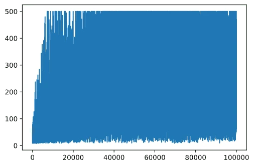

# کارٹپول اسکیٹنگ

پچھلے سبق میں جس مسئلے کو ہم حل کر رہے تھے، وہ شاید ایک کھلونا مسئلہ لگتا ہو، جو واقعی زندگی کے حقیقی منظرناموں کے لئے لاگو نہیں ہوتا۔ ایسا نہیں ہے، کیونکہ بہت سے حقیقی دنیا کے مسائل بھی اس منظرنامے کو شئیر کرتے ہیں - جن میں شطرنج یا گو کھیلنا شامل ہے۔ یہ اس لیے مماثل ہیں کیونکہ ہمارے پاس بھی ایک بورڈ ہوتا ہے جس کے قواعد دیے جاتے ہیں اور ایک **معین حالت** ہوتی ہے۔

## [پہلے سبق کا کوئز](https://ff-quizzes.netlify.app/en/ml/)

## تعارف

اس سبق میں ہم Q-لرننگ کے وہی اصول ایک ایسے مسئلہ پر لاگو کریں گے جس کی حالت **مسلسل** ہو، یعنی ایسی حالت جو ایک یا زیادہ حقیقی اعداد سے ظاہر ہو۔ ہم درج ذیل مسئلہ کا سامنا کریں گے:

> **مسئلہ**: اگر پیٹر بھیڑیا سے بچنا چاہتا ہے، تو اسے تیز حرکت کرنے کے قابل ہونا چاہیے۔ ہم دیکھیں گے کہ پیٹر کس طرح اسکیٹ کرنا سیکھ سکتا ہے، خاص طور پر توازن برقرار رکھنے کا ہنر، Q-لرننگ استعمال کرتے ہوئے۔


> پیٹر اور اس کے دوست بھیڑیا سے بچنے کے لیے تخلیقی حل نکالتے ہیں! تصویر از [جین لوپر](https://twitter.com/jenlooper)

ہم توازن برقرار رکھنے کے ایک سادہ ماڈل کو استعمال کریں گے، جسے **کارٹپول** مسئلہ کہا جاتا ہے۔ کارٹپول دنیا میں، ہمارے پاس ایک افقی سلائیڈر ہوتا ہے جو بائیں یا دائیں حرکت کر سکتا ہے، اور مقصد یہ ہے کہ ایک عمودی کھمبے کو سلائیڈر کے اوپر متوازن رکھا جائے۔


## پیشگی معلومات

اس سبق میں، ہم ایک لائبریری **OpenAI Gym** استعمال کریں گے تاکہ مختلف **ماحولیات** کی نقل (سمولیشن) کی جا سکے۔ آپ اس سبق کا کوڈ مقامی طور پر چلا سکتے ہیں (مثلاً Visual Studio Code سے)، اس صورت میں سمولیشن ایک نئی ونڈو میں کھلے گا۔ جب آن لائن کوڈ چلائیں گے، تو کوڈ میں کچھ ترامیم کی ضرورت ہو سکتی ہے، جیسا کہ [یہاں](https://towardsdatascience.com/rendering-openai-gym-envs-on-binder-and-google-colab-536f99391cc7) بیان کیا گیا ہے۔

## OpenAI Gym

پچھلے سبق میں، کھیل کے قواعد اور حالت `Board` کلاس کے ذریعے دی گئی تھی جو ہم نے خود بنائی تھی۔ یہاں ہم ایک خاص **سمولیشن ماحول** استعمال کریں گے، جو کھمبے کے توازن کے پیچھے طبیعیات کی نقل کرے گا۔ تربیتی تقویتی سیکھنے کے الگورتھمز کے لیے ایک مقبول سمولیشن ماحول کو [Gym](https://gym.openai.com/) کہا جاتا ہے، جسے [OpenAI](https://openai.com/) سنبھالتا ہے۔ اس جیم کا استعمال کرتے ہوئے ہم کارٹپول سمولیشن سے لے کر اٹاری گیمز تک مختلف **ماحولیات** بنا سکتے ہیں۔

> **نوٹ**: آپ OpenAI Gym کی دیگر دستیاب ماحولیات [یہاں](https://gym.openai.com/envs/#classic_control) دیکھ سکتے ہیں۔

سب سے پہلے، آئیے جیم انسٹال کریں اور ضروری لائبریریز درآمد کریں (کوڈ بلاک 1):

```python
import sys
!{sys.executable} -m pip install gym 

import gym
import matplotlib.pyplot as plt
import numpy as np
import random
```

## مشق - کارٹپول ماحول کا آغاز

کارٹپول توازن کے مسئلہ پر کام کرنے کے لیے، ہمیں متعلقہ ماحول کی شروعات کرنا ہوگی۔ ہر ماحول کے ساتھ منسلک ہوتا ہے:

- **مشاہدہ کی جگہ** جو اس معلومات کی ساخت کو متعین کرتی ہے جو ہمیں ماحول سے ملتی ہے۔ کارٹپول کے مسئلہ میں، ہمیں کھمبے کی پوزیشن، رفتار اور کچھ دیگر مقداریں ملتی ہیں۔

- **عمل کی جگہ** جو ممکنہ کاروائیوں کی تعریف کرتی ہے۔ ہمارے کیس میں عمل کی جگہ محدود ہے، اور اس میں دو عمل شامل ہیں - **بائیں** اور **دائیں**۔ (کوڈ بلاک 2)

1. شروع کرنے کے لیے، درج ذیل کوڈ ٹائپ کریں:

    ```python
    env = gym.make("CartPole-v1")
    print(env.action_space)
    print(env.observation_space)
    print(env.action_space.sample())
    ```

ماحول کیسے کام کرتا ہے یہ دیکھنے کے لیے، ایک مختصر سمولیشن 100 مراحل کے لیے چلائیں۔ ہر مرحلے پر، ہم ایک عمل کا انتخاب کرتے ہیں جو انجام دیا جائے گا - اس سمولیشن میں ہم `action_space` سے تصادفی طور پر ایک عمل منتخب کرتے ہیں۔

1. نیچے دیا گیا کوڈ چلائیں اور نتیجہ دیکھیں۔

    ✅ یاد رکھیں کہ اس کوڈ کو مقامی پائتھون انسٹالیشن پر چلانا ترجیح دی جاتی ہے! (کوڈ بلاک 3)

    ```python
    env.reset()
    
    for i in range(100):
       env.render()
       env.step(env.action_space.sample())
    env.close()
    ```

    آپ کو کچھ اس طرح کی تصویر نظر آنی چاہیے:

    

1. سمولیشن کے دوران، ہمیں مشاہدات لینے کی ضرورت ہے تاکہ عمل کرنے کا فیصلہ کیا جا سکے۔ حقیقت میں، قدم کا فعل موجودہ مشاہدات، انعامی فعل، اور "ہو گیا" جھنڈا واپس کرتا ہے جو بتاتا ہے کہ آیا سمولیشن جاری رکھنا معنی رکھتا ہے یا نہیں: (کوڈ بلاک 4)

    ```python
    env.reset()
    
    done = False
    while not done:
       env.render()
       obs, rew, done, info = env.step(env.action_space.sample())
       print(f"{obs} -> {rew}")
    env.close()
    ```

    آپ کو نوٹ بک آؤٹ پٹ میں کچھ اس طرح کا نتیجہ نظر آئے گا:

    ```text
    [ 0.03403272 -0.24301182  0.02669811  0.2895829 ] -> 1.0
    [ 0.02917248 -0.04828055  0.03248977  0.00543839] -> 1.0
    [ 0.02820687  0.14636075  0.03259854 -0.27681916] -> 1.0
    [ 0.03113408  0.34100283  0.02706215 -0.55904489] -> 1.0
    [ 0.03795414  0.53573468  0.01588125 -0.84308041] -> 1.0
    ...
    [ 0.17299878  0.15868546 -0.20754175 -0.55975453] -> 1.0
    [ 0.17617249  0.35602306 -0.21873684 -0.90998894] -> 1.0
    ```

    ہر قدم پر واپس آنے والا مشاہداتی ویکٹر درج ذیل مقداریں رکھتا ہے:
    - گاڑی کی پوزیشن
    - گاڑی کی رفتار
    - کھمبے کا زاویہ
    - کھمبے کی گردش کی شرح

1. ان نمبروں کی کم از کم اور زیادہ سے زیادہ قیمت حاصل کریں: (کوڈ بلاک 5)

    ```python
    print(env.observation_space.low)
    print(env.observation_space.high)
    ```

    آپ یہ بھی نوٹ کریں گے کہ ہر سمولیشن قدم پر انعام کی مقدار ہمیشہ 1 ہوتی ہے۔ اس کی وجہ یہ ہے کہ ہمارا مقصد جتنا ممکن ہو زندہ رہنا ہے، یعنی کھمبے کو زیادہ سے زیادہ عمودی حالت میں رکھنا ہے۔

    ✅ اصل میں، اگر ہم 100 مسلسل کوششوں میں اوسط انعام 195 حاصل کر لیں تو کارٹپول سمولیشن کو حل شدہ تصور کیا جاتا ہے۔

## حالت کی تقسیم

Q-لرننگ میں، ہمیں Q-Table بنانا ہوتا ہے جو بتاتی ہے کہ ہر حالت میں کیا کرنا ہے۔ ایسا کرنے کے لیے، ہمیں حالت کو **معین** ہونا چاہیے، یعنی اس میں محدود تعداد میں معین اقدار ہونی چاہئیں۔ لہٰذا، ہمیں کسی نہ کسی طرح اپنے مشاہدات کو **معین** بنانا ہوگا، تاکہ وہ ایک محدود سیٹ کی حالتوں میں نقش ہو جائیں۔

اس کے لیے چند طریقے ہیں:

- **بنز میں تقسیم کریں**۔ اگر ہمیں کسی خاص قدر کا وقفہ معلوم ہو، تو ہم اس وقفے کو چند **بنز** میں تقسیم کر سکتے ہیں، اور پھر قدر کو اس بن نمبر سے بدل سکتے ہیں جس میں وہ آتی ہے۔ یہ numpy کے [`digitize`](https://numpy.org/doc/stable/reference/generated/numpy.digitize.html) طریقے سے کیا جا سکتا ہے۔ اس صورت میں، ہم حالت کا سائز بخوبی جان لیں گے کیونکہ یہ بنز کی تعداد پر منحصر ہوگا جو ہم ڈیجیٹلائزیشن کے لئے منتخب کرتے ہیں۔
  
✅ ہم خطی انٹرپولیشن بھی استعمال کر سکتے ہیں تاکہ اقدار کو کسی محدود وقفے (مثلاً، -20 سے 20) میں لایا جا سکے، اور پھر اعداد کو گول کر کے integers میں تبدیل کریں۔ یہ حالت کے سائز پر کم کنٹرول دیتا ہے، خاص طور پر اگر ہمیں ان پٹ اقدار کی صحیح رینجز معلوم نہ ہوں۔ مثال کے طور پر، ہمارے کیس میں 4 میں سے 2 اقدار کی بالائی یا نچلی حدود مقرر نہیں ہیں، جس کی وجہ سے ممکنہ حالتیں لامحدود ہو سکتی ہیں۔

ہمارے مثال میں، ہم دوسرا طریقہ منتخب کریں گے۔ جیسا کہ آپ بعد میں دیکھیں گے، باوجود نامعلوم بالائی/نچلی حدوں کے، وہ قیمتیں عام طور پر مخصوص محدود وقفوں سے باہر نہیں جاتیں، لہٰذا انتہائی قیمتوں والی حالتیں بہت کم ہوں گی۔

1. یہاں وہ فعل ہے جو ہمارے ماڈل سے مشاہدات لے کر 4 عددی integer قیمتوں کا جوڑا بنائے گا: (کوڈ بلاک 6)

    ```python
    def discretize(x):
        return tuple((x/np.array([0.25, 0.25, 0.01, 0.1])).astype(np.int))
    ```

1. آئیں ایک اور تقسیم کا طریقہ دریافت کریں جو بنز استعمال کرتا ہے: (کوڈ بلاک 7)

    ```python
    def create_bins(i,num):
        return np.arange(num+1)*(i[1]-i[0])/num+i[0]
    
    print("Sample bins for interval (-5,5) with 10 bins\n",create_bins((-5,5),10))
    
    ints = [(-5,5),(-2,2),(-0.5,0.5),(-2,2)] # ہر پیرامیٹر کے لئے اقدار کے وقفے
    nbins = [20,20,10,10] # ہر پیرامیٹر کے لئے بنز کی تعداد
    bins = [create_bins(ints[i],nbins[i]) for i in range(4)]
    
    def discretize_bins(x):
        return tuple(np.digitize(x[i],bins[i]) for i in range(4))
    ```

1. اب ایک مختصر سمولیشن چلائیں اور ان معین ماحول کی قدر دیکھیں۔ دونوں `discretize` اور `discretize_bins` آزما سکتے ہیں اور فرق دیکھیں۔

    ✅ discretize_bins بن نمبر واپس کرتا ہے، جو 0 کی بنیاد پر ہوتا ہے۔ لہٰذا متغیر کی وہ قدر جو تقریباً 0 کے آس پاس ہو، انٹر وال کے درمیان والے نمبر (10) کو لوٹاتی ہے۔ discretize میں، ہم نے آؤٹ پٹ کی حد کی پرواہ نہیں کی، جس سے مقداری اقدار منفی بھی ہو سکتی ہیں، لہٰذا حالت کی قیمتیں شفٹ نہیں ہوتیں، اور 0 بالکل 0 کو ظاہر کرتا ہے۔ (کوڈ بلاک 8)

    ```python
    env.reset()
    
    done = False
    while not done:
       #ای این وی ۔رینڈر()
       obs, rew, done, info = env.step(env.action_space.sample())
       #پرنٹ(ڈسکریٹائز_بنز(ابز))
       print(discretize(obs))
    env.close()
    ```

    ✅ اگر آپ ماحول کی عمل درآمد دیکھنا چاہتے ہیں تو `env.render` سے شروع ہونے والی لائن کو uncomment کریں۔ ورنہ آپ اسے پس منظر میں چلا سکتے ہیں، جو تیز تر ہے۔ ہم اپنے Q-لرننگ کے عمل کے دوران اس "غیر مرئی" عمل درآمد کو استعمال کریں گے۔

## Q-Table کی ساخت

پچھلے سبق میں، حالت 0 سے 8 تک کے آسان جوڑے کی صورت میں تھی، لہٰذا numpy ٹینسر کا استعمال کرتے ہوئے Q-Table کو 8x8x2 کی شکل میں ظاہر کرنا آسان تھا۔ اگر ہم بنز کے ذریعے تقسیم استعمال کریں تو ہمارے حالت ویکٹر کا سائز بھی معلوم ہوتا ہے، لہٰذا ہم اسی طریقہ کو استعمال کر کے حالت کو 20x20x10x10x2 کی شکل میں پیش کر سکتے ہیں (یہاں 2 عمل کی جگہ کی جہت ہے، اور پہلی جہتیں مشاہدہ کی جگہ کے ہر پیرامیٹر کے لیے منتخب کردہ بنز کی تعداد کو ظاہر کرتی ہیں)۔

تاہم، کبھی کبھار مشاہدہ کی جگہ کی درست جہتیں معلوم نہیں ہوتیں۔ `discretize` فعل کی صورت میں، ہم کبھی یقین نہیں کر سکتے کہ ہمارا حالت مخصوص حدود میں رہے گا، کیونکہ کچھ اصل قدرین آزاد ہوتی ہیں۔ لہٰذا، ہم تھوڑا مختلف طریقہ استعمال کریں گے اور Q-Table کو ایک لغت (dictionary) سے ظاہر کریں گے۔

1. جوڑا *(state, action)* لغت کی کنجی کے طور پر استعمال کریں، اور قیمت Q-Table کی اندراج کی قیمت ہوگی۔ (کوڈ بلاک 9)

    ```python
    Q = {}
    actions = (0,1)
    
    def qvalues(state):
        return [Q.get((state,a),0) for a in actions]
    ```

    یہاں ہم `qvalues()` فعل بھی تعریف کرتے ہیں، جو دی گئی حالت کے لئے تمام ممکنہ عملوں کے لیے Q-Table کی ایک فہرست واپس کرتا ہے۔ اگر Q-Table میں اندراج موجود نہ ہو، تو ہم ڈیفالٹ طور پر 0 واپس کریں گے۔

## آئیے Q-لرننگ شروع کریں

اب ہم پیٹر کو توازن قائم رکھنا سکھانے کے لیے تیار ہیں!

1. سب سے پہلے، چند ہائپر پیرامیٹرز سیٹ کریں: (کوڈ بلاک 10)

    ```python
    # ہائپر پیرا میٹرز
    alpha = 0.3
    gamma = 0.9
    epsilon = 0.90
    ```

    یہاں، `alpha` **سیکھنے کی شرح** ہے جو بتاتی ہے کہ ہر قدم پر Q-Table کی موجودہ قدروں کو کس حد تک ایڈجسٹ کرنا چاہیے۔ پچھلے سبق میں ہم نے 1 سے شروع کیا، پھر تربیت کے دوران `alpha` کو کم کیا۔ اس مثال میں ہم اسے آسانی کے لیے مستقل رکھیں گے، اور آپ بعد میں `alpha` کی قدروں کو ایڈجسٹ کرنے پر تجربہ کر سکتے ہیں۔

    `gamma` **رعایتی عنصر** ہے جو دکھاتا ہے کہ ہمیں مستقبل کے انعام کو موجودہ انعام پر کس حد تک ترجیح دینی چاہیے۔

    `epsilon` **تجربہ/استعمال کا عنصر** ہے جو تعین کرتا ہے کہ ہمیں تجربہ (انویسٹیگیشن) پر ترجیح دینی چاہیے یا استعمال (exploitation) پر۔ ہمارے الگورتھم میں، ہم `epsilon` فیصد مواقع پر Q-Table کی قدروں کے مطابق اگلا عمل منتخب کریں گے، اور باقی مواقع پر ایک اتفاقی عمل انجام دیں گے۔ یہ ہمیں تلاش کے اس جگہ کو دریافت کرنے کی اجازت دے گا جو پہلے کبھی نہیں دیکھا گیا۔

    ✅ توازن برقرار رکھنے کے لحاظ سے - اتفاقی عمل کا انتخاب (تجربہ) ایک غلط سمت میں اتفاقی دھکا کی طرح ہوگا، اور کھمبے کو ان "غلطیوں" سے توازن برقرار رکھنا سیکھنا پڑے گا۔

### الگورتھم کو بہتر بنائیں

ہم اپنے پچھلے سبق کے الگورتھم میں دو بہتریاں بھی کر سکتے ہیں:

- **اوسط مجموعی انعام** کا حساب لگائیں، کئی سمولیشنز پر۔ ہم ہر 5000 دورانیوں پر پیش رفت پرنٹ کریں گے، اور اس مدت کے دوران اپنے مجموعی انعام کا اوسط نکالیں گے۔ اس کا مطلب ہے کہ اگر ہمیں 195 پوائنٹس سے زیادہ مل جائیں تو ہم مسئلہ کو حل شدہ سمجھ سکتے ہیں، یہاں تک کہ مطلوبہ معیار سے بھی بہتر۔
  
- **زیادہ سے زیادہ اوسط مجموعی نتیجہ** `Qmax` کا حساب لگائیں، اور ہم اس نتیجہ سے متعلق Q-Table کو محفوظ کریں گے۔ جب آپ تربیت چلائیں گے، تو آپ دیکھیں گے کہ کچھ وقتوں میں اوسط مجموعی نتیجہ کم ہونا شروع ہو جاتا ہے، اور ہم Q-Table کی ایسی قدریں رکھنا چاہتے ہیں جو تربیت کے دوران بہترین ماڈل کے متعلق ہوں۔

1. ہر سمولیشن پر تمام مجموعی انعامات کو `rewards` ویکٹر میں جمع کریں تاکہ بعد میں گراف بنایا جا سکے۔ (کوڈ بلاک  11)

    ```python
    def probs(v,eps=1e-4):
        v = v-v.min()+eps
        v = v/v.sum()
        return v
    
    Qmax = 0
    cum_rewards = []
    rewards = []
    for epoch in range(100000):
        obs = env.reset()
        done = False
        cum_reward=0
        # == سمولیشن کریں ==
        while not done:
            s = discretize(obs)
            if random.random()<epsilon:
                # استحصال - عمل کو کیو-ٹیبل کے امکانات کے مطابق منتخب کریں
                v = probs(np.array(qvalues(s)))
                a = random.choices(actions,weights=v)[0]
            else:
                # تلاش - عمل کو بے ترتیب منتخب کریں
                a = np.random.randint(env.action_space.n)
    
            obs, rew, done, info = env.step(a)
            cum_reward+=rew
            ns = discretize(obs)
            Q[(s,a)] = (1 - alpha) * Q.get((s,a),0) + alpha * (rew + gamma * max(qvalues(ns)))
        cum_rewards.append(cum_reward)
        rewards.append(cum_reward)
        # == وقفے وقفے سے نتائج پرنٹ کریں اور اوسط انعام کا حساب لگائیں ==
        if epoch%5000==0:
            print(f"{epoch}: {np.average(cum_rewards)}, alpha={alpha}, epsilon={epsilon}")
            if np.average(cum_rewards) > Qmax:
                Qmax = np.average(cum_rewards)
                Qbest = Q
            cum_rewards=[]
    ```

آپ کو ان نتائج سے کیا ملتا ہے:

- **ہمارے مقصد کے قریب**۔ ہم 100+ مسلسل سمولیشنز میں 195 مجموعی انعام حاصل کرنے کے مقصد کے بہت قریب ہیں، یا ہم نے حقیقت میں یہ حاصل کر لیا ہے! اگر ہمیں کم نمبر بھی ملیں، تو بھی ہمیں یقین نہیں ہو سکتا کیونکہ ہم 5000 کوششوں پر اوسط نکال رہے ہیں، جبکہ رسمی معیار میں صرف 100 کوششیں درکار ہیں۔
  
- **انعام کم ہونا شروع ہو جاتا ہے**۔ کبھی کبھار انعام کم ہونا شروع ہو جاتا ہے، جس کا مطلب ہے کہ ہم Q-Table میں پہلے سے سیکھے ہوئے اقدار کو ان قدروں سے "تباہ" کر سکتے ہیں جو صورت حال کو خراب کر دیں۔

یہ مشاہدہ تربیتی پیش رفت کا گراف بنانا زیادہ واضح کر دیتا ہے۔

## تربیتی پیش رفت کا گراف

تربیت کے دوران، ہم نے ہر چکر میں مجموعی انعام کی مقدار `rewards` ویکٹر میں جمع کی ہے۔ یہ گراف ہے جب ہم اسے چکر نمبر کے خلاف پیش کریں:

```python
plt.plot(rewards)
```



اس گراف سے کوئی نتیجہ اخذ کرنا مشکل ہے، کیونکہ سٹوکاسٹک تربیتی عمل کی نوعیت کی وجہ سے تربیتی سیشنز کی لمبائی بہت مختلف ہوتی ہے۔ اس گراف کو بہتر سمجھنے کے لیے، ہم تجربات کی ایک سلسلے پر **چلتی اوسط** نکال سکتے ہیں، کہاں کہ 100 تک۔ یہ `np.convolve` سے آسانی سے کیا جا سکتا ہے: (کوڈ بلاک 12)

```python
def running_average(x,window):
    return np.convolve(x,np.ones(window)/window,mode='valid')

plt.plot(running_average(rewards,100))
```


## ہائپر پیرامیٹرز میں تبدیلی

سیکھنے کو زیادہ مستحکم بنانے کے لیے، تربیت کے دوران اپنے کچھ ہائپر پیرامیٹرز کو ایڈجسٹ کرنا منطقی ہے۔ خاص طور پر:

- **سیکھنے کی شرح** `alpha` کے لیے، ہم ممکنہ طور پر ابتدائی طور پر 1 کے قریب قابلِ قدر لے سکتے ہیں، اور پھر اس پیرامیٹر کو کم کرتے جائیں۔ وقت کے ساتھ، Q-Table میں ہمیں اچھے احتمال کی قدریں ملیں گی، اس لیے ہمیں انہیں تھوڑا سا ایڈجسٹ کرنا چاہیے، مکمل طور پر نئی قدروں سے تبدیل نہیں کرنا چاہیے۔

- **epsilon بڑھائیں**۔ ہم آہستہ آہستہ `epsilon` کو بڑھانا چاہیں گے تاکہ تحقیق کم اور استعمال زیادہ ہو۔ احتمال ہے کہ ہمیں `epsilon` کی کم قیمت سے شروع کر کے تقریباً 1 تک لے جانا چاہیے۔

> **ٹاسک 1**: ہائپر پیرامیٹرز کی قدروں کے ساتھ تجربہ کریں اور دیکھیں کیا آپ زیادہ مجموعی انعام حاصل کر سکتے ہیں۔ کیا آپ 195 سے اوپر جا پا رہے ہیں؟


> **کام 2**: مسئلہ کو باقاعدگی سے حل کرنے کے لیے، آپ کو 100 مسلسل رنز میں 195 اوسط انعام حاصل کرنا ہوگا۔ اسے تربیت کے دوران ماپیں اور یقینی بنائیں کہ آپ نے باضابطہ طور پر مسئلہ حل کر لیا ہے!

## نتیجہ عمل میں دیکھنا

یہ واقعی دلچسپ ہوگا کہ ہم دیکھیں کہ تربیت یافتہ ماڈل کیسے برتاؤ کرتا ہے۔ آئیں ہم سیمولیشن چلائیں اور آموزش کے دوران کی طرح ہی کارروائی کے انتخاب کی حکمت عملی اپنائیں، یعنی Q-Table میں احتمال کی تقسیم کے مطابق سیمپلنگ کریں: (کوڈ بلاک 13)

```python
obs = env.reset()
done = False
while not done:
   s = discretize(obs)
   env.render()
   v = probs(np.array(qvalues(s)))
   a = random.choices(actions,weights=v)[0]
   obs,_,done,_ = env.step(a)
env.close()
```

آپ کو کچھ ایسا دیکھنا چاہیے:


---

## 🚀چیلنج

> **کام 3**: یہاں ہم Q-Table کی آخری کاپی استعمال کر رہے تھے، جو شاید بہترین نہ ہو۔ یاد رکھیں کہ ہم نے بہترین کارکردگی دکھانے والی Q-Table کو `Qbest` متغیر میں محفوظ کیا ہے! اسی مثال کو بہترین کارکردگی دکھانے والی Q-Table کے ساتھ آزما کر دیکھیں، `Qbest` کو `Q` پر کاپی کریں اور فرق دیکھیں۔

> **کام 4**: یہاں ہم ہر قدم پر بہترین عمل کا انتخاب نہیں کر رہے تھے، بلکہ احتمال کی تقسیم کے مطابق سیمپلنگ کر رہے تھے۔ کیا یہ زیادہ معنی خیز نہیں ہوگا کہ ہم ہمیشہ بہترین عمل منتخب کریں، جو Q-Table کی سب سے زیادہ قدر رکھتا ہو؟ یہ `np.argmax` فنکشن استعمال کر کے کیا جا سکتا ہے تاکہ وہ عمل نمبر معلوم ہو جو سب سے زیادہ Q-Table ویلیو کے مطابق ہو۔ اس حکمت عملی کو نافذ کریں اور دیکھیں کہ کیا اس سے توازن بہتر ہوتا ہے۔

## [لیکچر کے بعد کا کوئز](https://ff-quizzes.netlify.app/en/ml/)

## اسائنمنٹ
[Train a Mountain Car](assignment.md)

## نتیجہ

ہم نے اب سیکھ لیا ہے کہ ایجنٹس کو اچھے نتائج حاصل کرنے کے لیے کیسے تربیت دی جائے، صرف انہیں ایک انعامی فنکشن دے کر جو کھیل کی مطلوبہ حالت کی تعریف کرتا ہے، اور انہیں تلاش کی جگہ کو ذہانت سے دریافت کرنے کا موقع دے کر۔ ہم نے کامیابی سے Q-Learning الگورتھم کو متقطع اور مسلسل ماحول دونوں میں لاگو کیا ہے، لیکن متقطع اعمال کے ساتھ۔

یہ بھی ضروری ہے کہ ایسی صورتوں کا مطالعہ کیا جائے جہاں عمل کی حالت بھی مسلسل ہو، اور مشاہداتی جگہ بہت زیادہ پیچیدہ ہو، جیسے کہ اٹاری گیم کی سکرین کی تصویر۔ ایسے مسائل میں ہمیں عموماً بہتر نتائج حاصل کرنے کے لیے زیادہ طاقتور مشین لرننگ تکنیکوں، جیسے نیورل نیٹ ورکس، کا استعمال کرنا پڑتا ہے۔ یہ مزید ترقی یافتہ موضوعات ہماری آئندہ مزید ترقی یافتہ AI کورس کے موضوعات ہیں۔

---

<!-- CO-OP TRANSLATOR DISCLAIMER START -->
**ڈس کلیمر**:
یہ دستاویز AI ترجمہ سروس [Co-op Translator](https://github.com/Azure/co-op-translator) کے ذریعے ترجمہ کی گئی ہے۔ جبکہ ہم درستگی کے لیے کوشاں ہیں، براہ کرم اس بات سے آگاہ رہیں کہ خودکار ترجمے میں غلطیاں یا عدم درستیاں ہو سکتی ہیں۔ اصل دستاویز اپنے مادری زبان میں مستند ماخذ سمجھی جائے گی۔ حساس معلومات کے لیے پیشہ ور انسانی ترجمہ کی سفارش کی جاتی ہے۔ اس ترجمے کے استعمال سے پیدا ہونے والی کسی بھی غلط فہمی یا غلط تشریح کی ذمہ داری ہم قبول نہیں کرتے۔
<!-- CO-OP TRANSLATOR DISCLAIMER END -->