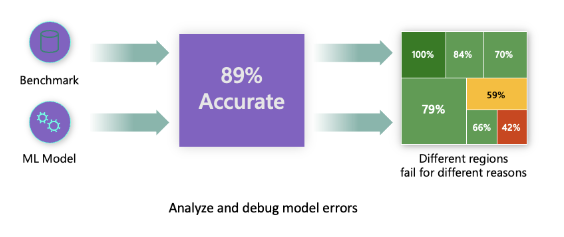
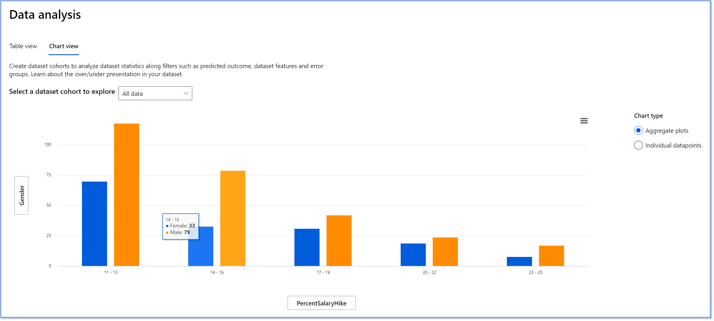
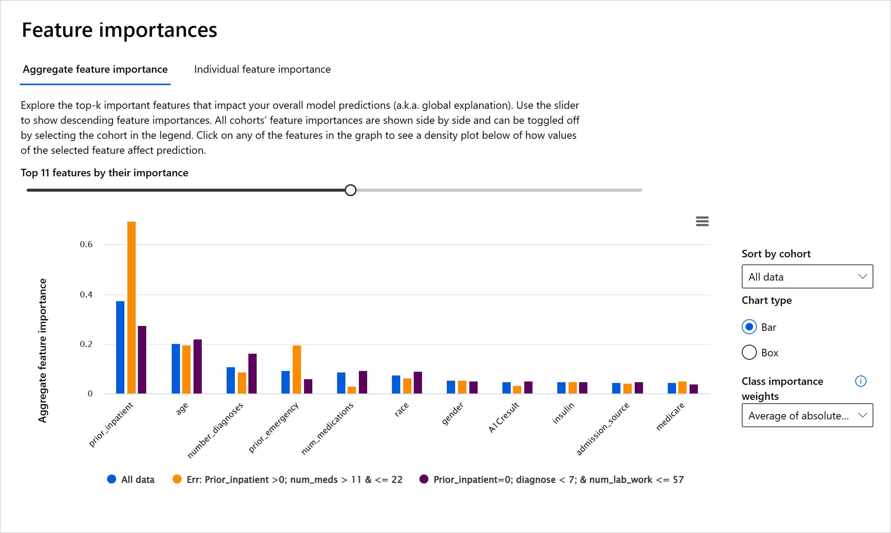

<!--
CO_OP_TRANSLATOR_METADATA:
{
  "original_hash": "ba0f6e1019351351c8ee4c92867b6a0b",
  "translation_date": "2025-08-29T13:33:25+00:00",
  "source_file": "9-Real-World/2-Debugging-ML-Models/README.md",
  "language_code": "ur"
}
-->
# پوسٹ اسکرپٹ: مشین لرننگ میں ماڈل ڈیبگنگ کے لیے ریسپانسبل اے آئی ڈیش بورڈ کے اجزاء کا استعمال

## [لیکچر سے پہلے کا کوئز](https://gray-sand-07a10f403.1.azurestaticapps.net/quiz/5/)

## تعارف

مشین لرننگ ہماری روزمرہ کی زندگی پر اثر انداز ہو رہی ہے۔ اے آئی صحت، مالیات، تعلیم، اور ملازمت جیسے اہم نظاموں میں داخل ہو رہی ہے جو ہمیں بطور فرد اور ہماری سوسائٹی کو متاثر کرتے ہیں۔ مثال کے طور پر، سسٹمز اور ماڈلز روزمرہ کے فیصلوں میں شامل ہیں، جیسے صحت کی تشخیص یا دھوکہ دہی کا پتہ لگانا۔ نتیجتاً، اے آئی کی ترقی اور اس کے تیز رفتار اپنانے کے ساتھ، سماجی توقعات اور ضوابط بھی بڑھ رہے ہیں۔ ہم اکثر دیکھتے ہیں کہ اے آئی سسٹمز توقعات پر پورا نہیں اترتے، نئے چیلنجز سامنے آتے ہیں، اور حکومتیں اے آئی حلوں کو ریگولیٹ کرنا شروع کر رہی ہیں۔ اس لیے یہ ضروری ہے کہ ان ماڈلز کا تجزیہ کیا جائے تاکہ سب کے لیے منصفانہ، قابل اعتماد، شفاف، اور جوابدہ نتائج فراہم کیے جا سکیں۔

اس نصاب میں، ہم عملی ٹولز کا جائزہ لیں گے جو یہ جانچنے کے لیے استعمال کیے جا سکتے ہیں کہ آیا کسی ماڈل میں ریسپانسبل اے آئی کے مسائل ہیں۔ روایتی مشین لرننگ ڈیبگنگ تکنیکیں عام طور پر مقداری حسابات پر مبنی ہوتی ہیں، جیسے مجموعی درستگی یا اوسط غلطی کا نقصان۔ تصور کریں کہ جب آپ کے ڈیٹا میں کچھ مخصوص آبادیاتی گروپس (جیسے نسل، جنس، سیاسی نظریہ، مذہب) شامل نہ ہوں یا ان کی نمائندگی غیر متناسب ہو، تو کیا ہو سکتا ہے۔ اگر ماڈل کے نتائج کسی خاص گروپ کو ترجیح دیتے ہیں تو کیا ہوگا؟ یہ حساس فیچر گروپس کی زیادہ یا کم نمائندگی کا باعث بن سکتا ہے، جس سے ماڈل میں انصاف، شمولیت، یا قابل اعتمادیت کے مسائل پیدا ہو سکتے ہیں۔ مزید یہ کہ، مشین لرننگ ماڈلز کو "بلیک باکسز" سمجھا جاتا ہے، جس کی وجہ سے یہ سمجھنا اور وضاحت کرنا مشکل ہو جاتا ہے کہ ماڈل کی پیش گوئی کے پیچھے کیا عوامل ہیں۔ یہ سب وہ چیلنجز ہیں جن کا سامنا ڈیٹا سائنسدانوں اور اے آئی ڈویلپرز کو ہوتا ہے جب ان کے پاس ماڈل کی منصفانہ یا قابل اعتمادیت کا تجزیہ کرنے کے لیے مناسب ٹولز نہیں ہوتے۔

اس سبق میں، آپ اپنے ماڈلز کو ڈیبگ کرنے کے بارے میں سیکھیں گے:

- **ایرر اینالیسس**: یہ شناخت کریں کہ آپ کے ڈیٹا ڈسٹری بیوشن میں کہاں ماڈل کی غلطی کی شرح زیادہ ہے۔
- **ماڈل اوورویو**: مختلف ڈیٹا کوہورٹس کے درمیان تقابلی تجزیہ کریں تاکہ ماڈل کی کارکردگی کے میٹرکس میں فرق دریافت کریں۔
- **ڈیٹا اینالیسس**: یہ جانچیں کہ آپ کے ڈیٹا میں کہاں زیادہ یا کم نمائندگی ہو سکتی ہے، جو ماڈل کو کسی ایک ڈیٹا گروپ کے حق میں جھکا سکتی ہے۔
- **فیچر امپورٹنس**: یہ سمجھیں کہ کون سے فیچرز ماڈل کی پیش گوئیوں کو عالمی یا مقامی سطح پر چلا رہے ہیں۔

## پیشگی شرط

پیشگی شرط کے طور پر، براہ کرم [ریسپانسبل اے آئی ٹولز فار ڈویلپرز](https://www.microsoft.com/ai/ai-lab-responsible-ai-dashboard) کا جائزہ لیں۔

> 

## ایرر اینالیسس

روایتی ماڈل کارکردگی کے میٹرکس، جو درستگی کی پیمائش کے لیے استعمال ہوتے ہیں، عام طور پر درست اور غلط پیش گوئیوں پر مبنی حسابات ہوتے ہیں۔ مثال کے طور پر، یہ طے کرنا کہ ایک ماڈل 89% وقت درست ہے اور اس کی غلطی کا نقصان 0.001 ہے، اچھی کارکردگی سمجھی جا سکتی ہے۔ لیکن غلطیاں آپ کے بنیادی ڈیٹا سیٹ میں یکساں طور پر تقسیم نہیں ہوتیں۔ آپ کو 89% ماڈل درستگی کا اسکور مل سکتا ہے، لیکن یہ دریافت ہو سکتا ہے کہ آپ کے ڈیٹا کے مختلف حصوں میں ماڈل 42% وقت ناکام ہو رہا ہے۔ ان ناکامی کے نمونوں کے نتائج مخصوص ڈیٹا گروپس کے ساتھ انصاف یا قابل اعتمادیت کے مسائل پیدا کر سکتے ہیں۔ یہ سمجھنا ضروری ہے کہ ماڈل کہاں اچھی کارکردگی دکھا رہا ہے اور کہاں نہیں۔

ریسپانسبل اے آئی ڈیش بورڈ پر ایرر اینالیسس کا جزو یہ دکھاتا ہے کہ ماڈل کی ناکامی مختلف کوہورٹس میں کس طرح تقسیم ہوتی ہے، اور یہ درخت کی شکل میں نظر آتا ہے۔ یہ ان فیچرز یا علاقوں کی شناخت میں مددگار ہے جہاں آپ کے ڈیٹا سیٹ میں غلطی کی شرح زیادہ ہے۔ 

درخت کے نقشے پر گہرے سرخ رنگ کے شیڈز ان علاقوں کو ظاہر کرتے ہیں جہاں غلطی کی شرح زیادہ ہے۔ 

ہیٹ میپ ایک اور ویژولائزیشن فنکشن ہے جو صارفین کو غلطی کی شرح کی جانچ کرنے میں مدد دیتا ہے، تاکہ پورے ڈیٹا سیٹ یا کوہورٹس میں ماڈل کی غلطیوں کے اسباب کا پتہ لگایا جا سکے۔

ایرر اینالیسس کا استعمال کریں جب آپ کو ضرورت ہو:

* یہ سمجھنے کی کہ ماڈل کی ناکامیاں ڈیٹا سیٹ اور مختلف فیچر ڈائمینشنز میں کس طرح تقسیم ہیں۔
* مجموعی کارکردگی کے میٹرکس کو توڑ کر غلط کوہورٹس کو خودکار طور پر دریافت کریں تاکہ آپ کے ہدفی اصلاحی اقدامات کو مطلع کیا جا سکے۔

## ماڈل اوورویو

مشین لرننگ ماڈل کی کارکردگی کا جائزہ لینے کے لیے اس کے رویے کو مجموعی طور پر سمجھنا ضروری ہے۔ یہ مختلف میٹرکس جیسے غلطی کی شرح، درستگی، ریکال، پریسیژن، یا ایم اے ای (Mean Absolute Error) کا جائزہ لے کر حاصل کیا جا سکتا ہے تاکہ کارکردگی کے میٹرکس میں فرق تلاش کیا جا سکے۔ 

ماڈل اوورویو کا جزو نہ صرف ڈیٹا کوہورٹس میں کارکردگی کے میٹرکس کا تجزیہ کرنے میں مدد دیتا ہے بلکہ یہ صارفین کو مختلف کوہورٹس کے درمیان ماڈل کے رویے کا موازنہ کرنے کی صلاحیت بھی فراہم کرتا ہے۔

یہ جزو دو قسم کے فرق کے میٹرکس کی حمایت کرتا ہے:

**ماڈل کی کارکردگی میں فرق**: یہ میٹرکس ڈیٹا کے ذیلی گروپس میں منتخب کردہ کارکردگی کے میٹرک کی قدروں میں فرق کا حساب لگاتے ہیں۔

**انتخاب کی شرح میں فرق**: یہ میٹرک ذیلی گروپس کے درمیان انتخاب کی شرح (مثبت پیش گوئی) میں فرق پر مشتمل ہے۔

## ڈیٹا اینالیسس

> "اگر آپ ڈیٹا کو کافی دیر تک دباؤ میں رکھیں، تو یہ کچھ بھی تسلیم کر لے گا" - رونالڈ کوس

یہ بیان مبالغہ آمیز لگتا ہے، لیکن یہ سچ ہے کہ ڈیٹا کو کسی بھی نتیجے کی حمایت کے لیے جوڑ توڑ کیا جا سکتا ہے۔ 

ڈیٹا روایتی ماڈل کارکردگی کے میٹرکس کے لیے ایک بڑا اندھا دھبہ ہے۔ آپ کے پاس اعلیٰ درستگی کے اسکور ہو سکتے ہیں، لیکن یہ ہمیشہ آپ کے ڈیٹا سیٹ میں موجود تعصبات کی عکاسی نہیں کرتے۔ 

ریسپانسبل اے آئی ڈیش بورڈ پر ڈیٹا اینالیسس کا جزو ان علاقوں کی شناخت میں مدد دیتا ہے جہاں ڈیٹا سیٹ میں زیادہ یا کم نمائندگی ہو سکتی ہے۔

ڈیٹا اینالیسس کا استعمال کریں جب آپ کو ضرورت ہو:

* اپنے ڈیٹا سیٹ کے اعدادوشمار کو مختلف فلٹرز منتخب کر کے مختلف ڈائمینشنز میں تقسیم کریں۔
* مختلف کوہورٹس اور فیچر گروپس میں اپنے ڈیٹا سیٹ کی تقسیم کو سمجھیں۔
* یہ طے کریں کہ انصاف، ایرر اینالیسس، اور کازیلٹی سے متعلق آپ کے نتائج آپ کے ڈیٹا سیٹ کی تقسیم کا نتیجہ ہیں یا نہیں۔

## ماڈل کی وضاحت

مشین لرننگ ماڈلز کو "بلیک باکسز" سمجھا جاتا ہے۔ یہ سمجھنا کہ کون سے کلیدی ڈیٹا فیچرز ماڈل کی پیش گوئی کو چلا رہے ہیں، ایک چیلنج ہو سکتا ہے۔ 

ریسپانسبل اے آئی ڈیش بورڈ پر فیچر امپورٹنس کا جزو آپ کو یہ سمجھنے میں مدد دیتا ہے کہ ماڈل پیش گوئی کیسے کرتا ہے۔

فیچر امپورٹنس کا استعمال کریں جب آپ کو ضرورت ہو:

* یہ طے کرنے کی کہ آپ کے اے آئی سسٹم کی پیش گوئیاں کتنی قابل اعتماد ہیں۔
* اپنے ماڈل کو سمجھ کر ڈیبگنگ کے عمل کو شروع کریں۔
* ممکنہ تعصب کے ذرائع کو بے نقاب کریں۔
* اپنے ماڈل کے فیصلوں پر صارفین کا اعتماد پیدا کریں۔

## نتیجہ

ریسپانسبل اے آئی ڈیش بورڈ کے تمام اجزاء عملی ٹولز ہیں جو آپ کو ایسے مشین لرننگ ماڈلز بنانے میں مدد دیتے ہیں جو معاشرے کے لیے کم نقصان دہ اور زیادہ قابل اعتماد ہوں۔ یہ انسانی حقوق کے خطرات کو روکنے، مخصوص گروپس کے ساتھ امتیازی سلوک یا انہیں مواقع سے محروم کرنے، اور جسمانی یا نفسیاتی نقصان کے خطرے کو کم کرنے میں مدد دیتا ہے۔ 

کچھ ممکنہ نقصانات درج ذیل ہیں:

- **تقسیم**: اگر کسی جنس یا نسل کو دوسرے پر ترجیح دی جائے۔
- **سروس کا معیار**: اگر آپ نے ڈیٹا کو ایک مخصوص منظرنامے کے لیے تربیت دی ہو لیکن حقیقت زیادہ پیچیدہ ہو۔
- **اسٹیریو ٹائپنگ**: کسی گروپ کو پہلے سے طے شدہ خصوصیات کے ساتھ منسلک کرنا۔
- **تنقید**: کسی چیز یا کسی کو غیر منصفانہ طور پر تنقید کا نشانہ بنانا۔
- **زیادہ یا کم نمائندگی**۔ اس کا مطلب یہ ہے کہ کسی خاص گروپ کو کسی خاص پیشے میں نہیں دیکھا جاتا، اور کوئی بھی سروس یا فنکشن جو اس رجحان کو فروغ دیتا ہے، نقصان کا باعث بن رہا ہے۔

### Azure RAI ڈیش بورڈ

[Azure RAI ڈیش بورڈ](https://learn.microsoft.com/en-us/azure/machine-learning/concept-responsible-ai-dashboard?WT.mc_id=aiml-90525-ruyakubu) اوپن سورس ٹولز پر مبنی ہے جو معروف تعلیمی اداروں اور تنظیموں بشمول Microsoft نے تیار کیے ہیں۔ یہ ڈیٹا سائنسدانوں اور AI ڈویلپرز کے لیے ماڈل کے رویے کو بہتر طور پر سمجھنے، مسائل کو دریافت کرنے اور AI ماڈلز سے غیر مطلوبہ مسائل کو کم کرنے میں مددگار ہیں۔

- مختلف اجزاء کو استعمال کرنے کا طریقہ سیکھنے کے لیے RAI ڈیش بورڈ کے [docs](https://learn.microsoft.com/en-us/azure/machine-learning/how-to-responsible-ai-dashboard?WT.mc_id=aiml-90525-ruyakubu) کو دیکھیں۔

- Azure Machine Learning میں زیادہ ذمہ دار AI منظرناموں کو ڈیبگ کرنے کے لیے RAI ڈیش بورڈ کے کچھ [نمونہ نوٹ بکس](https://github.com/Azure/RAI-vNext-Preview/tree/main/examples/notebooks) دیکھیں۔

---
## 🚀 چیلنج

اعداد و شمار یا ڈیٹا کے تعصبات کو شروع میں ہی روکنے کے لیے، ہمیں چاہیے کہ:

- ان لوگوں میں مختلف پس منظر اور نقطہ نظر ہوں جو سسٹمز پر کام کر رہے ہیں  
- ایسے ڈیٹا سیٹس میں سرمایہ کاری کریں جو ہماری سوسائٹی کی تنوع کی عکاسی کرتے ہوں  
- تعصب کو پہچاننے اور درست کرنے کے بہتر طریقے تیار کریں جب یہ ظاہر ہو  

حقیقی زندگی کے ان منظرناموں کے بارے میں سوچیں جہاں ماڈل بنانے اور استعمال کرنے میں ناانصافی واضح ہو۔ ہمیں اور کیا غور کرنا چاہیے؟

## [لیکچر کے بعد کا کوئز](https://gray-sand-07a10f403.1.azurestaticapps.net/quiz/6/)
## جائزہ اور خود مطالعہ

اس سبق میں، آپ نے مشین لرننگ میں ذمہ دار AI کو شامل کرنے کے کچھ عملی ٹولز سیکھے ہیں۔

ان موضوعات کو مزید گہرائی سے سمجھنے کے لیے یہ ورکشاپ دیکھیں:

- ذمہ دار AI ڈیش بورڈ: Besmira Nushi اور Mehrnoosh Sameki کی جانب سے عملی طور پر RAI کو نافذ کرنے کے لیے ایک مکمل حل

> 🎥 اوپر دی گئی تصویر پر کلک کریں ویڈیو کے لیے: Besmira Nushi اور Mehrnoosh Sameki کی جانب سے ذمہ دار AI ڈیش بورڈ: عملی طور پر RAI کو نافذ کرنے کے لیے ایک مکمل حل

ذمہ دار AI اور زیادہ قابل اعتماد ماڈلز بنانے کے بارے میں مزید جاننے کے لیے درج ذیل مواد کا حوالہ دیں:

- ML ماڈلز کو ڈیبگ کرنے کے لیے Microsoft کے RAI ڈیش بورڈ ٹولز: [ذمہ دار AI ٹولز کے وسائل](https://aka.ms/rai-dashboard)

- ذمہ دار AI ٹول کٹ کو دریافت کریں: [Github](https://github.com/microsoft/responsible-ai-toolbox)

- Microsoft کا RAI وسائل مرکز: [ذمہ دار AI وسائل – Microsoft AI](https://www.microsoft.com/ai/responsible-ai-resources?activetab=pivot1%3aprimaryr4)

- Microsoft کا FATE تحقیقاتی گروپ: [FATE: AI میں انصاف، جوابدہی، شفافیت، اور اخلاقیات - Microsoft Research](https://www.microsoft.com/research/theme/fate/)

## اسائنمنٹ

[RAI ڈیش بورڈ کو دریافت کریں](assignment.md)

---

**ڈس کلیمر**:  
یہ دستاویز AI ترجمہ سروس [Co-op Translator](https://github.com/Azure/co-op-translator) کا استعمال کرتے ہوئے ترجمہ کی گئی ہے۔ ہم درستگی کے لیے پوری کوشش کرتے ہیں، لیکن براہ کرم آگاہ رہیں کہ خودکار ترجمے میں غلطیاں یا عدم درستگی ہو سکتی ہیں۔ اصل دستاویز، جو اس کی اصل زبان میں ہے، کو مستند ماخذ سمجھا جانا چاہیے۔ اہم معلومات کے لیے، پیشہ ور انسانی ترجمہ کی سفارش کی جاتی ہے۔ اس ترجمے کے استعمال سے پیدا ہونے والی کسی بھی غلط فہمی یا غلط تشریح کے لیے ہم ذمہ دار نہیں ہیں۔