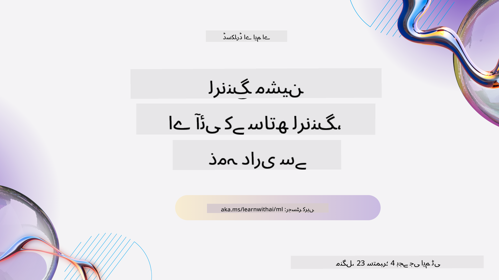
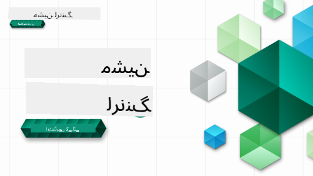

<!--
CO_OP_TRANSLATOR_METADATA:
{
  "original_hash": "7a13afb3674838f557d61f8d67e4d5f8",
  "translation_date": "2025-10-24T08:54:46+00:00",
  "source_file": "README.md",
  "language_code": "ur"
}
-->
  
  
  
  
  

  
  
  

### 🌐 کثیر زبان کی حمایت  

#### GitHub ایکشن کے ذریعے سپورٹ (خودکار اور ہمیشہ تازہ ترین)  

[عربی](../ar/README.md) | [بنگالی](../bn/README.md) | [بلغاریائی](../bg/README.md) | [برمی (میانمار)](../my/README.md) | [چینی (سادہ)](../zh/README.md) | [چینی (روایتی، ہانگ کانگ)](../hk/README.md) | [چینی (روایتی، مکاؤ)](../mo/README.md) | [چینی (روایتی، تائیوان)](../tw/README.md) | [کروشین](../hr/README.md) | [چیک](../cs/README.md) | [ڈینش](../da/README.md) | [ڈچ](../nl/README.md) | [ایسٹونین](../et/README.md) | [فنش](../fi/README.md) | [فرانسیسی](../fr/README.md) | [جرمن](../de/README.md) | [یونانی](../el/README.md) | [عبرانی](../he/README.md) | [ہندی](../hi/README.md) | [ہنگریائی](../hu/README.md) | [انڈونیشیائی](../id/README.md) | [اطالوی](../it/README.md) | [جاپانی](../ja/README.md) | [کوریائی](../ko/README.md) | [لتھوینین](../lt/README.md) | [مالے](../ms/README.md) | [مراٹھی](../mr/README.md) | [نیپالی](../ne/README.md) | [نارویجین](../no/README.md) | [فارسی](../fa/README.md) | [پولش](../pl/README.md) | [پرتگالی (برازیل)](../br/README.md) | [پرتگالی (پرتگال)](../pt/README.md) | [پنجابی (گرمکھی)](../pa/README.md) | [رومانیائی](../ro/README.md) | [روسی](../ru/README.md) | [سربیائی (سیریلیک)](../sr/README.md) | [سلوواک](../sk/README.md) | [سلووینیائی](../sl/README.md) | [ہسپانوی](../es/README.md) | [سواحلی](../sw/README.md) | [سویڈش](../sv/README.md) | [ٹیگالوگ (فلپائنی)](../tl/README.md) | [تمل](../ta/README.md) | [تھائی](../th/README.md) | [ترکی](../tr/README.md) | [یوکرینیائی](../uk/README.md) | [اردو](./README.md) | [ویتنامی](../vi/README.md)  

#### ہماری کمیونٹی میں شامل ہوں  

  

ہماری ڈسکارڈ کمیونٹی میں شامل ہوں اور AI کے ساتھ سیکھنے کے سلسلے میں حصہ لیں۔ مزید جاننے کے لیے اور ہمارے ساتھ شامل ہونے کے لیے [Learn with AI Series](https://aka.ms/learnwithai/discord) پر جائیں، 18 - 30 ستمبر، 2025۔ آپ کو GitHub Copilot کو ڈیٹا سائنس کے لیے استعمال کرنے کے بارے میں تجاویز اور ترکیبیں ملیں گی۔  

  

# مشین لرننگ کے ابتدائی افراد کے لیے - ایک نصاب  

> 🌍 دنیا کے مختلف ثقافتوں کے ذریعے مشین لرننگ کو دریافت کریں 🌍  

مائیکروسافٹ کے کلاؤڈ ایڈووکیٹس کو خوشی ہے کہ وہ 12 ہفتوں، 26 اسباق پر مشتمل نصاب پیش کر رہے ہیں جو مکمل طور پر **مشین لرننگ** کے بارے میں ہے۔ اس نصاب میں، آپ **کلاسک مشین لرننگ** کے بارے میں سیکھیں گے، بنیادی طور پر Scikit-learn لائبریری کا استعمال کرتے ہوئے اور ڈیپ لرننگ سے گریز کرتے ہوئے، جو ہمارے [AI for Beginners' curriculum](https://aka.ms/ai4beginners) میں شامل ہے۔ ان اسباق کو ہمارے ['Data Science for Beginners' curriculum](https://aka.ms/ds4beginners) کے ساتھ جوڑیں!  

ہمارے ساتھ دنیا بھر کا سفر کریں کیونکہ ہم ان کلاسک تکنیکوں کو دنیا کے مختلف علاقوں کے ڈیٹا پر لاگو کرتے ہیں۔ ہر سبق میں سبق سے پہلے اور بعد کے کوئز، سبق مکمل کرنے کے لیے تحریری ہدایات، ایک حل، ایک اسائنمنٹ، اور مزید شامل ہیں۔ ہمارا پروجیکٹ پر مبنی طریقہ کار آپ کو سیکھنے کے دوران تعمیر کرنے کی اجازت دیتا ہے، جو نئے مہارتوں کو یاد رکھنے کا ایک مؤثر طریقہ ہے۔  

**✍️ ہمارے مصنفین کا دل سے شکریہ** جن لوپر، اسٹیفن ہاول، فرانسسکا لازیری، تومومی ایمورا، کیسی بریویو، دمتری سوشنیکوف، کرس نورنگ، انربن مکھرجی، اورنیلا التونیان، روتھ یاکوبو اور ایمی بوئڈ  

**🎨 ہمارے مصوروں کا بھی شکریہ** تومومی ایمورا، دسانی مڈیپالی، اور جن لوپر  

**🙏 خاص شکریہ 🙏 ہمارے مائیکروسافٹ اسٹوڈنٹ ایمبیسڈر مصنفین، جائزہ لینے والوں، اور مواد کے تعاون کرنے والوں کا**، خاص طور پر ریشت داگلی، محمد ساکب خان انان، روہن راج، الیگزینڈرو پیٹریسکو، ابھیشیک جیسوال، نورین تبسم، ایوان سمیولا، اور سنگدھا اگروال  

**🤩 اضافی شکریہ مائیکروسافٹ اسٹوڈنٹ ایمبیسڈرز ایرک وانجو، جسلین سوندھی، اور ودوشی گپتا کو ہمارے R اسباق کے لیے!**  

# شروع کریں  

یہ اقدامات کریں:  
1. **ریپوزیٹری کو فورک کریں**: اس صفحے کے اوپر دائیں کونے میں "Fork" بٹن پر کلک کریں۔  
2. **ریپوزیٹری کو کلون کریں**: `git clone https://github.com/microsoft/ML-For-Beginners.git`  

> [اس کورس کے تمام اضافی وسائل ہماری Microsoft Learn کلیکشن میں تلاش کریں](https://learn.microsoft.com/en-us/collections/qrqzamz1nn2wx3?WT.mc_id=academic-77952-bethanycheum)  

> 🔧 **مدد چاہیے؟** ہمارے [Troubleshooting Guide](TROUBLESHOOTING.md) کو چیک کریں تاکہ انسٹالیشن، سیٹ اپ، اور اسباق چلانے کے عام مسائل کے حل تلاش کیے جا سکیں۔  

**[طلباء](https://aka.ms/student-page)**، اس نصاب کو استعمال کرنے کے لیے، پورے ریپوزیٹری کو اپنے GitHub اکاؤنٹ پر فورک کریں اور مشقیں خود یا گروپ کے ساتھ مکمل کریں:  

- سبق سے پہلے کوئز سے شروع کریں۔  
- سبق پڑھیں اور سرگرمیاں مکمل کریں، ہر علم کی جانچ پر توقف کریں اور غور کریں۔  
- اسباق کو سمجھ کر پروجیکٹس بنانے کی کوشش کریں بجائے اس کے کہ حل کوڈ کو چلائیں؛ تاہم وہ کوڈ ہر پروجیکٹ پر مبنی سبق کے `/solution` فولڈرز میں دستیاب ہے۔  
- سبق کے بعد کوئز لیں۔  
- چیلنج مکمل کریں۔  
- اسائنمنٹ مکمل کریں۔  
- سبق گروپ مکمل کرنے کے بعد، [Discussion Board](https://github.com/microsoft/ML-For-Beginners/discussions) پر جائیں اور "آواز بلند کریں" تاکہ مناسب PAT rubric کو بھر سکیں۔ 'PAT' ایک پروگریس اسیسمنٹ ٹول ہے جو آپ کی سیکھنے کو مزید آگے بڑھانے کے لیے ایک rubric ہے۔ آپ دوسرے PATs پر ردعمل بھی دے سکتے ہیں تاکہ ہم مل کر سیکھ سکیں۔  

> مزید مطالعہ کے لیے، ہم ان [Microsoft Learn](https://docs.microsoft.com/en-us/users/jenlooper-2911/collections/k7o7tg1gp306q4?WT.mc_id=academic-77952-leestott) ماڈیولز اور سیکھنے کے راستوں کی پیروی کرنے کی تجویز دیتے ہیں۔  

**اساتذہ**، ہم نے اس نصاب کو استعمال کرنے کے بارے میں [کچھ تجاویز شامل کی ہیں](for-teachers.md)۔  

---

## ویڈیو واک تھرو  

کچھ اسباق مختصر ویڈیو کی شکل میں دستیاب ہیں۔ آپ ان سب کو اسباق میں ان لائن یا [Microsoft Developer YouTube چینل پر ML for Beginners پلے لسٹ](https://aka.ms/ml-beginners-videos) پر دیکھ سکتے ہیں، نیچے دی گئی تصویر پر کلک کریں۔  

  

---

## ٹیم سے ملاقات کریں  

  

**Gif by** [Mohit Jaisal](https://linkedin.com/in/mohitjaisal)  

> 🎥 اوپر دی گئی تصویر پر کلک کریں تاکہ پروجیکٹ اور اس کے تخلیق کاروں کے بارے میں ویڈیو دیکھ سکیں!  

---

## تدریسی طریقہ کار  

ہم نے اس نصاب کو تیار کرتے وقت دو تدریسی اصولوں کا انتخاب کیا ہے: یہ یقینی بنانا کہ یہ عملی **پروجیکٹ پر مبنی** ہے اور اس میں **بار بار کوئز** شامل ہیں۔ اس کے علاوہ، اس نصاب میں ایک عام **موضوع** شامل ہے تاکہ اسے ہم آہنگی دی جا سکے۔  

یہ یقینی بنا کر کہ مواد پروجیکٹس کے ساتھ ہم آہنگ ہے، عمل کو طلباء کے لیے زیادہ دلچسپ بنایا گیا ہے اور تصورات کی یادداشت کو بڑھایا گیا ہے۔ اس کے علاوہ، کلاس سے پہلے کم دباؤ والا کوئز طلباء کو موضوع سیکھنے کی طرف راغب کرتا ہے، جبکہ کلاس کے بعد دوسرا کوئز مزید یادداشت کو یقینی بناتا ہے۔ یہ نصاب لچکدار اور دلچسپ ہونے کے لیے ڈیزائن کیا گیا ہے اور اسے مکمل یا جزوی طور پر لیا جا سکتا ہے۔ پروجیکٹس چھوٹے سے شروع ہوتے ہیں اور 12 ہفتے کے دورانیے کے آخر تک بتدریج پیچیدہ ہو جاتے ہیں۔ اس نصاب میں ML کے حقیقی دنیا کے اطلاقات پر ایک پوسٹ اسکرپٹ بھی شامل ہے، جسے اضافی کریڈٹ کے طور پر یا بحث کی بنیاد کے طور پر استعمال کیا جا سکتا ہے۔  

> ہمارا [Code of Conduct](CODE_OF_CONDUCT.md)، [Contributing](CONTRIBUTING.md), [Translation](TRANSLATIONS.md)، اور [Troubleshooting](TROUBLESHOOTING.md) رہنما اصول تلاش کریں۔ ہم آپ کی تعمیری رائے کا خیر مقدم کرتے ہیں!  

## ہر سبق میں شامل ہیں  

- اختیاری اسکیچ نوٹ  
- اختیاری اضافی ویڈیو  
- ویڈیو واک تھرو (کچھ اسباق میں ہی)  
- [سبق سے پہلے وارم اپ کوئز](https://ff-quizzes.netlify.app/en/ml/)  
- تحریری سبق  
- پروجیکٹ پر مبنی اسباق کے لیے، پروجیکٹ بنانے کے لیے مرحلہ وار رہنما  
- علم کی جانچ  
- ایک چیلنج  
- اضافی مطالعہ  
- اسائنمنٹ  
- [سبق کے بعد کوئز](https://ff-quizzes.netlify.app/en/ml/)  

> **زبانوں کے بارے میں نوٹ**: یہ اسباق بنیادی طور پر Python میں لکھے گئے ہیں، لیکن ان میں سے بہت سے R میں بھی دستیاب ہیں۔ R سبق مکمل کرنے کے لیے، `/solution` فولڈر پر جائیں اور R اسباق تلاش کریں۔ ان میں .rmd ایکسٹینشن شامل ہے جو **R Markdown** فائل کی نمائندگی کرتا ہے، جسے آسانی سے ایک ایسا فریم ورک سمجھا جا سکتا ہے جو آپ کو اپنے کوڈ، اس کے نتائج، اور اپنے خیالات کو Markdown میں لکھنے کی اجازت دیتا ہے۔ مزید برآں، R Markdown دستاویزات کو PDF، HTML، یا Word جیسے آؤٹ پٹ فارمیٹس میں تبدیل کیا جا سکتا ہے۔  

> **کوئز کے بارے میں نوٹ**: تمام کوئز [Quiz App folder](../../quiz-app) میں موجود ہیں، کل 52 کوئز، ہر ایک میں تین سوالات۔ یہ اسباق کے اندر سے لنک کیے گئے ہیں لیکن کوئز ایپ کو مقامی طور پر چلایا جا سکتا ہے؛ مقامی طور پر ہوسٹ کرنے یا Azure پر ڈیپلائی کرنے کے لیے `quiz-app` فولڈر میں ہدایات پر عمل کریں۔  

| سبق نمبر |                             موضوع                              |                   سبق کی گروپ بندی                   | سیکھنے کے مقاصد                                                                                                             |                                                              منسلک سبق                                                               |                        مصنف                        |
| :-----------: | :------------------------------------------------------------: | :-------------------------------------------------: | ------------------------------------------------------------------------------------------------------------------------------- | :--------------------------------------------------------------------------------------------------------------------------------------: | :--------------------------------------------------: |
|      01       |                مشین لرننگ کا تعارف                |      [تعارف](1-Introduction/README.md)       | مشین لرننگ کے بنیادی تصورات سیکھیں                                                                                |                                             [سبق](1-Introduction/1-intro-to-ML/README.md)                                             |                       محمد                       |
|      02       |                مشین لرننگ کی تاریخ                 |      [تعارف](1-Introduction/README.md)       | اس میدان کی تاریخ کے بارے میں جانیں                                                                                         |                                            [سبق](1-Introduction/2-history-of-ML/README.md)                                            |                     جین اور ایمی                      |
|      03       |                 مشین لرننگ اور انصاف                  |      [تعارف](1-Introduction/README.md)       | انصاف کے اہم فلسفیانہ مسائل کیا ہیں جن پر طلباء کو مشین لرننگ ماڈلز بناتے اور استعمال کرتے وقت غور کرنا چاہیے؟ |                                              [سبق](1-Introduction/3-fairness/README.md)                                               |                        تومومی                        |
|      04       |                مشین لرننگ کے طریقے                 |      [تعارف](1-Introduction/README.md)       | مشین لرننگ کے محققین ماڈلز بنانے کے لیے کون سے طریقے استعمال کرتے ہیں؟                                                                       |                                          [سبق](1-Introduction/4-techniques-of-ML/README.md)                                           |                    کرس اور جین                     |
|      05       |                   ریگریشن کا تعارف                   |        [ریگریشن](2-Regression/README.md)         | ریگریشن ماڈلز کے لیے پائتھون اور سکائکیٹ لرن کے ساتھ شروعات کریں                                                                  |         [پائتھون](2-Regression/1-Tools/README.md) • [آر](../../2-Regression/1-Tools/solution/R/lesson_1.html)         |      جین • ایرک وانجو       |
|      06       |                شمالی امریکی کدو کی قیمتیں 🎃                |        [ریگریشن](2-Regression/README.md)         | مشین لرننگ کی تیاری کے لیے ڈیٹا کو بصری اور صاف کریں                                                                                  |          [پائتھون](2-Regression/2-Data/README.md) • [آر](../../2-Regression/2-Data/solution/R/lesson_2.html)          |      جین • ایرک وانجو       |
|      07       |                شمالی امریکی کدو کی قیمتیں 🎃                |        [ریگریشن](2-Regression/README.md)         | لکیری اور پولینومیئل ریگریشن ماڈلز بنائیں                                                                                   |        [پائتھون](2-Regression/3-Linear/README.md) • [آر](../../2-Regression/3-Linear/solution/R/lesson_3.html)        |      جین اور دمتری • ایرک وانجو       |
|      08       |                شمالی امریکی کدو کی قیمتیں 🎃                |        [ریگریشن](2-Regression/README.md)         | لاجسٹک ریگریشن ماڈل بنائیں                                                                                               |     [پائتھون](2-Regression/4-Logistic/README.md) • [آر](../../2-Regression/4-Logistic/solution/R/lesson_4.html)      |      جین • ایرک وانجو       |
|      09       |                          ایک ویب ایپ 🔌                          |           [ویب ایپ](3-Web-App/README.md)            | اپنے تربیت یافتہ ماڈل کو استعمال کرنے کے لیے ایک ویب ایپ بنائیں                                                                                       |                                                 [پائتھون](3-Web-App/1-Web-App/README.md)                                                  |                         جین                          |
|      10       |                 درجہ بندی کا تعارف                 |    [درجہ بندی](4-Classification/README.md)     | اپنے ڈیٹا کو صاف کریں، تیار کریں، اور بصری بنائیں؛ درجہ بندی کا تعارف                                                            | [پائتھون](4-Classification/1-Introduction/README.md) • [آر](../../4-Classification/1-Introduction/solution/R/lesson_10.html)  | جین اور کیسی • ایرک وانجو |
|      11       |             مزیدار ایشیائی اور بھارتی کھانے 🍜             |    [درجہ بندی](4-Classification/README.md)     | درجہ بندی کرنے والوں کا تعارف                                                                                                     | [پائتھون](4-Classification/2-Classifiers-1/README.md) • [آر](../../4-Classification/2-Classifiers-1/solution/R/lesson_11.html) | جین اور کیسی • ایرک وانجو |
|      12       |             مزیدار ایشیائی اور بھارتی کھانے 🍜             |    [درجہ بندی](4-Classification/README.md)     | مزید درجہ بندی کرنے والے                                                                                                                | [پائتھون](4-Classification/3-Classifiers-2/README.md) • [آر](../../4-Classification/3-Classifiers-2/solution/R/lesson_12.html) | جین اور کیسی • ایرک وانجو |
|      13       |             مزیدار ایشیائی اور بھارتی کھانے 🍜             |    [درجہ بندی](4-Classification/README.md)     | اپنے ماڈل کا استعمال کرتے ہوئے ایک سفارش کنندہ ویب ایپ بنائیں                                                                                    |                                              [پائتھون](4-Classification/4-Applied/README.md)                                              |                         جین                          |
|      14       |                   کلسٹرنگ کا تعارف                   |        [کلسٹرنگ](5-Clustering/README.md)         | اپنے ڈیٹا کو صاف کریں، تیار کریں، اور بصری بنائیں؛ کلسٹرنگ کا تعارف                                                                |         [پائتھون](5-Clustering/1-Visualize/README.md) • [آر](../../5-Clustering/1-Visualize/solution/R/lesson_14.html)         |      جین • ایرک وانجو       |
|      15       |              نائجیریائی موسیقی کے ذوق کی تلاش 🎧              |        [کلسٹرنگ](5-Clustering/README.md)         | کے-میینز کلسٹرنگ طریقہ کی تلاش                                                                                           |           [پائتھون](5-Clustering/2-K-Means/README.md) • [آر](../../5-Clustering/2-K-Means/solution/R/lesson_15.html)           |      جین • ایرک وانجو       |
|      16       |        قدرتی زبان کی پروسیسنگ کا تعارف ☕️         |   [قدرتی زبان کی پروسیسنگ](6-NLP/README.md)    | ایک سادہ بوٹ بنا کر قدرتی زبان کی پروسیسنگ کے بنیادی اصول سیکھیں                                                                             |                                             [پائتھون](6-NLP/1-Introduction-to-NLP/README.md)                                              |                       اسٹیفن                        |
|      17       |                      عام NLP کام ☕️                      |   [قدرتی زبان کی پروسیسنگ](6-NLP/README.md)    | زبان کے ڈھانچوں سے نمٹنے کے دوران درکار عام کاموں کو سمجھ کر اپنی NLP معلومات کو گہرا کریں                          |                                                    [پائتھون](6-NLP/2-Tasks/README.md)                                                     |                       اسٹیفن                        |
|      18       |             ترجمہ اور جذباتی تجزیہ ♥️              |   [قدرتی زبان کی پروسیسنگ](6-NLP/README.md)    | جین آسٹن کے ساتھ ترجمہ اور جذباتی تجزیہ                                                                             |                                            [پائتھون](6-NLP/3-Translation-Sentiment/README.md)                                             |                       اسٹیفن                        |
|      19       |                  یورپ کے رومانوی ہوٹل ♥️                  |   [قدرتی زبان کی پروسیسنگ](6-NLP/README.md)    | ہوٹل کے جائزوں کے ساتھ جذباتی تجزیہ 1                                                                                         |                                               [پائتھون](6-NLP/4-Hotel-Reviews-1/README.md)                                                |                       اسٹیفن                        |
|      20       |                  یورپ کے رومانوی ہوٹل ♥️                  |   [قدرتی زبان کی پروسیسنگ](6-NLP/README.md)    | ہوٹل کے جائزوں کے ساتھ جذباتی تجزیہ 2                                                                                         |                                               [پائتھون](6-NLP/5-Hotel-Reviews-2/README.md)                                                |                       اسٹیفن                        |
|      21       |            وقت کے سلسلے کی پیشن گوئی کا تعارف             |        [وقت کے سلسلے](7-TimeSeries/README.md)        | وقت کے سلسلے کی پیشن گوئی کا تعارف                                                                                         |                                             [پائتھون](7-TimeSeries/1-Introduction/README.md)                                              |                      فرانسسکا                       |
|      22       | ⚡️ دنیا کی بجلی کا استعمال ⚡️ - ARIMA کے ساتھ وقت کے سلسلے کی پیشن گوئی |        [وقت کے سلسلے](7-TimeSeries/README.md)        | ARIMA کے ساتھ وقت کے سلسلے کی پیشن گوئی                                                                                              |                                                 [پائتھون](7-TimeSeries/2-ARIMA/README.md)                                                 |                      فرانسسکا                       |
|      23       |  ⚡️ دنیا کی بجلی کا استعمال ⚡️ - SVR کے ساتھ وقت کے سلسلے کی پیشن گوئی  |        [وقت کے سلسلے](7-TimeSeries/README.md)        | سپورٹ ویکٹر ریگریسر کے ساتھ وقت کے سلسلے کی پیشن گوئی                                                                           |                                                  [پائتھون](7-TimeSeries/3-SVR/README.md)                                                  |                       انربن                        |
|      24       |             تقویت یافتہ لرننگ کا تعارف             | [تقویت یافتہ لرننگ](8-Reinforcement/README.md) | کیو-لرننگ کے ساتھ تقویت یافتہ لرننگ کا تعارف                                                                          |                                             [پائتھون](8-Reinforcement/1-QLearning/README.md)                                              |                        دمتری                        |
|      25       |                 پیٹر کو بھیڑیا سے بچائیں! 🐺                  | [تقویت یافتہ لرننگ](8-Reinforcement/README.md) | تقویت یافتہ لرننگ جم                                                                                                      |                                                [پائتھون](8-Reinforcement/2-Gym/README.md)                                                 |                        دمتری                        |
|  پوسٹ اسکرپٹ   |            حقیقی دنیا کے مشین لرننگ کے منظرنامے اور اطلاقات            |      [مشین لرننگ ان دی وائلڈ](9-Real-World/README.md)       | کلاسیکل مشین لرننگ کے دلچسپ اور انکشاف کرنے والے حقیقی دنیا کے اطلاقات                                                               |                                             [سبق](9-Real-World/1-Applications/README.md)                                              |                         ٹیم                         |
|  پوسٹ اسکرپٹ   |            RAI ڈیش بورڈ کا استعمال کرتے ہوئے مشین لرننگ میں ماڈل کی خرابی          |      [مشین لرننگ ان دی وائلڈ](9-Real-World/README.md)       | ذمہ دار AI ڈیش بورڈ اجزاء کا استعمال کرتے ہوئے مشین لرننگ میں ماڈل کی خرابی                                                              |                                             [سبق](9-Real-World/2-Debugging-ML-Models/README.md)                                              |                         روتھ یاکوب                       |

> [اس کورس کے لیے تمام اضافی وسائل ہماری مائیکروسافٹ لرن کلیکشن میں تلاش کریں](https://learn.microsoft.com/en-us/collections/qrqzamz1nn2wx3?WT.mc_id=academic-77952-bethanycheum)

## آف لائن رسائی

آپ اس دستاویز کو آف لائن چلا سکتے ہیں [Docsify](https://docsify.js.org/#/) کا استعمال کرتے ہوئے۔ اس ریپو کو فورک کریں، [Docsify انسٹال کریں](https://docsify.js.org/#/quickstart) اپنی مقامی مشین پر، اور پھر اس ریپو کے روٹ فولڈر میں `docsify serve` ٹائپ کریں۔ ویب سائٹ آپ کے لوکل ہوسٹ پر پورٹ 3000 پر پیش کی جائے گی: `localhost:3000`۔

## پی ڈی ایفز

نصاب کے لنکس کے ساتھ پی ڈی ایف [یہاں](https://microsoft.github.io/ML-For-Beginners/pdf/readme.pdf) تلاش کریں۔

## 🎒 دیگر کورسز 

ہماری ٹیم دیگر کورسز بھی تیار کرتی ہے! دیکھیں:

### Azure / Edge / MCP / Agents

---

### جنریٹو AI سیریز

[-9333EA?style=for-the-badge&labelColor=E5E7EB&color=9333EA)](https://github.com/microsoft/Generative-AI-for-beginners-dotnet?WT.mc_id=academic-105485-koreyst)
[-C084FC?style=for-the-badge&labelColor=E5E7EB&color=C084FC)](https://github.com/microsoft/generative-ai-for-beginners-java?WT.mc_id=academic-105485-koreyst)
[-E879F9?style=for-the-badge&labelColor=E5E7EB&color=E879F9)](https://github.com/microsoft/generative-ai-with-javascript?WT.mc_id=academic-105485-koreyst)

---

### بنیادی تعلیم
  
  
  
  
  
  
  

---

### کوپائلٹ سیریز  
  
  
  
<!-- CO-OP TRANSLATOR OTHER COURSES END -->

## مدد حاصل کریں  

اگر آپ کسی مسئلے میں پھنس جائیں یا مصنوعی ذہانت کے ایپ بنانے کے بارے میں سوالات ہوں تو شامل ہوں:  

  

اگر آپ کو پروڈکٹ کے بارے میں رائے دینی ہو یا ایپ بنانے کے دوران کوئی خرابی ہو تو یہاں جائیں:  

  

---

**ڈسکلیمر**:  
یہ دستاویز AI ترجمہ سروس [Co-op Translator](https://github.com/Azure/co-op-translator) کا استعمال کرتے ہوئے ترجمہ کی گئی ہے۔ ہم درستگی کے لیے کوشش کرتے ہیں، لیکن براہ کرم آگاہ رہیں کہ خودکار ترجمے میں غلطیاں یا غیر درستیاں ہو سکتی ہیں۔ اصل دستاویز کو اس کی اصل زبان میں مستند ذریعہ سمجھا جانا چاہیے۔ اہم معلومات کے لیے، پیشہ ور انسانی ترجمہ کی سفارش کی جاتی ہے۔ ہم اس ترجمے کے استعمال سے پیدا ہونے والی کسی بھی غلط فہمی یا غلط تشریح کے ذمہ دار نہیں ہیں۔