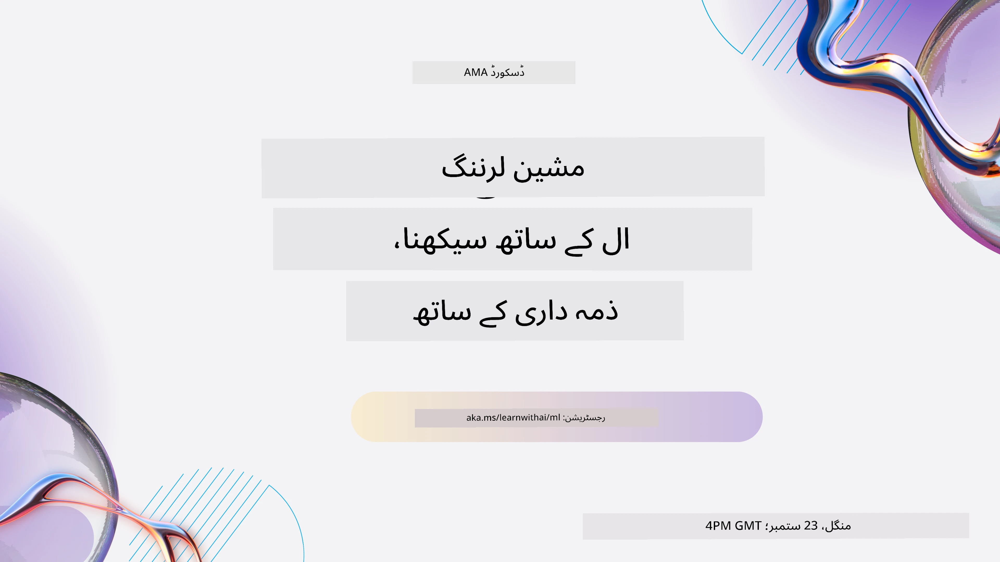
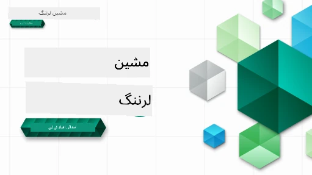

[](https://github.com/microsoft/ML-For-Beginners/blob/master/LICENSE)
[](https://GitHub.com/microsoft/ML-For-Beginners/graphs/contributors/)
[](https://GitHub.com/microsoft/ML-For-Beginners/issues/)
[](https://GitHub.com/microsoft/ML-For-Beginners/pulls/)
[](http://makeapullrequest.com)

[](https://GitHub.com/microsoft/ML-For-Beginners/watchers/)
[](https://GitHub.com/microsoft/ML-For-Beginners/network/)
[](https://GitHub.com/microsoft/ML-For-Beginners/stargazers/)

### 🌐 کثیراللسانی معاونت

#### GitHub ایکشن کے ذریعہ معاونت (خودکار اور ہمیشہ تازہ ترین)

<!-- CO-OP TRANSLATOR LANGUAGES TABLE START -->
[Arabic](../ar/README.md) | [Bengali](../bn/README.md) | [Bulgarian](../bg/README.md) | [Burmese (Myanmar)](../my/README.md) | [Chinese (Simplified)](../zh-CN/README.md) | [Chinese (Traditional, Hong Kong)](../zh-HK/README.md) | [Chinese (Traditional, Macau)](../zh-MO/README.md) | [Chinese (Traditional, Taiwan)](../zh-TW/README.md) | [Croatian](../hr/README.md) | [Czech](../cs/README.md) | [Danish](../da/README.md) | [Dutch](../nl/README.md) | [Estonian](../et/README.md) | [Finnish](../fi/README.md) | [French](../fr/README.md) | [German](../de/README.md) | [Greek](../el/README.md) | [Hebrew](../he/README.md) | [Hindi](../hi/README.md) | [Hungarian](../hu/README.md) | [Indonesian](../id/README.md) | [Italian](../it/README.md) | [Japanese](../ja/README.md) | [Kannada](../kn/README.md) | [Khmer](../km/README.md) | [Korean](../ko/README.md) | [Lithuanian](../lt/README.md) | [Malay](../ms/README.md) | [Malayalam](../ml/README.md) | [Marathi](../mr/README.md) | [Nepali](../ne/README.md) | [Nigerian Pidgin](../pcm/README.md) | [Norwegian](../no/README.md) | [Persian (Farsi)](../fa/README.md) | [Polish](../pl/README.md) | [Portuguese (Brazil)](../pt-BR/README.md) | [Portuguese (Portugal)](../pt-PT/README.md) | [Punjabi (Gurmukhi)](../pa/README.md) | [Romanian](../ro/README.md) | [Russian](../ru/README.md) | [Serbian (Cyrillic)](../sr/README.md) | [Slovak](../sk/README.md) | [Slovenian](../sl/README.md) | [Spanish](../es/README.md) | [Swahili](../sw/README.md) | [Swedish](../sv/README.md) | [Tagalog (Filipino)](../tl/README.md) | [Tamil](../ta/README.md) | [Telugu](../te/README.md) | [Thai](../th/README.md) | [Turkish](../tr/README.md) | [Ukrainian](../uk/README.md) | [Urdu](./README.md) | [Vietnamese](../vi/README.md)

> **کیا آپ لوکل طور پر کلون کرنا پسند کریں گے؟**
>
> یہ ریپوزیٹری 50+ زبانوں کے تراجم شامل کرتی ہے جو ڈاؤن لوڈ سائز کو بہت بڑھا دیتے ہیں۔ تراجم کے بغیر کلون کرنے کے لیے sparse checkout استعمال کریں:
>
> **Bash / macOS / Linux:**
> ```bash
> git clone --filter=blob:none --sparse https://github.com/microsoft/ML-For-Beginners.git
> cd ML-For-Beginners
> git sparse-checkout set --no-cone '/*' '!translations' '!translated_images'
> ```
>
> **CMD (Windows):**
> ```cmd
> git clone --filter=blob:none --sparse https://github.com/microsoft/ML-For-Beginners.git
> cd ML-For-Beginners
> git sparse-checkout set --no-cone "/*" "!translations" "!translated_images"
> ```
>
> اس سے آپ کو کورس مکمل کرنے کے لئے سب کچھ مل جائے گا اور ایک بہت تیز ڈاؤن لوڈ ہوگا۔
<!-- CO-OP TRANSLATOR LANGUAGES TABLE END -->

#### ہماری کمیونٹی میں شامل ہوں

[](https://discord.gg/nTYy5BXMWG)

ہمارے پاس Discord پر Learn with AI سیریز جاری ہے، مزید جاننے اور شامل ہونے کے لیے [Learn with AI Series](https://aka.ms/learnwithai/discord) پر جائیں 18 - 30 ستمبر، 2025۔ آپ کو GitHub Copilot کے ڈیٹا سائنس میں استعمال کے نکات اور ترکیبیں ملیں گی۔



# مشین لرننگ برای مبتدیان - ایک نصاب

> 🌍 دنیا بھر کے ثقافتوں کے ذریعے مشین لرننگ کا سفر کریں 🌍

مائیکروسافٹ کے کلاؤڈ ایڈووکیٹس خوشی سے 12 ہفتوں، 26 اسباق کا نصاب پیش کرتے ہیں جو مکمل طور پر **مشین لرننگ** پر مشتمل ہے۔ اس نصاب میں آپ کو بعض اوقات پہچانے جانے والے **کلاسیکی مشین لرننگ** کے بارے میں سیکھنے کو ملے گا، جو زیادہ تر Scikit-learn لائبریری استعمال کرتا ہے اور گہرے سیکھنے (Deep Learning) سے بچتا ہے، جو ہمارے [AI for Beginners' curriculum](https://aka.ms/ai4beginners) میں شامل ہے۔ اس نصاب کو ہمارے ['Data Science for Beginners' curriculum](https://aka.ms/ds4beginners) کے ساتھ جوڑیں!

ہمارے ساتھ دنیا بھر کی معلومات پر کلاسیکی تکنیکوں کا اطلاق کرتے ہوئے سفر کریں۔ ہر سبق میں پیشگی اور بعد از سبق کوئزز، تحریری ہدایات، حل، مشق اور مزید شامل ہوتے ہیں۔ ہمارا پراجيکٹ پر مبنی طریقہ علم حاصل کرنے اور بنانے کا ایک ثابت شدہ طریقہ ہے جو نئے ہنر کو مضبوط بناتا ہے۔

**✍️ ہمارے مصنفین کا دلی شکریہ** جن لوپر، سٹیفن ہاؤل، فرانسسکا لازیری، ٹومومی امورا، کیسی بریو، دمتری سوشنیکوف، کرس نورنگ، انربن مکھرجی، اورنیلا الٹیونین، روتھ یاکوبو اور ایمی بوئڈ

**🎨 ہمارے مصوروں کا بھی شکریہ** ٹومومی امورا، داسانی مادیپالی، اور جن لوپر

**🙏 خاص شکریہ 🙏 ہمارے مائیکروسافٹ اسٹوڈنٹ ایمبیسیڈر مصنفین، جائزہ لینے والوں اور مواد فراہم کرنے والوں کو** خاص طور پر رشیت ڈاگلی، محمد ساکب خان اینان، روہن راج، الیگزینڈرو پیٹریسکو، ابھیشیک جیسوال، نوورین تبسم، ایوان سیمیلا، اور سگھنڈھا اگروال

**🤩 اور خصوصی شکریہ ہمارے مائیکروسافٹ اسٹوڈنٹ ایمبیسیڈرز ایرک وانجاؤ، جیسلین سونڈی، اور ویدوشی گپتا کو R سبق کے لیے!**

# شروع کریں

ان مراحل کی پیروی کریں:
1. **ریپوزیٹری فورک کریں**: اس صفحہ کے اوپری دائیں جانب "Fork" بٹن پر کلک کریں۔
2. **ریپوزیٹری کلون کریں**:   `git clone https://github.com/microsoft/ML-For-Beginners.git`

> 💡 **تیز آغاز کا اشارہ:** کیا آپ کسی براؤزر میں شروع کرنا چاہتے ہیں بغیر لوکل طور پر Python سیٹ اپ کیے؟ اپنے فورک کے لئے کلاؤڈ ڈیولپمنٹ ماحول بنانے کے لیے [GitHub Codespaces](https://github.com/features/codespaces) استعمال کریں۔ سبز **Code** مینو کھولیں، **Codespaces** منتخب کریں، اور ایک codespace بنائیں؛ ہر سبق کی ضروری dependencies اس میں انسٹال کریں۔

> [اس کورس کے تمام اضافی وسائل ہماری Microsoft Learn کلیکشن میں دیکھیں](https://learn.microsoft.com/en-us/collections/qrqzamz1nn2wx3?WT.mc_id=academic-77952-bethanycheum)

> 🔧 **مدد چاہیے؟** عام مسائل کے حل کے لیے ہمارا [Troubleshooting Guide](TROUBLESHOOTING.md) دیکھیں، خاص طور پر تنصیب، کنفیگریشن، اور سبق چلانے سے متعلق۔


**[طلباء](https://aka.ms/student-page)**، اس نصاب کو استعمال کرنے کے لیے، پورا ریپو اپنے GitHub اکاؤنٹ پر فورک کریں اور مشقیں خود یا گروپ کے ساتھ مکمل کریں:

- پری لیکچر کوئز سے شروع کریں۔
- لیکچر پڑھیں اور سرگرمیاں مکمل کریں، ہر knowledge check پر رک کر غور کریں۔
- حل کوڈ چلانے کی بجائے سبق کو سمجھ کر پروجیکٹس بنانے کی کوشش کریں؛ تاہم وہ کوڈ ہر پروجیکٹ کے `/solution` فولڈرز میں دستیاب ہے۔
- پوسٹ لیکچر کوئز دیں۔
- چیلنج مکمل کریں۔
- اسائنمنٹ مکمل کریں۔
- سبق گروپ مکمل کرنے کے بعد، [Discussion Board](https://github.com/microsoft/ML-For-Beginners/discussions) پر جائیں اور مناسب PAT روبریک بھر کر "голос سے سیکھیں"۔ 'PAT' ایک Progress Assessment Tool ہے جو آپ کی تعلیم کو آگے بڑھاتا ہے۔ آپ دوسرے PATs پر بھی ردعمل دے سکتے ہیں تاکہ ہم مل کر سیکھیں۔

> مزید مطالعے کے لیے، ہم یہ [Microsoft Learn](https://docs.microsoft.com/en-us/users/jenlooper-2911/collections/k7o7tg1gp306q4?WT.mc_id=academic-77952-leestott) ماڈیولز اور لرننگ پاتھس کی سفارش کرتے ہیں۔

**اساتذہ**، ہم نے [کچھ تجاویز](for-teachers.md) شامل کی ہیں کہ اس نصاب کو کیسے استعمال کیا جائے۔

---

## ویڈیو واک تھروز

کچھ اسباق مختصر ویڈیو کی شکل میں دستیاب ہیں۔ آپ یہ سب اسباق کے اندر یا [ML for Beginners کی پلے لسٹ مائیکروسافٹ ڈیولپر یوٹیوب چینل](https://aka.ms/ml-beginners-videos) پر نیچے تصویر پر کلک کر کے دیکھ سکتے ہیں۔

[](https://aka.ms/ml-beginners-videos)

---

## ٹیم سے ملاقات کریں

[](https://youtu.be/Tj1XWrDSYJU)

**گیف بذریعہ** [Mohit Jaisal](https://linkedin.com/in/mohitjaisal)

> 🎥 پروجیکٹ اور اس کے تخلیق کاروں کے بارے میں ویڈیو دیکھنے کے لیے اوپر تصویر پر کلک کریں!

---

## تدریسی طریقہ کار

ہم نے اس نصاب کی تیاری میں دو تدریسی اصول اپنائے ہیں: یہ یقینی بنانا کہ یہ ہاتھوں سے کرنے والا **پروجیکٹ پر مبنی** ہو اور اس میں **بار بار کوئزز** شامل ہوں۔ اس کے علاوہ، اس نصاب میں ایک مشترکہ **موضوع** بھی ہے جو اس کی ہم آہنگی کو بڑھاتا ہے۔

مواد کو پروجیکٹس سے منسلک کر کے، عمل طلباء کے لیے زیادہ دلچسپ بن جاتا ہے اور تصورات کو یاد رکھنے میں مدد ملتی ہے۔ ایک کم دباؤ والا کوئز کلاس سے پہلے یہ تعلیمی موضوع کی جانب طالب علم کا ارادہ قائم کرتا ہے، اور دوسرا کوئز کلاس کے بعد یادداشت کو مضبوط کرتا ہے۔ یہ نصاب لچکدار اور دلچسپ ہے اور اسے مکمل یا جزوی طور پر کیا جا سکتا ہے۔ پروجیکٹس چھوٹے سے شروع ہوتے ہیں اور 12 ہفتوں کے دوران زیادہ پیچیدہ ہوتے جاتے ہیں۔ نصاب میں مشین لرننگ کے حقیقی دنیا کے اطلاقات کا ایک پس منظر بھی شامل ہے، جو اضافی کریڈٹ یا بحث کا موضوع بن سکتا ہے۔

> ہمارا [کوڈ آف کنڈکٹ](CODE_OF_CONDUCT.md)، [حوالہ کاری](CONTRIBUTING.md)، [ترجمے](..) اور [مسائل کا حل](TROUBLESHOOTING.md) کی رہنما ہدایات دیکھیں۔ ہمیں آپ کی تعمیری رائے خوش آمدید ہے!

## ہر سبق میں شامل ہیں

- اختیاری سکیچ نوٹس
- اختیاری اضافی ویڈیو
- ویڈیو واک تھرو (کچھ اسباق میں)
- [پری لیکچر وارم اپ کوئز](https://ff-quizzes.netlify.app/en/ml/)
- تحریری سبق
- پروجیکٹ بیسڈ اسباق کیلئے پروجیکٹ بنانے کے مرحلہ وار رہنما اصول
- نالج چیکس
- ایک چیلنج
- اضافی مطالعہ
- اسائنمنٹ
- [پوسٹ لیکچر کوئز](https://ff-quizzes.netlify.app/en/ml/)

> **زبانوں کے بارے میں نوٹ**: یہ اسباق بنیادی طور پر Python میں لکھے گئے ہیں، لیکن بہت سے R میں بھی دستیاب ہیں۔ R سبق مکمل کرنے کے لیے `/solution` فولڈر میں جائیں اور R کے اسباق تلاش کریں۔ ان میں .rmd ایکسٹینشن ہوتی ہے جو ایک **R Markdown** فائل کی نمائندگی کرتی ہے، جو `code chunks` (R یا دوسری زبانوں کے) اور `YAML header` (جو PDF جیسے آؤٹ پٹس کو فارمیٹ کرنے کی رہنمائی کرتا ہے) کو مارک ڈاؤن دستاویز میں شامل کرنے کا ایک آلہ ہے۔ اس طرح یہ ڈیٹا سائنس کی بہترین لکھی جاتی ہے کیونکہ اس میں آپ اپنے کوڈ، اس کا آؤٹ پٹ، اور اپنے خیالات کو مارک ڈاؤن میں لکھ سکتے ہیں۔ مزید برآں، R Markdown دستاویزات کو PDF، HTML، یا Word جیسے آؤٹ پٹ فارمیٹس میں کنورٹ کیا جا سکتا ہے۔

> **کوئزز کے بارے میں نوٹ**: تمام کوئزز [Quiz App فولڈر](../../quiz-app) میں موجود ہیں، کل 52 کوئزز، ہر ایک میں تین سوالات۔ یہ اسباق سے منسلک ہیں لیکن کوئز ایپ کو لوکل چلایا جا سکتا ہے؛ `quiz-app` فولڈر کی ہدایات پر عمل کریں یا Azure پر تعینات کریں۔

| سبق نمبر |                             موضوع                              |                   سبق کا گروپ                   | تعلیمی مقاصد                                                                                                             |                                                              متعلقہ سبق                                                               |                        مصنف                        |
| :-----------: | :------------------------------------------------------------: | :-------------------------------------------------: | ------------------------------------------------------------------------------------------------------------------------------- | :--------------------------------------------------------------------------------------------------------------------------------------: | :--------------------------------------------------: |
|      01       |                مشین لرننگ کا تعارف                |      [Introduction](1-Introduction/README.md)       | مشین لرننگ کے بنیادی تصورات سیکھیں                                                                                |                                             [Lesson](1-Introduction/1-intro-to-ML/README.md)                                             |                       محمد                       |
|      02       |                مشین لرننگ کی تاریخ                 |      [Introduction](1-Introduction/README.md)       | اس میدان کی تاریخ سیکھیں                                                                                         |                                            [Lesson](1-Introduction/2-history-of-ML/README.md)                                            |                     جین اور ایمی                      |
|      03       |                 انصاف اور مشین لرننگ                  |      [Introduction](1-Introduction/README.md)       | انصاف کے گرد اہم فلسفیانہ مسائل کیا ہیں جو طلباء کو ML ماڈلز بنانے اور استعمال کرتے وقت غور کرنا چاہیے؟ |                                              [Lesson](1-Introduction/3-fairness/README.md)                                               |                        ٹومومی                        |
|      04       |                مشین لرننگ کے تکنیکیں                 |      [Introduction](1-Introduction/README.md)       | ML ماڈلز بنانے کے لیے ML محققین کون سی تکنیکیں استعمال کرتے ہیں؟                                                                       |                                          [Lesson](1-Introduction/4-techniques-of-ML/README.md)                                           |                    کرس اور جین                     |
|      05       |                   رجریشن کا تعارف                   |        [Regression](2-Regression/README.md)         | رجریشن ماڈلز کے لیے Python اور Scikit-learn کے ساتھ شروعات کریں                                                                  |         [Python](2-Regression/1-Tools/README.md) • [R](../../2-Regression/1-Tools/solution/R/lesson_1.html)         |      جین • ایرک وانجاؤ       |
|      06       |                شمالی امریکہ کی کدو کی قیمتیں 🎃                |        [Regression](2-Regression/README.md)         | ML کی تیاری کے لیے ڈیٹا کو ویژولائز اور صاف کریں                                                                                  |          [Python](2-Regression/2-Data/README.md) • [R](../../2-Regression/2-Data/solution/R/lesson_2.html)          |      جین • ایرک وانجاؤ       |
|      07       |                شمالی امریکہ کی کدو کی قیمتیں 🎃                |        [Regression](2-Regression/README.md)         | خطی اور کثیر رکنی رجریشن ماڈلز بنائیں                                                                                   |        [Python](2-Regression/3-Linear/README.md) • [R](../../2-Regression/3-Linear/solution/R/lesson_3.html)        |      جین، دمتری اور ایرک وانجاؤ       |
|      08       |                شمالی امریکہ کی کدو کی قیمتیں 🎃                |        [Regression](2-Regression/README.md)         | لاجسٹک رجریشن ماڈل بنائیں                                                                                               |     [Python](2-Regression/4-Logistic/README.md) • [R](../../2-Regression/4-Logistic/solution/R/lesson_4.html)      |      جین • ایرک وانجاؤ       |
|      09       |                          ایک ویب ایپ 🔌                          |           [Web App](3-Web-App/README.md)            | اپنی تربیت یافتہ ماڈل استعمال کرنے کے لیے ویب ایپ بنائیں                                                                                       |                                                 [Python](3-Web-App/1-Web-App/README.md)                                                  |                         جین                          |
|      10       |                 درجہ بندی کا تعارف                 |    [Classification](4-Classification/README.md)     | اپنے ڈیٹا کو صاف، تیار اور ویژولائز کریں؛ درجہ بندی کا تعارف                                                            | [Python](4-Classification/1-Introduction/README.md) • [R](../../4-Classification/1-Introduction/solution/R/lesson_10.html)  | جین اور کیسی • ایرک وانجاؤ |
|      11       |             مزیدار ایشیائی اور ہندوستانی کھانے 🍜             |    [Classification](4-Classification/README.md)     | درجہ بندی کنندگان کا تعارف                                                                                                     | [Python](4-Classification/2-Classifiers-1/README.md) • [R](../../4-Classification/2-Classifiers-1/solution/R/lesson_11.html) | جین اور کیسی • ایرک وانجاؤ |
|      12       |             مزیدار ایشیائی اور ہندوستانی کھانے 🍜             |    [Classification](4-Classification/README.md)     | مزید درجہ بندی کنندگان                                                                                                                | [Python](4-Classification/3-Classifiers-2/README.md) • [R](../../4-Classification/3-Classifiers-2/solution/R/lesson_12.html) | جین اور کیسی • ایرک وانجاؤ |
|      13       |             مزیدار ایشیائی اور ہندوستانی کھانے 🍜             |    [Classification](4-Classification/README.md)     | اپنے ماڈل کا استعمال کرتے ہوئے ایک تجویز کنندہ ویب ایپ بنائیں                                                                                    |                                              [Python](4-Classification/4-Applied/README.md)                                              |                         جین                          |
|      14       |                   کلسٹرنگ کا تعارف                   |        [Clustering](5-Clustering/README.md)         | اپنے ڈیٹا کو صاف، تیار اور ویژولائز کریں؛ کلسٹرنگ کا تعارف                                                                |         [Python](5-Clustering/1-Visualize/README.md) • [R](../../5-Clustering/1-Visualize/solution/R/lesson_14.html)         |      جین • ایرک وانجاؤ       |
|      15       |              نائجیریائی موسیقی کے ذائقے دریافت کریں 🎧              |        [Clustering](5-Clustering/README.md)         | K-Means کلسٹرنگ طریقہ دریافت کریں                                                                                           |           [Python](5-Clustering/2-K-Means/README.md) • [R](../../5-Clustering/2-K-Means/solution/R/lesson_15.html)           |      جین • ایرک وانجاؤ       |
|      16       |        قدرتی زبان کی پروسیسنگ کا تعارف ☕️         |   [Natural language processing](6-NLP/README.md)    | ایک سادہ بوٹ بنا کر NLP کی بنیادیں سیکھیں                                                                             |                                             [Python](6-NLP/1-Introduction-to-NLP/README.md)                                              |                       اسٹیفن                        |
|      17       |                      عام NLP کام ☕️                      |   [Natural language processing](6-NLP/README.md)    | زبانوں کی ساختوں سے نمٹنے کے لیے درکار عام کاموں کو سمجھ کر اپنی NLP کی معلومات گہری کریں                          |                                                    [Python](6-NLP/2-Tasks/README.md)                                                     |                       اسٹیفن                        |
|      18       |             ترجمہ اور جذبات کی تشخیص ♥️              |   [Natural language processing](6-NLP/README.md)    | جین آسٹن کے ساتھ ترجمہ اور جذبات کی تشخیص                                                                             |                                            [Python](6-NLP/3-Translation-Sentiment/README.md)                                             |                       اسٹیفن                        |
|      19       |                  یورپ کے رومانوی ہوٹلز ♥️                  |   [Natural language processing](6-NLP/README.md)    | ہوٹل کے جائزوں کے ساتھ جذباتی تجزیہ 1                                                                                         |                                               [Python](6-NLP/4-Hotel-Reviews-1/README.md)                                                |                       اسٹیفن                        |
|      20       |                  یورپ کے رومانوی ہوٹلز ♥️                  |   [Natural language processing](6-NLP/README.md)    | ہوٹل کے جائزوں کے ساتھ جذباتی تجزیہ 2                                                                                         |                                               [Python](6-NLP/5-Hotel-Reviews-2/README.md)                                                |                       اسٹیفن                        |
|      21       |            وقت کی ترتیب کی پیش گوئی کا تعارف             |        [Time series](7-TimeSeries/README.md)        | وقت کی ترتیب کی پیش گوئی کا تعارف                                                                                         |                                             [Python](7-TimeSeries/1-Introduction/README.md)                                              |                      فرانسسکا                       |
|      22       | ⚡️ عالمی بجلی کا استعمال ⚡️ - ARIMA کے ساتھ وقت کی ترتیب کی پیش گوئی |        [Time series](7-TimeSeries/README.md)        | ARIMA کے ساتھ وقت کی ترتیب کی پیش گوئی                                                                                              |                                                 [Python](7-TimeSeries/2-ARIMA/README.md)                                                 |                      فرانسسکا                       |
|      23       |  ⚡️ عالمی بجلی کا استعمال ⚡️ - SVR کے ساتھ وقت کی ترتیب کی پیش گوئی  |        [Time series](7-TimeSeries/README.md)        | سپورٹ ویکٹر ریگریسر کے ساتھ وقت کی ترتیب کی پیش گوئی                                                                           |                                                  [Python](7-TimeSeries/3-SVR/README.md)                                                  |                       انربن                        |
|      24       |             تقویتی سیکھنے کا تعارف             | [Reinforcement learning](8-Reinforcement/README.md) | کیو-لرننگ کے ساتھ تقویتی سیکھنے کا تعارف                                                                          |                                             [Python](8-Reinforcement/1-QLearning/README.md)                                              |                        دمتری                        |
|      25       |                 پیٹر کو بھیڑیا سے بچانے میں مدد کریں! 🐺                  | [Reinforcement learning](8-Reinforcement/README.md) | تقویتی سیکھنے کا جم                                                                                                      |                                                [Python](8-Reinforcement/2-Gym/README.md)                                                 |                        دمتری                        |
|  Postscript   |            حقیقی دنیا میں ML کے منظرنامے اور اطلاقات            |      [ML in the Wild](9-Real-World/README.md)       | کلاسیکی ML کے دلچسپ اور انکشاف کرنے والے حقیقی دنیا کے اطلاقات                                                               |                                             [Lesson](9-Real-World/1-Applications/README.md)                                              |                         ٹیم                         |
|  Postscript   |            RAI ڈیش بورڈ کے ذریعے ML میں ماڈل کی ڈی بگنگ            |      [ML in the Wild](9-Real-World/README.md)       | ذمہ دار AI ڈیش بورڈ کے اجزاء کا استعمال کرتے ہوئے مشین لرننگ میں ماڈل کی ڈی بگنگ                                                              |                                             [Lesson](9-Real-World/2-Debugging-ML-Models/README.md)                                              |                     روتھ یاکوبو                      |

> [اس کورس کے تمام اضافی وسائل ہماری Microsoft Learn کلیکشن میں تلاش کریں](https://learn.microsoft.com/en-us/collections/qrqzamz1nn2wx3?WT.mc_id=academic-77952-bethanycheum)

## آف لائن رسائی

آپ اس دستاویزات کو آف لائن [Docsify](https://docsify.js.org/#/) استعمال کرکے چلا سکتے ہیں۔ اس ریپو کو فورک کریں، [Docsify انسٹال کریں](https://docsify.js.org/#/quickstart) اپنے مقامی کمپیوٹر پر، اور پھر اس ریپو کے روٹ فولڈر میں، `docsify serve` ٹائپ کریں۔ ویب سائٹ آپ کے لوکل ہوسٹ پر پورٹ 3000 پر سرور ہوگی: `localhost:3000`.

## پی ڈی ایف

نصاب کا ایک پی ڈی ایف لنکس کے ساتھ [یہاں](https://microsoft.github.io/ML-For-Beginners/pdf/readme.pdf) ملیں۔


## 🎒 دیگر کورسز 

ہماری ٹیم دیگر کورسز بھی تیار کرتی ہے! دیکھیں:

<!-- CO-OP TRANSLATOR OTHER COURSES START -->
### LangChain
[](https://aka.ms/langchain4j-for-beginners)
[](https://aka.ms/langchainjs-for-beginners?WT.mc_id=m365-94501-dwahlin)
[](https://github.com/microsoft/langchain-for-beginners?WT.mc_id=m365-94501-dwahlin)
---

### Azure / Edge / MCP / Agents
[](https://github.com/microsoft/AZD-for-beginners?WT.mc_id=academic-105485-koreyst)
[](https://github.com/microsoft/edgeai-for-beginners?WT.mc_id=academic-105485-koreyst)
[](https://github.com/microsoft/mcp-for-beginners?WT.mc_id=academic-105485-koreyst)
[](https://github.com/microsoft/ai-agents-for-beginners?WT.mc_id=academic-105485-koreyst)

---
 
### جنریٹو AI سیریز
[](https://github.com/microsoft/generative-ai-for-beginners?WT.mc_id=academic-105485-koreyst)
[-9333EA?style=for-the-badge&labelColor=E5E7EB&color=9333EA)](https://github.com/microsoft/Generative-AI-for-beginners-dotnet?WT.mc_id=academic-105485-koreyst)
[-C084FC?style=for-the-badge&labelColor=E5E7EB&color=C084FC)](https://github.com/microsoft/generative-ai-for-beginners-java?WT.mc_id=academic-105485-koreyst)
[-E879F9?style=for-the-badge&labelColor=E5E7EB&color=E879F9)](https://github.com/microsoft/generative-ai-with-javascript?WT.mc_id=academic-105485-koreyst)

---
 
### کور لرننگ
[](https://aka.ms/ml-beginners?WT.mc_id=academic-105485-koreyst)
[](https://aka.ms/datascience-beginners?WT.mc_id=academic-105485-koreyst)
[](https://aka.ms/ai-beginners?WT.mc_id=academic-105485-koreyst)
[](https://github.com/microsoft/Security-101?WT.mc_id=academic-96948-sayoung)
[](https://aka.ms/webdev-beginners?WT.mc_id=academic-105485-koreyst)
[](https://aka.ms/iot-beginners?WT.mc_id=academic-105485-koreyst)
[](https://github.com/microsoft/xr-development-for-beginners?WT.mc_id=academic-105485-koreyst)

---
 
### کوپائلٹ سیریز
[](https://aka.ms/GitHubCopilotAI?WT.mc_id=academic-105485-koreyst)
[](https://github.com/microsoft/mastering-github-copilot-for-dotnet-csharp-developers?WT.mc_id=academic-105485-koreyst)
[](https://github.com/microsoft/CopilotAdventures?WT.mc_id=academic-105485-koreyst)
<!-- CO-OP TRANSLATOR OTHER COURSES END -->

## مدد حاصل کرنا

اگر آپ مشین لرننگ سیکھتے ہوئے یا AI ایپلیکیشنز بناتے ہوئے پھنس جائیں یا سوالات ہوں تو فکر نہ کریں — مدد دستیاب ہے۔

آپ دوسرے سیکھنے والوں اور ڈویلپرز کے ساتھ مباحثوں میں شامل ہوسکتے ہیں، سوالات پوچھ سکتے ہیں، اور اپنی تجاویز کمیونٹی کے ساتھ شیئر کر سکتے ہیں۔

- سوالات پوچھنے اور دوسروں کے ساتھ سیکھنے کے لیے کمیونٹی میں شامل ہوں
- مشین لرننگ کے تصورات اور پروجیکٹ آئیڈیاز پر گفتگو کریں
- تجربہ کار ڈویلپرز سے رہنمائی حاصل کریں

ایک معاون کمیونٹی اپنے ہنر کو بڑھانے اور مسائل کو تیزی سے حل کرنے کا بہترین طریقہ ہے۔

[Microsoft Foundry Discord Community](https://discord.gg/nTYy5BXMWG)

اگر آپ کو بگ، ایرر یا بہتری کی تجاویز ملیں تو آپ اس ریپوزیٹری میں ایک **Issue** بھی کھول سکتے ہیں تاکہ مسئلہ رپورٹ کیا جا سکے۔

مصنوعات کی رائے کے لیے یا موجودہ کمیونٹی پوسٹس کی تلاش کے لیے، ڈیویلپر فورم پر جائیں:

[](https://aka.ms/foundry/forum)

## اضافی سیکھنے کے نکات

- بہتر سمجھ کے لیے ہر سبق کے بعد نوٹ بکس کا جائزہ لیں۔
- خود الگوردمز کو عمل میں لانے کی مشق کریں۔
- سیکھی گئی تصورات کا استعمال کرتے ہوئے حقیقی دنیا کے ڈیٹا سیٹس کو دریافت کریں۔

---

<!-- CO-OP TRANSLATOR DISCLAIMER START -->
**ڈس کلیمر**:
یہ دستاویز AI ترجمہ سروس [Co-op Translator](https://github.com/Azure/co-op-translator) کے ذریعے ترجمہ کی گئی ہے۔ جبکہ ہم درستگی کے لیے کوشاں ہیں، براہ کرم اس بات سے آگاہ رہیں کہ خودکار ترجمے میں غلطیاں یا عدم درستیاں ہو سکتی ہیں۔ اصل دستاویز اپنے مادری زبان میں مستند ماخذ سمجھی جائے گی۔ حساس معلومات کے لیے پیشہ ور انسانی ترجمہ کی سفارش کی جاتی ہے۔ اس ترجمے کے استعمال سے پیدا ہونے والی کسی بھی غلط فہمی یا غلط تشریح کی ذمہ داری ہم قبول نہیں کرتے۔
<!-- CO-OP TRANSLATOR DISCLAIMER END -->