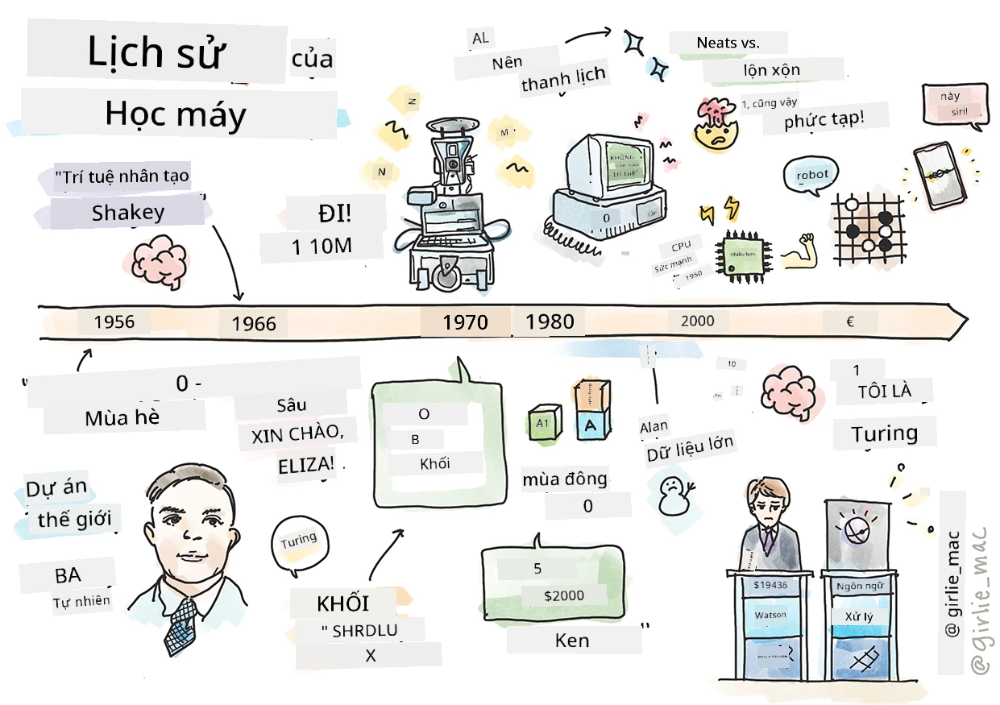
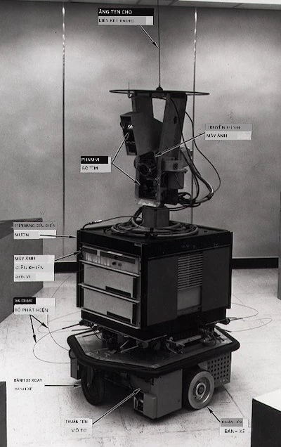
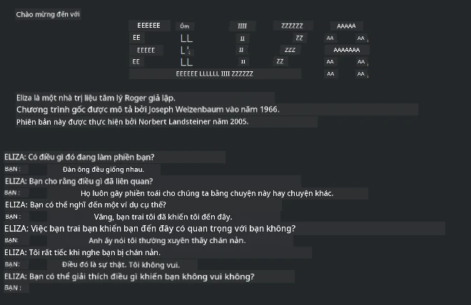

# Lịch sử học máy

> Ghi chú phác thảo bởi [Tomomi Imura](https://www.twitter.com/girlie_mac)

## [Bài kiểm tra trước bài giảng](https://ff-quizzes.netlify.app/en/ml/)

---

> 🎥 Nhấp vào hình ảnh trên để xem video ngắn đi qua bài học này.

Trong bài học này, chúng ta sẽ cùng đi qua những cột mốc quan trọng trong lịch sử của học máy và trí tuệ nhân tạo.

Lịch sử của trí tuệ nhân tạo (AI) như một lĩnh vực gắn liền với lịch sử học máy, vì các thuật toán và tiến bộ tính toán làm nền tảng cho ML đã đóng góp vào sự phát triển của AI. Cần ghi nhớ rằng, trong khi các lĩnh vực này như các lĩnh vực nghiên cứu riêng biệt bắt đầu định hình vào những năm 1950, những [phát hiện quan trọng về thuật toán, thống kê, toán học, tính toán và kỹ thuật](https://wikipedia.org/wiki/Timeline_of_machine_learning) đã xuất hiện và chồng lấn trước thời đại này. Thực tế, con người đã suy nghĩ về những câu hỏi này trong [hàng trăm năm](https://wikipedia.org/wiki/History_of_artificial_intelligence): bài viết này thảo luận về nền tảng trí tuệ lịch sử của ý tưởng 'máy suy nghĩ.'

---
## Những phát hiện đáng chú ý

- 1763, 1812 [Định lý Bayes](https://wikipedia.org/wiki/Bayes%27_theorem) và các tiền thân của nó. Định lý và ứng dụng của nó làm nền tảng cho suy luận, mô tả xác suất xảy ra một sự kiện dựa trên kiến thức trước đó.
- 1805 [Lý thuyết Bình phương tối thiểu](https://wikipedia.org/wiki/Least_squares) bởi nhà toán học Pháp Adrien-Marie Legendre. Lý thuyết này, bạn sẽ học trong phần Hồi quy, giúp trong việc phù hợp dữ liệu.
- 1913 [Chuỗi Markov](https://wikipedia.org/wiki/Markov_chain), được đặt theo tên nhà toán học Nga Andrey Markov, được dùng để mô tả một chuỗi các sự kiện có thể xảy ra dựa trên trạng thái trước đó.
- 1957 [Perceptron](https://wikipedia.org/wiki/Perceptron) là một loại bộ phân loại tuyến tính do nhà tâm lý học Mỹ Frank Rosenblatt phát minh, làm nền tảng cho các tiến bộ trong học sâu.

---

- 1967 [Láng giềng gần nhất](https://wikipedia.org/wiki/Nearest_neighbor) là một thuật toán ban đầu thiết kế để lập bản đồ lộ trình. Trong bối cảnh ML, nó được dùng để phát hiện các mẫu.
- 1970 [Lan truyền ngược](https://wikipedia.org/wiki/Backpropagation) được dùng để huấn luyện [mạng nơ-ron tiến](https://wikipedia.org/wiki/Feedforward_neural_network).
- 1982 [Mạng nơ-ron hồi tiếp](https://wikipedia.org/wiki/Recurrent_neural_network) là các mạng nơ-ron nhân tạo được phát triển từ mạng nơ-ron tiến tạo thành các đồ thị theo thời gian.

✅ Hãy làm một chút nghiên cứu. Những ngày nào khác nổi bật như là bước ngoặt trong lịch sử ML và AI?

---
## 1950: Máy tính có thể suy nghĩ

Alan Turing, một người thực sự đáng chú ý, được [công chúng bầu chọn vào năm 2019](https://wikipedia.org/wiki/Icons:_The_Greatest_Person_of_the_20th_Century) là nhà khoa học vĩ đại nhất của thế kỷ 20, được ghi nhận đã giúp đặt nền móng cho khái niệm 'máy có thể suy nghĩ.' Ông đã đối mặt với những người hoài nghi và nhu cầu của chính mình về bằng chứng thực nghiệm của khái niệm này bằng cách phần nào tạo ra [Bài kiểm tra Turing](https://www.bbc.com/news/technology-18475646), bạn sẽ khám phá trong các bài học NLP của chúng ta.

---
## 1956: Dự án nghiên cứu mùa hè Dartmouth

"Dự án nghiên cứu mùa hè Dartmouth về trí tuệ nhân tạo là một sự kiện then chốt cho lĩnh vực trí tuệ nhân tạo," và tại đây thuật ngữ 'trí tuệ nhân tạo' đã được đặt ra ([nguồn](https://250.dartmouth.edu/highlights/artificial-intelligence-ai-coined-dartmouth)).

> Mọi khía cạnh của việc học hay bất kỳ đặc điểm nào khác của trí tuệ có thể được mô tả chính xác đến mức một cỗ máy có thể được tạo ra để giả lập nó.

---

Nhà nghiên cứu chính, giáo sư toán học John McCarthy, hy vọng "tiến hành trên cơ sở giả thuyết rằng mọi khía cạnh của việc học hoặc bất kỳ đặc điểm nào khác của trí tuệ đều có thể được mô tả chính xác đến mức một cỗ máy có thể giả lập nó." Các thành viên tham gia bao gồm một nhân vật nổi bật khác trong lĩnh vực, Marvin Minsky.

Hội thảo được ghi nhận đã khởi xướng và khuyến khích một số cuộc thảo luận bao gồm "sự trỗi dậy của các phương pháp ký hiệu, các hệ thống tập trung vào miền hạn chế (hệ chuyên gia đầu tiên), và hệ suy diễn so với hệ quy nạp." ([nguồn](https://wikipedia.org/wiki/Dartmouth_workshop)).

---
## 1956 - 1974: "Những năm vàng"

Từ những năm 1950 đến giữa những năm 70, sự lạc quan rất cao về hy vọng AI có thể giải quyết nhiều vấn đề. Năm 1967, Marvin Minsky tự tin tuyên bố rằng "Trong vòng một thế hệ ... vấn đề tạo ra 'trí tuệ nhân tạo' sẽ được giải quyết phần lớn." (Minsky, Marvin (1967), Computation: Finite and Infinite Machines, Englewood Cliffs, N.J.: Prentice-Hall)

Nghiên cứu xử lý ngôn ngữ tự nhiên phát triển mạnh, tìm kiếm được tinh chỉnh và làm mạnh mẽ hơn, và khái niệm 'thế giới vi mô' được tạo ra, nơi các tác vụ đơn giản được thực hiện bằng các hướng dẫn bằng ngôn ngữ rõ ràng.

---

Nghiên cứu được cấp vốn tốt bởi các cơ quan chính phủ, tiến bộ về tính toán và thuật toán được thực hiện, và các bản mẫu của các máy thông minh được xây dựng. Một số máy này bao gồm:

* [Shakey robot](https://wikipedia.org/wiki/Shakey_the_robot), có thể di chuyển và quyết định cách thực hiện các nhiệm vụ một cách 'thông minh'.

    
    > Shakey năm 1972

---

* Eliza, một 'chatterbot' sơ khai, có thể trò chuyện với con người và đóng vai trò như một 'nhà trị liệu' nguyên thủy. Bạn sẽ học thêm về Eliza trong các bài học NLP.

    
    > Một phiên bản của Eliza, một chatbot

---

* "Thế giới khối hộp" là một ví dụ về thế giới vi mô nơi các khối có thể được xếp chồng và sắp xếp, và các thí nghiệm trong việc dạy máy ra quyết định có thể được thử nghiệm. Các tiến bộ xây dựng với thư viện như [SHRDLU](https://wikipedia.org/wiki/SHRDLU) đã giúp đẩy mạnh xử lý ngôn ngữ.

    

    > 🎥 Nhấp vào hình ảnh trên cho video: Thế giới khối hộp với SHRDLU

---
## 1974 - 1980: "Mùa đông AI"

Đến giữa những năm 1970, rõ ràng là sự phức tạp của việc tạo ra 'máy thông minh' đã bị đánh giá thấp và lời hứa này, dựa vào sức mạnh tính toán hiện có, đã bị thổi phồng quá mức. Nguồn tài trợ cạn kiệt và niềm tin vào lĩnh vực này giảm xuống. Một số vấn đề ảnh hưởng đến sự tự tin bao gồm:
---
- **Hạn chế**. Sức mạnh tính toán quá hạn chế.
- **Nổ tổ hợp**. Số lượng tham số cần huấn luyện tăng theo hàm mũ khi yêu cầu máy tính nhiều hơn, mà sức mạnh và khả năng tính toán không tiến hóa song song.
- **Thiếu dữ liệu**. Có ít dữ liệu làm cản trở quá trình kiểm thử, phát triển và tinh chỉnh thuật toán.
- **Chúng ta có đang hỏi đúng câu hỏi không?**. Những câu hỏi đang được đặt ra bắt đầu bị nghi ngờ. Các nhà nghiên cứu bắt đầu nhận chỉ trích về các phương pháp của họ:
  - Các bài kiểm tra Turing bị đặt câu hỏi với các ý tưởng như 'lý thuyết phòng Trung Quốc' cho rằng, "lập trình một máy tính số có thể tạo vẻ như hiểu ngôn ngữ nhưng không thể tạo ra sự hiểu biết thực sự." ([nguồn](https://plato.stanford.edu/entries/chinese-room/))
  - Đạo đức khi đưa các trí tuệ nhân tạo như "nhà trị liệu" ELIZA vào xã hội bị thách thức.

---

Đồng thời, các trường phái AI khác nhau bắt đầu hình thành. Một sự phân đôi được thiết lập giữa các thực hành ["AI lộn xộn" vs. "AI gọn gàng"](https://wikipedia.org/wiki/Neats_and_scruffies). Phòng thí nghiệm _lộn xộn_ điều chỉnh chương trình hàng giờ cho đến khi đạt kết quả mong muốn. Phòng thí nghiệm _gọn gàng_ "tập trung vào logic và giải quyết vấn đề chính thức." ELIZA và SHRDLU là các hệ thống _lộn xộn_ nổi tiếng. Vào những năm 1980, khi nhu cầu tạo hệ thống ML có thể tái tạo xuất hiện, phương pháp _gọn gàng_ dần chiếm ưu thế vì kết quả của nó dễ giải thích hơn.

---
## Các hệ chuyên gia những năm 1980

Khi lĩnh vực phát triển, lợi ích của nó đối với kinh doanh trở nên rõ ràng hơn, và trong những năm 1980 cũng vậy với sự phổ biến của các 'hệ chuyên gia'. "Các hệ chuyên gia là một trong những phần mềm trí tuệ nhân tạo (AI) đầu tiên thực sự thành công." ([nguồn](https://wikipedia.org/wiki/Expert_system)).

Loại hệ thống này thực sự _lai_, bao gồm một phần là động cơ quy tắc để xác định yêu cầu kinh doanh, và một động cơ suy luận tận dụng hệ thống quy tắc để suy ra các sự thật mới.

Thời kỳ này cũng chứng kiến sự chú ý ngày càng tăng đến mạng nơ-ron.

---
## 1987 - 1993: 'Thời kỳ yên tĩnh' của AI

Việc nhân rộng các thiết bị chuyên dụng cho hệ chuyên gia đã dẫn đến sự quá đặc thù. Sự trỗi dậy của máy tính cá nhân cũng cạnh tranh với các hệ thống lớn, chuyên dụng, tập trung này. Việc dân chủ hóa máy tính đã bắt đầu, và cuối cùng mở đường cho sự bùng nổ dữ liệu lớn hiện đại.

---
## 1993 - 2011

Thời kỳ này chứng kiến kỷ nguyên mới cho ML và AI có thể giải quyết một số vấn đề do thiếu dữ liệu và sức mạnh tính toán trước đó gây ra. Lượng dữ liệu bắt đầu tăng nhanh và trở nên phổ biến hơn, cả tốt và xấu, đặc biệt với sự xuất hiện của điện thoại thông minh khoảng năm 2007. Sức mạnh tính toán mở rộng theo cấp số nhân, và thuật toán phát triển song song. Lĩnh vực bắt đầu trưởng thành khi những ngày tự do của quá khứ bắt đầu định hình thành một ngành khoa học thực thụ.

---
## Hiện nay

Ngày nay học máy và AI chạm tới hầu như mọi phần trong cuộc sống của chúng ta. Kỷ nguyên này đòi hỏi sự hiểu biết cẩn trọng về các rủi ro và tác động tiềm năng của các thuật toán này đối với cuộc sống con người. Như Brad Smith của Microsoft đã phát biểu, "Công nghệ thông tin đặt ra các vấn đề liên quan đến các quyền cơ bản của con người như quyền riêng tư và tự do ngôn luận. Những vấn đề này nâng cao trách nhiệm của các công ty công nghệ tạo ra các sản phẩm này. Theo quan điểm của chúng tôi, nó cũng đòi hỏi sự điều chỉnh của chính phủ một cách thận trọng và phát triển các chuẩn mực xung quanh việc sử dụng chấp nhận được" ([nguồn](https://www.technologyreview.com/2019/12/18/102365/the-future-of-ais-impact-on-society/)).

---

Chúng ta vẫn còn phải chờ xem tương lai sẽ ra sao, nhưng điều quan trọng là phải hiểu các hệ thống máy tính này và phần mềm cùng các thuật toán mà chúng chạy. Chúng tôi hy vọng chương trình giảng dạy này sẽ giúp bạn hiểu rõ hơn để bạn có thể tự quyết định.

> 🎥 Nhấp vào hình ảnh trên cho video: Yann LeCun thảo luận về lịch sử học sâu trong bài giảng này

---
## 🚀Thách thức

Tìm hiểu sâu vào một trong những khoảnh khắc lịch sử này và tìm hiểu thêm về những con người đứng sau chúng. Có những nhân vật hấp dẫn, và không có phát hiện khoa học nào từng được tạo ra trong một chân không văn hóa. Bạn phát hiện ra gì?

## [Bài kiểm tra sau bài giảng](https://ff-quizzes.netlify.app/en/ml/)

---
## Ôn tập & Tự học

Dưới đây là một số nội dung để xem và nghe:

[Podcast này, nơi Amy Boyd thảo luận về sự phát triển của AI](http://runasradio.com/Shows/Show/739)

---

## Bài tập

[Tạo một dòng thời gian](assignment.md)

---

<!-- CO-OP TRANSLATOR DISCLAIMER START -->
**Tuyên bố miễn trừ trách nhiệm**:
Tài liệu này đã được dịch bằng dịch vụ dịch thuật AI [Co-op Translator](https://github.com/Azure/co-op-translator). Mặc dù chúng tôi cố gắng đảm bảo độ chính xác, xin lưu ý rằng bản dịch tự động có thể chứa lỗi hoặc sai sót. Tài liệu gốc bằng ngôn ngữ gốc nên được coi là nguồn tin chính thức. Đối với thông tin quan trọng, nên sử dụng dịch vụ dịch thuật chuyên nghiệp bởi con người. Chúng tôi không chịu trách nhiệm về bất kỳ hiểu lầm hoặc giải thích sai nào phát sinh từ việc sử dụng bản dịch này.
<!-- CO-OP TRANSLATOR DISCLAIMER END -->