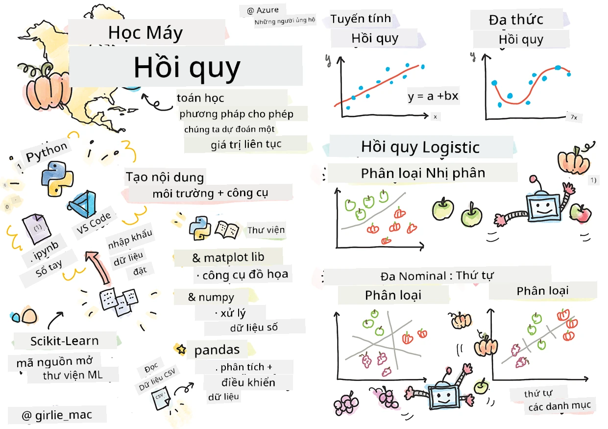
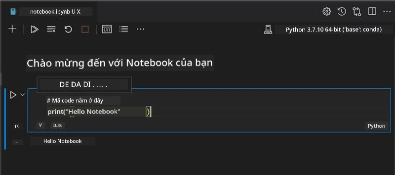
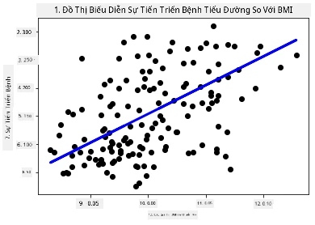

# Bắt đầu với Python và Scikit-learn cho các mô hình hồi quy



> Sketchnote bởi [Tomomi Imura](https://www.twitter.com/girlie_mac)

## [Bài kiểm tra trước bài học](https://ff-quizzes.netlify.app/en/ml/)

> ### [Bài học này có phiên bản bằng R!](../../../../2-Regression/1-Tools/solution/R/lesson_1.html)

## Giới thiệu

Trong bốn bài học này, bạn sẽ khám phá cách xây dựng các mô hình hồi quy. Chúng ta sẽ nói về mục đích sử dụng của chúng trong chốc lát. Nhưng trước khi bạn làm bất cứ điều gì, hãy đảm bảo bạn có các công cụ phù hợp để bắt đầu quá trình!

Trong bài học này, bạn sẽ học cách:

- Cấu hình máy tính của bạn cho các tác vụ học máy cục bộ.
- Làm việc với Jupyter Notebooks.
- Sử dụng Scikit-learn, bao gồm cả cài đặt.
- Khám phá hồi quy tuyến tính với một bài tập thực hành.

## Cài đặt và cấu hình

[](https://youtu.be/-DfeD2k2Kj0 "ML dành cho người mới - Thiết lập công cụ sẵn sàng xây dựng các mô hình Machine Learning")

> 🎥 Nhấp vào hình ảnh trên để xem video ngắn hướng dẫn cấu hình máy tính cho ML.

1. **Cài đặt Python**. Đảm bảo rằng [Python](https://www.python.org/downloads/) đã được cài đặt trên máy tính của bạn. Bạn sẽ sử dụng Python cho nhiều tác vụ khoa học dữ liệu và học máy. Hầu hết các hệ thống máy tính đã bao gồm sẵn một phiên bản Python. Có các [Bộ công cụ Mã Python](https://code.visualstudio.com/learn/educators/installers?WT.mc_id=academic-77952-leestott) hữu ích để hỗ trợ thiết lập cho một số người dùng.

Một số cách sử dụng Python, tuy nhiên, đòi hỏi phiên bản phần mềm khác nhau. Vì lý do đó, việc làm việc trong một [môi trường ảo](https://docs.python.org/3/library/venv.html) là hữu ích.

2. **Cài đặt Visual Studio Code**. Đảm bảo bạn đã cài đặt Visual Studio Code trên máy tính. Làm theo hướng dẫn để [cài đặt Visual Studio Code](https://code.visualstudio.com/) cho việc cài đặt cơ bản. Bạn sẽ sử dụng Python trong Visual Studio Code trong khóa học này, vì vậy bạn có thể muốn làm quen cách [cấu hình Visual Studio Code](https://docs.microsoft.com/learn/modules/python-install-vscode?WT.mc_id=academic-77952-leestott) cho phát triển Python.

> Làm quen với Python bằng cách làm qua bộ sưu tập [các modul học tập](https://docs.microsoft.com/users/jenlooper-2911/collections/mp1pagggd5qrq7?WT.mc_id=academic-77952-leestott)
>
> [](https://youtu.be/yyQM70vi7V8 "Cài đặt Python với Visual Studio Code")
>
> 🎥 Nhấp vào hình ảnh trên để xem video: sử dụng Python trong VS Code.

3. **Cài đặt Scikit-learn**, theo [hướng dẫn này](https://scikit-learn.org/stable/install.html). Vì bạn cần đảm bảo sử dụng Python 3, nên khuyến nghị sử dụng môi trường ảo. Lưu ý, nếu bạn cài thư viện này trên Mac M1, có hướng dẫn đặc biệt trên trang liên kết bên trên.

1. **Cài đặt Jupyter Notebook**. Bạn sẽ cần [cài gói Jupyter](https://pypi.org/project/jupyter/).

## Môi trường soạn thảo ML của bạn

Bạn sẽ sử dụng **notebooks** để phát triển mã Python và tạo các mô hình học máy. Đây là loại tệp phổ biến cho các nhà khoa học dữ liệu, và chúng được nhận diện bằng phần hậu tố hoặc phần mở rộng `.ipynb`.

Notebooks là môi trường tương tác cho phép nhà phát triển vừa viết mã vừa thêm ghi chú và tài liệu xung quanh mã, rất hữu ích cho các dự án nghiên cứu hoặc thử nghiệm.

[](https://youtu.be/7E-jC8FLA2E "ML cho người mới - Thiết lập Jupyter Notebooks để bắt đầu xây dựng mô hình hồi quy")

> 🎥 Nhấp vào hình ảnh trên để xem video ngắn hướng dẫn bài tập này.

### Bài tập - làm việc với notebook

Trong thư mục này, bạn sẽ tìm thấy tệp _notebook.ipynb_.

1. Mở _notebook.ipynb_ trong Visual Studio Code.

Một máy chủ Jupyter sẽ khởi động với Python 3+ được bật. Bạn sẽ thấy các phần của notebook có thể `chạy`, là các đoạn mã. Bạn có thể chạy một đoạn mã bằng cách chọn biểu tượng giống nút phát.

1. Chọn biểu tượng `md` và thêm một chút markdown, với đoạn văn bản sau **# Welcome to your notebook**.

Tiếp theo, thêm một số mã Python.

1. Gõ **print('hello notebook')** trong đoạn mã.
1. Chọn mũi tên để chạy mã.

Bạn sẽ thấy câu in ra:

    ```output
    hello notebook
    ```



Bạn có thể xen kẽ mã của bạn với các bình luận để tự tài liệu hóa notebook.

✅ Hãy suy nghĩ một chút về môi trường làm việc của một nhà phát triển web so với một nhà khoa học dữ liệu.

## Khởi động với Scikit-learn

Bây giờ Python đã được thiết lập trên môi trường cục bộ của bạn, và bạn đã quen với Jupyter Notebooks, hãy cùng làm quen với Scikit-learn (phát âm là `sci` như trong `science`). Scikit-learn cung cấp một [API phong phú](https://scikit-learn.org/stable/modules/classes.html#api-ref) để hỗ trợ bạn thực hiện các tác vụ ML.

Theo [trang web](https://scikit-learn.org/stable/getting_started.html) của họ, "Scikit-learn là một thư viện học máy mã nguồn mở hỗ trợ học có giám sát và không giám sát. Nó cũng cung cấp các công cụ để điều chỉnh mô hình, tiền xử lý dữ liệu, lựa chọn và đánh giá mô hình, cùng nhiều tiện ích khác."

Trong khóa học này, bạn sẽ sử dụng Scikit-learn và các công cụ khác để xây dựng các mô hình học máy thực hiện các tác vụ mà chúng ta gọi là 'học máy truyền thống'. Chúng tôi cố ý tránh các mạng nơ-ron và học sâu, vì những chủ đề đó được trình bày tốt hơn trong chương trình 'AI dành cho người mới' sắp tới.

Scikit-learn giúp việc xây dựng và đánh giá mô hình trở nên đơn giản. Nó tập trung chủ yếu vào dữ liệu số và bao gồm một số bộ dữ liệu sẵn có làm công cụ học tập. Nó cũng bao gồm các mô hình được xây dựng sẵn để học viên thử nghiệm. Hãy khám phá quá trình tải dữ liệu đóng gói sẵn và sử dụng một bộ ước lượng tích hợp mô hình ML đầu tiên với Scikit-learn cùng dữ liệu cơ bản.

## Bài tập - notebook Scikit-learn đầu tiên của bạn

> Bài hướng dẫn này lấy cảm hứng từ [ví dụ hồi quy tuyến tính](https://scikit-learn.org/stable/auto_examples/linear_model/plot_ols.html#sphx-glr-auto-examples-linear-model-plot-ols-py) trên trang web Scikit-learn.


[](https://youtu.be/2xkXL5EUpS0 "ML dành cho người mới - Dự án Hồi quy Tuyến tính Đầu tiên của Bạn bằng Python")

> 🎥 Nhấp vào hình ảnh trên để xem video ngắn hướng dẫn bài tập này.

Trong tệp _notebook.ipynb_ kèm bài học này, xóa hết tất cả các ô bằng cách nhấn biểu tượng 'thùng rác'.

Trong phần này, bạn sẽ làm việc với một bộ dữ liệu nhỏ về bệnh tiểu đường được tích hợp trong Scikit-learn cho mục đích học tập. Hãy tưởng tượng bạn muốn thử nghiệm một phương pháp điều trị cho bệnh nhân tiểu đường. Các mô hình học máy có thể giúp xác định bệnh nhân nào sẽ phản ứng tốt hơn dựa trên sự kết hợp các biến số. Ngay cả một mô hình hồi quy rất cơ bản, khi được trực quan hóa, có thể cho thấy thông tin về các biến số giúp bạn tổ chức các thử nghiệm lâm sàng giả thuyết.

✅ Có nhiều phương pháp hồi quy khác nhau, và bạn chọn phương pháp nào phụ thuộc vào câu trả lời bạn tìm kiếm. Nếu bạn muốn dự đoán chiều cao có thể của một người ở độ tuổi xác định, bạn dùng hồi quy tuyến tính vì bạn đang tìm một **giá trị số**. Nếu bạn muốn biết liệu một loại ẩm thực có nên coi là thuần chay hay không, bạn đang tìm một **phân loại nhóm** nên dùng hồi quy logistic. Bạn sẽ học về hồi quy logistic sau. Hãy suy nghĩ về một số câu hỏi bạn có thể hỏi dữ liệu, và phương pháp nào sẽ phù hợp hơn.

Hãy bắt đầu với nhiệm vụ này.

### Nhập các thư viện

Cho nhiệm vụ này, chúng ta sẽ nhập một số thư viện:

- **matplotlib**. Đây là công cụ [vẽ đồ thị](https://matplotlib.org/) hữu ích và chúng ta sẽ dùng để tạo biểu đồ đường.
- **numpy**. [numpy](https://numpy.org/doc/stable/user/whatisnumpy.html) là thư viện xử lý dữ liệu số trong Python.
- **sklearn**. Đây là thư viện [Scikit-learn](https://scikit-learn.org/stable/user_guide.html).

Nhập một số thư viện để hỗ trợ nhiệm vụ của bạn.

1. Thêm các lệnh nhập bằng cách gõ đoạn mã sau:

   ```python
   import matplotlib.pyplot as plt
   import numpy as np
   from sklearn import datasets, linear_model, model_selection
   ```

Ở trên bạn đang nhập `matplotlib`, `numpy` và nhập `datasets`, `linear_model` và `model_selection` từ `sklearn`. `model_selection` dùng để phân tách dữ liệu thành tập huấn luyện và kiểm thử.

### Bộ dữ liệu diabetes

Bộ dữ liệu tích hợp sẵn [diabetes dataset](https://scikit-learn.org/stable/datasets/toy_dataset.html#diabetes-dataset) chứa 442 mẫu dữ liệu về bệnh tiểu đường, với 10 biến đặc trưng, một số biến bao gồm:

- age: tuổi tính bằng năm
- bmi: chỉ số cơ thể (body mass index)
- bp: huyết áp trung bình
- s1 tc: T-Cells (một loại tế bào bạch cầu)

✅ Bộ dữ liệu này bao gồm khái niệm 'giới tính' như một biến đặc trưng quan trọng trong nghiên cứu về tiểu đường. Nhiều bộ dữ liệu y tế chứa loại phân loại nhị phân như thế này. Hãy suy nghĩ về cách các phân loại như vậy có thể loại trừ một số nhóm dân cư khỏi các phương pháp điều trị.

Bây giờ, hãy tải dữ liệu X và y.

> 🎓 Hãy nhớ, đây là học có giám sát, và cần một mục tiêu 'y' được đặt tên.

Trong một ô mã mới, tải bộ dữ liệu diabetes bằng cách gọi `load_diabetes()`. Tham số `return_X_y=True` báo `X` sẽ là ma trận dữ liệu, và `y` sẽ là mục tiêu hồi quy.

1. Thêm một số lệnh in để hiển thị kích thước của ma trận dữ liệu và phần tử đầu tiên:

    ```python
    X, y = datasets.load_diabetes(return_X_y=True)
    print(X.shape)
    print(X[0])
    ```

Bạn nhận về một tuple. Bạn đang gán hai giá trị đầu của tuple cho `X` và `y` tương ứng. Tìm hiểu thêm về [tuple](https://wikipedia.org/wiki/Tuple).

Bạn có thể thấy dữ liệu này có 442 mẫu, mỗi mẫu là mảng 10 phần tử:

    ```text
    (442, 10)
    [ 0.03807591  0.05068012  0.06169621  0.02187235 -0.0442235  -0.03482076
    -0.04340085 -0.00259226  0.01990842 -0.01764613]
    ```

✅ Nghĩ về mối quan hệ giữa dữ liệu và mục tiêu hồi quy. Hồi quy tuyến tính dự đoán mối quan hệ giữa đặc trưng X và biến mục tiêu y. Bạn có thể tìm thấy [mục tiêu](https://scikit-learn.org/stable/datasets/toy_dataset.html#diabetes-dataset) của bộ dữ liệu diabetes trong tài liệu không? Bộ dữ liệu này đang minh họa gì, dựa trên mục tiêu đó?

2. Tiếp theo, chọn một phần của bộ dữ liệu để vẽ bằng cách chọn cột thứ 3 của bộ dữ liệu. Bạn có thể dùng toán tử `:` để chọn tất cả các hàng, rồi chọn cột thứ 3 bằng chỉ mục (2). Bạn cũng có thể chuyển đổi dữ liệu thành mảng 2D - cần thiết cho việc vẽ - bằng cách dùng `reshape(n_rows, n_columns)`. Nếu một tham số là -1, chiều tương ứng sẽ được tính tự động.

   ```python
   X = X[:, 2]
   X = X.reshape((-1,1))
   ```

✅ Bất cứ lúc nào, in dữ liệu ra để kiểm tra kích thước.

3. Bây giờ dữ liệu đã sẵn sàng để vẽ, bạn có thể xem liệu máy có thể giúp xác định một ngưỡng hợp lý chia các số trong bộ dữ liệu không. Để làm điều này, bạn cần chia cả dữ liệu (X) và mục tiêu (y) thành tập kiểm thử và huấn luyện. Scikit-learn có cách đơn giản để làm điều này, bạn có thể chia dữ liệu kiểm thử tại một điểm xác định.

   ```python
   X_train, X_test, y_train, y_test = model_selection.train_test_split(X, y, test_size=0.33)
   ```

4. Bây giờ bạn đã sẵn sàng huấn luyện mô hình! Tải mô hình hồi quy tuyến tính và huấn luyện với tập huấn luyện X và y bằng `model.fit()`:

    ```python
    model = linear_model.LinearRegression()
    model.fit(X_train, y_train)
    ```

✅ `model.fit()` là hàm bạn sẽ thấy trong nhiều thư viện ML như TensorFlow

5. Sau đó, tạo dự đoán dùng dữ liệu kiểm thử với hàm `predict()`. Kết quả này sẽ dùng để vẽ đường phân chia giữa các nhóm dữ liệu

    ```python
    y_pred = model.predict(X_test)
    ```

6. Giờ là lúc hiển thị dữ liệu trên biểu đồ. Matplotlib là công cụ rất hữu ích cho việc này. Tạo biểu đồ điểm (scatterplot) của tất cả dữ liệu thử nghiệm X và y, rồi dùng dự đoán để vẽ một đường kẻ ở vị trí phù hợp nhất, phân tách các nhóm dữ liệu của mô hình.

    ```python
    plt.scatter(X_test, y_test,  color='black')
    plt.plot(X_test, y_pred, color='blue', linewidth=3)
    plt.xlabel('Scaled BMIs')
    plt.ylabel('Disease Progression')
    plt.title('A Graph Plot Showing Diabetes Progression Against BMI')
    plt.show()
    ```




   ✅ Hãy nghĩ một chút về những gì đang xảy ra ở đây. Một đường thẳng đang chạy qua nhiều điểm dữ liệu nhỏ, nhưng nó đang làm gì chính xác? Bạn có thể thấy làm thế nào bạn nên sử dụng đường thẳng này để dự đoán nơi một điểm dữ liệu mới, chưa thấy, nên nằm ở đâu trong mối quan hệ với trục y của biểu đồ không? Hãy thử diễn đạt bằng lời về mục đích thực tiễn của mô hình này.

Chúc mừng, bạn đã xây dựng mô hình hồi quy tuyến tính đầu tiên, tạo ra một dự đoán với nó và hiển thị nó trong biểu đồ!

---
## 🚀Thử thách

Vẽ biểu đồ một biến khác từ bộ dữ liệu này. Gợi ý: chỉnh sửa dòng này: `X = X[:,2]`. Với mục tiêu của bộ dữ liệu này, bạn có thể khám phá điều gì về tiến triển của bệnh tiểu đường như một căn bệnh?
## [Trắc nghiệm sau bài giảng](https://ff-quizzes.netlify.app/en/ml/)

## Ôn tập & Tự học

Trong hướng dẫn này, bạn đã làm việc với hồi quy tuyến tính đơn giản, thay vì hồi quy tuyến tính đơn biến hay đa biến. Hãy đọc một chút về sự khác biệt giữa các phương pháp này, hoặc xem [video này](https://www.coursera.org/lecture/quantifying-relationships-regression-models/linear-vs-nonlinear-categorical-variables-ai2Ef)

Đọc thêm về khái niệm hồi quy và suy nghĩ về những loại câu hỏi nào có thể được trả lời bằng kỹ thuật này. Tham khảo [hướng dẫn này](https://docs.microsoft.com/learn/modules/train-evaluate-regression-models?WT.mc_id=academic-77952-leestott) để tăng cường hiểu biết của bạn.

## Bài tập

[Một bộ dữ liệu khác](assignment.md)

---

<!-- CO-OP TRANSLATOR DISCLAIMER START -->
**Tuyên bố miễn trừ trách nhiệm**:
Tài liệu này đã được dịch bằng dịch vụ dịch thuật AI [Co-op Translator](https://github.com/Azure/co-op-translator). Mặc dù chúng tôi cố gắng đảm bảo độ chính xác, xin lưu ý rằng bản dịch tự động có thể chứa lỗi hoặc sai sót. Tài liệu gốc bằng ngôn ngữ gốc nên được coi là nguồn tin chính thức. Đối với thông tin quan trọng, nên sử dụng dịch vụ dịch thuật chuyên nghiệp bởi con người. Chúng tôi không chịu trách nhiệm về bất kỳ hiểu lầm hoặc giải thích sai nào phát sinh từ việc sử dụng bản dịch này.
<!-- CO-OP TRANSLATOR DISCLAIMER END -->