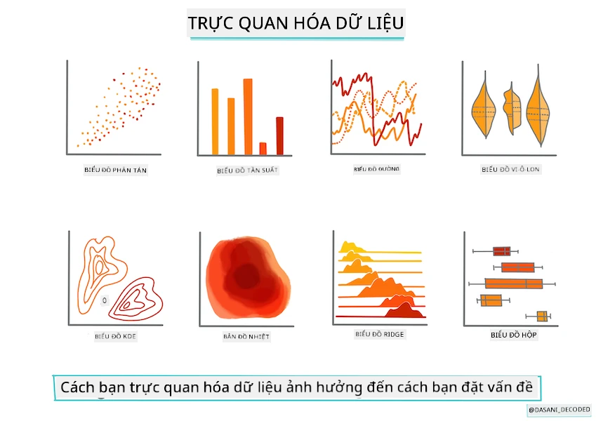
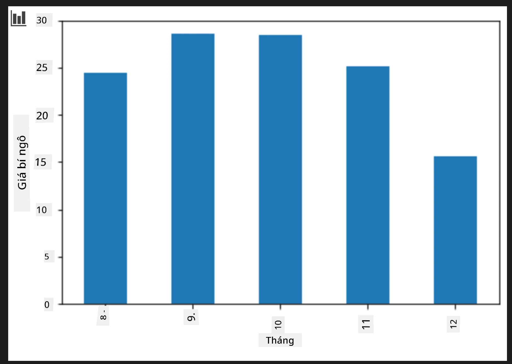
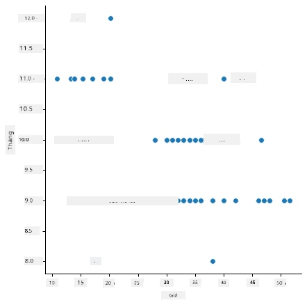
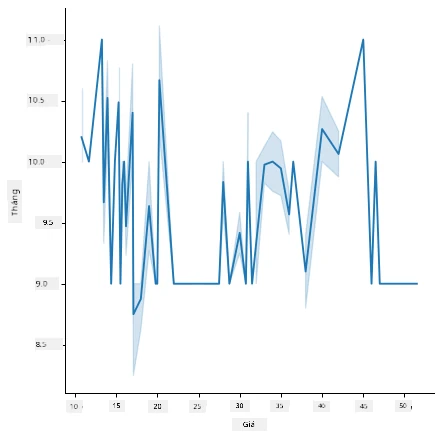
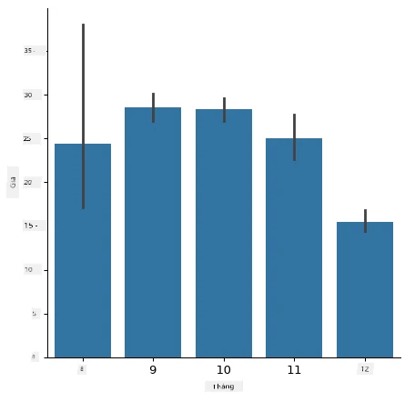
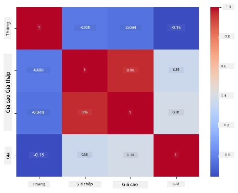

# Xây dựng mô hình hồi quy sử dụng Scikit-learn: chuẩn bị và trực quan hóa dữ liệu



Đồ họa do [Dasani Madipalli](https://twitter.com/dasani_decoded) thực hiện

## [Bài kiểm tra trước bài học](https://ff-quizzes.netlify.app/en/ml/)

> ### [Bài học này có sẵn bằng R!](../../../../2-Regression/2-Data/solution/R/lesson_2.html)

## Giới thiệu

Giờ bạn đã sẵn sàng với các công cụ cần thiết để bắt đầu xây dựng mô hình học máy với Scikit-learn, bạn đã sẵn sàng để bắt đầu đặt câu hỏi cho dữ liệu của mình. Khi bạn làm việc với dữ liệu và áp dụng giải pháp ML, điều rất quan trọng là hiểu cách đặt câu hỏi đúng để khai thác tiềm năng của bộ dữ liệu.

Trong bài học này, bạn sẽ học:

- Cách chuẩn bị dữ liệu của bạn để xây dựng mô hình.
- Cách sử dụng Matplotlib để trực quan hóa dữ liệu.
- Cách sử dụng Seaborn để trực quan hóa dữ liệu sinh động hơn.

## Đặt câu hỏi đúng đối với dữ liệu của bạn

Câu hỏi bạn cần trả lời sẽ quyết định loại thuật toán ML bạn sẽ sử dụng. Và chất lượng câu trả lời bạn nhận được sẽ phụ thuộc lớn vào tính chất dữ liệu của bạn.

Hãy xem qua [dữ liệu](https://github.com/microsoft/ML-For-Beginners/blob/main/2-Regression/data/US-pumpkins.csv) cung cấp cho bài học này. Bạn có thể mở tệp .csv này trong VS Code. Quan sát sơ qua cho thấy có những chỗ trống và một hỗn hợp giữa chuỗi và dữ liệu số. Cũng có một cột lạ tên 'Package' nơi dữ liệu là sự pha trộn giữa 'sacks', 'bins' và các giá trị khác. Dữ liệu, thực ra, hơi lộn xộn một chút.

[](https://youtu.be/5qGjczWTrDQ "ML for beginners - Cách Phân tích và Làm sạch Bộ dữ liệu")

> 🎥 Nhấn vào hình trên để xem video ngắn hướng dẫn chuẩn bị dữ liệu cho bài học này.

Thực tế, hiếm khi nào bạn được tặng một bộ dữ liệu hoàn toàn sẵn sàng để dùng ngay cho việc tạo mô hình ML. Trong bài học này, bạn sẽ học cách chuẩn bị bộ dữ liệu thô bằng các thư viện Python tiêu chuẩn. Bạn cũng sẽ học các kỹ thuật khác nhau để trực quan hóa dữ liệu.

## Nghiên cứu tình huống: 'thị trường bí ngô'

Trong thư mục này bạn sẽ tìm thấy một tệp .csv ở thư mục gốc `data` tên là [US-pumpkins.csv](https://github.com/microsoft/ML-For-Beginners/blob/main/2-Regression/data/US-pumpkins.csv) chứa 1757 dòng dữ liệu về thị trường bí ngô, được phân loại theo nhóm theo thành phố. Đây là dữ liệu thô được trích xuất từ các [Báo cáo Chuẩn Thị trường Chuyên ngành](https://www.marketnews.usda.gov/mnp/fv-report-config-step1?type=termPrice) do Bộ Nông nghiệp Hoa Kỳ phân phối.

### Chuẩn bị dữ liệu

Dữ liệu này thuộc phạm vi công cộng. Có thể tải xuống nhiều tệp riêng biệt, theo từng thành phố, từ trang web USDA. Để tránh quá nhiều tệp riêng lẻ, chúng tôi đã gộp dữ liệu của tất cả các thành phố thành một bảng tính duy nhất, do đó chúng tôi đã có một chút chuẩn bị dữ liệu rồi. Tiếp theo, hãy cùng xem kỹ hơn dữ liệu.

### Dữ liệu bí ngô - kết luận ban đầu

Bạn nhận thấy gì về dữ liệu này? Bạn đã thấy nó là sự pha trộn giữa chuỗi, số, giá trị trống và những giá trị lạ mà bạn cần hiểu rõ.

Bạn có thể đặt câu hỏi gì cho dữ liệu này, sử dụng kỹ thuật Hồi quy? Chẳng hạn: "Dự đoán giá của một quả bí ngô được bán trong một tháng nhất định". Nhìn lại dữ liệu, bạn cần thực hiện một số thay đổi để tạo cấu trúc dữ liệu cần thiết cho nhiệm vụ này.
## Bài tập - phân tích dữ liệu bí ngô

Hãy sử dụng [Pandas](https://pandas.pydata.org/), (viết tắt của `Python Data Analysis`) một công cụ rất hữu ích để định hình dữ liệu, để phân tích và chuẩn bị dữ liệu bí ngô này.

### Trước tiên, kiểm tra ngày tháng bị thiếu

Trước tiên bạn cần thực hiện các bước kiểm tra các ngày tháng bị thiếu:

1. Chuyển đổi các ngày tháng về định dạng tháng (đây là dữ liệu ngày tháng của Mỹ, nên định dạng là `MM/DD/YYYY`).
2. Trích xuất tháng vào một cột mới.

Mở tệp _notebook.ipynb_ trong Visual Studio Code và nhập bảng tính vào một dataframe Pandas mới.

1. Dùng hàm `head()` để xem năm dòng đầu tiên.

    ```python
    import pandas as pd
    pumpkins = pd.read_csv('../data/US-pumpkins.csv')
    pumpkins.head()
    ```

    ✅ Bạn sẽ dùng hàm nào để xem năm dòng cuối cùng?

1. Kiểm tra xem có dữ liệu nào bị thiếu trong dataframe hiện tại không:

    ```python
    pumpkins.isnull().sum()
    ```

    Có dữ liệu bị thiếu, nhưng có thể nó không ảnh hưởng đến nhiệm vụ hiện tại.

1. Để làm dataframe dễ làm việc hơn, hãy chọn chỉ các cột cần thiết, sử dụng hàm `loc` để trích xuất từ dataframe gốc một nhóm các dòng (tham số đầu tiên) và các cột (tham số thứ hai). Biểu thức `:` trong trường hợp dưới đây có nghĩa là "tất cả các dòng".

    ```python
    columns_to_select = ['Package', 'Low Price', 'High Price', 'Date']
    pumpkins = pumpkins.loc[:, columns_to_select]
    ```

### Thứ hai, xác định giá trung bình của bí ngô

Hãy suy nghĩ xem làm thế nào để xác định giá trung bình của một quả bí ngô trong một tháng nhất định. Bạn sẽ chọn những cột nào cho nhiệm vụ này? Gợi ý: bạn sẽ cần 3 cột.

Giải pháp: lấy trung bình của hai cột `Low Price` và `High Price` để điền vào cột Giá mới, và chuyển đổi cột Ngày để chỉ hiển thị tháng. May mắn thay, theo kiểm tra ở trên, không có dữ liệu bị thiếu về ngày tháng hay giá cả.

1. Để tính giá trung bình, thêm đoạn mã sau:

    ```python
    price = (pumpkins['Low Price'] + pumpkins['High Price']) / 2

    month = pd.DatetimeIndex(pumpkins['Date']).month

    ```

   ✅ Bạn có thể in ra bất cứ dữ liệu nào bạn muốn kiểm tra bằng `print(month)`.

2. Bây giờ, sao chép dữ liệu đã chuyển đổi vào một dataframe Pandas mới:

    ```python
    new_pumpkins = pd.DataFrame({'Month': month, 'Package': pumpkins['Package'], 'Low Price': pumpkins['Low Price'],'High Price': pumpkins['High Price'], 'Price': price})
    ```

    In ra dataframe sẽ cho bạn thấy một bộ dữ liệu gọn gàng, sạch sẽ để bạn xây dựng mô hình hồi quy mới.

### Nhưng khoan đã! Có điều gì đó kỳ lạ ở đây

Nếu bạn nhìn vào cột `Package`, bí ngô được bán theo nhiều cách khác nhau. Một số được bán với đơn vị đo '1 1/9 bushel', một số với '1/2 bushel', một số tính theo quả, một số tính theo pound, và một số đóng trong những hộp lớn với kích thước khác nhau.

> Bí ngô dường như rất khó để cân nhất quán

Xem kỹ dữ liệu gốc, điều thú vị là bất cứ sản phẩm nào có `Unit of Sale` là 'EACH' hoặc 'PER BIN' cũng có kiểu `Package` là theo inch, theo thùng, hoặc 'each'. Bí ngô có vẻ rất khó để cân nhất quán, vì vậy hãy lọc chỉ những bí ngô có chuỗi 'bushel' trong cột `Package`.

1. Thêm bộ lọc ở đầu tệp, dưới phần nhập .csv ban đầu:

    ```python
    pumpkins = pumpkins[pumpkins['Package'].str.contains('bushel', case=True, regex=True)]
    ```

    Nếu bạn in dữ liệu bây giờ, bạn có thể thấy chỉ những dòng khoảng 415 dữ liệu chứa bí ngô tính theo bushel.

### Nhưng khoan đã! Còn một việc nữa cần làm

Bạn có nhận thấy lượng bushel khác nhau theo từng dòng không? Bạn cần chuẩn hóa giá để thể hiện giá theo từng bushel, vì thế hãy làm một số phép toán để chuẩn hóa.

1. Thêm các dòng sau sau đoạn tạo dataframe new_pumpkins:

    ```python
    new_pumpkins.loc[new_pumpkins['Package'].str.contains('1 1/9'), 'Price'] = price/(1 + 1/9)

    new_pumpkins.loc[new_pumpkins['Package'].str.contains('1/2'), 'Price'] = price/(1/2)
    ```

✅ Theo [The Spruce Eats](https://www.thespruceeats.com/how-much-is-a-bushel-1389308), trọng lượng một bushel phụ thuộc vào loại sản phẩm, vì đây là đơn vị đo thể tích. "Một bushel cà chua, ví dụ, nặng 56 pounds... Lá xanh chiếm nhiều không gian hơn nhưng ít trọng lượng hơn, nên một bushel rau bina chỉ nặng 20 pounds." Tất cả khá phức tạp! Chúng ta không cần làm phép chuyển đổi bushel sang pound, thay vào đó giá bán theo bushel. Tất cả nghiên cứu về bushel bí ngô này cho thấy tầm quan trọng của việc hiểu bản chất dữ liệu của bạn!

Bây giờ, bạn có thể phân tích giá theo đơn vị dựa trên đo bushel của chúng. Nếu in dữ liệu lần nữa, bạn sẽ thấy cách chúng đã được chuẩn hóa.

✅ Bạn có nhận thấy bí ngô bán theo nửa bushel rất đắt không? Bạn có đoán được lý do không? Gợi ý: những quả bí nhỏ có giá cao hơn nhiều so với quả to, có lẽ vì có nhiều quả nhỏ hơn trong một bushel kể cả khoảng không gian không dùng được bởi quả bí lớn rỗng bên trong.

## Chiến lược trực quan hóa

Một phần công việc của nhà khoa học dữ liệu là trình bày chất lượng và tính chất của dữ liệu mà họ làm việc. Để làm điều này, họ thường tạo các trực quan đồ họa thú vị, biểu đồ, đồ thị, minh họa các khía cạnh khác nhau của dữ liệu. Bằng cách này, họ có thể hiển thị trực quan các mối quan hệ và khoảng trống mà nếu không sẽ rất khó phát hiện.

[](https://youtu.be/SbUkxH6IJo0 "ML for beginners - Cách Trực quan hóa Dữ liệu với Matplotlib")

> 🎥 Nhấn vào hình trên để xem video ngắn hướng dẫn trực quan hóa dữ liệu cho bài học này.

Trực quan hóa cũng giúp xác định kỹ thuật học máy phù hợp nhất với dữ liệu. Ví dụ, một biểu đồ phân tán (scatterplot) có vẻ theo một đường thẳng có thể chỉ ra rằng dữ liệu phù hợp cho bài tập hồi quy tuyến tính.

Một thư viện trực quan hóa dữ liệu hoạt động tốt trong các notebook Jupyter là [Matplotlib](https://matplotlib.org/) (mà bạn cũng đã thấy trong bài học trước).

> Tăng kinh nghiệm trực quan hóa dữ liệu của bạn trong [những bài hướng dẫn này](https://docs.microsoft.com/learn/modules/explore-analyze-data-with-python?WT.mc_id=academic-77952-leestott).

## Bài tập - thử nghiệm với Matplotlib

Hãy thử tạo một số biểu đồ cơ bản để hiển thị dataframe mới bạn vừa tạo. Một biểu đồ đường cơ bản sẽ thể hiện điều gì?

1. Nhập Matplotlib ở đầu tệp, dưới phần nhập Pandas:

    ```python
    import matplotlib.pyplot as plt
    ```

1. Chạy lại toàn bộ notebook để làm mới.
1. Ở cuối notebook, thêm một ô để biểu diễn dữ liệu dưới dạng hộp (box):

    ```python
    price = new_pumpkins.Price
    month = new_pumpkins.Month
    plt.scatter(price, month)
    plt.show()
    ```

    

    Biểu đồ này có hữu ích không? Có gì làm bạn ngạc nhiên không?

    Nó không quá hữu ích vì chỉ hiển thị dữ liệu của bạn như một tập điểm phân bố theo tháng.

### Làm cho nó hữu ích

Để các biểu đồ thể hiện dữ liệu có ích, bạn thường cần nhóm dữ liệu theo một cách nào đó. Hãy thử tạo một biểu đồ nhóm nơi trục y thể hiện các tháng và dữ liệu biểu diễn phân phối dữ liệu.

1. Thêm một ô để tạo biểu đồ cột theo nhóm:

    ```python
    new_pumpkins.groupby(['Month'])['Price'].mean().plot(kind='bar')
    plt.ylabel("Pumpkin Price")
    ```

    

    Đây là trực quan hóa dữ liệu hữu ích hơn! Nó dường như chỉ ra rằng giá cao nhất của bí ngô xảy ra vào tháng Chín và tháng Mười. Điều này có đúng với kỳ vọng của bạn không? Tại sao hoặc tại sao không?

## Bài tập - thử nghiệm với Seaborn

Matplotlib rất mạnh, nhưng có thể cần nhiều mã để tạo biểu đồ tinh tế. [Seaborn](https://seaborn.pydata.org/) là thư viện xây dựng _trên nền_ Matplotlib được thiết kế cho trực quan hóa dữ liệu thống kê. Nó làm việc trực tiếp với các dataframe Pandas, áp dụng các kiểu mặc định hấp dẫn và cho phép bạn tạo biểu đồ thông tin chỉ với rất ít mã. Vì Seaborn trả về các đối tượng Matplotlib, bạn vẫn có thể sử dụng mọi thứ bạn biết về Matplotlib để tinh chỉnh kết quả.

> Nếu bạn chưa cài Seaborn, hãy cài bằng lệnh `pip install seaborn`.

1. Nhập Seaborn ở đầu notebook, dưới các import khác. Thông thường nó được nhập dưới tên `sns`:

    ```python
    import seaborn as sns
    ```

### Biểu đồ phân tán để thể hiện các mối quan hệ

Một phần lớn của việc khám phá dữ liệu trước khi xây dựng mô hình là tìm kiếm các _mối quan hệ_ giữa các biến. Một [biểu đồ phân tán](https://en.wikipedia.org/wiki/Scatter_plot) là một trong những công cụ tốt nhất cho việc này: nếu các điểm dường như theo một đường thẳng, hai biến có thể tương quan, đây là dấu hiệu tốt rằng mô hình hồi quy tuyến tính có thể hiệu quả.

1. Tạo lại biểu đồ phân tán giá theo tháng trước đây, lần này sử dụng [`relplot()`](https://seaborn.pydata.org/generated/seaborn.relplot.html) của Seaborn (biểu đồ quan hệ), làm việc trực tiếp với các cột dataframe của bạn:

    ```python
    sns.relplot(x="Price", y="Month", data=new_pumpkins)
    ```

    

    Lưu ý bạn truyền _tên cột_ và dataframe, Seaborn sẽ tự động tạo nhãn trục cho bạn.

2. Bạn có thể chuyển sang biểu đồ đường bằng cách truyền `kind="line"`. Seaborn còn vẽ băng bóng thể hiện khoảng tin cậy quanh đường:

    ```python
    sns.relplot(x="Price", y="Month", kind="line", data=new_pumpkins)
    ```

    

    Dữ liệu này khá nhiễu, nên biểu đồ đường không phải là lựa chọn rõ ràng ở đây — nhưng nó cho thấy bạn có thể dễ dàng thay đổi loại biểu đồ trong Seaborn.

### Biểu đồ cột để thể hiện phân bố


Trước đó bạn đã nhóm dữ liệu thủ công để tạo biểu đồ cột với Matplotlib. Hàm [`catplot()`](https://seaborn.pydata.org/generated/seaborn.catplot.html) (biểu đồ phân loại) của Seaborn có thể thực hiện việc nhóm và tổng hợp cho bạn. Mặc định `kind="bar"` hiển thị giá trị trung bình của mỗi nhóm cùng với một đường màu đen chỉ khoảng tin cậy.

1. Tạo biểu đồ cột giá trung bình theo từng tháng:

    ```python
    sns.catplot(x="Month", y="Price", data=new_pumpkins, kind="bar")
    ```

    

    Điều này xác nhận điều bạn đã thấy với Matplotlib — giá đạt đỉnh quanh tháng Chín và tháng Mười — nhưng Seaborn cũng trực quan hóa mức độ _biến động_ giá trong từng tháng.

### Biểu đồ nhiệt để hiển thị mối tương quan

Biểu đồ phân tán so sánh hai biến tại một thời điểm. Khi bạn có nhiều cột số, một [biểu đồ nhiệt](https://en.wikipedia.org/wiki/Heat_map) cho phép bạn nhìn thấy sức mạnh mối quan hệ giữa _mọi_ cặp cột cùng lúc. Đây là cách phổ biến để phát hiện những đặc trưng có tương quan mạnh nhất trước khi chọn dữ liệu cho mô hình (và loại biểu đồ này cũng được dùng sau đó để hiển thị ma trận nhầm lẫn trong phân loại).

1. Xây dựng ma trận tương quan với Pandas, rồi vẽ nó bằng [`heatmap()`](https://seaborn.pydata.org/generated/seaborn.heatmap.html) của Seaborn. Tùy chọn `annot=True` in ra các giá trị tương quan trên từng ô:

    ```python
    correlations = new_pumpkins[['Month', 'Low Price', 'High Price', 'Price']].corr()
    sns.heatmap(correlations, annot=True, cmap="coolwarm")
    ```

    

    Các giá trị gần `1` (hoặc `-1`) nghĩa là các cột có tương quan _tuyến tính_ mạnh. Chú ý cách `Low Price` và `High Price` gần như tương quan hoàn hảo. Còn `Month` chỉ thể hiện tương quan tuyến tính yếu với giá — mặc dù biểu đồ cột phía trên đã tiết lộ một đỉnh mùa vụ rõ ràng vào tháng Chín và tháng Mười. Đây là bài học quan trọng: hệ số tương quan chỉ đo các mối quan hệ _trực tuyến_ nên có thể bỏ sót các mẫu mùa vụ hoặc phi tuyến tính khác. ✅ Tại sao việc quan sát cả biểu đồ nhiệt *và* các biểu đồ như biểu đồ cột lại hữu dụng trước khi quyết định sử dụng cột nào?

### Matplotlib hay Seaborn?

Cả hai thư viện đều đáng để biết:

- **Matplotlib** cho bạn kiểm soát chi tiết từng phần tử của biểu đồ và là nền tảng mà gần như mọi thư viện vẽ biểu đồ Python khác xây dựng dựa vào.
- **Seaborn** cung cấp các hàm cấp cao hơn với cấu hình mặc định đẹp cho biểu đồ thống kê, làm việc trực tiếp với dataframe, và thường nhanh hơn cho phân tích dữ liệu khám phá.

Một quy trình phổ biến là sử dụng Seaborn để khám phá dữ liệu nhanh, rồi chuyển xuống Matplotlib khi cần tùy chỉnh chi tiết.

---

## 🚀Thử thách

Khám phá các loại trực quan hóa khác nhau mà Matplotlib và Seaborn cung cấp. Loại nào thích hợp nhất cho các bài toán hồi quy?

## [Bài kiểm tra sau bài giảng](https://ff-quizzes.netlify.app/en/ml/)

## Ôn tập & Tự học

Hãy xem qua nhiều cách khác nhau để trực quan hóa dữ liệu. Lập danh sách các thư viện khả dụng và ghi chú thư viện nào phù hợp với nhiệm vụ nào, ví dụ trực quan hóa 2D so với trực quan hóa 3D. Bạn khám phá được gì?

## Bài tập

[Khám phá trực quan hóa](assignment.md)

---

<!-- CO-OP TRANSLATOR DISCLAIMER START -->
**Tuyên bố miễn trừ trách nhiệm**:
Tài liệu này đã được dịch bằng dịch vụ dịch thuật AI [Co-op Translator](https://github.com/Azure/co-op-translator). Mặc dù chúng tôi cố gắng đảm bảo độ chính xác, xin lưu ý rằng bản dịch tự động có thể chứa lỗi hoặc sai sót. Tài liệu gốc bằng ngôn ngữ gốc nên được coi là nguồn tin chính thức. Đối với thông tin quan trọng, nên sử dụng dịch vụ dịch thuật chuyên nghiệp bởi con người. Chúng tôi không chịu trách nhiệm về bất kỳ hiểu lầm hoặc giải thích sai nào phát sinh từ việc sử dụng bản dịch này.
<!-- CO-OP TRANSLATOR DISCLAIMER END -->