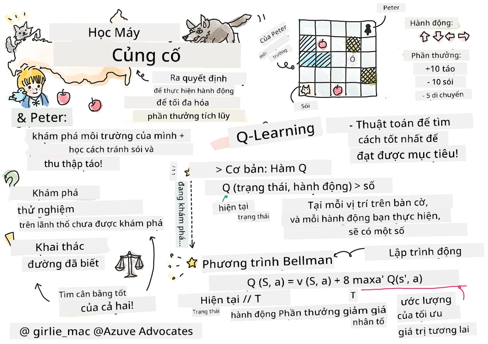

# Giới thiệu về Học tăng cường và Q-Learning


> Sketchnote bởi [Tomomi Imura](https://www.twitter.com/girlie_mac)

Học tăng cường bao gồm ba khái niệm quan trọng: tác nhân, một số trạng thái, và một tập các hành động cho mỗi trạng thái. Bằng cách thực hiện một hành động trong trạng thái cụ thể, tác nhân sẽ nhận được phần thưởng. Hãy tưởng tượng trò chơi điện tử Super Mario. Bạn là Mario, bạn ở trong một màn chơi, đứng cạnh mép vách đá. Phía trên bạn là một đồng xu. Bạn, với vai trò Mario, trong một màn chơi, tại vị trí cụ thể ... đó là trạng thái của bạn. Di chuyển một bước sang phải (một hành động) sẽ khiến bạn rơi xuống, và điều đó sẽ cho bạn điểm số thấp. Tuy nhiên, nhấn nút nhảy sẽ giúp bạn ghi một điểm và bạn sẽ sống sót. Đó là một kết quả tích cực và bạn nên được thưởng điểm số dương.

Bằng cách sử dụng học tăng cường và một bộ mô phỏng (trò chơi), bạn có thể học cách chơi trò chơi để tối đa hóa phần thưởng là sống sót và kiếm thật nhiều điểm.

[](https://www.youtube.com/watch?v=lDq_en8RNOo)

> 🎥 Nhấn vào hình trên để nghe Dmitry thảo luận về Học tăng cường

## [Đề kiểm tra trước bài giảng](https://ff-quizzes.netlify.app/en/ml/)

## Yêu cầu và Cài đặt

Trong bài học này, chúng ta sẽ thử nghiệm với một số đoạn mã Python. Bạn nên có khả năng chạy mã trong Jupyter Notebook của bài học này, trên máy tính của bạn hoặc ở đâu đó trên đám mây.

Bạn có thể mở [notebook bài học](https://github.com/microsoft/ML-For-Beginners/blob/main/8-Reinforcement/1-QLearning/notebook.ipynb) và theo dõi bài học này để xây dựng.

> **Lưu ý:** Nếu bạn mở mã này từ đám mây, bạn cũng cần tải file [`rlboard.py`](https://github.com/microsoft/ML-For-Beginners/blob/main/8-Reinforcement/1-QLearning/rlboard.py), được sử dụng trong mã notebook. Thêm nó vào cùng thư mục với notebook.

## Giới thiệu

Trong bài học này, chúng ta sẽ khám phá thế giới của **[Peter và Con Sói](https://en.wikipedia.org/wiki/Peter_and_the_Wolf)**, lấy cảm hứng từ câu chuyện nhạc cổ tích do nhà soạn nhạc người Nga, [Sergei Prokofiev](https://en.wikipedia.org/wiki/Sergei_Prokofiev), sáng tác. Chúng ta sẽ sử dụng **Học tăng cường** để cho Peter khám phá môi trường, thu thập táo ngon và tránh gặp con sói.

**Học tăng cường** (RL) là một kỹ thuật học tập cho phép ta học hành vi tối ưu của một **tác nhân** trong một **môi trường** nào đó bằng cách thực hiện nhiều thử nghiệm. Một tác nhân trong môi trường này sẽ có một **mục tiêu**, được xác định bởi một **hàm phần thưởng**.

## Môi trường

Để đơn giản, ta coi thế giới của Peter là một bàn cờ vuông có kích thước `width` x `height`, như sau:


Mỗi ô trong bàn cờ này có thể là:

* **đất**, nơi mà Peter và các sinh vật khác có thể đi lại.
* **nước**, nơi mà rõ ràng bạn không thể đi lại.
* một **cây** hoặc **cỏ**, nơi để bạn nghỉ ngơi.
* một **quả táo**, đại diện cho thứ mà Peter sẽ vui mừng tìm thấy để tự nuôi mình.
* một **con sói**, rất nguy hiểm và cần tránh.

Có một module Python riêng, [`rlboard.py`](https://github.com/microsoft/ML-For-Beginners/blob/main/8-Reinforcement/1-QLearning/rlboard.py), chứa mã xử lý môi trường này. Vì mã này không quan trọng cho việc hiểu các khái niệm của ta, ta sẽ nhập module này và dùng nó để tạo bàn cờ mẫu (khối mã 1):

```python
from rlboard import *

width, height = 8,8
m = Board(width,height)
m.randomize(seed=13)
m.plot()
```

Mã này sẽ in ra hình ảnh của môi trường tương tự như hình ở trên.

## Hành động và chính sách

Trong ví dụ của ta, mục tiêu của Peter là tìm được quả táo, đồng thời tránh con sói và các chướng ngại khác. Để làm điều này, anh ta có thể đi lang thang cho đến khi tìm thấy quả táo.

Do đó, tại bất kỳ vị trí nào, anh ta có thể chọn một trong các hành động sau: lên, xuống, trái và phải.

Ta sẽ định nghĩa những hành động này dưới dạng một từ điển, và ánh xạ chúng thành các cặp thay đổi tọa độ tương ứng. Ví dụ, di chuyển sang phải (`R`) sẽ tương ứng với cặp `(1,0)`. (khối mã 2):

```python
actions = { "U" : (0,-1), "D" : (0,1), "L" : (-1,0), "R" : (1,0) }
action_idx = { a : i for i,a in enumerate(actions.keys()) }
```

Tóm lại, chiến lược và mục tiêu của kịch bản này như sau:

- **Chiến lược**, của tác nhân ta (Peter) được xác định bởi cái gọi là **chính sách**. Chính sách là một hàm trả về hành động tại bất kỳ trạng thái nào. Trong trường hợp của ta, trạng thái của bài toán được biểu diễn bằng bàn cờ, bao gồm vị trí hiện tại của người chơi.

- **Mục tiêu**, của học tăng cường là cuối cùng học được một chính sách tốt cho phép ta giải quyết bài toán hiệu quả. Tuy nhiên, như một điểm khởi đầu, ta sẽ xem xét chính sách đơn giản nhất gọi là **đi lang thang ngẫu nhiên**.

## Đi lang thang ngẫu nhiên

Trước hết, hãy giải bài toán bằng cách triển khai chiến lược đi lang thang ngẫu nhiên. Với đi lang thang ngẫu nhiên, ta sẽ chọn ngẫu nhiên hành động tiếp theo từ các hành động được phép, cho đến khi ta đến được quả táo (khối mã 3).

1. Triển khai đi lang thang ngẫu nhiên với đoạn mã bên dưới:

    ```python
    def random_policy(m):
        return random.choice(list(actions))
    
    def walk(m,policy,start_position=None):
        n = 0 # số bước
        # đặt vị trí ban đầu
        if start_position:
            m.human = start_position 
        else:
            m.random_start()
        while True:
            if m.at() == Board.Cell.apple:
                return n # thành công!
            if m.at() in [Board.Cell.wolf, Board.Cell.water]:
                return -1 # bị sói ăn hoặc chết đuối
            while True:
                a = actions[policy(m)]
                new_pos = m.move_pos(m.human,a)
                if m.is_valid(new_pos) and m.at(new_pos)!=Board.Cell.water:
                    m.move(a) # thực hiện di chuyển thực tế
                    break
            n+=1
    
    walk(m,random_policy)
    ```

    Lời gọi hàm `walk` sẽ trả về chiều dài của đường đi tương ứng, có thể thay đổi trong mỗi lần chạy. 

1. Chạy thí nghiệm đi lang thang nhiều lần (ví dụ 100 lần), và in ra thống kê kết quả (khối mã 4):

    ```python
    def print_statistics(policy):
        s,w,n = 0,0,0
        for _ in range(100):
            z = walk(m,policy)
            if z<0:
                w+=1
            else:
                s += z
                n += 1
        print(f"Average path length = {s/n}, eaten by wolf: {w} times")
    
    print_statistics(random_policy)
    ```

    Lưu ý rằng chiều dài trung bình của một đường đi khoảng 30-40 bước, khá lớn, trong khi khoảng cách trung bình đến quả táo gần nhất là khoảng 5-6 bước.

    Bạn cũng có thể xem chuyển động của Peter trong quá trình đi lang thang ngẫu nhiên:

    

## Hàm phần thưởng

Để làm cho chính sách của ta thông minh hơn, ta cần hiểu hành động nào "tốt hơn" những hành động khác. Để làm điều này, ta cần xác định mục tiêu của mình.

Mục tiêu có thể được định nghĩa qua một **hàm phần thưởng**, hàm này sẽ trả về giá trị điểm cho mỗi trạng thái. Số càng cao, phần thưởng càng tốt. (khối mã 5)

```python
move_reward = -0.1
goal_reward = 10
end_reward = -10

def reward(m,pos=None):
    pos = pos or m.human
    if not m.is_valid(pos):
        return end_reward
    x = m.at(pos)
    if x==Board.Cell.water or x == Board.Cell.wolf:
        return end_reward
    if x==Board.Cell.apple:
        return goal_reward
    return move_reward
```

Một điều thú vị về hàm phần thưởng là trong hầu hết các trường hợp, *ta chỉ nhận được phần thưởng lớn vào cuối trò chơi*. Điều này nghĩa là thuật toán của ta phải nhớ lại những bước "tốt" dẫn đến phần thưởng tích cực ở cuối, và tăng tầm quan trọng của chúng. Tương tự, tất cả các bước đi dẫn đến kết quả xấu nên bị hạn chế.

## Q-Learning

Một thuật toán mà ta sẽ thảo luận ở đây gọi là **Q-Learning**. Trong thuật toán này, chính sách được định nghĩa bởi một hàm (hoặc cấu trúc dữ liệu) gọi là **Bảng Q**. Nó ghi lại mức độ "tốt" của mỗi hành động trong một trạng thái nhất định.

Nó được gọi là Bảng Q vì thường thuận tiện khi biểu diễn nó dưới dạng bảng hoặc mảng đa chiều. Vì bàn cờ của ta có kích thước `width` x `height`, ta có thể biểu diễn Bảng Q bằng một numpy array có hình dạng `width` x `height` x `len(actions)`: (khối mã 6)

```python
Q = np.ones((width,height,len(actions)),dtype=np.float)*1.0/len(actions)
```

Lưu ý rằng ta khởi tạo tất cả giá trị của Bảng Q với giá trị bằng nhau, trong trường hợp này là 0.25. Điều này tương ứng với chính sách "đi lang thang ngẫu nhiên", vì tất cả các hành động trong mỗi trạng thái đều như nhau. Ta có thể truyền Bảng Q cho hàm `plot` để trực quan hóa bảng trên bàn cờ: `m.plot(Q)`.


Ở trung tâm mỗi ô có một "mũi tên" chỉ hướng di chuyển được ưu tiên. Vì tất cả các hướng bằng nhau, một dấu chấm được hiển thị.

Giờ ta cần chạy mô phỏng, khám phá môi trường và học một phân bố giá trị Bảng Q tốt hơn, giúp ta tìm đường đến quả táo nhanh hơn nhiều.

## Bản chất của Q-Learning: Phương trình Bellman

Khi ta bắt đầu di chuyển, mỗi hành động sẽ có phần thưởng tương ứng, tức là ta có thể chọn hành động tiếp theo dựa trên phần thưởng tức thì cao nhất. Tuy nhiên, trong hầu hết trạng thái, bước đi sẽ không đạt mục tiêu là tìm được quả táo, nên ta không thể ngay lập tức quyết định hướng nào tốt hơn.

> Hãy nhớ rằng điều quan trọng không phải kết quả tức thì, mà là kết quả cuối cùng mà ta sẽ thu được khi kết thúc mô phỏng.

Để tính đến phần thưởng trì hoãn này, ta cần sử dụng nguyên lý của **[lập trình động](https://en.wikipedia.org/wiki/Dynamic_programming)**, cho phép suy nghĩ bài toán một cách đệ quy.

Giả sử ta đang ở trạng thái *s*, và muốn di chuyển sang trạng thái tiếp theo *s'*. Khi làm vậy, ta sẽ nhận phần thưởng tức thì *r(s,a)*, do hàm phần thưởng xác định, cộng với một phần thưởng trong tương lai. Nếu giả sử Bảng Q của ta phản ánh đúng "sức hấp dẫn" của mỗi hành động, thì tại trạng thái *s'* ta sẽ chọn hành động *a* tương ứng với giá trị tối đa của *Q(s',a')*. Do đó, phần thưởng tương lai tốt nhất tại trạng thái *s* được định nghĩa là `max`<sub>a'</sub>*Q(s',a')* (giá trị tối đa ở đây được tính trên tất cả các hành động *a'* có thể tại trạng thái *s'*).

Điều này dẫn đến **công thức Bellman** để tính giá trị Bảng Q tại trạng thái *s*, với hành động *a*:


Ở đây γ là hệ số giảm giá (**discount factor**) xác định mức độ bạn ưu tiên phần thưởng hiện tại hơn phần thưởng tương lai và ngược lại.

## Thuật toán học

Với phương trình trên, ta có thể viết mã giả cho thuật toán học:

* Khởi tạo Bảng Q với các giá trị bằng nhau cho tất cả trạng thái và hành động
* Đặt tốc độ học α ← 1
* Lặp lại mô phỏng nhiều lần
   1. Bắt đầu tại vị trí ngẫu nhiên
   1. Lặp lại
        1. Chọn hành động *a* tại trạng thái *s*
        2. Thực thi hành động bằng cách di chuyển đến trạng thái mới *s'*
        3. Nếu đạt điều kiện kết thúc trò chơi, hoặc phần thưởng tổng quá nhỏ - thoát mô phỏng  
        4. Tính phần thưởng *r* tại trạng thái mới
        5. Cập nhật hàm Q theo phương trình Bellman: *Q(s,a)* ← *(1-α)Q(s,a)+α(r+γ max<sub>a'</sub>Q(s',a'))*
        6. *s* ← *s'*
        7. Cập nhật phần thưởng tổng và giảm α.

## Khám phá vs. lợi dụng

Trong thuật toán trên, ta chưa chỉ rõ cách chọn hành động tại bước 2.1. Nếu chọn hành động ngẫu nhiên, ta sẽ **khám phá** môi trường ngẫu nhiên, và có khả năng chết nhiều cũng như vào những khu vực thông thường ta không đi đến. Phương án khác là **lợi dụng** các giá trị trong Bảng Q đã biết, để chọn hành động tốt nhất (có giá trị Q cao hơn) tại trạng thái *s*. Tuy nhiên, điều này sẽ ngăn ta khám phá các trạng thái khác và có thể không tìm được giải pháp tối ưu.

Do đó, cách tốt nhất là cân bằng giữa khám phá và lợi dụng. Điều này có thể thực hiện bằng cách chọn hành động tại trạng thái *s* với xác suất tỉ lệ thuận với giá trị trong Bảng Q. Ban đầu, khi các giá trị trong Bảng Q đều bằng nhau, đó là chọn ngẫu nhiên, nhưng khi ta học được nhiều hơn về môi trường, ta có xu hướng theo đường đi tối ưu đồng thời cho phép tác nhân thỉnh thoảng chọn các đường chưa được khám phá.

## Triển khai trong Python

Bây giờ ta sẵn sàng triển khai thuật toán học. Trước đó ta cần một hàm chuyển các giá trị bất kỳ trong Bảng Q thành một vector xác suất cho các hành động tương ứng.

1. Tạo hàm `probs()`:

    ```python
    def probs(v,eps=1e-4):
        v = v-v.min()+eps
        v = v/v.sum()
        return v
    ```

    Ta thêm vài giá trị `eps` vào vector gốc để tránh chia cho 0 trong trường hợp ban đầu, khi tất cả thành phần vector giống nhau.

Chạy thuật toán học qua 5000 lần thí nghiệm, còn gọi là **epochs**: (khối mã 8)
```python
    for epoch in range(5000):
    
        # Chọn điểm khởi đầu
        m.random_start()
        
        # Bắt đầu di chuyển
        n=0
        cum_reward = 0
        while True:
            x,y = m.human
            v = probs(Q[x,y])
            a = random.choices(list(actions),weights=v)[0]
            dpos = actions[a]
            m.move(dpos,check_correctness=False) # chúng tôi cho phép người chơi di chuyển ra ngoài bàn cờ, điều này sẽ kết thúc tập phim
            r = reward(m)
            cum_reward += r
            if r==end_reward or cum_reward < -1000:
                lpath.append(n)
                break
            alpha = np.exp(-n / 10e5)
            gamma = 0.5
            ai = action_idx[a]
            Q[x,y,ai] = (1 - alpha) * Q[x,y,ai] + alpha * (r + gamma * Q[x+dpos[0], y+dpos[1]].max())
            n+=1
```

Sau khi thực hiện thuật toán này, Bảng Q sẽ được cập nhật với các giá trị xác định sức hấp dẫn của các hành động khác nhau ở mỗi bước. Ta có thể thử trực quan hóa Bảng Q bằng cách vẽ một vector tại mỗi ô, chỉ vào hướng di chuyển mong muốn. Để đơn giản, ta vẽ một vòng tròn nhỏ thay vì mũi tên.


## Kiểm tra chính sách

Vì Bảng Q liệt kê mức độ "hấp dẫn" của mỗi hành động tại mỗi trạng thái, ta dễ dàng dùng nó để xác định cách điều hướng hiệu quả trong thế giới của ta. Trong trường hợp đơn giản nhất, ta chọn hành động tương ứng với giá trị Bảng Q cao nhất: (khối mã 9)

```python
def qpolicy_strict(m):
        x,y = m.human
        v = probs(Q[x,y])
        a = list(actions)[np.argmax(v)]
        return a

walk(m,qpolicy_strict)
```


> Nếu bạn thử chạy mã trên nhiều lần, bạn có thể nhận thấy rằng đôi khi nó "đơ", và bạn cần nhấn nút STOP trong notebook để dừng nó lại. Điều này xảy ra vì có thể có những tình huống khi hai trạng thái "chỉ" vào nhau về giá trị Q tối ưu, trong trường hợp đó tác nhân sẽ di chuyển giữa các trạng thái đó mãi mãi.

## 🚀Thử thách

> **Nhiệm vụ 1:** Sửa đổi hàm `walk` để giới hạn độ dài tối đa của đường đi bằng một số bước nhất định (ví dụ, 100 bước), và quan sát mã trên trả về giá trị này theo thời gian.

> **Nhiệm vụ 2:** Sửa đổi hàm `walk` sao cho nó không quay lại những nơi đã từng đến trước đó. Điều này sẽ ngăn không cho `walk` bị lặp vòng, tuy nhiên, tác nhân vẫn có thể bị "mắc kẹt" ở một vị trí mà nó không thể thoát ra được.

## Điều hướng

Chính sách điều hướng tốt hơn là chính sách mà chúng ta đã dùng trong quá trình đào tạo, kết hợp giữa khai thác và khám phá. Trong chính sách này, chúng ta sẽ chọn mỗi hành động với một xác suất nhất định, tỷ lệ thuận với các giá trị trong Bảng Q. Chiến lược này vẫn có thể khiến tác nhân quay lại vị trí đã khám phá, nhưng như bạn có thể thấy từ mã dưới đây, nó dẫn đến độ dài đường đi trung bình rất ngắn đến vị trí mong muốn (hãy nhớ rằng `print_statistics` chạy mô phỏng 100 lần): (khối mã 10)

```python
def qpolicy(m):
        x,y = m.human
        v = probs(Q[x,y])
        a = random.choices(list(actions),weights=v)[0]
        return a

print_statistics(qpolicy)
```

Sau khi chạy đoạn mã này, bạn sẽ nhận được độ dài đường đi trung bình nhỏ hơn nhiều so với trước đây, trong khoảng từ 3-6.

## Điều tra quá trình học

Như chúng ta đã đề cập, quá trình học là sự cân bằng giữa khám phá và khai thác kiến thức đã thu được về cấu trúc không gian vấn đề. Chúng ta đã thấy kết quả học tập (khả năng giúp tác nhân tìm đường ngắn đến mục tiêu) được cải thiện, nhưng cũng rất thú vị để quan sát cách độ dài đường đi trung bình thay đổi trong quá trình học:


Các bài học có thể được tóm tắt như sau:

- **Độ dài đường đi trung bình tăng lên**. Những gì ta thấy ở đây là ban đầu, độ dài đường đi trung bình tăng lên. Điều này có thể do khi ta không biết gì về môi trường, ta dễ bị mắc kẹt ở các trạng thái xấu, như nước hay sói. Khi ta học nhiều hơn và bắt đầu sử dụng kiến thức này, ta có thể khám phá môi trường lâu hơn, nhưng vẫn chưa biết rõ vị trí các quả táo.

- **Độ dài đường đi giảm dần khi ta học nhiều hơn**. Khi ta học đủ nhiều, việc đạt mục tiêu trở nên dễ dàng hơn cho tác nhân, và độ dài đường đi bắt đầu giảm. Tuy nhiên, ta vẫn mở rộng khám phá, nên thường xuyên đi lệch khỏi đường đi tốt nhất, và thử các lựa chọn mới, làm đường đi dài hơn mức tối ưu.

- **Độ dài tăng đột ngột**. Ta cũng quan sát thấy trong biểu đồ này là vào một số thời điểm, độ dài tăng đột ngột. Điều này cho thấy tính ngẫu nhiên của quá trình, và ta có thể "làm hỏng" các hệ số trong Bảng Q bằng cách ghi đè chúng với các giá trị mới. Việc này lý tưởng nên được giảm thiểu bằng cách giảm tốc độ học (ví dụ, về cuối khóa đào tạo, ta chỉ điều chỉnh các giá trị trong Bảng Q một lượng nhỏ).

Tổng thể, quan trọng để nhớ rằng thành công và chất lượng của quá trình học phụ thuộc rất nhiều vào các tham số, như tốc độ học, sự suy giảm tốc độ học, và hệ số chiết khấu. Những tham số này thường gọi là **siêu tham số**, để phân biệt với **tham số**, là các giá trị chúng ta tối ưu trong quá trình đào tạo (ví dụ, các hệ số trong Bảng Q). Quá trình tìm giá trị siêu tham số tốt nhất được gọi là **tối ưu hóa siêu tham số**, và đây là một chủ đề riêng biệt.

## [Bài kiểm tra sau bài giảng](https://ff-quizzes.netlify.app/en/ml/)

## Bài tập 
[Một thế giới thực tế hơn](assignment.md)

---

<!-- CO-OP TRANSLATOR DISCLAIMER START -->
**Tuyên bố miễn trừ trách nhiệm**:
Tài liệu này đã được dịch bằng dịch vụ dịch thuật AI [Co-op Translator](https://github.com/Azure/co-op-translator). Mặc dù chúng tôi cố gắng đảm bảo độ chính xác, xin lưu ý rằng bản dịch tự động có thể chứa lỗi hoặc sai sót. Tài liệu gốc bằng ngôn ngữ gốc nên được coi là nguồn tin chính thức. Đối với thông tin quan trọng, nên sử dụng dịch vụ dịch thuật chuyên nghiệp bởi con người. Chúng tôi không chịu trách nhiệm về bất kỳ hiểu lầm hoặc giải thích sai nào phát sinh từ việc sử dụng bản dịch này.
<!-- CO-OP TRANSLATOR DISCLAIMER END -->