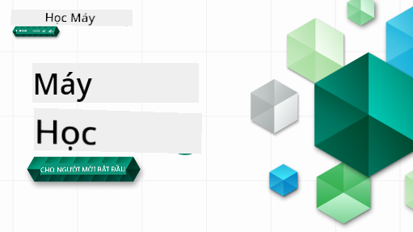

<!--
CO_OP_TRANSLATOR_METADATA:
{
  "original_hash": "7a13afb3674838f557d61f8d67e4d5f8",
  "translation_date": "2025-10-24T09:15:32+00:00",
  "source_file": "README.md",
  "language_code": "vi"
}
-->

### 🌐 Hỗ trợ đa ngôn ngữ

#### Được hỗ trợ qua GitHub Action (Tự động & Luôn cập nhật)

<!-- CO-OP TRANSLATOR LANGUAGES TABLE START -->
[Arabic](../ar/README.md) | [Bengali](../bn/README.md) | [Bulgarian](../bg/README.md) | [Burmese (Myanmar)](../my/README.md) | [Chinese (Simplified)](../zh/README.md) | [Chinese (Traditional, Hong Kong)](../hk/README.md) | [Chinese (Traditional, Macau)](../mo/README.md) | [Chinese (Traditional, Taiwan)](../tw/README.md) | [Croatian](../hr/README.md) | [Czech](../cs/README.md) | [Danish](../da/README.md) | [Dutch](../nl/README.md) | [Estonian](../et/README.md) | [Finnish](../fi/README.md) | [French](../fr/README.md) | [German](../de/README.md) | [Greek](../el/README.md) | [Hebrew](../he/README.md) | [Hindi](../hi/README.md) | [Hungarian](../hu/README.md) | [Indonesian](../id/README.md) | [Italian](../it/README.md) | [Japanese](../ja/README.md) | [Korean](../ko/README.md) | [Lithuanian](../lt/README.md) | [Malay](../ms/README.md) | [Marathi](../mr/README.md) | [Nepali](../ne/README.md) | [Norwegian](../no/README.md) | [Persian (Farsi)](../fa/README.md) | [Polish](../pl/README.md) | [Portuguese (Brazil)](../br/README.md) | [Portuguese (Portugal)](../pt/README.md) | [Punjabi (Gurmukhi)](../pa/README.md) | [Romanian](../ro/README.md) | [Russian](../ru/README.md) | [Serbian (Cyrillic)](../sr/README.md) | [Slovak](../sk/README.md) | [Slovenian](../sl/README.md) | [Spanish](../es/README.md) | [Swahili](../sw/README.md) | [Swedish](../sv/README.md) | [Tagalog (Filipino)](../tl/README.md) | [Tamil](../ta/README.md) | [Thai](../th/README.md) | [Turkish](../tr/README.md) | [Ukrainian](../uk/README.md) | [Urdu](../ur/README.md) | [Vietnamese](./README.md)
<!-- CO-OP TRANSLATOR LANGUAGES TABLE END -->

#### Tham gia cộng đồng của chúng tôi

Chúng tôi đang tổ chức một chuỗi học tập với AI trên Discord, tìm hiểu thêm và tham gia cùng chúng tôi tại [Learn with AI Series](https://aka.ms/learnwithai/discord) từ ngày 18 - 30 tháng 9, năm 2025. Bạn sẽ nhận được các mẹo và thủ thuật sử dụng GitHub Copilot cho Khoa học Dữ liệu.

# Học máy cho người mới bắt đầu - Một chương trình học

> 🌍 Du lịch vòng quanh thế giới khi chúng ta khám phá Học máy thông qua các nền văn hóa thế giới 🌍

Các chuyên gia đám mây tại Microsoft rất vui mừng giới thiệu chương trình học kéo dài 12 tuần, gồm 26 bài học về **Học máy**. Trong chương trình này, bạn sẽ tìm hiểu về những gì đôi khi được gọi là **học máy cổ điển**, chủ yếu sử dụng thư viện Scikit-learn và tránh học sâu, được đề cập trong chương trình học [AI for Beginners](https://aka.ms/ai4beginners). Kết hợp các bài học này với chương trình học ['Data Science for Beginners'](https://aka.ms/ds4beginners) của chúng tôi!

Hãy cùng chúng tôi du lịch vòng quanh thế giới khi áp dụng các kỹ thuật cổ điển này vào dữ liệu từ nhiều khu vực trên thế giới. Mỗi bài học bao gồm các bài kiểm tra trước và sau bài học, hướng dẫn viết để hoàn thành bài học, giải pháp, bài tập và nhiều hơn nữa. Phương pháp học tập dựa trên dự án của chúng tôi cho phép bạn học trong khi xây dựng, một cách đã được chứng minh để kỹ năng mới được ghi nhớ lâu hơn.

**✍️ Cảm ơn chân thành đến các tác giả** Jen Looper, Stephen Howell, Francesca Lazzeri, Tomomi Imura, Cassie Breviu, Dmitry Soshnikov, Chris Noring, Anirban Mukherjee, Ornella Altunyan, Ruth Yakubu và Amy Boyd

**🎨 Cảm ơn các họa sĩ minh họa** Tomomi Imura, Dasani Madipalli, và Jen Looper

**🙏 Đặc biệt cảm ơn 🙏 các Đại sứ Sinh viên Microsoft, những người đã đóng góp nội dung, đánh giá và viết bài**, đặc biệt là Rishit Dagli, Muhammad Sakib Khan Inan, Rohan Raj, Alexandru Petrescu, Abhishek Jaiswal, Nawrin Tabassum, Ioan Samuila, và Snigdha Agarwal

**🤩 Cảm ơn thêm các Đại sứ Sinh viên Microsoft Eric Wanjau, Jasleen Sondhi, và Vidushi Gupta cho các bài học về R của chúng tôi!**

# Bắt đầu

Thực hiện các bước sau:
1. **Fork kho lưu trữ**: Nhấn vào nút "Fork" ở góc trên bên phải của trang này.
2. **Clone kho lưu trữ**:   `git clone https://github.com/microsoft/ML-For-Beginners.git`

> [tìm tất cả tài nguyên bổ sung cho khóa học này trong bộ sưu tập Microsoft Learn của chúng tôi](https://learn.microsoft.com/en-us/collections/qrqzamz1nn2wx3?WT.mc_id=academic-77952-bethanycheum)

> 🔧 **Cần trợ giúp?** Kiểm tra [Hướng dẫn khắc phục sự cố](TROUBLESHOOTING.md) của chúng tôi để tìm giải pháp cho các vấn đề phổ biến về cài đặt, thiết lập và chạy bài học.

**[Sinh viên](https://aka.ms/student-page)**, để sử dụng chương trình học này, hãy fork toàn bộ kho lưu trữ vào tài khoản GitHub của bạn và hoàn thành các bài tập một mình hoặc cùng nhóm:

- Bắt đầu với bài kiểm tra trước bài giảng.
- Đọc bài giảng và hoàn thành các hoạt động, dừng lại và suy ngẫm tại mỗi phần kiểm tra kiến thức.
- Cố gắng tạo các dự án bằng cách hiểu bài học thay vì chạy mã giải pháp; tuy nhiên mã đó có sẵn trong các thư mục `/solution` của mỗi bài học dựa trên dự án.
- Làm bài kiểm tra sau bài giảng.
- Hoàn thành thử thách.
- Hoàn thành bài tập.
- Sau khi hoàn thành một nhóm bài học, hãy truy cập [Bảng thảo luận](https://github.com/microsoft/ML-For-Beginners/discussions) và "học lớn tiếng" bằng cách điền vào bảng đánh giá PAT phù hợp. 'PAT' là Công cụ Đánh giá Tiến độ, một bảng đánh giá bạn điền để nâng cao việc học của mình. Bạn cũng có thể phản hồi các PAT khác để chúng ta cùng học hỏi.

> Để nghiên cứu thêm, chúng tôi khuyến nghị theo dõi các mô-đun và lộ trình học [Microsoft Learn](https://docs.microsoft.com/en-us/users/jenlooper-2911/collections/k7o7tg1gp306q4?WT.mc_id=academic-77952-leestott).

**Giáo viên**, chúng tôi đã [bao gồm một số gợi ý](for-teachers.md) về cách sử dụng chương trình học này.

---

## Video hướng dẫn

Một số bài học có sẵn dưới dạng video ngắn. Bạn có thể tìm thấy tất cả các video này trong các bài học, hoặc trên [danh sách phát ML for Beginners trên kênh YouTube Microsoft Developer](https://aka.ms/ml-beginners-videos) bằng cách nhấn vào hình ảnh dưới đây.

---

## Gặp gỡ đội ngũ

**Gif bởi** [Mohit Jaisal](https://linkedin.com/in/mohitjaisal)

> 🎥 Nhấn vào hình ảnh trên để xem video về dự án và những người đã tạo ra nó!

---

## Phương pháp giảng dạy

Chúng tôi đã chọn hai nguyên tắc giảng dạy khi xây dựng chương trình học này: đảm bảo rằng nó thực hành **dựa trên dự án** và bao gồm **các bài kiểm tra thường xuyên**. Ngoài ra, chương trình học này có một **chủ đề chung** để tạo sự gắn kết.

Bằng cách đảm bảo nội dung phù hợp với các dự án, quá trình học tập trở nên hấp dẫn hơn đối với học viên và khả năng ghi nhớ các khái niệm sẽ được tăng cường. Ngoài ra, một bài kiểm tra không áp lực trước lớp sẽ định hướng học viên học một chủ đề, trong khi bài kiểm tra thứ hai sau lớp đảm bảo khả năng ghi nhớ tốt hơn. Chương trình học này được thiết kế để linh hoạt và thú vị, có thể học toàn bộ hoặc từng phần. Các dự án bắt đầu từ nhỏ và ngày càng phức tạp hơn vào cuối chu kỳ 12 tuần. Chương trình học này cũng bao gồm một phần phụ về các ứng dụng thực tế của ML, có thể được sử dụng như điểm cộng thêm hoặc làm cơ sở cho các cuộc thảo luận.

> Tìm [Quy tắc ứng xử](CODE_OF_CONDUCT.md), [Hướng dẫn đóng góp](CONTRIBUTING.md), [Hướng dẫn dịch thuật](TRANSLATIONS.md), và [Hướng dẫn khắc phục sự cố](TROUBLESHOOTING.md). Chúng tôi hoan nghênh phản hồi mang tính xây dựng của bạn!

## Mỗi bài học bao gồm

- sketchnote tùy chọn
- video bổ sung tùy chọn
- video hướng dẫn (chỉ một số bài học)
- [bài kiểm tra khởi động trước bài giảng](https://ff-quizzes.netlify.app/en/ml/)
- bài học viết
- đối với các bài học dựa trên dự án, hướng dẫn từng bước về cách xây dựng dự án
- kiểm tra kiến thức
- một thử thách
- tài liệu đọc bổ sung
- bài tập
- [bài kiểm tra sau bài giảng](https://ff-quizzes.netlify.app/en/ml/)

> **Lưu ý về ngôn ngữ**: Các bài học này chủ yếu được viết bằng Python, nhưng nhiều bài cũng có sẵn bằng R. Để hoàn thành bài học R, hãy vào thư mục `/solution` và tìm các bài học R. Chúng bao gồm phần mở rộng .rmd đại diện cho một tệp **R Markdown**, có thể được định nghĩa đơn giản là sự kết hợp của `code chunks` (của R hoặc các ngôn ngữ khác) và `YAML header` (hướng dẫn cách định dạng đầu ra như PDF) trong một `Markdown document`. Do đó, nó là một khung tác giả mẫu mực cho khoa học dữ liệu vì nó cho phép bạn kết hợp mã của mình, đầu ra của nó và suy nghĩ của bạn bằng cách cho phép bạn viết chúng trong Markdown. Hơn nữa, các tài liệu R Markdown có thể được hiển thị dưới các định dạng đầu ra như PDF, HTML, hoặc Word.

> **Lưu ý về bài kiểm tra**: Tất cả các bài kiểm tra được chứa trong [thư mục Quiz App](../../quiz-app), tổng cộng 52 bài kiểm tra, mỗi bài gồm ba câu hỏi. Chúng được liên kết từ trong các bài học nhưng ứng dụng kiểm tra có thể được chạy cục bộ; làm theo hướng dẫn trong thư mục `quiz-app` để lưu trữ cục bộ hoặc triển khai lên Azure.

| Số bài học |                             Chủ đề                              |                   Nhóm bài học                   | Mục tiêu học tập                                                                                                             |                                                              Liên kết bài học                                                               |                        Tác giả                        |
| :-----------: | :------------------------------------------------------------: | :-------------------------------------------------: | ------------------------------------------------------------------------------------------------------------------------------- | :--------------------------------------------------------------------------------------------------------------------------------------: | :--------------------------------------------------: |
|      01       |                Giới thiệu về học máy                           |      [Giới thiệu](1-Introduction/README.md)         | Tìm hiểu các khái niệm cơ bản về học máy                                                                                       |                                             [Bài học](1-Introduction/1-intro-to-ML/README.md)                                             |                       Muhammad                       |
|      02       |                Lịch sử của học máy                             |      [Giới thiệu](1-Introduction/README.md)         | Tìm hiểu lịch sử đằng sau lĩnh vực này                                                                                         |                                            [Bài học](1-Introduction/2-history-of-ML/README.md)                                            |                     Jen và Amy                      |
|      03       |                 Sự công bằng và học máy                        |      [Giới thiệu](1-Introduction/README.md)         | Những vấn đề triết học quan trọng về sự công bằng mà học viên cần cân nhắc khi xây dựng và áp dụng mô hình học máy là gì?       |                                              [Bài học](1-Introduction/3-fairness/README.md)                                               |                        Tomomi                        |
|      04       |                Các kỹ thuật trong học máy                     |      [Giới thiệu](1-Introduction/README.md)         | Các nhà nghiên cứu học máy sử dụng những kỹ thuật nào để xây dựng mô hình học máy?                                              |                                          [Bài học](1-Introduction/4-techniques-of-ML/README.md)                                           |                    Chris và Jen                     |
|      05       |                   Giới thiệu về hồi quy                        |        [Hồi quy](2-Regression/README.md)            | Bắt đầu với Python và Scikit-learn để xây dựng mô hình hồi quy                                                                  |         [Python](2-Regression/1-Tools/README.md) • [R](../../2-Regression/1-Tools/solution/R/lesson_1.html)         |      Jen • Eric Wanjau       |
|      06       |                Giá bí ngô Bắc Mỹ 🎃                            |        [Hồi quy](2-Regression/README.md)            | Trực quan hóa và làm sạch dữ liệu để chuẩn bị cho học máy                                                                        |          [Python](2-Regression/2-Data/README.md) • [R](../../2-Regression/2-Data/solution/R/lesson_2.html)          |      Jen • Eric Wanjau       |
|      07       |                Giá bí ngô Bắc Mỹ 🎃                            |        [Hồi quy](2-Regression/README.md)            | Xây dựng mô hình hồi quy tuyến tính và hồi quy đa thức                                                                          |        [Python](2-Regression/3-Linear/README.md) • [R](../../2-Regression/3-Linear/solution/R/lesson_3.html)        |      Jen và Dmitry • Eric Wanjau       |
|      08       |                Giá bí ngô Bắc Mỹ 🎃                            |        [Hồi quy](2-Regression/README.md)            | Xây dựng mô hình hồi quy logistic                                                                                              |     [Python](2-Regression/4-Logistic/README.md) • [R](../../2-Regression/4-Logistic/solution/R/lesson_4.html)      |      Jen • Eric Wanjau       |
|      09       |                          Ứng dụng web 🔌                       |           [Ứng dụng web](3-Web-App/README.md)       | Xây dựng ứng dụng web để sử dụng mô hình đã được huấn luyện                                                                     |                                                 [Python](3-Web-App/1-Web-App/README.md)                                                  |                         Jen                          |
|      10       |                 Giới thiệu về phân loại                        |    [Phân loại](4-Classification/README.md)          | Làm sạch, chuẩn bị và trực quan hóa dữ liệu; giới thiệu về phân loại                                                             | [Python](4-Classification/1-Introduction/README.md) • [R](../../4-Classification/1-Introduction/solution/R/lesson_10.html)  | Jen và Cassie • Eric Wanjau |
|      11       |             Các món ăn ngon của châu Á và Ấn Độ 🍜             |    [Phân loại](4-Classification/README.md)          | Giới thiệu về các bộ phân loại                                                                                                  | [Python](4-Classification/2-Classifiers-1/README.md) • [R](../../4-Classification/2-Classifiers-1/solution/R/lesson_11.html) | Jen và Cassie • Eric Wanjau |
|      12       |             Các món ăn ngon của châu Á và Ấn Độ 🍜             |    [Phân loại](4-Classification/README.md)          | Nhiều bộ phân loại hơn                                                                                                          | [Python](4-Classification/3-Classifiers-2/README.md) • [R](../../4-Classification/3-Classifiers-2/solution/R/lesson_12.html) | Jen và Cassie • Eric Wanjau |
|      13       |             Các món ăn ngon của châu Á và Ấn Độ 🍜             |    [Phân loại](4-Classification/README.md)          | Xây dựng ứng dụng web gợi ý sử dụng mô hình của bạn                                                                             |                                              [Python](4-Classification/4-Applied/README.md)                                              |                         Jen                          |
|      14       |                   Giới thiệu về phân cụm                       |        [Phân cụm](5-Clustering/README.md)           | Làm sạch, chuẩn bị và trực quan hóa dữ liệu; giới thiệu về phân cụm                                                              |         [Python](5-Clustering/1-Visualize/README.md) • [R](../../5-Clustering/1-Visualize/solution/R/lesson_14.html)         |      Jen • Eric Wanjau       |
|      15       |              Khám phá sở thích âm nhạc Nigeria 🎧              |        [Phân cụm](5-Clustering/README.md)           | Khám phá phương pháp phân cụm K-Means                                                                                          |           [Python](5-Clustering/2-K-Means/README.md) • [R](../../5-Clustering/2-K-Means/solution/R/lesson_15.html)           |      Jen • Eric Wanjau       |
|      16       |        Giới thiệu về xử lý ngôn ngữ tự nhiên ☕️               |   [Xử lý ngôn ngữ tự nhiên](6-NLP/README.md)        | Tìm hiểu những điều cơ bản về NLP bằng cách xây dựng một bot đơn giản                                                           |                                             [Python](6-NLP/1-Introduction-to-NLP/README.md)                                              |                       Stephen                        |
|      17       |                      Các nhiệm vụ NLP phổ biến ☕️             |   [Xử lý ngôn ngữ tự nhiên](6-NLP/README.md)        | Nâng cao kiến thức về NLP bằng cách hiểu các nhiệm vụ phổ biến khi xử lý cấu trúc ngôn ngữ                                       |                                                    [Python](6-NLP/2-Tasks/README.md)                                                     |                       Stephen                        |
|      18       |             Dịch thuật và phân tích cảm xúc ♥️                 |   [Xử lý ngôn ngữ tự nhiên](6-NLP/README.md)        | Dịch thuật và phân tích cảm xúc với Jane Austen                                                                                 |                                            [Python](6-NLP/3-Translation-Sentiment/README.md)                                             |                       Stephen                        |
|      19       |                  Khách sạn lãng mạn ở châu Âu ♥️              |   [Xử lý ngôn ngữ tự nhiên](6-NLP/README.md)        | Phân tích cảm xúc với đánh giá khách sạn 1                                                                                      |                                               [Python](6-NLP/4-Hotel-Reviews-1/README.md)                                                |                       Stephen                        |
|      20       |                  Khách sạn lãng mạn ở châu Âu ♥️              |   [Xử lý ngôn ngữ tự nhiên](6-NLP/README.md)        | Phân tích cảm xúc với đánh giá khách sạn 2                                                                                      |                                               [Python](6-NLP/5-Hotel-Reviews-2/README.md)                                                |                       Stephen                        |
|      21       |            Giới thiệu về dự báo chuỗi thời gian                |        [Chuỗi thời gian](7-TimeSeries/README.md)    | Giới thiệu về dự báo chuỗi thời gian                                                                                           |                                             [Python](7-TimeSeries/1-Introduction/README.md)                                              |                      Francesca                       |
|      22       | ⚡️ Sử dụng năng lượng thế giới ⚡️ - dự báo chuỗi thời gian với ARIMA |        [Chuỗi thời gian](7-TimeSeries/README.md)    | Dự báo chuỗi thời gian với ARIMA                                                                                               |                                                 [Python](7-TimeSeries/2-ARIMA/README.md)                                                 |                      Francesca                       |
|      23       |  ⚡️ Sử dụng năng lượng thế giới ⚡️ - dự báo chuỗi thời gian với SVR  |        [Chuỗi thời gian](7-TimeSeries/README.md)    | Dự báo chuỗi thời gian với Support Vector Regressor                                                                            |                                                  [Python](7-TimeSeries/3-SVR/README.md)                                                  |                       Anirban                        |
|      24       |             Giới thiệu về học tăng cường                       | [Học tăng cường](8-Reinforcement/README.md)         | Giới thiệu về học tăng cường với Q-Learning                                                                                     |                                             [Python](8-Reinforcement/1-QLearning/README.md)                                              |                        Dmitry                        |
|      25       |                 Giúp Peter tránh xa con sói! 🐺               | [Học tăng cường](8-Reinforcement/README.md)         | Học tăng cường với Gym                                                                                                          |                                                [Python](8-Reinforcement/2-Gym/README.md)                                                 |                        Dmitry                        |
|  Postscript   |            Các tình huống và ứng dụng học máy thực tế          |      [Học máy trong thực tế](9-Real-World/README.md) | Các ứng dụng thực tế thú vị và tiết lộ của học máy cổ điển                                                                       |                                             [Bài học](9-Real-World/1-Applications/README.md)                                              |                         Team                         |
|  Postscript   |            Gỡ lỗi mô hình trong học máy bằng bảng điều khiển RAI |      [Học máy trong thực tế](9-Real-World/README.md) | Gỡ lỗi mô hình trong học máy bằng các thành phần bảng điều khiển AI có trách nhiệm                                              |                                             [Bài học](9-Real-World/2-Debugging-ML-Models/README.md)                                              |                         Ruth Yakubu                       |

> [tìm tất cả tài nguyên bổ sung cho khóa học này trong bộ sưu tập Microsoft Learn của chúng tôi](https://learn.microsoft.com/en-us/collections/qrqzamz1nn2wx3?WT.mc_id=academic-77952-bethanycheum)

## Truy cập ngoại tuyến

Bạn có thể chạy tài liệu này ngoại tuyến bằng cách sử dụng [Docsify](https://docsify.js.org/#/). Fork repo này, [cài đặt Docsify](https://docsify.js.org/#/quickstart) trên máy của bạn, sau đó trong thư mục gốc của repo này, gõ `docsify serve`. Trang web sẽ được phục vụ trên cổng 3000 tại localhost của bạn: `localhost:3000`.

## PDFs

Tìm tệp pdf của chương trình học với các liên kết [tại đây](https://microsoft.github.io/ML-For-Beginners/pdf/readme.pdf).

## 🎒 Các khóa học khác 

Nhóm của chúng tôi sản xuất các khóa học khác! Hãy xem:

### Azure / Edge / MCP / Agents

---

### Chuỗi Generative AI

[-9333EA?style=for-the-badge&labelColor=E5E7EB&color=9333EA)](https://github.com/microsoft/Generative-AI-for-beginners-dotnet?WT.mc_id=academic-105485-koreyst)
[-C084FC?style=for-the-badge&labelColor=E5E7EB&color=C084FC)](https://github.com/microsoft/generative-ai-for-beginners-java?WT.mc_id=academic-105485-koreyst)
[-E879F9?style=for-the-badge&labelColor=E5E7EB&color=E879F9)](https://github.com/microsoft/generative-ai-with-javascript?WT.mc_id=academic-105485-koreyst)

---

### Học tập cốt lõi
  
  
  
  
  
  
  

---

### Loạt bài Copilot  
  
  
  

## Nhận Hỗ Trợ  

Nếu bạn gặp khó khăn hoặc có câu hỏi về việc xây dựng ứng dụng AI, hãy tham gia:  

  

Nếu bạn có phản hồi về sản phẩm hoặc gặp lỗi trong quá trình xây dựng, hãy truy cập:  

  

---

**Tuyên bố miễn trừ trách nhiệm**:  
Tài liệu này đã được dịch bằng dịch vụ dịch thuật AI [Co-op Translator](https://github.com/Azure/co-op-translator). Mặc dù chúng tôi cố gắng đảm bảo độ chính xác, xin lưu ý rằng các bản dịch tự động có thể chứa lỗi hoặc không chính xác. Tài liệu gốc bằng ngôn ngữ bản địa nên được coi là nguồn thông tin chính thức. Đối với thông tin quan trọng, nên sử dụng dịch vụ dịch thuật chuyên nghiệp bởi con người. Chúng tôi không chịu trách nhiệm cho bất kỳ sự hiểu lầm hoặc diễn giải sai nào phát sinh từ việc sử dụng bản dịch này.