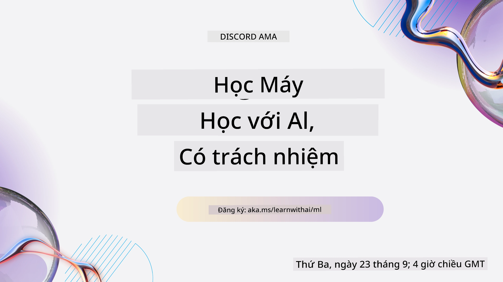
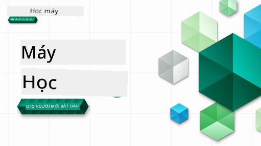

<!--
CO_OP_TRANSLATOR_METADATA:
{
  "original_hash": "ec8385130a8239ad9d827175126a0722",
  "translation_date": "2026-01-01T12:34:27+00:00",
  "source_file": "README.md",
  "language_code": "vi"
}
-->

### 🌐 Hỗ trợ Đa ngôn ngữ

#### Được hỗ trợ thông qua GitHub Action (Tự động & Luôn cập nhật)

<!-- CO-OP TRANSLATOR LANGUAGES TABLE START -->
[Tiếng Ả Rập](../ar/README.md) | [Tiếng Bengal](../bn/README.md) | [Tiếng Bungari](../bg/README.md) | [Tiếng Miến Điện (Myanmar)](../my/README.md) | [Tiếng Trung (Giản thể)](../zh/README.md) | [Tiếng Trung (Phồn thể, Hồng Kông)](../hk/README.md) | [Tiếng Trung (Phồn thể, Macau)](../mo/README.md) | [Tiếng Trung (Phồn thể, Đài Loan)](../tw/README.md) | [Tiếng Croatia](../hr/README.md) | [Tiếng Séc](../cs/README.md) | [Tiếng Đan Mạch](../da/README.md) | [Tiếng Hà Lan](../nl/README.md) | [Tiếng Estonia](../et/README.md) | [Tiếng Phần Lan](../fi/README.md) | [Tiếng Pháp](../fr/README.md) | [Tiếng Đức](../de/README.md) | [Tiếng Hy Lạp](../el/README.md) | [Tiếng Do Thái](../he/README.md) | [Tiếng Hindi](../hi/README.md) | [Tiếng Hungary](../hu/README.md) | [Tiếng Indonesia](../id/README.md) | [Tiếng Ý](../it/README.md) | [Tiếng Nhật](../ja/README.md) | [Tiếng Kannada](../kn/README.md) | [Tiếng Hàn](../ko/README.md) | [Tiếng Litva](../lt/README.md) | [Tiếng Mã Lai](../ms/README.md) | [Tiếng Malayalam](../ml/README.md) | [Tiếng Marathi](../mr/README.md) | [Tiếng Nepal](../ne/README.md) | [Pidgin Nigeria](../pcm/README.md) | [Tiếng Na Uy](../no/README.md) | [Tiếng Ba Tư (Farsi)](../fa/README.md) | [Tiếng Ba Lan](../pl/README.md) | [Tiếng Bồ Đào Nha (Brazil)](../br/README.md) | [Tiếng Bồ Đào Nha (Bồ Đào Nha)](../pt/README.md) | [Tiếng Punjabi (Gurmukhi)](../pa/README.md) | [Tiếng Romania](../ro/README.md) | [Tiếng Nga](../ru/README.md) | [Tiếng Serbia (Cyrillic)](../sr/README.md) | [Tiếng Slovakia](../sk/README.md) | [Tiếng Slovenia](../sl/README.md) | [Tiếng Tây Ban Nha](../es/README.md) | [Tiếng Swahili](../sw/README.md) | [Tiếng Thụy Điển](../sv/README.md) | [Tiếng Tagalog (Filipino)](../tl/README.md) | [Tiếng Tamil](../ta/README.md) | [Tiếng Telugu](../te/README.md) | [Tiếng Thái](../th/README.md) | [Tiếng Thổ Nhĩ Kỳ](../tr/README.md) | [Tiếng Ukraina](../uk/README.md) | [Tiếng Urdu](../ur/README.md) | [Tiếng Việt](./README.md)
<!-- CO-OP TRANSLATOR LANGUAGES TABLE END -->

#### Tham gia Cộng đồng của Chúng tôi

Chúng tôi có một chuỗi Discord Learn with AI đang diễn ra, tìm hiểu thêm và tham gia cùng chúng tôi tại [Chuỗi Learn with AI](https://aka.ms/learnwithai/discord) từ ngày 18 - 30 tháng 9, 2025. Bạn sẽ nhận được mẹo và thủ thuật sử dụng GitHub Copilot cho Data Science.

# Học Máy cho Người Mới Bắt Đầu - Một Chương trình giảng dạy

> 🌍 Du lịch vòng quanh thế giới khi chúng ta khám phá Học Máy thông qua các nền văn hóa trên toàn cầu 🌍

Các Cloud Advocates tại Microsoft rất vui được cung cấp một chương trình giảng dạy 12 tuần, 26 bài hoàn toàn về **Học Máy**. Trong chương trình này, bạn sẽ học về cái mà đôi khi được gọi là **học máy cổ điển**, chủ yếu sử dụng Scikit-learn làm thư viện và tránh học sâu, phần này được đề cập trong [chương trình 'AI cho Người Mới Bắt Đầu'](https://aka.ms/ai4beginners). Hãy ghép những bài học này với [chương trình 'Khoa học dữ liệu cho Người Mới Bắt Đầu'](https://aka.ms/ds4beginners) của chúng tôi nữa!

Hãy đồng hành cùng chúng tôi vòng quanh thế giới khi chúng ta áp dụng những kỹ thuật cổ điển này cho dữ liệu từ nhiều khu vực khác nhau. Mỗi bài học bao gồm bài kiểm tra trước và sau bài học, hướng dẫn viết để hoàn thành bài học, một lời giải, một bài tập, và hơn thế nữa. Phương pháp dạy theo dự án của chúng tôi cho phép bạn học trong khi xây dựng, một cách đã được chứng minh giúp kỹ năng mới dễ ghi nhớ hơn.

**✍️ Lời cảm ơn nồng hậu tới các tác giả của chúng tôi** Jen Looper, Stephen Howell, Francesca Lazzeri, Tomomi Imura, Cassie Breviu, Dmitry Soshnikov, Chris Noring, Anirban Mukherjee, Ornella Altunyan, Ruth Yakubu và Amy Boyd

**🎨 Cảm ơn các họa sĩ minh họa** Tomomi Imura, Dasani Madipalli, và Jen Looper

**🙏 Lời cảm ơn đặc biệt 🙏 tới các Microsoft Student Ambassador là tác giả, người đánh giá và đóng góp nội dung**, đặc biệt Rishit Dagli, Muhammad Sakib Khan Inan, Rohan Raj, Alexandru Petrescu, Abhishek Jaiswal, Nawrin Tabassum, Ioan Samuila, và Snigdha Agarwal

**🤩 Xin cảm ơn thêm tới Microsoft Student Ambassadors Eric Wanjau, Jasleen Sondhi, và Vidushi Gupta cho các bài học R của chúng tôi!**

# Bắt đầu

Thực hiện các bước sau:
1. **Fork Kho lưu trữ**: Nhấp vào nút "Fork" ở góc trên bên phải của trang này.
2. **Clone kho lưu trữ**:   `git clone https://github.com/microsoft/ML-For-Beginners.git`

> [tìm tất cả các tài nguyên bổ sung cho khóa học này trong bộ sưu tập Microsoft Learn của chúng tôi](https://learn.microsoft.com/en-us/collections/qrqzamz1nn2wx3?WT.mc_id=academic-77952-bethanycheum)

> 🔧 **Cần trợ giúp?** Xem [Hướng dẫn Khắc phục sự cố](TROUBLESHOOTING.md) của chúng tôi để tìm giải pháp cho các sự cố phổ biến về cài đặt, cấu hình và chạy các bài học.

**[Học viên](https://aka.ms/student-page)**, để sử dụng chương trình này, fork toàn bộ repo vào tài khoản GitHub của bạn và hoàn thành các bài tập một mình hoặc theo nhóm:

- Bắt đầu với một bài kiểm tra khởi động trước bài giảng.
- Đọc bài giảng và hoàn thành các hoạt động, tạm dừng và suy ngẫm ở mỗi kiểm tra kiến thức.
- Cố gắng tạo các dự án bằng cách hiểu bài học thay vì chạy mã giải; tuy nhiên mã đó có sẵn trong các thư mục `/solution` trong mỗi bài học theo dự án.
- Làm bài kiểm tra sau bài giảng.
- Hoàn thành thử thách.
- Hoàn thành bài tập.
- Sau khi hoàn thành một nhóm bài học, hãy truy cập [Bảng Thảo luận](https://github.com/microsoft/ML-For-Beginners/discussions) và "học cùng nhau" bằng cách điền vào rubric PAT phù hợp. 'PAT' là một Công cụ Đánh giá Tiến độ, là rubric bạn điền vào để thúc đẩy việc học của mình. Bạn cũng có thể phản ứng với các PAT khác để chúng ta cùng học.

> Để học sâu hơn, chúng tôi khuyên bạn theo các module và lộ trình học sau trên [Microsoft Learn](https://docs.microsoft.com/en-us/users/jenlooper-2911/collections/k7o7tg1gp306q4?WT.mc_id=academic-77952-leestott).

**Giáo viên**, chúng tôi đã [đưa một số gợi ý](for-teachers.md) về cách sử dụng chương trình này.

---

## Video hướng dẫn

Một số bài học có sẵn dưới dạng video ngắn. Bạn có thể tìm tất cả những video này nhúng trong các bài học, hoặc trên [danh sách phát ML for Beginners trên kênh Microsoft Developer YouTube](https://aka.ms/ml-beginners-videos) bằng cách nhấp vào hình ảnh bên dưới.

---

## Gặp Gỡ Đội Ngũ

**Ảnh GIF bởi** [Mohit Jaisal](https://linkedin.com/in/mohitjaisal)

> 🎥 Nhấp vào hình ảnh ở trên để xem video về dự án và những người đã tạo ra nó!

---

## Phương pháp giảng dạy

Chúng tôi đã chọn hai nguyên tắc sư phạm khi xây dựng chương trình này: đảm bảo rằng nó mang tính thực hành **theo dự án** và bao gồm **các bài kiểm tra thường xuyên**. Ngoài ra, chương trình này có một **chủ đề** chung để tạo sự liên kết.

Bằng cách đảm bảo nội dung phù hợp với các dự án, quá trình học trở nên hấp dẫn hơn cho học sinh và việc ghi nhớ khái niệm sẽ được tăng cường. Thêm vào đó, một bài kiểm tra trước lớp không áp lực sẽ thiết lập ý định học tập của học viên về một chủ đề, trong khi bài kiểm tra thứ hai sau lớp đảm bảo việc ghi nhớ lâu hơn. Chương trình này được thiết kế linh hoạt và thú vị, có thể học toàn bộ hoặc một phần. Các dự án bắt đầu nhỏ và trở nên phức tạp hơn theo cuối chu kỳ 12 tuần. Chương trình này cũng bao gồm một phần phụ lục về các ứng dụng thực tế của ML, có thể dùng làm điểm cộng thêm hoặc làm cơ sở cho thảo luận.

> Tìm [Bộ Quy tắc Ứng xử](CODE_OF_CONDUCT.md), [Hướng dẫn Đóng góp](CONTRIBUTING.md), [Dịch thuật](TRANSLATIONS.md), và [Khắc phục sự cố](TROUBLESHOOTING.md) của chúng tôi. Chúng tôi hoan nghênh phản hồi mang tính xây dựng của bạn!

## Mỗi bài học bao gồm

- sketchnote tùy chọn
- video bổ sung tùy chọn
- video hướng dẫn (chỉ một số bài)
- [bài kiểm tra khởi động trước bài giảng](https://ff-quizzes.netlify.app/en/ml/)
- bài học viết
- đối với các bài học theo dự án, hướng dẫn từng bước về cách xây dựng dự án
- kiểm tra kiến thức
- một thử thách
- tài liệu đọc bổ sung
- bài tập
- [bài kiểm tra sau bài giảng](https://ff-quizzes.netlify.app/en/ml/)

> **Ghi chú về ngôn ngữ**: Các bài học này chủ yếu được viết bằng Python, nhưng nhiều bài cũng có sẵn bằng R. Để hoàn thành một bài học R, hãy vào thư mục `/solution` và tìm các bài học R. Chúng bao gồm phần mở rộng .rmd đại diện cho một tệp **R Markdown** có thể được định nghĩa đơn giản là nhúng `code chunks` (của R hoặc ngôn ngữ khác) và một `YAML header` (hướng dẫn cách định dạng đầu ra như PDF) trong một `Markdown document`. Do đó, nó phục vụ như một khung soạn thảo mẫu cho khoa học dữ liệu vì nó cho phép bạn kết hợp mã, đầu ra của mã và suy nghĩ của bạn bằng cách cho phép bạn viết chúng trong Markdown. Hơn nữa, các tài liệu R Markdown có thể được render ra các định dạng đầu ra như PDF, HTML hoặc Word.

> **Ghi chú về các bài kiểm tra**: Tất cả các bài kiểm tra được chứa trong [thư mục Quiz App](../../quiz-app), tổng cộng 52 bài kiểm tra, mỗi bài gồm ba câu hỏi. Chúng được liên kết từ trong các bài học nhưng ứng dụng quiz có thể chạy cục bộ; làm theo hướng dẫn trong thư mục `quiz-app` để lưu trữ cục bộ hoặc triển khai lên Azure.

| Số Bài Học |                             Chủ đề                              |                   Nhóm Bài học                   | Mục tiêu học tập                                                                                                             |                                                              Bài học liên kết                                                               |                        Tác giả                        |
| :-----------: | :------------------------------------------------------------: | :-------------------------------------------------: | ------------------------------------------------------------------------------------------------------------------------------- | :--------------------------------------------------------------------------------------------------------------------------------------: | :--------------------------------------------------: |
|      01       |                Giới thiệu về học máy                |      [Giới thiệu](1-Introduction/README.md)       | Tìm hiểu các khái niệm cơ bản về học máy                                                                                |                                             [Bài học](1-Introduction/1-intro-to-ML/README.md)                                             |                       Muhammad                       |
|      02       |                Lịch sử của học máy                 |      [Giới thiệu](1-Introduction/README.md)       | Tìm hiểu lịch sử nền tảng của lĩnh vực này                                                                                         |                                            [Bài học](1-Introduction/2-history-of-ML/README.md)                                            |                     Jen and Amy                      |
|      03       |                 Công bằng trong học máy                  |      [Giới thiệu](1-Introduction/README.md)       | Những vấn đề triết học quan trọng xung quanh công bằng mà sinh viên nên xem xét khi xây dựng và áp dụng các mô hình ML là gì? |                                              [Bài học](1-Introduction/3-fairness/README.md)                                               |                        Tomomi                        |
|      04       |                Các kỹ thuật trong học máy                 |      [Giới thiệu](1-Introduction/README.md)       | Các nhà nghiên cứu ML sử dụng những kỹ thuật nào để xây dựng các mô hình ML?                                                                       |                                          [Bài học](1-Introduction/4-techniques-of-ML/README.md)                                           |                    Chris and Jen                     |
|      05       |                   Giới thiệu về hồi quy                   |        [Hồi quy](2-Regression/README.md)         | Bắt đầu với Python và Scikit-learn cho các mô hình hồi quy                                                                  |         [Python](2-Regression/1-Tools/README.md) • [R](../../2-Regression/1-Tools/solution/R/lesson_1.html)         |      Jen • Eric Wanjau       |
|      06       |                North American pumpkin prices 🎃                |        [Hồi quy](2-Regression/README.md)         | Trực quan hóa và làm sạch dữ liệu để chuẩn bị cho học máy                                                                                  |          [Python](2-Regression/2-Data/README.md) • [R](../../2-Regression/2-Data/solution/R/lesson_2.html)          |      Jen • Eric Wanjau       |
|      07       |                North American pumpkin prices 🎃                |        [Hồi quy](2-Regression/README.md)         | Xây dựng các mô hình hồi quy tuyến tính và đa thức                                                                                   |        [Python](2-Regression/3-Linear/README.md) • [R](../../2-Regression/3-Linear/solution/R/lesson_3.html)        |      Jen and Dmitry • Eric Wanjau       |
|      08       |                North American pumpkin prices 🎃                |        [Hồi quy](2-Regression/README.md)         | Xây dựng mô hình hồi quy logistic                                                                                               |     [Python](2-Regression/4-Logistic/README.md) • [R](../../2-Regression/4-Logistic/solution/R/lesson_4.html)      |      Jen • Eric Wanjau       |
|      09       |                          Một ứng dụng web 🔌                          |           [Web App](3-Web-App/README.md)            | Xây dựng một ứng dụng web để sử dụng mô hình đã được huấn luyện của bạn                                                                                       |                                                 [Python](3-Web-App/1-Web-App/README.md)                                                  |                         Jen                          |
|      10       |                 Giới thiệu về phân loại                 |    [Classification](4-Classification/README.md)     | Làm sạch, chuẩn bị và trực quan hóa dữ liệu của bạn; giới thiệu về phân loại                                                            | [Python](4-Classification/1-Introduction/README.md) • [R](../../4-Classification/1-Introduction/solution/R/lesson_10.html)  | Jen and Cassie • Eric Wanjau |
|      11       |             Món ăn ngon châu Á và Ấn Độ 🍜             |    [Classification](4-Classification/README.md)     | Giới thiệu về các bộ phân loại                                                                                                     | [Python](4-Classification/2-Classifiers-1/README.md) • [R](../../4-Classification/2-Classifiers-1/solution/R/lesson_11.html) | Jen and Cassie • Eric Wanjau |
|      12       |             Món ăn ngon châu Á và Ấn Độ 🍜             |    [Classification](4-Classification/README.md)     | Thêm bộ phân loại                                                                                                                | [Python](4-Classification/3-Classifiers-2/README.md) • [R](../../4-Classification/3-Classifiers-2/solution/R/lesson_12.html) | Jen and Cassie • Eric Wanjau |
|      13       |             Món ăn ngon châu Á và Ấn Độ 🍜             |    [Classification](4-Classification/README.md)     | Xây dựng một ứng dụng web gợi ý sử dụng mô hình của bạn                                                                                    |                                              [Python](4-Classification/4-Applied/README.md)                                              |                         Jen                          |
|      14       |                   Giới thiệu về phân cụm                   |        [Clustering](5-Clustering/README.md)         | Làm sạch, chuẩn bị và trực quan hóa dữ liệu của bạn; Giới thiệu về phân cụm                                                                |         [Python](5-Clustering/1-Visualize/README.md) • [R](../../5-Clustering/1-Visualize/solution/R/lesson_14.html)         |      Jen • Eric Wanjau       |
|      15       |              Khám phá gu âm nhạc Nigeria 🎧              |        [Clustering](5-Clustering/README.md)         | Khám phá phương pháp phân cụm K-Means                                                                                           |           [Python](5-Clustering/2-K-Means/README.md) • [R](../../5-Clustering/2-K-Means/solution/R/lesson_15.html)           |      Jen • Eric Wanjau       |
|      16       |        Giới thiệu về xử lý ngôn ngữ tự nhiên ☕️         |   [Natural language processing](6-NLP/README.md)    | Tìm hiểu cơ bản về NLP bằng cách xây dựng một bot đơn giản                                                                             |                                             [Python](6-NLP/1-Introduction-to-NLP/README.md)                                              |                       Stephen                        |
|      17       |                      Các nhiệm vụ NLP phổ biến ☕️                      |   [Natural language processing](6-NLP/README.md)    | Nâng cao kiến thức NLP của bạn bằng cách hiểu các nhiệm vụ phổ biến khi xử lý cấu trúc ngôn ngữ                          |                                                    [Python](6-NLP/2-Tasks/README.md)                                                     |                       Stephen                        |
|      18       |             Dịch và phân tích cảm xúc ♥️              |   [Natural language processing](6-NLP/README.md)    | Dịch và phân tích cảm xúc với Jane Austen                                                                             |                                            [Python](6-NLP/3-Translation-Sentiment/README.md)                                             |                       Stephen                        |
|      19       |                  Khách sạn lãng mạn ở châu Âu ♥️                  |   [Natural language processing](6-NLP/README.md)    | Phân tích cảm xúc với đánh giá khách sạn 1                                                                                         |                                               [Python](6-NLP/4-Hotel-Reviews-1/README.md)                                                |                       Stephen                        |
|      20       |                  Khách sạn lãng mạn ở châu Âu ♥️                  |   [Natural language processing](6-NLP/README.md)    | Phân tích cảm xúc với đánh giá khách sạn 2                                                                                         |                                               [Python](6-NLP/5-Hotel-Reviews-2/README.md)                                                |                       Stephen                        |
|      21       |            Giới thiệu về dự báo chuỗi thời gian             |        [Time series](7-TimeSeries/README.md)        | Giới thiệu về dự báo chuỗi thời gian                                                                                         |                                             [Python](7-TimeSeries/1-Introduction/README.md)                                              |                      Francesca                       |
|      22       | ⚡️ World Power Usage ⚡️ - time series forecasting with ARIMA |        [Time series](7-TimeSeries/README.md)        | Dự báo chuỗi thời gian với ARIMA                                                                                              |                                                 [Python](7-TimeSeries/2-ARIMA/README.md)                                                 |                      Francesca                       |
|      23       |  ⚡️ World Power Usage ⚡️ - time series forecasting with SVR  |        [Time series](7-TimeSeries/README.md)        | Dự báo chuỗi thời gian với Support Vector Regressor                                                                           |                                                  [Python](7-TimeSeries/3-SVR/README.md)                                                  |                       Anirban                        |
|      24       |             Giới thiệu về học tăng cường             | [Reinforcement learning](8-Reinforcement/README.md) | Giới thiệu về học tăng cường với Q-Learning                                                                          |                                             [Python](8-Reinforcement/1-QLearning/README.md)                                              |                        Dmitry                        |
|      25       |                 Giúp Peter tránh con sói! 🐺                  | [Reinforcement learning](8-Reinforcement/README.md) | Gym học tăng cường                                                                                                      |                                                [Python](8-Reinforcement/2-Gym/README.md)                                                 |                        Dmitry                        |
|  Phụ lục   |            Các kịch bản và ứng dụng ML trong thế giới thực            |      [ML in the Wild](9-Real-World/README.md)       | Các ứng dụng thực tế thú vị và mang tính khai phá của ML cổ điển                                                               |                                             [Bài học](9-Real-World/1-Applications/README.md)                                              |                         Team                         |
|  Phụ lục   |            Gỡ lỗi mô hình trong ML sử dụng bảng điều khiển RAI          |      [ML in the Wild](9-Real-World/README.md)       | Gỡ lỗi mô hình trong Machine Learning sử dụng các thành phần của bảng điều khiển Responsible AI                                                              |                                             [Bài học](9-Real-World/2-Debugging-ML-Models/README.md)                                              |                         Ruth Yakubu                       |

> [tìm tất cả các tài nguyên bổ sung cho khóa học này trong bộ sưu tập Microsoft Learn của chúng tôi](https://learn.microsoft.com/en-us/collections/qrqzamz1nn2wx3?WT.mc_id=academic-77952-bethanycheum)

## Truy cập ngoại tuyến

Bạn có thể chạy tài liệu này ngoại tuyến bằng cách sử dụng [Docsify](https://docsify.js.org/#/). Fork repo này, [cài đặt Docsify](https://docsify.js.org/#/quickstart) trên máy cục bộ của bạn, và sau đó trong thư mục gốc của repo này, gõ `docsify serve`. Trang web sẽ được phục vụ trên cổng 3000 tại localhost của bạn: `localhost:3000`.

## Tệp PDF

Tìm tệp PDF của giáo trình với các liên kết [tại đây](https://microsoft.github.io/ML-For-Beginners/pdf/readme.pdf).

## 🎒 Các Khóa Học Khác 

Nhóm của chúng tôi sản xuất các khóa học khác! Xem thêm:

<!-- CO-OP TRANSLATOR OTHER COURSES START -->
### LangChain

---

### Azure / Edge / MCP / Agents

---
 
### Generative AI Series

[-9333EA?style=for-the-badge&labelColor=E5E7EB&color=9333EA)](https://github.com/microsoft/Generative-AI-for-beginners-dotnet?WT.mc_id=academic-105485-koreyst)
[-C084FC?style=for-the-badge&labelColor=E5E7EB&color=C084FC)](https://github.com/microsoft/generative-ai-for-beginners-java?WT.mc_id=academic-105485-koreyst)
[-E879F9?style=for-the-badge&labelColor=E5E7EB&color=E879F9)](https://github.com/microsoft/generative-ai-with-javascript?WT.mc_id=academic-105485-koreyst)

---
 
### Học tập cốt lõi

---
 
### Loạt Copilot

<!-- CO-OP TRANSLATOR OTHER COURSES END -->

## Nhận trợ giúp

Nếu bạn gặp khó khăn hoặc có bất kỳ câu hỏi nào về việc xây dựng ứng dụng AI. Tham gia cùng những người học khác và các nhà phát triển giàu kinh nghiệm trong các thảo luận về MCP. Đây là một cộng đồng hỗ trợ nơi mọi câu hỏi đều được hoan nghênh và kiến thức được chia sẻ tự do.

Nếu bạn có phản hồi về sản phẩm hoặc gặp lỗi khi xây dựng, hãy truy cập:

---

<!-- CO-OP TRANSLATOR DISCLAIMER START -->
Miễn trừ trách nhiệm:
Tài liệu này đã được dịch bằng dịch vụ dịch thuật AI [Co-op Translator](https://github.com/Azure/co-op-translator). Mặc dù chúng tôi nỗ lực để đảm bảo độ chính xác, xin lưu ý rằng các bản dịch tự động có thể chứa lỗi hoặc sai sót. Văn bản gốc bằng ngôn ngữ nguyên bản nên được coi là nguồn chính thức. Đối với thông tin quan trọng, nên sử dụng dịch vụ dịch thuật chuyên nghiệp do người thực hiện. Chúng tôi không chịu trách nhiệm về bất kỳ sự hiểu nhầm hoặc giải thích sai nào phát sinh từ việc sử dụng bản dịch này.
<!-- CO-OP TRANSLATOR DISCLAIMER END -->